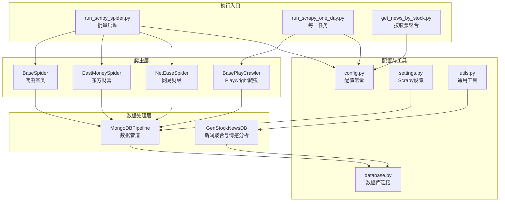
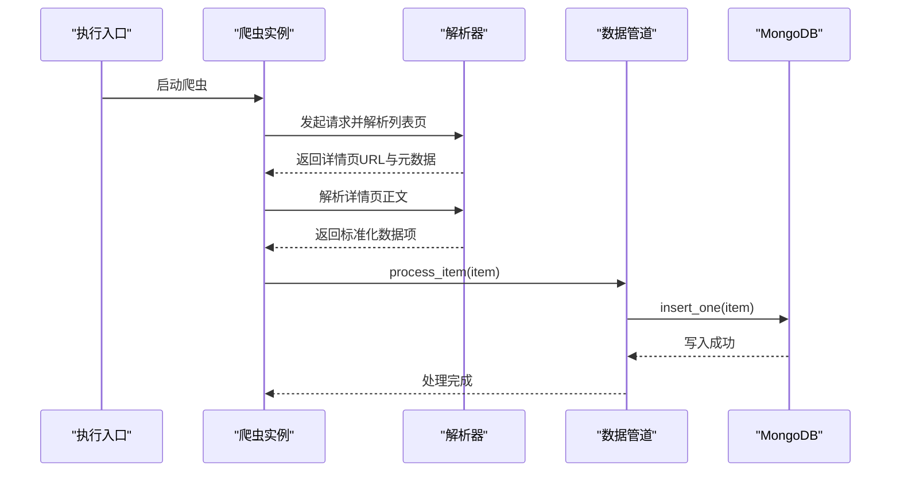
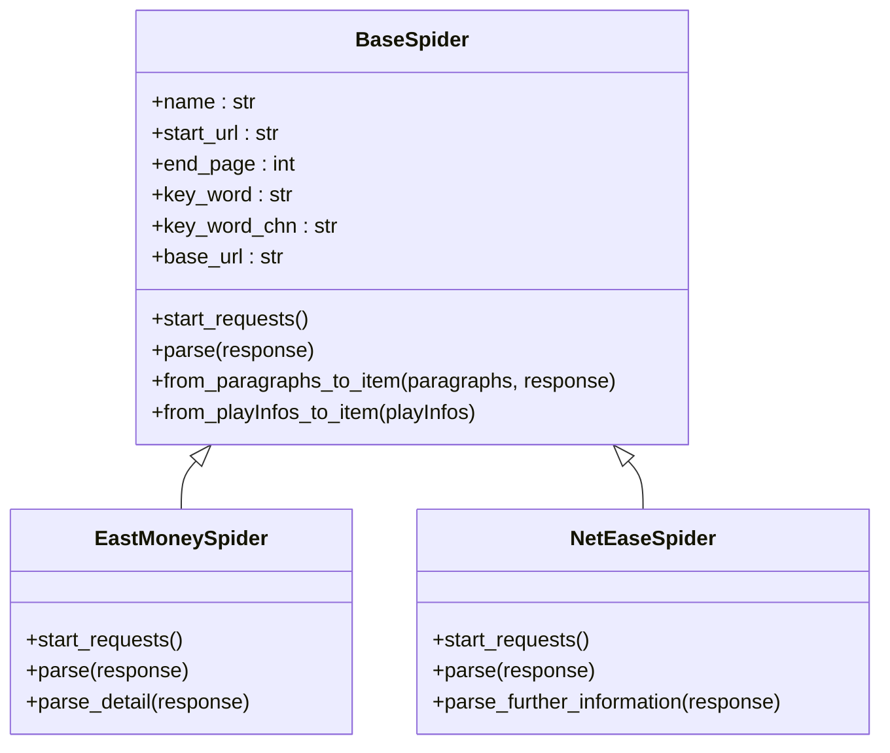
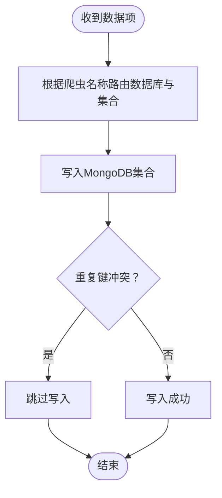
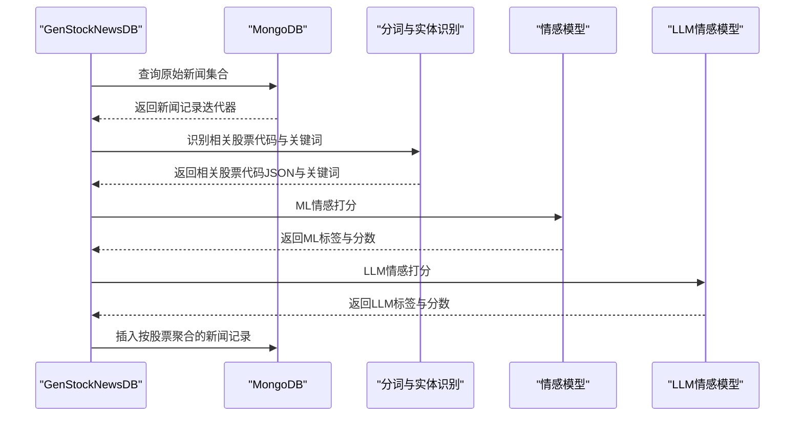
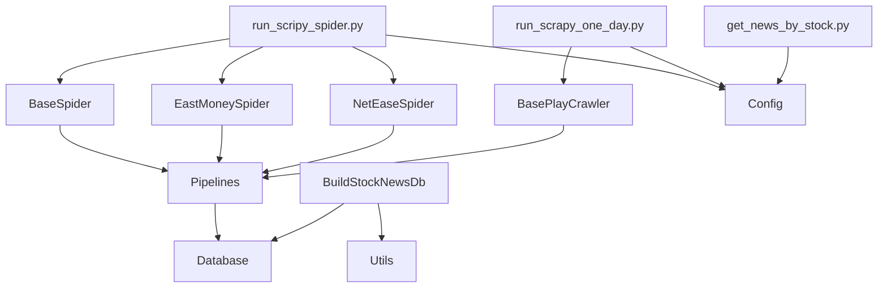

# API参考文档

<cite>
**本文档引用的文件**
- [README.md](file://README.md)
- [config.py](file://src/Utils/config.py)
- [database.py](file://src/Utils/database.py)
- [settings.py](file://src/settings.py)
- [pipelines.py](file://src/pipelines.py)
- [run_scripy_spider.py](file://src/run_scripy_spider.py)
- [run_scrapy_one_day.py](file://src/run_scrapy_one_day.py)
- [BaseSpider.py](file://src/MarketNewsSpiderWithScrapy/BaseSpider.py)
- [BasePlayCrawler.py](file://src/MarketNewsSpiderWithScrapy/BasePlayCrawler.py)
- [east_money_spider.py](file://src/MarketNewsSpiderWithScrapy/east_money_spider.py)
- [net_ease_spider.py](file://src/MarketNewsSpiderWithScrapy/net_ease_spider.py)
- [BuildStockNewsDb.py](file://src/MongoDbComTools/BuildStockNewsDb.py)
- [JointQuantTool.py](file://src/MongoDbComTools/JointQuantTool.py)
- [utils.py](file://src/Utils/utils.py)
- [get_news_by_stock.py](file://src/get_news_by_stock.py)
</cite>

## 目录
1. [简介](#简介)
2. [项目结构](#项目结构)
3. [核心组件](#核心组件)
4. [架构概览](#架构概览)
5. [详细组件分析](#详细组件分析)
6. [依赖关系分析](#依赖关系分析)
7. [性能考虑](#性能考虑)
8. [故障排除指南](#故障排除指南)
9. [结论](#结论)
10. [附录](#附录)

## 简介
本项目是一个面向股票新闻爬取与情感分析的综合系统，涵盖以下主要功能模块：
- 股票新闻爬取：基于Scrapy与Playwright框架，从多家财经媒体源抓取新闻内容。
- 新闻情感分析：结合传统机器学习与大语言模型对新闻进行情感打分与分类。
- 数据存储：通过MongoDB管道将爬取的数据持久化至数据库。
- 报告生成：按股票维度聚合新闻，生成情感统计与报告。

系统未提供HTTP或WebSocket接口，也未包含配置API或数据库API的直接REST端点；其对外交互主要通过命令行脚本与Scrapy爬虫调度器完成。本文档将基于现有代码结构，梳理可公开使用的接口与数据访问模式，帮助开发者正确使用系统能力。

## 项目结构
项目采用模块化组织方式，核心目录与职责如下：
- src/Utils：通用工具与配置，包括数据库连接、配置常量、通用函数等。
- src/MarketNewsSpiderWithScrapy：Scrapy爬虫基类与各媒体爬虫实现。
- src/MongoDbComTools：数据库工具与新闻聚合逻辑。
- src/NlpModel：自然语言处理模型与情感分析工具。
- src/ThirdPartyToolSurpriver：第三方工具支持。
- src/QuantAnalyze、src/MassBreak、src/ChanTechAnalyze、src/FundamentalMarketAnalyze：量化分析与技术分析相关模块。
- 根目录脚本：run_scripy_spider.py、run_scrapy_one_day.py等，用于批量启动爬虫与生成报告。

**图表来源**
- [run_scripy_spider.py:117-145](file://src/run_scripy_spider.py#L117-L145)
- [run_scrapy_one_day.py:32-80](file://src/run_scrapy_one_day.py#L32-L80)
- [BaseSpider.py:13-34](file://src/MarketNewsSpiderWithScrapy/BaseSpider.py#L13-L34)
- [pipelines.py:8-56](file://src/pipelines.py#L8-L56)
- [BuildStockNewsDb.py:19-53](file://src/MongoDbComTools/BuildStockNewsDb.py#L19-L53)
- [config.py:39-455](file://src/Utils/config.py#L39-L455)
- [database.py:36-176](file://src/Utils/database.py#L36-L176)
- [settings.py:32-47](file://src/settings.py#L32-L47)
- [utils.py:25-251](file://src/Utils/utils.py#L25-L251)

**章节来源**
- [README.md:1-33](file://README.md#L1-L33)
- [config.py:39-455](file://src/Utils/config.py#L39-L455)
- [settings.py:1-49](file://src/settings.py#L1-L49)

## 核心组件
本节概述系统中的关键组件及其职责：
- 爬虫基类与具体爬虫：提供统一的爬取流程、解析逻辑与数据项构造。
- 数据管道：负责将爬取结果写入MongoDB，按来源数据库与集合进行路由。
- 新闻聚合与情感分析：对新闻进行股票代码识别、情感打分与按股票归档。
- 配置管理：集中管理数据库连接、爬虫参数、模型路径等。
- 工具函数：提供日志、邮件发送、日期处理等通用能力。

**章节来源**
- [BaseSpider.py:13-149](file://src/MarketNewsSpiderWithScrapy/BaseSpider.py#L13-L149)
- [pipelines.py:8-56](file://src/pipelines.py#L8-L56)
- [BuildStockNewsDb.py:19-241](file://src/MongoDbComTools/BuildStockNewsDb.py#L19-L241)
- [config.py:39-455](file://src/Utils/config.py#L39-L455)
- [utils.py:25-251](file://src/Utils/utils.py#L25-L251)

## 架构概览
系统采用“爬虫-管道-存储”的三层架构：
- 爬虫层：通过Scrapy与Playwright实现异步与同步两种抓取模式，统一输出标准化数据项。
- 管道层：根据爬虫名称将数据路由到对应的数据库与集合，避免重复写入。
- 存储层：MongoDB作为主存储，支持新闻、股票基础信息与按股票聚合的结果集。

**图表来源**
- [run_scripy_spider.py:117-145](file://src/run_scripy_spider.py#L117-L145)
- [BaseSpider.py:38-98](file://src/MarketNewsSpiderWithScrapy/BaseSpider.py#L38-L98)
- [pipelines.py:25-56](file://src/pipelines.py#L25-L56)

## 详细组件分析

### 爬虫基类与具体爬虫
- BaseSpider：提供爬虫初始化、股票代码映射、文章解析与数据项构造逻辑，支持ML与LLM融合打分。
- EastMoneySpider：基于Playwright异步解析列表与详情页，适配东方财富新闻结构。
- NetEaseSpider：基于BeautifulSoup解析网易财经页面，提取标题、时间与正文。

**图表来源**
- [BaseSpider.py:13-149](file://src/MarketNewsSpiderWithScrapy/BaseSpider.py#L13-L149)
- [east_money_spider.py:5-78](file://src/MarketNewsSpiderWithScrapy/east_money_spider.py#L5-L78)
- [net_ease_spider.py:9-68](file://src/MarketNewsSpiderWithScrapy/net_ease_spider.py#L9-L68)

**章节来源**
- [BaseSpider.py:13-149](file://src/MarketNewsSpiderWithScrapy/BaseSpider.py#L13-L149)
- [east_money_spider.py:5-78](file://src/MarketNewsSpiderWithScrapy/east_money_spider.py#L5-L78)
- [net_ease_spider.py:9-68](file://src/MarketNewsSpiderWithScrapy/net_ease_spider.py#L9-L68)

### 数据管道与存储
- MongoDBPipeline：根据爬虫名称将数据写入对应数据库与集合，避免重复键冲突。
- 数据项字段：包含URL、标题、日期、正文、相关股票代码JSON、关键词频次、分类、情感标签与分数等。

**图表来源**
- [pipelines.py:25-56](file://src/pipelines.py#L25-L56)

**章节来源**
- [pipelines.py:8-56](file://src/pipelines.py#L8-L56)

### 新闻聚合与情感分析
- GenStockNewsDB：负责将新闻按股票代码归档至“按股票聚合”的数据库，支持ML与LLM情感打分融合，生成报告与统计。

**图表来源**
- [BuildStockNewsDb.py:19-241](file://src/MongoDbComTools/BuildStockNewsDb.py#L19-L241)

**章节来源**
- [BuildStockNewsDb.py:19-241](file://src/MongoDbComTools/BuildStockNewsDb.py#L19-L241)

### 配置管理
- config.py：集中管理数据库名称、集合名称、爬虫配置字典、模型路径、设备类型等。
- settings.py：Scrapy项目设置，包括并发、下载延迟、中间件与管道等。

**章节来源**
- [config.py:39-455](file://src/Utils/config.py#L39-L455)
- [settings.py:1-49](file://src/settings.py#L1-L49)

### 工具函数
- utils.py：提供日志、邮件发送、日期范围生成、中文文本处理等通用能力。

**章节来源**
- [utils.py:25-251](file://src/Utils/utils.py#L25-L251)

## 依赖关系分析
系统内部依赖关系清晰，模块间耦合度较低：
- 爬虫依赖BaseSpider与配置，输出标准化数据项。
- 管道依赖配置与数据库连接，负责数据写入。
- 新闻聚合依赖数据库与NLP模型，负责情感分析与归档。
- 执行入口脚本负责调度爬虫与聚合任务。

**图表来源**
- [run_scripy_spider.py:117-145](file://src/run_scripy_spider.py#L117-L145)
- [run_scrapy_one_day.py:32-80](file://src/run_scrapy_one_day.py#L32-L80)
- [pipelines.py:8-56](file://src/pipelines.py#L8-L56)
- [BuildStockNewsDb.py:19-53](file://src/MongoDbComTools/BuildStockNewsDb.py#L19-L53)
- [config.py:39-455](file://src/Utils/config.py#L39-L455)

**章节来源**
- [run_scripy_spider.py:117-145](file://src/run_scripy_spider.py#L117-L145)
- [run_scrapy_one_day.py:32-80](file://src/run_scrapy_one_day.py#L32-L80)
- [pipelines.py:8-56](file://src/pipelines.py#L8-L56)
- [BuildStockNewsDb.py:19-53](file://src/MongoDbComTools/BuildStockNewsDb.py#L19-L53)
- [config.py:39-455](file://src/Utils/config.py#L39-L455)

## 性能考虑
- 并发与限速：settings.py中设置了较高的并发请求与下载延迟，建议根据目标站点的反爬策略调整。
- 数据库连接池：database.py中配置了较大的连接池上限，注意MongoDB服务器资源限制。
- 异步爬取：BasePlayCrawler使用Playwright异步解析，提升列表页与详情页抓取效率。
- 情感分析：ML与LLM双模型融合打分，建议在生产环境评估推理延迟与资源占用。

[本节为通用指导，无需特定文件引用]

## 故障排除指南
- 数据库连接异常：检查MONGODB_IP与MONGODB_PORT配置，确认网络连通性与认证设置。
- 爬虫超时：适当增加等待选择器的超时时间，或调整列表页加载策略。
- 重复数据：MongoDBPipeline已处理重复键冲突，若仍出现重复，检查唯一索引与数据项ID生成逻辑。
- 情感模型加载失败：确认LLM_MODEL_PATH与设备类型配置正确，确保模型文件存在且可读。

**章节来源**
- [database.py:44-60](file://src/Utils/database.py#L44-L60)
- [pipelines.py:48-56](file://src/pipelines.py#L48-L56)
- [utils.py:30-58](file://src/Utils/utils.py#L30-L58)

## 结论
本系统通过模块化的爬虫、管道与存储架构，实现了从多源财经媒体抓取新闻、进行情感分析与按股票归档的完整流程。虽然未提供HTTP或WebSocket接口，但通过脚本化调度与配置化管理，开发者可以灵活扩展与定制爬虫任务与分析流程。建议在生产环境中关注并发与限速策略、数据库连接池配置以及情感模型的推理性能。

[本节为总结性内容，无需特定文件引用]

## 附录

### 执行入口与参数
- 批量启动爬虫：python run_scripy_spider.py [all|nbd|east_money|zhongjin|shanghai]
- 每日任务：python run_scrapy_one_day.py -s [爬虫类别] -r [报告天数]
- 按股票聚合：python get_news_by_stock.py

**章节来源**
- [run_scripy_spider.py:117-145](file://src/run_scripy_spider.py#L117-L145)
- [run_scrapy_one_day.py:32-80](file://src/run_scrapy_one_day.py#L32-L80)
- [get_news_by_stock.py:13-21](file://src/get_news_by_stock.py#L13-L21)

### 数据库与集合命名约定
- 股票基础信息集合：stock数据库下的zh_stock_basic_info_test等。
- 新闻聚合集合：按股票代码生成的集合名（如sh600000、sz000001）。
- 爬虫数据集合：各媒体数据库下的[data]集合（如jqka_data、jrj_data等）。

**章节来源**
- [config.py:39-48](file://src/Utils/config.py#L39-L48)
- [pipelines.py:25-46](file://src/pipelines.py#L25-L46)

### 爬虫配置字典
- 各媒体爬虫的配置字典包含name、start_url、key_word、key_word_chn、base_url、end_page等字段，用于初始化爬虫实例。

**章节来源**
- [config.py:56-450](file://src/Utils/config.py#L56-L450)

### 认证与权限
- 系统未提供HTTP认证与权限控制接口。数据库连接使用加密密钥解密后的凭证，建议在部署环境中妥善保管密钥与网络访问控制。

**章节来源**
- [database.py:44-60](file://src/Utils/database.py#L44-L60)
- [JointQuantTool.py:26-34](file://src/MongoDbComTools/JointQuantTool.py#L26-L34)