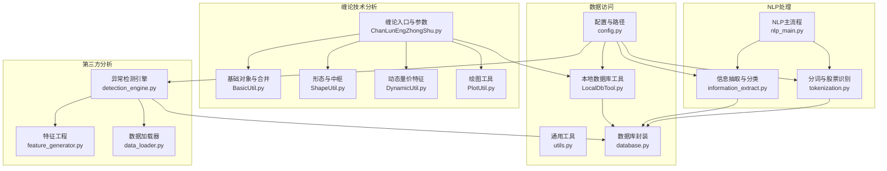
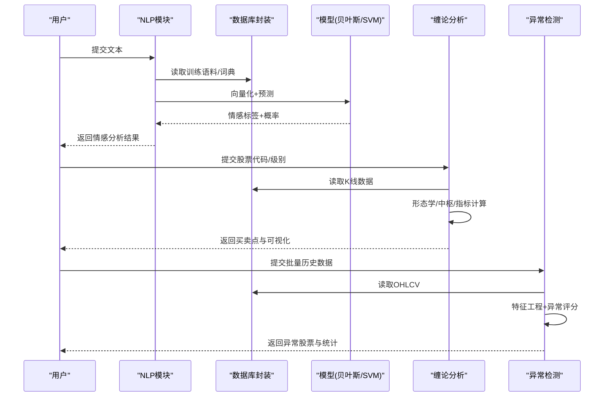
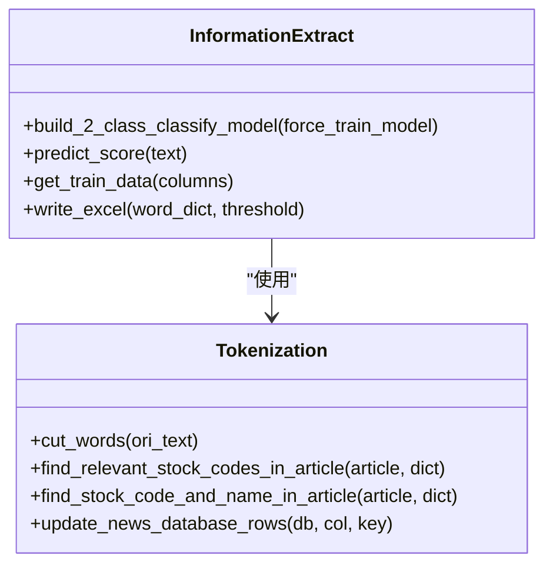
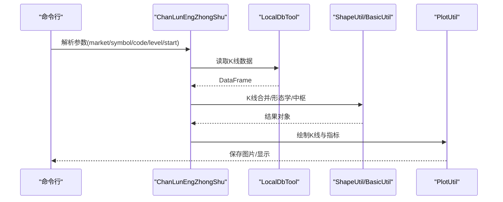
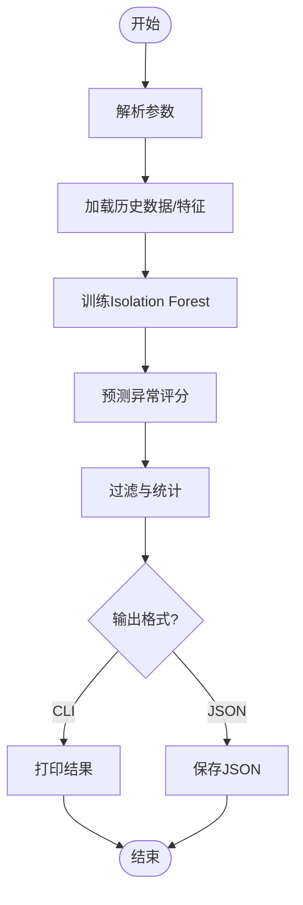
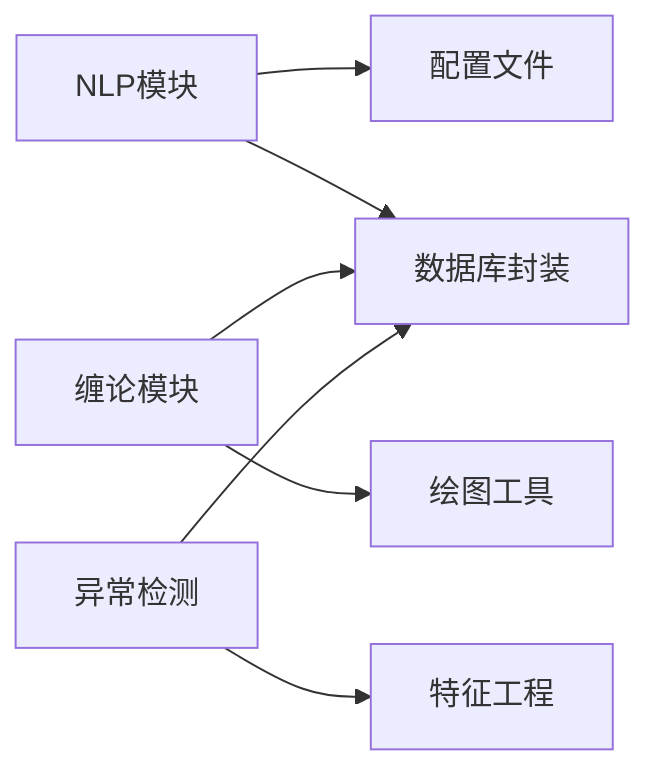

# 分析API

<cite>
**本文引用的文件**
- [README.md](file://README.md)
- [nlp_main.py](file://src/NlpModel/nlp_main.py)
- [information_extract.py](file://src/NlpModel/information_extract.py)
- [tokenization.py](file://src/NlpModel/tokenization.py)
- [ChanLunEngZhongShu.py](file://src/ChanTechAnalyze/ChanLunEngZhongShu.py)
- [BasicUtil.py](file://src/ChanUtils/BasicUtil.py)
- [ShapeUtil.py](file://src/ChanUtils/ShapeUtil.py)
- [DynamicUtil.py](file://src/ChanUtils/DynamicUtil.py)
- [PlotUtil.py](file://src/ChanUtils/PlotUtil.py)
- [LocalDbTool.py](file://src/MongoDbComTools/LocalDbTool.py)
- [config.py](file://src/Utils/config.py)
- [utils.py](file://src/Utils/utils.py)
- [database.py](file://src/Utils/database.py)
- [detection_engine.py](file://src/ThirdPartyToolSurpriver/detection_engine.py)
- [data_loader.py](file://src/ThirdPartyToolSurpriver/data_loader.py)
- [feature_generator.py](file://src/ThirdPartyToolSurpriver/feature_generator.py)
</cite>

## 目录
1. [简介](#简介)
2. [项目结构](#项目结构)
3. [核心组件](#核心组件)
4. [架构总览](#架构总览)
5. [详细组件分析](#详细组件分析)
6. [依赖分析](#依赖分析)
7. [性能考量](#性能考量)
8. [故障排查指南](#故障排查指南)
9. [结论](#结论)
10. [附录](#附录)

## 简介
本文件面向“分析API”的技术文档，系统梳理仓库中自然语言处理（NLP）、金融分析（缠论技术分析、异常检测与量价特征）、模型加载与缓存、以及数据访问层的接口与使用方式。文档覆盖情感分析、股票代码识别、文本分类等NLP能力；缠论技术分析的参数配置与结果解释；传统机器学习与深度学习模型的调用路径；以及批量与流式处理的建议方案。为保证可读性，文档以“概念—接口—流程—示例”的方式组织，并辅以多种可视化图表映射到实际源码。

## 项目结构
项目主要由以下模块组成：
- NlpModel：NLP文本处理与分类、情感分析、关键词抽取与股票代码识别
- ChanTechAnalyze：缠论技术分析入口与可视化
- ChanUtils：缠论基础工具、形态学、动态量价特征、绘图
- MongoDbComTools：本地数据库工具，提供日线/周线/分钟线数据获取
- Utils：通用配置、数据库封装、工具函数
- ThirdPartyToolSurpriver：第三方异常检测工具（Isolation Forest），提供量价特征工程与批量预测

**图表来源**
- [nlp_main.py:1-70](file://src/NlpModel/nlp_main.py#L1-L70)
- [information_extract.py:1-424](file://src/NlpModel/information_extract.py#L1-L424)
- [tokenization.py:1-169](file://src/NlpModel/tokenization.py#L1-L169)
- [ChanLunEngZhongShu.py:1-185](file://src/ChanTechAnalyze/ChanLunEngZhongShu.py#L1-L185)
- [BasicUtil.py:1-695](file://src/ChanUtils/BasicUtil.py#L1-L695)
- [ShapeUtil.py:1-800](file://src/ChanUtils/ShapeUtil.py#L1-L800)
- [DynamicUtil.py:1-141](file://src/ChanUtils/DynamicUtil.py#L1-L141)
- [PlotUtil.py:1-150](file://src/ChanUtils/PlotUtil.py#L1-L150)
- [LocalDbTool.py:1-288](file://src/MongoDbComTools/LocalDbTool.py#L1-L288)
- [config.py:1-455](file://src/Utils/config.py#L1-L455)
- [utils.py:1-251](file://src/Utils/utils.py#L1-L251)
- [database.py:1-176](file://src/Utils/database.py#L1-L176)
- [detection_engine.py:1-599](file://src/ThirdPartyToolSurpriver/detection_engine.py#L1-L599)
- [data_loader.py:1-293](file://src/ThirdPartyToolSurpriver/data_loader.py#L1-L293)
- [feature_generator.py:1-186](file://src/ThirdPartyToolSurpriver/feature_generator.py#L1-L186)

**章节来源**
- [README.md:1-33](file://README.md#L1-L33)

## 核心组件
- NLP文本处理与情感分析
  - 二分类模型（朴素贝叶斯、SVM）加载与预测，支持文本情感倾向与置信度输出
  - 关键词抽取与停用词过滤，支持自定义金融词典
  - 股票代码识别：基于分词与股票名称字典匹配，输出相关股票列表
- 缠论技术分析
  - K线合并、顶底分型、笔、线段、中枢生成与可视化
  - MACD、布林带等技术指标叠加，支持周线/日线/分钟线级别
  - 买卖点有效性判定（金叉、柱状变化、中枢强度）
- 第三方异常检测
  - Isolation Forest异常评分，结合量价特征与未来收益统计
  - 支持批量预测与结果导出（CLI/JSON）

**章节来源**
- [information_extract.py:26-424](file://src/NlpModel/information_extract.py#L26-L424)
- [tokenization.py:11-169](file://src/NlpModel/tokenization.py#L11-L169)
- [ChanLunEngZhongShu.py:26-185](file://src/ChanTechAnalyze/ChanLunEngZhongShu.py#L26-L185)
- [ShapeUtil.py:22-530](file://src/ChanUtils/ShapeUtil.py#L22-L530)
- [detection_engine.py:158-599](file://src/ThirdPartyToolSurpriver/detection_engine.py#L158-L599)

## 架构总览
分析API的总体调用链路如下：
- NLP侧：文本输入 → 分词与清洗 → TF-IDF向量化 → 多模型融合预测 → 输出情感标签与置信度
- 缠论侧：日线/周线/分钟线数据 → K线合并与形态学处理 → 技术指标计算 → 买卖点判定 → 结果可视化
- 异常检测侧：批量历史数据 → 特征工程 → 异常评分 → 统计未来收益 → 结果输出

**图表来源**
- [nlp_main.py:17-70](file://src/NlpModel/nlp_main.py#L17-L70)
- [information_extract.py:219-338](file://src/NlpModel/information_extract.py#L219-L338)
- [ChanLunEngZhongShu.py:83-185](file://src/ChanTechAnalyze/ChanLunEngZhongShu.py#L83-L185)
- [detection_engine.py:272-427](file://src/ThirdPartyToolSurpriver/detection_engine.py#L272-L427)

## 详细组件分析

### NLP情感分析与文本分类API
- 接口职责
  - 加载持久化的贝叶斯与SVM模型
  - 文本预处理（分词、去停用词、数字与标点清理）
  - TF-IDF向量化与多模型融合打分
  - 输出情感类别与置信度
- 关键流程
  - 初始化：加载分词器、停用词、金融词典、模型与向量化器
  - 训练流程：筛选标签、划分训练/测试集、向量化、训练并持久化
  - 预测流程：分词→向量化→模型预测→融合得分→返回结果
- 数据格式
  - 输入：纯文本字符串
  - 输出：情感类别（利好/利空）与置信度数值
- 批量/流式建议
  - 批量：将文本列表转为DataFrame，统一分词与向量化，再批量预测
  - 流式：按批次读取文本，逐批预测并聚合结果

**图表来源**
- [information_extract.py:26-424](file://src/NlpModel/information_extract.py#L26-L424)
- [tokenization.py:11-169](file://src/NlpModel/tokenization.py#L11-L169)

**章节来源**
- [information_extract.py:26-424](file://src/NlpModel/information_extract.py#L26-L424)
- [tokenization.py:11-169](file://src/NlpModel/tokenization.py#L11-L169)
- [nlp_main.py:17-70](file://src/NlpModel/nlp_main.py#L17-L70)

### 股票代码识别API
- 功能
  - 从新闻文本中识别相关股票代码与名称
  - 基于分词统计与股票名称字典匹配
- 接口
  - find_relevant_stock_codes_in_article(article, stock_name_code_dict)
  - find_stock_code_and_name_in_article(article, stock_name_code_dict)
- 输出
  - 股票代码列表（JSON字符串）
  - 分词词频统计（JSON字符串）

**章节来源**
- [tokenization.py:27-75](file://src/NlpModel/tokenization.py#L27-L75)

### 缠论技术分析API
- 参数与入口
  - 市场类型：cn/hk/us/uszh
  - 股票标识：symbol 或 code
  - 时间级别：daily/week/30m/15m
  - 起始日期：start
- 核心流程
  - 读取K线数据（日线/周线/分钟线）
  - K线合并与形态学处理（顶底分型、笔、线段）
  - 技术指标（MACD、布林带）
  - 中枢生成与买卖点判定
  - 可视化输出
- 返回值
  - 买卖点有效性、金叉时间、最近顶/底时间、柱状方差、中枢强度等

**图表来源**
- [ChanLunEngZhongShu.py:30-185](file://src/ChanTechAnalyze/ChanLunEngZhongShu.py#L30-L185)
- [LocalDbTool.py:96-276](file://src/MongoDbComTools/LocalDbTool.py#L96-L276)
- [ShapeUtil.py:22-375](file://src/ChanUtils/ShapeUtil.py#L22-L375)
- [PlotUtil.py:15-125](file://src/ChanUtils/PlotUtil.py#L15-L125)

**章节来源**
- [ChanLunEngZhongShu.py:26-185](file://src/ChanTechAnalyze/ChanLunEngZhongShu.py#L26-L185)
- [ShapeUtil.py:22-530](file://src/ChanUtils/ShapeUtil.py#L22-L530)
- [BasicUtil.py:11-695](file://src/ChanUtils/BasicUtil.py#L11-L695)
- [DynamicUtil.py:8-141](file://src/ChanUtils/DynamicUtil.py#L8-L141)
- [PlotUtil.py:15-150](file://src/ChanUtils/PlotUtil.py#L15-L150)
- [LocalDbTool.py:10-288](file://src/MongoDbComTools/LocalDbTool.py#L10-L288)

### 第三方异常检测API（Isolation Forest）
- 功能
  - 基于量价特征的异常评分
  - 支持批量预测与未来收益统计
  - 支持CLI/JSON输出
- 关键参数
  - top_n：输出前N个异常股票
  - min_volume：最小成交量过滤
  - history_to_use：历史窗口长度
  - data_granularity_minutes：分钟粒度（1/5/10/15/30/60）
  - is_test/future_bars：测试模式与未来窗口
  - volatility_filter：波动率阈值
  - output_format：CLI/JSON
  - stock_list：待检测股票清单
- 输出
  - 异常评分、成交量统计、波动率、未来绝对收益等

**图表来源**
- [detection_engine.py:24-118](file://src/ThirdPartyToolSurpriver/detection_engine.py#L24-L118)
- [detection_engine.py:272-427](file://src/ThirdPartyToolSurpriver/detection_engine.py#L272-L427)
- [data_loader.py:148-224](file://src/ThirdPartyToolSurpriver/data_loader.py#L148-L224)
- [feature_generator.py:31-161](file://src/ThirdPartyToolSurpriver/feature_generator.py#L31-L161)

**章节来源**
- [detection_engine.py:158-599](file://src/ThirdPartyToolSurpriver/detection_engine.py#L158-L599)
- [data_loader.py:16-293](file://src/ThirdPartyToolSurpriver/data_loader.py#L16-L293)
- [feature_generator.py:11-186](file://src/ThirdPartyToolSurpriver/feature_generator.py#L11-L186)

## 依赖分析
- 组件耦合
  - NLP模块依赖数据库封装与配置文件，模型持久化文件位于info目录
  - 缠论模块依赖本地数据库工具与绘图工具
  - 异常检测模块依赖特征工程与数据库封装
- 外部依赖
  - MongoDB：数据存储与查询
  - pandas/numpy/scikit-learn：数据处理与机器学习
  - ta/mplfinance：技术分析与绘图
  - joblib：模型序列化

**图表来源**
- [config.py:1-455](file://src/Utils/config.py#L1-L455)
- [database.py:36-176](file://src/Utils/database.py#L36-L176)
- [detection_engine.py:10-14](file://src/ThirdPartyToolSurpriver/detection_engine.py#L10-L14)
- [feature_generator.py:1-11](file://src/ThirdPartyToolSurpriver/feature_generator.py#L1-L11)

**章节来源**
- [config.py:1-455](file://src/Utils/config.py#L1-L455)
- [database.py:36-176](file://src/Utils/database.py#L36-L176)

## 性能考量
- 模型加载与缓存
  - 使用joblib持久化模型与向量化器，启动时自动加载，避免重复训练
  - 建议在进程内复用模型实例，减少IO与反序列化开销
- 数据访问
  - 数据库连接池与自动重连机制，降低网络抖动影响
  - 批量查询与分页策略，控制单次请求数据量
- 并发处理
  - 异常检测支持批量特征工程与预测，建议按股票分片并行
  - NLP预测可采用批处理队列，结合多进程/线程提升吞吐
- 可视化与I/O
  - 绘图操作建议异步执行或延迟触发，避免阻塞主线程

**章节来源**
- [information_extract.py:97-107](file://src/NlpModel/information_extract.py#L97-L107)
- [database.py:15-34](file://src/Utils/database.py#L15-L34)
- [detection_engine.py:297-304](file://src/ThirdPartyToolSurpriver/detection_engine.py#L297-L304)

## 故障排查指南
- 数据库连接失败
  - 检查MONGODB_IP/PORT与网络连通性
  - 观察自动重连日志与等待时间
- 模型加载失败
  - 确认模型文件路径与权限
  - 检查joblib版本兼容性
- 缠论分析无结果
  - 确认K线数据非空且包含足够交易日
  - 检查时间级别与数据粒度匹配
- 异常检测无输出
  - 检查股票清单文件路径与内容
  - 调整volatility_filter/min_volume等阈值

**章节来源**
- [database.py:44-60](file://src/Utils/database.py#L44-L60)
- [information_extract.py:97-107](file://src/NlpModel/information_extract.py#L97-L107)
- [ChanLunEngZhongShu.py:130-132](file://src/ChanTechAnalyze/ChanLunEngZhongShu.py#L130-L132)
- [detection_engine.py:126-156](file://src/ThirdPartyToolSurpriver/detection_engine.py#L126-L156)

## 结论
本分析API体系整合了NLP情感分析、缠论技术分析与第三方异常检测三大能力，具备完善的模型加载、数据访问与可视化输出能力。通过合理的参数配置与性能优化策略，可在生产环境中实现稳定高效的批量与流式分析。

## 附录
- 实际调用示例（路径指引）
  - NLP情感分析：[nlp_main.py:21-30](file://src/NlpModel/nlp_main.py#L21-L30)
  - 股票代码识别：[tokenization.py:27-75](file://src/NlpModel/tokenization.py#L27-L75)
  - 缠论分析入口：[ChanLunEngZhongShu.py:26-66](file://src/ChanTechAnalyze/ChanLunEngZhongShu.py#L26-L66)
  - 异常检测引擎：[detection_engine.py:592-599](file://src/ThirdPartyToolSurpriver/detection_engine.py#L592-L599)