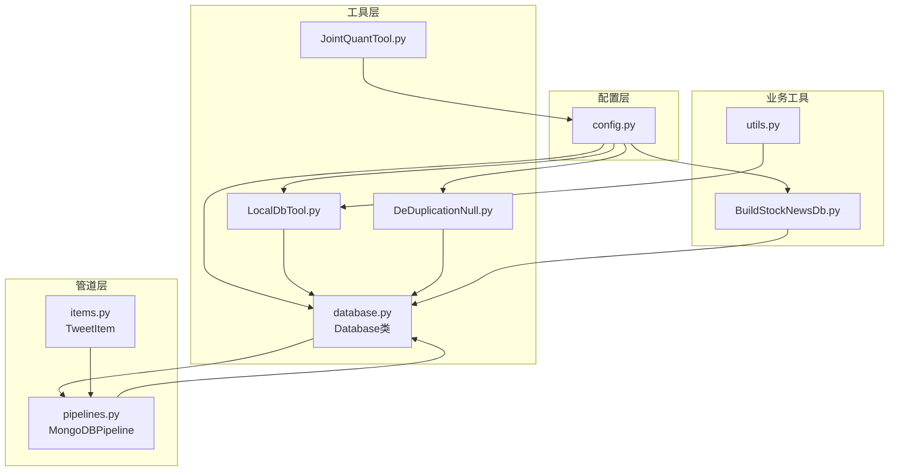
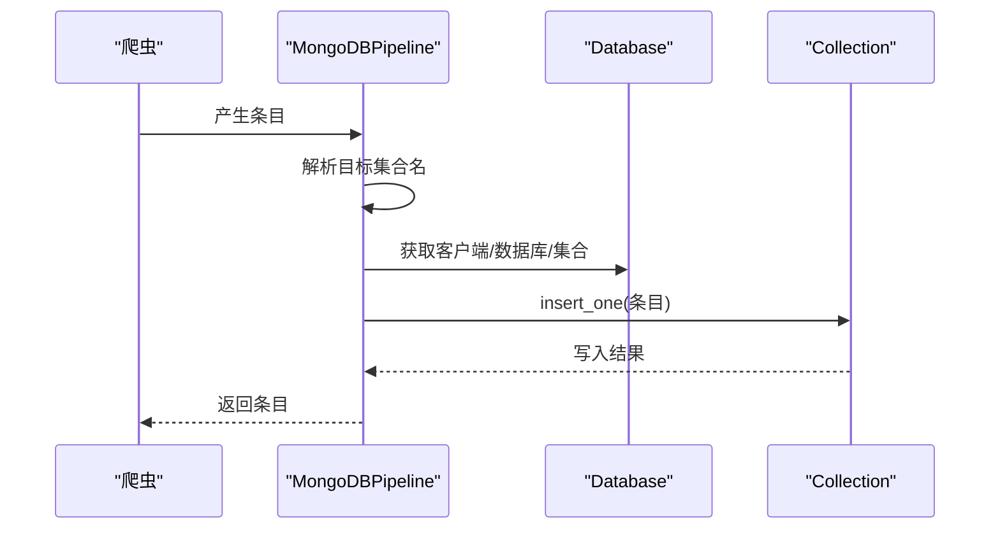
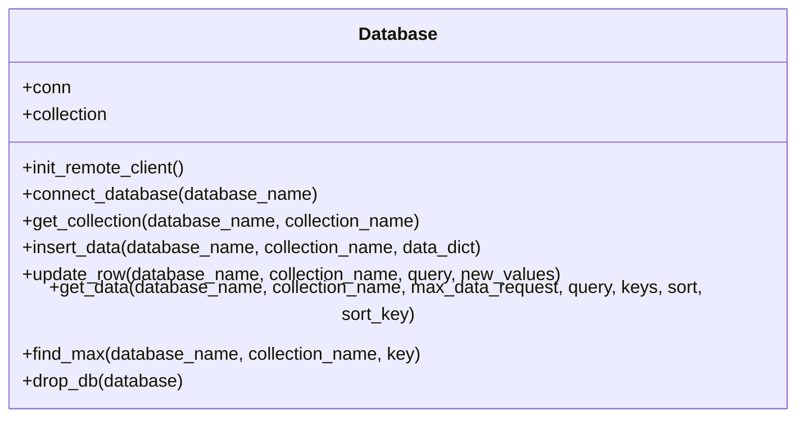
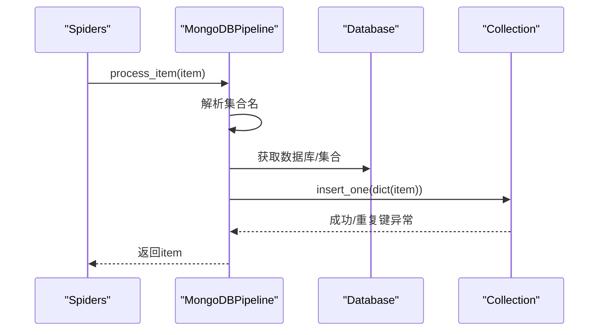
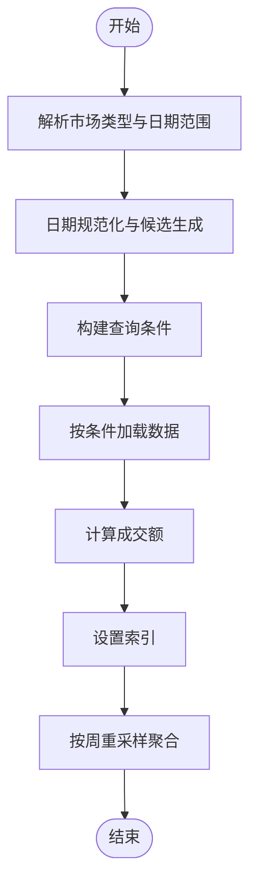
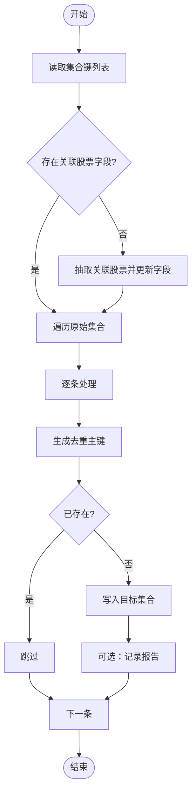
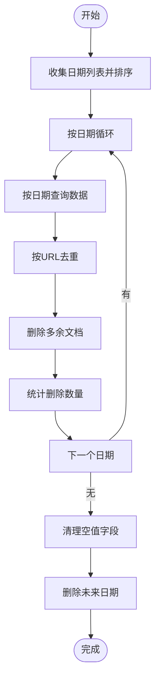
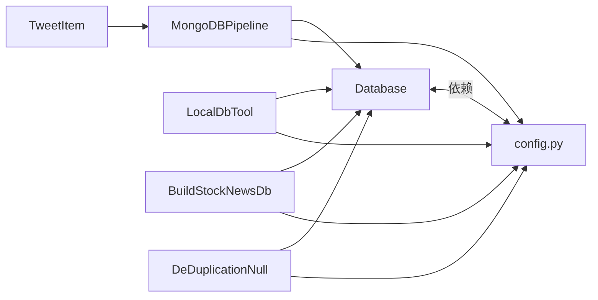

# 数据库API

<cite>
**本文引用的文件**
- [database.py](file://src/Utils/database.py)
- [LocalDbTool.py](file://src/MongoDbComTools/LocalDbTool.py)
- [config.py](file://src/Utils/config.py)
- [pipelines.py](file://src/pipelines.py)
- [BuildStockNewsDb.py](file://src/MongoDbComTools/BuildStockNewsDb.py)
- [DeDuplicationNull.py](file://src/MongoDbComTools/DeDuplicationNull.py)
- [JointQuantTool.py](file://src/MongoDbComTools/JointQuantTool.py)
- [items.py](file://src/Utils/items.py)
- [utils.py](file://src/Utils/utils.py)
</cite>

## 目录
1. [简介](#简介)
2. [项目结构](#项目结构)
3. [核心组件](#核心组件)
4. [架构总览](#架构总览)
5. [详细组件分析](#详细组件分析)
6. [依赖关系分析](#依赖关系分析)
7. [性能考量](#性能考量)
8. [故障排查指南](#故障排查指南)
9. [结论](#结论)
10. [附录](#附录)

## 简介
本文件面向数据库API的技术文档，聚焦于MongoDB数据库操作接口与最佳实践，覆盖连接建立、CRUD操作、集合与索引、数据去重与清洗、事务与连接池、错误处理与异常管理、性能优化与调优建议，以及数据备份与恢复的思路。文档以仓库中的数据库工具与管道实现为基础，结合配置与数据模型，提供可操作的API规范与流程图示。

## 项目结构
数据库相关代码主要分布在以下模块：
- 工具层：数据库连接与通用CRUD封装
- 管道层：Scrapy数据写入MongoDB的流水线
- 工具类：本地数据库查询、去重、空值清理、时间校验
- 配置层：数据库名称、集合名称、主机与端口、加密密钥等
- 数据模型：Scrapy Item定义

图表来源
- [config.py:1-455](file://src/Utils/config.py#L1-L455)
- [database.py:36-176](file://src/Utils/database.py#L36-L176)
- [LocalDbTool.py:10-288](file://src/MongoDbComTools/LocalDbTool.py#L10-L288)
- [pipelines.py:8-56](file://src/pipelines.py#L8-L56)
- [BuildStockNewsDb.py:19-241](file://src/MongoDbComTools/BuildStockNewsDb.py#L19-L241)
- [DeDuplicationNull.py:15-122](file://src/MongoDbComTools/DeDuplicationNull.py#L15-L122)
- [JointQuantTool.py:11-51](file://src/MongoDbComTools/JointQuantTool.py#L11-L51)
- [items.py:5-18](file://src/Utils/items.py#L5-L18)
- [utils.py:100-125](file://src/Utils/utils.py#L100-L125)

章节来源
- [config.py:1-455](file://src/Utils/config.py#L1-L455)
- [database.py:36-176](file://src/Utils/database.py#L36-L176)
- [LocalDbTool.py:10-288](file://src/MongoDbComTools/LocalDbTool.py#L10-L288)
- [pipelines.py:8-56](file://src/pipelines.py#L8-L56)
- [BuildStockNewsDb.py:19-241](file://src/MongoDbComTools/BuildStockNewsDb.py#L19-L241)
- [DeDuplicationNull.py:15-122](file://src/MongoDbComTools/DeDuplicationNull.py#L15-L122)
- [JointQuantTool.py:11-51](file://src/MongoDbComTools/JointQuantTool.py#L11-L51)
- [items.py:5-18](file://src/Utils/items.py#L5-L18)
- [utils.py:100-125](file://src/Utils/utils.py#L100-L125)

## 核心组件
- Database类：封装MongoDB连接、数据库与集合选择、CRUD操作、自动重连装饰器、数据导出为DataFrame等。
- MongoDBPipeline：Scrapy管道，按爬虫类型将条目写入对应数据库与集合，处理重复键异常。
- LocalDbTool：本地数据库查询工具，支持多市场（A/H/US）基础信息与日线数据查询、日期规范化与查询候选生成、按日期范围聚合周线数据。
- BuildStockNewsDb：按股票维度汇总新闻，生成去重主键，写入“所有股票新闻”集合。
- DeDuplicationNull：按日期分片对URL进行去重；清理空值字段；删除未来日期数据。
- JointQuantTool：认证并获取全市场股票清单（用于数据准备与验证）。
- 配置与数据模型：集中定义数据库名、集合名、主机端口、加密密钥、爬虫数据库映射、Scrapy Item字段。

章节来源
- [database.py:36-176](file://src/Utils/database.py#L36-L176)
- [pipelines.py:8-56](file://src/pipelines.py#L8-L56)
- [LocalDbTool.py:10-288](file://src/MongoDbComTools/LocalDbTool.py#L10-L288)
- [BuildStockNewsDb.py:19-241](file://src/MongoDbComTools/BuildStockNewsDb.py#L19-L241)
- [DeDuplicationNull.py:15-122](file://src/MongoDbComTools/DeDuplicationNull.py#L15-L122)
- [JointQuantTool.py:11-51](file://src/MongoDbComTools/JointQuantTool.py#L11-L51)
- [config.py:13-49](file://src/Utils/config.py#L13-L49)
- [items.py:5-18](file://src/Utils/items.py#L5-L18)

## 架构总览
数据库API围绕Database类展开，统一管理连接、集合选择与CRUD操作；Scrapy通过MongoDBPipeline将爬虫产出写入MongoDB；LocalDbTool提供查询与聚合能力；BuildStockNewsDb负责跨库新闻归集；DeDuplicationNull负责数据清洗与去重；配置与数据模型贯穿各模块。

图表来源
- [pipelines.py:25-56](file://src/pipelines.py#L25-L56)
- [database.py:61-69](file://src/Utils/database.py#L61-L69)

## 详细组件分析

### Database类（连接与CRUD）
- 连接建立
  - 使用MongoClient初始化，设置超时与连接池大小参数。
  - 支持自动重连装饰器，指数退避重试，降低网络抖动影响。
- 数据库与集合
  - 提供数据库与集合选择方法，便于后续CRUD。
- CRUD接口
  - 插入：单条插入。
  - 查询：支持条件查询、键子集投影、最大返回条数限制、排序。
  - 更新：单条更新，使用$set。
  - 删除：提供删除数据库方法。
  - 最大值查询：按指定键降序取第一条的键值。
- 导出为DataFrame：查询结果转为DataFrame，支持排序。

图表来源
- [database.py:36-176](file://src/Utils/database.py#L36-L176)

章节来源
- [database.py:36-176](file://src/Utils/database.py#L36-L176)

### MongoDBPipeline（写入流水线）
- 功能
  - 根据爬虫名称映射到对应的数据库与集合，执行单条插入。
  - 捕获重复键异常，避免重复写入。
- 使用场景
  - 多个新闻源的Scrapy爬虫统一写入MongoDB。

图表来源
- [pipelines.py:25-56](file://src/pipelines.py#L25-L56)
- [database.py:61-69](file://src/Utils/database.py#L61-L69)

章节来源
- [pipelines.py:8-56](file://src/pipelines.py#L8-L56)

### LocalDbTool（本地查询与聚合）
- 多市场基础信息与日线数据查询
  - 支持按股票代码或符号查询基础信息。
  - 支持按日期范围查询日线数据，生成日期候选，构建查询条件。
  - 对HK市场按日期时间索引，对CN/US按日期字符串索引。
- 周线聚合
  - 将日线数据按周采样，聚合开盘/收盘/最高/最低/成交量/成交额。
- 日期规范化与查询候选
  - 支持多种日期格式输入，生成标准化候选，提升查询命中率。

图表来源
- [LocalDbTool.py:127-276](file://src/MongoDbComTools/LocalDbTool.py#L127-L276)

章节来源
- [LocalDbTool.py:10-288](file://src/MongoDbComTools/LocalDbTool.py#L10-L288)

### BuildStockNewsDb（按股票汇总新闻）
- 功能
  - 从原始新闻集合中提取关联股票，按股票代码生成集合名，写入“所有股票新闻”集合。
  - 生成MD5作为去重主键，避免重复写入。
  - 可选使用模型更新情感标签与分数。
- 关键点
  - 去重主键规则：日期+URL的MD5。
  - 写入字段包含来源数据库/集合、股票代码/名称、标题/正文、标签/分数等。

图表来源
- [BuildStockNewsDb.py:157-241](file://src/MongoDbComTools/BuildStockNewsDb.py#L157-L241)

章节来源
- [BuildStockNewsDb.py:19-241](file://src/MongoDbComTools/BuildStockNewsDb.py#L19-L241)

### DeDuplicationNull（去重与清洗）
- 去重
  - 按日期分片，对URL进行去重，删除重复文档。
- 清理空值
  - 遍历集合，删除非关联字段为空的文档。
- 时间校正
  - 删除日期在未来（大于当前日期）的文档。

图表来源
- [DeDuplicationNull.py:22-114](file://src/MongoDbComTools/DeDuplicationNull.py#L22-L114)

章节来源
- [DeDuplicationNull.py:15-122](file://src/MongoDbComTools/DeDuplicationNull.py#L15-L122)

### JointQuantTool（数据准备）
- 功能
  - 使用加密凭证认证，获取全市场股票清单，用于数据准备与验证。
- 注意
  - 凭证存储采用对称加密，需确保密钥安全。

章节来源
- [JointQuantTool.py:11-51](file://src/MongoDbComTools/JointQuantTool.py#L11-L51)

### 配置与数据模型
- 配置
  - 数据库与集合名称常量、主机端口、加密密钥、爬虫数据库映射等。
- 数据模型
  - Scrapy Item定义了新闻条目的字段，包括URL、日期、标题、正文、关联股票代码、情感标签与分数等。

章节来源
- [config.py:13-49](file://src/Utils/config.py#L13-L49)
- [config.py:440-450](file://src/Utils/config.py#L440-L450)
- [items.py:5-18](file://src/Utils/items.py#L5-L18)

## 依赖关系分析
- 组件耦合
  - Database类被多个工具类依赖，形成核心依赖点。
  - MongoDBPipeline直接依赖Database与配置，负责写入。
  - LocalDbTool、BuildStockNewsDb、DeDuplicationNull均依赖Database与配置。
- 外部依赖
  - MongoDB驱动、pandas、加密库等。
- 潜在问题
  - 自动重连装饰器仅包裹特定方法，其他方法仍可能受网络异常影响。
  - 去重逻辑依赖URL字段，若缺失则无法有效去重。

图表来源
- [database.py:36-176](file://src/Utils/database.py#L36-L176)
- [pipelines.py:8-56](file://src/pipelines.py#L8-L56)
- [LocalDbTool.py:10-288](file://src/MongoDbComTools/LocalDbTool.py#L10-L288)
- [BuildStockNewsDb.py:19-241](file://src/MongoDbComTools/BuildStockNewsDb.py#L19-L241)
- [DeDuplicationNull.py:15-122](file://src/MongoDbComTools/DeDuplicationNull.py#L15-L122)
- [config.py:13-49](file://src/Utils/config.py#L13-L49)
- [items.py:5-18](file://src/Utils/items.py#L5-L18)

章节来源
- [database.py:36-176](file://src/Utils/database.py#L36-L176)
- [pipelines.py:8-56](file://src/pipelines.py#L8-L56)
- [LocalDbTool.py:10-288](file://src/MongoDbComTools/LocalDbTool.py#L10-L288)
- [BuildStockNewsDb.py:19-241](file://src/MongoDbComTools/BuildStockNewsDb.py#L19-L241)
- [DeDuplicationNull.py:15-122](file://src/MongoDbComTools/DeDuplicationNull.py#L15-L122)
- [config.py:13-49](file://src/Utils/config.py#L13-L49)
- [items.py:5-18](file://src/Utils/items.py#L5-L18)

## 性能考量
- 连接池与超时
  - 连接池最大并发与服务器选择超时已在连接初始化中设置，有助于稳定高并发写入。
- 查询与导出
  - get_data支持键子集投影与最大返回条数限制，避免一次性导出大量数据导致内存压力。
  - 排序在DataFrame层面进行，建议在MongoDB侧建立合适索引以减少排序成本。
- 去重与清洗
  - 去重按日期分片，减少单次查询规模；建议为Date与Url建立复合索引。
- 写入路径
  - MongoDBPipeline使用单条插入，适合Scrapy流式写入；若批量写入可考虑批量插入以提升吞吐。
- 索引建议
  - 常用查询字段（如Date、Url、Symbol、Code、Name等）建议建立索引，以提升查询与去重效率。
- 缓存与批处理
  - 对高频读取的基础信息可考虑在应用层缓存，减少数据库访问次数。

[本节为通用性能建议，无需具体文件引用]

## 故障排查指南
- 连接失败或超时
  - 检查主机与端口配置、网络连通性；确认连接池参数合理。
- 自动重连
  - 使用自动重连装饰器的方法在出现AutoReconnect时会进行指数退避重试，若仍失败需检查网络与服务器状态。
- 写入重复
  - MongoDBPipeline捕获重复键异常并忽略，确保上游去重策略有效（如MD5主键）。
- 查询无结果
  - 检查查询条件与键子集投影；确认集合存在且数据已导入。
- 去重无效
  - 确认URL字段存在且唯一；检查日期格式一致性。
- 空值清理
  - 清理逻辑会删除非关联字段为空的文档，注意备份后再执行。

章节来源
- [database.py:15-34](file://src/Utils/database.py#L15-L34)
- [pipelines.py:48-56](file://src/pipelines.py#L48-L56)
- [DeDuplicationNull.py:72-88](file://src/MongoDbComTools/DeDuplicationNull.py#L72-L88)

## 结论
本数据库API以Database为核心，配合Scrapy管道、查询工具、去重清洗与业务汇总工具，形成了完整的MongoDB数据生命周期管理方案。通过合理的连接池配置、查询优化与索引策略，可在保证稳定性的同时提升性能。建议在生产环境中进一步完善事务处理、备份与恢复策略，并持续监控与优化查询路径。

[本节为总结性内容，无需具体文件引用]

## 附录

### API规范（方法与参数）
- 连接与集合
  - connect_database(database_name): 获取数据库对象
  - get_collection(database_name, collection_name): 获取集合对象
- 插入
  - insert_data(database_name, collection_name, data_dict): 插入单条文档
- 查询
  - get_data(database_name, collection_name, max_data_request=None, query=None, keys=None, sort=False, sort_key=None): 查询并返回DataFrame
  - find_max(database_name, collection_name, key): 按指定键降序取最大值
- 更新
  - update_row(database_name, collection_name, query, new_values): 单条更新（$set）
- 删除
  - drop_db(database): 删除数据库
- 管道写入
  - MongoDBPipeline.process_item(item, spider): 写入单条文档，捕获重复键异常

章节来源
- [database.py:61-176](file://src/Utils/database.py#L61-L176)
- [pipelines.py:25-56](file://src/pipelines.py#L25-L56)

### 数据模型定义
- TweetItem字段
  - _id、Url、Date、Title、RelatedStockCodes、Article、WordsFrequent、Category、Label、Score

章节来源
- [items.py:5-18](file://src/Utils/items.py#L5-L18)

### 集合操作方法说明
- 基础信息与日线
  - LocalDbTool提供多市场基础信息与日线查询、周线聚合、日期规范化与候选生成。
- 新闻汇总
  - BuildStockNewsDb按股票维度汇总新闻，生成去重主键并写入目标集合。
- 去重与清洗
  - DeDuplicationNull按日期分片去重、清理空值、删除未来日期。

章节来源
- [LocalDbTool.py:10-288](file://src/MongoDbComTools/LocalDbTool.py#L10-L288)
- [BuildStockNewsDb.py:19-241](file://src/MongoDbComTools/BuildStockNewsDb.py#L19-L241)
- [DeDuplicationNull.py:15-122](file://src/MongoDbComTools/DeDuplicationNull.py#L15-L122)

### 事务处理机制
- 当前实现未显式使用事务API；写入与更新为单条操作，具备原子性但不跨集合事务。
- 若需要跨集合一致性，建议引入事务API并在MongoDB副本集/分片集群上启用事务支持。

[本节为概念性说明，无需具体文件引用]

### 数据备份与恢复
- 备份
  - 建议使用MongoDB官方工具进行逻辑或物理备份，结合数据库级别的备份策略。
- 恢复
  - 恢复时需确保目标环境版本兼容，并在恢复后验证索引与权限。
- 建议
  - 定期备份关键集合，特别是新闻与价格数据；对频繁变更的集合进行增量备份。

[本节为通用建议，无需具体文件引用]

### 错误处理与异常管理最佳实践
- 自动重连
  - 使用装饰器对易受网络抖动影响的操作进行指数退避重试。
- 写入异常
  - 捕获重复键异常，避免重复写入；必要时记录日志并上报。
- 查询异常
  - 对空结果进行告警提示，便于定位数据导入问题。
- 清洗与校验
  - 对异常数据（空值、未来日期）进行清理，保持数据质量。

章节来源
- [database.py:15-34](file://src/Utils/database.py#L15-L34)
- [pipelines.py:48-56](file://src/pipelines.py#L48-L56)
- [DeDuplicationNull.py:72-88](file://src/MongoDbComTools/DeDuplicationNull.py#L72-L88)

### 实际操作示例与性能优化建议
- 示例
  - 写入：通过MongoDBPipeline将爬虫条目写入对应集合。
  - 查询：使用get_data按条件查询并投影键子集，限制返回条数，最后在应用层排序。
  - 去重：按日期分片对URL去重，删除重复文档。
- 性能优化
  - 建立常用查询字段索引；使用键子集投影减少网络与内存开销；批量写入替代高频单条写入；缓存热点数据；定期维护索引与统计信息。

[本节为通用建议，无需具体文件引用]