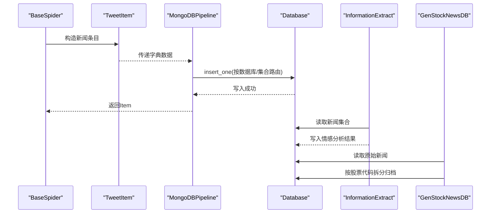
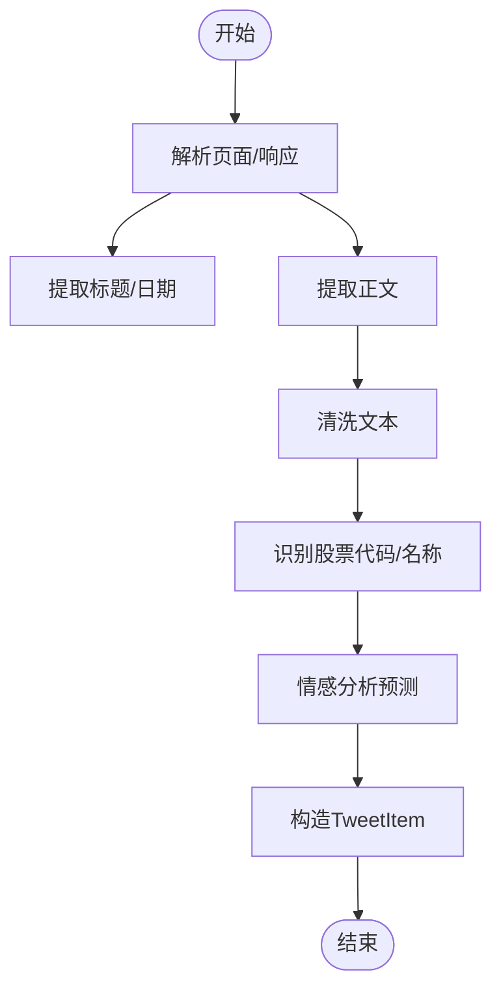
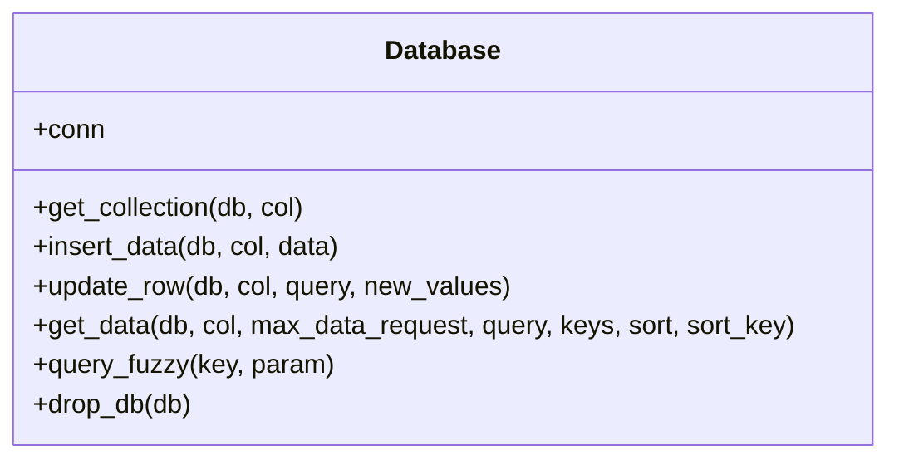
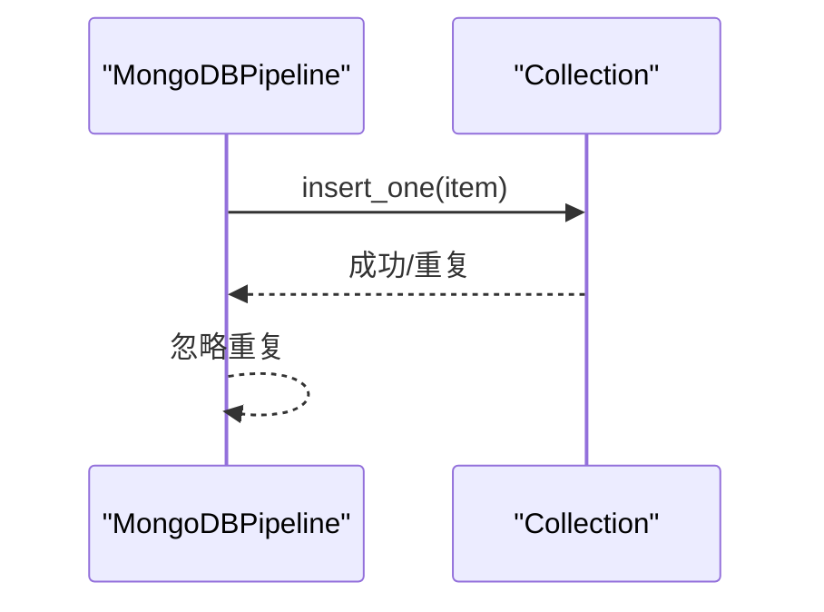
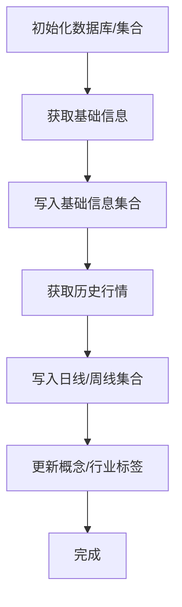
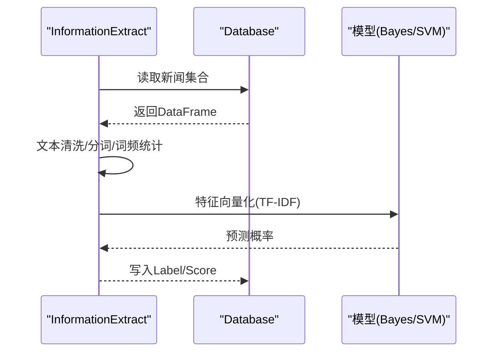
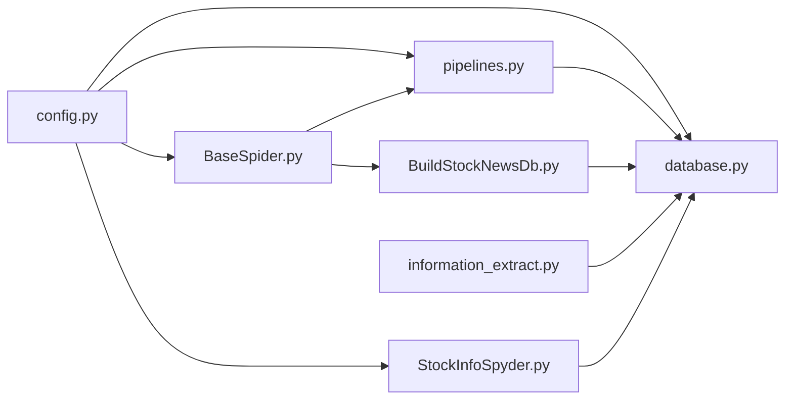

# 数据模型API

<cite>
**本文引用的文件**
- [README.md](file://README.md)
- [items.py](file://src/Utils/items.py)
- [database.py](file://src/Utils/database.py)
- [pipelines.py](file://src/pipelines.py)
- [BaseSpider.py](file://src/MarketNewsSpiderWithScrapy/BaseSpider.py)
- [BasePlayCrawler.py](file://src/MarketNewsSpiderWithScrapy/BasePlayCrawler.py)
- [BuildStockNewsDb.py](file://src/MongoDbComTools/BuildStockNewsDb.py)
- [config.py](file://src/Utils/config.py)
- [StockInfoSpyder.py](file://src/MarketPriceSpiderWithScrapy/StockInfoSpyder.py)
- [StockInfoUtils.py](file://src/MarketPriceSpiderWithScrapy/StockInfoUtils.py)
- [StockInfoUtilsBS.py](file://src/MarketPriceSpiderWithScrapy/StockInfoUtilsBS.py)
- [information_extract.py](file://src/NlpModel/information_extract.py)
- [utils.py](file://src/Utils/utils.py)
</cite>

## 目录
1. [简介](#简介)
2. [项目结构](#项目结构)
3. [核心数据模型](#核心数据模型)
4. [架构总览](#架构总览)
5. [组件详解](#组件详解)
6. [依赖关系分析](#依赖关系分析)
7. [性能与扩展性](#性能与扩展性)
8. [故障排查指南](#故障排查指南)
9. [结论](#结论)
10. [附录](#附录)

## 简介
本文件面向“新闻数据模型”“股票信息模型”“分析结果模型”的API与数据结构说明，覆盖字段定义、类型约束、校验规则、序列化/反序列化流程、创建/更新/查询接口、模型间关联关系与外键约束、版本管理与迁移策略，以及使用示例与最佳实践建议。项目采用Scrapy爬虫框架采集新闻，结合MongoDB存储；股票价格数据通过第三方接口拉取并入库；自然语言处理模块对新闻进行情感分析并输出评分。

## 项目结构
项目主要由以下模块构成：
- 爬虫与数据采集：MarketNewsSpiderWithScrapy、MarketPriceSpiderWithScrapy
- 数据存储与访问：Utils/database、pipelines
- 数据建模与清洗：Utils/items、MongoDbComTools/BuildStockNewsDb
- 配置与常量：Utils/config
- 自然语言处理：NlpModel/information_extract
- 工具函数：Utils/utils

```mermaid
graph TB
subgraph "采集层"
BS["BaseSpider<br/>新闻条目构造"]
BPC["BasePlayCrawler<br/>异步调度"]
SIS["StockInfoSpyder<br/>股票价格采集"]
end
subgraph "存储层"
DB["Database<br/>MongoDB封装"]
PIPE["MongoDBPipeline<br/>入库管道"]
end
subgraph "模型层"
ITEM["TweetItem<br/>新闻数据模型"]
EXTRACT["InformationExtract<br/>情感分析模型"]
BUILD["GenStockNewsDB<br/>按股票归档"]
end
subgraph "配置与工具"
CFG["config<br/>数据库/爬虫配置"]
UTL["utils<br/>通用工具"]
end
BS --> ITEM
BPC --> PIPE
PIPE --> DB
ITEM --> PIPE
PIPE --> DB
BUILD --> DB
SIS --> DB
EXTRACT --> DB
CFG --> DB
CFG --> PIPE
CFG --> SIS
CFG --> BS
UTL --> EXTRACT
```

图表来源
- [BaseSpider.py:13-149](file://src/MarketNewsSpiderWithScrapy/BaseSpider.py#L13-L149)
- [BasePlayCrawler.py:21-120](file://src/MarketNewsSpiderWithScrapy/BasePlayCrawler.py#L21-L120)
- [pipelines.py:8-56](file://src/pipelines.py#L8-L56)
- [database.py:36-176](file://src/Utils/database.py#L36-L176)
- [items.py:5-18](file://src/Utils/items.py#L5-L18)
- [information_extract.py:26-424](file://src/NlpModel/information_extract.py#L26-L424)
- [BuildStockNewsDb.py:19-241](file://src/MongoDbComTools/BuildStockNewsDb.py#L19-L241)
- [config.py:1-455](file://src/Utils/config.py#L1-L455)
- [StockInfoSpyder.py:39-881](file://src/MarketPriceSpiderWithScrapy/StockInfoSpyder.py#L39-L881)
- [utils.py:1-251](file://src/Utils/utils.py#L1-L251)

章节来源
- [README.md:1-33](file://README.md#L1-L33)
- [config.py:39-50](file://src/Utils/config.py#L39-L50)

## 核心数据模型
本节定义系统中的三大核心数据模型及其字段、类型、约束与校验规则。

### 新闻数据模型 TweetItem
- 描述：新闻条目的统一数据载体，用于存储URL、标题、正文、相关股票代码、情感类别与分数等。
- 字段与类型
  - _id: 字符串，唯一标识，MD5(URL)
  - Url: 字符串，新闻原文链接
  - Date: 字符串或日期对象，发布日期
  - Title: 字符串，新闻标题
  - RelatedStockCodes: JSON字符串，包含“股票名称:代码”的映射
  - Article: 字符串，新闻正文
  - WordsFrequent: JSON字符串，分词及词频统计
  - Category: 字符串，新闻分类（如“利好公告”等）
  - Label: 字符串，情感标签（“利好/利空/未知”）
  - Score: 浮点数，情感得分（0~1）
- 类型约束与校验
  - _id必须唯一，MD5(Url)生成
  - RelatedStockCodes需为非空JSON映射
  - Label与Score由情感分析模块生成，Score应为[0,1]
  - Date格式需可解析为日期
- 序列化/反序列化
  - 序列化：Scrapy Item自动序列化为字典，写入MongoDB
  - 反序列化：通过Database.get_data读取为DataFrame，再按字段解析
- 关联关系
  - 与股票信息集合通过RelatedStockCodes建立弱关联
  - GenStockNewsDB按股票代码拆分归档至stock_specific_news库
- 外键约束
  - MongoDB无严格外键，通过RelatedStockCodes与股票基础信息集合建立逻辑关联

章节来源
- [items.py:5-18](file://src/Utils/items.py#L5-L18)
- [BaseSpider.py:84-98](file://src/MarketNewsSpiderWithScrapy/BaseSpider.py#L84-L98)
- [BaseSpider.py:132-146](file://src/MarketNewsSpiderWithScrapy/BaseSpider.py#L132-L146)
- [pipelines.py:25-46](file://src/pipelines.py#L25-L46)
- [BuildStockNewsDb.py:67-134](file://src/MongoDbComTools/BuildStockNewsDb.py#L67-L134)

### 股票信息模型（基础信息）
- 描述：股票基础信息集合，包含A股、港股、美股及中国概念股的基础元数据。
- 字段与类型
  - _id: 字符串，唯一标识，MD5(名称/代码)
  - symbol: 字符串，股票代码（含市场前缀）
  - name: 字符串，股票名称
  - code: 字符串，交易所内部代码（如600000）
  - name_suo_xie: 字符串，简称
  - joint_quant_code: 字符串，联合量化平台代码
  - start_date/end_date: 字符串，有效日期区间
  - tradetype/engname/cname: 可选字段，交易类型、英文名、中文名
  - concept/industry: 字符串，概念/行业标签（可多值）
- 类型约束与校验
  - symbol唯一且规范，不同市场前缀不同
  - code与name需一一对应
  - concept/industry可为空，更新时支持追加
- 关联关系
  - 与每日/周线行情集合通过symbol建立逻辑关联
  - 与新闻按RelatedStockCodes建立弱关联
- 外键约束
  - MongoDB无严格外键，通过symbol建立逻辑关联

章节来源
- [StockInfoSpyder.py:39-84](file://src/MarketPriceSpiderWithScrapy/StockInfoSpyder.py#L39-L84)
- [StockInfoSpyder.py:718-737](file://src/MarketPriceSpiderWithScrapy/StockInfoSpyder.py#L718-L737)
- [StockInfoUtils.py:16-112](file://src/MarketPriceSpiderWithScrapy/StockInfoUtils.py#L16-L112)
- [StockInfoUtilsBS.py:37-112](file://src/MarketPriceSpiderWithScrapy/StockInfoUtilsBS.py#L37-L112)

### 股票行情数据模型（日线/周线）
- 描述：按股票symbol命名的集合，存储日线或周线行情。
- 字段与类型
  - _id: 字符串，唯一标识，MD5(symbol+date)
  - date: 字符串或日期对象，交易日
  - open/close/high/low: 数值，开盘/收盘/最高/最低价
  - volume/money: 数值，成交量/成交额
  - pre_close: 数值，前收盘价（美股/港股）
  - index字段：根据市场类型设置索引
- 类型约束与校验
  - date唯一且有序，_id需唯一
  - 价格字段需为数值，volume与money可为0
- 关联关系
  - 与基础信息集合通过symbol关联
  - 与新闻通过RelatedStockCodes关联
- 外键约束
  - MongoDB无严格外键，通过symbol与_date建立逻辑关联

章节来源
- [StockInfoSpyder.py:512-617](file://src/MarketPriceSpiderWithScrapy/StockInfoSpyder.py#L512-L617)
- [StockInfoSpyder.py:648-714](file://src/MarketPriceSpiderWithScrapy/StockInfoSpyder.py#L648-L714)
- [StockInfoSpyder.py:740-800](file://src/MarketPriceSpiderWithScrapy/StockInfoSpyder.py#L740-L800)

### 分析结果模型（情感分析）
- 描述：新闻情感分析输出，包含标签与置信度。
- 字段与类型
  - Label: 字符串，“利好/利空/未知”
  - Score: 浮点数，0~1
  - NewLabel/NewScore: 可选，模型重评分后的标签与分数
- 类型约束与校验
  - Label来自模型预测，Score为概率归一化
  - NewScore可选，用于模型更新策略
- 关联关系
  - 与新闻集合通过_id关联
- 外键约束
  - MongoDB无严格外键，通过_id建立逻辑关联

章节来源
- [information_extract.py:219-236](file://src/NlpModel/information_extract.py#L219-L236)
- [BuildStockNewsDb.py:119-124](file://src/MongoDbComTools/BuildStockNewsDb.py#L119-L124)

## 架构总览
下图展示数据从采集到入库的关键流程与模型交互：

图表来源
- [BaseSpider.py:41-98](file://src/MarketNewsSpiderWithScrapy/BaseSpider.py#L41-L98)
- [BaseSpider.py:100-146](file://src/MarketNewsSpiderWithScrapy/BaseSpider.py#L100-L146)
- [pipelines.py:25-46](file://src/pipelines.py#L25-L46)
- [database.py:78-88](file://src/Utils/database.py#L78-L88)
- [information_extract.py:147-207](file://src/NlpModel/information_extract.py#L147-L207)
- [BuildStockNewsDb.py:157-238](file://src/MongoDbComTools/BuildStockNewsDb.py#L157-L238)

## 组件详解

### 新闻采集与模型构造
- BaseSpider负责从各站点解析页面，提取标题、正文、日期等，调用GenStockNewsDB进行股票代码识别与情感分析，最终构造TweetItem。
- BasePlayCrawler提供异步调度能力，模拟Scrapy Request/Response，支持并发爬取并接入Pipeline。

图表来源
- [BaseSpider.py:41-98](file://src/MarketNewsSpiderWithScrapy/BaseSpider.py#L41-L98)
- [BaseSpider.py:100-146](file://src/MarketNewsSpiderWithScrapy/BaseSpider.py#L100-L146)
- [BasePlayCrawler.py:21-120](file://src/MarketNewsSpiderWithScrapy/BasePlayCrawler.py#L21-L120)

章节来源
- [BaseSpider.py:13-149](file://src/MarketNewsSpiderWithScrapy/BaseSpider.py#L13-L149)
- [BasePlayCrawler.py:21-120](file://src/MarketNewsSpiderWithScrapy/BasePlayCrawler.py#L21-L120)

### 数据库访问与查询
- Database封装MongoDB客户端、连接池、自动重连、插入、更新、模糊查询、批量读取等能力，返回pandas DataFrame便于后续分析。
- 支持按条件查询、排序、键过滤、最大记录限制等。

图表来源
- [database.py:36-176](file://src/Utils/database.py#L36-L176)

章节来源
- [database.py:36-176](file://src/Utils/database.py#L36-L176)

### 新闻入库与去重
- MongoDBPipeline根据爬虫名称动态路由到对应数据库与集合，使用insert_one写入；DuplicateKeyError时忽略重复项。
- GenStockNewsDB将新闻按RelatedStockCodes拆分，写入stock_specific_news库，按symbol命名子集合，_id为MD5(Date+Url)。

图表来源
- [pipelines.py:25-56](file://src/pipelines.py#L25-L56)
- [BuildStockNewsDb.py:67-134](file://src/MongoDbComTools/BuildStockNewsDb.py#L67-L134)

章节来源
- [pipelines.py:8-56](file://src/pipelines.py#L8-L56)
- [BuildStockNewsDb.py:19-241](file://src/MongoDbComTools/BuildStockNewsDb.py#L19-L241)

### 股票信息与行情采集
- StockInfoSpyder负责获取A/H/US股票基础信息与历史行情，按市场类型写入对应集合；支持按symbol查询、周线聚合、更新money字段等。
- StockInfoUtils与StockInfoUtilsBS提供基础信息合并与备用接口。

图表来源
- [StockInfoSpyder.py:39-84](file://src/MarketPriceSpiderWithScrapy/StockInfoSpyder.py#L39-L84)
- [StockInfoSpyder.py:718-737](file://src/MarketPriceSpiderWithScrapy/StockInfoSpyder.py#L718-L737)
- [StockInfoSpyder.py:740-800](file://src/MarketPriceSpiderWithScrapy/StockInfoSpyder.py#L740-L800)
- [StockInfoUtils.py:16-112](file://src/MarketPriceSpiderWithScrapy/StockInfoUtils.py#L16-L112)
- [StockInfoUtilsBS.py:37-112](file://src/MarketPriceSpiderWithScrapy/StockInfoUtilsBS.py#L37-L112)

章节来源
- [StockInfoSpyder.py:39-881](file://src/MarketPriceSpiderWithScrapy/StockInfoSpyder.py#L39-L881)
- [StockInfoUtils.py:1-129](file://src/MarketPriceSpiderWithScrapy/StockInfoUtils.py#L1-L129)
- [StockInfoUtilsBS.py:1-124](file://src/MarketPriceSpiderWithScrapy/StockInfoUtilsBS.py#L1-L124)

### 情感分析与评分
- InformationExtract加载预训练模型与停用词，从数据库读取新闻，拼接标题与正文，计算词频并预测情感标签与分数。
- 支持Bayes/SVM模型融合打分，输出利好/利空与置信度。

图表来源
- [information_extract.py:26-424](file://src/NlpModel/information_extract.py#L26-L424)
- [database.py:95-172](file://src/Utils/database.py#L95-L172)

章节来源
- [information_extract.py:26-424](file://src/NlpModel/information_extract.py#L26-L424)

## 依赖关系分析
- 配置驱动：config集中管理数据库名、集合名、爬虫配置、模型路径等，被各组件引用。
- 数据流耦合：BaseSpider依赖GenStockNewsDB进行股票识别与情感分析；GenStockNewsDB依赖Database进行读写；Pipeline依赖config进行数据库路由。
- 外部依赖：akshare/jqdatasdk等第三方接口用于行情数据；MongoDB作为主存储；Scrapy/Playwright用于爬取。

图表来源
- [config.py:39-50](file://src/Utils/config.py#L39-L50)
- [database.py:36-176](file://src/Utils/database.py#L36-L176)
- [pipelines.py:8-56](file://src/pipelines.py#L8-L56)
- [BaseSpider.py:13-149](file://src/MarketNewsSpiderWithScrapy/BaseSpider.py#L13-L149)
- [BuildStockNewsDb.py:19-241](file://src/MongoDbComTools/BuildStockNewsDb.py#L19-L241)
- [information_extract.py:26-424](file://src/NlpModel/information_extract.py#L26-L424)
- [StockInfoSpyder.py:39-881](file://src/MarketPriceSpiderWithScrapy/StockInfoSpyder.py#L39-L881)

章节来源
- [config.py:1-455](file://src/Utils/config.py#L1-L455)

## 性能与扩展性
- 连接池与自动重连：Database使用MongoDB连接池与指数退避重连，提升稳定性。
- 批量读取：Database.get_data支持键过滤、最大记录限制、排序，避免全量扫描。
- 并发爬取：BasePlayCrawler通过asyncio与Playwright并发调度，显著提升吞吐。
- 模型缓存：InformationExtract加载持久化模型，减少重复训练开销。
- 扩展建议
  - 对高频查询字段建立索引（如_date、_id、symbol）
  - 对RelatedStockCodes建立复合索引以加速新闻-股票关联查询
  - 引入增量更新策略，避免重复入库

[本节为通用指导，无需具体文件引用]

## 故障排查指南
- 连接异常
  - 现象：AutoReconnect异常
  - 处理：启用graceful_auto_reconnect装饰器，检查网络与MongoDB服务状态
- 重复入库
  - 现象：DuplicateKeyError
  - 处理：Pipeline捕获并忽略重复项；确保_id唯一性
- 数据缺失
  - 现象：get_data返回None
  - 处理：检查query条件、集合是否存在、字段键过滤是否正确
- 情感分析异常
  - 现象：预测失败或结果异常
  - 处理：确认模型文件存在、特征向量化一致、输入文本清洗正确

章节来源
- [database.py:15-33](file://src/Utils/database.py#L15-L33)
- [database.py:94-172](file://src/Utils/database.py#L94-L172)
- [pipelines.py:48-56](file://src/pipelines.py#L48-L56)

## 结论
本数据模型API围绕“新闻-股票-行情-分析”闭环展开，通过Scrapy与MongoDB实现高吞吐采集与存储，利用情感分析模型输出结构化结果。模型间通过逻辑关联（如RelatedStockCodes、symbol）实现松耦合，具备良好的扩展性与可维护性。建议在生产环境中完善索引策略、引入增量更新与版本管理机制，持续优化性能与稳定性。

[本节为总结，无需具体文件引用]

## 附录

### 数据模型API操作接口清单
- 新闻创建/入库
  - 构造TweetItem并写入：见[BaseSpider.py:84-98](file://src/MarketNewsSpiderWithScrapy/BaseSpider.py#L84-L98)、[pipelines.py:25-46](file://src/pipelines.py#L25-L46)
- 新闻查询
  - 按条件查询与键过滤：见[database.py:95-172](file://src/Utils/database.py#L95-L172)
- 新闻更新
  - 更新情感标签与分数：见[BuildStockNewsDb.py:119-124](file://src/MongoDbComTools/BuildStockNewsDb.py#L119-L124)、[information_extract.py:219-236](file://src/NlpModel/information_extract.py#L219-L236)
- 股票基础信息
  - 获取与写入：见[StockInfoSpyder.py:718-737](file://src/MarketPriceSpiderWithScrapy/StockInfoSpyder.py#L718-L737)、[StockInfoUtils.py:16-112](file://src/MarketPriceSpiderWithScrapy/StockInfoUtils.py#L16-L112)
- 股票行情
  - 日线/周线写入与查询：见[StockInfoSpyder.py:740-800](file://src/MarketPriceSpiderWithScrapy/StockInfoSpyder.py#L740-L800)、[StockInfoSpyder.py:251-318](file://src/MarketPriceSpiderWithScrapy/StockInfoSpyder.py#L251-L318)
- 情感分析
  - 预测与写回：见[information_extract.py:219-236](file://src/NlpModel/information_extract.py#L219-L236)

### 版本管理与迁移策略
- 配置版本化：通过config.py集中管理数据库名/集合名，变更时仅调整配置
- 模型版本化：模型文件（Bayes/SVM/Tfidf）持久化，升级时替换文件并更新加载路径
- 数据迁移
  - 新增字段：使用Database.update_row对存量数据补全
  - 字段重命名：通过聚合脚本或迁移工具批量更新
- 发布策略
  - 采用灰度发布，先在小范围集合验证，再全量迁移

章节来源
- [config.py:39-50](file://src/Utils/config.py#L39-L50)
- [database.py:82-88](file://src/Utils/database.py#L82-L88)
- [information_extract.py:309-338](file://src/NlpModel/information_extract.py#L309-L338)

### 实际使用示例与最佳实践
- 示例：按日期范围查询某只股票相关新闻
  - 步骤：构造查询条件{"Date": {"$gte": start_date, "$lte": end_date}}，调用Database.get_data
  - 参考：[StockInfoSpyder.py:251-318](file://src/MarketPriceSpiderWithScrapy/StockInfoSpyder.py#L251-L318)
- 示例：按RelatedStockCodes关联查询
  - 步骤：先读取新闻集合，解析RelatedStockCodes，再按股票代码查询stock_specific_news下的symbol集合
  - 参考：[BuildStockNewsDb.py:157-238](file://src/MongoDbComTools/BuildStockNewsDb.py#L157-L238)
- 最佳实践
  - 为_date、symbol、_id建立索引
  - 使用键过滤(keys)减少网络传输
  - 对长文本进行清洗与分词，保证情感分析质量
  - 定期清理重复与无效数据，保持集合健康

章节来源
- [StockInfoSpyder.py:251-318](file://src/MarketPriceSpiderWithScrapy/StockInfoSpyder.py#L251-L318)
- [BuildStockNewsDb.py:157-238](file://src/MongoDbComTools/BuildStockNewsDb.py#L157-L238)
- [utils.py:68-83](file://src/Utils/utils.py#L68-L83)