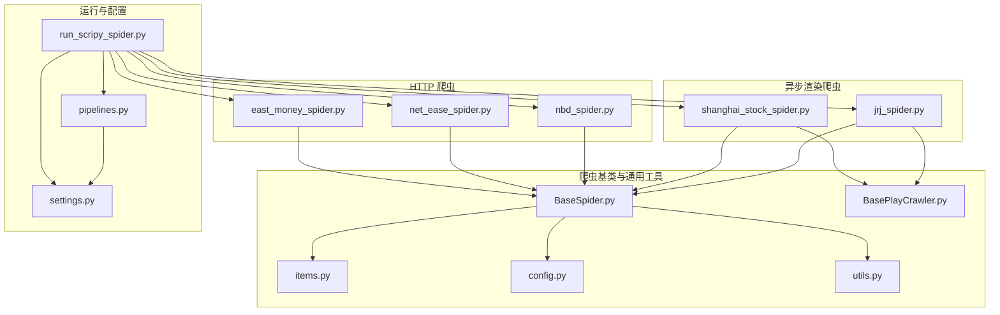
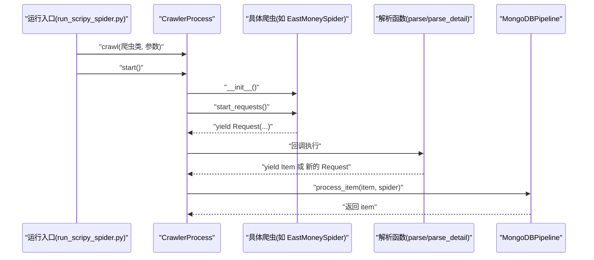
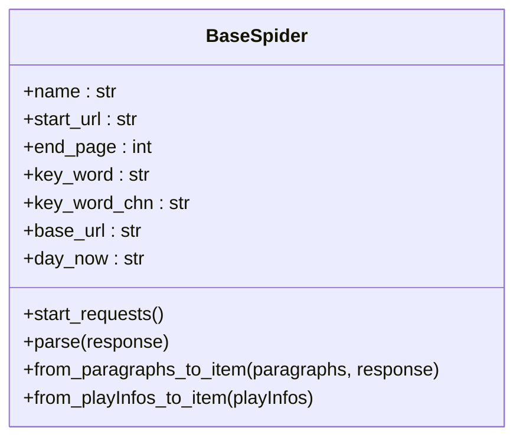
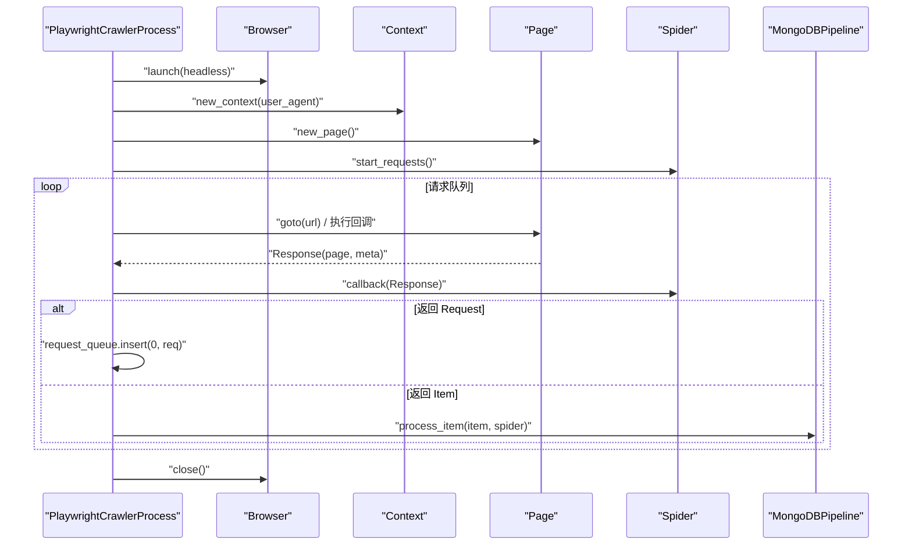
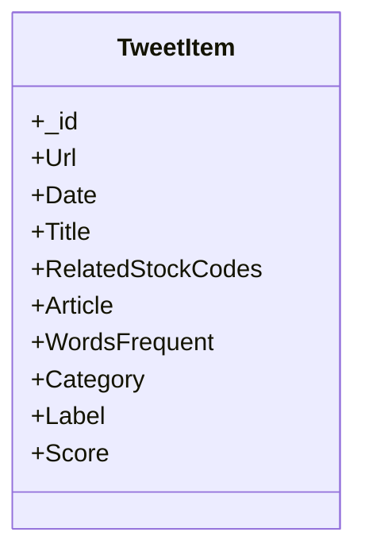
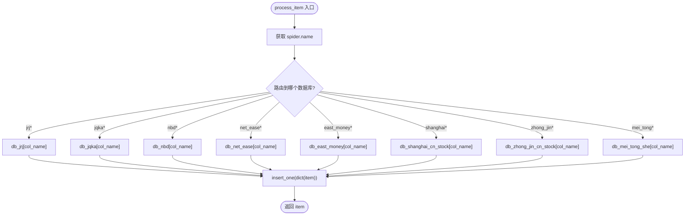
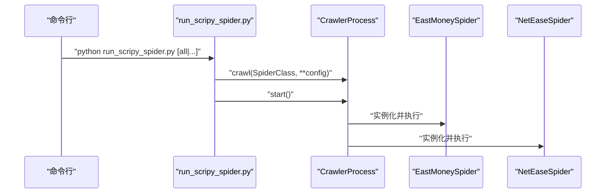
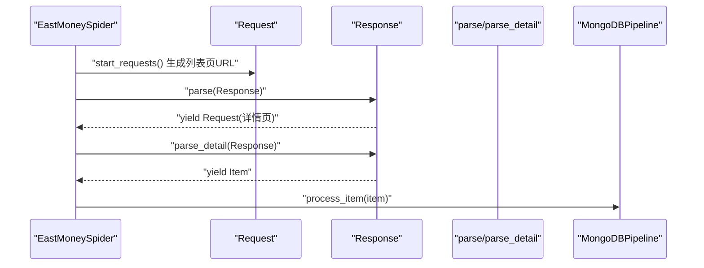
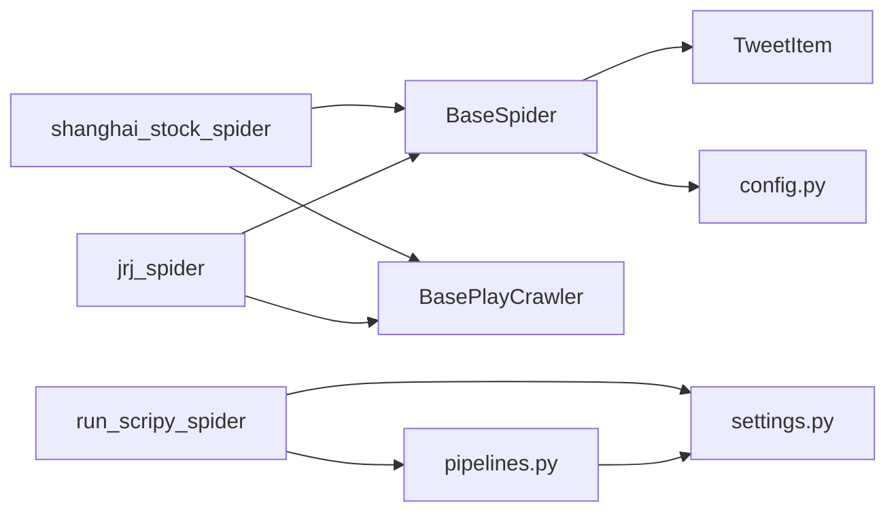

# 爬虫API

<cite>
**本文引用的文件**
- [BaseSpider.py](file://src/MarketNewsSpiderWithScrapy/BaseSpider.py)
- [BasePlayCrawler.py](file://src/MarketNewsSpiderWithScrapy/BasePlayCrawler.py)
- [items.py](file://src/Utils/items.py)
- [settings.py](file://src/settings.py)
- [pipelines.py](file://src/pipelines.py)
- [east_money_spider.py](file://src/MarketNewsSpiderWithScrapy/east_money_spider.py)
- [net_ease_spider.py](file://src/MarketNewsSpiderWithScrapy/net_ease_spider.py)
- [nbd_spider.py](file://src/MarketNewsSpiderWithScrapy/nbd_spider.py)
- [shanghai_stock_spider.py](file://src/MarketNewsSpiderWithScrapy/shanghai_stock_spider.py)
- [jrj_spider.py](file://src/MarketNewsSpiderWithScrapy/jrj_spider.py)
- [run_scripy_spider.py](file://src/run_scripy_spider.py)
- [config.py](file://src/Utils/config.py)
- [utils.py](file://src/Utils/utils.py)
</cite>

## 目录
1. [简介](#简介)
2. [项目结构](#项目结构)
3. [核心组件](#核心组件)
4. [架构总览](#架构总览)
5. [详细组件分析](#详细组件分析)
6. [依赖分析](#依赖分析)
7. [性能考虑](#性能考虑)
8. [故障排查指南](#故障排查指南)
9. [结论](#结论)
10. [附录](#附录)

## 简介
本技术文档面向基于 Scrapy 的股票新闻爬虫系统，系统同时支持传统 HTTP 爬虫与基于 Playwright 的异步渲染爬虫两类模式。文档覆盖以下主题：
- 爬虫类的继承与扩展、请求发送、响应处理、数据提取的核心 API
- 异步爬取与并发控制参数
- 爬虫中间件、管道、项目处理器的使用方法
- 反爬虫应对策略与 IP 代理配置
- 爬虫调度与任务队列管理接口
- 数据清洗与预处理 API 方法
- 爬虫监控与日志记录接口
- 实际配置示例与性能优化建议

## 项目结构
项目采用模块化组织，围绕“爬虫基类 + 多站点爬虫 + 配置 + 管道 + 运行入口”的结构展开。

图表来源
- [run_scripy_spider.py:117-142](file://src/run_scripy_spider.py#L117-L142)
- [settings.py:8-34](file://src/settings.py#L8-L34)
- [pipelines.py:8-46](file://src/pipelines.py#L8-L46)

章节来源
- [run_scripy_spider.py:117-142](file://src/run_scripy_spider.py#L117-L142)
- [settings.py:8-34](file://src/settings.py#L8-L34)
- [pipelines.py:8-46](file://src/pipelines.py#L8-L46)

## 核心组件
本节概述爬虫系统的关键构件及其职责：
- 爬虫基类：统一初始化、通用解析与清洗、项目构造与融合打分
- 异步渲染调度器：基于 Playwright 的并发调度与页面交互
- 项目模型：标准化字段定义
- 管道：按站点写入 MongoDB 不同集合
- 运行入口：集中注册与启动多站点爬虫
- 配置中心：站点参数、数据库与代理等配置

章节来源
- [BaseSpider.py:13-148](file://src/MarketNewsSpiderWithScrapy/BaseSpider.py#L13-L148)
- [BasePlayCrawler.py:21-119](file://src/MarketNewsSpiderWithScrapy/BasePlayCrawler.py#L21-L119)
- [items.py:5-17](file://src/Utils/items.py#L5-L17)
- [pipelines.py:8-46](file://src/pipelines.py#L8-L46)
- [run_scripy_spider.py:17-114](file://src/run_scripy_spider.py#L17-L114)
- [config.py:55-450](file://src/Utils/config.py#L55-L450)

## 架构总览
系统分为三层：
- 控制层：运行入口负责注册与启动多个爬虫实例
- 爬取层：HTTP 爬虫使用 Scrapy Request/Response；异步渲染爬虫使用 Playwright
- 数据层：管道将项目写入 MongoDB，按站点分流

图表来源
- [run_scripy_spider.py:117-142](file://src/run_scripy_spider.py#L117-L142)
- [east_money_spider.py:21-76](file://src/MarketNewsSpiderWithScrapy/east_money_spider.py#L21-L76)
- [pipelines.py:25-46](file://src/pipelines.py#L25-L46)

## 详细组件分析

### 爬虫基类 BaseSpider
- 继承自 Scrapy Spider，提供统一初始化、通用解析与清洗、项目构造与融合打分
- 关键能力
  - 初始化参数：名称、关键词、起始 URL、基础 URL、最大页码
  - 通用解析：从段落列表或播放信息字典构造项目
  - 文本清洗：去除多余空白、合并段落、抽取股票代码与词频
  - 融合打分：ML 与 LLM 分数融合，输出标签与置信度
- 适用场景：HTTP 爬虫与异步渲染爬虫均可继承复用

图表来源
- [BaseSpider.py:13-148](file://src/MarketNewsSpiderWithScrapy/BaseSpider.py#L13-L148)

章节来源
- [BaseSpider.py:13-148](file://src/MarketNewsSpiderWithScrapy/BaseSpider.py#L13-L148)

### 异步渲染调度器 BasePlayCrawler
- 自定义的异步调度器，模拟 Scrapy 的 Request/Response，基于 Playwright 并发执行
- 关键特性
  - 支持 headless 浏览器、随机 UA、独立上下文
  - 统一的请求队列与回调执行机制
  - 回调可返回 Request 或 Item，自动进入管道
- 适用场景：需 JS 渲染、动态加载、AJAX 的站点

图表来源
- [BasePlayCrawler.py:21-119](file://src/MarketNewsSpiderWithScrapy/BasePlayCrawler.py#L21-L119)

章节来源
- [BasePlayCrawler.py:21-119](file://src/MarketNewsSpiderWithScrapy/BasePlayCrawler.py#L21-L119)

### 项目模型 TweetItem
- 定义爬取项目的标准化字段，便于管道统一处理
- 字段包括：URL、日期、标题、相关股票代码、文章正文、词频统计、分类、标签、置信度等

图表来源
- [items.py:5-17](file://src/Utils/items.py#L5-L17)

章节来源
- [items.py:5-17](file://src/Utils/items.py#L5-L17)

### 管道 MongoDBPipeline
- 将不同站点的数据写入 MongoDB 对应集合
- 依据 spider.name 动态选择数据库与集合，避免重复插入

图表来源
- [pipelines.py:25-46](file://src/pipelines.py#L25-L46)

章节来源
- [pipelines.py:8-46](file://src/pipelines.py#L8-L46)

### 运行入口与调度
- 运行入口集中注册多个站点的爬虫，支持按参数选择运行范围
- 使用 Scrapy 的 CrawlerProcess 启动，读取 settings.py 中的全局配置

图表来源
- [run_scripy_spider.py:117-142](file://src/run_scripy_spider.py#L117-L142)
- [settings.py:8-34](file://src/settings.py#L8-L34)

章节来源
- [run_scripy_spider.py:17-114](file://src/run_scripy_spider.py#L17-L114)
- [settings.py:8-34](file://src/settings.py#L8-L34)

### 具体爬虫示例

#### 东方财富爬虫（HTTP）
- 生成分页 URL 列表，解析列表页并提取详情页链接，再解析详情页正文
- 使用 BeautifulSoup 解析 HTML，构造 Item 并交由管道处理

图表来源
- [east_money_spider.py:12-76](file://src/MarketNewsSpiderWithScrapy/east_money_spider.py#L12-L76)

章节来源
- [east_money_spider.py:5-78](file://src/MarketNewsSpiderWithScrapy/east_money_spider.py#L5-L78)

#### 网易爬虫（HTTP）
- 生成分页 URL，解析列表项，提取子链接与时间，再进入详情页提取正文
- 使用 BeautifulSoup 解析 HTML，构造 Item 并交由管道处理

章节来源
- [net_ease_spider.py:9-67](file://src/MarketNewsSpiderWithScrapy/net_ease_spider.py#L9-L67)

#### 每经网爬虫（HTTP）
- 生成分页 URL，解析列表项，提取子链接与时间，再进入详情页提取正文
- 使用 BeautifulSoup 解析 HTML，构造 Item 并交由管道处理

章节来源
- [nbd_spider.py:7-66](file://src/MarketNewsSpiderWithScrapy/nbd_spider.py#L7-L66)

#### 上海证券爬虫（异步渲染）
- 使用 Playwright 拦截 AJAX 响应，滚动触发加载更多，解析 JSON 数据并构造 Item

章节来源
- [shanghai_stock_spider.py:6-59](file://src/MarketNewsSpiderWithScrapy/shanghai_stock_spider.py#L6-L59)

#### 金融界爬虫（异步渲染）
- 使用 Playwright 点击“加载更多”，等待元素出现，解析详情页正文并构造 Item

章节来源
- [jrj_spider.py:7-94](file://src/MarketNewsSpiderWithScrapy/jrj_spider.py#L7-L94)

## 依赖分析
- 爬虫基类依赖项目模型与配置中心，用于统一字段与站点参数
- 异步渲染爬虫依赖调度器与管道，实现并发与持久化
- 运行入口依赖配置中心与 settings，集中注册与启动

图表来源
- [BaseSpider.py:13-148](file://src/MarketNewsSpiderWithScrapy/BaseSpider.py#L13-L148)
- [shanghai_stock_spider.py:6-59](file://src/MarketNewsSpiderWithScrapy/shanghai_stock_spider.py#L6-L59)
- [jrj_spider.py:7-94](file://src/MarketNewsSpiderWithScrapy/jrj_spider.py#L7-L94)
- [run_scripy_spider.py:117-142](file://src/run_scripy_spider.py#L117-L142)
- [settings.py:8-34](file://src/settings.py#L8-L34)
- [pipelines.py:8-46](file://src/pipelines.py#L8-L46)

章节来源
- [BaseSpider.py:13-148](file://src/MarketNewsSpiderWithScrapy/BaseSpider.py#L13-L148)
- [shanghai_stock_spider.py:6-59](file://src/MarketNewsSpiderWithScrapy/shanghai_stock_spider.py#L6-L59)
- [jrj_spider.py:7-94](file://src/MarketNewsSpiderWithScrapy/jrj_spider.py#L7-L94)
- [run_scripy_spider.py:117-142](file://src/run_scripy_spider.py#L117-L142)
- [settings.py:8-34](file://src/settings.py#L8-L34)
- [pipelines.py:8-46](file://src/pipelines.py#L8-L46)

## 性能考虑
- 并发与延迟
  - 全局并发：settings 中 CONCURRENT_REQUESTS 控制并发请求数
  - 下载延迟：DOWNLOAD_DELAY 控制请求间隔，缓解目标服务器压力
  - 下载超时：DOWNLOAD_TIMEOUT 控制请求超时时间
- 异步渲染
  - PlaywrightCrawlerProcess 通过 asyncio.gather 并发执行多个爬虫实例
  - 每个爬虫使用独立上下文，避免 Cookie 干扰并节省内存
- 数据库写入
  - 管道按站点分流写入，减少锁竞争
  - 插入异常捕获，避免因重复键导致中断
- 日志与监控
  - 使用 Python logging 输出运行状态与错误信息
  - 爬虫基类与各爬虫均使用 logger 输出关键信息

章节来源
- [settings.py:18-23](file://src/settings.py#L18-L23)
- [BasePlayCrawler.py:41-62](file://src/MarketNewsSpiderWithScrapy/BasePlayCrawler.py#L41-L62)
- [pipelines.py:48-56](file://src/pipelines.py#L48-L56)
- [utils.py:18-27](file://src/Utils/utils.py#L18-L27)

## 故障排查指南
- 请求超时与加载失败
  - 检查 DOWNLOAD_TIMEOUT 与 DOWNLOAD_DELAY 设置
  - 对于异步渲染站点，适当增加 page.wait_for_selector 的超时时间
- 代理与反爬虫
  - settings 中 DOWNLOADER_MIDDLEWARES 已启用 HttpProxyMiddleware，可按需配置代理
  - USER_AGENTS 提供多 UA 列表，可在调度器中随机选择
- 数据去重
  - 管道捕获 DuplicateKeyError，避免重复写入
- 日志定位
  - 使用 get_logger() 获取全局日志器，结合 logging.basicConfig 输出详细日志

章节来源
- [settings.py:25-30](file://src/settings.py#L25-L30)
- [settings.py:36-47](file://src/settings.py#L36-L47)
- [pipelines.py:48-56](file://src/pipelines.py#L48-L56)
- [utils.py:18-27](file://src/Utils/utils.py#L18-L27)

## 结论
本系统通过“基类 + 多站点 + 异步渲染 + 管道”的架构，实现了对多家财经媒体的高效爬取与统一存储。HTTP 爬虫适合静态或简单动态站点，异步渲染爬虫适合复杂前端交互场景。通过合理的并发与延迟配置、代理与 UA 策略、以及完善的日志与去重机制，系统具备良好的稳定性与可维护性。

## 附录

### 爬虫类继承与扩展要点
- 继承 BaseSpider，重写 start_requests 与 parse/parse_detail
- 对于异步渲染站点，使用 PlaywrightCrawlerProcess 的 Request/Response
- 使用 TweetItem 统一字段，确保管道处理一致性

章节来源
- [BaseSpider.py:13-148](file://src/MarketNewsSpiderWithScrapy/BaseSpider.py#L13-L148)
- [BasePlayCrawler.py:6-19](file://src/MarketNewsSpiderWithScrapy/BasePlayCrawler.py#L6-L19)
- [items.py:5-17](file://src/Utils/items.py#L5-L17)

### 请求发送与响应处理 API
- HTTP 爬虫
  - Request(url, callback, meta, dont_filter)
  - parse(response) 与 parse_detail(response)
- 异步渲染
  - Request(url, callback, meta, dont_filter)
  - parse(page, request) 与 parse_detail(response)

章节来源
- [net_ease_spider.py:15-59](file://src/MarketNewsSpiderWithScrapy/net_ease_spider.py#L15-L59)
- [nbd_spider.py:13-59](file://src/MarketNewsSpiderWithScrapy/nbd_spider.py#L13-L59)
- [east_money_spider.py:12-76](file://src/MarketNewsSpiderWithScrapy/east_money_spider.py#L12-L76)
- [shanghai_stock_spider.py:13-59](file://src/MarketNewsSpiderWithScrapy/shanghai_stock_spider.py#L13-L59)
- [jrj_spider.py:14-94](file://src/MarketNewsSpiderWithScrapy/jrj_spider.py#L14-L94)

### 数据提取与清洗 API
- BaseSpider 提供 from_paragraphs_to_item 与 from_playInfos_to_item
- 文本清洗：去除全角空格、换行符、多余空白，抽取股票代码与词频
- 融合打分：ML 与 LLM 分数融合，输出标签与置信度

章节来源
- [BaseSpider.py:41-146](file://src/MarketNewsSpiderWithScrapy/BaseSpider.py#L41-L146)

### 爬虫中间件、管道与项目处理器
- 中间件
  - cookies、redirect 中间件可禁用或按需启用
  - HttpProxyMiddleware 可配置代理
- 管道
  - MongoDBPipeline 按站点写入不同集合
- 项目处理器
  - process_item(item, spider) 由调度器统一调用

章节来源
- [settings.py:25-34](file://src/settings.py#L25-L34)
- [pipelines.py:25-46](file://src/pipelines.py#L25-L46)

### 反爬虫应对策略与 IP 代理配置
- 代理
  - 启用 HttpProxyMiddleware，按需配置代理地址
- UA
  - 使用 USER_AGENTS 列表，调度器随机选择
- 延迟与并发
  - 通过 DOWNLOAD_DELAY 与 CONCURRENT_REQUESTS 平衡速度与稳定性

章节来源
- [settings.py:25-30](file://src/settings.py#L25-L30)
- [settings.py:36-47](file://src/settings.py#L36-L47)
- [settings.py:18-23](file://src/settings.py#L18-L23)

### 爬虫调度与任务队列管理
- 运行入口集中注册多个爬虫，支持按参数选择运行范围
- CrawlerProcess 启动后统一调度与并发执行

章节来源
- [run_scripy_spider.py:17-114](file://src/run_scripy_spider.py#L17-L114)
- [run_scripy_spider.py:117-142](file://src/run_scripy_spider.py#L117-L142)

### 爬虫监控与日志记录
- 使用 logging 配置全局日志格式与级别
- 爬虫基类与各爬虫通过 logger 输出运行状态与错误信息

章节来源
- [utils.py:18-27](file://src/Utils/utils.py#L18-L27)
- [BaseSpider.py:32](file://src/MarketNewsSpiderWithScrapy/BaseSpider.py#L32)

### 实际配置示例与性能优化建议
- 示例
  - 运行全部站点：命令行传参 all
  - 运行指定站点：命令行传参 nbd、east_money、zhongjin、shanghai 等
- 优化建议
  - 根据目标站点稳定性调整 DOWNLOAD_DELAY 与 DOWNLOAD_TIMEOUT
  - 对复杂前端站点优先使用异步渲染爬虫
  - 合理设置 CONCURRENT_REQUESTS，避免触发反爬虫机制
  - 使用代理池与 UA 轮换提升稳定性

章节来源
- [run_scripy_spider.py:124-141](file://src/run_scripy_spider.py#L124-L141)
- [settings.py:18-23](file://src/settings.py#L18-L23)
- [settings.py:36-47](file://src/settings.py#L36-L47)