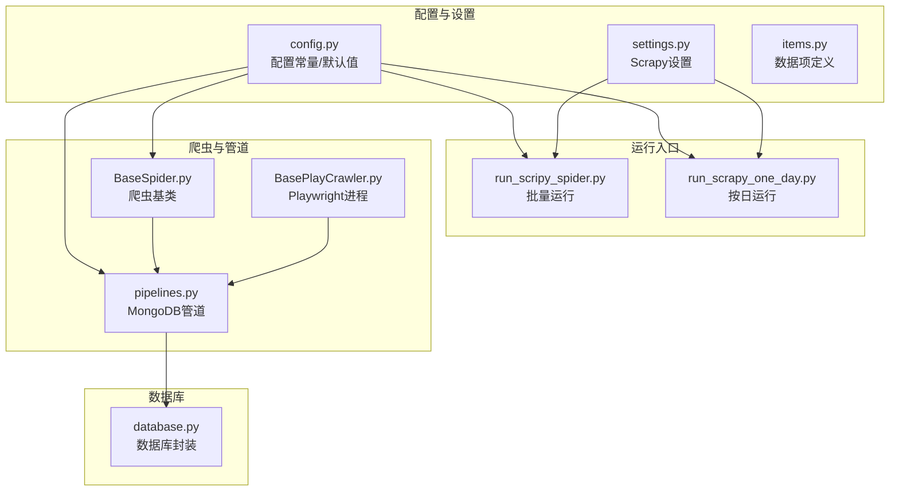
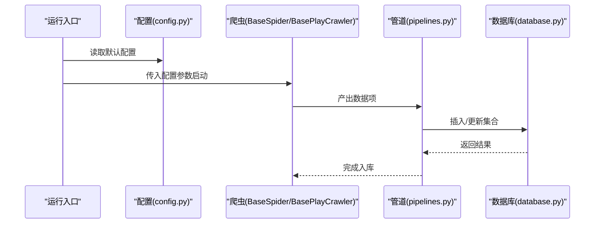
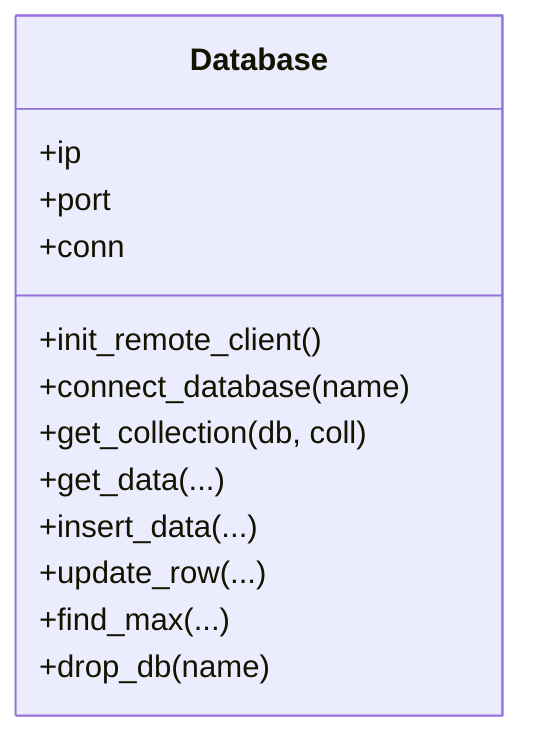
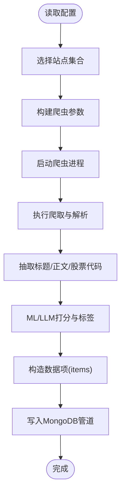
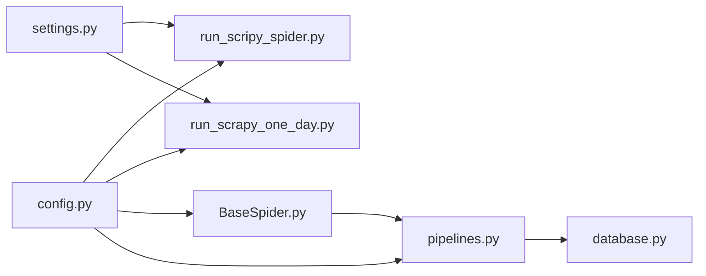

# 配置API

<cite>
**本文引用的文件**
- [src/Utils/config.py](file://src/Utils/config.py)
- [src/Utils/database.py](file://src/Utils/database.py)
- [src/settings.py](file://src/settings.py)
- [src/pipelines.py](file://src/pipelines.py)
- [src/MarketNewsSpiderWithScrapy/BaseSpider.py](file://src/MarketNewsSpiderWithScrapy/BaseSpider.py)
- [src/MarketNewsSpiderWithScrapy/BasePlayCrawler.py](file://src/MarketNewsSpiderWithScrapy/BasePlayCrawler.py)
- [src/run_scripy_spider.py](file://src/run_scripy_spider.py)
- [src/run_scrapy_one_day.py](file://src/run_scrapy_one_day.py)
- [src/Utils/items.py](file://src/Utils/items.py)
- [README.md](file://README.md)
</cite>

## 目录
1. [简介](#简介)
2. [项目结构](#项目结构)
3. [核心组件](#核心组件)
4. [架构总览](#架构总览)
5. [详细组件分析](#详细组件分析)
6. [依赖关系分析](#依赖关系分析)
7. [性能考量](#性能考量)
8. [故障排查指南](#故障排查指南)
9. [结论](#结论)
10. [附录](#附录)

## 简介
本文件面向“配置API”的技术文档，系统性梳理本仓库中与系统配置管理相关的接口与参数，覆盖数据库连接、爬虫配置、模型配置、路径配置等。文档提供配置项的结构说明、默认值来源、依赖关系与优先级规则、配置验证与错误处理机制、配置更新与热重载支持现状，以及实际使用示例与最佳实践建议，帮助开发者正确配置与管理系统的各项参数。

## 项目结构
本项目的配置相关能力主要分布在以下模块：
- 配置常量与默认值：src/Utils/config.py
- 数据库连接与访问封装：src/Utils/database.py
- Scrapy 项目设置：src/settings.py
- 爬虫管道与入库：src/pipelines.py
- 爬虫基类与运行流程：src/MarketNewsSpiderWithScrapy/BaseSpider.py、src/MarketNewsSpiderWithScrapy/BasePlayCrawler.py
- 启动入口与配置驱动：src/run_scripy_spider.py、src/run_scrapy_one_day.py
- 数据项定义：src/Utils/items.py
- 顶层说明：README.md

**图示来源**
- [src/Utils/config.py](file://src/Utils/config.py)
- [src/settings.py](file://src/settings.py)
- [src/Utils/items.py](file://src/Utils/items.py)
- [src/run_scripy_spider.py](file://src/run_scripy_spider.py)
- [src/run_scrapy_one_day.py](file://src/run_scrapy_one_day.py)
- [src/MarketNewsSpiderWithScrapy/BaseSpider.py](file://src/MarketNewsSpiderWithScrapy/BaseSpider.py)
- [src/MarketNewsSpiderWithScrapy/BasePlayCrawler.py](file://src/MarketNewsSpiderWithScrapy/BasePlayCrawler.py)
- [src/pipelines.py](file://src/pipelines.py)
- [src/Utils/database.py](file://src/Utils/database.py)

**章节来源**
- [README.md](file://README.md)
- [src/Utils/config.py](file://src/Utils/config.py)
- [src/settings.py](file://src/settings.py)
- [src/Utils/items.py](file://src/Utils/items.py)
- [src/run_scripy_spider.py](file://src/run_scripy_spider.py)
- [src/run_scrapy_one_day.py](file://src/run_scrapy_one_day.py)
- [src/MarketNewsSpiderWithScrapy/BaseSpider.py](file://src/MarketNewsSpiderWithScrapy/BaseSpider.py)
- [src/MarketNewsSpiderWithScrapy/BasePlayCrawler.py](file://src/MarketNewsSpiderWithScrapy/BasePlayCrawler.py)
- [src/pipelines.py](file://src/pipelines.py)
- [src/Utils/database.py](file://src/Utils/database.py)

## 核心组件
- 配置常量与默认值（config.py）
  - 数据库连接：MONGODB_IP、MONGODB_PORT、REDIS_IP、REDIS_PORT
  - 爬虫站点与分页：各新闻源的数据库名、集合名、起始URL、关键词、目标页数等
  - 路径与模型：分词与停用词路径、贝叶斯/SVM模型文件、行业/概念字典文件、ChromeDriver路径
  - LLM模型路径与设备：LLM_MODEL_PATH、LLM_USE_DEVICE_TYPE、OLLAMA_MODEL
  - 股价默认日期：STOCK_PRICE_REQUEST_DEFAULT_DATE
  - GPU模式开关：GPU_MODE（基于平台）

- 数据库封装（database.py）
  - 提供连接初始化、集合获取、查询、插入、更新、模糊查询、自动重连装饰器等
  - 默认连接池大小、超时、最大重试次数等参数

- Scrapy 设置（settings.py）
  - 爬虫模块、并发、下载延迟、超时、UA池、中间件、管道等

- 管道（pipelines.py）
  - 将不同来源的新闻数据写入对应数据库/集合
  - 去重键冲突处理

- 爬虫基类（BaseSpider.py）
  - 统一抽取、清洗、打分、标签化流程
  - 使用配置中的模型路径与LLM预测器进行融合打分

- 运行入口（run_scripy_spider.py、run_scrapy_one_day.py）
  - 通过配置驱动批量或按日启动多个爬虫
  - 支持 Playwright 与 Scrapy 两类爬虫进程

**章节来源**
- [src/Utils/config.py](file://src/Utils/config.py)
- [src/Utils/database.py](file://src/Utils/database.py)
- [src/settings.py](file://src/settings.py)
- [src/pipelines.py](file://src/pipelines.py)
- [src/MarketNewsSpiderWithScrapy/BaseSpider.py](file://src/MarketNewsSpiderWithScrapy/BaseSpider.py)
- [src/run_scripy_spider.py](file://src/run_scripy_spider.py)
- [src/run_scrapy_one_day.py](file://src/run_scrapy_one_day.py)

## 架构总览
下图展示配置在系统中的作用与流向：配置驱动运行入口，运行入口调用爬虫，爬虫产出数据经管道写入数据库，数据库封装提供底层连接与访问。

**图示来源**
- [src/Utils/config.py](file://src/Utils/config.py)
- [src/run_scripy_spider.py](file://src/run_scripy_spider.py)
- [src/run_scrapy_one_day.py](file://src/run_scrapy_one_day.py)
- [src/MarketNewsSpiderWithScrapy/BaseSpider.py](file://src/MarketNewsSpiderWithScrapy/BaseSpider.py)
- [src/MarketNewsSpiderWithScrapy/BasePlayCrawler.py](file://src/MarketNewsSpiderWithScrapy/BasePlayCrawler.py)
- [src/pipelines.py](file://src/pipelines.py)
- [src/Utils/database.py](file://src/Utils/database.py)

## 详细组件分析

### 数据库连接配置（MONGODB/REDIS）
- 连接参数
  - 主机与端口：MONGODB_IP、MONGODB_PORT；REDIS_IP、REDIS_PORT
  - 认证：通过加密密钥解密后的用户名/密码（见 database.py）
- 连接特性
  - 连接池大小、超时时间、自动重连策略
  - 自动重连装饰器对常见异常进行指数退避重试
- 使用位置
  - database.py 初始化客户端
  - pipelines.py 通过 Database 实例获取数据库/集合
  - 运行入口通过 settings.py 注入 Scrapy 管道

**图示来源**
- [src/Utils/database.py](file://src/Utils/database.py)

**章节来源**
- [src/Utils/config.py](file://src/Utils/config.py)
- [src/Utils/database.py](file://src/Utils/database.py)
- [src/pipelines.py](file://src/pipelines.py)
- [src/settings.py](file://src/settings.py)

### 爬虫配置（站点、数据库、集合、URL、分页）
- 配置来源
  - config.py 中定义了各新闻源的数据库名、集合名、起始URL、关键词、中文关键词、基础URL、目标页数等
  - 将各站点配置聚合为 ALL_SPIDER_LIST_OF_DICT，便于统一驱动
- 运行入口
  - run_scripy_spider.py：按命令行参数批量启动多个站点的爬虫
  - run_scrapy_one_day.py：按日运行，先启动 Playwright 爬虫，再启动 Scrapy 爬虫
- 爬虫基类
  - BaseSpider：统一抽取、清洗、打分、标签化流程，使用配置中的模型路径与LLM预测器进行融合打分

**图示来源**
- [src/Utils/config.py](file://src/Utils/config.py)
- [src/run_scripy_spider.py](file://src/run_scripy_spider.py)
- [src/run_scrapy_one_day.py](file://src/run_scrapy_one_day.py)
- [src/MarketNewsSpiderWithScrapy/BaseSpider.py](file://src/MarketNewsSpiderWithScrapy/BaseSpider.py)
- [src/Utils/items.py](file://src/Utils/items.py)
- [src/pipelines.py](file://src/pipelines.py)

**章节来源**
- [src/Utils/config.py](file://src/Utils/config.py)
- [src/run_scripy_spider.py](file://src/run_scripy_spider.py)
- [src/run_scrapy_one_day.py](file://src/run_scrapy_one_day.py)
- [src/MarketNewsSpiderWithScrapy/BaseSpider.py](file://src/MarketNewsSpiderWithScrapy/BaseSpider.py)
- [src/Utils/items.py](file://src/Utils/items.py)
- [src/pipelines.py](file://src/pipelines.py)

### 模型与路径配置（分词、停用词、分类模型、行业/概念字典、ChromeDriver）
- 分词与停用词
  - SEG_METHOD、USER_DEFINED_DICT_PATH、USER_DEFINED_WEIGHT_DICT_PATH、CHN_STOP_WORDS_PATH
- 分类模型
  - BAYES_MODEL_FILE、SVM_MODEL_FILE、COUNT_VECTOR_FILE
- 行业/概念字典
  - CN_STOCK_INDUSTRY_DICT_FILE、CN_STOCK_CONCEPT_DICT_FILE
- 路径与驱动
  - CHROME_DRIVER（跨平台路径）
- LLM配置
  - LLM_MODEL_PATH、LLM_USE_DEVICE_TYPE、OLLAMA_MODEL
- 股价默认日期
  - STOCK_PRICE_REQUEST_DEFAULT_DATE

这些配置在 BaseSpider 中用于信息抽取、情感打分与LLM预测。

**章节来源**
- [src/Utils/config.py](file://src/Utils/config.py)
- [src/MarketNewsSpiderWithScrapy/BaseSpider.py](file://src/MarketNewsSpiderWithScrapy/BaseSpider.py)

### Scrapy 设置（settings.py）
- 基本设置
  - BOT_NAME、SPIDER_MODULES、NEWSPIDER_MODULE、ROBOTSTXT_OBEY
- 请求与并发
  - DEFAULT_REQUEST_HEADERS、CONCURRENT_REQUESTS、DOWNLOAD_DELAY、DOWNLOAD_TIMEOUT
- UA池与代理
  - USER_AGENTS、DOWNLOADER_MIDDLEWARES（禁用Cookie/Redirect中间件，启用HTTP代理）
- 管道
  - ITEM_PIPELINES：MongoDBPipeline
- 其他
  - PYTHONHASHSEED、COOKIES_ENABLED

这些设置影响爬虫行为与性能，运行入口通过 get_project_settings() 读取并注入。

**章节来源**
- [src/settings.py](file://src/settings.py)
- [src/run_scripy_spider.py](file://src/run_scripy_spider.py)
- [src/run_scrapy_one_day.py](file://src/run_scrapy_one_day.py)

### 数据项定义（items.py）
- 数据项字段
  - _id、Url、Date、Title、RelatedStockCodes、Article、WordsFrequent、Category、Label、Score
- 用途
  - 作为爬虫产出与管道入库的标准结构

**章节来源**
- [src/Utils/items.py](file://src/Utils/items.py)

### 管道与入库（pipelines.py）
- 功能
  - 根据爬虫名称将数据写入对应的数据库/集合
  - 去重键冲突处理（DuplicateKeyError）
- 依赖
  - 依赖 config.py 中的数据库/集合命名
  - 依赖 database.py 的 Database 类

**章节来源**
- [src/pipelines.py](file://src/pipelines.py)
- [src/Utils/config.py](file://src/Utils/config.py)
- [src/Utils/database.py](file://src/Utils/database.py)

### 运行入口与配置驱动（run_scripy_spider.py、run_scrapy_one_day.py）
- run_scripy_spider.py
  - 通过命令行参数选择运行的站点集合，批量启动爬虫
  - 从 config.py 读取各站点配置并传入爬虫
- run_scrapy_one_day.py
  - 先启动 Playwright 爬虫（支持异步并发），再启动 Scrapy 爬虫
  - 读取 ALL_SPIDER_LIST_OF_DICT 统一调度
  - 可选生成报告并导出Excel

**章节来源**
- [src/run_scripy_spider.py](file://src/run_scripy_spider.py)
- [src/run_scrapy_one_day.py](file://src/run_scrapy_one_day.py)
- [src/Utils/config.py](file://src/Utils/config.py)

## 依赖关系分析
- 配置驱动层
  - config.py 提供所有默认配置，被运行入口、爬虫基类、管道、数据库封装广泛引用
- 运行层
  - run_scripy_spider.py 与 run_scrapy_one_day.py 读取 settings.py 并结合 config.py 启动爬虫
- 爬虫层
  - BaseSpider 依赖 config.py 的模型路径与LLM配置，产出 items.py 定义的数据项
- 管道层
  - pipelines.py 依赖 config.py 的数据库/集合命名，写入 database.py 提供的连接
- 数据库层
  - database.py 依赖 config.py 的连接参数，提供连接池与自动重连

**图示来源**
- [src/Utils/config.py](file://src/Utils/config.py)
- [src/settings.py](file://src/settings.py)
- [src/run_scripy_spider.py](file://src/run_scripy_spider.py)
- [src/run_scrapy_one_day.py](file://src/run_scrapy_one_day.py)
- [src/MarketNewsSpiderWithScrapy/BaseSpider.py](file://src/MarketNewsSpiderWithScrapy/BaseSpider.py)
- [src/pipelines.py](file://src/pipelines.py)
- [src/Utils/database.py](file://src/Utils/database.py)

**章节来源**
- [src/Utils/config.py](file://src/Utils/config.py)
- [src/settings.py](file://src/settings.py)
- [src/run_scripy_spider.py](file://src/run_scripy_spider.py)
- [src/run_scrapy_one_day.py](file://src/run_scrapy_one_day.py)
- [src/MarketNewsSpiderWithScrapy/BaseSpider.py](file://src/MarketNewsSpiderWithScrapy/BaseSpider.py)
- [src/pipelines.py](file://src/pipelines.py)
- [src/Utils/database.py](file://src/Utils/database.py)

## 性能考量
- 连接池与超时
  - database.py 设置了较大的连接池上限与超时时间，有助于提升并发读写效率
- 自动重连与退避
  - graceful_auto_reconnect 装饰器对网络抖动进行指数退避重试，降低失败率
- 爬虫并发与延迟
  - settings.py 中 CONCURRENT_REQUESTS、DOWNLOAD_DELAY 控制并发与速率，避免触发目标站点限流
- 数据入库去重
  - pipelines.py 对重复键进行忽略，减少无效写入

**章节来源**
- [src/Utils/database.py](file://src/Utils/database.py)
- [src/settings.py](file://src/settings.py)
- [src/pipelines.py](file://src/pipelines.py)

## 故障排查指南
- 数据库连接问题
  - 确认 MONGODB_IP/MONGODB_PORT 是否可达；检查认证密钥解密是否成功
  - 观察自动重连日志，必要时增加重试次数或调整超时
- 爬虫超时与限流
  - 适当提高 DOWNLOAD_TIMEOUT 与 DOWNLOAD_DELAY；检查 DOWNLOADER_MIDDLEWARES 配置
- 入库重复键冲突
  - DuplicateKeyError 已在 pipelines.py 中捕获并忽略，若需强制更新，请在 update_row 中完善逻辑
- LLM/模型路径
  - 确认 LLM_MODEL_PATH 与本地模型可用性；OLLAMA_MODEL 与服务端一致
- 跨平台驱动
  - CHROME_DRIVER 路径需与操作系统匹配，确保可执行权限

**章节来源**
- [src/Utils/database.py](file://src/Utils/database.py)
- [src/settings.py](file://src/settings.py)
- [src/pipelines.py](file://src/pipelines.py)
- [src/Utils/config.py](file://src/Utils/config.py)

## 结论
本项目的配置API以 config.py 为核心，统一管理数据库、爬虫、模型与路径等关键参数，并通过 settings.py、pipelines.py、database.py、BaseSpider 等模块协同工作。运行入口通过配置驱动批量或按日启动爬虫，形成从配置到数据入库的完整链路。建议在生产环境关注连接池与自动重连策略、爬虫并发与限流、模型路径与LLM服务可用性，并结合日志与错误处理机制持续优化。

## 附录

### 配置项清单与默认值来源
- 数据库连接
  - MONGODB_IP、MONGODB_PORT：来自 config.py
  - REDIS_IP、REDIS_PORT：来自 config.py
- 爬虫站点配置
  - 各站点数据库名、集合名、起始URL、关键词、中文关键词、基础URL、目标页数：来自 config.py
  - ALL_SPIDER_LIST_OF_DICT：来自 config.py
- 路径与模型
  - SEG_METHOD、USER_DEFINED_DICT_PATH、USER_DEFINED_WEIGHT_DICT_PATH、CHN_STOP_WORDS_PATH：来自 config.py
  - BAYES_MODEL_FILE、SVM_MODEL_FILE、COUNT_VECTOR_FILE：来自 config.py
  - CN_STOCK_INDUSTRY_DICT_FILE、CN_STOCK_CONCEPT_DICT_FILE：来自 config.py
  - CHROME_DRIVER：来自 config.py
  - LLM_MODEL_PATH、LLM_USE_DEVICE_TYPE、OLLAMA_MODEL：来自 config.py
  - STOCK_PRICE_REQUEST_DEFAULT_DATE：来自 config.py
- Scrapy 设置
  - DEFAULT_REQUEST_HEADERS、CONCURRENT_REQUESTS、DOWNLOAD_DELAY、DOWNLOAD_TIMEOUT、USER_AGENTS、DOWNLOADER_MIDDLEWARES、ITEM_PIPELINES：来自 settings.py

**章节来源**
- [src/Utils/config.py](file://src/Utils/config.py)
- [src/settings.py](file://src/settings.py)

### 配置验证与错误处理
- 验证机制
  - 运行入口打印 settings 并读取配置，确保配置可加载
  - database.py 对查询返回空数据发出警告日志
- 错误处理
  - database.py 的 graceful_auto_reconnect 对 AutoReconnect 进行重试
  - pipelines.py 捕获 DuplicateKeyError 并忽略
  - BaseSpider 对 ML/LLM 打分进行异常容错（融合打分）

**章节来源**
- [src/run_scripy_spider.py](file://src/run_scripy_spider.py)
- [src/Utils/database.py](file://src/Utils/database.py)
- [src/pipelines.py](file://src/pipelines.py)
- [src/MarketNewsSpiderWithScrapy/BaseSpider.py](file://src/MarketNewsSpiderWithScrapy/BaseSpider.py)

### 配置更新与热重载
- 当前支持情况
  - 运行入口在启动时一次性读取配置并注入，未发现内置热重载机制
  - 建议在需要热更新时，重启进程或引入外部配置中心（如环境变量/配置文件监听）

**章节来源**
- [src/run_scripy_spider.py](file://src/run_scripy_spider.py)
- [src/run_scrapy_one_day.py](file://src/run_scrapy_one_day.py)

### 最佳实践建议
- 明确优先级
  - 环境变量 > settings.py > config.py（建议通过环境变量覆盖默认值）
- 分离开发/生产
  - 不同环境使用不同的 MONGODB_IP/PORT、LLM_MODEL_PATH、DOWNLOAD_DELAY
- 监控与日志
  - 启用数据库自动重连日志与爬虫异常日志，定期巡检
- 安全与密钥
  - 使用加密存储敏感信息，避免硬编码明文