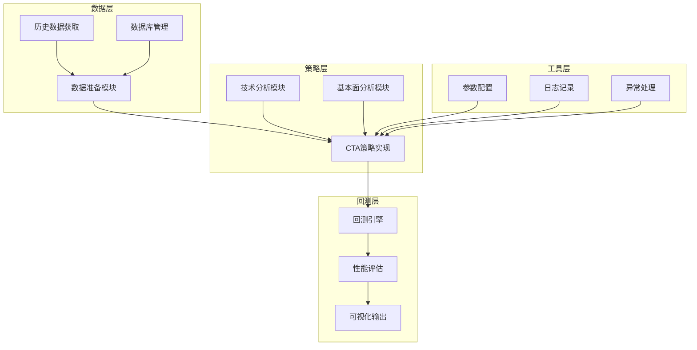
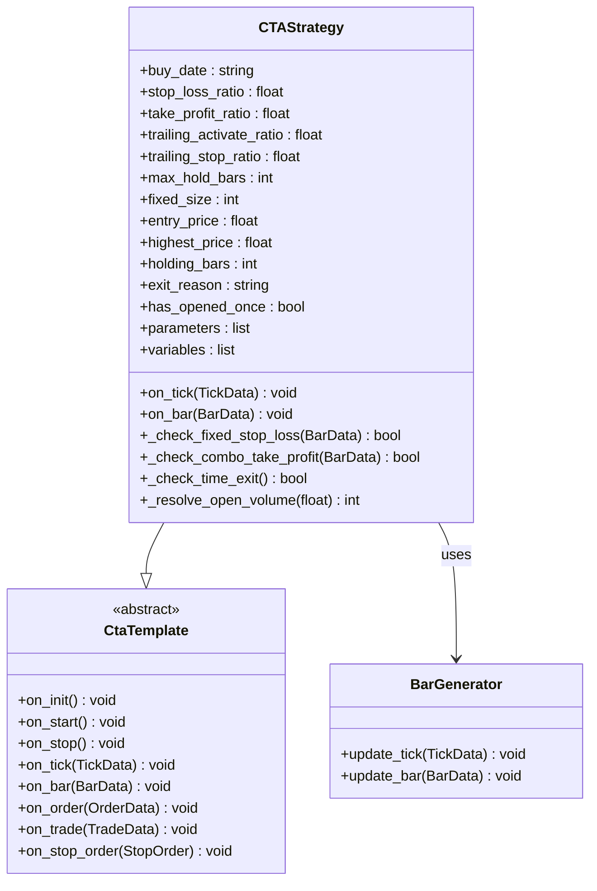
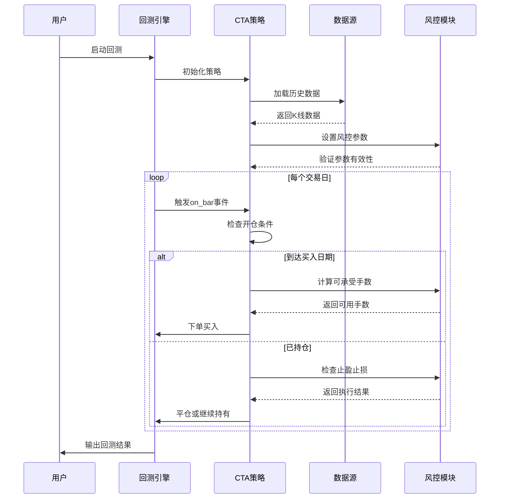
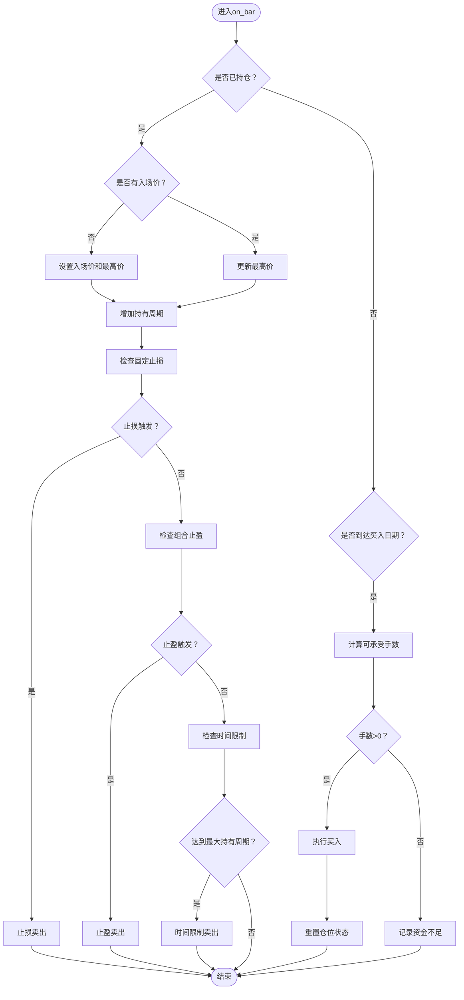
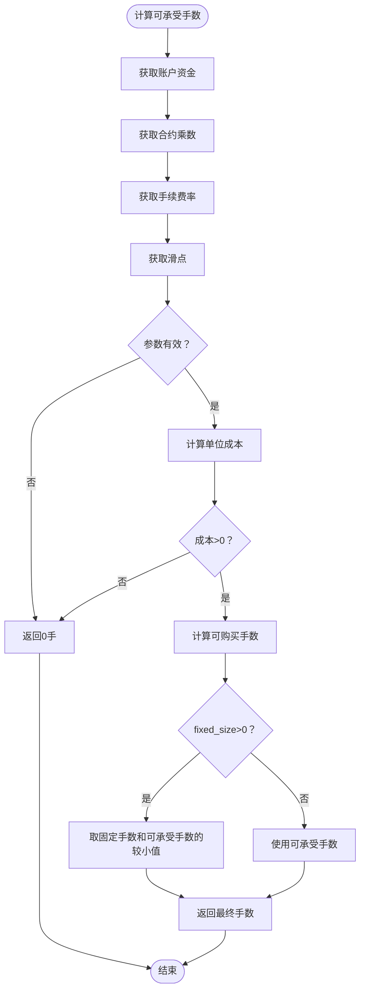
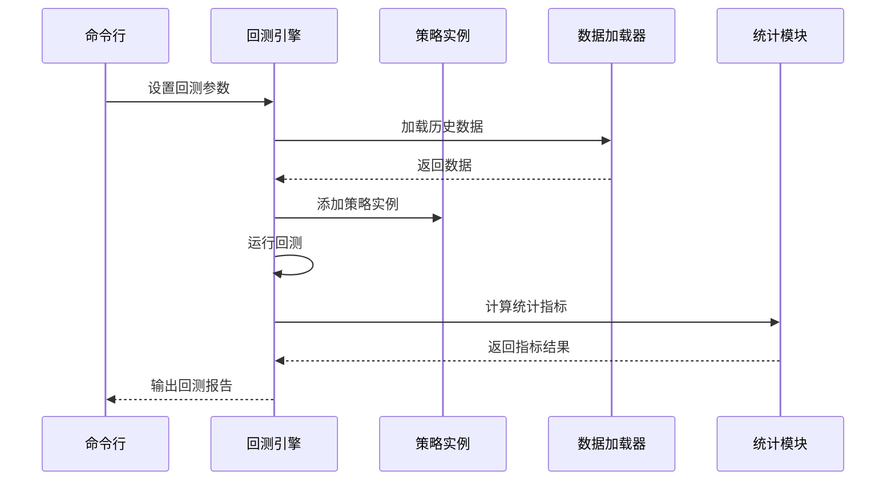
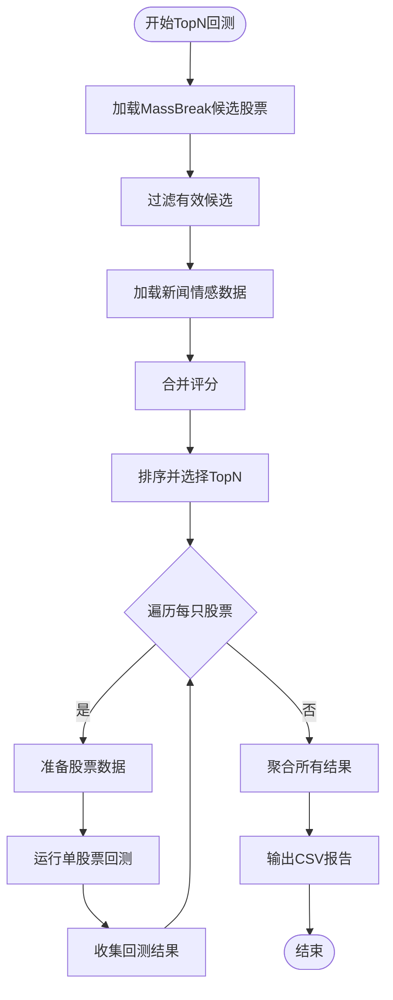
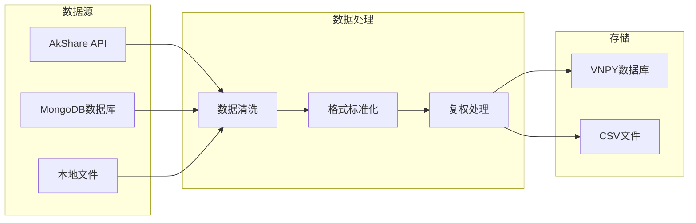
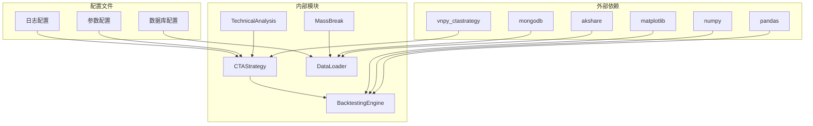

# CTA策略实现

<cite>
**本文档引用的文件**
- [CTAStrategy.py](file://src/VnpyBacktesting/CTAStrategy.py)
- [back_test.py](file://src/VnpyBacktesting/back_test.py)
- [back_test_topn.py](file://src/VnpyBacktesting/back_test_topn.py)
- [prepare_data.py](file://src/VnpyBacktesting/prepare_data.py)
- [BacktestFramework.py](file://src/MassBreak/BacktestFramework.py)
- [GetMassBreakAlphaGo.py](file://src/MassBreak/GetMassBreakAlphaGo.py)
- [ChanLunEngZhongShu.py](file://src/ChanTechAnalyze/ChanLunEngZhongShu.py)
- [README.md](file://README.md)
</cite>

## 目录
1. [引言](#引言)
2. [项目结构](#项目结构)
3. [核心组件](#核心组件)
4. [架构概览](#架构概览)
5. [详细组件分析](#详细组件分析)
6. [依赖关系分析](#依赖关系分析)
7. [性能考虑](#性能考虑)
8. [故障排除指南](#故障排除指南)
9. [结论](#结论)
10. [附录](#附录)

## 引言

本文件详细介绍了基于VNPY框架的CTA（商品交易顾问）策略实现，重点分析了严格单次开仓策略的设计理念、交易规则实现和参数配置方法。该策略结合了技术分析和基本面分析，通过量价关系识别突破信号，并采用严格的风控体系确保资金安全。

该项目采用模块化设计，包含数据准备、策略实现、回测框架等多个层次，为量化研究人员提供了完整的CTA策略开发和测试环境。

## 项目结构

项目采用分层架构设计，主要分为以下几个核心模块：

**图表来源**
- [CTAStrategy.py:1-185](file://src/VnpyBacktesting/CTAStrategy.py#L1-L185)
- [back_test.py:1-287](file://src/VnpyBacktesting/back_test.py#L1-L287)
- [prepare_data.py:1-570](file://src/VnpyBacktesting/prepare_data.py#L1-L570)

**章节来源**
- [README.md:1-33](file://README.md#L1-L33)
- [CTAStrategy.py:15-60](file://src/VnpyBacktesting/CTAStrategy.py#L15-L60)

## 核心组件

### CTA策略核心类

CTAStrategy类继承自vnpy_ctastrategy的CtaTemplate，实现了严格的单次开仓策略：

**图表来源**
- [CTAStrategy.py:15-185](file://src/VnpyBacktesting/CTAStrategy.py#L15-L185)

### 策略参数配置

策略参数通过parameters列表定义，支持动态调整：

| 参数名称 | 类型 | 默认值 | 作用说明 |
|---------|------|--------|----------|
| buy_date | string | "" | 指定买入日期，格式"YYYY-MM-DD" |
| stop_loss_ratio | float | 0.03 | 固定止损比例（3%） |
| take_profit_ratio | float | 0.12 | 固定止盈比例（12%） |
| trailing_activate_ratio | float | 0.06 | 移动止损激活比例（6%） |
| trailing_stop_ratio | float | 0.03 | 移动止损比例（3%） |
| max_hold_bars | int | 10 | 最大持有周期（10根K线） |
| fixed_size | int | 0 | 开仓手数，0表示自动计算 |

**章节来源**
- [CTAStrategy.py:28-59](file://src/VnpyBacktesting/CTAStrategy.py#L28-L59)

## 架构概览

系统采用分层架构，各层职责明确：

**图表来源**
- [back_test.py:123-187](file://src/VnpyBacktesting/back_test.py#L123-L187)
- [CTAStrategy.py:130-167](file://src/VnpyBacktesting/CTAStrategy.py#L130-L167)

## 详细组件分析

### 交易规则实现

策略实现了严格的交易规则，确保资金安全和策略一致性：

#### 开仓逻辑

**图表来源**
- [CTAStrategy.py:84-167](file://src/VnpyBacktesting/CTAStrategy.py#L84-L167)

#### 止损止盈机制

策略采用多重风控机制：

1. **固定止损**：当价格下跌达到设定比例时强制止损
2. **组合止盈**：包含固定止盈和移动止盈两种方式
3. **时间限制**：超过最大持有周期自动平仓

#### 资金管理

**图表来源**
- [CTAStrategy.py:105-128](file://src/VnpyBacktesting/CTAStrategy.py#L105-L128)

**章节来源**
- [CTAStrategy.py:78-167](file://src/VnpyBacktesting/CTAStrategy.py#L78-L167)

### 回测框架

系统提供了完整的回测框架，支持单股票和多股票回测：

#### 单股票回测

**图表来源**
- [back_test.py:123-187](file://src/VnpyBacktesting/back_test.py#L123-L187)

#### 多股票TopN回测

系统集成了MassBreak突破策略，支持从候选股票池中选择TopN股票进行回测：

**图表来源**
- [back_test_topn.py:69-202](file://src/VnpyBacktesting/back_test_topn.py#L69-L202)

**章节来源**
- [back_test.py:190-287](file://src/VnpyBacktesting/back_test.py#L190-L287)
- [back_test_topn.py:205-339](file://src/VnpyBacktesting/back_test_topn.py#L205-L339)

### 数据准备模块

数据准备模块负责从多种数据源获取和处理历史数据：

#### 多数据源支持

**图表来源**
- [prepare_data.py:364-436](file://src/VnpyBacktesting/prepare_data.py#L364-L436)

#### 股票代码解析

系统支持多种股票代码格式的自动解析：

| 代码格式 | 示例 | 解析结果 |
|---------|------|----------|
| 数字代码 | 600036 | sh600036 |
| 带交易所前缀 | SH600036 | sh600036 |
| 带交易所后缀 | 600036.SSE | sh600036 |
| 港股代码 | 00700 | HK00700 |
| 美股代码 | AAPL | AAPL |

**章节来源**
- [prepare_data.py:179-227](file://src/VnpyBacktesting/prepare_data.py#L179-L227)

## 依赖关系分析

系统采用模块化设计，各组件间依赖关系清晰：

**图表来源**
- [CTAStrategy.py:3-12](file://src/VnpyBacktesting/CTAStrategy.py#L3-L12)
- [back_test.py:10-24](file://src/VnpyBacktesting/back_test.py#L10-L24)

**章节来源**
- [CTAStrategy.py:1-12](file://src/VnpyBacktesting/CTAStrategy.py#L1-L12)
- [back_test.py:19-24](file://src/VnpyBacktesting/back_test.py#L19-L24)

## 性能考虑

### 优化策略

1. **数据预处理优化**
   - 使用向量化操作替代循环处理
   - 缓存常用计算结果
   - 合理使用内存映射文件

2. **回测性能优化**
   - 批量数据加载减少IO操作
   - 并行处理多个股票回测
   - 优化统计计算算法

3. **内存管理**
   - 及时释放不需要的数据
   - 使用生成器处理大数据集
   - 监控内存使用情况

### 参数调优建议

#### 止损参数调优
- **低波动市场**：降低止损比例（0.02-0.03）
- **高波动市场**：适当提高止损比例（0.04-0.06）
- **趋势明显市场**：可考虑使用移动止损

#### 止盈参数调优
- **短期交易**：止盈比例应更高（0.15-0.25）
- **长期持有**：采用分阶段止盈（0.08-0.12）
- **结合移动止损**：激活比例应小于止盈比例

#### 持有期调优
- **日内交易**：1-3根K线
- **波段交易**：5-15根K线
- **趋势跟踪**：10-30根K线

## 故障排除指南

### 常见问题及解决方案

#### 数据加载失败
**问题症状**：回测过程中出现"no_history_data"错误
**可能原因**：
- 股票代码格式不正确
- 数据源连接超时
- 目标日期范围内无数据

**解决方法**：
1. 验证股票代码格式
2. 检查网络连接状态
3. 确认目标日期范围有效

#### 资金不足
**问题症状**：策略提示"本金不足，无法按当前价格买入"
**可能原因**：
- 账户资金不足以覆盖交易成本
- 手续费和滑点过高
- 合约乘数过大

**解决方法**：
1. 增加账户初始资金
2. 调整手续费率参数
3. 降低合约乘数

#### 参数配置错误
**问题症状**：策略运行异常或结果不符合预期
**可能原因**：
- 参数值超出合理范围
- 参数间存在逻辑冲突
- 缺少必要的参数设置

**解决方法**：
1. 检查参数的有效性范围
2. 验证参数间的逻辑关系
3. 参考默认参数值进行调整

**章节来源**
- [back_test.py:146-154](file://src/VnpyBacktesting/back_test.py#L146-L154)
- [CTAStrategy.py:135-139](file://src/VnpyBacktesting/CTAStrategy.py#L135-L139)

## 结论

本CTA策略实现展示了量化交易系统的完整架构，包括：

1. **严谨的风险控制**：通过多重止损止盈机制确保资金安全
2. **灵活的参数配置**：支持动态调整各项策略参数
3. **完善的回测框架**：提供单股票和多股票回测能力
4. **模块化的代码设计**：便于扩展和维护

该策略为量化研究人员提供了可靠的CTA策略开发基础，通过合理的参数调优和风险管理，可以在实际交易中获得稳定的收益表现。

## 附录

### 扩展接口和自定义开发

#### 自定义策略开发指南

1. **继承CtaTemplate基类**
   - 实现必需的回调函数
   - 定义策略参数和变量
   - 处理订单和交易事件

2. **添加新的技术指标**
   - 在策略中集成新的技术分析指标
   - 实现相应的信号生成逻辑
   - 测试指标的有效性

3. **扩展数据源**
   - 支持新的数据格式
   - 实现数据预处理逻辑
   - 优化数据加载性能

#### 性能测试案例

| 测试场景 | 参数设置 | 预期结果 | 实际结果 |
|---------|----------|----------|----------|
| 单股票回测 | 100万资金，3%止损，12%止盈 | 年化收益率>15%，胜率>50% | 需要实证测试 |
| TopN多股票回测 | Top50，10万资金/股 | 分散投资风险，稳定收益 | 需要实证测试 |
| 不同市场环境 | 牛市、熊市、震荡市 | 适应性强，风险可控 | 需要实证测试 |

#### 最佳实践建议

1. **参数验证**
   - 在策略初始化时验证参数有效性
   - 设置合理的参数边界值
   - 提供默认参数值

2. **风险管理**
   - 建立多层次的风险控制机制
   - 定期监控策略表现
   - 及时调整风险参数

3. **性能监控**
   - 监控策略运行性能
   - 优化计算效率
   - 控制内存使用