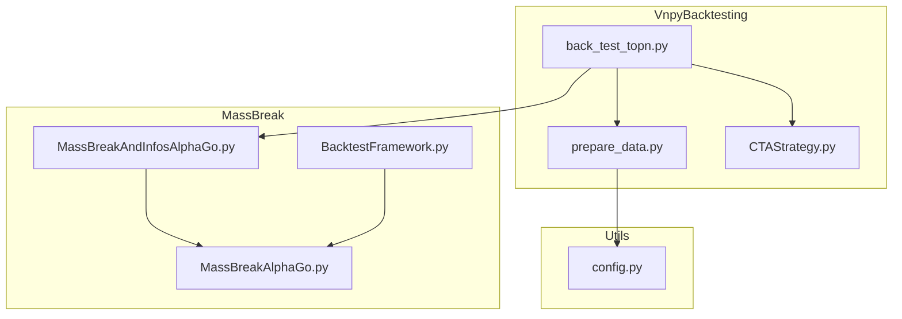
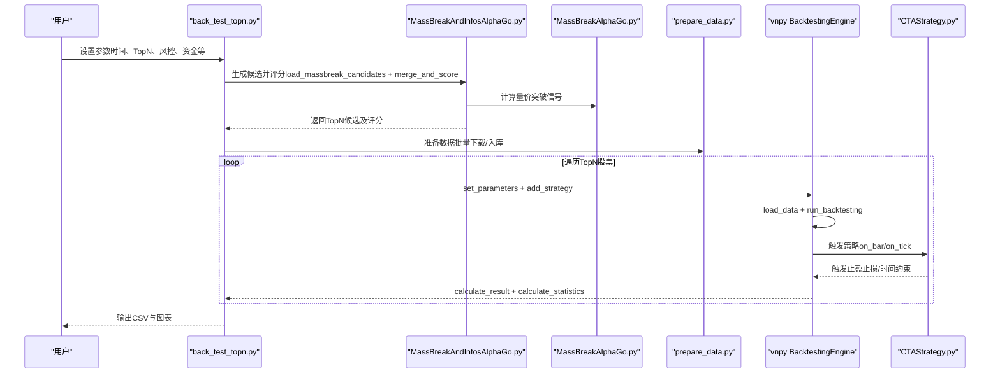
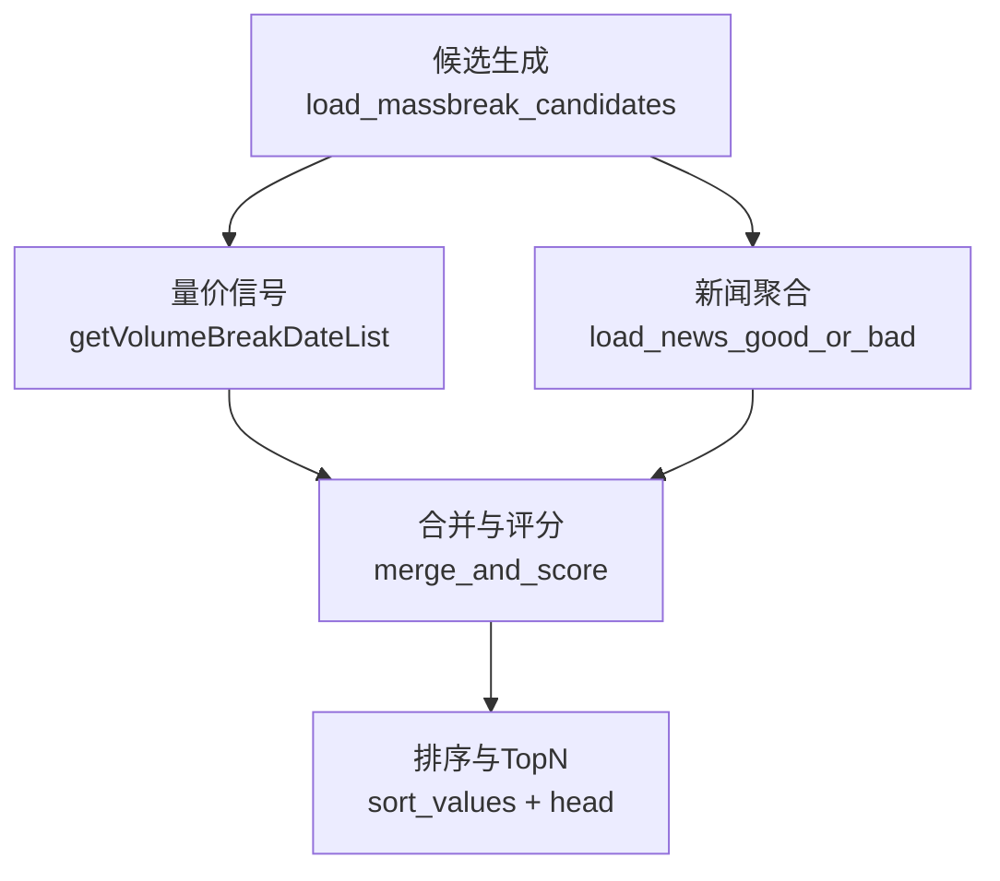
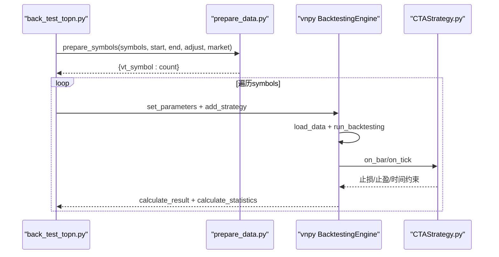
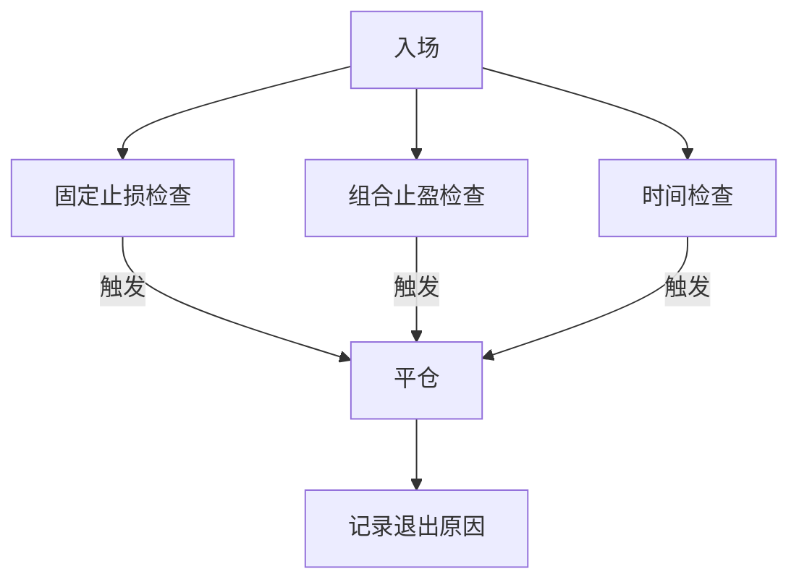
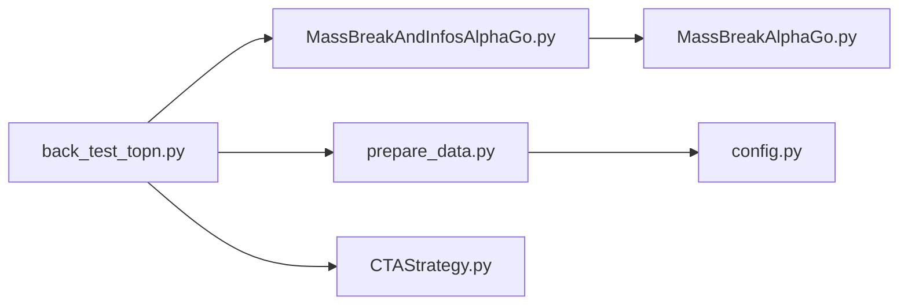

# TopN回测

<cite>
**本文引用的文件**
- [back_test_topn.py](file://src/VnpyBacktesting/back_test_topn.py)
- [back_test.py](file://src/VnpyBacktesting/back_test.py)
- [prepare_data.py](file://src/VnpyBacktesting/prepare_data.py)
- [CTAStrategy.py](file://src/VnpyBacktesting/CTAStrategy.py)
- [MassBreakAndInfosAlphaGo.py](file://src/MassBreak/MassBreakAndInfosAlphaGo.py)
- [BacktestFramework.py](file://src/MassBreak/BacktestFramework.py)
- [MassBreakAlphaGo.py](file://src/MassBreak/MassBreakAlphaGo.py)
- [config.py](file://src/Utils/config.py)
- [README.md](file://README.md)
</cite>

## 目录
1. [简介](#简介)
2. [项目结构](#项目结构)
3. [核心组件](#核心组件)
4. [架构总览](#架构总览)
5. [详细组件分析](#详细组件分析)
6. [依赖分析](#依赖分析)
7. [性能考量](#性能考量)
8. [故障排查指南](#故障排查指南)
9. [结论](#结论)
10. [附录](#附录)

## 简介
本文件面向量化研究人员与策略工程师，系统性阐述基于 vnpy 的 TopN 回测体系：从 TopN 选股与权重评分、到多股票组合回测执行、再到风险管理与参数优化、资金分配与仓位管理、以及结果分析与绩效评估。文档以仓库现有代码为依据，结合可视化图示，帮助快速搭建与优化多资产投资组合策略。

## 项目结构
该仓库围绕“新闻情感 + 量价突破”双因子驱动的 TopN 选股与回测展开，主要模块如下：
- VnpyBacktesting：vnpy 回测入口与策略封装
  - back_test_topn.py：TopN 选股 + 组合回测主流程
  - back_test.py：单票/列表回测入口（对比参考）
  - prepare_data.py：数据准备与入库（akshare -> vnpy 数据库）
  - CTAStrategy.py：vnpy CTA 策略模板（固定止盈止损 + 时间约束）
- MassBreak：量价突破与新闻评分融合
  - MassBreakAndInfosAlphaGo.py：加载候选、新闻聚合、评分与排序
  - BacktestFramework.py：通用回测框架（历史回放、指标计算）
  - MassBreakAlphaGo.py：量价突破算法（均线、放量、价格稳定、涨停特例）
- Utils：配置与数据库连接
  - config.py：数据库名、集合名、新闻库等配置

**图表来源**
- [back_test_topn.py:1-339](file://src/VnpyBacktesting/back_test_topn.py#L1-L339)
- [prepare_data.py:1-570](file://src/VnpyBacktesting/prepare_data.py#L1-L570)
- [CTAStrategy.py:1-185](file://src/VnpyBacktesting/CTAStrategy.py#L1-L185)
- [MassBreakAndInfosAlphaGo.py:1-493](file://src/MassBreak/MassBreakAndInfosAlphaGo.py#L1-L493)
- [BacktestFramework.py:1-498](file://src/MassBreak/BacktestFramework.py#L1-L498)
- [MassBreakAlphaGo.py:1-296](file://src/MassBreak/MassBreakAlphaGo.py#L1-L296)
- [config.py:1-455](file://src/Utils/config.py#L1-L455)

**章节来源**
- [README.md:1-33](file://README.md#L1-L33)

## 核心组件
- TopN 选股与评分
  - 量价突破候选：基于均线、放量、价格稳定与最低流动性门槛
  - 新闻情感聚合：按股票归集新闻，计算利好/利空计数与情绪平衡
  - 综合评分：基础分 + 新闻调整项 + 动量项 + 新鲜度项，降序取 TopN
- 组合回测执行
  - 数据准备：批量下载日线并入库（支持 cn/us/hk）
  - 回测引擎：vnpy BacktestingEngine + 自定义策略（固定止盈止损 + 时间约束）
  - 结果统计：总收益、年化、最大回撤、夏普比率、胜率、净盈亏等
- 风险管理与资金分配
  - 止损/止盈：固定止损与组合止盈（固定止盈+回撤止盈）
  - 时间约束：最大持有天数
  - 仓位管理：固定手数或按资金上限自动计算

**章节来源**
- [back_test_topn.py:69-95](file://src/VnpyBacktesting/back_test_topn.py#L69-L95)
- [MassBreakAndInfosAlphaGo.py:306-351](file://src/MassBreak/MassBreakAndInfosAlphaGo.py#L306-L351)
- [prepare_data.py:503-529](file://src/VnpyBacktesting/prepare_data.py#L503-L529)
- [CTAStrategy.py:15-185](file://src/VnpyBacktesting/CTAStrategy.py#L15-L185)

## 架构总览
下图展示 TopN 回测从“候选生成 -> 评分 -> 数据准备 -> 组合回测 -> 结果统计”的端到端流程。

**图表来源**
- [back_test_topn.py:133-202](file://src/VnpyBacktesting/back_test_topn.py#L133-L202)
- [MassBreakAndInfosAlphaGo.py:91-184](file://src/MassBreak/MassBreakAndInfosAlphaGo.py#L91-L184)
- [MassBreakAlphaGo.py:105-200](file://src/MassBreak/MassBreakAlphaGo.py#L105-L200)
- [prepare_data.py:503-529](file://src/VnpyBacktesting/prepare_data.py#L503-L529)
- [CTAStrategy.py:130-167](file://src/VnpyBacktesting/CTAStrategy.py#L130-L167)

## 详细组件分析

### TopN 选股与权重计算
- 量价突破信号
  - 均线窗口、放量倍数、持续放量天数、价格稳定阈值、最低流动性门槛
  - 放量期间价格稳定：以滚动窗口的极差/均值衡量
  - 涨停特例：开盘涨停场景下的特殊处理
- 新闻情感聚合
  - 以股票维度聚合新闻，统计利好/利空计数与情绪平衡
  - 可选择使用新标签字段替代旧标签
- 综合评分与排序
  - 基础分按匹配类型分层
  - 新闻调整项：与提及强度、情绪平衡相关
  - 动量项：最新成交量/均量比的单调调整
  - 新鲜度项：距今天数的指数衰减
  - 降序排序，取 TopN

**图表来源**
- [MassBreakAndInfosAlphaGo.py:91-184](file://src/MassBreak/MassBreakAndInfosAlphaGo.py#L91-L184)
- [MassBreakAndInfosAlphaGo.py:187-273](file://src/MassBreak/MassBreakAndInfosAlphaGo.py#L187-L273)
- [MassBreakAndInfosAlphaGo.py:353-407](file://src/MassBreak/MassBreakAndInfosAlphaGo.py#L353-L407)

**章节来源**
- [MassBreakAndInfosAlphaGo.py:91-184](file://src/MassBreak/MassBreakAndInfosAlphaGo.py#L91-L184)
- [MassBreakAndInfosAlphaGo.py:187-273](file://src/MassBreak/MassBreakAndInfosAlphaGo.py#L187-L273)
- [MassBreakAndInfosAlphaGo.py:306-351](file://src/MassBreak/MassBreakAndInfosAlphaGo.py#L306-L351)
- [MassBreakAndInfosAlphaGo.py:353-407](file://src/MassBreak/MassBreakAndInfosAlphaGo.py#L353-L407)

### 组合回测执行流程
- 数据准备
  - 解析股票代码（支持前缀/后缀/交易所映射）
  - 从 akshare 拉取日线，标准化列名，入库 vnpy 数据库
  - 支持 cn/us/hk 复权类型与清理/追加模式
- 回测引擎
  - 设置参数：vt_symbol、周期、起止时间、手续费/滑点/合约乘数/最小变动单位、初始资金
  - 注册策略：CTAStrategy（严格单次开仓）
  - 加载数据、运行回测、计算结果与统计指标
- 图表输出
  - 资金曲线、回撤、每日净盈亏三图叠加保存

**图表来源**
- [back_test_topn.py:133-202](file://src/VnpyBacktesting/back_test_topn.py#L133-L202)
- [prepare_data.py:503-529](file://src/VnpyBacktesting/prepare_data.py#L503-L529)
- [CTAStrategy.py:130-167](file://src/VnpyBacktesting/CTAStrategy.py#L130-L167)

**章节来源**
- [back_test_topn.py:133-202](file://src/VnpyBacktesting/back_test_topn.py#L133-L202)
- [prepare_data.py:503-529](file://src/VnpyBacktesting/prepare_data.py#L503-L529)

### 风险管理与资金分配
- 止损/止盈
  - 固定止损：入场价以下固定比例止损
  - 组合止盈：固定止盈或回撤止盈（激活阈值+回撤比例）
- 时间约束
  - 最大持有天数，超限强制平仓
- 仓位管理
  - 固定手数或按资金上限自动计算（考虑手续费/滑点/合约乘数）
  - 严格单次开仓，避免重复建仓

**图表来源**
- [CTAStrategy.py:84-104](file://src/VnpyBacktesting/CTAStrategy.py#L84-L104)
- [CTAStrategy.py:157-166](file://src/VnpyBacktesting/CTAStrategy.py#L157-L166)

**章节来源**
- [CTAStrategy.py:15-185](file://src/VnpyBacktesting/CTAStrategy.py#L15-L185)

### 参数配置与策略优化
- 选股参数
  - 均线窗口、放量倍数、持续放量天数、价格稳定阈值、最小突破次数、最大候选数
  - 新闻统计起始日期、是否使用新标签、评分参考日期
- 回测参数
  - 起止日期、复权类型、市场类型、资金、费率、滑点、合约乘数、最小变动单位
  - 止损/止盈比例、移动止损激活/回撤比例、最大持有天数、固定手数
- 优化建议
  - 通过网格/贝叶斯搜索在候选池上调参
  - 分层验证：先在短样本上验证信号有效性，再扩大样本
  - 引入交叉验证（时间序列分层）

**章节来源**
- [back_test_topn.py:205-249](file://src/VnpyBacktesting/back_test_topn.py#L205-L249)
- [back_test.py:190-228](file://src/VnpyBacktesting/back_test.py#L190-L228)

### 组合回测结果分析与绩效评估
- 关键指标
  - 总收益率、年化收益率、最大回撤率、夏普比率、收益回撤比、胜率、总净盈亏、期末资金
- 报告输出
  - CSV 文件包含每只股票的交易次数、最后成交日期/方向/价格、各指标
  - 可选保存 PNG 图表（资金曲线/回撤/每日净盈亏）

**章节来源**
- [back_test_topn.py:42-51](file://src/VnpyBacktesting/back_test_topn.py#L42-L51)
- [back_test_topn.py:105-131](file://src/VnpyBacktesting/back_test_topn.py#L105-L131)

## 依赖分析
- 模块耦合
  - back_test_topn.py 依赖 MassBreakAndInfosAlphaGo（候选与评分）、prepare_data（数据准备）、CTAStrategy（策略）
  - MassBreakAndInfosAlphaGo 依赖 MassBreakAlphaGo（量价信号）与数据库配置
  - prepare_data 依赖 vnpy 数据库接口与 akshare
- 外部依赖
  - vnpy_ctastrategy、akshare、pandas、matplotlib
- 潜在循环依赖
  - 当前模块间为单向依赖，未见循环导入

**图表来源**
- [back_test_topn.py:25-40](file://src/VnpyBacktesting/back_test_topn.py#L25-L40)
- [MassBreakAndInfosAlphaGo.py:22-28](file://src/MassBreak/MassBreakAndInfosAlphaGo.py#L22-L28)
- [prepare_data.py:13-16](file://src/VnpyBacktesting/prepare_data.py#L13-L16)
- [config.py:39-47](file://src/Utils/config.py#L39-L47)

**章节来源**
- [back_test_topn.py:25-40](file://src/VnpyBacktesting/back_test_topn.py#L25-L40)
- [MassBreakAndInfosAlphaGo.py:22-28](file://src/MassBreak/MassBreakAndInfosAlphaGo.py#L22-L28)
- [prepare_data.py:13-16](file://src/VnpyBacktesting/prepare_data.py#L13-L16)

## 性能考量
- 数据准备
  - 批量下载与入库采用迭代器方式，异常可选抛出或静默跳过
  - 支持代理环境清理与回退至 MongoDB
- 回测效率
  - vnpy 引擎内置高效回放与统计
  - 建议在 CPU 密集型任务中开启多进程（外部调度）
- 评分与候选规模
  - 通过 max_stocks 限制候选规模，降低回测压力
  - 新鲜度项采用指数衰减，避免过远日期影响

[本节为通用指导，无需特定文件引用]

## 故障排查指南
- 数据准备失败
  - akshare 请求异常：检查网络代理、重试与回退至 MongoDB
  - 代码解析失败：确认输入代码格式（前缀/后缀/交易所）
- 回测无历史数据
  - 检查 vt_symbol 是否正确、日期范围是否覆盖
- 资金分配不足
  - 固定手数过大或滑点/手续费过高导致无法下单
- 图表保存异常
  - 确认输出目录存在与权限

**章节来源**
- [prepare_data.py:401-436](file://src/VnpyBacktesting/prepare_data.py#L401-L436)
- [prepare_data.py:179-227](file://src/VnpyBacktesting/prepare_data.py#L179-L227)
- [back_test_topn.py:146-154](file://src/VnpyBacktesting/back_test_topn.py#L146-L154)
- [back_test_topn.py:190-200](file://src/VnpyBacktesting/back_test_topn.py#L190-L200)

## 结论
本 TopN 回测体系以“量价突破 + 新闻情感”为核心选股因子，结合 vnpy 引擎与严格风控策略，实现了从候选生成到组合回测的闭环。通过参数化配置与模块化设计，研究者可在不同市场与时间范围内快速迭代策略，并以稳健的风险控制与清晰的绩效评估支撑实盘落地。

[本节为总结，无需特定文件引用]

## 附录

### 实战测试案例与组合优化技巧
- 案例一：沪深 A 股 Top50 回测
  - 选股参数：均线30日、放量2倍、持续2天、价格稳定0.12、最小突破1次
  - 新闻参数：新闻起始日期、使用新标签、评分参考日期
  - 回测参数：资金100万、手续费2.5/10000、滑点0.01、固定手数100、最大持有5根K线
  - 输出：CSV与PNG图表，按最终评分与新闻计数排序
- 案例二：多市场对比
  - 市场类型切换（cn/us/hk），复权类型（qfq/hfq/不复权）
  - 保持其他参数一致，比较不同市场的信号稳定性与收益特征
- 组合优化技巧
  - 分层回测：先在近期样本验证，再扩展至全样本
  - 参数扫描：网格/贝叶斯搜索，固定止损/止盈比例与持有天数联动
  - 风控增强：引入移动止损激活阈值与回撤比例，提升回撤控制能力
  - 资产轮动：根据评分分位数分层构建组合，动态调整权重

**章节来源**
- [back_test_topn.py:205-249](file://src/VnpyBacktesting/back_test_topn.py#L205-L249)
- [MassBreakAndInfosAlphaGo.py:415-493](file://src/MassBreak/MassBreakAndInfosAlphaGo.py#L415-L493)