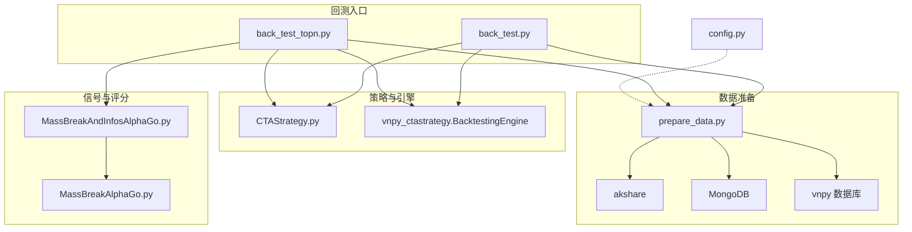
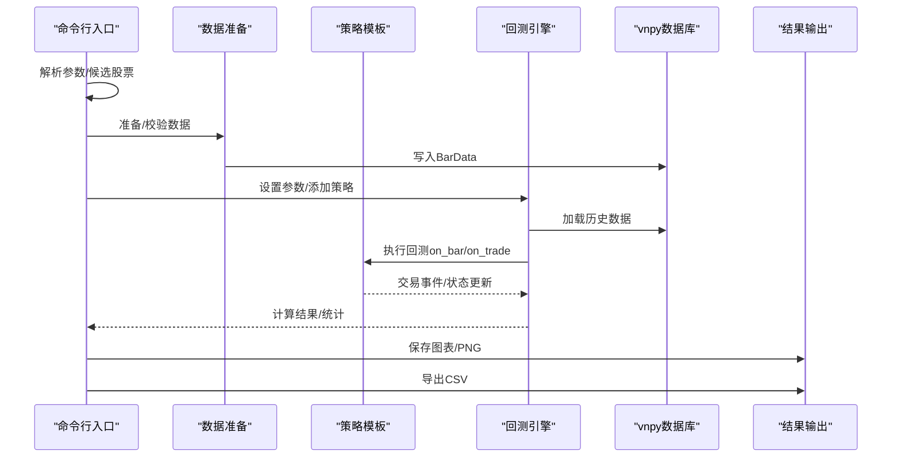
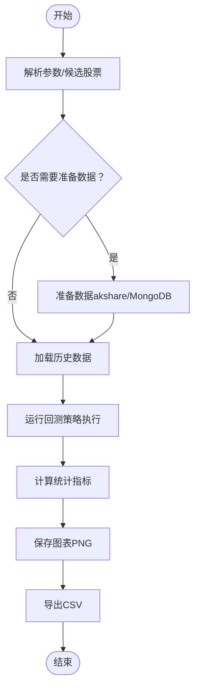
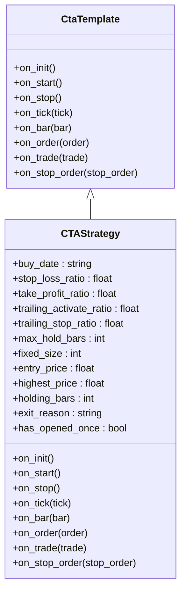
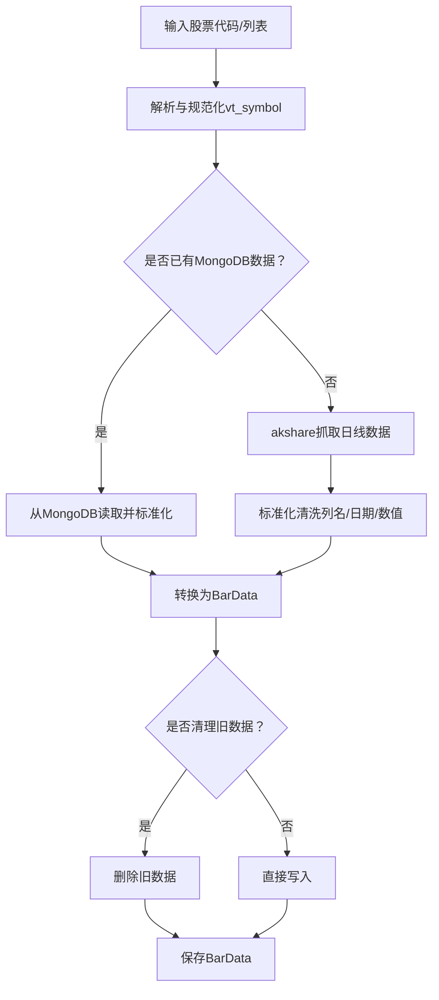
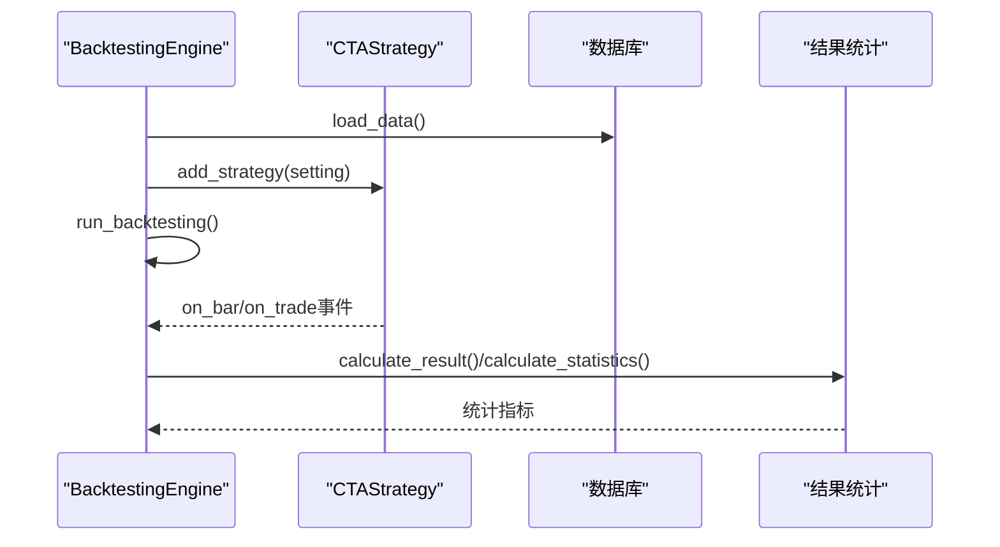
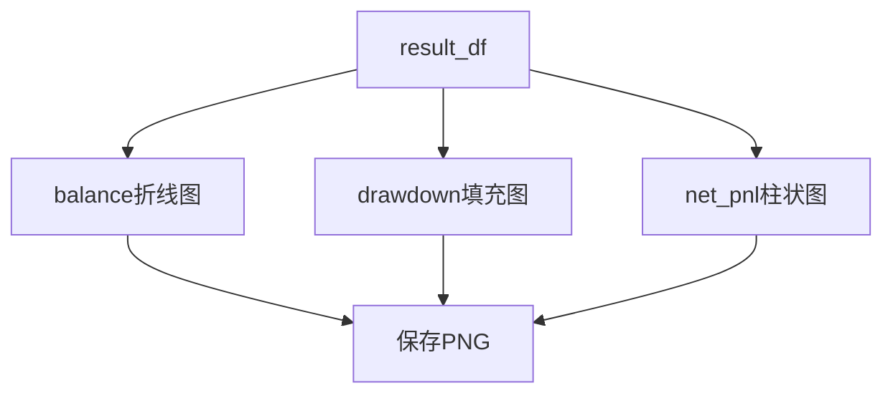
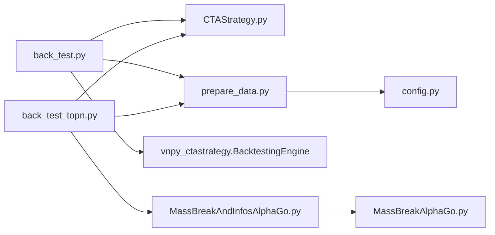

# 回测引擎

<cite>
**本文引用的文件**
- [back_test.py](file://src/VnpyBacktesting/back_test.py)
- [CTAStrategy.py](file://src/VnpyBacktesting/CTAStrategy.py)
- [prepare_data.py](file://src/VnpyBacktesting/prepare_data.py)
- [back_test_topn.py](file://src/VnpyBacktesting/back_test_topn.py)
- [MassBreakAndInfosAlphaGo.py](file://src/MassBreak/MassBreakAndInfosAlphaGo.py)
- [MassBreakAlphaGo.py](file://src/MassBreak/MassBreakAlphaGo.py)
- [config.py](file://src/Utils/config.py)
- [README.md](file://README.md)
</cite>

## 目录
1. [简介](#简介)
2. [项目结构](#项目结构)
3. [核心组件](#核心组件)
4. [架构总览](#架构总览)
5. [详细组件分析](#详细组件分析)
6. [依赖分析](#依赖分析)
7. [性能考虑](#性能考虑)
8. [故障排查指南](#故障排查指南)
9. [结论](#结论)
10. [附录](#附录)

## 简介
本文件面向量化研究与策略开发人员，系统性梳理仓库中的回测引擎实现，覆盖架构设计、参数配置、数据准备与加载、回测执行流程、结果统计与可视化、扩展接口与自定义开发、异常处理与诊断方法，并提供可操作的回测案例与策略验证流程，帮助快速搭建可靠的量化策略测试环境。

## 项目结构
回测引擎主要位于 VnpyBacktesting 目录，配合 MassBreak 量价信号与新闻情绪评分，形成“信号选择 + 回测验证”的闭环。关键文件职责如下：
- back_test.py：单股票/多股票回测入口，封装参数解析、数据准备、回测执行、结果统计与图表导出。
- CTAStrategy.py：基于 vnpy_ctastrategy 的策略模板，实现严格单次开仓、固定止损、组合止盈（固定止盈+跟踪止盈）、持有期限控制等规则。
- prepare_data.py：历史数据准备与入库，支持 akshare、MongoDB 回退、标准化清洗、vt_symbol 规范化、数据库写入。
- back_test_topn.py：TopN 股票回测入口，结合 MassBreak 量价信号与新闻情绪评分，自动筛选候选并批量回测。
- MassBreakAndInfosAlphaGo.py：MassBreak 信号与新闻情绪融合，生成候选股票池及评分。
- MassBreakAlphaGo.py：量价信号提取与放量突破识别算法。
- config.py：全局配置，包括数据库名称、路径等。
- README.md：项目背景与整体架构说明。

**图表来源**
- [back_test.py:1-287](file://src/VnpyBacktesting/back_test.py#L1-L287)
- [back_test_topn.py:1-339](file://src/VnpyBacktesting/back_test_topn.py#L1-L339)
- [CTAStrategy.py:1-185](file://src/VnpyBacktesting/CTAStrategy.py#L1-L185)
- [prepare_data.py:1-570](file://src/VnpyBacktesting/prepare_data.py#L1-L570)
- [MassBreakAndInfosAlphaGo.py:1-200](file://src/MassBreak/MassBreakAndInfosAlphaGo.py#L1-L200)
- [MassBreakAlphaGo.py:1-200](file://src/MassBreak/MassBreakAlphaGo.py#L1-L200)
- [config.py:1-455](file://src/Utils/config.py#L1-L455)

**章节来源**
- [back_test.py:1-287](file://src/VnpyBacktesting/back_test.py#L1-L287)
- [back_test_topn.py:1-339](file://src/VnpyBacktesting/back_test_topn.py#L1-L339)
- [prepare_data.py:1-570](file://src/VnpyBacktesting/prepare_data.py#L1-L570)
- [MassBreakAndInfosAlphaGo.py:1-200](file://src/MassBreak/MassBreakAndInfosAlphaGo.py#L1-L200)
- [MassBreakAlphaGo.py:1-200](file://src/MassBreak/MassBreakAlphaGo.py#L1-L200)
- [config.py:1-455](file://src/Utils/config.py#L1-L455)
- [README.md:1-33](file://README.md#L1-L33)

## 核心组件
- 回测引擎与策略
  - 回测引擎：基于 vnpy_ctastrategy.BacktestingEngine，负责参数设置、数据加载、回测执行、结果计算与统计。
  - 策略模板：CTAStrategy，继承 CtaTemplate，实现严格单次开仓、固定止损、组合止盈（固定止盈+跟踪止盈）、持有期限控制、资金与下单量约束等。
- 数据准备与加载
  - 数据准备：prepare_data.py 提供符号规范化、akshare/MongoDB 数据抓取、标准化清洗、BarData 构造、数据库写入。
  - 数据加载：BacktestingEngine.load_data() 从 vnpy 数据库读取日线 BarData。
- 信号与评分
  - MassBreak：识别放量突破信号，支持维持放量连续天数、价格稳定阈值、开盘涨停特例等。
  - 新闻情绪评分：融合 MassBreak 信号与新闻情绪，生成候选股票池与最终评分。
- 可视化与结果导出
  - 资金曲线、回撤、每日净盈亏三图绘制，PNG 文件保存。
  - 结果汇总 CSV 导出。

**章节来源**
- [CTAStrategy.py:15-185](file://src/VnpyBacktesting/CTAStrategy.py#L15-L185)
- [prepare_data.py:364-529](file://src/VnpyBacktesting/prepare_data.py#L364-L529)
- [back_test.py:123-187](file://src/VnpyBacktesting/back_test.py#L123-L187)
- [back_test_topn.py:133-202](file://src/VnpyBacktesting/back_test_topn.py#L133-L202)

## 架构总览
回测引擎采用“入口脚本 + 策略模板 + 数据准备 + 引擎执行 + 结果统计”的分层架构。入口脚本负责参数解析、候选股票解析、数据准备、批量回测与结果汇总；策略模板定义交易规则；数据准备负责历史数据的获取、清洗与入库；引擎负责回测执行与统计；结果导出负责图表与 CSV 输出。

**图表来源**
- [back_test.py:231-287](file://src/VnpyBacktesting/back_test.py#L231-L287)
- [back_test_topn.py:252-339](file://src/VnpyBacktesting/back_test_topn.py#L252-L339)
- [prepare_data.py:478-529](file://src/VnpyBacktesting/prepare_data.py#L478-L529)
- [CTAStrategy.py:61-185](file://src/VnpyBacktesting/CTAStrategy.py#L61-L185)

## 详细组件分析

### 回测入口与参数配置
- 单股票/列表回测入口（back_test.py）
  - 参数解析：支持单股票、股票列表、时间范围、数据准备选项、复权类型、市场类型、手续费率、滑点、合约乘数、最小价格变动、初始资金、策略参数（止损比例、止盈比例、跟踪激活比例、跟踪止盈比例、最大持有周期、固定手数）等。
  - 候选股票解析：支持 --single 或 --symbols；支持逐股票买入日期映射。
  - 数据准备：可跳过准备或清理旧数据；支持 akshare 抓取与 MongoDB 回退。
  - 回测执行：逐股票运行，记录成交笔数、最后成交日期/方向/价格、统计指标、图表文件与错误信息。
  - 结果导出：CSV 文件输出，包含中文字段映射。
- TopN 股票回测入口（back_test_topn.py）
  - 信号选择：调用 MassBreakAndInfosAlphaGo 生成候选，支持均量窗口、放量倍数、连续天数、价格稳定阈值、最小 Break 数、新闻统计起始日期、是否使用新标签、TopN 等。
  - 资金分配：总资金按 TopN 等额分配到每只股票。
  - 回测流程与输出同上。

**图表来源**
- [back_test.py:190-287](file://src/VnpyBacktesting/back_test.py#L190-L287)
- [back_test_topn.py:205-339](file://src/VnpyBacktesting/back_test_topn.py#L205-L339)

**章节来源**
- [back_test.py:190-287](file://src/VnpyBacktesting/back_test.py#L190-L287)
- [back_test_topn.py:205-339](file://src/VnpyBacktesting/back_test_topn.py#L205-L339)

### 策略模板与交易规则
- 策略类（CTAStrategy）
  - 严格单次开仓：仅在 buy_date 指定日期开仓一次；之后不再二次开仓。
  - 止损止盈：固定止损（固定比例）+ 组合止盈（固定止盈或跟踪止盈）。
  - 持有期控制：超过 max_hold_bars 自动平仓。
  - 资金与下单量：根据资金、合约乘数、费率、滑点计算可承受手数；fixed_size<=0 时自动计算最大可买手数。
  - 状态变量：入场价、最高价、持有周期、平仓原因、是否已开仓。

**图表来源**
- [CTAStrategy.py:15-185](file://src/VnpyBacktesting/CTAStrategy.py#L15-L185)

**章节来源**
- [CTAStrategy.py:15-185](file://src/VnpyBacktesting/CTAStrategy.py#L15-L185)

### 数据准备与加载
- 符号解析与规范化
  - 支持多种输入格式（数字、带前缀/后缀、交易所后缀），自动推断交易所与标准化为 vt_symbol。
  - 支持 cn/us/hk 市场类型，不同市场的代码规范与交易所映射。
- 数据抓取与回退
  - 优先使用 akshare 接口拉取日线数据，支持 qfq/hfq 复权；失败时尝试 MongoDB 回退。
  - 清洗与标准化：统一列名、日期格式、数值类型、缺失值处理；若无成交额则按均价法估算。
- 数据入库
  - 将标准化后的 DataFrame 转换为 vnpy BarData 列表并写入数据库；可选择清理旧数据或追加。

**图表来源**
- [prepare_data.py:179-529](file://src/VnpyBacktesting/prepare_data.py#L179-L529)

**章节来源**
- [prepare_data.py:179-529](file://src/VnpyBacktesting/prepare_data.py#L179-L529)

### 回测执行流程与结果计算
- 执行流程
  - 设置参数：vt_symbol、interval、start/end、rate/slippage/size/pricetick/capital。
  - 添加策略：传入策略类与策略参数字典。
  - 加载数据：BacktestingEngine.load_data() 从数据库读取历史数据。
  - 运行回测：BacktestingEngine.run_backtesting() 驱动策略 on_bar/on_trade。
  - 计算结果：calculate_result() 生成每日资金曲线、回撤、净盈亏等。
  - 统计指标：calculate_statistics() 输出总收益、年化收益、最大回撤率、夏普比率、收益回撤比、胜率、总净盈亏、期末资金等。
  - 图表与导出：保存 PNG 图表，导出 CSV。
- 结果字段映射
  - 总收益率、年化收益率、最大回撤率、夏普比率、收益回撤比、胜率、总净盈亏、期末资金等，均以中文字段输出。

**图表来源**
- [back_test.py:123-187](file://src/VnpyBacktesting/back_test.py#L123-L187)
- [back_test_topn.py:133-202](file://src/VnpyBacktesting/back_test_topn.py#L133-L202)

**章节来源**
- [back_test.py:123-187](file://src/VnpyBacktesting/back_test.py#L123-L187)
- [back_test_topn.py:133-202](file://src/VnpyBacktesting/back_test_topn.py#L133-L202)

### 可视化与图表生成
- 资金曲线：balance 时间序列折线图。
- 回撤：drawdown 填充区域图。
- 每日净盈亏：net_pnl 柱状图。
- 图表保存：PNG 文件，支持 DPI 设置与布局调整；异常时记录错误信息。

**图表来源**
- [back_test.py:95-121](file://src/VnpyBacktesting/back_test.py#L95-L121)
- [back_test_topn.py:105-131](file://src/VnpyBacktesting/back_test_topn.py#L105-L131)

**章节来源**
- [back_test.py:95-121](file://src/VnpyBacktesting/back_test.py#L95-L121)
- [back_test_topn.py:105-131](file://src/VnpyBacktesting/back_test_topn.py#L105-L131)

### 扩展接口与自定义开发
- 自定义策略
  - 继承 CtaTemplate，重写 on_init/on_start/on_stop/on_tick/on_bar/on_order/on_trade/on_stop_order。
  - 在策略中使用 self.cancel_all()、self.buy()/sell() 等委托接口。
  - 通过 parameters/variables 暴露策略参数与变量，便于回测引擎参数扫描。
- 自定义数据源
  - 在 prepare_data.py 中扩展 fetch_daily_* 函数，支持新的数据源或预处理逻辑。
  - 保持返回 DataFrame 的列名与类型一致，确保 convert_ak_to_bars() 能正确构造 BarData。
- 自定义信号与评分
  - 在 MassBreakAndInfosAlphaGo.py 中扩展候选筛选与评分逻辑，或新增独立信号模块。
- 参数扫描与批量回测
  - 在入口脚本中增加参数网格，循环调用 run_one_backtest 并汇总结果。

**章节来源**
- [CTAStrategy.py:61-185](file://src/VnpyBacktesting/CTAStrategy.py#L61-L185)
- [prepare_data.py:364-462](file://src/VnpyBacktesting/prepare_data.py#L364-L462)
- [MassBreakAndInfosAlphaGo.py:91-184](file://src/MassBreak/MassBreakAndInfosAlphaGo.py#L91-L184)

## 依赖分析
- 外部依赖
  - vnpy_trader/vnpy_ctastrategy：回测引擎与策略框架。
  - akshare：日线数据抓取。
  - MongoDB：历史数据回退存储。
  - pandas/matplotlib：数据处理与图表绘制。
- 内部依赖
  - back_test.py/back_test_topn.py 依赖 CTAStrategy、prepare_data。
  - back_test_topn.py 依赖 MassBreakAndInfosAlphaGo 与 MassBreakAlphaGo。
  - prepare_data.py 依赖 Utils.config 与 Utils.database。

**图表来源**
- [back_test.py:19-24](file://src/VnpyBacktesting/back_test.py#L19-L24)
- [back_test_topn.py:25-40](file://src/VnpyBacktesting/back_test_topn.py#L25-L40)
- [prepare_data.py:13-16](file://src/VnpyBacktesting/prepare_data.py#L13-L16)
- [config.py:39-47](file://src/Utils/config.py#L39-L47)

**章节来源**
- [back_test.py:19-24](file://src/VnpyBacktesting/back_test.py#L19-L24)
- [back_test_topn.py:25-40](file://src/VnpyBacktesting/back_test_topn.py#L25-L40)
- [prepare_data.py:13-16](file://src/VnpyBacktesting/prepare_data.py#L13-L16)
- [config.py:39-47](file://src/Utils/config.py#L39-L47)

## 性能考虑
- 数据抓取与清洗
  - akshare 抓取可能受网络与限流影响，prepare_data.py 已内置重试与代理清空逻辑；建议合理设置重试次数与等待间隔。
  - 标准化清洗步骤较多，建议在大规模回测前先进行小规模验证，确保列名与类型一致性。
- 回测执行
  - vnpy_backtesting 引擎按日线驱动策略，策略逻辑尽量简洁；避免在 on_bar 中进行复杂计算。
  - 大量股票回测时，建议分批执行并并行化（外部进程池），注意内存与磁盘 IO。
- 图表生成
  - matplotlib 使用 Agg 后端，适合服务器无 GUI 环境；PNG 保存建议控制 DPI 与图像尺寸，平衡清晰度与体积。

[本节为通用指导，无需特定文件来源]

## 故障排查指南
- 数据准备阶段
  - akshare 抓取失败：检查网络与代理设置；确认 market 与 adjust 参数；查看 MongoDB 回退是否可用。
  - 符号解析错误：确认输入格式（数字/带前缀/后缀/交易所后缀），确保 market 类型正确。
  - 数据为空：确认日期范围与复权类型；检查 MongoDB 回退集合是否存在有效数据。
- 回测执行阶段
  - 无历史数据：engine.history_data 为空，需检查数据准备是否成功；确认 vt_symbol 与数据库一致。
  - 策略未开仓：检查 buy_date 是否在回测范围内；fixed_size 与资金是否足够；资金不足时会记录日志并跳过开仓。
  - 统计指标异常：确认时间范围与交易频率；检查手续费率、滑点、合约乘数设置是否合理。
- 可视化与导出
  - 图表保存失败：检查 chart_dir 权限与磁盘空间；查看错误信息字段。
  - CSV 导出失败：检查输出路径权限与字符编码。

**章节来源**
- [prepare_data.py:364-436](file://src/VnpyBacktesting/prepare_data.py#L364-L436)
- [back_test.py:146-154](file://src/VnpyBacktesting/back_test.py#L146-L154)
- [CTAStrategy.py:105-128](file://src/VnpyBacktesting/CTAStrategy.py#L105-L128)
- [back_test.py:175-184](file://src/VnpyBacktesting/back_test.py#L175-L184)

## 结论
本回测引擎以 vnpy_ctastrategy 为核心，结合 akshare/MongoDB 数据准备、MassBreak 量价信号与新闻情绪评分，提供了从候选筛选到批量回测、结果统计与可视化的完整链路。通过参数化配置与策略模板化设计，用户可以快速扩展策略、接入新数据源、进行参数扫描与策略验证，构建稳健的量化策略测试环境。

[本节为总结，无需特定文件来源]

## 附录

### 回测参数配置清单
- 时间范围
  - --start-date/--end-date：YYYY-MM-DD
- 数据准备
  - --skip-prepare/--no-clean/--adjust/--market
- 交易成本与合约
  - --capital/--rate/--slippage/--size/--pricetick
- 策略参数
  - --buy-date/--symbol-buy-dates
  - --stop-loss-ratio/--take-profit-ratio/--trailing-activate-ratio/--trailing-stop-ratio/--max-hold-bars/--fixed-size
- 可视化与输出
  - --show-chart/--no-show-chart/--no-save-chart/--chart-dir/--output-csv

**章节来源**
- [back_test.py:190-228](file://src/VnpyBacktesting/back_test.py#L190-L228)
- [back_test_topn.py:205-249](file://src/VnpyBacktesting/back_test_topn.py#L205-L249)

### 实际回测案例与策略验证流程
- 单股票回测
  - 步骤：指定 --single 或 --symbols，设置时间范围与策略参数，执行脚本，查看 CSV 与 PNG。
  - 注意：逐股票买入日期可通过 --symbol-buy-dates 指定。
- TopN 股票回测
  - 步骤：设置 MassBreak 参数（均量窗口、放量倍数、连续天数、价格稳定阈值、最小 Break 数、新闻统计起始日期、TopN 等），执行脚本，查看候选与回测结果。
  - 注意：资金按 TopN 等额分配，图表仅对单股票回测保存。

**章节来源**
- [back_test.py:231-287](file://src/VnpyBacktesting/back_test.py#L231-L287)
- [back_test_topn.py:252-339](file://src/VnpyBacktesting/back_test_topn.py#L252-L339)