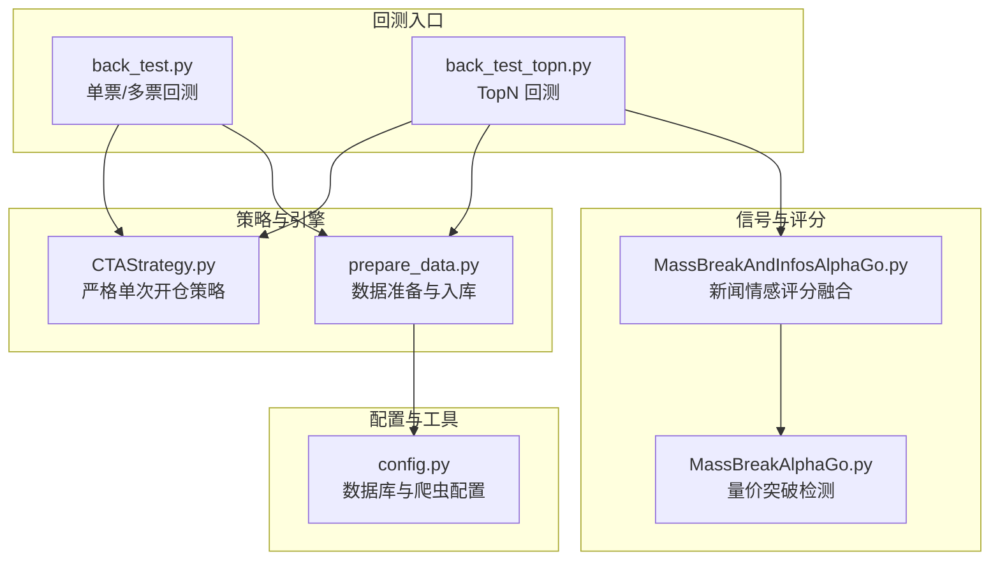
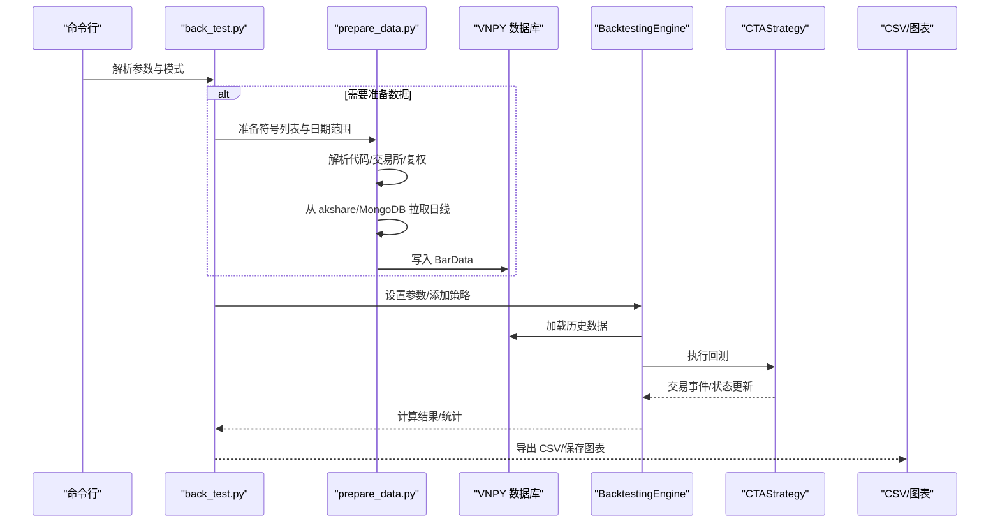
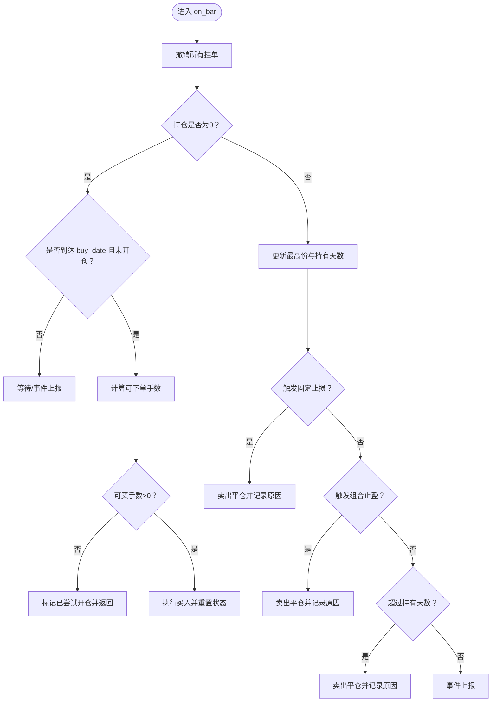
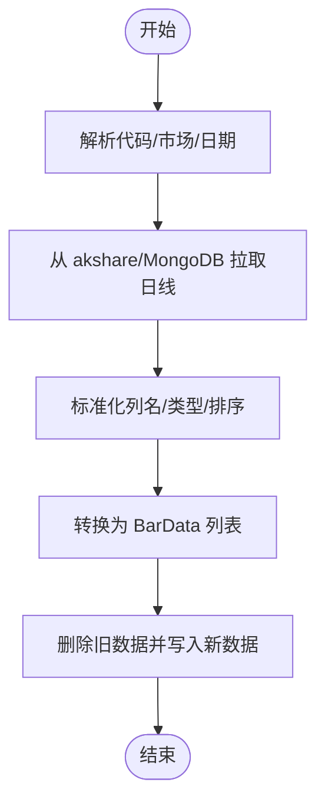
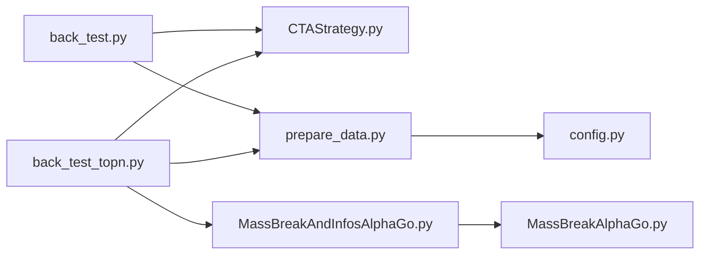

# 回测框架

<cite>
**本文引用的文件**
- [README.md](file://README.md)
- [back_test.py](file://src/VnpyBacktesting/back_test.py)
- [CTAStrategy.py](file://src/VnpyBacktesting/CTAStrategy.py)
- [prepare_data.py](file://src/VnpyBacktesting/prepare_data.py)
- [back_test_topn.py](file://src/VnpyBacktesting/back_test_topn.py)
- [MassBreakAndInfosAlphaGo.py](file://src/MassBreak/MassBreakAndInfosAlphaGo.py)
- [MassBreakAlphaGo.py](file://src/MassBreak/MassBreakAlphaGo.py)
- [config.py](file://src/Utils/config.py)
</cite>

## 目录
1. [简介](#简介)
2. [项目结构](#项目结构)
3. [核心组件](#核心组件)
4. [架构总览](#架构总览)
5. [详细组件分析](#详细组件分析)
6. [依赖关系分析](#依赖关系分析)
7. [性能考量](#性能考量)
8. [故障排查指南](#故障排查指南)
9. [结论](#结论)
10. [附录](#附录)

## 简介
本项目是一个基于 VNPY 的量化回测框架，结合了量价突破信号（MassBreak）与新闻情感评分，形成“信号+新闻”的综合选股与回测体系。框架提供两类回测入口：
- 单票/多票回测：给定股票与买入日期，执行严格单次开仓策略，内置固定止损、组合止盈（固定止盈+回撤止盈）、持有天数限制等风控。
- TopN 回测：先通过 MassBreak 识别潜在突破标的，再结合新闻情感评分排序，对 TopN 股票逐一回测，资金按股票数均分。

框架还提供了完整的数据准备流程，支持 A 股、港股、美股市场，自动从 akshare 拉取日线数据并写入 VNPY 数据库，支持复权处理与 MongoDB 回退。

## 项目结构
项目采用模块化组织，核心位于 src/VnpyBacktesting，技术分析与新闻情感评分位于 src/MassBreak，通用配置与工具位于 src/Utils。

**图表来源**
- [back_test.py:190-228](file://src/VnpyBacktesting/back_test.py#L190-L228)
- [back_test_topn.py:205-249](file://src/VnpyBacktesting/back_test_topn.py#L205-L249)
- [CTAStrategy.py:15-59](file://src/VnpyBacktesting/CTAStrategy.py#L15-L59)
- [prepare_data.py:531-541](file://src/VnpyBacktesting/prepare_data.py#L531-L541)
- [MassBreakAndInfosAlphaGo.py:415-435](file://src/MassBreak/MassBreakAndInfosAlphaGo.py#L415-L435)
- [MassBreakAlphaGo.py:104-213](file://src/MassBreak/MassBreakAlphaGo.py#L104-L213)
- [config.py:39-47](file://src/Utils/config.py#L39-L47)

**章节来源**
- [README.md:1-33](file://README.md#L1-L33)
- [back_test.py:1-287](file://src/VnpyBacktesting/back_test.py#L1-L287)
- [back_test_topn.py:1-339](file://src/VnpyBacktesting/back_test_topn.py#L1-L339)
- [CTAStrategy.py:1-185](file://src/VnpyBacktesting/CTAStrategy.py#L1-L185)
- [prepare_data.py:1-570](file://src/VnpyBacktesting/prepare_data.py#L1-L570)
- [MassBreakAndInfosAlphaGo.py:1-493](file://src/MassBreak/MassBreakAndInfosAlphaGo.py#L1-L493)
- [MassBreakAlphaGo.py:1-296](file://src/MassBreak/MassBreakAlphaGo.py#L1-L296)
- [config.py:1-455](file://src/Utils/config.py#L1-L455)

## 核心组件
- 回测引擎与策略
  - 回测引擎：基于 VNPY 的 BacktestingEngine，负责参数设置、数据加载、回测执行、结果统计与交易记录导出。
  - 策略模板：CTAStrategy，继承自 CtaTemplate，实现严格单次开仓策略，支持固定止损、组合止盈（固定止盈+回撤止盈）、持有天数限制、按资金与滑点计算可下单手数等。
- 数据准备与入库
  - 支持 A 股、港股、美股代码解析与标准化，自动识别交易所后缀与前缀，统一 vt_symbol。
  - 优先从 akshare 拉取日线数据，支持 qfq/hfq 复权；若失败则回退到 MongoDB；最终转换为 VNPY BarData 并入库。
- 信号与评分
  - MassBreak：基于成交量突破与价格稳定性的量价信号检测，支持“维持放量连续 X 天”与开盘涨停特例处理。
  - 新闻情感评分：基于特定股票新闻集合，统计利好/利空数量与平衡值，结合成交量动量与时间新鲜度给出综合评分。
- TopN 回测流程
  - 先通过 MassBreak 生成候选，再结合新闻情感评分排序，取 TopN 进行回测，资金均分到每只股票。

**章节来源**
- [CTAStrategy.py:15-185](file://src/VnpyBacktesting/CTAStrategy.py#L15-L185)
- [prepare_data.py:179-261](file://src/VnpyBacktesting/prepare_data.py#L179-L261)
- [MassBreakAlphaGo.py:104-213](file://src/MassBreak/MassBreakAlphaGo.py#L104-L213)
- [MassBreakAndInfosAlphaGo.py:91-184](file://src/MassBreak/MassBreakAndInfosAlphaGo.py#L91-L184)
- [back_test_topn.py:69-95](file://src/VnpyBacktesting/back_test_topn.py#L69-L95)

## 架构总览
整体架构由“数据准备—信号生成—策略回测—结果汇总”构成，支持两种回测模式：单票/多票与 TopN。

**图表来源**
- [back_test.py:231-287](file://src/VnpyBacktesting/back_test.py#L231-L287)
- [prepare_data.py:503-529](file://src/VnpyBacktesting/prepare_data.py#L503-L529)
- [CTAStrategy.py:61-185](file://src/VnpyBacktesting/CTAStrategy.py#L61-L185)

## 详细组件分析

### 组件A：严格单次开仓策略（CTAStrategy）
- 设计要点
  - 仅在 buy_date 指定日期开仓一次，防止重复开仓。
  - 固定止损：按入场价下穿一定比例触发。
  - 组合止盈：固定止盈或回撤止盈（回撤激活比例+回撤止盈比例）二选一触发。
  - 持有天数限制：超过 max_hold_bars 强制平仓。
  - 资金适配：根据手续费、滑点与账户资金自动计算可下单手数，避免超买。
- 关键变量与参数
  - 参数：buy_date、stop_loss_ratio、take_profit_ratio、trailing_activate_ratio、trailing_stop_ratio、max_hold_bars、fixed_size。
  - 变量：entry_price、highest_price、holding_bars、exit_reason、has_opened_once。
- 触发逻辑流程

**图表来源**
- [CTAStrategy.py:130-167](file://src/VnpyBacktesting/CTAStrategy.py#L130-L167)

**章节来源**
- [CTAStrategy.py:15-185](file://src/VnpyBacktesting/CTAStrategy.py#L15-L185)

### 组件B：数据准备与入库（prepare_data.py）
- 功能概览
  - 代码解析：支持多种输入格式（600000、sh600000、600000.SSE、HK00700 等），自动推断交易所与标准化。
  - 数据拉取：优先 akshare，失败回退 MongoDB；支持 cn/us/hk 三种市场。
  - 数据入库：转换为 VNPY BarData，写入数据库，支持清理旧数据或增量写入。
- 关键流程

**图表来源**
- [prepare_data.py:478-501](file://src/VnpyBacktesting/prepare_data.py#L478-L501)
- [prepare_data.py:364-437](file://src/VnpyBacktesting/prepare_data.py#L364-L437)

**章节来源**
- [prepare_data.py:179-261](file://src/VnpyBacktesting/prepare_data.py#L179-L261)
- [prepare_data.py:364-437](file://src/VnpyBacktesting/prepare_data.py#L364-L437)
- [prepare_data.py:465-476](file://src/VnpyBacktesting/prepare_data.py#L465-L476)

### 组件C：量价突破信号（MassBreakAlphaGo）
- 核心算法
  - 计算 N 日均量与最小量，过滤低流动性。
  - 计算今日量比与价格稳定性（KeepDays 窗口内价格区间/均价）。
  - 连续 K 天满足放量且价格稳定后，标记为信号日。
  - 可选：开盘涨停特例处理（针对 A 股）。
- 输出
  - 信号日期列表、价格方差、最新量比、平均量比、开盘涨停信号日期等。

**章节来源**
- [MassBreakAlphaGo.py:104-213](file://src/MassBreak/MassBreakAlphaGo.py#L104-L213)

### 组件D：新闻情感评分与融合（MassBreakAndInfosAlphaGo）
- 流程
  - 从候选股票池中提取股票代码，调用 MassBreak 生成信号。
  - 读取特定股票新闻集合，统计利好/利空数量与平衡值。
  - 综合评分：基础分层、新闻项调整、动量项（量比）、新鲜度项（时间衰减），最终归一到 0-100。
- 排序与输出
  - 按最终评分降序，输出 TopN 与明细。

**章节来源**
- [MassBreakAndInfosAlphaGo.py:91-184](file://src/MassBreak/MassBreakAndInfosAlphaGo.py#L91-L184)
- [MassBreakAndInfosAlphaGo.py:187-273](file://src/MassBreak/MassBreakAndInfosAlphaGo.py#L187-L273)
- [MassBreakAndInfosAlphaGo.py:306-407](file://src/MassBreak/MassBreakAndInfosAlphaGo.py#L306-L407)

### 组件E：TopN 回测主流程（back_test_topn.py）
- 步骤
  - 生成 TopN 候选：MassBreak 信号 + 新闻情感评分。
  - 将资金均分到每只股票，设置每只股票的初始资本。
  - 逐只回测，收集交易与统计指标，输出 CSV 与图表。
- 关键参数
  - market、ave_date、ratio、keep_days、price_stable_threshold、min_break_count、news_start_date、use_new_label、max_stocks、as_of_date、top_n 等。

**章节来源**
- [back_test_topn.py:69-95](file://src/VnpyBacktesting/back_test_topn.py#L69-L95)
- [back_test_topn.py:133-203](file://src/VnpyBacktesting/back_test_topn.py#L133-L203)
- [back_test_topn.py:205-249](file://src/VnpyBacktesting/back_test_topn.py#L205-L249)

### 组件F：单票/多票回测主流程（back_test.py）
- 步骤
  - 解析符号列表或单个符号，支持逐股票指定买入日期。
  - 准备数据（可跳过），加载历史数据，执行回测，计算统计指标，导出 CSV 与图表。
- 关键参数
  - start_date、end_date、capital、rate、slippage、size、pricetick、buy_date、symbol_buy_dates 等。

**章节来源**
- [back_test.py:42-48](file://src/VnpyBacktesting/back_test.py#L42-L48)
- [back_test.py:123-187](file://src/VnpyBacktesting/back_test.py#L123-L187)
- [back_test.py:190-228](file://src/VnpyBacktesting/back_test.py#L190-L228)

## 依赖关系分析
- 模块耦合
  - back_test.py 与 back_test_topn.py 分别依赖 CTAStrategy 与 prepare_data，前者独立，后者还依赖 MassBreakAndInfosAlphaGo。
  - MassBreakAndInfosAlphaGo 依赖 MassBreakAlphaGo 与数据库配置。
  - prepare_data 依赖 VNPY 数据库接口与 akshare，同时可回退到 MongoDB。
- 外部依赖
  - VNPY 回测引擎与数据库接口。
  - akshare 日线数据源。
  - MongoDB 存储（可选）。
  - Matplotlib 图表输出。

**图表来源**
- [back_test.py:19-24](file://src/VnpyBacktesting/back_test.py#L19-L24)
- [back_test_topn.py:25-40](file://src/VnpyBacktesting/back_test_topn.py#L25-L40)
- [MassBreakAndInfosAlphaGo.py:22-28](file://src/MassBreak/MassBreakAndInfosAlphaGo.py#L22-L28)
- [prepare_data.py:13-15](file://src/VnpyBacktesting/prepare_data.py#L13-L15)
- [config.py:39-47](file://src/Utils/config.py#L39-L47)

**章节来源**
- [back_test.py:1-287](file://src/VnpyBacktesting/back_test.py#L1-L287)
- [back_test_topn.py:1-339](file://src/VnpyBacktesting/back_test_topn.py#L1-L339)
- [MassBreakAndInfosAlphaGo.py:1-493](file://src/MassBreak/MassBreakAndInfosAlphaGo.py#L1-L493)
- [prepare_data.py:1-570](file://src/VnpyBacktesting/prepare_data.py#L1-L570)
- [config.py:1-455](file://src/Utils/config.py#L1-L455)

## 性能考量
- 数据准备
  - akshare 拉取可能受网络影响，框架已内置重试与代理环境清理逻辑；建议合理设置重试次数与代理配置。
  - MongoDB 回退路径可提升可用性，但查询性能不及本地数据库，建议在大规模回测前预热缓存。
- 回测执行
  - 单策略回测速度主要受限于历史数据长度与 Bar 数量；建议在长周期回测时开启 no-clean 以避免重复入库。
  - 图表保存使用非阻塞后端，避免长时间阻塞；批量回测时注意磁盘空间与 IO。
- TopN 回测
  - 资金均分策略可降低单只股票波动对整体的影响，但需确保每只股票的交易成本与滑点一致。

[本节为通用指导，无需具体文件引用]

## 故障排查指南
- 无历史数据
  - 现象：回测返回 no_history_data。
  - 排查：确认数据准备阶段成功写入数据库；检查日期范围、市场类型与代码标准化是否正确。
- 代码解析失败
  - 现象：无法解析股票代码或 vt_symbol。
  - 排查：确认输入格式（如 sh600000、600000.SSE、HK00700）；检查 market 参数与交易所映射。
- akshare 拉取失败
  - 现象：抛出 RuntimeError，提示 akshare 拉取失败且 MongoDB 无数据。
  - 排查：检查网络与代理设置；尝试更换代理或直连；确认目标市场与代码有效。
- 资金不足无法下单
  - 现象：策略日志提示本金不足，无法按当前价格买入。
  - 排查：检查 capital、rate、slippage、size 是否合理；fixed_size<=0 时会自动按资金计算手数。
- 图表保存异常
  - 现象：保存 PNG 抛出异常并记录错误信息。
  - 排查：确认 chart_dir 权限与磁盘空间；检查 matplotlib 后端配置。

**章节来源**
- [back_test.py:146-155](file://src/VnpyBacktesting/back_test.py#L146-L155)
- [prepare_data.py:432-437](file://src/VnpyBacktesting/prepare_data.py#L432-L437)
- [CTAStrategy.py:135-143](file://src/VnpyBacktesting/CTAStrategy.py#L135-L143)

## 结论
本框架将量价突破信号与新闻情感评分相结合，提供从数据准备到回测执行的完整闭环。通过严格单次开仓策略与多重风控（固定止损、组合止盈、持有天数限制），能够稳健地评估策略在不同市场与时间维度上的表现。TopN 回测进一步提升了策略筛选与资金分配的科学性。建议在实际使用中：
- 明确参数边界（如 stop_loss_ratio、take_profit_ratio、max_hold_bars），结合历史数据进行敏感性测试。
- 在大规模回测前完成数据预热与缓存，提升执行效率。
- 结合新闻评分与量价信号的权重调整，探索更优的选股与择时策略。

[本节为总结性内容，无需具体文件引用]

## 附录

### A. 回测策略编写与参数配置
- 策略参数
  - buy_date：强制买入日期（YYYY-MM-DD）。
  - stop_loss_ratio：固定止损比例。
  - take_profit_ratio：固定止盈比例。
  - trailing_activate_ratio：回撤止盈激活比例。
  - trailing_stop_ratio：回撤止盈比例。
  - max_hold_bars：最大持有周期。
  - fixed_size：固定下单手数；<=0 时按资金自动计算。
- 策略行为
  - 仅在 buy_date 开仓一次；否则等待。
  - 持仓期间按顺序检查止损、组合止盈、持有天数，任一触发即平仓。
  - 平仓后不再二次开仓。

**章节来源**
- [CTAStrategy.py:28-59](file://src/VnpyBacktesting/CTAStrategy.py#L28-L59)
- [back_test.py:50-59](file://src/VnpyBacktesting/back_test.py#L50-L59)
- [back_test_topn.py:58-66](file://src/VnpyBacktesting/back_test_topn.py#L58-L66)

### B. 绩效评估指标与解读
- 指标映射（中文名）
  - total_return：总收益率（%）
  - annual_return：年化收益率（%）
  - max_ddpercent：最大回撤率（%）
  - sharpe_ratio：夏普比率
  - return_drawdown_ratio：收益回撤比
  - win_ratio：胜率
  - total_net_pnl：总净盈亏
  - end_balance：期末资金
- 解读建议
  - 夏普比率>0 且越高越好，反映单位风险超额收益。
  - 最大回撤率越低越好，反映下行风险控制能力。
  - 收益回撤比越高越好，衡量收益与回撤的平衡。
  - 胜率与总收益率需结合策略频率与波动共同评估。

**章节来源**
- [back_test.py:26-35](file://src/VnpyBacktesting/back_test.py#L26-L35)
- [back_test_topn.py:42-51](file://src/VnpyBacktesting/back_test_topn.py#L42-L51)

### C. 风险控制机制与应用策略
- 固定止损：跌破入场价一定比例立即止损。
- 组合止盈：固定止盈或回撤止盈二选一，兼顾利润保护与趋势延续。
- 持有天数限制：避免长期套牢，控制最长暴露时间。
- 资金适配：考虑手续费与滑点，自动计算可下单手数，避免超买。
- TopN 资金均分：降低单一股票波动对整体的影响。

**章节来源**
- [CTAStrategy.py:84-104](file://src/VnpyBacktesting/CTAStrategy.py#L84-L104)
- [CTAStrategy.py:105-129](file://src/VnpyBacktesting/CTAStrategy.py#L105-L129)
- [back_test_topn.py:97-103](file://src/VnpyBacktesting/back_test_topn.py#L97-L103)

### D. 数据准备流程与历史数据处理
- 输入格式支持：600000、sh600000、600000.SSE、HK00700、US.AAPL 等。
- 市场类型：cn/us/hk。
- 复权类型：qfq/hfq（空字符串表示不复权）。
- 数据来源：akshare 优先，失败回退 MongoDB；最终入库 VNPY。
- 日期范围：start_date 至 end_date，自动过滤无效日期。

**章节来源**
- [prepare_data.py:179-227](file://src/VnpyBacktesting/prepare_data.py#L179-L227)
- [prepare_data.py:364-437](file://src/VnpyBacktesting/prepare_data.py#L364-L437)
- [prepare_data.py:465-476](file://src/VnpyBacktesting/prepare_data.py#L465-L476)

### E. 扩展接口与自定义策略开发
- 自定义策略
  - 继承 CtaTemplate，实现 on_bar/on_tick/on_trade 等回调，接入 BarGenerator。
  - 在 on_bar 中根据自定义信号下单，注意风控与资金管理。
- 扩展数据源
  - 在 prepare_data 中增加新的数据源接口，保持统一的 DataFrame 规范与入库流程。
- 扩展信号
  - 在 MassBreak 之外增加其他技术信号（如均线、MACD、布林带等），并在 MassBreakAndInfosAlphaGo 中融合评分。

**章节来源**
- [CTAStrategy.py:61-77](file://src/VnpyBacktesting/CTAStrategy.py#L61-L77)
- [MassBreakAndInfosAlphaGo.py:353-407](file://src/MassBreak/MassBreakAndInfosAlphaGo.py#L353-L407)

### F. 实际回测案例与策略优化技巧
- 案例一：单票回测
  - 场景：指定 sh600000，买入日期为 2024-01-01，参数：止损 3%、止盈 10%、回撤激活 6%、回撤止盈 3%、持有 5 天、固定手数 100。
  - 步骤：准备数据（可跳过）、回测、导出 CSV 与图表。
- 案例二：TopN 回测
  - 场景：市场 cn，开始日期 2024-01-01，均量窗口 30，放量倍数 2.0，连续放量天数 2，价格稳定阈值 0.12，TopN=50。
  - 步骤：MassBreak 生成候选→新闻情感评分→TopN 选股→资金均分→逐只回测→汇总结果。
- 优化技巧
  - 参数扫描：固定止损与止盈的组合在不同市场与周期下的表现差异较大，建议网格化扫描。
  - 信号融合：将量价信号与新闻评分权重动态调整，观察对胜率与收益回撤比的影响。
  - 数据质量：确保复权方式与交易日历一致，避免回测偏差。

**章节来源**
- [back_test.py:231-287](file://src/VnpyBacktesting/back_test.py#L231-L287)
- [back_test_topn.py:252-339](file://src/VnpyBacktesting/back_test_topn.py#L252-L339)