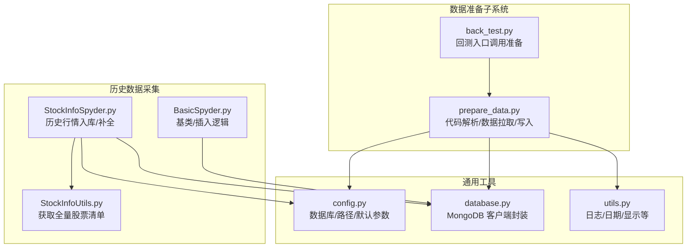
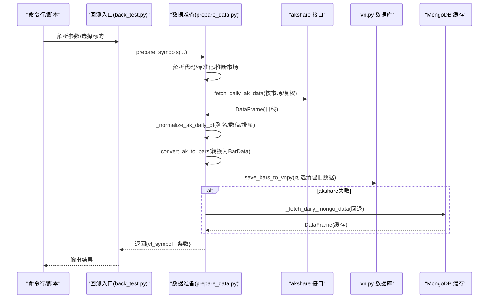
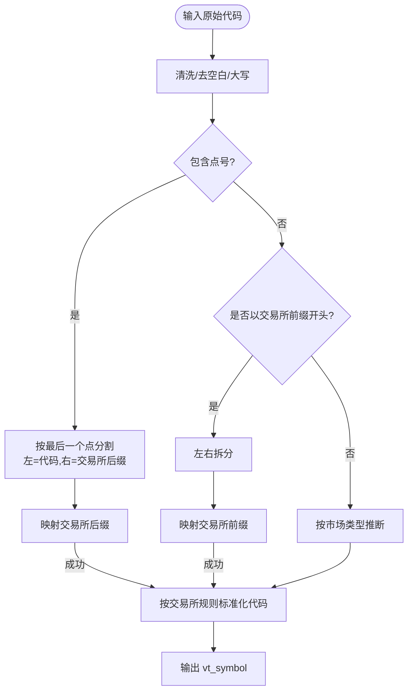
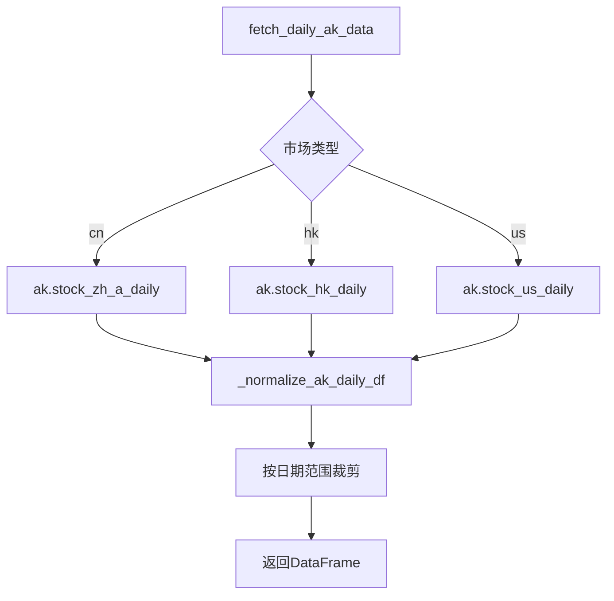
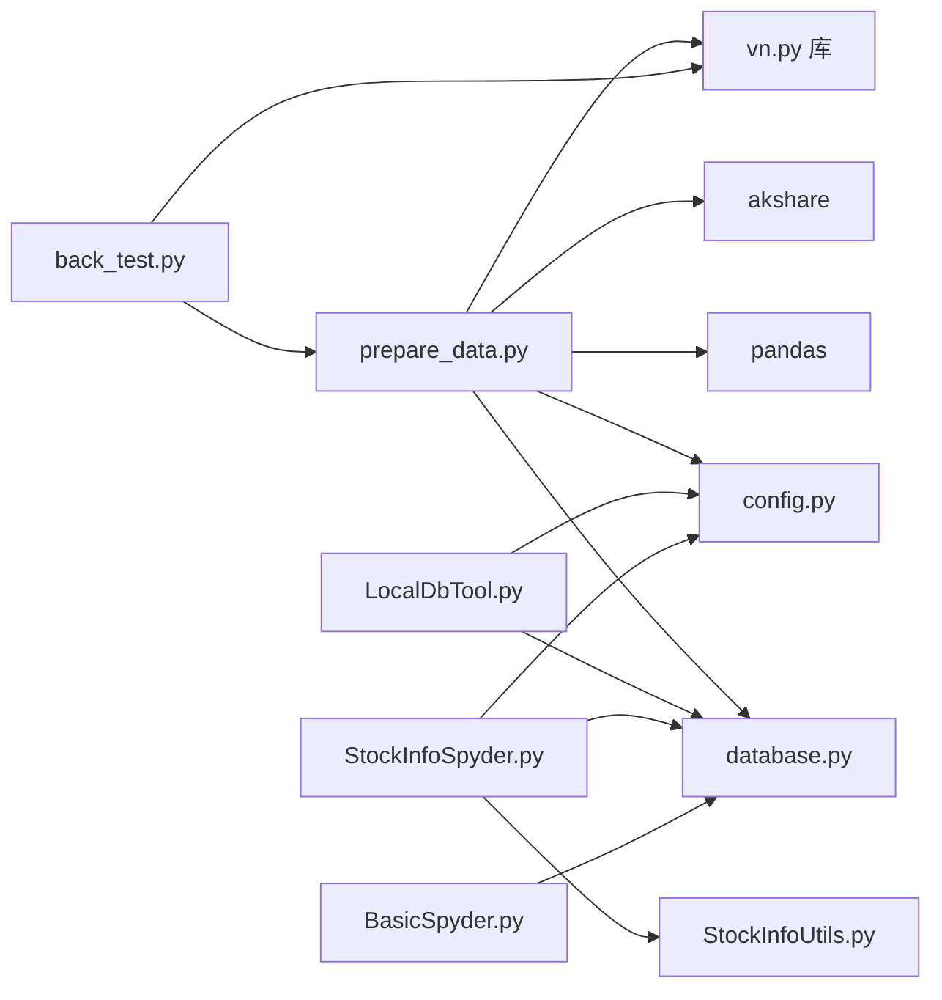

# 数据准备

<cite>
**本文引用的文件**
- [prepare_data.py](file://src/VnpyBacktesting/prepare_data.py)
- [back_test.py](file://src/VnpyBacktesting/back_test.py)
- [config.py](file://src/Utils/config.py)
- [database.py](file://src/Utils/database.py)
- [LocalDbTool.py](file://src/MongoDbComTools/LocalDbTool.py)
- [StockInfoSpyder.py](file://src/MarketPriceSpiderWithScrapy/StockInfoSpyder.py)
- [BasicSpyder.py](file://src/MarketPriceSpiderWithScrapy/BasicSpyder.py)
- [StockInfoUtils.py](file://src/MarketPriceSpiderWithScrapy/StockInfoUtils.py)
- [utils.py](file://src/Utils/utils.py)
- [README.md](file://README.md)
</cite>

## 目录
1. [简介](#简介)
2. [项目结构](#项目结构)
3. [核心组件](#核心组件)
4. [架构总览](#架构总览)
5. [详细组件分析](#详细组件分析)
6. [依赖关系分析](#依赖关系分析)
7. [性能考量](#性能考量)
8. [故障排查指南](#故障排查指南)
9. [结论](#结论)
10. [附录](#附录)

## 简介
本文件面向“数据准备”模块，系统性阐述历史数据准备的完整流程与实现机制，覆盖以下方面：
- 股票代码解析与标准化：支持中/港/美市场的多格式代码输入，自动推断交易所与标准化输出。
- 数据下载与预处理：统一从 akshare 拉取日线数据，进行列名归一、数值清洗、复权处理与范围裁剪。
- 数据验证与完整性检查：缺失列检测、空数据校验、排序与去重保障。
- 参数配置：时间范围、市场类型、复权方式、是否清理旧数据、严格模式等。
- 错误处理与异常恢复：重试、代理环境清理、回退到本地 MongoDB 缓存。
- 缓存与重复数据处理：MongoDB 集合命名规范、ID 去重策略、候选集合名生成。
- 实战案例与常见问题：如何准备单/多标的、如何处理网络异常、如何选择复权方式等。

## 项目结构
数据准备模块位于 VnpyBacktesting 子目录，配合通用工具与数据库层协同工作，形成“代码解析 → 数据拉取 → 规范化 → 写入 vn.py 数据库”的闭环。

**图表来源**
- [prepare_data.py:1-570](file://src/VnpyBacktesting/prepare_data.py#L1-L570)
- [back_test.py:1-287](file://src/VnpyBacktesting/back_test.py#L1-L287)
- [config.py:1-455](file://src/Utils/config.py#L1-L455)
- [database.py:1-176](file://src/Utils/database.py#L1-L176)
- [StockInfoSpyder.py:1-881](file://src/MarketPriceSpiderWithScrapy/StockInfoSpyder.py#L1-L881)
- [BasicSpyder.py:1-41](file://src/MarketPriceSpiderWithScrapy/BasicSpyder.py#L1-L41)
- [StockInfoUtils.py:1-129](file://src/MarketPriceSpiderWithScrapy/StockInfoUtils.py#L1-L129)

**章节来源**
- [README.md:1-33](file://README.md#L1-L33)
- [prepare_data.py:1-570](file://src/VnpyBacktesting/prepare_data.py#L1-L570)
- [back_test.py:1-287](file://src/VnpyBacktesting/back_test.py#L1-L287)

## 核心组件
- 代码解析与标准化
  - 支持多种输入格式：纯数字、带前缀、带后缀交易所、带点号分隔等。
  - 自动识别市场类型（cn/us/hk），并推断交易所。
  - 统一输出 vn.py 标准符号格式（如 sh600000.SSE）。
- 数据拉取与复权
  - 优先从 akshare 拉取日线数据，按市场类型调用对应接口。
  - 支持 qfq/hfq 复权方式，或不复权。
  - 对 akshare 返回的 DataFrame 进行列名归一、数值清洗、排序与范围裁剪。
- 数据写入与缓存
  - 将标准化后的日线数据转换为 vn.py BarData 对象，写入 vn.py 数据库。
  - 若 akshare 失败，尝试从本地 MongoDB 缓存回退读取。
- 参数与控制
  - 命令行参数：单标或多标、开始/结束日期、复权方式、市场类型、是否清理旧数据、严格模式。
  - 可编程调用：load_massbreak_symbols、prepare_symbols、prepare_single_symbol。

**章节来源**
- [prepare_data.py:62-570](file://src/VnpyBacktesting/prepare_data.py#L62-L570)
- [back_test.py:190-287](file://src/VnpyBacktesting/back_test.py#L190-L287)

## 架构总览
数据准备的端到端流程如下：

**图表来源**
- [back_test.py:243-254](file://src/VnpyBacktesting/back_test.py#L243-L254)
- [prepare_data.py:364-437](file://src/VnpyBacktesting/prepare_data.py#L364-L437)
- [prepare_data.py:439-476](file://src/VnpyBacktesting/prepare_data.py#L439-L476)

## 详细组件分析

### 1) 股票代码解析与标准化
- 输入兼容性
  - 支持 sh600000、600000.SSE、600000、HK00001、US.TSLA、SMART.TSLA 等多种格式。
  - 自动去除多余空白、大小写归一。
- 交易所推断
  - 中A：根据首位数字推断上/深/北交所。
  - 港股：统一 zfill(5)。
  - 美股：SMART/NASDAQ/NYSE 等映射。
- 输出标准化
  - 统一输出为 “代码.交易所缩写” 的 vt_symbol 格式，便于后续写入数据库。

**图表来源**
- [prepare_data.py:179-226](file://src/VnpyBacktesting/prepare_data.py#L179-L226)

**章节来源**
- [prepare_data.py:23-59](file://src/VnpyBacktesting/prepare_data.py#L23-L59)
- [prepare_data.py:179-226](file://src/VnpyBacktesting/prepare_data.py#L179-L226)

### 2) 数据下载与预处理
- 下载来源与回退
  - 优先 akshare：cn 调用 A 股接口，hk 调用港股接口，us 调用美股接口。
  - 失败时清除代理环境变量，再重试；最终回退到本地 MongoDB 缓存。
- 列名归一与数值清洗
  - 自动识别日期/开盘/收盘/最高/最低/成交量/成交额等列，统一为英文列名。
  - 数值强制转换并丢弃无效行，按日期升序排序。
- 复权处理
  - 支持 qfq/hfq/不复权；若 akshare 返回数据为空或无可用列，抛出明确错误。
- 时间范围裁剪
  - 仅保留落在 [start, end] 范围内的记录，保证回测区间一致。

**图表来源**
- [prepare_data.py:364-437](file://src/VnpyBacktesting/prepare_data.py#L364-L437)
- [prepare_data.py:120-176](file://src/VnpyBacktesting/prepare_data.py#L120-L176)

**章节来源**
- [prepare_data.py:364-437](file://src/VnpyBacktesting/prepare_data.py#L364-L437)
- [prepare_data.py:120-176](file://src/VnpyBacktesting/prepare_data.py#L120-L176)

### 3) 数据验证与完整性检查
- 必备列检查：必须存在日期、开盘、收盘、最高、最低、成交量之一组。
- 空值与异常：数值转换失败的行会被丢弃；空 DataFrame 抛错。
- 排序与唯一性：按日期升序排序，确保回测顺序正确。
- MongoDB 回退：若 akshare 多次失败，尝试从本地集合候选中读取缓存数据。

**章节来源**
- [prepare_data.py:120-176](file://src/VnpyBacktesting/prepare_data.py#L120-L176)
- [prepare_data.py:320-361](file://src/VnpyBacktesting/prepare_data.py#L320-L361)

### 4) 参数配置选项
- 命令行参数
  - --single / --symbols：单只或多只股票代码（逗号分隔）
  - --start-date / --end-date：回测时间范围
  - --adjust：复权方式（qfq/hfq/空）
  - --market：市场类型（cn/us/hk）
  - --no-clean：不清空旧数据，直接追加
  - --strict：任一标的失败即退出
- 可编程接口
  - load_massbreak_symbols：批量解析并去重
  - prepare_symbols / prepare_single_symbol：执行准备流程
  - 可控制是否清理旧数据、是否严格模式

**章节来源**
- [prepare_data.py:531-541](file://src/VnpyBacktesting/prepare_data.py#L531-L541)
- [back_test.py:190-228](file://src/VnpyBacktesting/back_test.py#L190-L228)

### 5) 错误处理与异常恢复
- 重试与退避：多次尝试 akshare 拉取，指数退避等待。
- 代理环境清理：临时清空 HTTP/HTTPS 代理环境变量，降低网络异常影响。
- 回退策略：akshare 失败后尝试从 MongoDB 读取缓存数据。
- 异常传播：严格模式下直接抛出异常；否则记录错误并继续处理其他标的。

**章节来源**
- [prepare_data.py:401-436](file://src/VnpyBacktesting/prepare_data.py#L401-L436)

### 6) 缓存与重复数据处理
- MongoDB 缓存
  - 通过 _resolve_stock_database_name 选择数据库名（cn/hk/us）。
  - _mongo_symbol_candidates 生成候选集合名，提升命中率。
  - 插入时使用 md5(date+symbol) 作为 _id，避免重复。
- 历史数据采集补充
  - StockInfoSpyder 提供历史行情入库、补全 money 字段、周线生成等能力。
  - BasicSpyder.insert_data_to_col_from_dataframe 统一插入逻辑，含去重。

**章节来源**
- [prepare_data.py:306-361](file://src/VnpyBacktesting/prepare_data.py#L306-L361)
- [prepare_data.py:394-401](file://src/VnpyBacktesting/prepare_data.py#L394-L401)
- [StockInfoSpyder.py:20-26](file://src/MarketPriceSpiderWithScrapy/StockInfoSpyder.py#L20-L26)
- [StockInfoSpyder.py:20-26](file://src/MarketPriceSpiderWithScrapy/StockInfoSpyder.py#L20-L26)
- [BasicSpyder.py:20-38](file://src/MarketPriceSpiderWithScrapy/BasicSpyder.py#L20-L38)

### 7) 数据写入与 vn.py 集成
- 转换为 BarData：逐行构造 vn.py 的 BarData 对象，包含 gateway_name、symbol、exchange、datetime、interval、OHLCV、turnover 等字段。
- 写入数据库：可选清理旧数据后写入，避免重复覆盖导致的回测数据污染。

**章节来源**
- [prepare_data.py:439-476](file://src/VnpyBacktesting/prepare_data.py#L439-L476)

## 依赖关系分析
- prepare_data.py 依赖
  - vn.py：Exchange、Interval、get_database、BarData
  - akshare：各市场日线接口
  - pandas：数据清洗与排序
  - utils/config/database：配置与数据库访问
- back_test.py 依赖
  - prepare_data.py：load_massbreak_symbols、prepare_symbols
  - vn.py：BacktestingEngine、Interval
- MongoDB 工具
  - LocalDbTool：日期查询候选、数据加载、money 字段计算
  - StockInfoSpyder：历史行情入库、补全、周线生成

**图表来源**
- [prepare_data.py:1-16](file://src/VnpyBacktesting/prepare_data.py#L1-L16)
- [back_test.py:19-24](file://src/VnpyBacktesting/back_test.py#L19-L24)
- [LocalDbTool.py:1-47](file://src/MongoDbComTools/LocalDbTool.py#L1-L47)
- [StockInfoSpyder.py:14-25](file://src/MarketPriceSpiderWithScrapy/StockInfoSpyder.py#L14-L25)
- [BasicSpyder.py:3-6](file://src/MarketPriceSpiderWithScrapy/BasicSpyder.py#L3-L6)

**章节来源**
- [prepare_data.py:1-16](file://src/VnpyBacktesting/prepare_data.py#L1-L16)
- [back_test.py:19-24](file://src/VnpyBacktesting/back_test.py#L19-L24)
- [LocalDbTool.py:1-47](file://src/MongoDbComTools/LocalDbTool.py#L1-L47)
- [StockInfoSpyder.py:14-25](file://src/MarketPriceSpiderWithScrapy/StockInfoSpyder.py#L14-L25)
- [BasicSpyder.py:3-6](file://src/MarketPriceSpiderWithScrapy/BasicSpyder.py#L3-L6)

## 性能考量
- 并发与重试
  - 单标的重试采用指数退避，减少对 akshare 的冲击。
  - 多标的循环准备，建议合理设置 --no-clean 以避免重复写入。
- 数据库写入
  - 批量写入 vn.py 数据库，建议在大批量准备时避免频繁清理旧数据。
- MongoDB 查询
  - LocalDbTool 的日期候选与排序键优化，有助于快速定位数据范围。

[本节为通用指导，无需特定文件引用]

## 故障排查指南
- akshare 请求失败
  - 现象：抛出异常或返回空数据。
  - 处理：启用 --strict 查看具体错误；或忽略继续处理其他标的；确认网络与代理设置。
- 复权数据为空
  - 现象：指定复权方式后无数据。
  - 处理：尝试更换复权方式（qfq/hfq/空），或检查目标代码是否支持该市场/交易所。
- 代码格式不被识别
  - 现象：解析失败或输出 vt_symbol 不符合预期。
  - 处理：确认输入格式（sh600000、600000.SSE、HK00001、US.TSLA 等），或显式指定 --market。
- MongoDB 缓存无数据
  - 现象：akshare 失败后仍无数据。
  - 处理：确认集合名与候选生成逻辑是否匹配；检查 _mongo_symbol_candidates 的输出；确认历史数据采集流程是否完成。
- 重复数据与脏数据
  - 现象：vn.py 数据库中出现重复或顺序错乱。
  - 处理：使用 --no-clean 仅追加；或手动清理旧数据后再写入；确保 _normalize_ak_daily_df 的排序与去重逻辑生效。

**章节来源**
- [prepare_data.py:401-436](file://src/VnpyBacktesting/prepare_data.py#L401-L436)
- [prepare_data.py:120-176](file://src/VnpyBacktesting/prepare_data.py#L120-L176)
- [prepare_data.py:320-361](file://src/VnpyBacktesting/prepare_data.py#L320-L361)

## 结论
数据准备模块通过“代码解析—数据拉取—规范化—写入 vn.py”的流水线，实现了跨市场、多格式、高可靠的历史数据准备。其关键优势在于：
- 强大的代码解析与标准化能力，覆盖 cn/us/hk 多市场。
- 完善的错误处理与回退策略，提升稳定性。
- 与 vn.py 回测引擎无缝集成，保障回测数据质量与一致性。

建议在生产环境中：
- 明确复权方式与时间范围，避免不必要的数据冗余。
- 合理使用 --no-clean 与 --strict，平衡效率与准确性。
- 定期维护 MongoDB 缓存，确保历史数据完整性。

[本节为总结，无需特定文件引用]

## 附录

### A. 常见使用场景与最佳实践
- 准备单只股票
  - 使用 --single 指定代码，--start-date/--end-date 指定回测区间，--adjust 选择复权方式。
- 准备多只股票
  - 使用 --symbols 传入逗号分隔的代码列表；结合 --market 控制市场类型。
- 跳过准备直接回测
  - 使用 --skip-prepare，前提是 vn.py 数据库中已有对应数据。
- 严格模式
  - 使用 --strict，任一标的失败即停止，便于快速定位问题。

**章节来源**
- [back_test.py:243-254](file://src/VnpyBacktesting/back_test.py#L243-L254)
- [prepare_data.py:531-541](file://src/VnpyBacktesting/prepare_data.py#L531-L541)

### B. 数据库与配置要点
- 数据库名称
  - cn：STOCK_DATABASE_NAME
  - hk：HK_STOCK_DATABASE_NAME
  - us：US_STOCK_DATABASE_NAME
- 集合命名
  - 历史数据集合通常以股票代码命名；MongoDB 回退时会尝试多种候选。
- 默认日期
  - STOCK_PRICE_REQUEST_DEFAULT_DATE 用于首次拉取默认起始日期。

**章节来源**
- [config.py:39-49](file://src/Utils/config.py#L39-L49)
- [prepare_data.py:306-317](file://src/VnpyBacktesting/prepare_data.py#L306-L317)

### C. 历史数据采集补充
- 全量股票清单
  - StockInfoUtils 提供 A 股全量股票清单，便于批量准备。
- 历史行情入库
  - StockInfoSpyder 提供历史行情入库、money 字段补全、周线生成等能力。
- 插入去重
  - BasicSpyder.insert_data_to_col_from_dataframe 使用 md5(date+symbol) 作为 _id，避免重复。

**章节来源**
- [StockInfoUtils.py:16-112](file://src/MarketPriceSpiderWithScrapy/StockInfoUtils.py#L16-L112)
- [StockInfoSpyder.py:40-617](file://src/MarketPriceSpiderWithScrapy/StockInfoSpyder.py#L40-L617)
- [BasicSpyder.py:20-38](file://src/MarketPriceSpiderWithScrapy/BasicSpyder.py#L20-L38)