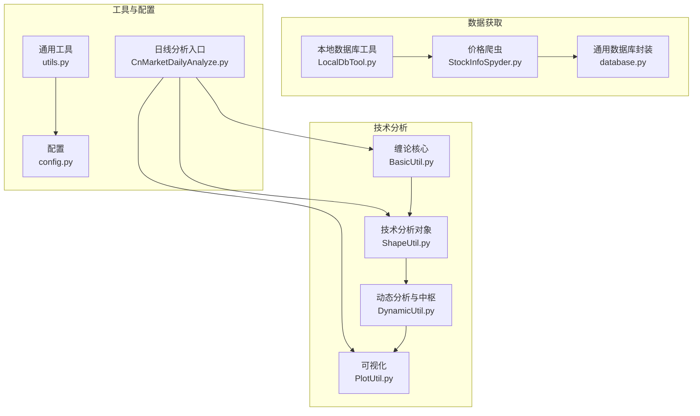
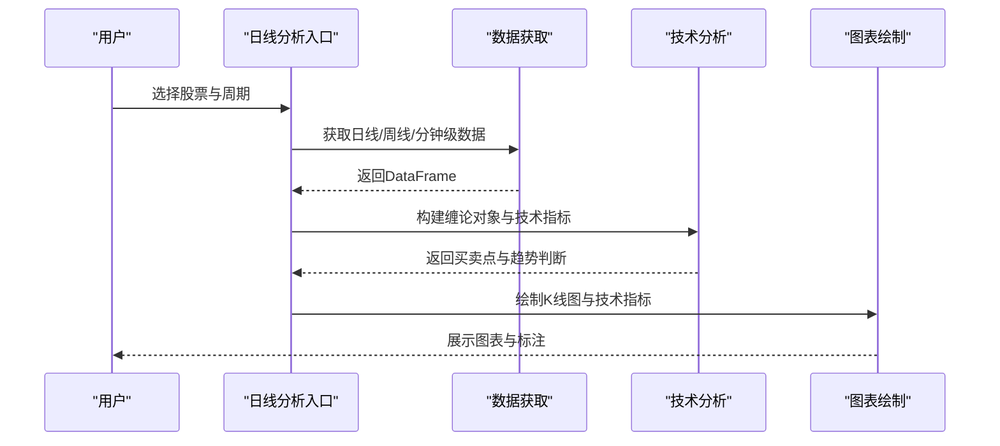
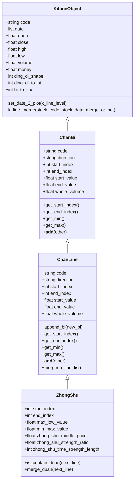
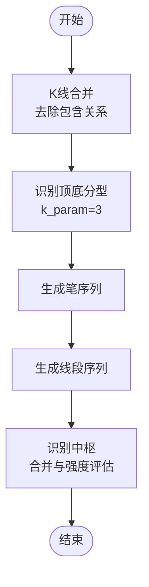
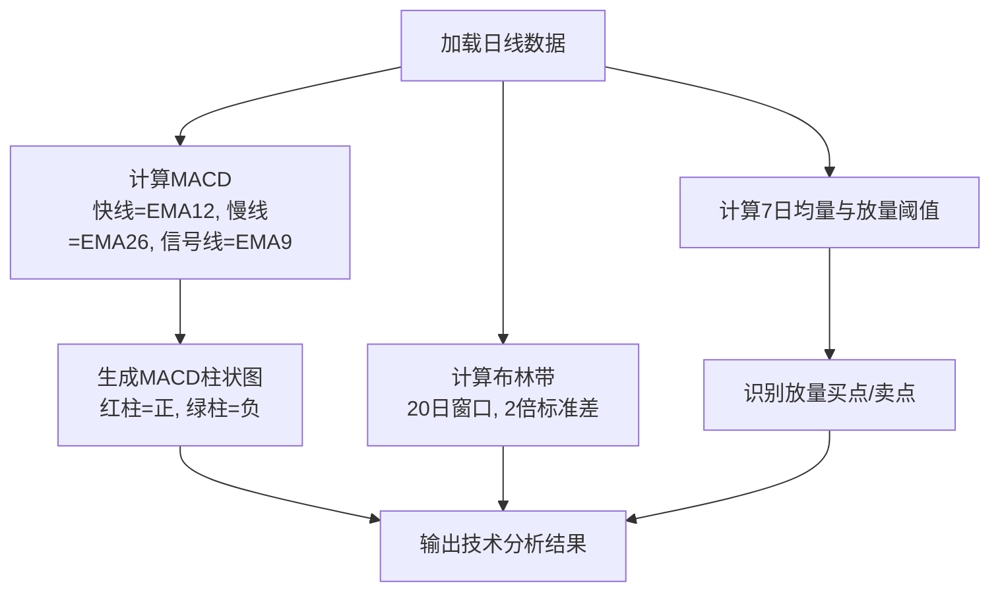
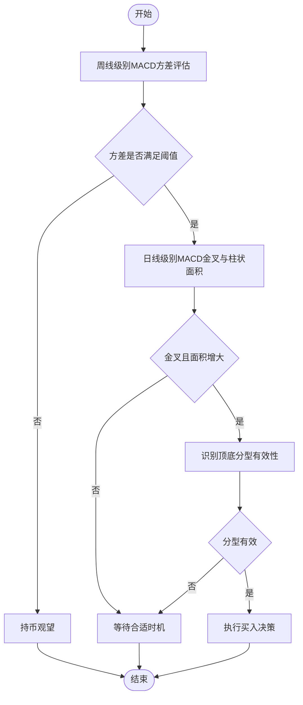
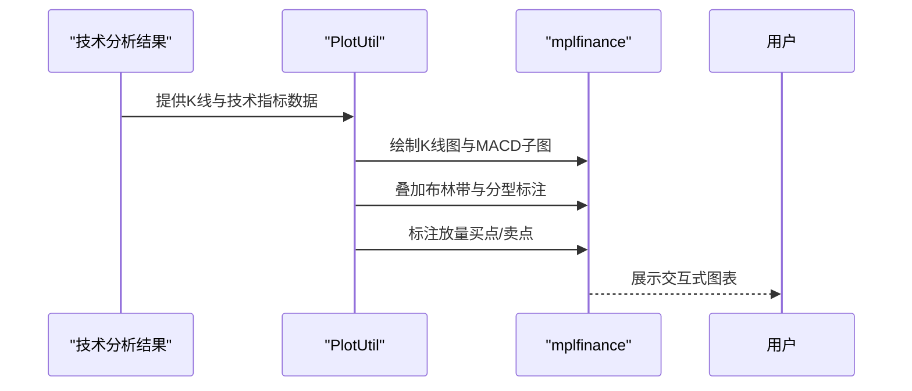
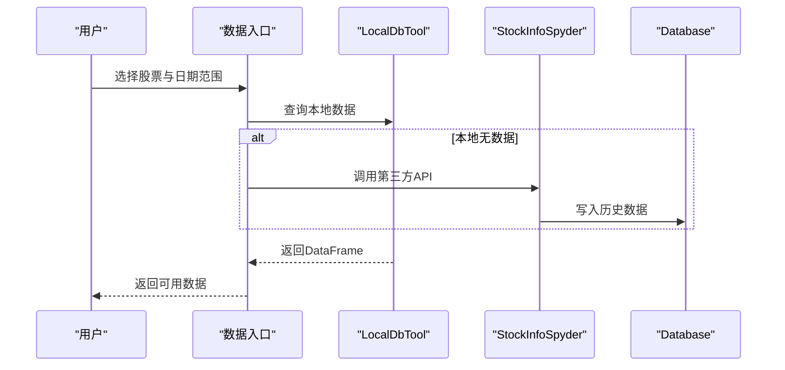
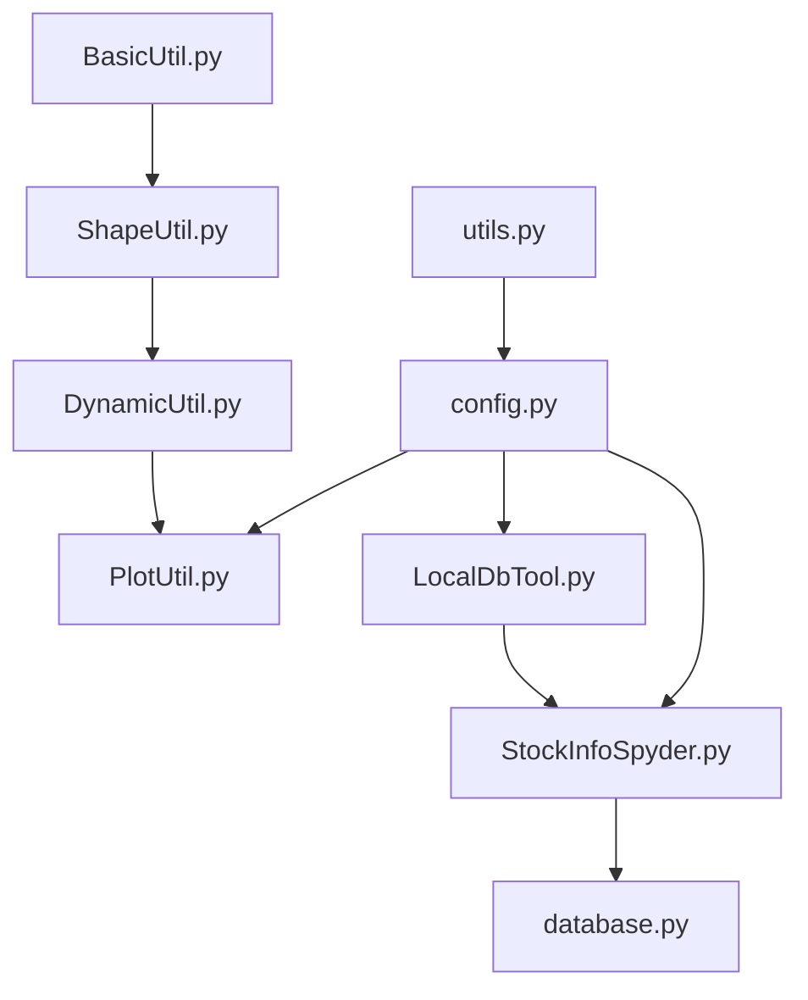

# 中国股市日线分析

<cite>
**本文档引用的文件**
- [ChanLunEngZhongShu.py](file://src/ChanTechAnalyze/ChanLunEngZhongShu.py)
- [get_all_week_line_buy_point_valid_stock.py](file://src/ChanTechAnalyze/get_all_week_line_buy_point_valid_stock.py)
- [BasicUtil.py](file://src/ChanUtils/BasicUtil.py)
- [ShapeUtil.py](file://src/ChanUtils/ShapeUtil.py)
- [DynamicUtil.py](file://src/ChanUtils/DynamicUtil.py)
- [PlotUtil.py](file://src/ChanUtils/PlotUtil.py)
- [LocalDbTool.py](file://src/MongoDbComTools/LocalDbTool.py)
- [StockInfoSpyder.py](file://src/MarketPriceSpiderWithScrapy/StockInfoSpyder.py)
- [database.py](file://src/Utils/database.py)
- [utils.py](file://src/Utils/utils.py)
- [config.py](file://src/Utils/config.py)
- [CnMarketDailyAnalyze.py](file://src/FundamentalMarketAnalyze/CnMarketDailyAnalyze.py)
- [README.md](file://README.md)
</cite>

## 目录
1. [简介](#简介)
2. [项目结构](#项目结构)
3. [核心组件](#核心组件)
4. [架构概览](#架构概览)
5. [详细组件分析](#详细组件分析)
6. [依赖关系分析](#依赖关系分析)
7. [性能考量](#性能考量)
8. [故障排查指南](#故障排查指南)
9. [结论](#结论)
10. [附录](#附录)

## 简介
本项目专注于中国股市日线分析，提供从数据获取、处理、技术指标计算到可视化展示的完整链路。系统基于缠论（Chan Theory）与传统技术指标相结合，支持日线、周线及分钟级数据的分析与决策支持。核心目标是帮助开发者利用日线数据进行技术分析与投资决策，涵盖顶底分型、笔、线段、中枢、MACD、布林带、成交量放大等关键指标与可视化展示。

## 项目结构
项目采用模块化组织，主要分为以下几大模块：
- 技术分析模块：缠论技术分析与可视化
- 数据获取模块：本地数据库与第三方API数据获取
- 可视化模块：基于mplfinance的日线图表绘制
- 工具模块：通用工具、配置与数据库封装

**图表来源**
- [BasicUtil.py:10-695](file://src/ChanUtils/BasicUtil.py#L10-L695)
- [ShapeUtil.py:22-530](file://src/ChanUtils/ShapeUtil.py#L22-L530)
- [DynamicUtil.py:88-141](file://src/ChanUtils/DynamicUtil.py#L88-L141)
- [PlotUtil.py:15-150](file://src/ChanUtils/PlotUtil.py#L15-L150)
- [LocalDbTool.py:10-288](file://src/MongoDbComTools/LocalDbTool.py#L10-L288)
- [StockInfoSpyder.py:39-881](file://src/MarketPriceSpiderWithScrapy/StockInfoSpyder.py#L39-L881)
- [database.py:36-176](file://src/Utils/database.py#L36-L176)
- [utils.py:1-251](file://src/Utils/utils.py#L1-L251)
- [config.py:1-455](file://src/Utils/config.py#L1-L455)
- [CnMarketDailyAnalyze.py:1-2](file://src/FundamentalMarketAnalyze/CnMarketDailyAnalyze.py#L1-L2)

**章节来源**
- [README.md:1-33](file://README.md#L1-L33)

## 核心组件
- 缠论基础数据结构：K线、笔、线段、中枢
- 技术分析对象：顶底分型、笔、线段、中枢、MACD、布林带
- 动态分析：中枢识别、MACD强度分析、买卖点识别
- 可视化：mplfinance绘制K线图，叠加MACD、布林带、成交量放大点
- 数据获取：本地MongoDB数据库与第三方API（akshare、joinquant）

**章节来源**
- [BasicUtil.py:10-695](file://src/ChanUtils/BasicUtil.py#L10-L695)
- [ShapeUtil.py:22-530](file://src/ChanUtils/ShapeUtil.py#L22-L530)
- [DynamicUtil.py:88-141](file://src/ChanUtils/DynamicUtil.py#L88-L141)
- [PlotUtil.py:15-150](file://src/ChanUtils/PlotUtil.py#L15-L150)
- [LocalDbTool.py:10-288](file://src/MongoDbComTools/LocalDbTool.py#L10-L288)
- [StockInfoSpyder.py:39-881](file://src/MarketPriceSpiderWithScrapy/StockInfoSpyder.py#L39-L881)
- [database.py:36-176](file://src/Utils/database.py#L36-L176)

## 架构概览
系统采用“数据层-分析层-可视化层”的三层架构：
- 数据层：本地数据库封装与第三方API集成，统一提供日线、周线、分钟级数据
- 分析层：缠论技术分析与指标计算，输出买卖点与趋势判断
- 可视化层：基于mplfinance的K线图绘制，支持MACD、布林带、成交量放大点叠加

**图表来源**
- [ChanLunEngZhongShu.py:26-184](file://src/ChanTechAnalyze/ChanLunEngZhongShu.py#L26-L184)
- [LocalDbTool.py:226-276](file://src/MongoDbComTools/LocalDbTool.py#L226-L276)
- [StockInfoSpyder.py:251-318](file://src/MarketPriceSpiderWithScrapy/StockInfoSpyder.py#L251-L318)
- [PlotUtil.py:110-124](file://src/ChanUtils/PlotUtil.py#L110-L124)

## 详细组件分析

### 缠论基础数据结构
- K线对象：封装开盘、收盘、最高、最低、成交量、成交额等字段，并支持日期归中处理
- 笔对象：向上/向下笔，记录起止索引、起止值、累计成交量
- 线段对象：由连续笔组成，支持合并与扩展
- 中枢对象：由连续线段构成，支持合并与强度评估

**图表来源**
- [BasicUtil.py:10-695](file://src/ChanUtils/BasicUtil.py#L10-L695)

**章节来源**
- [BasicUtil.py:10-695](file://src/ChanUtils/BasicUtil.py#L10-L695)

### 技术分析对象与中枢识别
- 顶底分型识别：基于K线三连结构识别顶/底分型，并进行二次合并与一致性校验
- 笔与线段生成：从分型序列生成笔，再由笔生成线段，支持合并与扩展
- 中枢识别：基于连续线段识别中枢，支持合并与强度评估

**图表来源**
- [ShapeUtil.py:384-528](file://src/ChanUtils/ShapeUtil.py#L384-L528)
- [ShapeUtil.py:559-635](file://src/ChanUtils/ShapeUtil.py#L559-L635)
- [ShapeUtil.py:1170-1222](file://src/ChanUtils/ShapeUtil.py#L1170-L1222)
- [DynamicUtil.py:88-141](file://src/ChanUtils/DynamicUtil.py#L88-L141)

**章节来源**
- [ShapeUtil.py:22-530](file://src/ChanUtils/ShapeUtil.py#L22-L530)
- [DynamicUtil.py:88-141](file://src/ChanUtils/DynamicUtil.py#L88-L141)

### 技术指标计算与应用
- MACD：基于指数移动平均计算快线、慢线与信号线，生成红绿柱子与交叉列表
- 布林带：基于20日窗口与2倍标准差生成上下轨与中轨
- 成交量分析：计算7日均量与放量阈值，识别放量买点与放量卖点

**图表来源**
- [PlotUtil.py:16-95](file://src/ChanUtils/PlotUtil.py#L16-L95)
- [ShapeUtil.py:207-276](file://src/ChanUtils/ShapeUtil.py#L207-L276)
- [DynamicUtil.py:9-85](file://src/ChanUtils/DynamicUtil.py#L9-L85)

**章节来源**
- [PlotUtil.py:15-150](file://src/ChanUtils/PlotUtil.py#L15-L150)
- [ShapeUtil.py:157-276](file://src/ChanUtils/ShapeUtil.py#L157-L276)
- [DynamicUtil.py:9-85](file://src/ChanUtils/DynamicUtil.py#L9-L85)

### 市场趋势判断与决策规则
- 周线级别趋势：MACD方差评估，确保周线级别多空力量明确
- 日线级别买卖点：MACD金叉且柱状面积增大，结合顶底分型有效性
- 中枢背驰：中枢内MACD红/绿柱面积变化，判断趋势衰竭与买卖时机

**图表来源**
- [ShapeUtil.py:299-374](file://src/ChanUtils/ShapeUtil.py#L299-L374)
- [ShapeUtil.py:1245-1333](file://src/ChanUtils/ShapeUtil.py#L1245-L1333)

**章节来源**
- [ShapeUtil.py:299-374](file://src/ChanUtils/ShapeUtil.py#L299-L374)
- [ShapeUtil.py:1245-1333](file://src/ChanUtils/ShapeUtil.py#L1245-L1333)

### 日线图表可视化与交互
- K线图：支持蜡烛图与成交量叠加
- 技术指标：MACD柱状图、布林带、顶底分型标注、笔与线段轨迹
- 交互功能：鼠标悬停查看具体数值，支持缩放与平移

**图表来源**
- [PlotUtil.py:110-124](file://src/ChanUtils/PlotUtil.py#L110-L124)
- [ShapeUtil.py:1463-1599](file://src/ChanUtils/ShapeUtil.py#L1463-L1599)

**章节来源**
- [PlotUtil.py:15-150](file://src/ChanUtils/PlotUtil.py#L15-L150)
- [ShapeUtil.py:1463-1599](file://src/ChanUtils/ShapeUtil.py#L1463-L1599)

### 数据获取与处理流程
- 本地数据库：统一管理股票基本信息与历史价格数据
- 第三方API：akshare与joinquant获取实时/历史行情
- 数据清洗：统一索引格式、计算成交金额、按周聚合

**图表来源**
- [LocalDbTool.py:226-276](file://src/MongoDbComTools/LocalDbTool.py#L226-L276)
- [StockInfoSpyder.py:251-318](file://src/MarketPriceSpiderWithScrapy/StockInfoSpyder.py#L251-L318)
- [database.py:95-172](file://src/Utils/database.py#L95-L172)

**章节来源**
- [LocalDbTool.py:10-288](file://src/MongoDbComTools/LocalDbTool.py#L10-L288)
- [StockInfoSpyder.py:39-881](file://src/MarketPriceSpiderWithScrapy/StockInfoSpyder.py#L39-L881)
- [database.py:36-176](file://src/Utils/database.py#L36-L176)

### 实际使用示例与代码路径
- 日线分析入口：通过命令行参数选择市场、股票代码、周期，调用缠论分析与可视化
- 批量筛选：遍历股票池，筛选符合周线与日线买卖点的股票并输出结果

**章节来源**
- [ChanLunEngZhongShu.py:26-184](file://src/ChanTechAnalyze/ChanLunEngZhongShu.py#L26-L184)
- [get_all_week_line_buy_point_valid_stock.py:55-184](file://src/ChanTechAnalyze/get_all_week_line_buy_point_valid_stock.py#L55-L184)

## 依赖关系分析
- 组件耦合：技术分析模块依赖基础数据结构；可视化模块依赖技术分析结果
- 外部依赖：pandas、mplfinance、ta、akshare、pymongo
- 配置管理：统一配置文件管理数据库连接、集合名称与默认日期

**图表来源**
- [BasicUtil.py:10-695](file://src/ChanUtils/BasicUtil.py#L10-L695)
- [ShapeUtil.py:22-530](file://src/ChanUtils/ShapeUtil.py#L22-L530)
- [DynamicUtil.py:88-141](file://src/ChanUtils/DynamicUtil.py#L88-L141)
- [PlotUtil.py:15-150](file://src/ChanUtils/PlotUtil.py#L15-L150)
- [LocalDbTool.py:10-288](file://src/MongoDbComTools/LocalDbTool.py#L10-L288)
- [StockInfoSpyder.py:39-881](file://src/MarketPriceSpiderWithScrapy/StockInfoSpyder.py#L39-L881)
- [database.py:36-176](file://src/Utils/database.py#L36-L176)
- [utils.py:1-251](file://src/Utils/utils.py#L1-L251)
- [config.py:1-455](file://src/Utils/config.py#L1-L455)

**章节来源**
- [config.py:1-455](file://src/Utils/config.py#L1-L455)

## 性能考量
- 数据聚合：周线聚合使用pandas.resample，避免逐日循环
- 指标计算：使用向量化操作（EMA、滚动窗口）提升性能
- 可视化优化：仅在必要时生成额外子图，减少渲染开销
- 数据库访问：批量读取与写入，合理设置连接池大小

[本节为通用指导，无需特定文件引用]

## 故障排查指南
- 数据库连接异常：启用自动重连装饰器，指数退避重试
- 爬虫超时：设置信号处理器捕获超时异常
- 可视化显示：确保matplotlib字体配置正确，避免中文乱码

**章节来源**
- [database.py:15-33](file://src/Utils/database.py#L15-L33)
- [StockInfoSpyder.py:28-36](file://src/MarketPriceSpiderWithScrapy/StockInfoSpyder.py#L28-L36)
- [ChanLunEngZhongShu.py:21-23](file://src/ChanTechAnalyze/ChanLunEngZhongShu.py#L21-L23)

## 结论
本项目提供了完整的中国股市日线分析解决方案，融合缠论与传统技术指标，具备强大的可视化能力与可扩展的分析框架。通过统一的数据获取、严谨的技术分析与直观的图表展示，开发者可以高效地进行技术分析与投资决策支持。

[本节为总结性内容，无需特定文件引用]

## 附录
- 常用命令行参数
  - -m/--market：市场类型（cn/hk/us）
  - -s/--symbol：股票代码（含市场类型）
  - -c/--code：纯股票代码
  - -d/--start：开始日期
  - -l/--level：K线级别（daily/week/30m/15m）

**章节来源**
- [ChanLunEngZhongShu.py:30-66](file://src/ChanTechAnalyze/ChanLunEngZhongShu.py#L30-L66)