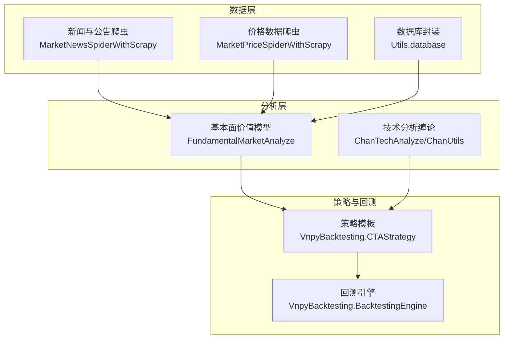
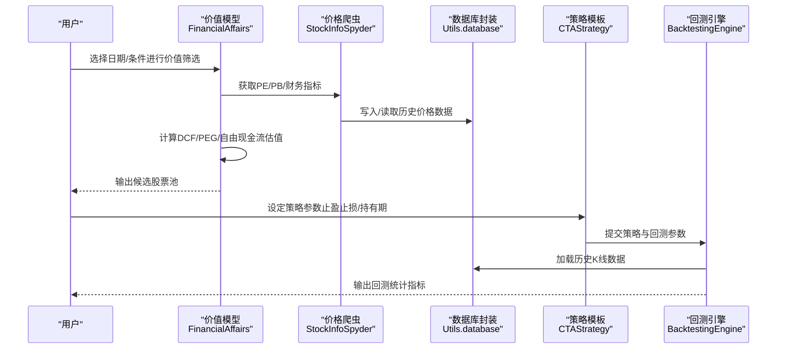
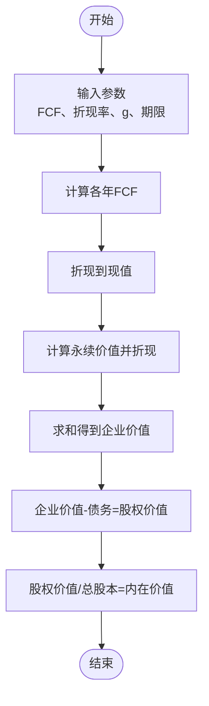
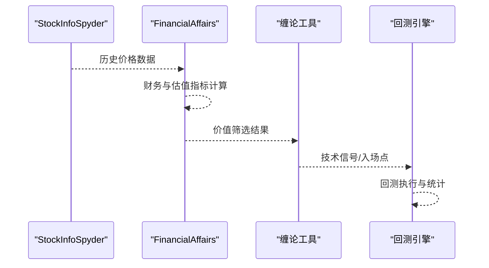
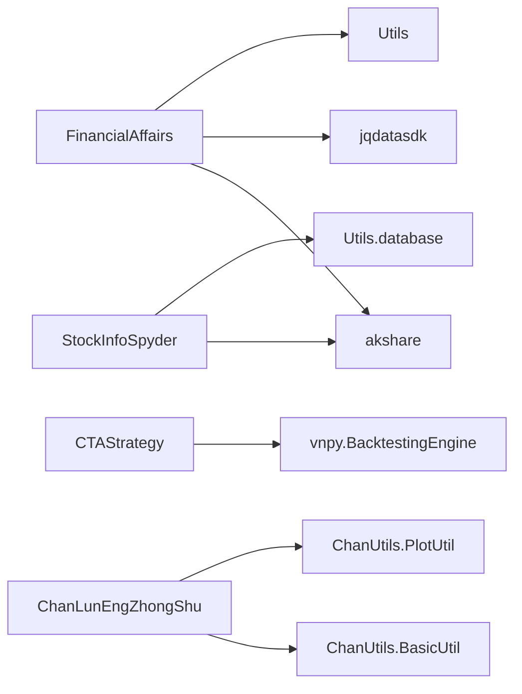

# 价值投资模型

<cite>
**本文引用的文件**   
- [README.md](file://README.md)
- [ProblemSolve.md](file://ProblemSolve.md)
- [JiaZhiValueModel.py](file://src/FundamentalMarketAnalyze/JiaZhiValueModel.py)
- [FinancialAffairs.py](file://src/FundamentalMarketAnalyze/FinancialAffairs.py)
- [JointQuantTool.py](file://src/MongoDbComTools/JointQuantTool.py)
- [utils.py](file://src/Utils/utils.py)
- [config.py](file://src/Utils/config.py)
- [StockInfoSpyder.py](file://src/MarketPriceSpiderWithScrapy/StockInfoSpyder.py)
- [CTAStrategy.py](file://src/VnpyBacktesting/CTAStrategy.py)
- [back_test.py](file://src/VnpyBacktesting/back_test.py)
- [back_test_topn.py](file://src/VnpyBacktesting/back_test_topn.py)
- [ChanLunEngZhongShu.py](file://src/ChanTechAnalyze/ChanLunEngZhongShu.py)
- [BasicUtil.py](file://src/ChanUtils/BasicUtil.py)
- [PlotUtil.py](file://src/ChanUtils/PlotUtil.py)
</cite>

## 目录
1. [简介](#简介)
2. [项目结构](#项目结构)
3. [核心组件](#核心组件)
4. [架构总览](#架构总览)
5. [详细组件分析](#详细组件分析)
6. [依赖分析](#依赖分析)
7. [性能考虑](#性能考虑)
8. [故障排查指南](#故障排查指南)
9. [结论](#结论)
10. [附录](#附录)

## 简介
本文件面向希望系统掌握“价值投资模型”的读者，结合仓库中已实现的“基本面价值模型”与“技术分析工具”，给出一套可落地的实践路径。内容涵盖：
- 价值投资基础理论与核心原则
- 估值模型的数学原理与计算方法
- DCF现金流折现模型的参数设定与适用条件
- PE、PB、PS 等估值指标的计算与比较分析
- 成长性估值模型的应用场景与局限性
- 实际股票估值案例与投资决策流程
- 模型参数敏感性分析与风险评估方法
- 借助回测框架验证策略的有效性

## 项目结构
该项目以“新闻爬取 + 价格数据获取 + 基本面与技术分析 + 回测验证”为主线，形成完整的信息采集与策略验证闭环。其中与“价值投资模型”直接相关的核心模块如下：
- FundamentalMarketAnalyze：包含价值选股与自由现金流估值的实现
- MarketPriceSpiderWithScrapy：提供多市场（A/H/美）历史与实时价格数据
- VnpyBacktesting：提供回测引擎与策略模板，便于验证价值策略
- ChanTechAnalyze / ChanUtils：提供缠论技术分析工具，作为辅助择时手段
- Utils：通用配置、工具与数据库封装

**章节来源**
- [README.md:1-33](file://README.md#L1-L33)

## 核心组件
- 价值选股与自由现金流估值：提供基于财务报表与估值指标的筛选与DCF估值流程
- 多市场数据获取：支持A股、港股、美股历史与实时行情，满足跨市场比较
- 技术分析工具：提供K线、笔、线段、中枢等缠论分析工具，辅助择时
- 回测框架：提供策略参数化、回测执行与统计指标输出，支撑策略验证

**章节来源**
- [JiaZhiValueModel.py:12-24](file://src/FundamentalMarketAnalyze/JiaZhiValueModel.py#L12-L24)
- [FinancialAffairs.py:172-314](file://src/FundamentalMarketAnalyze/FinancialAffairs.py#L172-L314)
- [StockInfoSpyder.py:39-881](file://src/MarketPriceSpiderWithScrapy/StockInfoSpyder.py#L39-L881)
- [CTAStrategy.py:15-185](file://src/VnpyBacktesting/CTAStrategy.py#L15-L185)
- [ChanLunEngZhongShu.py:26-185](file://src/ChanTechAnalyze/ChanLunEngZhongShu.py#L26-L185)

## 架构总览
下图展示价值投资模型在本项目中的整体调用关系：从数据采集到价值筛选，再到回测验证的完整链路。

**图表来源**
- [FinancialAffairs.py:223-314](file://src/FundamentalMarketAnalyze/FinancialAffairs.py#L223-L314)
- [StockInfoSpyder.py:251-351](file://src/MarketPriceSpiderWithScrapy/StockInfoSpyder.py#L251-L351)
- [CTAStrategy.py:15-185](file://src/VnpyBacktesting/CTAStrategy.py#L15-L185)
- [back_test.py:123-188](file://src/VnpyBacktesting/back_test.py#L123-L188)

## 详细组件分析

### 价值投资理论与核心原则
- 价值投资本质：以“企业内在价值”为锚，寻找市场价格低于内在价值的安全边际标的
- 核心原则
  - 安全边际：以折扣价格买入，降低不确定性带来的损失
  - 长期持有：重视企业护城河与盈利能力的持续性
  - 以能力圈为基础：只研究自己熟悉的行业与公司
  - 控制情绪：避免短期噪音干扰，坚持理性分析

### 估值模型的数学原理与计算方法
- 市盈率（PE）：股价/每股收益，衡量相对定价水平
- 市净率（PB）：股价/每股净资产，适用于资产密集型企业
- 市销率（PS）：市值/营业收入，适用于尚未盈利或利润波动大的公司
- PEG：PE/盈利增速，衡量成长性与估值的匹配度
- 自由现金流贴现（DCF）：将未来自由现金流折现至现值，得到企业内在价值

**章节来源**
- [FinancialAffairs.py:223-314](file://src/FundamentalMarketAnalyze/FinancialAffairs.py#L223-L314)

### DCF现金流折现模型的参数设置与适用条件
- 参数设置
  - 自由现金流（FCF）：经营活动现金流 - 资本支出
  - 折现率（WACC）：反映资金成本与风险
  - 永续增长率（g）：长期可持续增长假设
- 适用条件
  - 企业现金流稳定且可预测
  - 行业竞争格局相对稳定
  - 估值区间应结合多家机构预测与安全边际

**图表来源**
- [FinancialAffairs.py:183-211](file://src/FundamentalMarketAnalyze/FinancialAffairs.py#L183-L211)

**章节来源**
- [FinancialAffairs.py:183-211](file://src/FundamentalMarketAnalyze/FinancialAffairs.py#L183-L211)

### PE、PB、PS 等估值指标的计算与比较分析
- 计算与筛选
  - 通过财务指标接口获取PE、PB、ROE、毛利率、净利率等
  - 结合同比增速（营收/利润）与安全边际（PB/PE阈值）进行初筛
- 比较分析
  - 不同行业估值中枢差异较大，需横向对比同行业可比公司
  - 对于周期性行业，建议使用PB或EV/EBITDA等替代指标

**章节来源**
- [FinancialAffairs.py:63-170](file://src/FundamentalMarketAnalyze/FinancialAffairs.py#L63-L170)
- [FinancialAffairs.py:223-314](file://src/FundamentalMarketAnalyze/FinancialAffairs.py#L223-L314)

### 成长性估值模型的应用场景与局限性
- 应用场景
  - 高成长科技、消费品牌等具备强护城河的企业
  - 通过PEG、收入复合增速与PE联动判断性价比
- 局限性
  - 成长预期易受宏观与政策影响
  - 未来现金流难以精准预测，需引入安全边际

**章节来源**
- [FinancialAffairs.py:283-283](file://src/FundamentalMarketAnalyze/FinancialAffairs.py#L283-L283)

### 实际股票估值案例与投资决策流程
- 数据准备
  - 通过价格爬虫获取历史K线与复权因子
  - 通过基本面接口获取财务与估值指标
- 价值筛选
  - 设定财务与估值门槛（如PE、PB、ROE、毛利率、净利润增速）
  - 计算DCF内在价值与当前股价的安全边际
- 技术择时
  - 使用缠论工具识别中枢、笔与线段，辅助确认入场时机
- 回测验证
  - 以固定买入日、止盈止损、最大持有期等参数进行回测
  - 输出总收益、年化收益、最大回撤、夏普比率等指标

**图表来源**
- [StockInfoSpyder.py:251-351](file://src/MarketPriceSpiderWithScrapy/StockInfoSpyder.py#L251-L351)
- [FinancialAffairs.py:223-314](file://src/FundamentalMarketAnalyze/FinancialAffairs.py#L223-L314)
- [ChanLunEngZhongShu.py:113-175](file://src/ChanTechAnalyze/ChanLunEngZhongShu.py#L113-L175)
- [back_test.py:123-188](file://src/VnpyBacktesting/back_test.py#L123-L188)

### 模型参数敏感性分析与风险评估方法
- 敏感性分析
  - 对折现率、永续增长率、FCF增速进行单变量与情景测试
  - 绘制估值区间与安全边际变化趋势
- 风险评估
  - 最大回撤、收益回撤比、胜率等指标用于评估策略稳健性
  - 引入止损与止盈规则，控制尾部风险

**章节来源**
- [CTAStrategy.py:84-104](file://src/VnpyBacktesting/CTAStrategy.py#L84-L104)
- [back_test.py:26-35](file://src/VnpyBacktesting/back_test.py#L26-L35)

## 依赖分析
- 外部依赖
  - akshare：获取实时与历史行情、财务与估值指标
  - jqdatasdk：历史行情与财务数据补充（账户认证与配额）
  - vnpy：回测引擎与策略模板
- 内部依赖
  - Utils.config：数据库、爬虫与模型路径配置
  - Utils.utils：显示设置、日期工具、邮件发送等通用工具
  - MongoDbComTools.JointQuantTool：账户认证与查询配额管理

**图表来源**
- [FinancialAffairs.py:4-12](file://src/FundamentalMarketAnalyze/FinancialAffairs.py#L4-L12)
- [StockInfoSpyder.py:14-25](file://src/MarketPriceSpiderWithScrapy/StockInfoSpyder.py#L14-L25)
- [CTAStrategy.py:3-12](file://src/VnpyBacktesting/CTAStrategy.py#L3-L12)
- [ChanLunEngZhongShu.py:5-17](file://src/ChanTechAnalyze/ChanLunEngZhongShu.py#L5-L17)

**章节来源**
- [config.py:13-455](file://src/Utils/config.py#L13-L455)
- [utils.py:60-66](file://src/Utils/utils.py#L60-L66)
- [JointQuantTool.py:11-34](file://src/MongoDbComTools/JointQuantTool.py#L11-L34)

## 性能考虑
- 数据加载与缓存
  - 合理设置复权方式（前复权/后复权），减少回测偏差
  - 对历史数据进行分片与索引优化，提升查询效率
- 计算复杂度
  - DCF计算涉及多期折现，建议采用向量化计算与并行加速
  - 估值指标批量计算时，优先使用pandas内置函数
- 回测效率
  - 使用vnpy回测引擎的批量化回测能力，减少不必要的数据加载
  - 对策略参数进行网格/随机采样，避免过度拟合

## 故障排查指南
- MongoDB/Redis连接问题
  - 调整本地/远程IP与端口，确保防火墙放行
  - 提升文件句柄限制，避免“too many open files”
- akshare/jqdatasdk接口异常
  - 检查账号与配额，必要时更换代理或降频重试
  - 对异常请求进行幂等与重试机制
- 回测图表生成失败
  - 确认Matplotlib字体与渲染后端配置
  - 仅保存PNG，避免阻塞式弹窗导致卡死

**章节来源**
- [ProblemSolve.md:18-68](file://ProblemSolve.md#L18-L68)
- [config.py:13-455](file://src/Utils/config.py#L13-L455)
- [utils.py:60-66](file://src/Utils/utils.py#L60-L66)

## 结论
本项目提供了从“数据采集—价值筛选—技术择时—回测验证”的完整闭环，能够支撑建立科学的价值投资体系。通过DCF、PE/PB/PS等估值模型与回测指标的结合，可有效提升投资决策的准确性与成功率。建议在实践中持续迭代参数与信号，强化风险控制与安全边际理念。

## 附录

### 附录A：价值模型关键函数与文件映射
- 自由现金流估值：[get_stock_basic_price:184-211](file://src/FundamentalMarketAnalyze/FinancialAffairs.py#L184-L211)
- 价值选股与指标计算：[get_basic_stock:223-314](file://src/FundamentalMarketAnalyze/FinancialAffairs.py#L223-L314)
- 年金现金流折现：[get_cash_in_x_year:173-180](file://src/FundamentalMarketAnalyze/FinancialAffairs.py#L173-L180)
- 基础价值模型入口：[JiaZhiValueModel.py:12-24](file://src/FundamentalMarketAnalyze/JiaZhiValueModel.py#L12-L24)

**章节来源**
- [FinancialAffairs.py:172-314](file://src/FundamentalMarketAnalyze/FinancialAffairs.py#L172-L314)
- [JiaZhiValueModel.py:12-24](file://src/FundamentalMarketAnalyze/JiaZhiValueModel.py#L12-L24)

### 附录B：技术分析工具与可视化
- 缠论K线与中枢：[KiLineObject/ChanBi/ChanLine/ZhongShu:11-695](file://src/ChanUtils/BasicUtil.py#L11-L695)
- 图表绘制与MACD/BOLL叠加：[PlotUtil:15-150](file://src/ChanUtils/PlotUtil.py#L15-L150)
- 缠论分析主程序：[ChanLunEngZhongShu:26-185](file://src/ChanTechAnalyze/ChanLunEngZhongShu.py#L26-L185)

**章节来源**
- [BasicUtil.py:11-695](file://src/ChanUtils/BasicUtil.py#L11-L695)
- [PlotUtil.py:15-150](file://src/ChanUtils/PlotUtil.py#L15-L150)
- [ChanLunEngZhongShu.py:26-185](file://src/ChanTechAnalyze/ChanLunEngZhongShu.py#L26-L185)

### 附录C：回测策略与参数
- 策略模板：[CTAStrategy:15-185](file://src/VnpyBacktesting/CTAStrategy.py#L15-185)
- 单票回测：[back_test.py:123-188](file://src/VnpyBacktesting/back_test.py#L123-188)
- TopN回测：[back_test_topn.py:133-203](file://src/VnpyBacktesting/back_test_topn.py#L133-203)

**章节来源**
- [CTAStrategy.py:15-185](file://src/VnpyBacktesting/CTAStrategy.py#L15-L185)
- [back_test.py:123-188](file://src/VnpyBacktesting/back_test.py#L123-L188)
- [back_test_topn.py:133-203](file://src/VnpyBacktesting/back_test_topn.py#L133-L203)