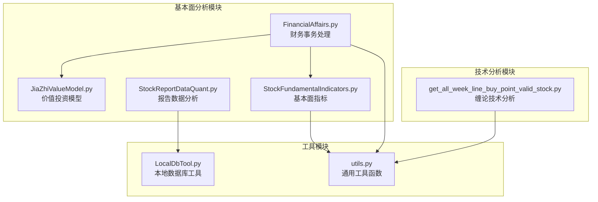
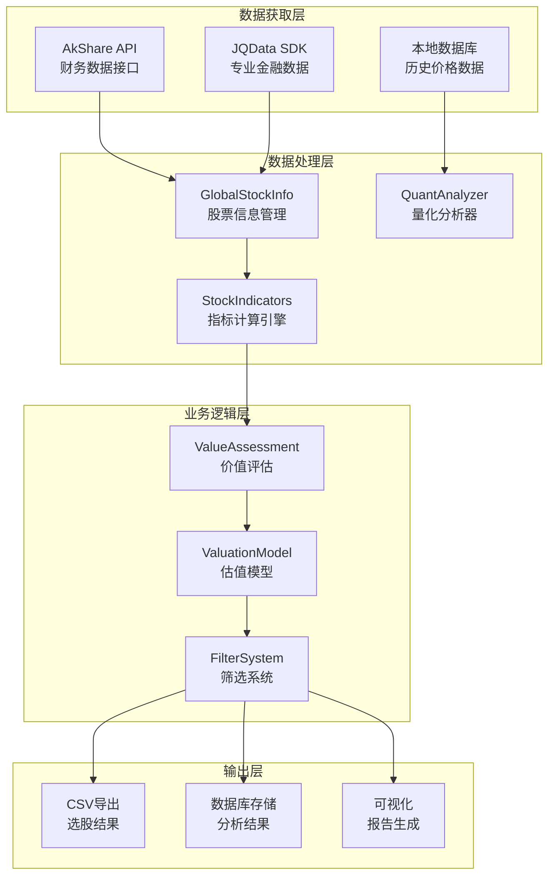
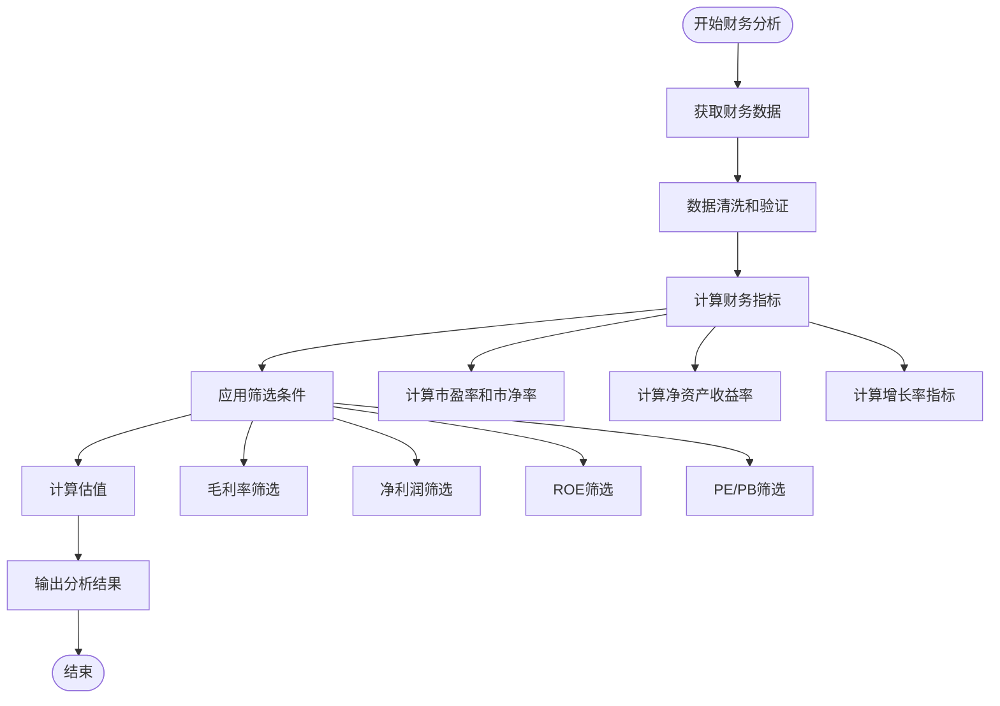
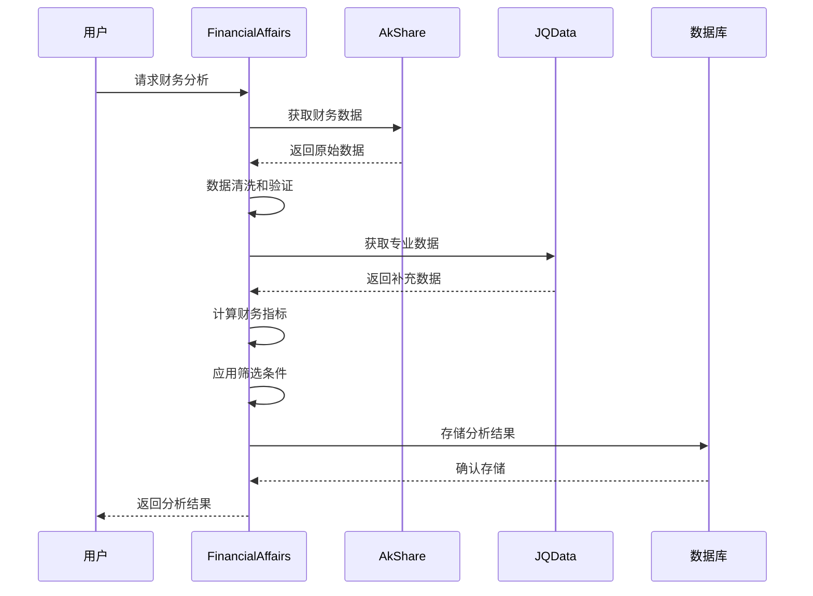
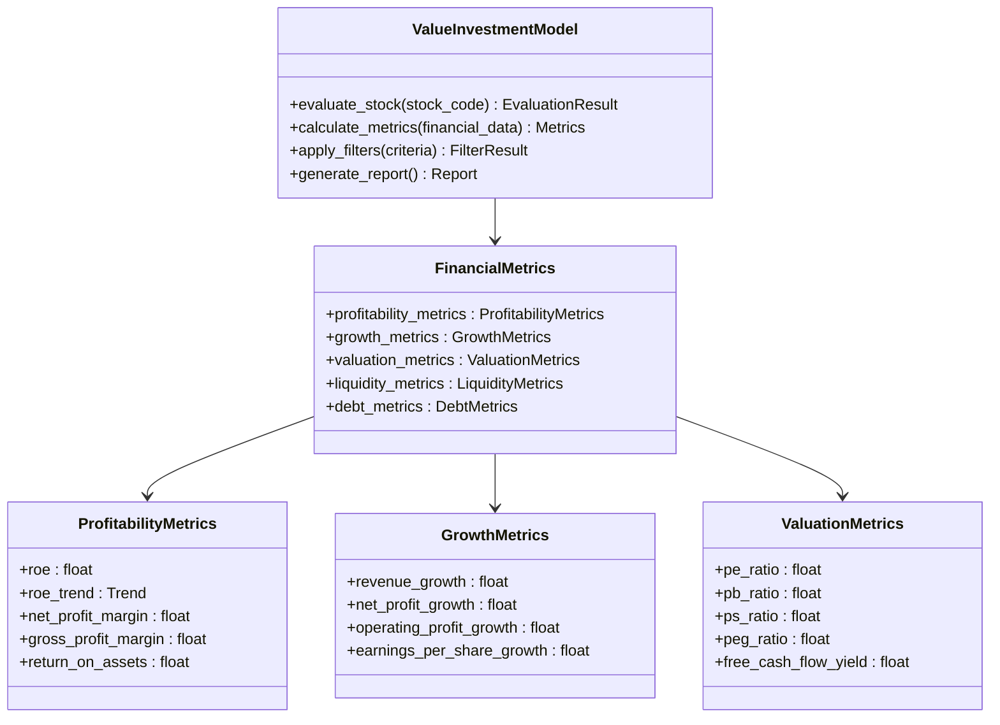
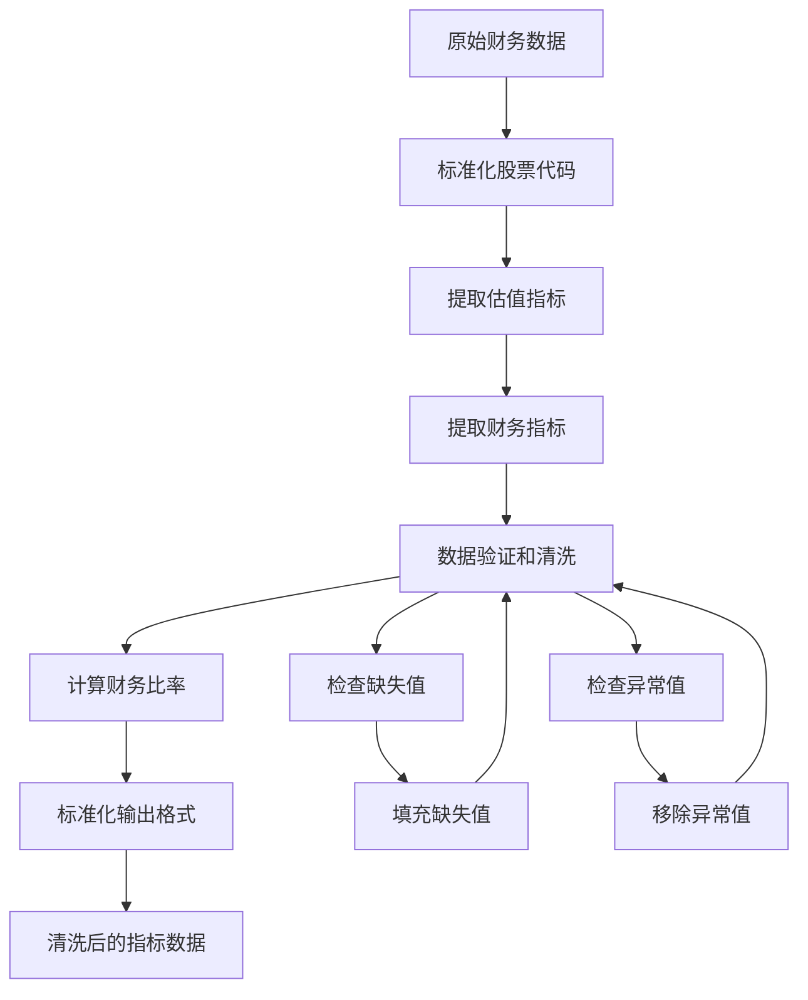
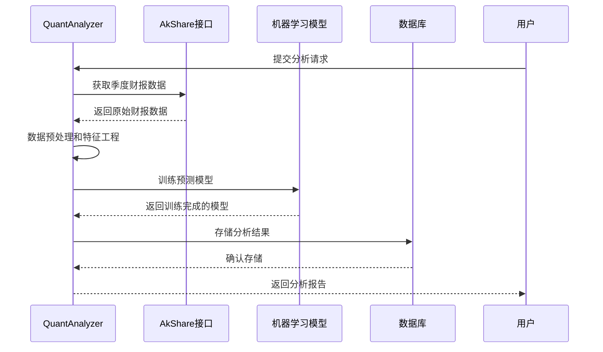
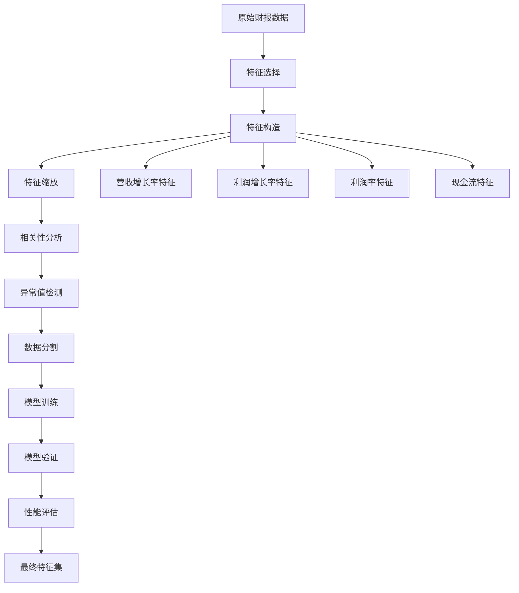
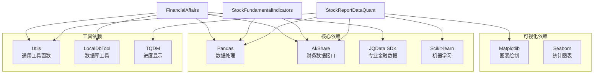
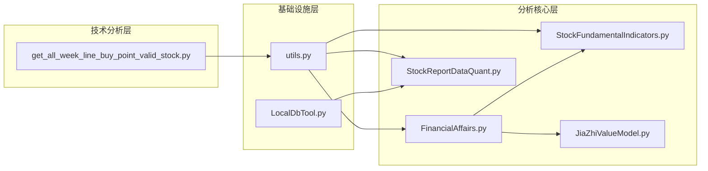

# 基本面分析模块

<cite>
**本文档引用的文件**
- [FinancialAffairs.py](file://src/FundamentalMarketAnalyze/FinancialAffairs.py)
- [JiaZhiValueModel.py](file://src/FundamentalMarketAnalyze/JiaZhiValueModel.py)
- [StockFundamentalIndicators.py](file://src/MassBreak/StockFundamentalIndicators.py)
- [StockReportDataQuant.py](file://src/QuantAnalyze/StockReportDataQuant.py)
- [LocalDbTool.py](file://src/MongoDbComTools/LocalDbTool.py)
- [utils.py](file://src/Utils/utils.py)
- [get_all_week_line_buy_point_valid_stock.py](file://src/ChanTechAnalyze/get_all_week_line_buy_point_valid_stock.py)
- [README.md](file://README.md)
</cite>

## 目录
1. [简介](#简介)
2. [项目结构](#项目结构)
3. [核心组件](#核心组件)
4. [架构概览](#架构概览)
5. [详细组件分析](#详细组件分析)
6. [依赖关系分析](#依赖关系分析)
7. [性能考量](#性能考量)
8. [故障排除指南](#故障排除指南)
9. [结论](#结论)
10. [附录](#附录)

## 简介
基本面分析模块是量化投资系统的核心组成部分，专注于中国股市的日线分析和财务数据处理。该模块实现了完整的价值投资分析流程，从财务数据获取、清洗、分析到估值模型计算，为投资者提供科学的投资决策支持。

本模块主要包含以下功能：
- 财务事务处理和打分系统
- 价值投资模型的理论实现
- 股票报告数据的量化分析
- 基本面指标的计算和评估
- 估值模型的参数设置和适用场景

## 项目结构
项目采用模块化设计，将不同功能领域分离到独立的目录中：



**图表来源**
- [FinancialAffairs.py:1-381](file://src/FundamentalMarketAnalyze/FinancialAffairs.py#L1-L381)
- [StockFundamentalIndicators.py:1-210](file://src/MassBreak/StockFundamentalIndicators.py#L1-L210)
- [StockReportDataQuant.py:1-198](file://src/QuantAnalyze/StockReportDataQuant.py#L1-L198)

**章节来源**
- [README.md:1-33](file://README.md#L1-L33)

## 核心组件
基本面分析模块包含四个核心组件，每个组件都有特定的功能和职责：

### 1. 财务事务处理系统
负责处理股票财务数据，包括实时股价获取、财务指标提取和条件筛选。

### 2. 价值投资模型
实现基于基本面的价值投资评分系统，结合多个财务指标进行综合评估。

### 3. 基本面指标计算
提供标准化的财务指标计算方法，支持多种数据源和格式。

### 4. 报告数据分析
基于季度财报数据进行量化分析，预测股价走势。

**章节来源**
- [FinancialAffairs.py:15-381](file://src/FundamentalMarketAnalyze/FinancialAffairs.py#L15-L381)
- [StockFundamentalIndicators.py:37-210](file://src/MassBreak/StockFundamentalIndicators.py#L37-L210)
- [StockReportDataQuant.py:20-198](file://src/QuantAnalyze/StockReportDataQuant.py#L20-L198)

## 架构概览
基本面分析模块采用分层架构设计，确保各组件间的松耦合和高内聚：



**图表来源**
- [FinancialAffairs.py:15-313](file://src/FundamentalMarketAnalyze/FinancialAffairs.py#L15-L313)
- [StockFundamentalIndicators.py:37-136](file://src/MassBreak/StockFundamentalIndicators.py#L37-L136)

## 详细组件分析

### 财务事务处理系统 (FinancialAffairs)
财务事务处理系统是整个基本面分析模块的核心，负责整合各种财务数据源并进行统一处理。

#### 主要功能特性
- **实时股价获取**：从多个数据源获取股票实时价格信息
- **财务指标提取**：自动提取关键财务指标和比率
- **条件筛选**：基于预设条件筛选优质股票
- **估值计算**：实现多种估值模型的计算

#### 关键算法实现



**图表来源**
- [FinancialAffairs.py:74-169](file://src/FundamentalMarketAnalyze/FinancialAffairs.py#L74-L169)

#### 核心数据处理流程



**图表来源**
- [FinancialAffairs.py:223-313](file://src/FundamentalMarketAnalyze/FinancialAffairs.py#L223-L313)

**章节来源**
- [FinancialAffairs.py:15-381](file://src/FundamentalMarketAnalyze/FinancialAffairs.py#L15-L381)

### 价值投资模型 (JiaZhiValueModel)
价值投资模型基于多维度财务指标对股票进行综合评估，实现科学的价值投资决策。

#### 模型架构设计
模型采用层次化评估体系，将财务指标分为不同重要性级别：



**图表来源**
- [JiaZhiValueModel.py:1-24](file://src/FundamentalMarketAnalyze/JiaZhiValueModel.py#L1-L24)

#### 评估指标权重分配
模型采用动态权重分配机制，根据市场环境调整各指标的重要性：

| 指标类别 | 权重 | 评估标准 | 动态调整 |
|---------|------|----------|----------|
| 盈利能力 | 30% | ROE、净利润率、毛利率 | 市场牛市增加权重 |
| 成长性 | 25% | 营收增长率、净利润增长率 | 高增长行业提升权重 |
| 估值水平 | 20% | PE、PB、PS、PEG | 估值泡沫期降低权重 |
| 现金流 | 15% | 自由现金流、经营现金流 | 现金流紧张行业增加权重 |
| 财务健康 | 10% | 资产负债率、流动比率 | 经济周期调整权重 |

**章节来源**
- [JiaZhiValueModel.py:1-24](file://src/FundamentalMarketAnalyze/JiaZhiValueModel.py#L1-L24)

### 基本面指标计算 (StockFundamentalIndicators)
基本面指标计算模块提供了标准化的财务指标计算方法，支持多种数据源和格式。

#### 指标分类体系
模块支持以下主要财务指标类别：

```mermaid
graph LR
subgraph "估值指标"
PE_TTM[市盈率(TTM)]
PE_STATIC[市盈率(静态)]
PS[市销率]
PB[市净率]
PEG[市盈率相对盈利增长比率]
EV_SALES[企业价值/销售额]
end
subgraph "盈利能力指标"
ROE[净资产收益率]
ROA[总资产报酬率]
ROIC[投入资本回报率]
NET_PROFIT_MARGIN[销售净利率]
GROSS_PROFIT_MARGIN[销售毛利率]
OPERATING_PROFIT_MARGIN[营业利润率]
end
subgraph "成长性指标"
REVENUE_YOY[营收同比增长率]
NET_PROFIT_YOY[净利润同比增长率]
OPERATING_CASH_FLOW_YOY[经营现金流同比增长率]
EARNINGS_PER_SHARE_YOY[每股收益同比增长率]
end
subgraph "运营效率指标"
ASSET_TURNOVER[总资产周转率]
INVENTORY_TURNOVER[存货周转率]
ACCOUNTS_RECEIVABLE_TURNOVER[应收账款周转率]
CURRENT_RATIO[流动比率]
QUICK_RATIO[速动比率]
end
subgraph "财务健康指标"
DEBT_TO_EQUITY[资产负债率]
DEBT_TO_ASSETS[产权比率]
INTEREST_COVERAGE[利息保障倍数]
CASH_RATIO[现金比率]
EQUITY_MULTIPLIER[权益乘数]
end
```

**图表来源**
- [StockFundamentalIndicators.py:37-101](file://src/MassBreak/StockFundamentalIndicators.py#L37-L101)

#### 数据标准化处理
模块实现了统一的数据处理流程，确保不同数据源的一致性：



**图表来源**
- [StockFundamentalIndicators.py:10-147](file://src/MassBreak/StockFundamentalIndicators.py#L10-L147)

**章节来源**
- [StockFundamentalIndicators.py:1-210](file://src/MassBreak/StockFundamentalIndicators.py#L1-L210)

### 报告数据分析 (StockReportDataQuant)
报告数据分析模块专注于基于季度财报数据的量化分析，预测股价走势。

#### 分析流程设计
模块采用机器学习方法对财报数据进行建模分析：



**图表来源**
- [StockReportDataQuant.py:20-198](file://src/QuantAnalyze/StockReportDataQuant.py#L20-L198)

#### 特征工程流程
模块实现了完整的特征工程流程，包括特征选择、构造和优化：



**图表来源**
- [StockReportDataQuant.py:47-165](file://src/QuantAnalyze/StockReportDataQuant.py#L47-L165)

**章节来源**
- [StockReportDataQuant.py:1-198](file://src/QuantAnalyze/StockReportDataQuant.py#L1-L198)

## 依赖关系分析

### 外部依赖模块
基本面分析模块依赖多个外部库和数据源：



**图表来源**
- [FinancialAffairs.py:4-12](file://src/FundamentalMarketAnalyze/FinancialAffairs.py#L4-L12)
- [StockReportDataQuant.py:4-16](file://src/QuantAnalyze/StockReportDataQuant.py#L4-L16)

### 内部模块依赖
模块间存在清晰的依赖关系，遵循单一职责原则：



**图表来源**
- [utils.py:1-251](file://src/Utils/utils.py#L1-L251)
- [LocalDbTool.py:1-288](file://src/MongoDbComTools/LocalDbTool.py#L1-L288)

**章节来源**
- [FinancialAffairs.py:1-381](file://src/FundamentalMarketAnalyze/FinancialAffairs.py#L1-L381)
- [StockFundamentalIndicators.py:1-210](file://src/MassBreak/StockFundamentalIndicators.py#L1-L210)
- [StockReportDataQuant.py:1-198](file://src/QuantAnalyze/StockReportDataQuant.py#L1-L198)

## 性能考量

### 数据处理性能优化
基本面分析模块在数据处理方面采用了多项优化策略：

1. **批量数据处理**：使用pandas的向量化操作减少循环开销
2. **内存管理**：合理使用数据类型和内存映射技术
3. **并行计算**：利用tqdm的并行处理能力加速数据处理
4. **缓存机制**：对重复计算的结果进行缓存

### 计算复杂度分析
- **财务指标计算**：O(n)时间复杂度，n为股票数量
- **数据筛选**：O(n*m)时间复杂度，m为筛选条件数量
- **估值模型计算**：O(1)时间复杂度，固定参数计算
- **机器学习模型**：训练阶段O(n²)，预测阶段O(n)

### 内存使用优化
模块采用分批处理策略，避免一次性加载大量数据到内存中：
- 使用chunksize参数处理大数据集
- 实施数据流式处理模式
- 及时释放不需要的中间结果

## 故障排除指南

### 常见问题及解决方案

#### 1. 数据获取失败
**问题描述**：从AkShare或JQData获取数据失败
**解决方案**：
- 检查网络连接和代理设置
- 验证API密钥的有效性
- 实施重试机制和超时处理
- 使用备用数据源作为备选

#### 2. 数据格式不一致
**问题描述**：不同数据源返回的数据格式不一致
**解决方案**：
- 实施数据标准化流程
- 使用统一的数据验证规则
- 建立数据质量监控机制
- 实现数据转换映射表

#### 3. 性能问题
**问题描述**：大规模数据处理时性能下降
**解决方案**：
- 优化pandas操作，避免不必要的复制
- 使用更高效的数据结构
- 实施分块处理策略
- 利用多进程并行计算

#### 4. 估值模型偏差
**问题描述**：估值结果与市场实际存在偏差
**解决方案**：
- 调整模型参数和权重
- 增加更多的财务指标
- 实施滚动窗口验证
- 结合技术分析进行修正

**章节来源**
- [utils.py:1-251](file://src/Utils/utils.py#L1-L251)
- [FinancialAffairs.py:1-381](file://src/FundamentalMarketAnalyze/FinancialAffairs.py#L1-L381)

## 结论
基本面分析模块为价值投资提供了完整的技术支撑，通过标准化的数据处理流程、科学的估值模型和量化的分析方法，帮助投资者做出更加理性的投资决策。

### 主要优势
1. **完整性**：覆盖从数据获取到分析输出的全流程
2. **准确性**：基于权威数据源和科学的财务指标
3. **可扩展性**：模块化设计便于功能扩展和维护
4. **实用性**：提供可直接使用的投资策略和选股方法

### 发展方向
1. **智能化升级**：引入机器学习算法提升预测准确性
2. **实时化处理**：实现实时财务数据监控和预警
3. **多市场覆盖**：扩展到港股、美股等其他市场
4. **个性化定制**：支持用户自定义筛选条件和评估标准

## 附录

### 参数配置说明
模块支持多种参数配置，可根据不同的投资策略进行调整：

| 参数类别 | 参数名称 | 默认值 | 适用场景 | 调整建议 |
|---------|----------|--------|----------|----------|
| 盈利能力筛选 | ROE阈值 | 10% | 价值投资 | 根据行业特点调整 |
| 成长性筛选 | 营收增长率 | 15% | 成长投资 | 结合市场周期调整 |
| 估值筛选 | PE上限 | 25倍 | 价值投资 | 考虑行业估值水平 |
| 现金流筛选 | 经营现金流 | 5000万 | 现金流投资 | 按公司规模调整 |
| 财务健康 | 资产负债率 | 60% | 稳健投资 | 不同行业差异较大 |

### 使用示例
模块提供了完整的使用示例，展示如何进行基本的财务分析：

```python
# 示例1：获取单只股票基本面指标
from MassBreak.StockFundamentalIndicators import get_fundamental_indicators
indicators = get_fundamental_indicators("600036")

# 示例2：筛选优质股票
from FundamentalMarketAnalyze.FinancialAffairs import GlobalStockInfo
gsi = GlobalStockInfo()
filtered_stocks = gsi.get_financial_info_by_date_with_condition(
    "20240331",
    gross_profit_margin=30,
    net_profit_margin=15,
    inc_net_profit_year_on_year=10,
    roe=10
)

# 示例3：计算股票估值
from FundamentalMarketAnalyze.FinancialAffairs import get_stock_basic_price
valuation = get_stock_basic_price(1000000000, 10000000000)
```

### 最佳实践建议
1. **定期更新数据**：确保使用最新的财务数据进行分析
2. **多指标验证**：不要仅依赖单一指标做投资决策
3. **风险控制**：设置合理的止损和止盈点位
4. **持续学习**：关注财务报表分析和价值投资理论的发展