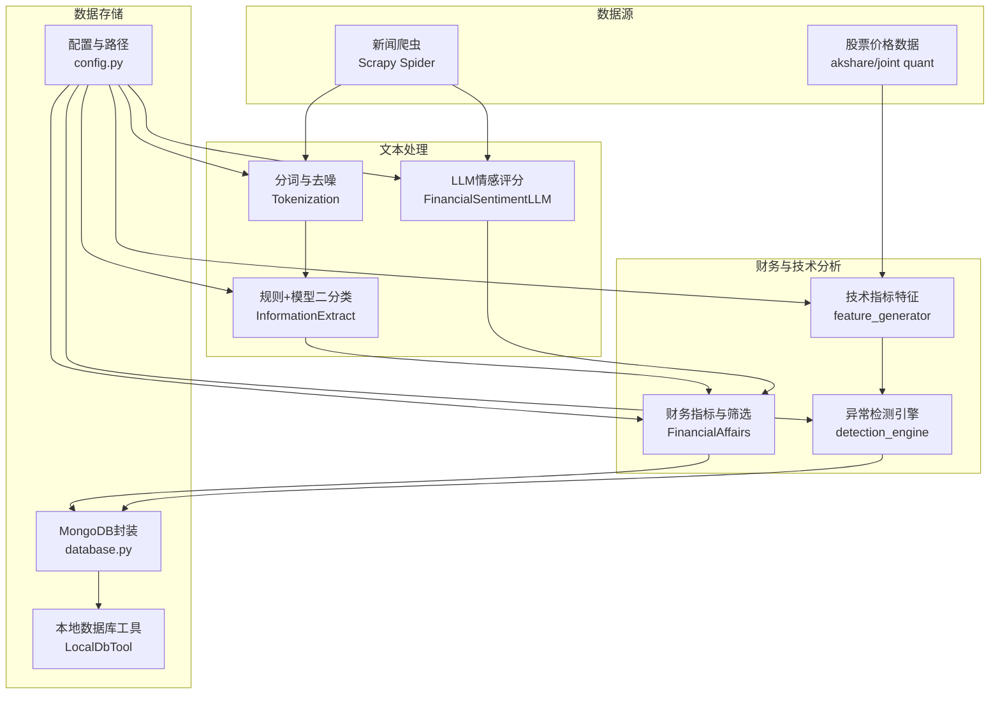
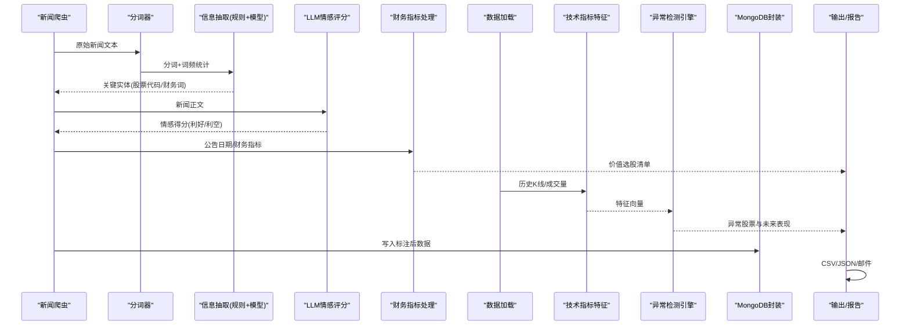
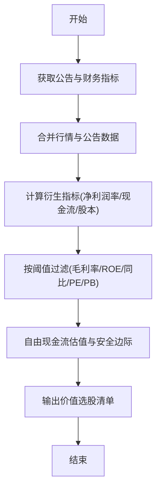
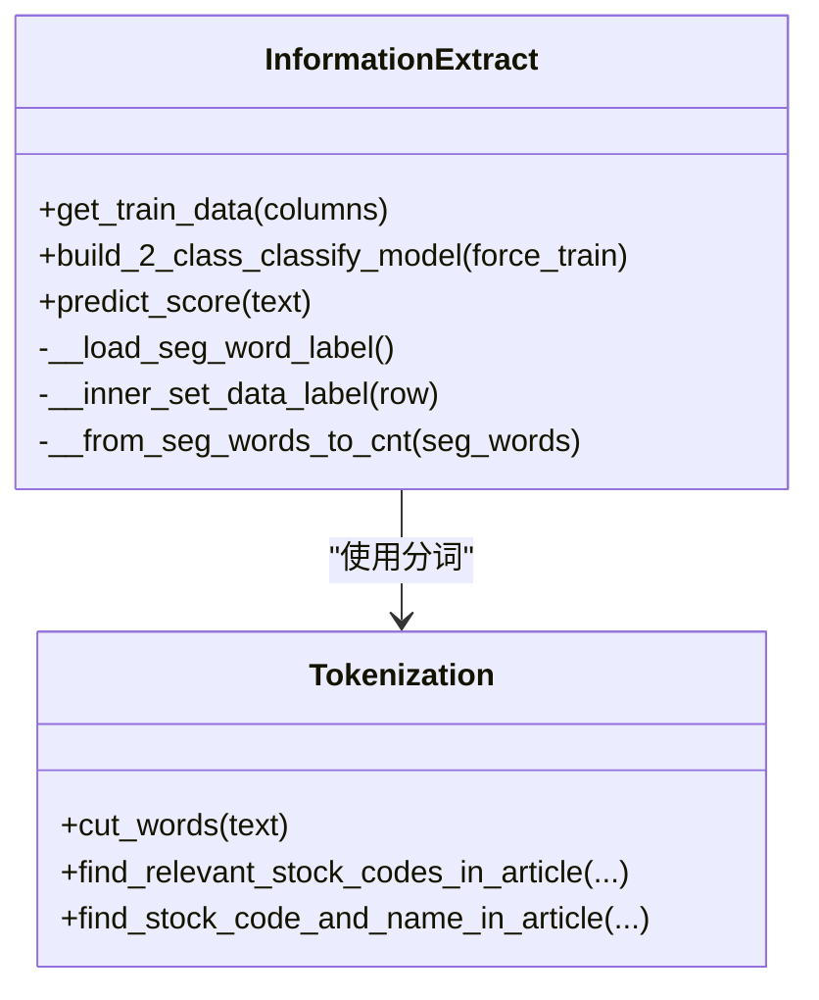
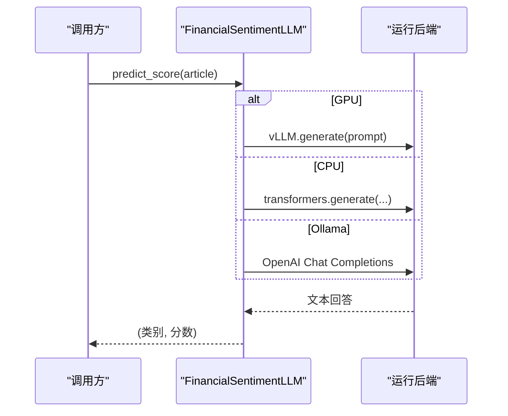
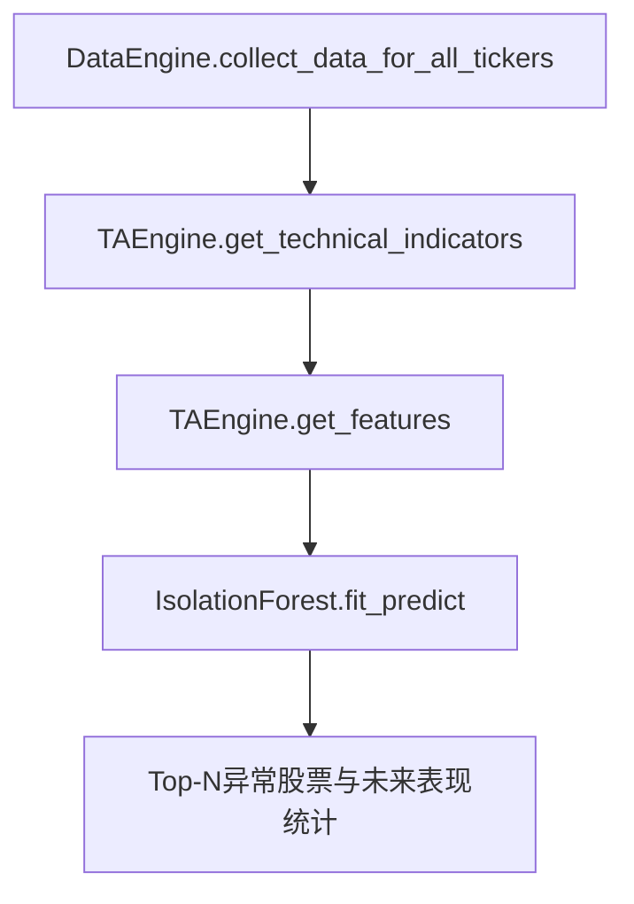
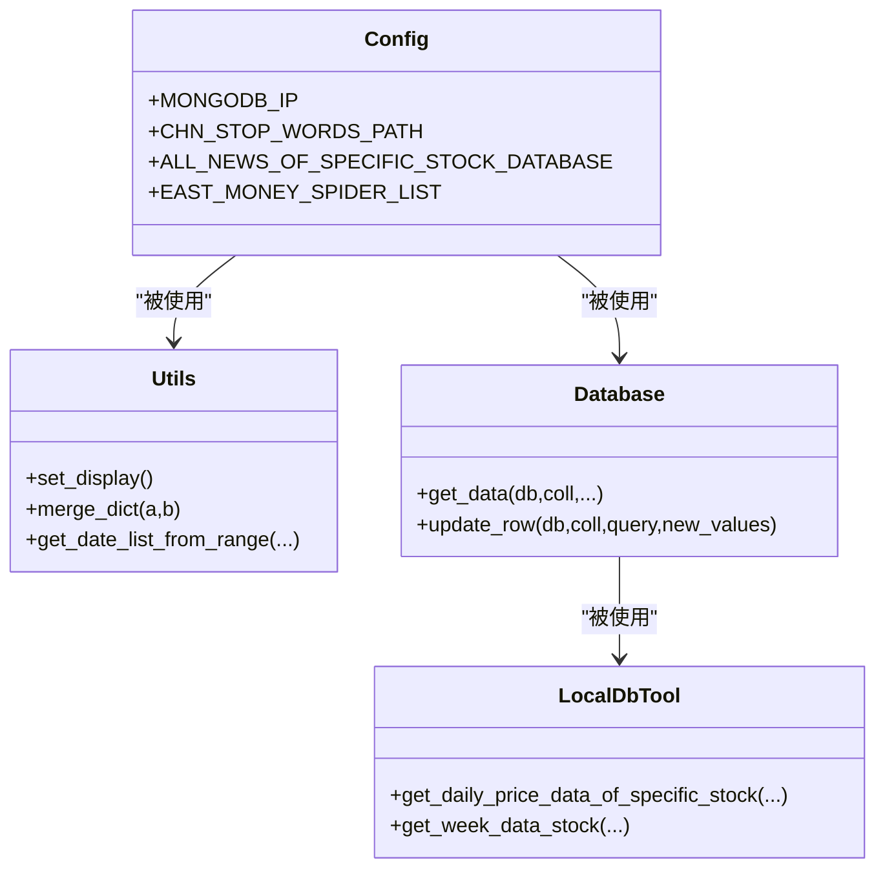
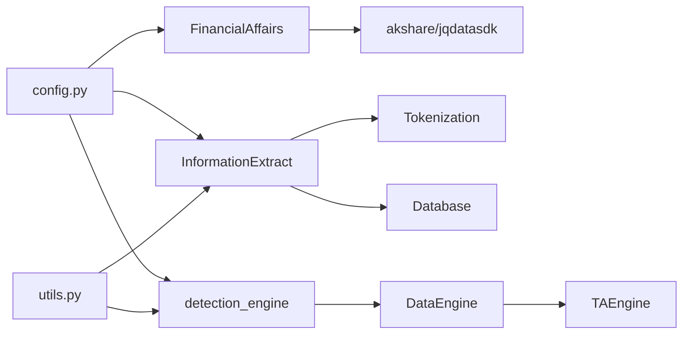

# 财务事务处理

<cite>
**本文引用的文件**
- [FinancialAffairs.py](file://src/FundamentalMarketAnalyze/FinancialAffairs.py)
- [information_extract.py](file://src/NlpModel/information_extract.py)
- [FinancialSentimentLLM.py](file://src/NlpModel/FinancialSentimentLLM.py)
- [detection_engine.py](file://src/ThirdPartyToolSurpriver/detection_engine.py)
- [data_loader.py](file://src/ThirdPartyToolSurpriver/data_loader.py)
- [feature_generator.py](file://src/ThirdPartyToolSurpriver/feature_generator.py)
- [tokenization.py](file://src/NlpModel/tokenization.py)
- [config.py](file://src/Utils/config.py)
- [utils.py](file://src/Utils/utils.py)
- [database.py](file://src/Utils/database.py)
- [LocalDbTool.py](file://src/MongoDbComTools/LocalDbTool.py)
- [README.md](file://README.md)
</cite>

## 目录
1. [简介](#简介)
2. [项目结构](#项目结构)
3. [核心组件](#核心组件)
4. [架构总览](#架构总览)
5. [详细组件分析](#详细组件分析)
6. [依赖分析](#依赖分析)
7. [性能考量](#性能考量)
8. [故障排查指南](#故障排查指南)
9. [结论](#结论)
10. [附录](#附录)

## 简介
本文件面向“财务事务处理模块”的综合技术文档，目标是帮助开发者系统理解并扩展以下能力：
- 财务事件的识别、分类与处理流程
- 财务公告的解析算法与信息抽取方法
- 重大事项的判定标准与处理策略
- 财务数据的标准化处理与格式转换
- 财务报表的自动分析与异常检测机制
- 结合新闻文本情感分析与技术指标的自动化处理链路，为投资决策提供准确数据支持

本模块以“爬虫采集—清洗与标注—文本情感与事件抽取—财务指标与技术分析—异常检测—结果输出”为主线，形成闭环的数据处理流水线。

## 项目结构
项目采用按功能域划分的目录结构，核心模块如下：
- FundamentalMarketAnalyze：基本面分析与财务指标处理
- NlpModel：自然语言处理与情感分析
- ThirdPartyToolSurpriver：基于技术指标的异常检测工具
- MongoDbComTools：本地数据库工具与数据访问
- Utils：通用配置、数据库封装、工具函数
- 数据与字典：停用词、金融词典、行业/概念映射等

图表来源
- [FinancialAffairs.py:1-381](file://src/FundamentalMarketAnalyze/FinancialAffairs.py#L1-L381)
- [information_extract.py:1-424](file://src/NlpModel/information_extract.py#L1-L424)
- [FinancialSentimentLLM.py:1-167](file://src/NlpModel/FinancialSentimentLLM.py#L1-L167)
- [detection_engine.py:1-599](file://src/ThirdPartyToolSurpriver/detection_engine.py#L1-L599)
- [data_loader.py:1-293](file://src/ThirdPartyToolSurpriver/data_loader.py#L1-L293)
- [feature_generator.py:1-186](file://src/ThirdPartyToolSurpriver/feature_generator.py#L1-L186)
- [tokenization.py:1-169](file://src/NlpModel/tokenization.py#L1-L169)
- [config.py:1-455](file://src/Utils/config.py#L1-L455)
- [database.py:1-176](file://src/Utils/database.py#L1-L176)
- [LocalDbTool.py:1-288](file://src/MongoDbComTools/LocalDbTool.py#L1-L288)

章节来源
- [README.md:1-33](file://README.md#L1-L33)

## 核心组件
- 财务事件与公告处理：通过财务公告数据与文本情感分析，识别利好/利空事件，结合财务指标进行筛选与排序。
- 财务公告解析与信息抽取：基于规则词典与机器学习模型，抽取公告中的关键实体（股票代码、财务指标、时间等）。
- 重大事项判定与策略：设定财务指标阈值与技术信号，形成“价值选股”或“异常事件”清单。
- 财务数据标准化与格式转换：统一字段命名、数值类型、缺失值处理与导出格式。
- 财务报表自动分析与异常检测：利用Isolation Forest对技术特征进行异常检测，评估未来收益与波动。

章节来源
- [FinancialAffairs.py:1-381](file://src/FundamentalMarketAnalyze/FinancialAffairs.py#L1-L381)
- [information_extract.py:1-424](file://src/NlpModel/information_extract.py#L1-L424)
- [FinancialSentimentLLM.py:1-167](file://src/NlpModel/FinancialSentimentLLM.py#L1-L167)
- [detection_engine.py:1-599](file://src/ThirdPartyToolSurpriver/detection_engine.py#L1-L599)

## 架构总览
下图展示从数据采集到最终输出的关键交互与数据流。

图表来源
- [tokenization.py:1-169](file://src/NlpModel/tokenization.py#L1-L169)
- [information_extract.py:1-424](file://src/NlpModel/information_extract.py#L1-L424)
- [FinancialSentimentLLM.py:1-167](file://src/NlpModel/FinancialSentimentLLM.py#L1-L167)
- [FinancialAffairs.py:1-381](file://src/FundamentalMarketAnalyze/FinancialAffairs.py#L1-L381)
- [data_loader.py:1-293](file://src/ThirdPartyToolSurpriver/data_loader.py#L1-L293)
- [feature_generator.py:1-186](file://src/ThirdPartyToolSurpriver/feature_generator.py#L1-L186)
- [detection_engine.py:1-599](file://src/ThirdPartyToolSurpriver/detection_engine.py#L1-L599)
- [database.py:1-176](file://src/Utils/database.py#L1-L176)

## 详细组件分析

### 财务事件识别与处理（FinancialAffairs）
- 功能要点
  - 获取实时/历史财务公告与财务指标，构造筛选条件（毛利率、净利率、ROE、营收/利润同比、PE/PB等）。
  - 计算自由现金流估值与安全边际价格，输出“价值选股”清单。
  - 提供个股基础信息与PE/PB查询接口。
- 处理流程
  - 输入：公告日期、财务指标阈值
  - 处理：合并公告与行情数据，计算衍生指标（净利润率、经营现金流、总股本等），过滤与排序
  - 输出：筛选后的股票池与估值结果

图表来源
- [FinancialAffairs.py:64-169](file://src/FundamentalMarketAnalyze/FinancialAffairs.py#L64-L169)

章节来源
- [FinancialAffairs.py:1-381](file://src/FundamentalMarketAnalyze/FinancialAffairs.py#L1-L381)

### 财务公告解析与信息抽取（InformationExtract）
- 功能要点
  - 规则词典与模型双轨：基于预置词典统计正负样本比例，结合朴素贝叶斯与SVM进行二分类。
  - 文本预处理：分词、去停用词、TF-IDF向量化。
  - 标签生成：规则标签与模型标签融合，形成训练集。
- 处理流程
  - 从数据库读取标注数据，构建词频字典与规则标签
  - 文本向量化与训练，保存模型与向量器
  - 对未知文本进行预测，输出利好/利空与置信度

图表来源
- [information_extract.py:26-338](file://src/NlpModel/information_extract.py#L26-L338)
- [tokenization.py:11-103](file://src/NlpModel/tokenization.py#L11-L103)

章节来源
- [information_extract.py:1-424](file://src/NlpModel/information_extract.py#L1-L424)
- [tokenization.py:1-169](file://src/NlpModel/tokenization.py#L1-L169)

### LLM情感评分（FinancialSentimentLLM）
- 功能要点
  - 支持GPU/本地CPU/Ollama三种运行后端，自动选择最优方案。
  - 统一提示词模板，输出JSON格式的0-1分值，映射为利好/利空。
- 处理流程
  - 输入：新闻正文
  - 处理：根据后端调用LLM生成回答，正则提取分值
  - 输出：类别与置信度

图表来源
- [FinancialSentimentLLM.py:108-167](file://src/NlpModel/FinancialSentimentLLM.py#L108-L167)

章节来源
- [FinancialSentimentLLM.py:1-167](file://src/NlpModel/FinancialSentimentLLM.py#L1-L167)

### 技术指标异常检测（detection_engine + data_loader + feature_generator）
- 功能要点
  - 从MongoDB加载历史K线与成交量，计算RSI、Stoch、CCI、EOM、AccDist等技术指标。
  - 使用Isolation Forest对特征向量进行异常检测，输出异常股票与未来表现统计。
- 处理流程
  - 数据加载：按股票集合读取历史价格与未来窗口
  - 特征生成：计算技术指标与斜率、相关系数等统计量
  - 异常检测：训练Isolation Forest，输出异常分数与可视化

图表来源
- [data_loader.py:148-224](file://src/ThirdPartyToolSurpriver/data_loader.py#L148-L224)
- [feature_generator.py:31-161](file://src/ThirdPartyToolSurpriver/feature_generator.py#L31-L161)
- [detection_engine.py:272-427](file://src/ThirdPartyToolSurpriver/detection_engine.py#L272-L427)

章节来源
- [detection_engine.py:1-599](file://src/ThirdPartyToolSurpriver/detection_engine.py#L1-L599)
- [data_loader.py:1-293](file://src/ThirdPartyToolSurpriver/data_loader.py#L1-L293)
- [feature_generator.py:1-186](file://src/ThirdPartyToolSurpriver/feature_generator.py#L1-L186)

### 数据标准化与格式转换（config + utils + database + LocalDbTool）
- 配置管理：统一数据库、停用词、词典、爬虫配置与模型路径
- 工具函数：日期范围、稀疏矩阵转换、邮件发送、中文字符统计
- 数据访问：MongoDB连接、查询、更新、自动重连增强
- 本地工具：按日期范围查询K线、周线聚合、股本查询

图表来源
- [config.py:1-455](file://src/Utils/config.py#L1-L455)
- [utils.py:1-251](file://src/Utils/utils.py#L1-L251)
- [database.py:1-176](file://src/Utils/database.py#L1-L176)
- [LocalDbTool.py:1-288](file://src/MongoDbComTools/LocalDbTool.py#L1-L288)

章节来源
- [config.py:1-455](file://src/Utils/config.py#L1-L455)
- [utils.py:1-251](file://src/Utils/utils.py#L1-L251)
- [database.py:1-176](file://src/Utils/database.py#L1-L176)
- [LocalDbTool.py:1-288](file://src/MongoDbComTools/LocalDbTool.py#L1-L288)

## 依赖分析
- 组件耦合
  - FinancialAffairs与akshare、jqdatasdk强耦合，负责财务指标与估值
  - InformationExtract与Tokenization、Database紧密耦合，依赖词典与标注数据
  - detection_engine依赖data_loader与feature_generator，形成技术分析闭环
  - 所有模块共享config与utils，降低跨模块耦合
- 外部依赖
  - MongoDB：数据持久化与查询
  - akshare/joint quant：行情与财务数据抓取
  - sklearn/ta：技术指标与异常检测
  - transformers/vLLM/ollama：LLM推理
- 潜在循环依赖
  - 当前模块间通过配置与工具层解耦，未见明显循环导入

图表来源
- [FinancialAffairs.py:1-381](file://src/FundamentalMarketAnalyze/FinancialAffairs.py#L1-L381)
- [information_extract.py:1-424](file://src/NlpModel/information_extract.py#L1-L424)
- [detection_engine.py:1-599](file://src/ThirdPartyToolSurpriver/detection_engine.py#L1-L599)
- [data_loader.py:1-293](file://src/ThirdPartyToolSurpriver/data_loader.py#L1-L293)
- [feature_generator.py:1-186](file://src/ThirdPartyToolSurpriver/feature_generator.py#L1-L186)
- [config.py:1-455](file://src/Utils/config.py#L1-L455)
- [utils.py:1-251](file://src/Utils/utils.py#L1-L251)

章节来源
- [config.py:1-455](file://src/Utils/config.py#L1-L455)
- [utils.py:1-251](file://src/Utils/utils.py#L1-L251)

## 性能考量
- 文本处理
  - 分词与TF-IDF向量化可批量处理，建议使用pandas apply的并行化与缓存词典
  - 模型预测阶段可复用向量器，避免重复构建
- 财务指标计算
  - 财务公告筛选涉及多表合并与复杂条件过滤，建议在数据库侧建立索引或预聚合
- 技术指标与异常检测
  - Isolation Forest训练成本较高，建议离线训练并缓存模型；推理阶段批量特征向量
- I/O与网络
  - akshare/jqdatasdk请求需限速与重试；MongoDB连接池参数可调优
- 内存与磁盘
  - 大规模特征矩阵建议使用稀疏存储；模型与向量器持久化减少重复加载

## 故障排查指南
- MongoDB连接失败
  - 检查IP/端口与认证配置；启用自动重连装饰器
  - 章节来源: [database.py:15-60](file://src/Utils/database.py#L15-L60)
- 文本情感模型未加载
  - 确认模型文件路径与pickle兼容性；首次运行强制训练
  - 章节来源: [information_extract.py:97-107](file://src/NlpModel/information_extract.py#L97-L107)
- LLM推理异常
  - 检查后端选择与环境变量；确保Ollama服务可用或GPU驱动正确
  - 章节来源: [FinancialSentimentLLM.py:50-105](file://src/NlpModel/FinancialSentimentLLM.py#L50-L105)
- 技术指标为空或NaN
  - 检查历史数据长度与成交量非零过滤；必要时调整窗口参数
  - 章节来源: [feature_generator.py:164-185](file://src/ThirdPartyToolSurpriver/feature_generator.py#L164-L185)
- 财务筛选结果为空
  - 调整阈值或放宽条件；确认公告日期与财务数据匹配
  - 章节来源: [FinancialAffairs.py:122-131](file://src/FundamentalMarketAnalyze/FinancialAffairs.py#L122-L131)

## 结论
本模块通过“文本情感+财务指标+技术分析+异常检测”的多维融合，实现了从公告到投资建议的自动化处理链路。建议后续在以下方向持续优化：
- 将LLM与规则模型融合为统一打分体系，提升稳定性
- 引入财报因子（季报/年报后15/30天表现）作为监督信号
- 增加可视化面板与邮件/通知机制，便于投研人员快速审阅
- 优化批处理与缓存策略，降低延迟与资源消耗

## 附录
- 术语
  - 财务公告：上市公司披露的重大事项公告
  - 价值选股：基于财务指标与估值的安全边际筛选
  - 技术异常：基于Isolation Forest识别的异常股票
  - 安全边际：以自由现金流贴现估值为基础的折扣定价策略