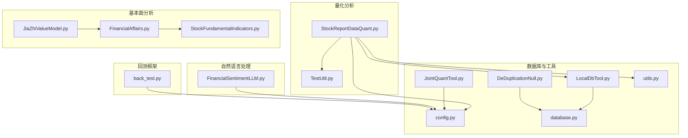
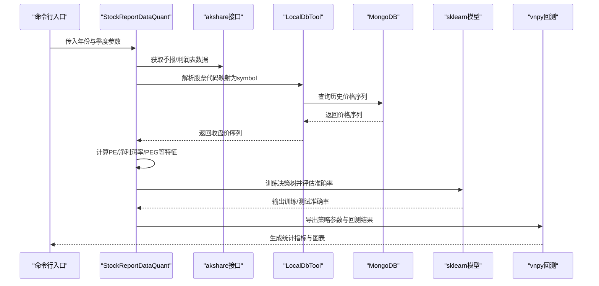
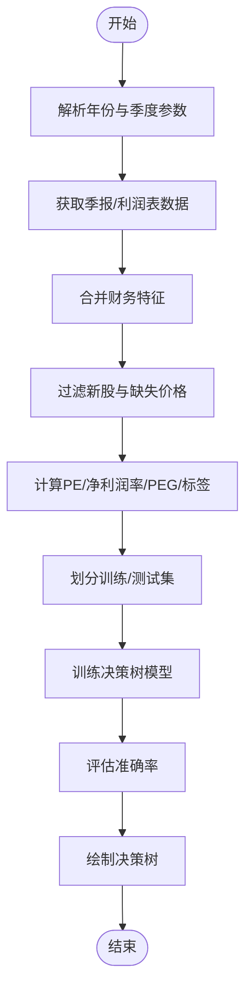
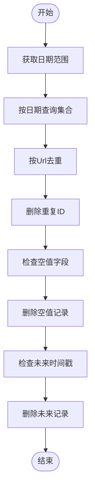
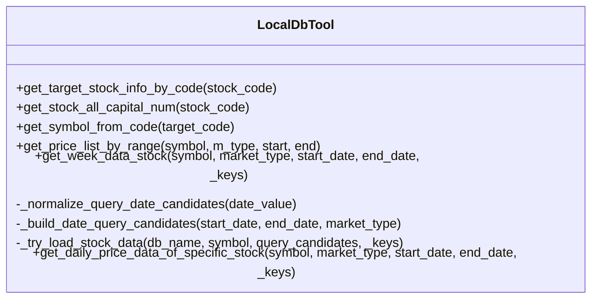
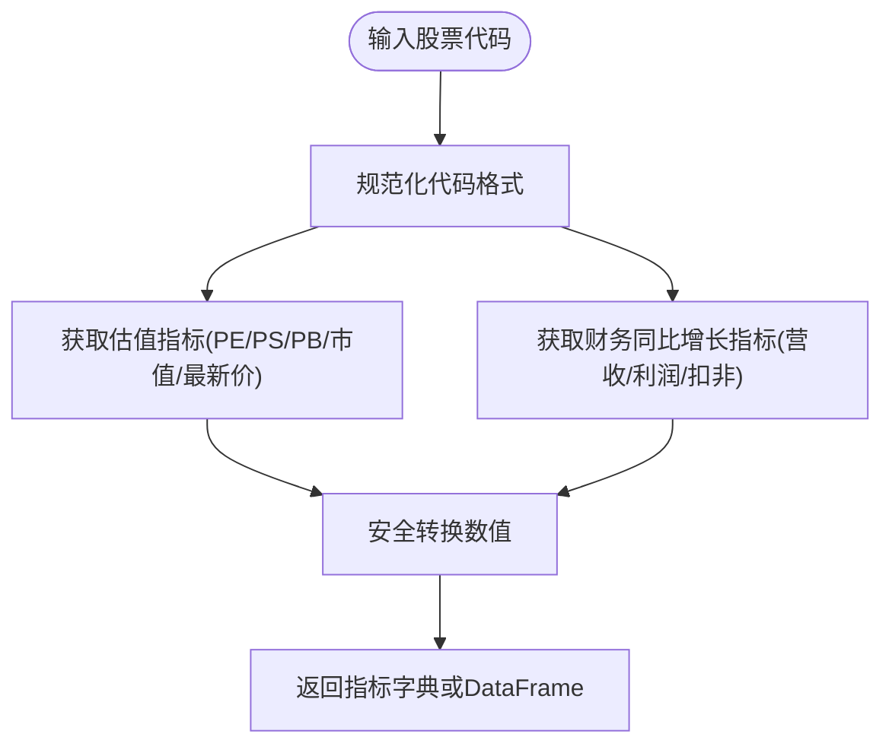
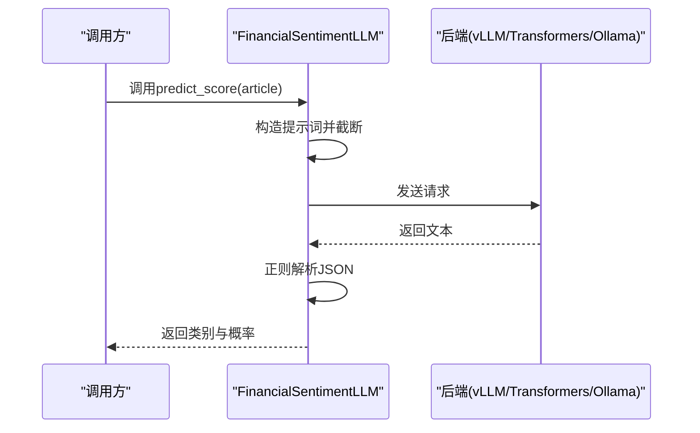
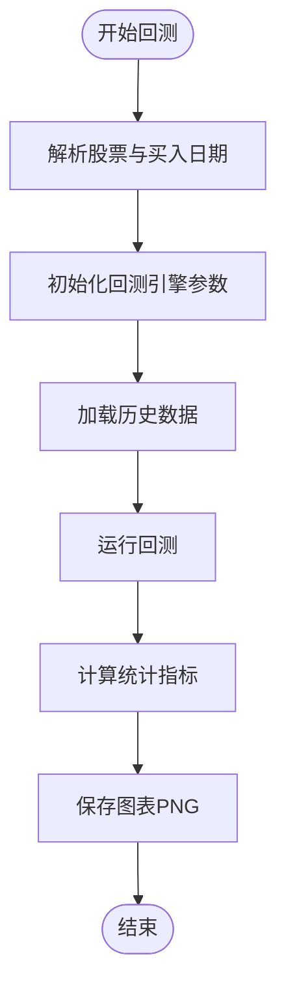
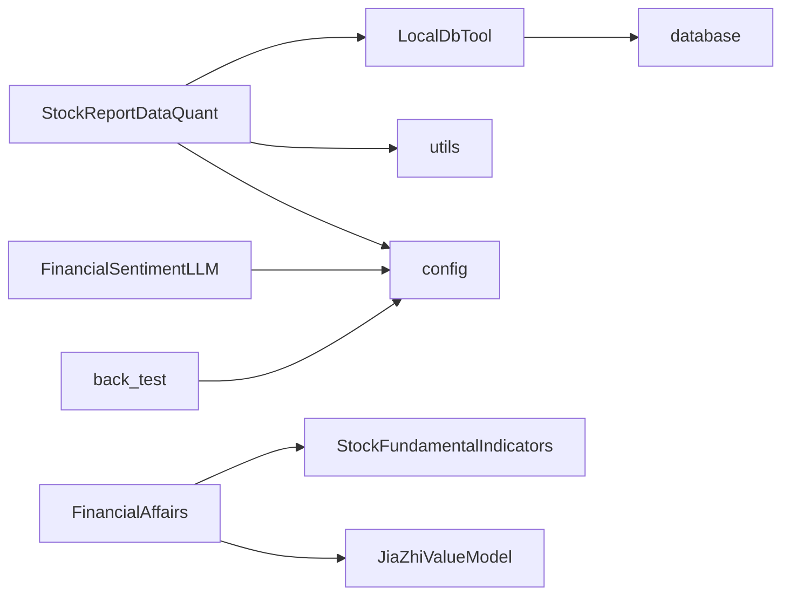

# 量化股票报告分析

<cite>
**本文引用的文件**
- [StockReportDataQuant.py](file://src/QuantAnalyze/StockReportDataQuant.py)
- [TestUtil.py](file://src/QuantAnalyze/TestUtil.py)
- [LocalDbTool.py](file://src/MongoDbComTools/LocalDbTool.py)
- [DeDuplicationNull.py](file://src/MongoDbComTools/DeDuplicationNull.py)
- [JointQuantTool.py](file://src/MongoDbComTools/JointQuantTool.py)
- [utils.py](file://src/Utils/utils.py)
- [config.py](file://src/Utils/config.py)
- [database.py](file://src/Utils/database.py)
- [JiaZhiValueModel.py](file://src/FundamentalMarketAnalyze/JiaZhiValueModel.py)
- [FinancialAffairs.py](file://src/FundamentalMarketAnalyze/FinancialAffairs.py)
- [StockFundamentalIndicators.py](file://src/MassBreak/StockFundamentalIndicators.py)
- [FinancialSentimentLLM.py](file://src/NlpModel/FinancialSentimentLLM.py)
- [back_test.py](file://src/VnpyBacktesting/back_test.py)
- [README.md](file://README.md)
</cite>

## 目录
1. [简介](#简介)
2. [项目结构](#项目结构)
3. [核心组件](#核心组件)
4. [架构总览](#架构总览)
5. [详细组件分析](#详细组件分析)
6. [依赖关系分析](#依赖关系分析)
7. [性能考量](#性能考量)
8. [故障排查指南](#故障排查指南)
9. [结论](#结论)
10. [附录](#附录)

## 简介
本技术文档面向量化股票报告分析模块，系统性介绍如何对财务报告数据进行量化处理、统计分析与建模，涵盖财务指标计算、数据质量控制、标准化与异常值检测、统计检验与假设验证、投资组合构建与风险管理、报告解读与可视化展示等。文档以仓库现有代码为基础，结合实际可运行的模块路径，给出可操作的实现步骤与最佳实践，帮助分析师高效处理大量财务报告数据并提取有价值的投资信息。

## 项目结构
该项目采用模块化组织方式，围绕“新闻爬取—价格数据—基本面/技术分析—回测”主线展开，量化分析模块主要集中在 QuantAnalyze、FundamentalMarketAnalyze、MongoDbComTools、Utils、NlpModel、VnpyBacktesting 等子目录。

**图表来源**
- [StockReportDataQuant.py:1-198](file://src/QuantAnalyze/StockReportDataQuant.py#L1-L198)
- [LocalDbTool.py:1-288](file://src/MongoDbComTools/LocalDbTool.py#L1-L288)
- [DeDuplicationNull.py:1-122](file://src/MongoDbComTools/DeDuplicationNull.py#L1-L122)
- [JointQuantTool.py:1-51](file://src/MongoDbComTools/JointQuantTool.py#L1-L51)
- [config.py:1-455](file://src/Utils/config.py#L1-L455)
- [utils.py:1-251](file://src/Utils/utils.py#L1-L251)
- [database.py:1-176](file://src/Utils/database.py#L1-L176)
- [JiaZhiValueModel.py:1-24](file://src/FundamentalMarketAnalyze/JiaZhiValueModel.py#L1-L24)
- [FinancialAffairs.py:1-381](file://src/FundamentalMarketAnalyze/FinancialAffairs.py#L1-L381)
- [StockFundamentalIndicators.py:1-210](file://src/MassBreak/StockFundamentalIndicators.py#L1-L210)
- [FinancialSentimentLLM.py:1-167](file://src/NlpModel/FinancialSentimentLLM.py#L1-L167)
- [back_test.py:1-287](file://src/VnpyBacktesting/back_test.py#L1-L287)

**章节来源**
- [README.md:1-33](file://README.md#L1-L33)

## 核心组件
- 财报数据量化与建模：从外部接口抓取季报/报表数据，构造特征并训练分类器预测未来涨跌。
- 数据质量控制：去重、空值删除、时间字段校验。
- 数据访问与标准化：本地数据库封装、日期规范化、价格序列抽取。
- 基本面指标体系：PE/PS/PB、ROE/ROA、营收/利润同比增长、PEG 等。
- 新闻情感分析：基于 LLM 的金融新闻情绪打分。
- 回测框架：vnpy 回测引擎集成，支持参数扫描与可视化。

**章节来源**
- [StockReportDataQuant.py:1-198](file://src/QuantAnalyze/StockReportDataQuant.py#L1-L198)
- [DeDuplicationNull.py:1-122](file://src/MongoDbComTools/DeDuplicationNull.py#L1-L122)
- [LocalDbTool.py:1-288](file://src/MongoDbComTools/LocalDbTool.py#L1-L288)
- [StockFundamentalIndicators.py:1-210](file://src/MassBreak/StockFundamentalIndicators.py#L1-L210)
- [FinancialSentimentLLM.py:1-167](file://src/NlpModel/FinancialSentimentLLM.py#L1-L167)
- [back_test.py:1-287](file://src/VnpyBacktesting/back_test.py#L1-L287)

## 架构总览
整体流程自上而下分为“数据采集—清洗—特征工程—建模—回测—可视化”，其中数据层通过 MongoDB 封装统一访问，特征层整合财务报表与价格序列，建模层采用决策树分类器，回测层基于 vnpy 引擎。

**图表来源**
- [StockReportDataQuant.py:20-198](file://src/QuantAnalyze/StockReportDataQuant.py#L20-L198)
- [LocalDbTool.py:77-276](file://src/MongoDbComTools/LocalDbTool.py#L77-L276)
- [back_test.py:123-187](file://src/VnpyBacktesting/back_test.py#L123-L187)

## 详细组件分析

### 组件A：财报数据量化与建模（StockReportDataQuant）
- 功能概述
  - 读取指定季度的利润表与资产负债表数据，提取关键财务特征。
  - 通过 LocalDbTool 获取目标股票在财报发布前后一段时间内的价格序列，构造标签（涨/跌）。
  - 计算 PE、净利润率、PEG 等估值与盈利效率指标作为特征。
  - 使用决策树分类器进行样本训练与评估，输出准确率与决策树可视化。

- 关键流程
  - 参数解析与目标日期拼接。
  - 调用 akshare 接口获取季报/利润表数据。
  - 合并利润表与资产负债表特征。
  - 过滤新股与缺失价格记录。
  - 计算 PE、净利润率、PEG 并构造标签。
  - 特征填充与训练集/测试集划分。
  - 决策树训练与准确率评估。

- 代码片段路径
  - [参数解析与目标日期:26-39](file://src/QuantAnalyze/StockReportDataQuant.py#L26-L39)
  - [季报/利润表数据获取与合并:41-87](file://src/QuantAnalyze/StockReportDataQuant.py#L41-L87)
  - [过滤新股与缺失价格:91-118](file://src/QuantAnalyze/StockReportDataQuant.py#L91-L118)
  - [特征计算（PE/净利润率/PEG/标签）:122-142](file://src/QuantAnalyze/StockReportDataQuant.py#L122-L142)
  - [特征矩阵与训练评估:144-193](file://src/QuantAnalyze/StockReportDataQuant.py#L144-L193)

- 可视化与输出
  - 决策树可视化输出（tree.plot_tree）。

**图表来源**
- [StockReportDataQuant.py:20-198](file://src/QuantAnalyze/StockReportDataQuant.py#L20-L198)

**章节来源**
- [StockReportDataQuant.py:1-198](file://src/QuantAnalyze/StockReportDataQuant.py#L1-L198)
- [TestUtil.py:1-40](file://src/QuantAnalyze/TestUtil.py#L1-L40)

### 组件B：数据质量控制（DeDuplicationNull）
- 功能概述
  - 对新闻数据集合按日期进行去重（基于 Url 字段）。
  - 删除空值字段的记录。
  - 删除未来时间戳的记录。

- 关键流程
  - 遍历日期范围，按日期查询集合。
  - 去重并删除重复文档 ID。
  - 遍历集合删除空字符串字段（除 RelatedStockCodes 外）。
  - 删除日期在未来的情况。

- 代码片段路径
  - [去重逻辑:22-62](file://src/MongoDbComTools/DeDuplicationNull.py#L22-L62)
  - [空值删除:72-88](file://src/MongoDbComTools/DeDuplicationNull.py#L72-L88)
  - [时间字段校验与删除:99-113](file://src/MongoDbComTools/DeDuplicationNull.py#L99-L113)

**图表来源**
- [DeDuplicationNull.py:22-113](file://src/MongoDbComTools/DeDuplicationNull.py#L22-L113)

**章节来源**
- [DeDuplicationNull.py:1-122](file://src/MongoDbComTools/DeDuplicationNull.py#L1-L122)

### 组件C：数据访问与标准化（LocalDbTool）
- 功能概述
  - 提供跨市场（A股/HK/美股）的历史价格数据查询。
  - 支持按日期范围查询、索引规范化、周线聚合。
  - 提供股票代码到 symbol 的映射，以及总股本等基础信息。

- 关键流程
  - 选择数据库与集合（A/HK/US）。
  - 构造日期候选查询条件（支持多种日期格式）。
  - 优先尝试精确匹配，否则回退到范围查询。
  - 生成 money 字段（均价×量能）。
  - 设置索引为 date 或 date_time_index。

- 代码片段路径
  - [日期候选规范化:127-173](file://src/MongoDbComTools/LocalDbTool.py#L127-L173)
  - [日期查询候选构建:175-215](file://src/MongoDbComTools/LocalDbTool.py#L175-L215)
  - [历史价格查询与索引设置:226-276](file://src/MongoDbComTools/LocalDbTool.py#L226-L276)

**图表来源**
- [LocalDbTool.py:10-276](file://src/MongoDbComTools/LocalDbTool.py#L10-L276)

**章节来源**
- [LocalDbTool.py:1-288](file://src/MongoDbComTools/LocalDbTool.py#L1-L288)

### 组件D：基本面指标体系（StockFundamentalIndicators）
- 功能概述
  - 规范化股票代码输入（支持多种格式）。
  - 从 akshare 获取估值指标（PE/PS/PB/市值/最新价）与财务同比增长指标（营收/利润/扣非利润）。
  - 安全转换数值类型，避免 NaN/异常导致的错误。

- 关键流程
  - 解析并标准化股票代码。
  - 分别调用估值与财务指标接口。
  - 安全转换 float，填充结果字典。
  - 提供 DataFrame 获取与打印辅助。

- 代码片段路径
  - [代码规范化:10-34](file://src/MassBreak/StockFundamentalIndicators.py#L10-L34)
  - [估值与财务指标获取:62-97](file://src/MassBreak/StockFundamentalIndicators.py#L62-L97)
  - [安全数值转换:139-146](file://src/MassBreak/StockFundamentalIndicators.py#L139-L146)

**图表来源**
- [StockFundamentalIndicators.py:37-101](file://src/MassBreak/StockFundamentalIndicators.py#L37-L101)

**章节来源**
- [StockFundamentalIndicators.py:1-210](file://src/MassBreak/StockFundamentalIndicators.py#L1-L210)

### 组件E：新闻情感分析（FinancialSentimentLLM）
- 功能概述
  - 基于 LLM 对金融新闻进行情绪打分，输出“利好/利空”与概率。
  - 支持 GPU（vLLM）、CPU（Transformers）与 Ollama 三种运行后端。
  - 单例模式避免重复加载模型。

- 关键流程
  - 初始化时根据系统与设备类型选择后端。
  - 构造提示词，截断过长文本。
  - 调用后端推理，解析 JSON 结果。
  - 返回类别与置信度。

- 代码片段路径
  - [后端选择与初始化:19-105](file://src/NlpModel/FinancialSentimentLLM.py#L19-L105)
  - [推理与结果解析:108-166](file://src/NlpModel/FinancialSentimentLLM.py#L108-L166)

**图表来源**
- [FinancialSentimentLLM.py:108-166](file://src/NlpModel/FinancialSentimentLLM.py#L108-L166)

**章节来源**
- [FinancialSentimentLLM.py:1-167](file://src/NlpModel/FinancialSentimentLLM.py#L1-L167)

### 组件F：回测框架（back_test）
- 功能概述
  - 基于 vnpy 回测引擎，支持单票或多票回测。
  - 支持参数扫描、图表保存、统计指标输出。
  - 提供买卖触发策略参数（止盈止损、移动止损等）。

- 关键流程
  - 解析股票列表与买入日期。
  - 设置回测引擎参数（手续费、滑点、初始资金等）。
  - 加载数据、运行回测、计算统计指标。
  - 保存资金曲线、回撤与每日净盈亏图表。

- 代码片段路径
  - [参数解析与策略设置:50-59](file://src/VnpyBacktesting/back_test.py#L50-L59)
  - [单次回测执行:123-187](file://src/VnpyBacktesting/back_test.py#L123-L187)
  - [图表保存:95-121](file://src/VnpyBacktesting/back_test.py#L95-L121)

**图表来源**
- [back_test.py:123-187](file://src/VnpyBacktesting/back_test.py#L123-L187)

**章节来源**
- [back_test.py:1-287](file://src/VnpyBacktesting/back_test.py#L1-L287)

## 依赖关系分析
- 外部依赖
  - akshare：获取财务报表与实时行情。
  - sklearn：决策树分类与数据分割。
  - pandas/numpy：数据结构与数值计算。
  - pymongo：MongoDB 访问。
  - vnpy：回测引擎。
  - LLM 后端：vLLM/Transformers/Ollama。

- 内部依赖
  - QuantAnalyze 依赖 MongoDbComTools 与 Utils。
  - MongoDbComTools 依赖 Utils.database 与 Utils.config。
  - FundamentalMarketAnalyze 依赖 akshare 与 JointQuantTool。
  - NlpModel 依赖 config 与平台信息。
  - VnpyBacktesting 依赖 vnpy 回测模块。

**图表来源**
- [StockReportDataQuant.py:1-198](file://src/QuantAnalyze/StockReportDataQuant.py#L1-L198)
- [LocalDbTool.py:1-288](file://src/MongoDbComTools/LocalDbTool.py#L1-L288)
- [FinancialAffairs.py:1-381](file://src/FundamentalMarketAnalyze/FinancialAffairs.py#L1-L381)
- [StockFundamentalIndicators.py:1-210](file://src/MassBreak/StockFundamentalIndicators.py#L1-L210)
- [FinancialSentimentLLM.py:1-167](file://src/NlpModel/FinancialSentimentLLM.py#L1-L167)
- [back_test.py:1-287](file://src/VnpyBacktesting/back_test.py#L1-L287)

**章节来源**
- [config.py:1-455](file://src/Utils/config.py#L1-L455)
- [database.py:1-176](file://src/Utils/database.py#L1-L176)

## 性能考量
- 数据访问优化
  - 使用日期候选查询减少模糊匹配次数，优先精确匹配。
  - 通过索引设置（date/date_time_index）提升查询效率。
- 特征工程
  - 对缺失值统一填充 0，避免模型训练阶段报错。
  - 估值指标（PE/PEG）需注意分母为 0 的边界处理。
- 模型训练
  - 控制决策树叶子节点数量，防止过拟合。
  - 训练/测试集比例合理设置，确保评估稳定性。
- 回测效率
  - 图表保存使用非交互后端，避免阻塞。
  - 参数扫描建议分批执行并缓存中间结果。

[本节为通用指导，无需具体文件分析]

## 故障排查指南
- MongoDB 连接失败
  - 检查 MONGODB_IP/PORT 与认证配置。
  - 查看自动重连装饰器日志，确认网络与超时设置。
  - 参考路径：[数据库连接与重连装饰器:44-60](file://src/Utils/database.py#L44-L60), [配置项:13-16](file://src/Utils/config.py#L13-L16)

- 日期解析异常
  - 确认输入日期格式与候选规范化逻辑。
  - 参考路径：[日期候选规范化:127-173](file://src/MongoDbComTools/LocalDbTool.py#L127-L173), [日期范围生成:100-110](file://src/Utils/utils.py#L100-L110)

- 新闻数据异常
  - 检查去重与空值删除是否生效。
  - 参考路径：[去重与空值删除:22-88](file://src/MongoDbComTools/DeDuplicationNull.py#L22-L88)

- 模型训练报错
  - 确认特征矩阵维度与标签长度一致，缺失值已填充。
  - 参考路径：[特征填充与训练评估:173-193](file://src/QuantAnalyze/StockReportDataQuant.py#L173-L193)

- 回测无历史数据
  - 检查数据准备阶段是否成功加载历史数据。
  - 参考路径：[回测加载与错误处理:146-154](file://src/VnpyBacktesting/back_test.py#L146-L154)

**章节来源**
- [database.py:44-60](file://src/Utils/database.py#L44-L60)
- [config.py:13-16](file://src/Utils/config.py#L13-L16)
- [LocalDbTool.py:127-173](file://src/MongoDbComTools/LocalDbTool.py#L127-L173)
- [utils.py:100-110](file://src/Utils/utils.py#L100-L110)
- [DeDuplicationNull.py:22-88](file://src/MongoDbComTools/DeDuplicationNull.py#L22-L88)
- [StockReportDataQuant.py:173-193](file://src/QuantAnalyze/StockReportDataQuant.py#L173-L193)
- [back_test.py:146-154](file://src/VnpyBacktesting/back_test.py#L146-L154)

## 结论
本模块以“财报数据—价格序列—特征工程—建模—回测—可视化”为主线，实现了从原始财务报告到可执行投资策略的关键闭环。通过数据质量控制、标准化与异常值处理、财务指标体系与情感分析，以及回测框架的集成，分析师能够快速提取有价值的投资信号并进行验证。后续可在以下方面持续优化：引入更稳健的统计检验与假设验证、扩展多因子模型、增强风险度量与组合优化、完善可视化与报告自动化。

[本节为总结性内容，无需具体文件分析]

## 附录
- 常用配置项参考
  - 数据库与集合名称、停用词路径、模型路径等。
  - 参考路径：[配置文件:39-53](file://src/Utils/config.py#L39-L53), [LLM模型路径:453-455](file://src/Utils/config.py#L453-L455)

- 工具函数参考
  - 日期范围生成、随机训练集划分、中文停用词加载等。
  - 参考路径：[日期范围生成:100-110](file://src/Utils/utils.py#L100-L110), [训练集划分:211-224](file://src/Utils/utils.py#L211-L224), [停用词加载:171-185](file://src/Utils/utils.py#L171-L185)

**章节来源**
- [config.py:39-53](file://src/Utils/config.py#L39-L53)
- [config.py:453-455](file://src/Utils/config.py#L453-L455)
- [utils.py:100-110](file://src/Utils/utils.py#L100-L110)
- [utils.py:211-224](file://src/Utils/utils.py#L211-L224)
- [utils.py:171-185](file://src/Utils/utils.py#L171-L185)