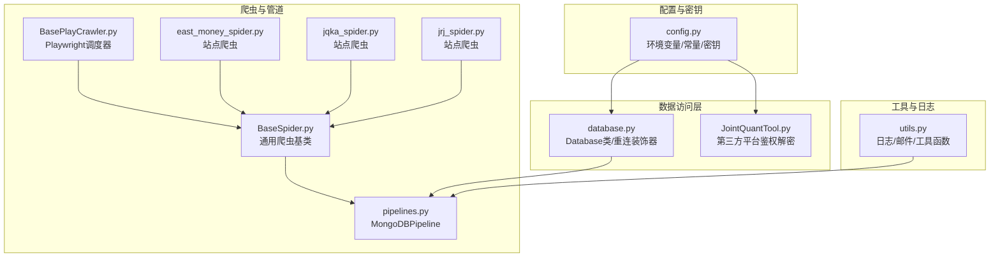
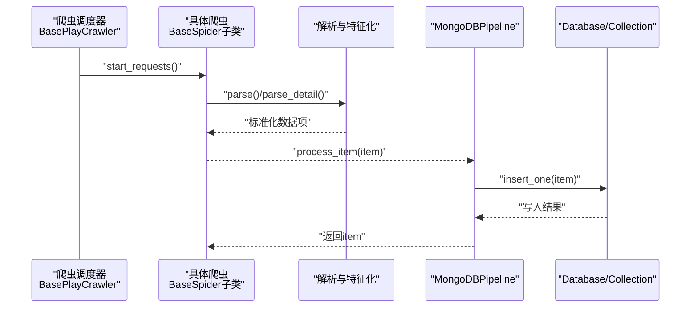
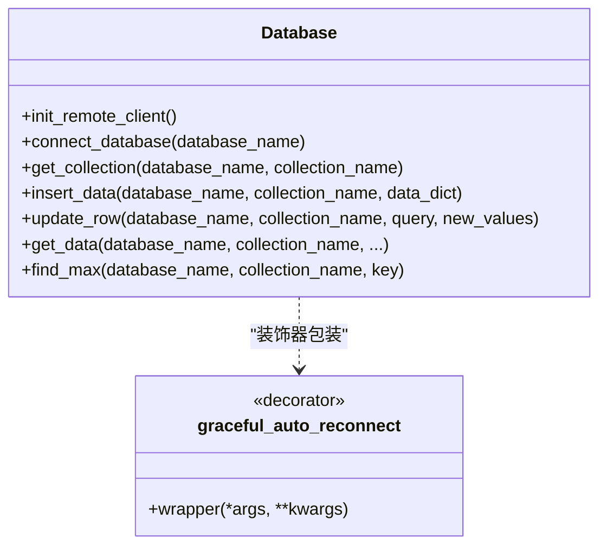
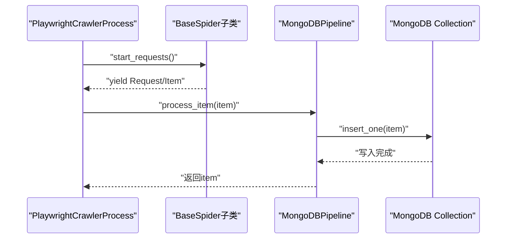
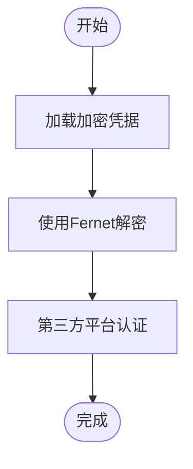
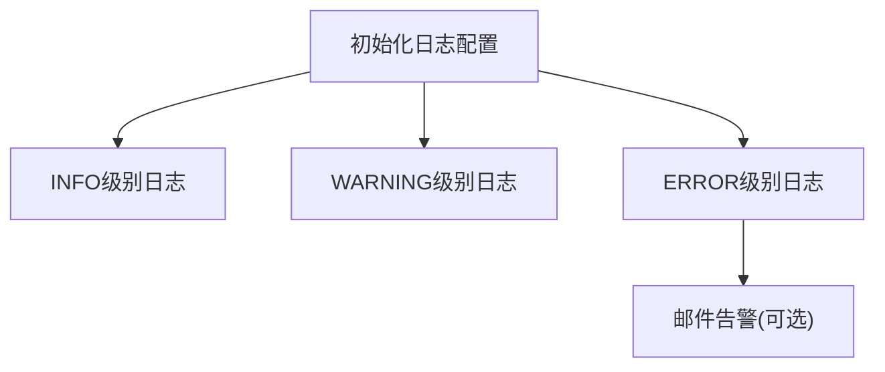
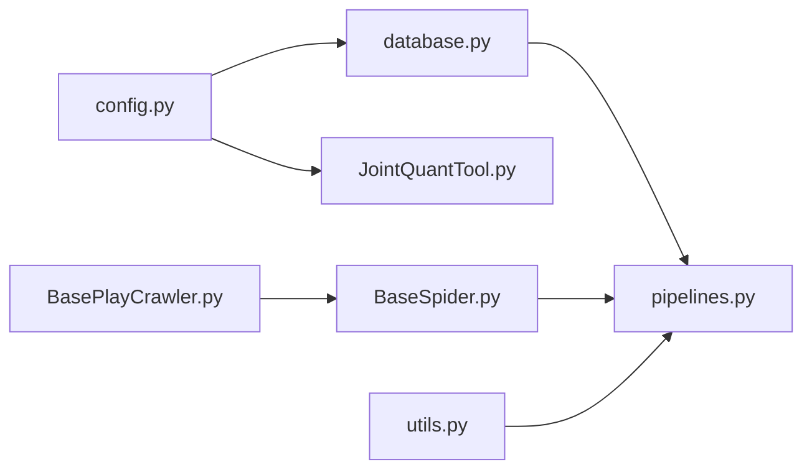

# API访问控制

<cite>
**本文引用的文件**
- [README.md](file://README.md)
- [config.py](file://src/Utils/config.py)
- [database.py](file://src/Utils/database.py)
- [JointQuantTool.py](file://src/MongoDbComTools/JointQuantTool.py)
- [pipelines.py](file://src/pipelines.py)
- [BaseSpider.py](file://src/MarketNewsSpiderWithScrapy/BaseSpider.py)
- [BasePlayCrawler.py](file://src/MarketNewsSpiderWithScrapy/BasePlayCrawler.py)
- [east_money_spider.py](file://src/MarketNewsSpiderWithScrapy/east_money_spider.py)
- [jqka_spider.py](file://src/MarketNewsSpiderWithScrapy/jqka_spider.py)
- [jrj_spider.py](file://src/MarketNewsSpiderWithScrapy/jrj_spider.py)
- [utils.py](file://src/Utils/utils.py)
</cite>

## 目录
1. [引言](#引言)
2. [项目结构](#项目结构)
3. [核心组件](#核心组件)
4. [架构总览](#架构总览)
5. [详细组件分析](#详细组件分析)
6. [依赖关系分析](#依赖关系分析)
7. [性能考量](#性能考量)
8. [故障排查指南](#故障排查指南)
9. [结论](#结论)
10. [附录](#附录)

## 引言
本文件面向开发者与运维人员，系统化梳理本仓库中与API访问控制相关的安全实践与实现要点，涵盖认证与授权、Token管理、服务端验证、限流与配额、签名与消息摘要、CORS跨域、日志与监控、版本管理与兼容性、安全测试与漏洞扫描、API文档发布与访问控制等方面。需要特别说明的是：当前仓库主要为数据采集与文本分析流水线，未直接暴露HTTP API服务；因此本文在“API访问控制”的语境下，重点解释如何在现有爬虫与数据管道基础上，扩展或对接API层时应遵循的安全原则与实现建议，并结合仓库内已有的加密存储、重连机制、日志体系等能力给出落地参考。

## 项目结构
该项目采用模块化组织，围绕“新闻爬取—文本分析—数据库入库—量化分析”主线展开。与API访问控制相关的关键位置包括：
- 配置与密钥管理：集中于配置模块，包含数据库连接参数、第三方平台账号凭证的加密存储与解密流程。
- 数据访问层：封装MongoDB客户端初始化、自动重连与异常处理、集合操作等。
- 爬虫与数据管道：定义了通用爬虫基类、Playwright异步调度器、以及将解析结果写入MongoDB的管道。
- 工具与日志：统一的日志配置、邮件发送工具等。

**图表来源**
- [config.py:1-455](file://src/Utils/config.py#L1-L455)
- [database.py:1-176](file://src/Utils/database.py#L1-L176)
- [JointQuantTool.py:1-51](file://src/MongoDbComTools/JointQuantTool.py#L1-L51)
- [BaseSpider.py:1-149](file://src/MarketNewsSpiderWithScrapy/BaseSpider.py#L1-L149)
- [BasePlayCrawler.py:1-120](file://src/MarketNewsSpiderWithScrapy/BasePlayCrawler.py#L1-L120)
- [east_money_spider.py:1-78](file://src/MarketNewsSpiderWithScrapy/east_money_spider.py#L1-L78)
- [jqka_spider.py:1-80](file://src/MarketNewsSpiderWithScrapy/jqka_spider.py#L1-L80)
- [jrj_spider.py:1-94](file://src/MarketNewsSpiderWithScrapy/jrj_spider.py#L1-L94)
- [pipelines.py:1-56](file://src/pipelines.py#L1-L56)
- [utils.py:1-251](file://src/Utils/utils.py#L1-L251)

**章节来源**
- [README.md:1-33](file://README.md#L1-L33)
- [config.py:1-455](file://src/Utils/config.py#L1-L455)
- [database.py:1-176](file://src/Utils/database.py#L1-L176)
- [pipelines.py:1-56](file://src/pipelines.py#L1-L56)

## 核心组件
- 配置与密钥管理
  - 使用对称加密算法对敏感信息（如数据库用户名、密码、第三方平台账号）进行加密存储，运行时通过解密后注入连接参数，避免明文硬编码。
  - 统一的配置中心便于集中管理数据库地址、端口、集合名称、爬虫站点参数等。
- 数据访问层
  - 封装MongoDB客户端初始化，启用自动重连与指数退避策略，降低网络抖动导致的失败率。
  - 提供集合读写、模糊查询、排序与分页等通用能力，保证数据一致性与可维护性。
- 爬虫与数据管道
  - 爬虫基类统一抽取、清洗、特征化与评分流程，产出标准化数据项。
  - Playwright调度器支持并发、独立上下文与异步请求，提升采集效率与稳定性。
  - 管道负责将解析结果按来源数据库/集合写入MongoDB，具备去重与异常处理。
- 工具与日志
  - 统一日志格式与级别，便于审计与问题定位。
  - 邮件发送工具可用于告警通知。

**章节来源**
- [config.py:25-65](file://src/Utils/config.py#L25-L65)
- [database.py:15-33](file://src/Utils/database.py#L15-L33)
- [database.py:44-60](file://src/Utils/database.py#L44-L60)
- [BaseSpider.py:41-98](file://src/MarketNewsSpiderWithScrapy/BaseSpider.py#L41-L98)
- [BasePlayCrawler.py:21-62](file://src/MarketNewsSpiderWithScrapy/BasePlayCrawler.py#L21-L62)
- [pipelines.py:8-56](file://src/pipelines.py#L8-L56)
- [utils.py:18-27](file://src/Utils/utils.py#L18-L27)

## 架构总览
下图展示从爬虫到数据库的端到端数据流，以及与配置、密钥、日志的关系。该流程体现了“离线数据采集—标准化处理—持久化入库”的典型架构，为后续扩展API层提供数据基础。

**图表来源**
- [BasePlayCrawler.py:34-62](file://src/MarketNewsSpiderWithScrapy/BasePlayCrawler.py#L34-L62)
- [BaseSpider.py:38-98](file://src/MarketNewsSpiderWithScrapy/BaseSpider.py#L38-L98)
- [pipelines.py:25-46](file://src/pipelines.py#L25-L46)
- [database.py:78-88](file://src/Utils/database.py#L78-L88)

## 详细组件分析

### 组件A：数据库访问与重连机制
- 自动重连装饰器对底层MongoDB操作进行包装，遇到网络异常时按指数退避重试，降低瞬时故障影响。
- Database类负责MongoDB客户端初始化，支持超时与连接池上限配置，确保高并发下的稳定性。
- 集合操作提供插入、更新、查询、排序等通用方法，便于上层业务调用。

**图表来源**
- [database.py:36-176](file://src/Utils/database.py#L36-L176)

**章节来源**
- [database.py:15-33](file://src/Utils/database.py#L15-L33)
- [database.py:44-60](file://src/Utils/database.py#L44-L60)
- [database.py:78-88](file://src/Utils/database.py#L78-L88)

### 组件B：爬虫基类与数据管道
- BaseSpider提供统一的数据抽取、清洗、特征化与评分流程，输出标准化字段，便于后续入库与分析。
- BasePlayCrawler支持并发调度、独立上下文与异步请求，提升采集效率。
- MongoDBPipeline按来源数据库/集合写入，具备重复键忽略与异常处理。

**图表来源**
- [BasePlayCrawler.py:64-118](file://src/MarketNewsSpiderWithScrapy/BasePlayCrawler.py#L64-L118)
- [BaseSpider.py:41-98](file://src/MarketNewsSpiderWithScrapy/BaseSpider.py#L41-L98)
- [pipelines.py:25-46](file://src/pipelines.py#L25-L46)

**章节来源**
- [BaseSpider.py:13-33](file://src/MarketNewsSpiderWithScrapy/BaseSpider.py#L13-L33)
- [BaseSpider.py:41-98](file://src/MarketNewsSpiderWithScrapy/BaseSpider.py#L41-L98)
- [BasePlayCrawler.py:21-62](file://src/MarketNewsSpiderWithScrapy/BasePlayCrawler.py#L21-L62)
- [pipelines.py:8-56](file://src/pipelines.py#L8-L56)

### 组件C：第三方平台鉴权与密钥解密
- 第三方平台（如某量化平台）账号与密码以加密形式存储，运行时通过Fernet对称解密后进行认证。
- 解密过程依赖统一的密钥，确保密文与密钥一致时才能恢复明文。

**图表来源**
- [JointQuantTool.py:26-34](file://src/MongoDbComTools/JointQuantTool.py#L26-L34)
- [config.py:25](file://src/Utils/config.py#L25)

**章节来源**
- [JointQuantTool.py:11-34](file://src/MongoDbComTools/JointQuantTool.py#L11-L34)
- [config.py:25](file://src/Utils/config.py#L25)

### 组件D：日志与告警
- 统一日志配置，包含时间戳、文件名、行号、级别与消息体，便于审计与问题定位。
- 邮件发送工具可用于异常告警或报告推送。

**图表来源**
- [utils.py:18-27](file://src/Utils/utils.py#L18-L27)
- [utils.py:30-58](file://src/Utils/utils.py#L30-L58)

**章节来源**
- [utils.py:18-27](file://src/Utils/utils.py#L18-L27)
- [utils.py:30-58](file://src/Utils/utils.py#L30-L58)

## 依赖关系分析
- 配置模块为数据访问层与第三方工具提供统一的密钥与连接参数。
- 数据访问层向上为爬虫与管道提供稳定的数据库能力。
- 爬虫与管道之间通过统一的数据项接口耦合，便于扩展新的站点与处理逻辑。
- 工具模块为日志与告警提供基础设施。

**图表来源**
- [config.py:1-455](file://src/Utils/config.py#L1-L455)
- [database.py:1-176](file://src/Utils/database.py#L1-L176)
- [JointQuantTool.py:1-51](file://src/MongoDbComTools/JointQuantTool.py#L1-L51)
- [pipelines.py:1-56](file://src/pipelines.py#L1-L56)
- [BaseSpider.py:1-149](file://src/MarketNewsSpiderWithScrapy/BaseSpider.py#L1-L149)
- [BasePlayCrawler.py:1-120](file://src/MarketNewsSpiderWithScrapy/BasePlayCrawler.py#L1-L120)
- [utils.py:1-251](file://src/Utils/utils.py#L1-L251)

**章节来源**
- [config.py:1-455](file://src/Utils/config.py#L1-L455)
- [database.py:1-176](file://src/Utils/database.py#L1-L176)
- [pipelines.py:1-56](file://src/pipelines.py#L1-L56)

## 性能考量
- 连接池与超时：合理设置连接池大小与超时阈值，避免资源耗尽与长时间阻塞。
- 指数退避：自动重连采用指数退避策略，缓解瞬时网络抖动带来的压力。
- 并发调度：Playwright调度器支持并发与独立上下文，提升吞吐量的同时减少相互干扰。
- 数据写入：批量写入与去重策略有助于降低重复数据与索引开销。

[本节为通用指导，无需列出章节来源]

## 故障排查指南
- 数据库连接异常
  - 观察自动重连日志与等待时间，确认网络状况与服务器负载。
  - 检查连接参数与认证配置，确保解密后的凭据正确。
- 爬虫解析失败
  - 检查目标站点结构变化与选择器适配，必要时更新解析逻辑。
  - 关注超时与重试策略，适当调整等待条件与超时阈值。
- 管道写入冲突
  - 监控重复键异常，确认去重逻辑与主键生成规则。
- 日志与告警
  - 使用统一日志格式快速定位问题，必要时开启更细粒度日志。
  - 配置邮件告警，确保异常能够及时通知。

**章节来源**
- [database.py:15-33](file://src/Utils/database.py#L15-L33)
- [BasePlayCrawler.py:86-118](file://src/MarketNewsSpiderWithScrapy/BasePlayCrawler.py#L86-L118)
- [pipelines.py:48-56](file://src/pipelines.py#L48-L56)
- [utils.py:18-27](file://src/Utils/utils.py#L18-L27)

## 结论
本仓库在数据采集与文本分析方面具备良好的工程化基础：统一的配置与密钥管理、稳健的数据库访问与重连机制、可扩展的爬虫与管道架构、以及完善的日志与告警体系。若未来需要对外暴露API服务，可在现有能力之上，按本文档的“认证与授权、Token管理、服务端验证、限流与配额、签名与消息摘要、CORS、日志与监控、版本管理与兼容性、安全测试与漏洞扫描、API文档发布与访问控制”等维度进行扩展与加固，从而构建安全可靠的API接口系统。

[本节为总结性内容，无需列出章节来源]

## 附录

### API访问控制实施建议（概念性）
- 认证与授权
  - 引入统一认证入口（如OAuth2/JWT），在网关层进行身份校验与权限判定。
  - 对内部服务间调用采用双向TLS或服务网格，确保链路安全。
- Token管理
  - 使用短期有效的访问令牌与刷新令牌，令牌存储采用硬件安全模块或密钥管理服务。
  - 实施令牌撤销与失效策略，支持黑名单与即时吊销。
- 服务端验证
  - 对请求参数进行白名单校验与长度/范围限制，防止注入与越权。
  - 对敏感操作增加二次确认与审计日志。
- 限流与配额
  - 基于IP/用户/应用维度实施速率限制，结合滑动窗口与令牌桶算法。
  - 支持配额管理与超额告警，提供阶梯式降级策略。
- 签名与消息摘要
  - 对请求头与请求体进行规范化签名，使用HMAC-SHA256等强摘要算法。
  - 引入时间戳与随机nonce，防范重放攻击。
- CORS跨域
  - 严格限定允许的源、方法与头，避免通配符滥用。
  - 对预检请求进行最小权限授权。
- 日志与监控
  - 记录访问日志、审计日志与异常日志，统一格式与保留周期。
  - 建立实时告警与可视化仪表盘，覆盖流量、错误率、延迟与安全事件。
- 版本管理与兼容性
  - 采用语义化版本与路径/头部版本标识，提供迁移期与弃用提示。
  - 保持向后兼容策略，逐步淘汰旧版本。
- 安全测试与漏洞扫描
  - 集成自动化渗透测试与静态/动态代码分析，定期扫描常见漏洞。
  - 对第三方依赖进行供应链安全检查。
- API文档发布与访问控制
  - 使用OpenAPI/Swagger发布受控文档，区分公开与私有接口。
  - 对文档访问实施最小权限与审计追踪。

[本节为概念性内容，无需列出章节来源]