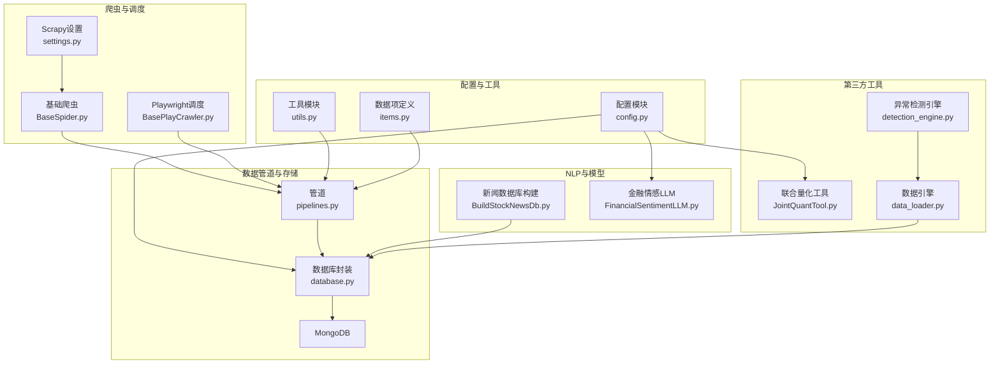
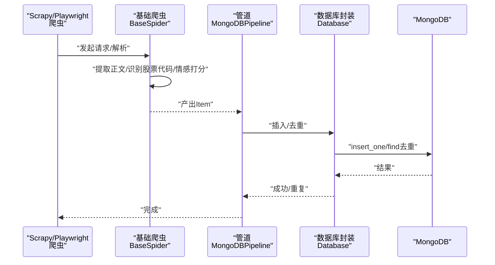
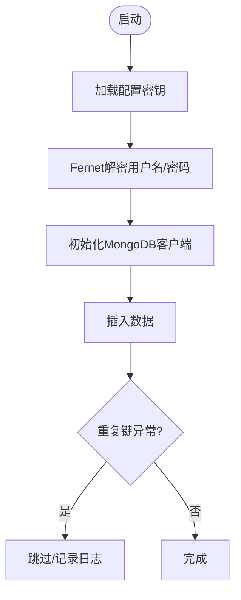
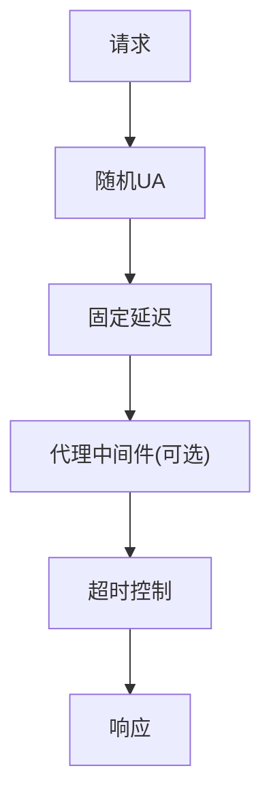
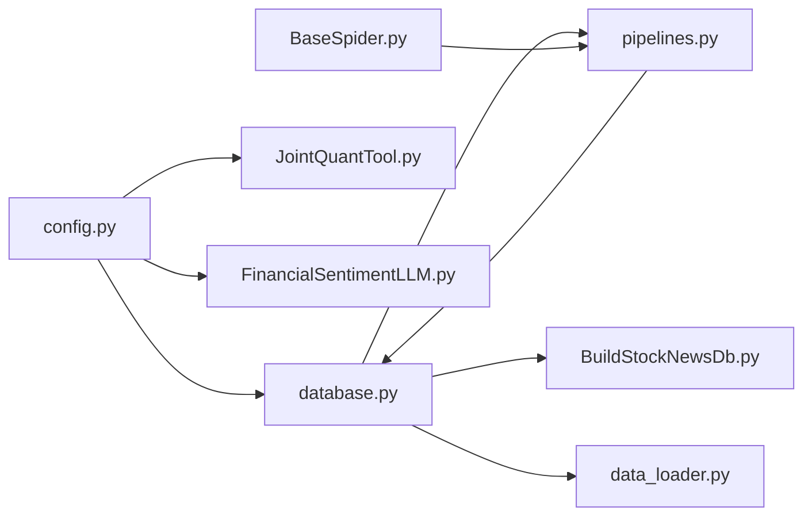

# 安全考虑

<cite>
**本文引用的文件**
- [src/Utils/config.py](file://src/Utils/config.py)
- [src/Utils/database.py](file://src/Utils/database.py)
- [src/Utils/utils.py](file://src/Utils/utils.py)
- [src/Utils/items.py](file://src/Utils/items.py)
- [src/pipelines.py](file://src/pipelines.py)
- [src/settings.py](file://src/settings.py)
- [src/MarketNewsSpiderWithScrapy/BaseSpider.py](file://src/MarketNewsSpiderWithScrapy/BaseSpider.py)
- [src/MarketNewsSpiderWithScrapy/BasePlayCrawler.py](file://src/MarketNewsSpiderWithScrapy/BasePlayCrawler.py)
- [src/MongoDbComTools/BuildStockNewsDb.py](file://src/MongoDbComTools/BuildStockNewsDb.py)
- [src/MongoDbComTools/JointQuantTool.py](file://src/MongoDbComTools/JointQuantTool.py)
- [src/NlpModel/FinancialSentimentLLM.py](file://src/NlpModel/FinancialSentimentLLM.py)
- [src/ThirdPartyToolSurpriver/data_loader.py](file://src/ThirdPartyToolSurpriver/data_loader.py)
- [src/ThirdPartyToolSurpriver/detection_engine.py](file://src/ThirdPartyToolSurpriver/detection_engine.py)
- [ProblemSolve.md](file://ProblemSolve.md)
</cite>

## 目录
1. [引言](#引言)
2. [项目结构](#项目结构)
3. [核心组件](#核心组件)
4. [架构总览](#架构总览)
5. [详细组件分析](#详细组件分析)
6. [依赖分析](#依赖分析)
7. [性能考虑](#性能考虑)
8. [故障排查指南](#故障排查指南)
9. [结论](#结论)
10. [附录](#附录)

## 引言
本文件聚焦于量化新闻爬取与文本分析系统的安全设计与实现，覆盖数据安全、加密方法、反爬虫与合规、API与访问控制、数据库安全、网络与防火墙、数据隐私与合规、安全审计与日志、漏洞预防与应急响应等主题。通过对代码库中的配置、数据库连接、爬虫设置、敏感信息处理、日志与邮件发送等模块进行系统化梳理，帮助开发者构建安全可靠的系统。

## 项目结构
项目采用模块化组织，围绕“爬虫采集—数据清洗—数据库持久化—自然语言处理—回测分析”链路展开。安全相关的关键位置包括：
- 配置与密钥：集中于配置模块，包含数据库与第三方平台的密钥加密存储与解密流程
- 数据库层：统一的数据库封装，包含重连与异常处理
- 爬虫层：Scrapy与Playwright结合，具备并发与延迟控制
- 数据管道：统一写入MongoDB，避免重复入库
- NLP与模型：金融情感分析与多模型融合，涉及本地或远端推理后端
- 第三方工具：对联合量化平台的认证与数据拉取

**图表来源**
- [src/Utils/config.py:1-455](file://src/Utils/config.py#L1-L455)
- [src/Utils/database.py:1-176](file://src/Utils/database.py#L1-L176)
- [src/Utils/utils.py:1-251](file://src/Utils/utils.py#L1-L251)
- [src/Utils/items.py:1-18](file://src/Utils/items.py#L1-L18)
- [src/pipelines.py:1-56](file://src/pipelines.py#L1-L56)
- [src/settings.py:1-49](file://src/settings.py#L1-L49)
- [src/MarketNewsSpiderWithScrapy/BaseSpider.py:1-149](file://src/MarketNewsSpiderWithScrapy/BaseSpider.py#L1-L149)
- [src/MarketNewsSpiderWithScrapy/BasePlayCrawler.py:1-120](file://src/MarketNewsSpiderWithScrapy/BasePlayCrawler.py#L1-L120)
- [src/MongoDbComTools/BuildStockNewsDb.py:1-241](file://src/MongoDbComTools/BuildStockNewsDb.py#L1-L241)
- [src/MongoDbComTools/JointQuantTool.py:1-51](file://src/MongoDbComTools/JointQuantTool.py#L1-L51)
- [src/NlpModel/FinancialSentimentLLM.py:1-167](file://src/NlpModel/FinancialSentimentLLM.py#L1-L167)
- [src/ThirdPartyToolSurpriver/data_loader.py:1-293](file://src/ThirdPartyToolSurpriver/data_loader.py#L1-L293)
- [src/ThirdPartyToolSurpriver/detection_engine.py:1-599](file://src/ThirdPartyToolSurpriver/detection_engine.py#L1-L599)

**章节来源**
- [src/Utils/config.py:1-455](file://src/Utils/config.py#L1-L455)
- [src/Utils/database.py:1-176](file://src/Utils/database.py#L1-L176)
- [src/Utils/utils.py:1-251](file://src/Utils/utils.py#L1-L251)
- [src/Utils/items.py:1-18](file://src/Utils/items.py#L1-L18)
- [src/pipelines.py:1-56](file://src/pipelines.py#L1-L56)
- [src/settings.py:1-49](file://src/settings.py#L1-L49)
- [src/MarketNewsSpiderWithScrapy/BaseSpider.py:1-149](file://src/MarketNewsSpiderWithScrapy/BaseSpider.py#L1-L149)
- [src/MarketNewsSpiderWithScrapy/BasePlayCrawler.py:1-120](file://src/MarketNewsSpiderWithScrapy/BasePlayCrawler.py#L1-L120)
- [src/MongoDbComTools/BuildStockNewsDb.py:1-241](file://src/MongoDbComTools/BuildStockNewsDb.py#L1-L241)
- [src/MongoDbComTools/JointQuantTool.py:1-51](file://src/MongoDbComTools/JointQuantTool.py#L1-L51)
- [src/NlpModel/FinancialSentimentLLM.py:1-167](file://src/NlpModel/FinancialSentimentLLM.py#L1-L167)
- [src/ThirdPartyToolSurpriver/data_loader.py:1-293](file://src/ThirdPartyToolSurpriver/data_loader.py#L1-L293)
- [src/ThirdPartyToolSurpriver/detection_engine.py:1-599](file://src/ThirdPartyToolSurpriver/detection_engine.py#L1-L599)

## 核心组件
- 配置与密钥管理：集中存放数据库与第三方平台的密钥，使用对称加密存储，运行时解密使用
- 数据库封装：统一MongoDB客户端初始化、集合操作、查询与异常重连
- 爬虫与调度：Scrapy默认设置与自定义调度器，支持并发、下载延迟、User-Agent轮换
- 数据管道：统一写入MongoDB，按来源数据库与集合分表，避免重复入库
- NLP与模型：金融情感分析，支持GPU/CPU/本地Ollama三种推理后端
- 第三方工具：联合量化平台认证与数据拉取，同样采用加密存储与解密

**章节来源**
- [src/Utils/config.py:25-50](file://src/Utils/config.py#L25-L50)
- [src/Utils/database.py:36-100](file://src/Utils/database.py#L36-L100)
- [src/settings.py:18-30](file://src/settings.py#L18-L30)
- [src/pipelines.py:8-56](file://src/pipelines.py#L8-L56)
- [src/NlpModel/FinancialSentimentLLM.py:19-106](file://src/NlpModel/FinancialSentimentLLM.py#L19-L106)
- [src/MongoDbComTools/JointQuantTool.py:11-35](file://src/MongoDbComTools/JointQuantTool.py#L11-L35)

## 架构总览
下图展示从爬虫到数据库的端到端流程，以及关键安全控制点（加密、重连、去重、日志）：

**图表来源**
- [src/MarketNewsSpiderWithScrapy/BaseSpider.py:41-98](file://src/MarketNewsSpiderWithScrapy/BaseSpider.py#L41-L98)
- [src/pipelines.py:25-56](file://src/pipelines.py#L25-L56)
- [src/Utils/database.py:78-88](file://src/Utils/database.py#L78-L88)

**章节来源**
- [src/MarketNewsSpiderWithScrapy/BaseSpider.py:1-149](file://src/MarketNewsSpiderWithScrapy/BaseSpider.py#L1-L149)
- [src/pipelines.py:1-56](file://src/pipelines.py#L1-L56)
- [src/Utils/database.py:1-176](file://src/Utils/database.py#L1-L176)

## 详细组件分析

### 数据库安全与加密
- 对称加密存储：数据库用户名与密码以密文形式存储于配置模块，运行时通过Fernet解密后使用
- 客户端初始化：MongoDB客户端未启用用户名/密码与特定认证机制，建议在生产环境启用认证与TLS
- 自动重连：封装了指数退避的自动重连装饰器，提升稳定性
- 插入与去重：管道层捕获重复键异常，避免重复入库

**图表来源**
- [src/Utils/database.py:44-60](file://src/Utils/database.py#L44-L60)
- [src/Utils/database.py:78-88](file://src/Utils/database.py#L78-L88)
- [src/pipelines.py:48-56](file://src/pipelines.py#L48-L56)

**章节来源**
- [src/Utils/config.py:25-50](file://src/Utils/config.py#L25-L50)
- [src/Utils/database.py:15-60](file://src/Utils/database.py#L15-L60)
- [src/Utils/database.py:94-100](file://src/Utils/database.py#L94-L100)
- [src/pipelines.py:48-56](file://src/pipelines.py#L48-L56)

### 爬取行为的合规性与反爬虫防护
- robots.txt：显式关闭遵循robots.txt，需谨慎评估合规风险
- 下载延迟与并发：设置较低并发与固定延迟，降低对目标站点的压力
- User-Agent轮换：内置多UA列表，随机选择，减少被识别为脚本的风险
- Cookie禁用：避免状态化追踪
- 代理中间件：保留HTTP代理中间件入口，便于扩展代理池
- Playwright调度：统一上下文与独立会话，减少Cookie干扰

**图表来源**
- [src/settings.py:11-30](file://src/settings.py#L11-L30)
- [src/settings.py:36-47](file://src/settings.py#L36-L47)
- [src/MarketNewsSpiderWithScrapy/BasePlayCrawler.py:71-74](file://src/MarketNewsSpiderWithScrapy/BasePlayCrawler.py#L71-L74)

**章节来源**
- [src/settings.py:11-30](file://src/settings.py#L11-L30)
- [src/settings.py:36-47](file://src/settings.py#L36-L47)
- [src/MarketNewsSpiderWithScrapy/BasePlayCrawler.py:21-120](file://src/MarketNewsSpiderWithScrapy/BasePlayCrawler.py#L21-L120)

### API接口与访问控制
- 当前代码库未见显式的Web API接口或访问控制逻辑
- 若未来引入API，建议：
  - 使用HTTPS/TLS
  - 实施速率限制与IP白名单
  - 引入鉴权（如JWT/OAuth）与最小权限原则
  - 对输入参数进行严格校验与过滤

[本节为概念性指导，无需代码引用]

### 数据隐私与合规
- 敏感信息加密：数据库与第三方平台账号均采用对称加密存储
- 日志与邮件：日志记录与邮件发送功能存在，需确保不泄露敏感内容
- 爬虫合规：robots.txt关闭与低并发策略需结合目标站点条款审慎使用

**章节来源**
- [src/Utils/config.py:25-50](file://src/Utils/config.py#L25-L50)
- [src/Utils/utils.py:30-58](file://src/Utils/utils.py#L30-L58)

### 安全审计与日志记录
- 统一日志格式：设置基础日志级别与格式，便于审计
- 错误与警告：数据库查询无结果时记录警告，便于定位问题
- 邮件通知：封装邮件发送函数，可用于告警场景

**章节来源**
- [src/Utils/utils.py:18-27](file://src/Utils/utils.py#L18-L27)
- [src/Utils/database.py:142-147](file://src/Utils/database.py#L142-L147)
- [src/Utils/utils.py:30-58](file://src/Utils/utils.py#L30-L58)

### 安全漏洞预防与应急响应
- 预防措施：
  - 密钥管理：密钥集中存储与解密，避免硬编码
  - 数据库：启用认证与TLS，限制网络访问
  - 爬虫：遵守robots.txt与服务条款，合理设置并发与延迟
  - 输入验证：对URL、标题、正文等进行清洗与长度限制
- 应急响应：
  - 发生重复入库：捕获重复键异常并跳过
  - 数据库断连：自动重连与指数退避
  - 日志与告警：通过日志与邮件通知快速定位问题

**章节来源**
- [src/Utils/config.py:25-50](file://src/Utils/config.py#L25-L50)
- [src/Utils/database.py:15-33](file://src/Utils/database.py#L15-L33)
- [src/pipelines.py:53-55](file://src/pipelines.py#L53-L55)

## 依赖分析
- 配置模块被数据库封装、联合量化工具、NLP模块广泛依赖
- 数据库封装被管道、本地工具、数据引擎等模块复用
- 爬虫模块依赖配置与数据项，输出至管道
- 第三方工具与数据引擎依赖数据库封装

**图表来源**
- [src/Utils/config.py:1-455](file://src/Utils/config.py#L1-L455)
- [src/Utils/database.py:1-176](file://src/Utils/database.py#L1-L176)
- [src/MongoDbComTools/JointQuantTool.py:1-51](file://src/MongoDbComTools/JointQuantTool.py#L1-L51)
- [src/NlpModel/FinancialSentimentLLM.py:1-167](file://src/NlpModel/FinancialSentimentLLM.py#L1-L167)
- [src/pipelines.py:1-56](file://src/pipelines.py#L1-L56)
- [src/MongoDbComTools/BuildStockNewsDb.py:1-241](file://src/MongoDbComTools/BuildStockNewsDb.py#L1-L241)
- [src/ThirdPartyToolSurpriver/data_loader.py:1-293](file://src/ThirdPartyToolSurpriver/data_loader.py#L1-L293)
- [src/MarketNewsSpiderWithScrapy/BaseSpider.py:1-149](file://src/MarketNewsSpiderWithScrapy/BaseSpider.py#L1-L149)

**章节来源**
- [src/Utils/config.py:1-455](file://src/Utils/config.py#L1-L455)
- [src/Utils/database.py:1-176](file://src/Utils/database.py#L1-L176)
- [src/pipelines.py:1-56](file://src/pipelines.py#L1-L56)
- [src/MarketNewsSpiderWithScrapy/BaseSpider.py:1-149](file://src/MarketNewsSpiderWithScrapy/BaseSpider.py#L1-L149)
- [src/MongoDbComTools/BuildStockNewsDb.py:1-241](file://src/MongoDbComTools/BuildStockNewsDb.py#L1-L241)
- [src/ThirdPartyToolSurpriver/data_loader.py:1-293](file://src/ThirdPartyToolSurpriver/data_loader.py#L1-L293)
- [src/MongoDbComTools/JointQuantTool.py:1-51](file://src/MongoDbComTools/JointQuantTool.py#L1-L51)
- [src/NlpModel/FinancialSentimentLLM.py:1-167](file://src/NlpModel/FinancialSentimentLLM.py#L1-L167)

## 性能考虑
- 并发与延迟：通过设置并发与下载延迟平衡吞吐与对目标站点的影响
- 自动重连：指数退避减少抖动，提升整体稳定性
- 数据库连接池：最大连接池大小参数有助于提高并发效率
- 模型推理：GPU/CPU/本地Ollama三种后端，按硬件能力选择最优方案

**章节来源**
- [src/settings.py:18-23](file://src/settings.py#L18-L23)
- [src/Utils/database.py:12-33](file://src/Utils/database.py#L12-L33)
- [src/Utils/database.py:56-58](file://src/Utils/database.py#L56-L58)
- [src/NlpModel/FinancialSentimentLLM.py:61-96](file://src/NlpModel/FinancialSentimentLLM.py#L61-L96)

## 故障排查指南
- MongoDB连接问题：检查服务器选择超时、连接池大小与自动重连配置
- 重复入库：确认去重逻辑与唯一索引，避免DuplicateKeyError
- 爬虫超时：调整下载超时与延迟，必要时启用代理
- 日志定位：利用统一日志格式与邮件告警快速定位异常

**章节来源**
- [src/Utils/database.py:12-33](file://src/Utils/database.py#L12-L33)
- [src/pipelines.py:53-55](file://src/pipelines.py#L53-L55)
- [src/settings.py:21-23](file://src/settings.py#L21-L23)
- [src/Utils/utils.py:18-27](file://src/Utils/utils.py#L18-L27)

## 结论
本项目在安全方面采取了多项基础实践：对称加密存储敏感信息、统一日志与告警、自动重连与去重、合理的爬虫并发与延迟策略。为进一步提升安全性，建议在生产环境中启用数据库认证与TLS、完善API访问控制、加强输入验证与输出脱敏，并建立完善的审计与应急响应机制。

## 附录
- MongoDB与Redis配置：本地IP与端口常量定义
- 爬虫配置：并发、延迟、UA列表、代理中间件
- 第三方平台认证：联合量化平台账号加密存储与解密

**章节来源**
- [src/Utils/config.py:13-19](file://src/Utils/config.py#L13-L19)
- [src/settings.py:18-47](file://src/settings.py#L18-L47)
- [src/MongoDbComTools/JointQuantTool.py:11-35](file://src/MongoDbComTools/JointQuantTool.py#L11-L35)