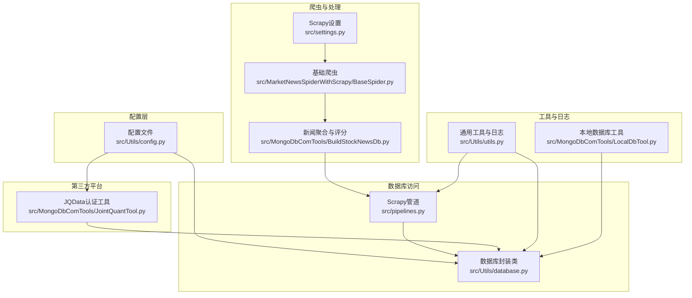
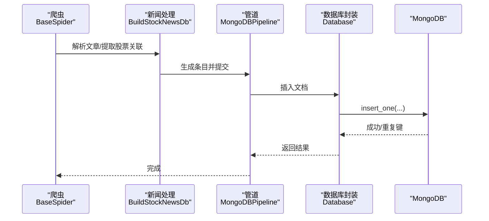
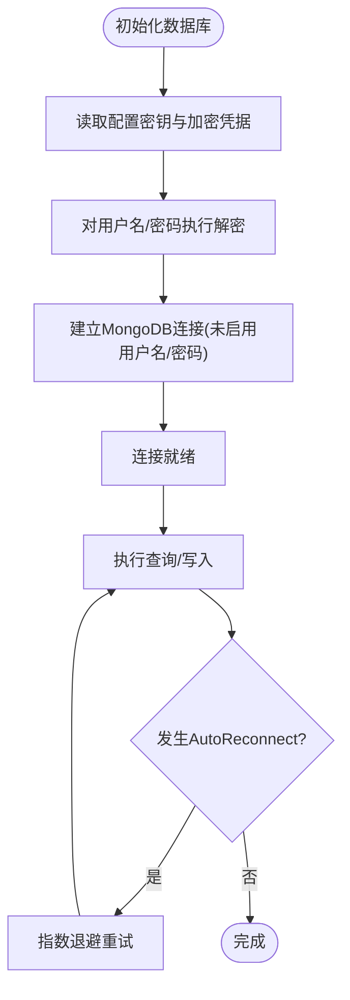
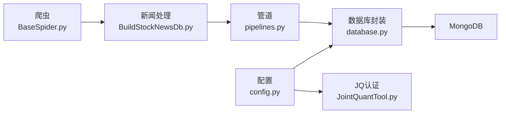

# 数据安全保护

<cite>
**本文引用的文件**
- [src/Utils/config.py](file://src/Utils/config.py)
- [src/Utils/database.py](file://src/Utils/database.py)
- [src/Utils/utils.py](file://src/Utils/utils.py)
- [src/MongoDbComTools/JointQuantTool.py](file://src/MongoDbComTools/JointQuantTool.py)
- [src/MongoDbComTools/LocalDbTool.py](file://src/MongoDbComTools/LocalDbTool.py)
- [src/MongoDbComTools/BuildStockNewsDb.py](file://src/MongoDbComTools/BuildStockNewsDb.py)
- [src/pipelines.py](file://src/pipelines.py)
- [src/settings.py](file://src/settings.py)
- [src/MarketNewsSpiderWithScrapy/BaseSpider.py](file://src/MarketNewsSpiderWithScrapy/BaseSpider.py)
</cite>

## 目录
1. [引言](#引言)
2. [项目结构](#项目结构)
3. [核心组件](#核心组件)
4. [架构总览](#架构总览)
5. [详细组件分析](#详细组件分析)
6. [依赖分析](#依赖分析)
7. [性能考虑](#性能考虑)
8. [故障排查指南](#故障排查指南)
9. [结论](#结论)
10. [附录](#附录)

## 引言
本文件面向开发者与运维人员，围绕数据安全保护目标，系统梳理本仓库在数据库连接、凭据加密、数据传输、备份恢复、完整性校验、访问审计、生命周期管理与泄露应急等方面的现状与改进建议。文档基于仓库现有实现进行分析，并提供可操作的加固建议与最佳实践。

## 项目结构
该项目采用模块化组织，围绕“爬虫采集 -> 数据处理 -> 存储入库”的流程展开。与数据安全直接相关的模块包括：
- 配置与密钥：集中于配置文件，包含数据库与第三方平台的加密凭据
- 数据库访问：统一的数据库封装类，负责连接、查询与写入
- 爬虫与管道：Scrapy爬虫将解析后的条目写入MongoDB
- 第三方平台认证：对JQData等外部平台的账号密码进行加密存储与解密使用
- 工具与日志：通用工具函数与日志配置

图表来源
- [src/Utils/config.py:1-455](file://src/Utils/config.py#L1-L455)
- [src/Utils/database.py:1-176](file://src/Utils/database.py#L1-L176)
- [src/pipelines.py:1-56](file://src/pipelines.py#L1-L56)
- [src/settings.py:1-49](file://src/settings.py#L1-L49)
- [src/MongoDbComTools/JointQuantTool.py:1-51](file://src/MongoDbComTools/JointQuantTool.py#L1-L51)
- [src/MongoDbComTools/BuildStockNewsDb.py:1-241](file://src/MongoDbComTools/BuildStockNewsDb.py#L1-L241)
- [src/MarketNewsSpiderWithScrapy/BaseSpider.py:1-149](file://src/MarketNewsSpiderWithScrapy/BaseSpider.py#L1-L149)
- [src/Utils/utils.py:1-251](file://src/Utils/utils.py#L1-L251)
- [src/MongoDbComTools/LocalDbTool.py:1-288](file://src/MongoDbComTools/LocalDbTool.py#L1-L288)

章节来源
- [src/Utils/config.py:1-455](file://src/Utils/config.py#L1-L455)
- [src/Utils/database.py:1-176](file://src/Utils/database.py#L1-L176)
- [src/pipelines.py:1-56](file://src/pipelines.py#L1-L56)
- [src/settings.py:1-49](file://src/settings.py#L1-L49)
- [src/MongoDbComTools/JointQuantTool.py:1-51](file://src/MongoDbComTools/JointQuantTool.py#L1-L51)
- [src/MongoDbComTools/BuildStockNewsDb.py:1-241](file://src/MongoDbComTools/BuildStockNewsDb.py#L1-L241)
- [src/MarketNewsSpiderWithScrapy/BaseSpider.py:1-149](file://src/MarketNewsSpiderWithScrapy/BaseSpider.py#L1-L149)
- [src/Utils/utils.py:1-251](file://src/Utils/utils.py#L1-L251)
- [src/MongoDbComTools/LocalDbTool.py:1-288](file://src/MongoDbComTools/LocalDbTool.py#L1-L288)

## 核心组件
- 配置与密钥管理
  - 统一密钥常量与数据库/平台凭据均以加密形式存储，运行时通过对称加密算法解密后使用
  - 关键位置：配置文件中的密钥与加密凭据；数据库连接初始化处解密使用
- 数据库访问封装
  - 提供连接、查询、插入、更新、自动重连等能力；默认未启用用户名/密码与认证机制参数
- 爬虫与数据管道
  - Scrapy爬虫解析内容，生成标准化条目，通过管道写入MongoDB，避免重复写入
- 第三方平台认证
  - 对JQData账号密码进行加密存储与解密使用，确保明文不出库

章节来源
- [src/Utils/config.py:24-26](file://src/Utils/config.py#L24-L26)
- [src/Utils/database.py:44-60](file://src/Utils/database.py#L44-L60)
- [src/pipelines.py:8-56](file://src/pipelines.py#L8-L56)
- [src/MongoDbComTools/JointQuantTool.py:11-34](file://src/MongoDbComTools/JointQuantTool.py#L11-L34)

## 架构总览
下图展示从爬取到入库的关键路径与安全控制点：

图表来源
- [src/MarketNewsSpiderWithScrapy/BaseSpider.py:41-98](file://src/MarketNewsSpiderWithScrapy/BaseSpider.py#L41-L98)
- [src/MongoDbComTools/BuildStockNewsDb.py:67-134](file://src/MongoDbComTools/BuildStockNewsDb.py#L67-L134)
- [src/pipelines.py:25-56](file://src/pipelines.py#L25-L56)
- [src/Utils/database.py:78-81](file://src/Utils/database.py#L78-L81)

## 详细组件分析

### 数据库连接与凭据加密
- 凭据存储
  - 配置文件中定义对称加密密钥与加密后的数据库用户名、密码
  - 数据库连接初始化时使用对称加密算法解密，再建立连接
- 连接参数
  - 当前连接未显式设置用户名/密码与认证机制参数，仅设置了超时与连接池上限
- 自动重连
  - 包装查询函数，支持指数退避的自动重连与警告日志

图表来源
- [src/Utils/database.py:44-60](file://src/Utils/database.py#L44-L60)
- [src/Utils/database.py:94-172](file://src/Utils/database.py#L94-L172)
- [src/Utils/config.py:24-26](file://src/Utils/config.py#L24-L26)

章节来源
- [src/Utils/config.py:24-26](file://src/Utils/config.py#L24-L26)
- [src/Utils/database.py:44-60](file://src/Utils/database.py#L44-L60)
- [src/Utils/database.py:94-172](file://src/Utils/database.py#L94-L172)

### 敏感数据的存储保护（数据库凭据）
- 现状
  - 数据库凭据以加密形式存储于配置文件，运行时解密后用于连接
- 建议
  - 使用环境变量或密钥管理服务（如KMS）注入密钥与凭据，避免将任何密文硬编码在仓库中
  - 对加密密钥实施最小权限与轮换策略，定期更换并清理旧密钥

章节来源
- [src/Utils/config.py:24-26](file://src/Utils/config.py#L24-L26)
- [src/Utils/database.py:44-60](file://src/Utils/database.py#L44-L60)

### 数据传输安全与TLS配置
- 现状
  - 爬虫请求使用HTTP/HTTPS，部分站点已升级至HTTPS
  - 数据库连接未启用TLS/SSL参数
- 建议
  - 对数据库连接启用TLS/SSL（如使用URI参数或连接选项），并校验证书链
  - 确保网络出口与中间节点满足合规要求，必要时部署内网隔离与专线

章节来源
- [src/Utils/config.py:195-206](file://src/Utils/config.py#L195-L206)
- [src/Utils/database.py:50-58](file://src/Utils/database.py#L50-L58)

### 数据完整性与防篡改
- 现状
  - 写入时使用MD5作为文档主键，降低重复写入风险
  - 未见数据库层面的字段级完整性校验或签名机制
- 建议
  - 引入哈希链或数字签名对关键字段进行完整性保护
  - 在应用层对重要变更增加审计日志与版本号字段

章节来源
- [src/MarketNewsSpiderWithScrapy/BaseSpider.py:86-88](file://src/MarketNewsSpiderWithScrapy/BaseSpider.py#L86-L88)
- [src/MarketPriceSpiderWithScrapy/StockInfoSpyder.py:208-212](file://src/MarketPriceSpiderWithScrapy/StockInfoSpyder.py#L208-L212)

### 数据访问日志与审计
- 现状
  - 日志级别为INFO，部分模块使用全局日志记录器
  - 管道与数据库封装存在日志输出
- 建议
  - 将敏感操作（认证、写入、删除、批量更新）纳入审计日志
  - 结合统一日志收集与告警系统，实现异常行为检测

章节来源
- [src/Utils/utils.py:18-27](file://src/Utils/utils.py#L18-L27)
- [src/pipelines.py:48-56](file://src/pipelines.py#L48-L56)
- [src/Utils/database.py:15-33](file://src/Utils/database.py#L15-L33)

### 数据备份与恢复策略
- 现状
  - 未发现专用备份脚本或自动化备份流程
- 建议
  - 使用MongoDB官方工具进行周期性全量/增量备份
  - 备份数据加密存储与异地容灾，制定恢复演练计划

[本节为通用建议，无需特定文件引用]

### 数据生命周期管理与销毁
- 现状
  - 未见明确的数据保留策略与自动清理逻辑
- 建议
  - 设定按主题/时间维度的保留期限，到期后安全擦除
  - 对日志与临时数据实施分级管理与定期清理

[本节为通用建议，无需特定文件引用]

### 泄露防护与应急响应
- 现状
  - 部分凭据以明文方式出现在日志中（示例：邮件发送模块的密码）
- 建议
  - 禁止在日志中输出敏感信息；使用占位符或脱敏
  - 建立事件分级、处置流程与复盘机制

章节来源
- [src/Utils/utils.py:30-58](file://src/Utils/utils.py#L30-L58)

## 依赖分析
- 组件耦合
  - 管道依赖数据库封装；爬虫依赖新闻处理模块；第三方工具依赖配置密钥
- 外部依赖
  - MongoDB、Scrapy、第三方金融数据接口
- 潜在风险
  - 配置文件中硬编码密钥与凭据；数据库连接未启用认证与TLS

图表来源
- [src/Utils/config.py:1-455](file://src/Utils/config.py#L1-L455)
- [src/Utils/database.py:1-176](file://src/Utils/database.py#L1-L176)
- [src/pipelines.py:1-56](file://src/pipelines.py#L1-L56)
- [src/MongoDbComTools/JointQuantTool.py:1-51](file://src/MongoDbComTools/JointQuantTool.py#L1-L51)
- [src/MongoDbComTools/BuildStockNewsDb.py:1-241](file://src/MongoDbComTools/BuildStockNewsDb.py#L1-L241)
- [src/MarketNewsSpiderWithScrapy/BaseSpider.py:1-149](file://src/MarketNewsSpiderWithScrapy/BaseSpider.py#L1-L149)

章节来源
- [src/Utils/config.py:1-455](file://src/Utils/config.py#L1-L455)
- [src/Utils/database.py:1-176](file://src/Utils/database.py#L1-L176)
- [src/pipelines.py:1-56](file://src/pipelines.py#L1-L56)
- [src/MongoDbComTools/JointQuantTool.py:1-51](file://src/MongoDbComTools/JointQuantTool.py#L1-L51)
- [src/MongoDbComTools/BuildStockNewsDb.py:1-241](file://src/MongoDbComTools/BuildStockNewsDb.py#L1-L241)
- [src/MarketNewsSpiderWithScrapy/BaseSpider.py:1-149](file://src/MarketNewsSpiderWithScrapy/BaseSpider.py#L1-L149)

## 性能考虑
- 连接池与超时
  - 设置最大连接池大小与服务器选择超时，有助于提升并发稳定性
- 自动重连退避
  - 指数退避减少瞬时抖动对系统的影响
- 爬取并发与延迟
  - 合理设置并发与下载延迟，避免对目标站点造成压力

章节来源
- [src/Utils/database.py:12-33](file://src/Utils/database.py#L12-L33)
- [src/Utils/database.py:56-58](file://src/Utils/database.py#L56-L58)
- [src/settings.py:18-23](file://src/settings.py#L18-L23)

## 故障排查指南
- 连接问题
  - 观察自动重连日志与退避等待时间，确认网络与MongoDB实例状态
- 写入冲突
  - 管道对重复键进行忽略处理；若出现数据缺失，检查唯一键与MD5生成逻辑
- 认证失败
  - 若启用用户名/密码与认证机制，请核对解密流程与连接参数
- 日志与告警
  - 使用统一日志收集，定位异常请求与错误堆栈

章节来源
- [src/Utils/database.py:15-33](file://src/Utils/database.py#L15-L33)
- [src/pipelines.py:48-56](file://src/pipelines.py#L48-L56)
- [src/Utils/utils.py:18-27](file://src/Utils/utils.py#L18-L27)

## 结论
本项目在数据安全方面已具备基础的凭据加密与重复写入防护能力，但在数据库认证、TLS传输、审计日志、备份恢复与生命周期管理等方面仍有较大改进空间。建议优先落实凭据外置、TLS启用、审计增强与备份演练，逐步引入完整性校验与防篡改机制，形成闭环的安全体系。

## 附录
- 最佳实践清单
  - 将密钥与凭据迁移到密钥管理服务或环境变量
  - 为数据库连接启用TLS与认证
  - 增加审计日志与异常告警
  - 制定备份策略与恢复演练计划
  - 实施数据保留与销毁策略
  - 对日志输出进行敏感信息脱敏