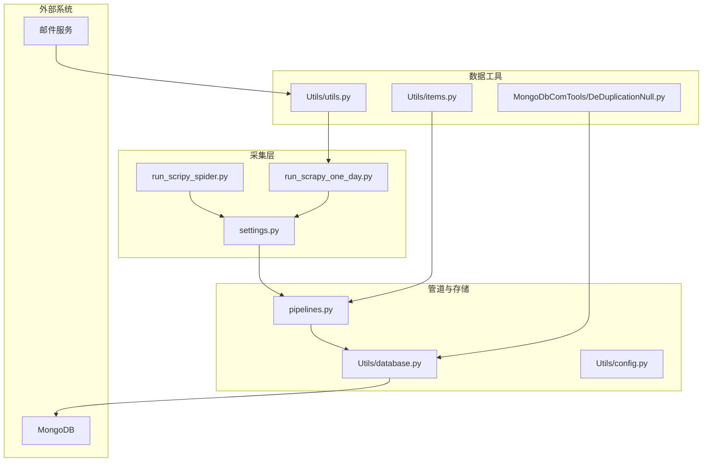
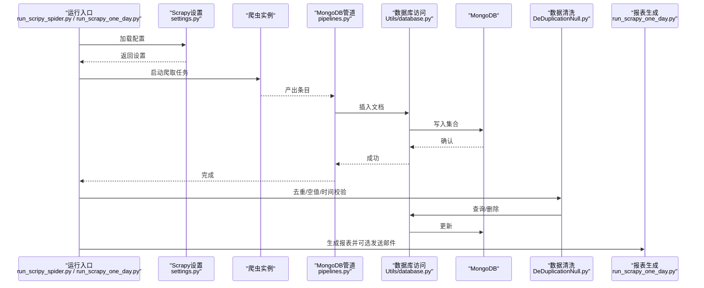
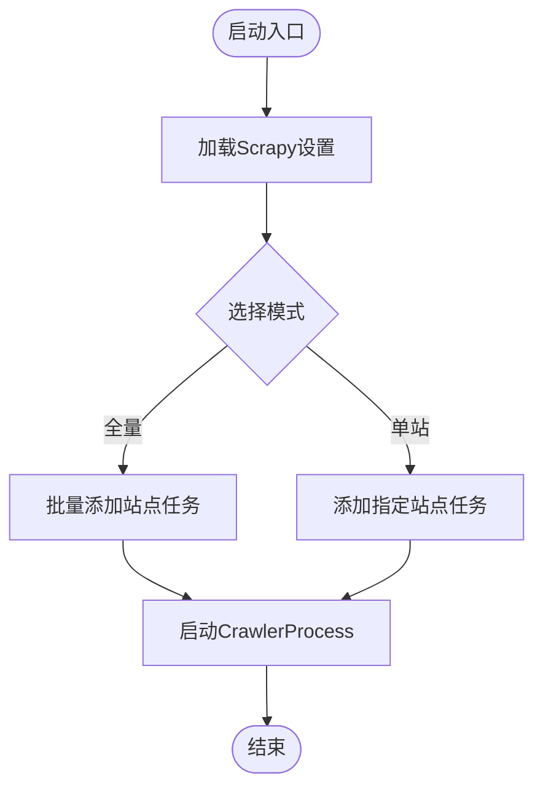
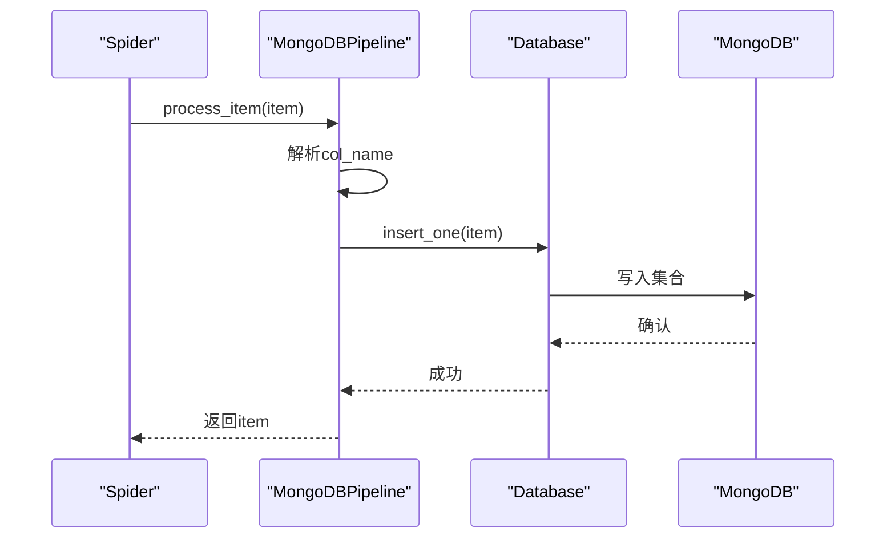
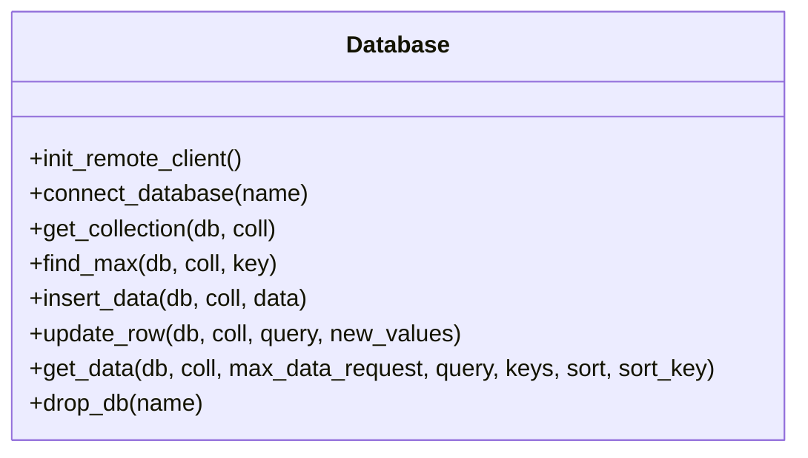
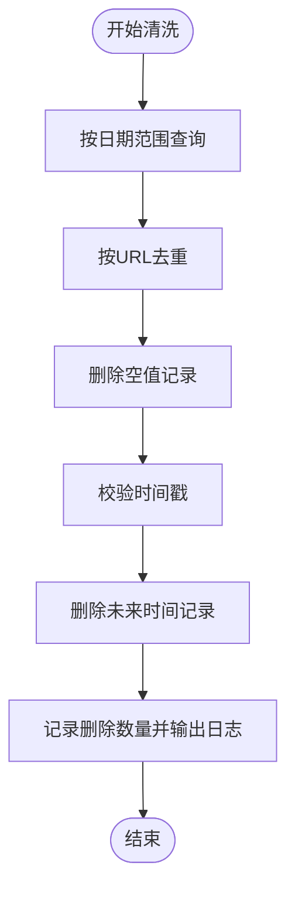
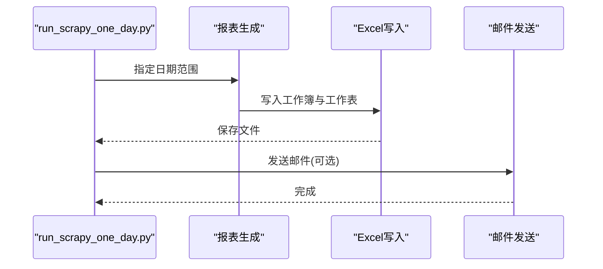
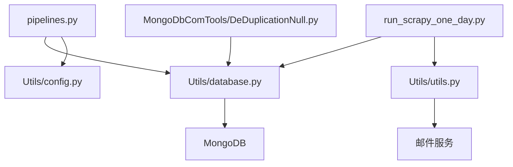
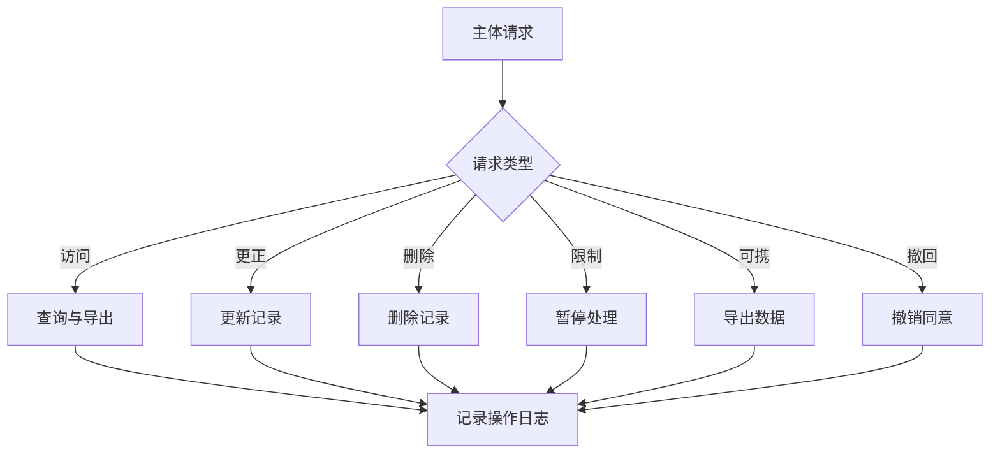

# 数据隐私与合规

<cite>
**本文引用的文件**
- [README.md](file://README.md)
- [ProblemSolve.md](file://ProblemSolve.md)
- [src/Utils/config.py](file://src/Utils/config.py)
- [src/Utils/database.py](file://src/Utils/database.py)
- [src/Utils/items.py](file://src/Utils/items.py)
- [src/Utils/utils.py](file://src/Utils/utils.py)
- [src/settings.py](file://src/settings.py)
- [src/pipelines.py](file://src/pipelines.py)
- [src/run_scripy_spider.py](file://src/run_scripy_spider.py)
- [src/run_scrapy_one_day.py](file://src/run_scrapy_one_day.py)
- [src/MongoDbComTools/DeDuplicationNull.py](file://src/MongoDbComTools/DeDuplicationNull.py)
- [src/MarketPriceSpiderWithScrapy/StockInfoSpyder.py](file://src/MarketPriceSpiderWithScrapy/StockInfoSpyder.py)
- [src/MongoDbComTools/LocalDbTool.py](file://src/MongoDbComTools/LocalDbTool.py)
- [src/info/finance_dict.txt](file://src/info/finance_dict.txt)
- [src/info/finance_dict_weight.txt](file://src/info/finance_dict_weight.txt)
</cite>

## 目录
1. [引言](#引言)
2. [项目结构](#项目结构)
3. [核心组件](#核心组件)
4. [架构总览](#架构总览)
5. [详细组件分析](#详细组件分析)
6. [依赖分析](#依赖分析)
7. [性能考虑](#性能考虑)
8. [故障排查指南](#故障排查指南)
9. [结论](#结论)
10. [附录](#附录)

## 引言
本文件面向开发者与数据处理系统建设者，围绕数据隐私与合规主题，结合仓库中的数据采集、存储与处理流程，系统阐述以下内容：
- 面向GDPR、CCPA等数据保护法规的合规要点与落地实践
- 数据主体权利的实现路径与处理流程
- 数据最小化与目的限制原则在系统中的应用
- 数据处理协议与合规声明的编写模板与落地方案
- 数据泄露通知与影响评估程序
- 数据跨境传输的合规要求与安全措施
- 数据保留期限与销毁政策
- 隐私影响评估与合规审计方法
- 数据保护官的职责与组织架构建议
- 如何在现有代码基础上构建符合法规要求的数据处理系统

本文件严格依据仓库中实际存在的文件与实现进行分析，避免虚构或臆测。

## 项目结构
该项目是一个以Scrapy为核心的股票新闻采集与文本分析系统，数据采集后通过管道写入MongoDB，随后进行去重、清洗与报表生成。整体结构如下：

图示来源
- [src/run_scripy_spider.py:117-142](file://src/run_scripy_spider.py#L117-L142)
- [src/run_scrapy_one_day.py:32-80](file://src/run_scrapy_one_day.py#L32-L80)
- [src/settings.py:32-34](file://src/settings.py#L32-L34)
- [src/pipelines.py:8-46](file://src/pipelines.py#L8-L46)
- [src/Utils/database.py:36-76](file://src/Utils/database.py#L36-L76)
- [src/Utils/config.py:39-50](file://src/Utils/config.py#L39-L50)
- [src/MongoDbComTools/DeDuplicationNull.py:15-62](file://src/MongoDbComTools/DeDuplicationNull.py#L15-L62)
- [src/Utils/utils.py:30-58](file://src/Utils/utils.py#L30-L58)

章节来源
- [README.md:1-33](file://README.md#L1-L33)
- [src/run_scripy_spider.py:117-142](file://src/run_scripy_spider.py#L117-L142)
- [src/run_scrapy_one_day.py:32-80](file://src/run_scrapy_one_day.py#L32-L80)
- [src/settings.py:32-34](file://src/settings.py#L32-L34)
- [src/pipelines.py:8-46](file://src/pipelines.py#L8-L46)
- [src/Utils/database.py:36-76](file://src/Utils/database.py#L36-L76)
- [src/Utils/config.py:39-50](file://src/Utils/config.py#L39-L50)
- [src/MongoDbComTools/DeDuplicationNull.py:15-62](file://src/MongoDbComTools/DeDuplicationNull.py#L15-L62)
- [src/Utils/utils.py:30-58](file://src/Utils/utils.py#L30-L58)

## 核心组件
- 配置中心：集中管理数据库地址、集合名称、爬虫任务清单等，便于统一治理与变更控制。
- 数据库访问层：封装MongoDB连接、重连机制、查询与写入逻辑，确保稳定性与一致性。
- 管道层：负责将Scrapy产出的条目写入对应数据库与集合，实现按来源站点的归档。
- 工具层：提供邮件发送、日期计算、停用词加载等通用能力，支撑报表与运维。
- 数据清洗与去重：对采集数据进行去重、空值剔除、异常时间戳清理，保障数据质量。
- 报表与导出：按日期范围聚合新闻，生成Excel报表并可选发送邮件。

章节来源
- [src/Utils/config.py:39-50](file://src/Utils/config.py#L39-L50)
- [src/Utils/database.py:36-76](file://src/Utils/database.py#L36-L76)
- [src/pipelines.py:8-46](file://src/pipelines.py#L8-L46)
- [src/Utils/utils.py:30-58](file://src/Utils/utils.py#L30-L58)
- [src/MongoDbComTools/DeDuplicationNull.py:15-62](file://src/MongoDbComTools/DeDuplicationNull.py#L15-L62)

## 架构总览
系统采用“采集-管道-存储-清洗-报表”的链路，数据从多个新闻站点采集，经Scrapy调度，通过MongoDBPipeline写入数据库，再由数据工具进行清洗与报表生成。整体流程如下：

图示来源
- [src/run_scripy_spider.py:117-142](file://src/run_scripy_spider.py#L117-L142)
- [src/run_scrapy_one_day.py:32-80](file://src/run_scrapy_one_day.py#L32-L80)
- [src/settings.py:32-34](file://src/settings.py#L32-L34)
- [src/pipelines.py:25-46](file://src/pipelines.py#L25-L46)
- [src/Utils/database.py:78-88](file://src/Utils/database.py#L78-L88)
- [src/MongoDbComTools/DeDuplicationNull.py:22-62](file://src/MongoDbComTools/DeDuplicationNull.py#L22-L62)
- [src/Utils/utils.py:30-58](file://src/Utils/utils.py#L30-L58)

## 详细组件分析

### 组件A：数据采集与调度
- 运行入口支持全量与按站点运行，统一通过Scrapy进程启动。
- 支持Playwright与Scrapy两类爬虫，分别处理不同站点特性。
- 通过配置中心集中管理各站点的数据库与集合命名。

图示来源
- [src/run_scripy_spider.py:117-142](file://src/run_scripy_spider.py#L117-L142)
- [src/run_scrapy_one_day.py:43-79](file://src/run_scrapy_one_day.py#L43-L79)
- [src/settings.py:32-34](file://src/settings.py#L32-L34)

章节来源
- [src/run_scripy_spider.py:117-142](file://src/run_scripy_spider.py#L117-L142)
- [src/run_scrapy_one_day.py:43-79](file://src/run_scrapy_one_day.py#L43-L79)
- [src/settings.py:32-34](file://src/settings.py#L32-L34)

### 组件B：数据管道与存储
- 管道根据爬虫名称将条目写入对应的数据库与集合。
- 使用MongoDB的插入接口，忽略重复键冲突，避免重复入库。
- 配合配置中心的数据库与集合命名，实现多站点隔离存储。

图示来源
- [src/pipelines.py:25-46](file://src/pipelines.py#L25-L46)
- [src/Utils/database.py:78-88](file://src/Utils/database.py#L78-L88)
- [src/Utils/config.py:55-65](file://src/Utils/config.py#L55-L65)

章节来源
- [src/pipelines.py:8-46](file://src/pipelines.py#L8-L46)
- [src/Utils/database.py:78-88](file://src/Utils/database.py#L78-L88)
- [src/Utils/config.py:55-65](file://src/Utils/config.py#L55-L65)

### 组件C：数据库访问与连接
- 提供自动重连装饰器，指数退避重试，提升网络抖动下的稳定性。
- 封装连接初始化、集合获取、查询与写入等常用操作。
- 通过配置中心读取主机、端口等参数，支持远程连接。

图示来源
- [src/Utils/database.py:36-176](file://src/Utils/database.py#L36-L176)
- [src/Utils/config.py:13-16](file://src/Utils/config.py#L13-L16)

章节来源
- [src/Utils/database.py:36-176](file://src/Utils/database.py#L36-L176)
- [src/Utils/config.py:13-16](file://src/Utils/config.py#L13-L16)

### 组件D：数据清洗与质量控制
- 去重：按URL字段进行去重，删除重复ID，降低冗余。
- 空值清理：删除缺失关键字段的记录，保证后续分析可用性。
- 时间校验：删除未来时间戳，防止异常数据污染分析。

图示来源
- [src/MongoDbComTools/DeDuplicationNull.py:22-62](file://src/MongoDbComTools/DeDuplicationNull.py#L22-L62)

章节来源
- [src/MongoDbComTools/DeDuplicationNull.py:15-62](file://src/MongoDbComTools/DeDuplicationNull.py#L15-L62)

### 组件E：报表生成与邮件发送
- 按日期范围聚合新闻，生成Excel报表，包含标题、正文、日期、分类、情感标签、分数、链接等。
- 可选发送邮件，支持附件与收件人配置。

图示来源
- [src/run_scrapy_one_day.py:81-194](file://src/run_scrapy_one_day.py#L81-L194)
- [src/Utils/utils.py:30-58](file://src/Utils/utils.py#L30-L58)

章节来源
- [src/run_scrapy_one_day.py:81-194](file://src/run_scrapy_one_day.py#L81-L194)
- [src/Utils/utils.py:30-58](file://src/Utils/utils.py#L30-L58)

## 依赖分析
- 组件耦合关系
  - 管道依赖数据库访问层与配置中心。
  - 报表生成依赖数据库访问层与工具层。
  - 数据清洗独立于采集与报表，通过数据库访问层读写。
- 外部依赖
  - MongoDB：作为主存储，承载新闻数据与基础信息。
  - 邮件服务：用于报表发送，需遵循邮件传输安全规范。

图示来源
- [src/pipelines.py:8-22](file://src/pipelines.py#L8-L22)
- [src/Utils/database.py:36-60](file://src/Utils/database.py#L36-L60)
- [src/Utils/config.py:39-50](file://src/Utils/config.py#L39-L50)
- [src/run_scrapy_one_day.py:81-194](file://src/run_scrapy_one_day.py#L81-L194)
- [src/Utils/utils.py:30-58](file://src/Utils/utils.py#L30-L58)
- [src/MongoDbComTools/DeDuplicationNull.py:15-28](file://src/MongoDbComTools/DeDuplicationNull.py#L15-L28)

章节来源
- [src/pipelines.py:8-22](file://src/pipelines.py#L8-L22)
- [src/Utils/database.py:36-60](file://src/Utils/database.py#L36-L60)
- [src/Utils/config.py:39-50](file://src/Utils/config.py#L39-L50)
- [src/run_scrapy_one_day.py:81-194](file://src/run_scrapy_one_day.py#L81-L194)
- [src/Utils/utils.py:30-58](file://src/Utils/utils.py#L30-L58)
- [src/MongoDbComTools/DeDuplicationNull.py:15-28](file://src/MongoDbComTools/DeDuplicationNull.py#L15-L28)

## 性能考虑
- 连接池与重连
  - 数据库访问层启用最大连接池与自动重连装饰器，指数退避重试，降低网络抖动对吞吐的影响。
- 并发与延迟
  - Scrapy设置中并发请求与下载延迟可调，建议在满足目标站点速率限制的前提下适度提升并发以提高采集效率。
- 查询与写入
  - 管道写入使用单条插入，避免重复键冲突；清洗阶段按日期范围批处理，减少全表扫描。
- 存储与索引
  - 建议在URL、Date等高频查询字段建立索引，提升去重与查询性能。

章节来源
- [src/Utils/database.py:15-33](file://src/Utils/database.py#L15-L33)
- [src/settings.py:18-23](file://src/settings.py#L18-L23)
- [src/MongoDbComTools/DeDuplicationNull.py:36-54](file://src/MongoDbComTools/DeDuplicationNull.py#L36-L54)

## 故障排查指南
- MongoDB连接与权限
  - 若出现连接失败，检查主机、端口与认证配置；参考问题解决文档中的MongoDB安装与权限配置提示。
- 文件句柄限制
  - macOS上可能出现“打开文件过多”，可通过调整系统限制或优化连接池大小缓解。
- 邮件发送失败
  - 检查SMTP服务器、账号密码与附件路径；确认网络可达与安全策略允许。
- 数据重复与空值
  - 使用数据清洗模块进行去重与空值清理；关注日志输出的删除数量。

章节来源
- [ProblemSolve.md:18-35](file://ProblemSolve.md#L18-L35)
- [ProblemSolve.md:37-41](file://ProblemSolve.md#L37-L41)
- [src/Utils/utils.py:30-58](file://src/Utils/utils.py#L30-L58)
- [src/MongoDbComTools/DeDuplicationNull.py:50-88](file://src/MongoDbComTools/DeDuplicationNull.py#L50-L88)

## 结论
本项目已具备较为完整的数据采集、存储与清洗能力，能够支撑新闻数据的自动化处理与报表生成。为满足数据隐私与合规要求，建议在现有实现基础上补充以下机制：
- 明确数据处理协议与合规声明，覆盖数据类型、处理目的、保留期限与主体权利实现路径
- 建立数据泄露通知与影响评估程序，明确触发条件与处置流程
- 对跨境传输场景制定安全措施与法律依据
- 实施数据最小化与目的限制，严格控制字段与范围
- 设立数据保护官角色与组织架构，明确职责与汇报路径
- 将隐私设计纳入开发流程，贯穿需求、设计、开发与测试环节

## 附录

### A. 数据主体权利实现与处理流程
- 访问权：通过查询接口按日期与URL等条件检索数据，支持导出与报表展示。
- 更正权：通过更新接口修改错误记录，确保数据准确性。
- 删除权：在保留期内删除个人数据，结合保留策略与销毁政策执行。
- 限制处理权：对特定数据集设置只读或暂停处理，配合流程审批。
- 数据可携权：导出为标准格式（如Excel），便于转移至其他系统。
- 撤回同意权：若涉及用户同意场景，需提供撤回渠道与即时生效机制。

[本图为概念性流程示意，无需图示来源]

### B. 数据最小化与目的限制原则的应用
- 最小化：仅采集与分析必要的字段（如URL、标题、正文、日期、相关股票代码、分类、标签、分数），避免无关字段进入存储。
- 目的限制：明确采集与分析的目的（如新闻情感分析、热点监测），不在未经同意的情况下用于其他用途。
- 字段映射：参考条目定义，确保入库字段与业务目标一致。

章节来源
- [src/Utils/items.py:5-18](file://src/Utils/items.py#L5-L18)

### C. 数据处理协议与合规声明编写指南
- 协议要素
  - 处理目的与法律依据（如合同履行、合法利益、同意）
  - 数据类别与来源（新闻文本、时间戳、相关股票代码等）
  - 数据接收方与第三方共享情形
  - 数据保留期限与销毁政策
  - 主体权利实现方式与联系方式
  - 安全措施与风险评估
- 合规声明模板
  - 声明遵循GDPR/CCPA等法规
  - 明确数据本地化与跨境传输条件
  - 提供数据主体权利行使渠道
  - 指定数据保护官与联系信息

[本节为方法论指导，无需章节来源]

### D. 数据泄露通知与影响评估程序
- 触发条件：发现未授权访问、数据丢失、系统异常等
- 影响评估：评估数据规模、敏感程度、潜在损害与扩散范围
- 通知流程：内部上报、法律与合规审核、受影响主体通知、监管报告（如适用）
- 处置措施：隔离问题系统、修复漏洞、加强监控与审计

[本节为方法论指导，无需章节来源]

### E. 数据跨境传输的合规要求与安全措施
- 法律依据：如标准合同条款、约束性企业规则、评估批准等
- 技术措施：传输加密、访问控制、日志审计
- 组织措施：供应商尽调、合同约束、定期复核

[本节为方法论指导，无需章节来源]

### F. 数据保留期限与销毁政策
- 保留期限：建议按业务需要与监管要求设定（如1年、2年），到期后自动销毁
- 销毁方式：物理删除、覆盖擦除、不可恢复介质处理
- 审计与证明：保留销毁记录与证据，支持合规审计

[本节为方法论指导，无需章节来源]

### G. 隐私影响评估与合规审计方法
- 隐私影响评估（PIA）：识别与评估处理活动对个人权利与自由的风险，提出缓解措施
- 合规审计：定期检查数据处理活动、访问日志、安全控制与流程执行情况
- 持续改进：基于审计结果优化流程与技术方案

[本节为方法论指导，无需章节来源]

### H. 数据保护官的职责与组织架构
- 职责：监督合规、接受咨询、组织培训、协调处理主体请求、参与PIA与审计
- 组织架构：建议置于法务/合规部门之下，跨团队协作（开发、运维、数据）

[本节为方法论指导，无需章节来源]