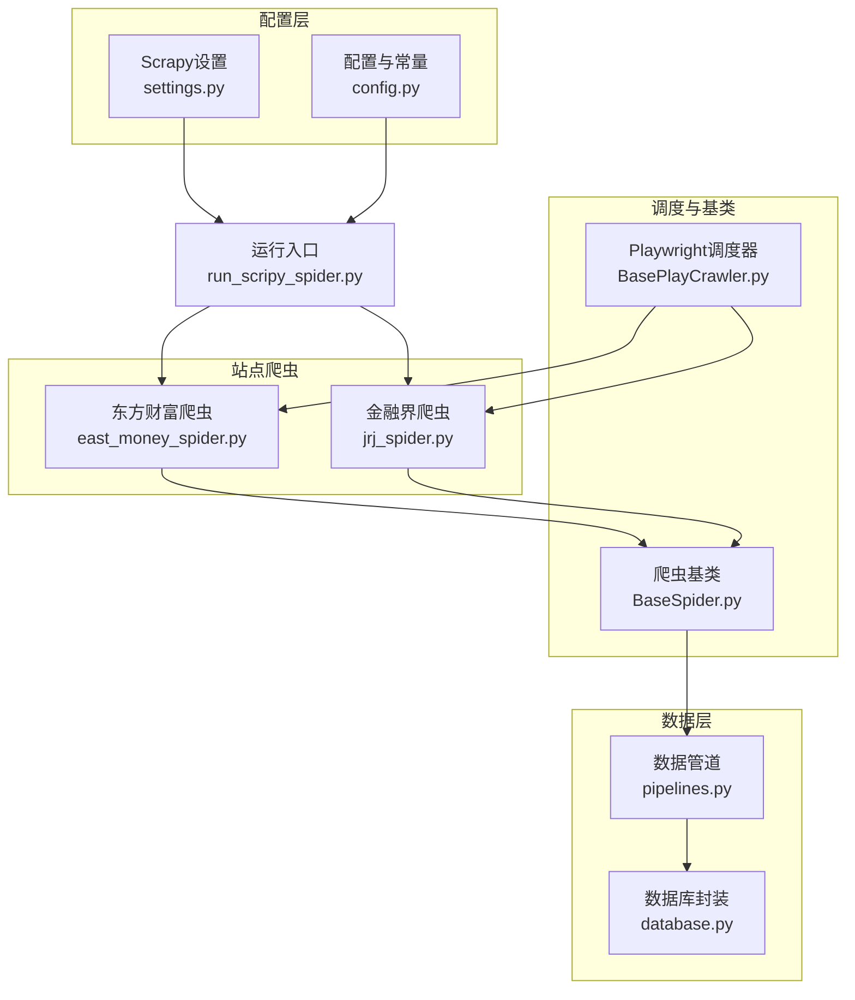
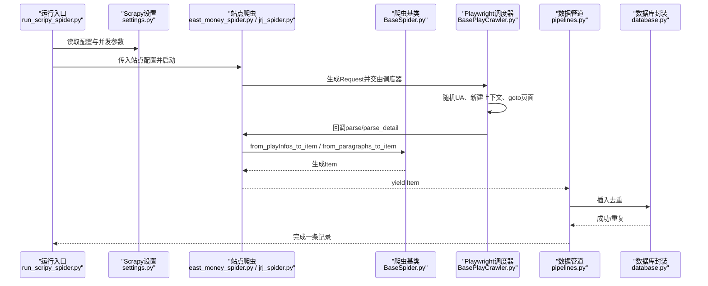
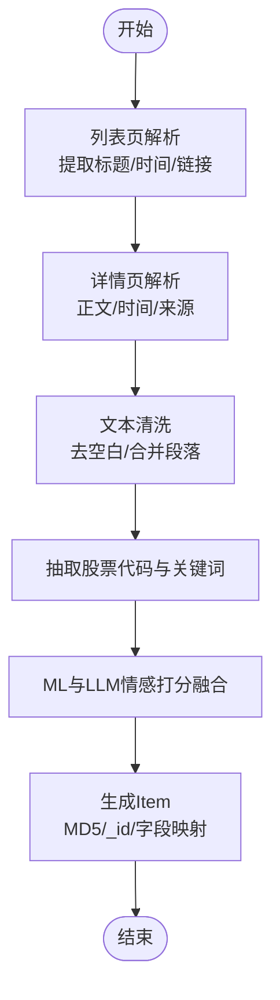
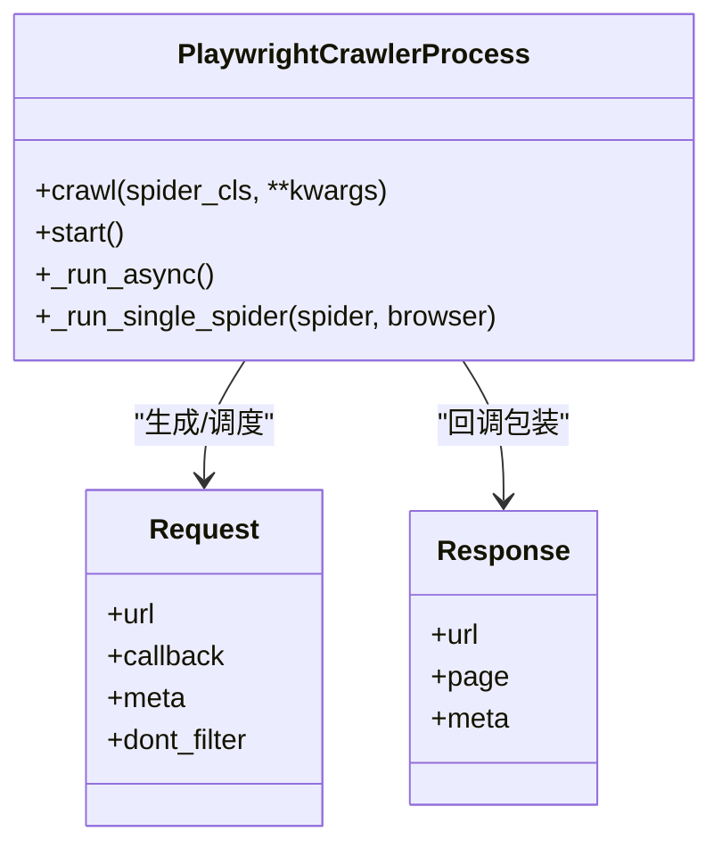
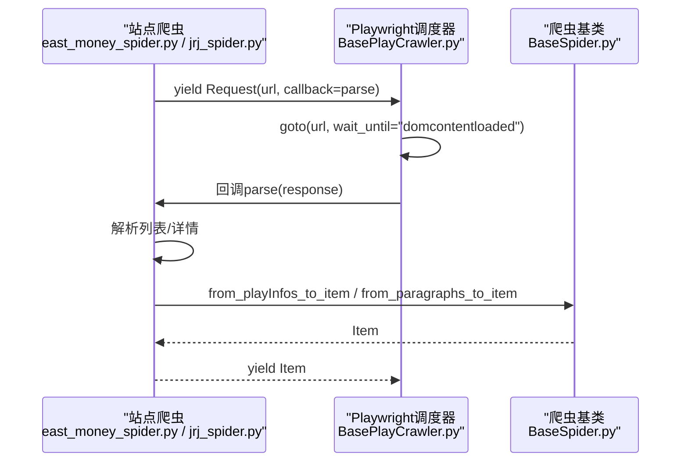
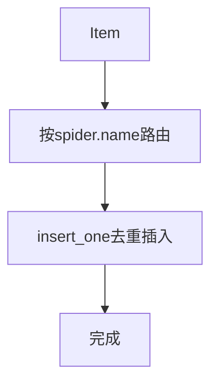
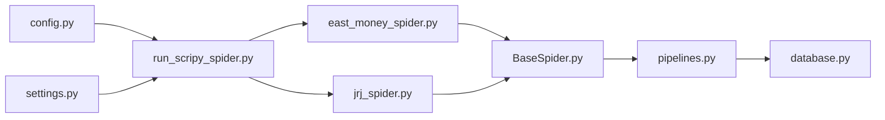

# 爬取合规与反爬虫防护

<cite>
**本文引用的文件**
- [README.md](file://README.md)
- [settings.py](file://src/settings.py)
- [config.py](file://src/Utils/config.py)
- [BaseSpider.py](file://src/MarketNewsSpiderWithScrapy/BaseSpider.py)
- [BasePlayCrawler.py](file://src/MarketNewsSpiderWithScrapy/BasePlayCrawler.py)
- [east_money_spider.py](file://src/MarketNewsSpiderWithScrapy/east_money_spider.py)
- [jrj_spider.py](file://src/MarketNewsSpiderWithScrapy/jrj_spider.py)
- [pipelines.py](file://src/pipelines.py)
- [database.py](file://src/Utils/database.py)
- [utils.py](file://src/Utils/utils.py)
- [run_scripy_spider.py](file://src/run_scripy_spider.py)
</cite>

## 目录
1. [引言](#引言)
2. [项目结构](#项目结构)
3. [核心组件](#核心组件)
4. [架构总览](#架构总览)
5. [详细组件分析](#详细组件分析)
6. [依赖分析](#依赖分析)
7. [性能考虑](#性能考虑)
8. [故障排查指南](#故障排查指南)
9. [结论](#结论)
10. [附录](#附录)

## 引言
本文件面向开发者，系统梳理该项目在“爬取合规与反爬虫防护”方面的实现现状与改进建议。文档从合规性要求、请求头伪装、User-Agent轮换、代理池管理、请求频率控制、验证码处理、Robots协议、反爬虫检测应对、行为模拟与伪装、以及法律合规与风险控制等方面展开，结合仓库中现有Scrapy与Playwright集成的爬虫实现，给出可操作的优化路径与最佳实践。

## 项目结构
该项目采用Scrapy框架与Playwright异步渲染相结合的方式，对多家财经新闻站点进行爬取。核心模块包括：
- 配置与常量：集中定义各站点入口、分页策略、数据库与模型路径等
- 爬虫基类与Playwright调度器：统一处理列表页与详情页流程、UA轮换、并发与异常处理
- 站点特定爬虫：针对不同站点的解析规则与细节差异
- 数据管道与数据库：统一入库、去重与异常处理
- 运行入口：按类别批量调度多个爬虫

图表来源
- [config.py:1-455](file://src/Utils/config.py#L1-L455)
- [settings.py:1-49](file://src/settings.py#L1-L49)
- [BaseSpider.py:1-149](file://src/MarketNewsSpiderWithScrapy/BaseSpider.py#L1-L149)
- [BasePlayCrawler.py:1-120](file://src/MarketNewsSpiderWithScrapy/BasePlayCrawler.py#L1-L120)
- [east_money_spider.py:1-78](file://src/MarketNewsSpiderWithScrapy/east_money_spider.py#L1-L78)
- [jrj_spider.py:1-94](file://src/MarketNewsSpiderWithScrapy/jrj_spider.py#L1-L94)
- [pipelines.py:1-56](file://src/pipelines.py#L1-L56)
- [database.py:1-176](file://src/Utils/database.py#L1-L176)
- [run_scripy_spider.py:1-145](file://src/run_scripy_spider.py#L1-L145)

章节来源
- [README.md:1-33](file://README.md#L1-L33)
- [run_scripy_spider.py:117-145](file://src/run_scripy_spider.py#L117-L145)

## 核心组件
- 配置与常量：集中管理各站点的数据库名、集合名、起始URL、关键词、中文名称、分页上限等；同时包含模型路径、设备类型等推理配置
- 爬虫基类：提供通用的列表页到详情页的数据抽取、标题与正文清洗、股票代码与关键词抽取、情感打分融合、去重MD5生成与字段映射
- Playwright调度器：统一的异步调度器，支持UA随机、独立上下文、并发执行、异常捕获与入库处理
- 站点爬虫：针对不同站点的列表页选择器、加载更多、详情页正文提取与时间解析策略
- 数据管道与数据库：按站点路由入库、去重插入、自动重连与指数退避

章节来源
- [config.py:55-455](file://src/Utils/config.py#L55-L455)
- [BaseSpider.py:41-146](file://src/MarketNewsSpiderWithScrapy/BaseSpider.py#L41-L146)
- [BasePlayCrawler.py:21-120](file://src/MarketNewsSpiderWithScrapy/BasePlayCrawler.py#L21-L120)
- [east_money_spider.py:5-78](file://src/MarketNewsSpiderWithScrapy/east_money_spider.py#L5-L78)
- [jrj_spider.py:7-94](file://src/MarketNewsSpiderWithScrapy/jrj_spider.py#L7-L94)
- [pipelines.py:8-56](file://src/pipelines.py#L8-L56)
- [database.py:36-176](file://src/Utils/database.py#L36-L176)

## 架构总览
整体架构由“配置驱动的Scrapy调度 + Playwright渲染 + 统一数据管道 + 数据库存储”构成。站点爬虫通过基类统一处理解析与入库，调度器负责UA轮换与并发控制，数据库封装提供稳健的连接与重试策略。

图表来源
- [run_scripy_spider.py:117-145](file://src/run_scripy_spider.py#L117-L145)
- [settings.py:14-49](file://src/settings.py#L14-L49)
- [BasePlayCrawler.py:41-120](file://src/MarketNewsSpiderWithScrapy/BasePlayCrawler.py#L41-L120)
- [BaseSpider.py:41-146](file://src/MarketNewsSpiderWithScrapy/BaseSpider.py#L41-L146)
- [pipelines.py:25-56](file://src/pipelines.py#L25-L56)
- [database.py:94-176](file://src/Utils/database.py#L94-L176)

## 详细组件分析

### 爬虫基类与数据抽取
- 列表页到详情页的通用流程：抽取标题、时间、正文，构造元数据，yield详情页请求
- 文本清洗：去除多余空白、合并段落、标准化换行
- 股票代码与关键词抽取：基于预训练模型与字典，输出关联关系与词频
- 情感打分融合：ML与LLM双模型打分融合，输出利好/利空与置信度
- 去重与入库字段：MD5作为_id，统一字段映射

图表来源
- [BaseSpider.py:41-146](file://src/MarketNewsSpiderWithScrapy/BaseSpider.py#L41-L146)

章节来源
- [BaseSpider.py:41-146](file://src/MarketNewsSpiderWithScrapy/BaseSpider.py#L41-L146)

### Playwright调度器与UA轮换
- UA轮换：从settings中的USER_AGENTS随机选择，为每个爬虫创建独立上下文
- 并发执行：所有爬虫共享浏览器实例，但各自上下文隔离，降低内存占用
- 异常处理：捕获单个请求异常，不影响其他任务
- 入库处理：统一通过Pipeline写入对应数据库集合

图表来源
- [BasePlayCrawler.py:21-120](file://src/MarketNewsSpiderWithScrapy/BasePlayCrawler.py#L21-L120)

章节来源
- [BasePlayCrawler.py:21-120](file://src/MarketNewsSpiderWithScrapy/BasePlayCrawler.py#L21-L120)
- [settings.py:36-47](file://src/settings.py#L36-L47)

### 站点爬虫实现要点
- 东方财富：等待列表容器加载、遍历li元素、提取标题与时间、跳转详情页
- 金融界：处理“加载更多”按钮、定位新闻项、正则提取时间、正文清洗

图表来源
- [east_money_spider.py:21-78](file://src/MarketNewsSpiderWithScrapy/east_money_spider.py#L21-L78)
- [jrj_spider.py:17-94](file://src/MarketNewsSpiderWithScrapy/jrj_spider.py#L17-L94)
- [BasePlayCrawler.py:78-118](file://src/MarketNewsSpiderWithScrapy/BasePlayCrawler.py#L78-L118)
- [BaseSpider.py:41-146](file://src/MarketNewsSpiderWithScrapy/BaseSpider.py#L41-L146)

章节来源
- [east_money_spider.py:5-78](file://src/MarketNewsSpiderWithScrapy/east_money_spider.py#L5-L78)
- [jrj_spider.py:7-94](file://src/MarketNewsSpiderWithScrapy/jrj_spider.py#L7-L94)

### 数据管道与数据库
- 按站点命名空间路由入库：根据spider.name映射到对应数据库与集合
- 去重插入：使用insert_one并忽略重复键错误
- 数据库连接：统一初始化客户端、指数退避自动重连

图表来源
- [pipelines.py:25-56](file://src/pipelines.py#L25-L56)
- [database.py:94-176](file://src/Utils/database.py#L94-L176)

章节来源
- [pipelines.py:8-56](file://src/pipelines.py#L8-L56)
- [database.py:36-176](file://src/Utils/database.py#L36-L176)

## 依赖分析
- 配置依赖：站点列表、数据库名、集合名、分页上限、模型路径等集中于config.py
- 设置依赖：并发、下载超时、延迟、默认请求头、UA列表、代理中间件开关等位于settings.py
- 运行入口：run_scripy_spider.py按命令行参数批量调度多个站点爬虫
- 数据依赖：pipelines与database共同保证数据一致性与可用性

图表来源
- [config.py:439-455](file://src/Utils/config.py#L439-L455)
- [settings.py:14-49](file://src/settings.py#L14-L49)
- [run_scripy_spider.py:117-145](file://src/run_scripy_spider.py#L117-L145)
- [east_money_spider.py:5-78](file://src/MarketNewsSpiderWithScrapy/east_money_spider.py#L5-L78)
- [jrj_spider.py:7-94](file://src/MarketNewsSpiderWithScrapy/jrj_spider.py#L7-L94)
- [BaseSpider.py:13-33](file://src/MarketNewsSpiderWithScrapy/BaseSpider.py#L13-L33)
- [pipelines.py:25-56](file://src/pipelines.py#L25-L56)
- [database.py:36-176](file://src/Utils/database.py#L36-L176)

章节来源
- [config.py:1-455](file://src/Utils/config.py#L1-L455)
- [settings.py:1-49](file://src/settings.py#L1-L49)
- [run_scripy_spider.py:117-145](file://src/run_scripy_spider.py#L117-L145)

## 性能考虑
- 并发与延迟：settings中设置CONCURRENT_REQUESTS与DOWNLOAD_DELAY，平衡吞吐与目标站点压力
- 下载超时：DOWNLOAD_TIMEOUT短配置可能引发频繁超时，需结合站点响应特性调整
- UA轮换：USER_AGENTS列表覆盖多平台与多版本，减少被识别为脚本的风险
- 异步渲染：Playwright在复杂JS渲染场景下提升稳定性，但会增加资源消耗
- 数据库连接：最大连接池与自动重连策略有助于提升写入稳定性

章节来源
- [settings.py:18-47](file://src/settings.py#L18-L47)
- [BasePlayCrawler.py:45-62](file://src/MarketNewsSpiderWithScrapy/BasePlayCrawler.py#L45-L62)
- [database.py:94-176](file://src/Utils/database.py#L94-L176)

## 故障排查指南
- 列表页加载超时：检查等待选择器与超时阈值，适当延长或切换wait_until条件
- 详情页正文为空：确认正文选择器与等待逻辑，必要时兼容多种容器
- 代理中间件未生效：当前设置中注释掉自定义IPProxyMiddleware，启用HttpProxyMiddleware并确保环境变量或配置正确
- 重复数据：确认MD5去重与insert_one策略，避免重复入库
- 数据库连接异常：利用自动重连装饰器与指数退避，关注日志提示

章节来源
- [east_money_spider.py:27-30](file://src/MarketNewsSpiderWithScrapy/east_money_spider.py#L27-L30)
- [jrj_spider.py:58-78](file://src/MarketNewsSpiderWithScrapy/jrj_spider.py#L58-L78)
- [settings.py:25-30](file://src/settings.py#L25-L30)
- [pipelines.py:48-56](file://src/pipelines.py#L48-L56)
- [database.py:15-34](file://src/Utils/database.py#L15-L34)

## 结论
本项目在Scrapy与Playwright的协同下，实现了多站点新闻爬取与统一入库。在合规与反爬虫方面，已具备UA轮换、并发与延迟控制、异步渲染与去重入库等基础能力。为进一步提升稳定性与合规性，建议补充代理池管理、Robots协议解析与遵守、验证码识别与处理、更精细的请求频率控制与行为伪装策略，并完善法律合规与风险控制流程。

## 附录

### 合规与反爬虫防护最佳实践清单
- 合规性
  - 明确目的与范围，遵守目标站点条款与法律法规
  - 优先使用公开API或官方授权渠道
  - 限制采集粒度与频率，避免对生产环境造成影响
- 请求头与行为伪装
  - 使用真实UA与浏览器指纹多样性
  - 随机延时与阶梯式并发，模拟人类访问节奏
  - 控制Referer、Accept-Language等头部一致性
- 代理池与轮换
  - 健康检查与失效剔除，按地区/运营商分类
  - 动态权重与故障转移，异常时快速降级
- 验证码与风控
  - 人机验证：OCR识别或第三方云服务
  - 行为特征：鼠标轨迹、滚动、点击间隔等模拟
- Robots协议
  - 自动解析与遵循，尊重Disallow与Crawl-delay
- 法律与风险
  - 建立数据使用授权与脱敏流程
  - 风险评估与审计日志，定期复核

### 当前实现与改进建议对照
- 已有：UA轮换、并发与延迟、异步渲染、去重入库
- 建议：代理池中间件、Robots解析、验证码处理、更细粒度的频率控制、行为模拟与伪装