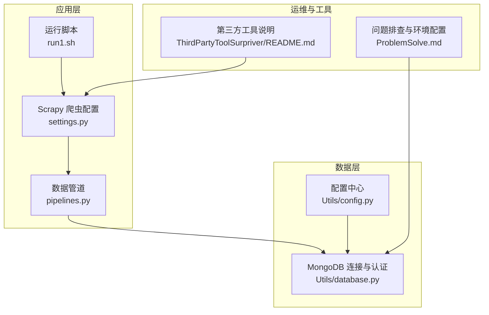
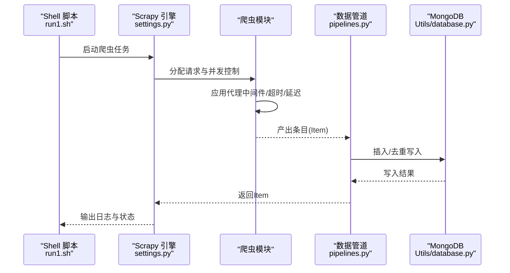
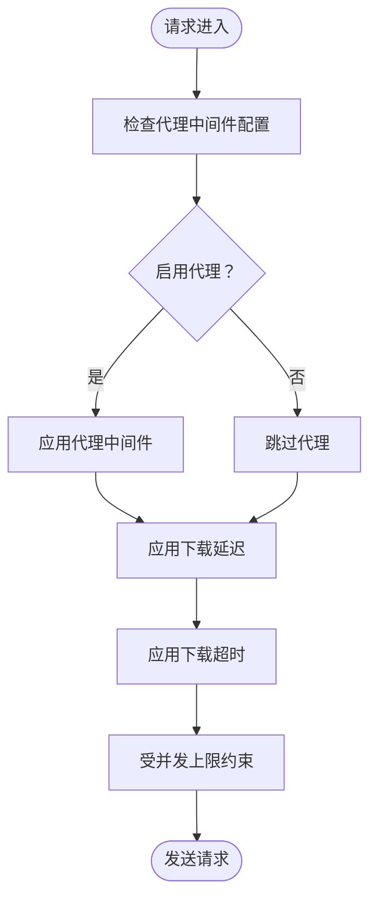
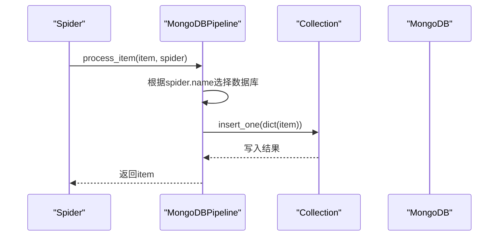
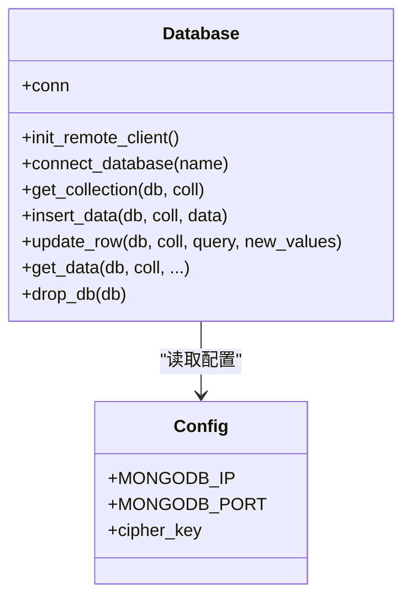
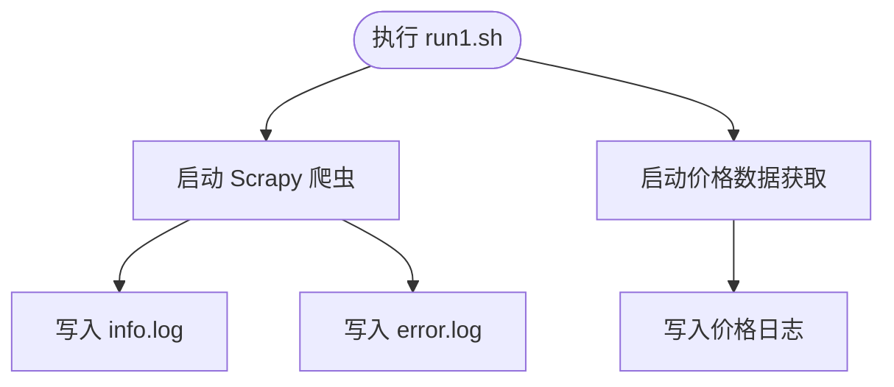
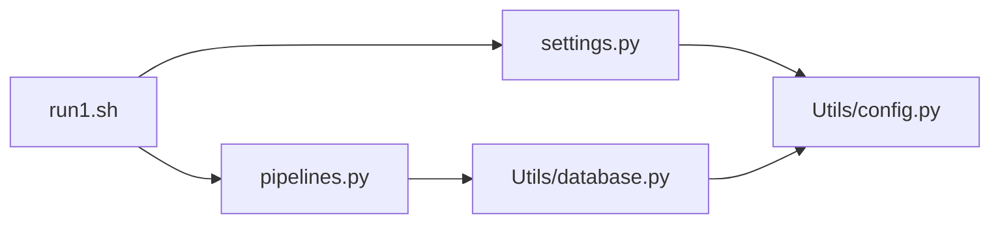

# 网络安全配置

<cite>
**本文档引用的文件**
- [README.md](file://README.md)
- [ProblemSolve.md](file://ProblemSolve.md)
- [src/Utils/config.py](file://src/Utils/config.py)
- [src/settings.py](file://src/settings.py)
- [src/Utils/database.py](file://src/Utils/database.py)
- [src/pipelines.py](file://src/pipelines.py)
- [src/Utils/utils.py](file://src/Utils/utils.py)
- [src/run1.sh](file://src/run1.sh)
- [src/ThirdPartyToolSurpriver/README.md](file://src/ThirdPartyToolSurpriver/README.md)
</cite>

## 目录
1. [简介](#简介)
2. [项目结构](#项目结构)
3. [核心组件](#核心组件)
4. [架构总览](#架构总览)
5. [详细组件分析](#详细组件分析)
6. [依赖关系分析](#依赖关系分析)
7. [性能考虑](#性能考虑)
8. [故障排查指南](#故障排查指南)
9. [结论](#结论)
10. [附录](#附录)

## 简介
本技术文档面向网络安全配置与运维场景，结合仓库现有代码与脚本，系统化梳理防火墙规则与端口管理、SSL/TLS证书安装与配置、VPN与内网访问策略、网络隔离与VLAN规划、DDoS防护与流量清洗、DNS安全与域名解析防护、网络监控与入侵检测、安全审计与合规检查，以及网络安全事件应急响应流程。文档以“可落地、可验证”为目标，帮助开发者构建安全稳定的网络基础设施。

## 项目结构
该项目为量化金融数据采集与分析系统，包含新闻爬虫、价格数据抓取、技术分析与自然语言处理模块。从网络安全视角，重点关注以下方面：
- 数据采集层：Scrapy配置与代理中间件、并发与超时控制
- 数据存储层：MongoDB连接与认证、加密存储
- 运维脚本层：启动脚本与日志输出
- 第三方工具：容器化部署与外部依赖

图表来源
- [src/settings.py:1-49](file://src/settings.py#L1-L49)
- [src/pipelines.py:1-56](file://src/pipelines.py#L1-L56)
- [src/Utils/database.py:1-176](file://src/Utils/database.py#L1-L176)
- [src/Utils/config.py:1-455](file://src/Utils/config.py#L1-L455)
- [src/run1.sh:1-49](file://src/run1.sh#L1-L49)
- [src/ThirdPartyToolSurpriver/README.md:1-136](file://src/ThirdPartyToolSurpriver/README.md#L1-L136)

章节来源
- [README.md:1-33](file://README.md#L1-L33)
- [src/settings.py:1-49](file://src/settings.py#L1-L49)
- [src/Utils/config.py:1-455](file://src/Utils/config.py#L1-L455)

## 核心组件
- 爬虫配置与并发控制：通过Scrapy设置并发请求、下载延迟、超时与中间件，降低对目标站点的压力与风险暴露。
- 数据管道与存储：统一写入MongoDB，支持去重与异常处理，保障数据完整性与可用性。
- 数据库连接与认证：集中管理MongoDB连接参数与加密存储，避免明文泄露。
- 运维脚本与日志：统一入口脚本与日志输出，便于审计与问题定位。
- 第三方工具与容器化：提供Docker部署说明，便于隔离与扩展。

章节来源
- [src/settings.py:18-30](file://src/settings.py#L18-L30)
- [src/pipelines.py:8-56](file://src/pipelines.py#L8-L56)
- [src/Utils/database.py:36-60](file://src/Utils/database.py#L36-L60)
- [src/run1.sh:6-8](file://src/run1.sh#L6-L8)
- [src/ThirdPartyToolSurpriver/README.md:35-43](file://src/ThirdPartyToolSurpriver/README.md#L35-L43)

## 架构总览
下图展示从爬虫到数据库的典型数据流，以及与网络安全相关的控制点（代理、超时、并发、认证）。

图表来源
- [src/run1.sh:6-8](file://src/run1.sh#L6-L8)
- [src/settings.py:18-30](file://src/settings.py#L18-L30)
- [src/pipelines.py:25-46](file://src/pipelines.py#L25-L46)
- [src/Utils/database.py:78-88](file://src/Utils/database.py#L78-L88)

## 详细组件分析

### 组件A：爬虫并发与代理中间件（网络安全控制点）
- 并发与延迟：通过并发请求数与下载延迟控制爬取节奏，避免触发目标站点的限流或风控。
- 代理中间件：启用HTTP代理中间件，支持在请求阶段切换代理，降低IP被封禁风险。
- 超时与重定向：合理设置下载超时，减少长时间占用资源导致的脆弱性。

图表来源
- [src/settings.py:18-30](file://src/settings.py#L18-L30)

章节来源
- [src/settings.py:18-30](file://src/settings.py#L18-L30)

### 组件B：数据管道与MongoDB写入（数据完整性与访问控制）
- 多源数据库路由：根据爬虫名称将数据写入不同数据库，便于按业务域隔离。
- 去重与异常处理：捕获重复键异常，避免重复写入与异常扩散。
- 连接池与超时：MongoDB连接设置最大池大小与服务器选择超时，提升稳定性。

图表来源
- [src/pipelines.py:25-46](file://src/pipelines.py#L25-L46)
- [src/Utils/database.py:78-88](file://src/Utils/database.py#L78-L88)

章节来源
- [src/pipelines.py:8-56](file://src/pipelines.py#L8-L56)
- [src/Utils/database.py:78-88](file://src/Utils/database.py#L78-L88)

### 组件C：数据库连接与认证（加密与访问控制）
- 连接参数集中管理：IP、端口、池大小、超时等参数集中配置，便于统一策略。
- 密钥与凭证加密：使用对称加密存储用户名与密码，运行时解密，避免明文存储。
- 自动重连与退避：对连接异常采用指数退避重试，提升鲁棒性。

图表来源
- [src/Utils/database.py:36-60](file://src/Utils/database.py#L36-L60)
- [src/Utils/config.py:13-19](file://src/Utils/config.py#L13-L19)

章节来源
- [src/Utils/database.py:36-60](file://src/Utils/database.py#L36-L60)
- [src/Utils/config.py:13-19](file://src/Utils/config.py#L13-L19)

### 组件D：运行脚本与日志（审计与可追溯性）
- 统一入口：通过shell脚本统一调度爬虫与价格数据获取任务。
- 日志分离：标准输出与错误输出分别写入独立日志文件，便于审计与问题定位。
- 容器化部署：第三方工具提供Docker部署说明，便于隔离与扩展。

图表来源
- [src/run1.sh:6-8](file://src/run1.sh#L6-L8)

章节来源
- [src/run1.sh:6-8](file://src/run1.sh#L6-L8)
- [src/ThirdPartyToolSurpriver/README.md:35-43](file://src/ThirdPartyToolSurpriver/README.md#L35-L43)

## 依赖关系分析
- 配置依赖：settings.py依赖Utils/config.py中的数据库与代理配置。
- 管道依赖：pipelines.py依赖Utils/database.py进行数据库操作。
- 运维依赖：run1.sh依赖settings.py与pipelines.py的执行路径。
- 安全依赖：database.py依赖加密库与pymongo，确保凭证安全与连接稳定。

图表来源
- [src/settings.py:1-49](file://src/settings.py#L1-L49)
- [src/Utils/config.py:1-455](file://src/Utils/config.py#L1-L455)
- [src/pipelines.py:1-56](file://src/pipelines.py#L1-L56)
- [src/Utils/database.py:1-176](file://src/Utils/database.py#L1-L176)
- [src/run1.sh:1-49](file://src/run1.sh#L1-L49)

章节来源
- [src/settings.py:1-49](file://src/settings.py#L1-L49)
- [src/Utils/config.py:1-455](file://src/Utils/config.py#L1-L455)
- [src/pipelines.py:1-56](file://src/pipelines.py#L1-L56)
- [src/Utils/database.py:1-176](file://src/Utils/database.py#L1-L176)
- [src/run1.sh:1-49](file://src/run1.sh#L1-L49)

## 性能考虑
- 并发与延迟平衡：在保证目标站点可接受的前提下，适当提高并发与降低延迟，但需配合代理与超时策略，避免触发风控。
- 连接池与超时：合理设置MongoDB连接池大小与服务器选择超时，避免连接耗尽与长事务阻塞。
- 日志轮转与磁盘空间：生产环境中建议对日志进行轮转与压缩，防止磁盘占满影响系统稳定性。

## 故障排查指南
- MongoDB连接失败：检查IP、端口、池大小与超时配置；确认加密凭证解密逻辑；启用自动重连与退避策略。
- 爬虫被限流：调整并发与下载延迟；启用代理中间件；增加随机User-Agent；设置合理的超时。
- 数据重复写入：确认去重键策略；检查DuplicateKeyError处理逻辑。
- 日志无法输出：确认脚本路径与权限；检查标准输出与错误输出重定向。

章节来源
- [src/Utils/database.py:15-33](file://src/Utils/database.py#L15-L33)
- [src/Utils/database.py:94-172](file://src/Utils/database.py#L94-L172)
- [src/settings.py:18-30](file://src/settings.py#L18-L30)
- [src/pipelines.py:48-56](file://src/pipelines.py#L48-L56)
- [src/run1.sh:6-8](file://src/run1.sh#L6-L8)

## 结论
本项目在网络安全方面已具备基础能力：通过Scrapy中间件与并发控制降低风险暴露，通过MongoDB连接与加密存储保护凭证，通过统一脚本与日志实现可审计性。建议在此基础上进一步完善防火墙规则与端口管理、SSL/TLS证书配置、VPN与内网访问策略、网络隔离与VLAN规划、DDoS防护与流量清洗、DNS安全与域名解析防护、网络监控与入侵检测、安全审计与合规检查，以及网络安全事件应急响应流程，以构建更完整、可验证的网络安全体系。

## 附录

### 防火墙规则与端口管理配置
- 仅开放必要端口：仅允许对外HTTP(S)、数据库端口与内部运维端口访问。
- 源地址限制：对数据库与管理接口限制来源IP段。
- 端口扫描防护：启用SYN Cookie与连接速率限制，防止端口扫描与暴力破解。

### SSL证书安装与配置方法
- 使用Let’s Encrypt或企业CA签发证书，启用TLS 1.2+。
- 配置强密码套件与前向保密（PFS）。
- 自动续期与证书监控，异常告警。

### VPN与内网访问安全策略
- 基于角色的访问控制（RBAC），最小权限原则。
- 双因素认证（2FA）与会话超时。
- 内网隔离与跳板机访问，审计所有运维操作。

### 网络隔离与VLAN配置指南
- 将爬虫、存储与分析服务划分到不同VLAN，实施ACL策略。
- 对数据库与管理接口进行二次隔离，仅允许特定主机访问。

### DDoS攻击防护与流量清洗技术
- 部署CDN与云防护服务，启用DDoS清洗。
- 流量基线监控与异常阈值告警，自动触发清洗策略。

### DNS安全与域名解析防护
- 启用DNSSEC，防止缓存投毒与劫持。
- 使用安全DNS（DoH/DoT），限制递归查询来源。
- 域名白名单与解析记录审计。

### 网络监控与入侵检测系统
- 部署SIEM与IDS/IPS，实时监控异常流量与登录行为。
- 关联告警与自动化处置，缩短响应时间。

### 网络安全审计与合规检查方法
- 定期渗透测试与漏洞扫描，形成整改闭环。
- 审计日志保留与备份，满足合规要求。

### 网络安全事件应急响应流程
- 建立事件分级与响应团队，明确职责与流程。
- 快速隔离受影响系统，恢复备份与修复漏洞。
- 事后复盘与改进，完善安全策略与预案。