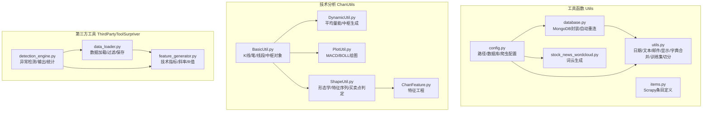
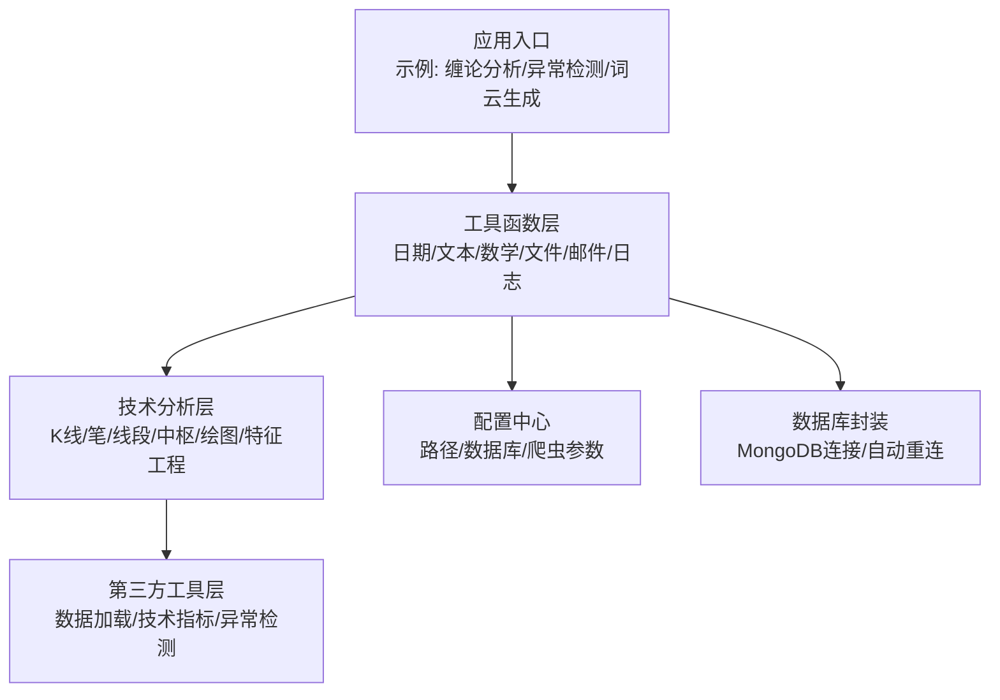
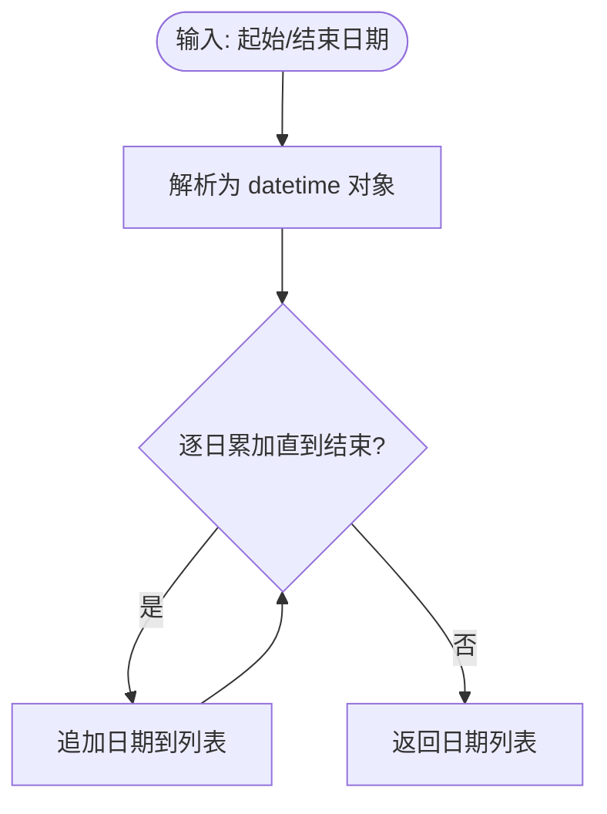
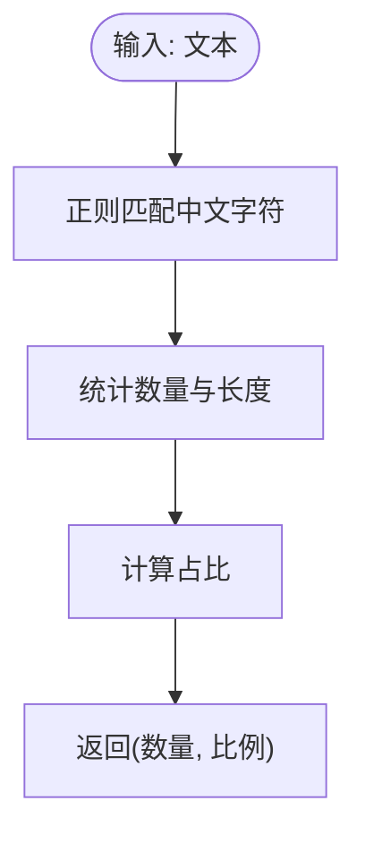
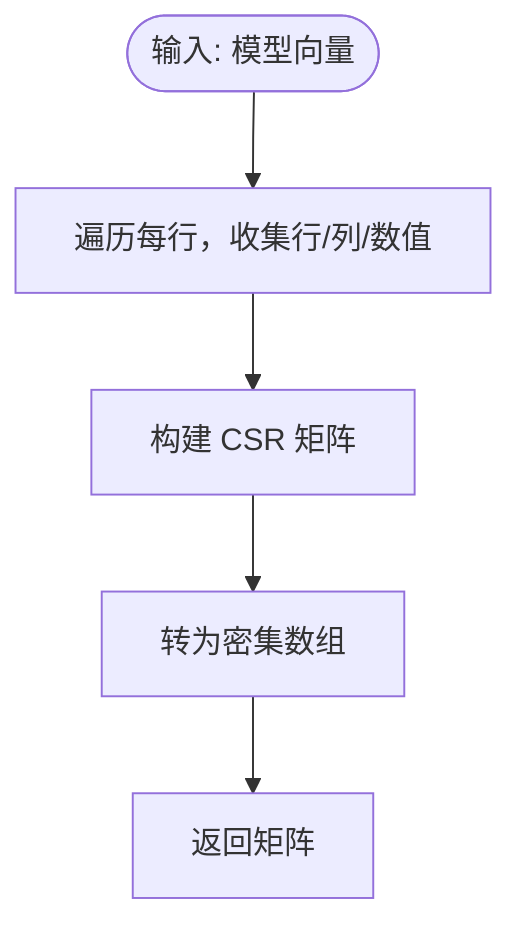
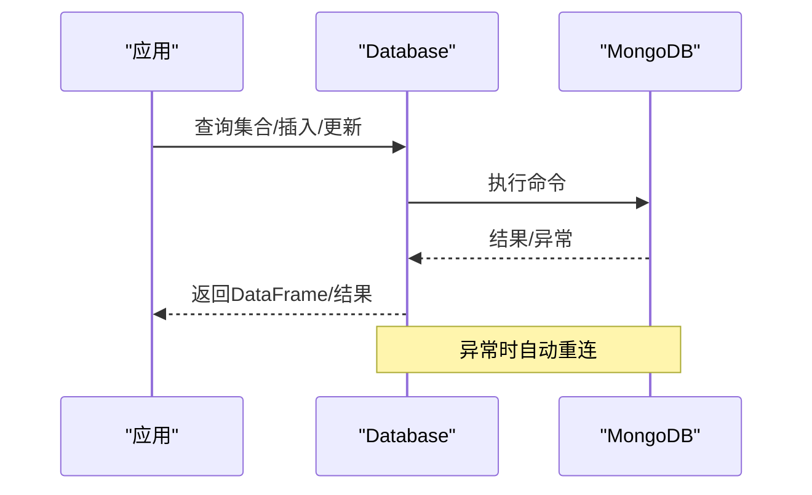
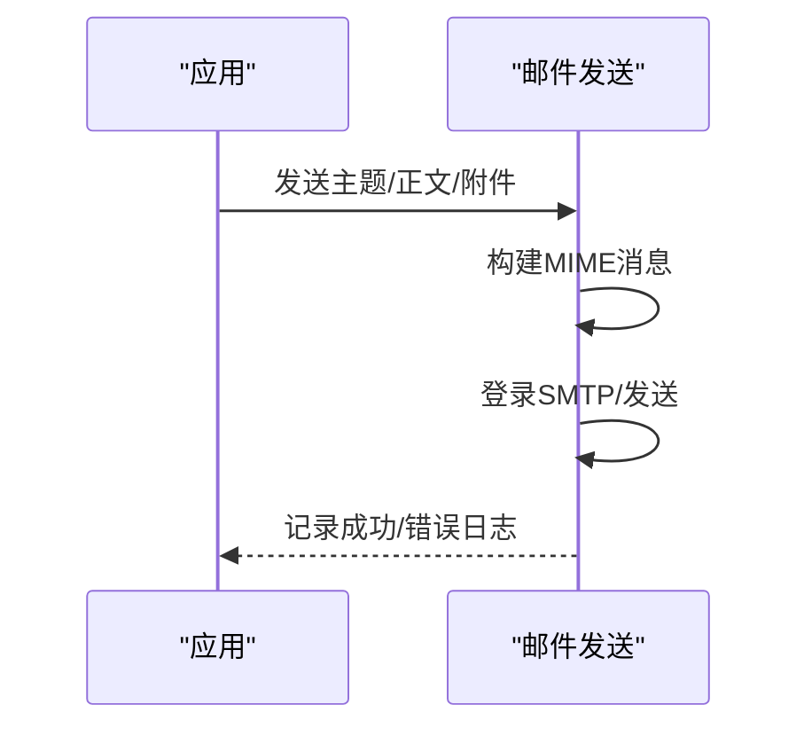
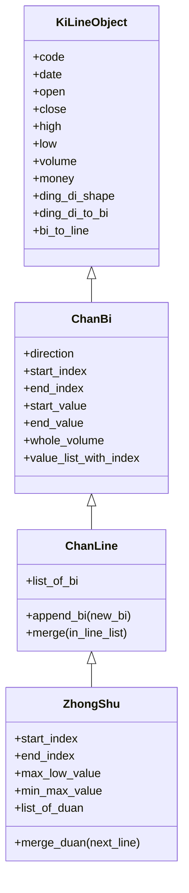
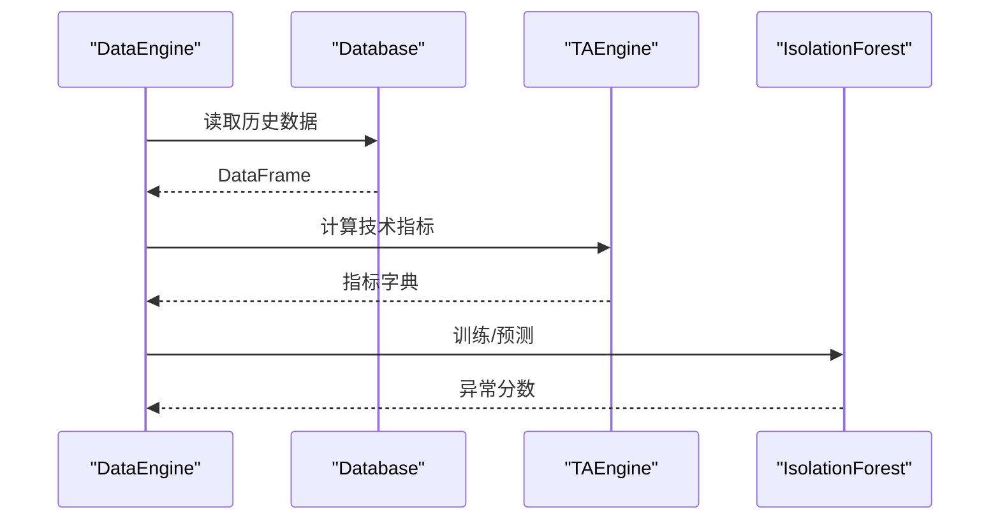
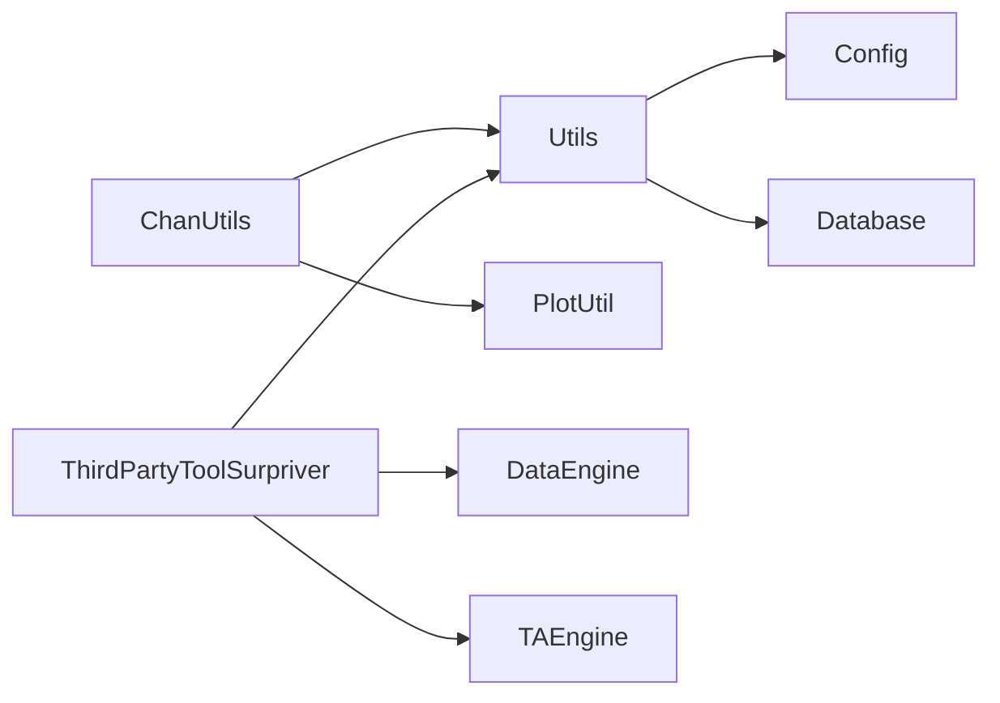

# 实用工具函数

<cite>
**本文引用的文件**
- [src/Utils/utils.py](file://src/Utils/utils.py)
- [src/Utils/config.py](file://src/Utils/config.py)
- [src/Utils/database.py](file://src/Utils/database.py)
- [src/Utils/items.py](file://src/Utils/items.py)
- [src/Utils/stock_news_wordcloud.py](file://src/Utils/stock_news_wordcloud.py)
- [src/ChanUtils/BasicUtil.py](file://src/ChanUtils/BasicUtil.py)
- [src/ChanUtils/DynamicUtil.py](file://src/ChanUtils/DynamicUtil.py)
- [src/ChanUtils/PlotUtil.py](file://src/ChanUtils/PlotUtil.py)
- [src/ChanUtils/ShapeUtil.py](file://src/ChanUtils/ShapeUtil.py)
- [src/ChanUtils/ChanFeature.py](file://src/ChanUtils/ChanFeature.py)
- [src/ChanTechAnalyze/ChanLunEngZhongShu.py](file://src/ChanTechAnalyze/ChanLunEngZhongShu.py)
- [src/ThirdPartyToolSurpriver/data_loader.py](file://src/ThirdPartyToolSurpriver/data_loader.py)
- [src/ThirdPartyToolSurpriver/detection_engine.py](file://src/ThirdPartyToolSurpriver/detection_engine.py)
- [src/ThirdPartyToolSurpriver/feature_generator.py](file://src/ThirdPartyToolSurpriver/feature_generator.py)
</cite>

## 目录
1. [简介](#简介)
2. [项目结构](#项目结构)
3. [核心组件](#核心组件)
4. [架构总览](#架构总览)
5. [详细组件分析](#详细组件分析)
6. [依赖分析](#依赖分析)
7. [性能考量](#性能考量)
8. [故障排查指南](#故障排查指南)
9. [结论](#结论)
10. [附录](#附录)

## 简介
本文件面向“实用工具函数”的综合技术文档，覆盖以下主题：
- 日期处理：日期范围生成、日期计算、中文日期格式化
- 文本处理：中文字符检测、停用词加载、文本清洗与过滤
- 数学计算：向量转换（稀疏矩阵）、训练集切分、统计特征提取
- 文件与系统工具：MongoDB 数据访问、数据库连接重试、字典配置、爬虫条目定义、词云生成
- 辅助功能：邮件发送、日志记录、绘图与可视化
- 性能优化与内存管理：批量管道操作、异常自动重连、指数回退策略
- 实际使用示例与常见场景：新闻爬虫、技术分析、异常检测、特征工程

## 项目结构
该项目围绕“工具函数”“技术分析”“第三方工具”三大模块组织，工具函数位于 Utils 与 ChanUtils 子目录，分别提供通用工具、缠论分析与可视化能力；ThirdPartyToolSurpriver 提供基于技术指标的异常检测工具链。

图表来源
- [src/Utils/utils.py:1-251](file://src/Utils/utils.py#L1-L251)
- [src/Utils/config.py:1-455](file://src/Utils/config.py#L1-L455)
- [src/Utils/database.py:1-176](file://src/Utils/database.py#L1-L176)
- [src/Utils/items.py:1-18](file://src/Utils/items.py#L1-L18)
- [src/Utils/stock_news_wordcloud.py:1-371](file://src/Utils/stock_news_wordcloud.py#L1-L371)
- [src/ChanUtils/BasicUtil.py:1-695](file://src/ChanUtils/BasicUtil.py#L1-L695)
- [src/ChanUtils/DynamicUtil.py:1-141](file://src/ChanUtils/DynamicUtil.py#L1-L141)
- [src/ChanUtils/PlotUtil.py:1-150](file://src/ChanUtils/PlotUtil.py#L1-L150)
- [src/ChanUtils/ShapeUtil.py:1-800](file://src/ChanUtils/ShapeUtil.py#L1-L800)
- [src/ChanUtils/ChanFeature.py:1-325](file://src/ChanUtils/ChanFeature.py#L1-L325)
- [src/ThirdPartyToolSurpriver/data_loader.py:1-293](file://src/ThirdPartyToolSurpriver/data_loader.py#L1-L293)
- [src/ThirdPartyToolSurpriver/detection_engine.py:1-599](file://src/ThirdPartyToolSurpriver/detection_engine.py#L1-L599)
- [src/ThirdPartyToolSurpriver/feature_generator.py:1-186](file://src/ThirdPartyToolSurpriver/feature_generator.py#L1-L186)

章节来源
- [src/Utils/utils.py:1-251](file://src/Utils/utils.py#L1-L251)
- [src/Utils/config.py:1-455](file://src/Utils/config.py#L1-L455)
- [src/Utils/database.py:1-176](file://src/Utils/database.py#L1-L176)
- [src/Utils/items.py:1-18](file://src/Utils/items.py#L1-L18)
- [src/Utils/stock_news_wordcloud.py:1-371](file://src/Utils/stock_news_wordcloud.py#L1-L371)
- [src/ChanUtils/BasicUtil.py:1-695](file://src/ChanUtils/BasicUtil.py#L1-L695)
- [src/ChanUtils/DynamicUtil.py:1-141](file://src/ChanUtils/DynamicUtil.py#L1-L141)
- [src/ChanUtils/PlotUtil.py:1-150](file://src/ChanUtils/PlotUtil.py#L1-L150)
- [src/ChanUtils/ShapeUtil.py:1-800](file://src/ChanUtils/ShapeUtil.py#L1-L800)
- [src/ChanUtils/ChanFeature.py:1-325](file://src/ChanUtils/ChanFeature.py#L1-L325)
- [src/ThirdPartyToolSurpriver/data_loader.py:1-293](file://src/ThirdPartyToolSurpriver/data_loader.py#L1-L293)
- [src/ThirdPartyToolSurpriver/detection_engine.py:1-599](file://src/ThirdPartyToolSurpriver/detection_engine.py#L1-L599)
- [src/ThirdPartyToolSurpriver/feature_generator.py:1-186](file://src/ThirdPartyToolSurpriver/feature_generator.py#L1-L186)

## 核心组件
- 日期与时间处理
  - 日期范围生成：按日生成日期列表
  - 日期切片：将日期列表按窗口大小分组
  - 日期前推：获取前 N 天的日期
  - 中文日期格式：将 ISO 日期转为中文格式
- 文本处理
  - 中文字符检测：统计中文字符数量与占比
  - 中文停用词加载：从目录批量加载停用词并去重
  - 文本清洗：HTML 解析、正则匹配、编码处理
- 数学与数据处理
  - 稀疏矩阵转换：将模型向量转换为 CSR 矩阵并转数组
  - 训练集切分：按随机比例切分为训练/测试集
  - 统计特征：均值、方差、标准差、斜率、R 值
- 文件与系统工具
  - MongoDB 访问：连接、查询、插入、更新、模糊查询
  - 自动重连：指数回退策略，提升稳定性
  - 配置中心：数据库地址、字典路径、爬虫参数
  - Scrapy 条目：统一字段定义
  - 词云生成：MongoDB 数据聚合、字体解析、PIL/WordCloud 渲染
- 辅助功能
  - 邮件发送：SMTP 发送带附件的纯文本邮件
  - 日志记录：全局 Logger 初始化与格式化
  - 绘图：MACD/BOLL 子图叠加、K线图绘制

章节来源
- [src/Utils/utils.py:100-251](file://src/Utils/utils.py#L100-L251)
- [src/Utils/database.py:36-176](file://src/Utils/database.py#L36-L176)
- [src/Utils/config.py:1-455](file://src/Utils/config.py#L1-L455)
- [src/Utils/items.py:1-18](file://src/Utils/items.py#L1-L18)
- [src/Utils/stock_news_wordcloud.py:43-371](file://src/Utils/stock_news_wordcloud.py#L43-L371)

## 架构总览
工具函数层提供通用能力，技术分析层基于工具函数进行数据结构化与可视化，第三方工具层在此基础上扩展异常检测与特征工程。

图表来源
- [src/Utils/utils.py:1-251](file://src/Utils/utils.py#L1-L251)
- [src/ChanUtils/ShapeUtil.py:1-800](file://src/ChanUtils/ShapeUtil.py#L1-L800)
- [src/ThirdPartyToolSurpriver/detection_engine.py:1-599](file://src/ThirdPartyToolSurpriver/detection_engine.py#L1-L599)
- [src/Utils/config.py:1-455](file://src/Utils/config.py#L1-L455)
- [src/Utils/database.py:1-176](file://src/Utils/database.py#L1-L176)

## 详细组件分析

### 日期处理函数
- 日期范围生成
  - 功能：从起始日期到结束日期逐日生成列表
  - 复杂度：O(n)，n 为日期跨度
  - 使用场景：新闻抓取、回测数据准备
- 日期切片
  - 功能：将日期列表按固定窗口大小分组，便于批处理
  - 复杂度：O(n)
- 日期前推
  - 功能：获取前 N 天的日期字符串
  - 复杂度：O(1)
- 中文日期格式
  - 功能：将 ISO 日期转为“年-月-日 00:00/23:59”格式，便于数据库查询

图表来源
- [src/Utils/utils.py:100-110](file://src/Utils/utils.py#L100-L110)

章节来源
- [src/Utils/utils.py:100-137](file://src/Utils/utils.py#L100-L137)

### 文本处理函数
- 中文字符检测
  - 功能：统计中文字符数量与占比，辅助判断文本中文程度
  - 正则模式：支持中日韩统一表意文字块
- 中文停用词加载
  - 功能：从指定目录读取多个停用词文件，去重后返回列表
  - 复杂度：O(k)，k 为停用词总数
- HTML 解析与清洗
  - 功能：请求网页、解析编码、提取标签，为后续文本处理做准备
- 中文字符判断
  - 功能：判断字符串是否包含中文，用于过滤或标注

图表来源
- [src/Utils/utils.py:86-97](file://src/Utils/utils.py#L86-L97)

章节来源
- [src/Utils/utils.py:86-97](file://src/Utils/utils.py#L86-L97)
- [src/Utils/utils.py:171-185](file://src/Utils/utils.py#L171-L185)
- [src/Utils/utils.py:227-237](file://src/Utils/utils.py#L227-L237)
- [src/Utils/utils.py:163-168](file://src/Utils/utils.py#L163-L168)

### 数学计算与数据处理
- 稀疏矩阵转换
  - 功能：将模型向量（坐标+权重）转换为 CSR 矩阵，并转为密集数组
  - 适用：LDA/LSI/TF-IDF 等降维/检索向量
  - 复杂度：O(nnz)，nnz 为非零元素个数
- 训练集切分
  - 功能：按随机比例切分 X/Y 为训练/测试集
  - 复杂度：O(n)
- 统计特征
  - 功能：计算均值、方差、标准差、斜率、R 值等
  - 应用：技术指标斜率与拟合度评估

图表来源
- [src/Utils/utils.py:188-208](file://src/Utils/utils.py#L188-L208)

章节来源
- [src/Utils/utils.py:188-224](file://src/Utils/utils.py#L188-L224)
- [src/ThirdPartyToolSurpriver/feature_generator.py:16-29](file://src/ThirdPartyToolSurpriver/feature_generator.py#L16-L29)

### 文件与系统工具
- MongoDB 访问
  - 功能：连接、查询、插入、更新、模糊查询、最大值查询
  - 复杂度：查询取决于索引与数据量
- 自动重连
  - 功能：装饰器实现指数回退重试，避免瞬时断连导致失败
- 配置中心
  - 功能：集中管理数据库地址、字典路径、爬虫参数、模型路径
- Scrapy 条目
  - 功能：统一新闻条目字段，便于爬虫与存储
- 词云生成
  - 功能：从 MongoDB 聚合股票名称频率，过滤机构名，渲染词云

图表来源
- [src/Utils/database.py:94-172](file://src/Utils/database.py#L94-L172)
- [src/Utils/config.py:1-455](file://src/Utils/config.py#L1-L455)

章节来源
- [src/Utils/database.py:36-176](file://src/Utils/database.py#L36-L176)
- [src/Utils/config.py:1-455](file://src/Utils/config.py#L1-L455)
- [src/Utils/items.py:1-18](file://src/Utils/items.py#L1-L18)
- [src/Utils/stock_news_wordcloud.py:81-137](file://src/Utils/stock_news_wordcloud.py#L81-L137)

### 辅助功能
- 邮件发送
  - 功能：构建纯文本正文与附件，登录 SMTP，发送邮件并记录日志
  - 安全：凭据硬编码，建议迁移到环境变量或安全存储
- 日志记录
  - 功能：初始化全局 Logger，统一格式化输出
- 绘图
  - 功能：K线图叠加 MACD/BOLL，支持自定义样式与颜色

图表来源
- [src/Utils/utils.py:30-58](file://src/Utils/utils.py#L30-L58)

章节来源
- [src/Utils/utils.py:25-27](file://src/Utils/utils.py#L25-L27)
- [src/Utils/utils.py:30-58](file://src/Utils/utils.py#L30-L58)
- [src/ChanUtils/PlotUtil.py:15-125](file://src/ChanUtils/PlotUtil.py#L15-L125)

### 技术分析与可视化（缠论）
- 数据结构
  - K线/笔/线段/中枢对象，支持合并、包含关系判断、方向判定
- 形态学与特征序列
  - 顶底分型识别、笔生成、线段合并、中枢构建
- 买卖点判定
  - 基于 MACD 金叉/死叉、中枢与价格关系、方差等指标综合判断
- 可视化
  - 绘制 K 线、MACD、BOLL、笔/线段/中枢标记

图表来源
- [src/ChanUtils/BasicUtil.py:11-50](file://src/ChanUtils/BasicUtil.py#L11-L50)
- [src/ChanUtils/BasicUtil.py:101-187](file://src/ChanUtils/BasicUtil.py#L101-L187)
- [src/ChanUtils/BasicUtil.py:296-351](file://src/ChanUtils/BasicUtil.py#L296-L351)
- [src/ChanUtils/BasicUtil.py:434-511](file://src/ChanUtils/BasicUtil.py#L434-L511)

章节来源
- [src/ChanUtils/BasicUtil.py:1-695](file://src/ChanUtils/BasicUtil.py#L1-L695)
- [src/ChanUtils/ShapeUtil.py:1-800](file://src/ChanUtils/ShapeUtil.py#L1-L800)
- [src/ChanUtils/PlotUtil.py:1-150](file://src/ChanUtils/PlotUtil.py#L1-L150)

### 第三方工具：异常检测与特征工程
- 数据加载
  - 从 MongoDB 读取股票历史数据，过滤低波动/低成交量，生成技术指标字典
- 特征工程
  - 计算 RSI/Stoch/CCI/EOM/Volume Returns 等指标的斜率与拟合度
- 异常检测
  - 使用 Isolation Forest 检测异常股票，输出统计与可视化

图表来源
- [src/ThirdPartyToolSurpriver/data_loader.py:86-138](file://src/ThirdPartyToolSurpriver/data_loader.py#L86-L138)
- [src/ThirdPartyToolSurpriver/feature_generator.py:31-161](file://src/ThirdPartyToolSurpriver/feature_generator.py#L31-L161)
- [src/ThirdPartyToolSurpriver/detection_engine.py:294-315](file://src/ThirdPartyToolSurpriver/detection_engine.py#L294-L315)

章节来源
- [src/ThirdPartyToolSurpriver/data_loader.py:1-293](file://src/ThirdPartyToolSurpriver/data_loader.py#L1-L293)
- [src/ThirdPartyToolSurpriver/feature_generator.py:1-186](file://src/ThirdPartyToolSurpriver/feature_generator.py#L1-L186)
- [src/ThirdPartyToolSurpriver/detection_engine.py:1-599](file://src/ThirdPartyToolSurpriver/detection_engine.py#L1-L599)

## 依赖分析
- 工具函数层
  - 依赖：pandas/numpy/scipy/beautifulsoup4/email/logging
  - 关键耦合：config 提供路径与参数，database 提供数据访问
- 技术分析层
  - 依赖：pandas/mplfinance/ta
  - 关键耦合：ShapeUtil 依赖 BasicUtil/DynamicUtil；PlotUtil 依赖 Database
- 第三方工具层
  - 依赖：sklearn/ta/scipy/stats
  - 关键耦合：data_loader 依赖 database 与 config；detection_engine 依赖 data_loader 与 feature_generator

图表来源
- [src/Utils/utils.py:1-251](file://src/Utils/utils.py#L1-L251)
- [src/Utils/config.py:1-455](file://src/Utils/config.py#L1-L455)
- [src/Utils/database.py:1-176](file://src/Utils/database.py#L1-L176)
- [src/ChanUtils/ShapeUtil.py:1-800](file://src/ChanUtils/ShapeUtil.py#L1-L800)
- [src/ChanUtils/PlotUtil.py:1-150](file://src/ChanUtils/PlotUtil.py#L1-L150)
- [src/ThirdPartyToolSurpriver/data_loader.py:1-293](file://src/ThirdPartyToolSurpriver/data_loader.py#L1-L293)
- [src/ThirdPartyToolSurpriver/feature_generator.py:1-186](file://src/ThirdPartyToolSurpriver/feature_generator.py#L1-L186)

章节来源
- [src/Utils/utils.py:1-251](file://src/Utils/utils.py#L1-L251)
- [src/ChanUtils/ShapeUtil.py:1-800](file://src/ChanUtils/ShapeUtil.py#L1-L800)
- [src/ThirdPartyToolSurpriver/detection_engine.py:1-599](file://src/ThirdPartyToolSurpriver/detection_engine.py#L1-L599)

## 性能考量
- 数据库访问
  - 使用装饰器实现自动重连与指数回退，降低瞬时断连影响
  - 建议：合理设置连接池大小与超时，避免阻塞
- 稀疏矩阵转换
  - CSR 矩阵适合高维稀疏向量，减少内存占用
  - 建议：在大规模向量场景优先使用 CSR
- 训练集切分
  - 使用随机采样，确保训练/测试分布一致
  - 建议：对时间序列数据使用时间顺序切分，避免泄漏
- 绘图与可视化
  - 使用子图叠加与样式定制，避免重复计算
  - 建议：延迟渲染、批量绘制
- 异常检测
  - Isolation Forest 训练成本与样本量相关，建议先过滤低质量样本
  - 建议：特征选择与降维，提升模型稳定性

[本节为通用指导，无需特定文件引用]

## 故障排查指南
- MongoDB 连接失败
  - 现象：抛出 AutoReconnect 异常
  - 处理：启用自动重连装饰器，检查网络与认证配置
- 邮件发送失败
  - 现象：SMTPException 错误
  - 处理：检查 SMTP 地址、凭据、端口与加密方式
- 词云生成无输出
  - 现象：未生成 PNG/CSV 或字体缺失
  - 处理：确认字体路径、日期范围、过滤规则与集合数量
- 技术分析绘图异常
  - 现象：MACD/BOLL 计算 NaN 或绘图空白
  - 处理：检查数据长度、索引格式、日期转换

章节来源
- [src/Utils/database.py:15-33](file://src/Utils/database.py#L15-L33)
- [src/Utils/utils.py:49-58](file://src/Utils/utils.py#L49-L58)
- [src/Utils/stock_news_wordcloud.py:55-71](file://src/Utils/stock_news_wordcloud.py#L55-L71)
- [src/ChanUtils/PlotUtil.py:15-125](file://src/ChanUtils/PlotUtil.py#L15-L125)

## 结论
本文件系统梳理了仓库中的实用工具函数，涵盖日期处理、文本处理、数学计算、文件与系统工具、辅助功能及可视化，并结合技术分析与第三方工具展示了典型应用场景。建议在生产环境中：
- 将敏感配置（如邮箱凭据）迁移至环境变量或安全存储
- 对时间序列数据采用合适的数据切分策略
- 使用自动重连与指数回退提升数据库稳定性
- 在大规模向量场景优先采用稀疏矩阵与分布式计算

[本节为总结，无需特定文件引用]

## 附录
- 常见使用场景
  - 新闻爬虫：使用 HTML 解析与正则清洗，结合停用词过滤
  - 技术分析：K线/笔/线段/中枢构建与可视化
  - 异常检测：基于技术指标的特征工程与模型预测
  - 词云生成：从 MongoDB 聚合股票名称频率并渲染

[本节为概览，无需特定文件引用]