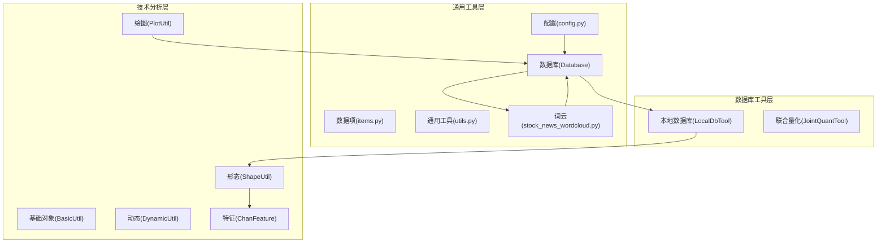
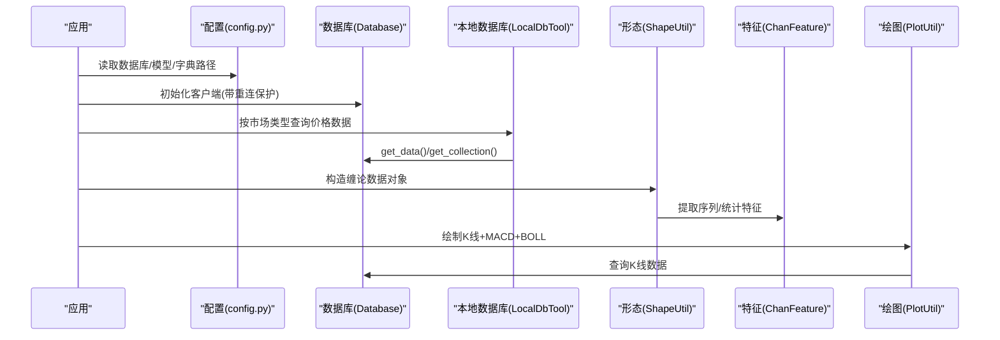
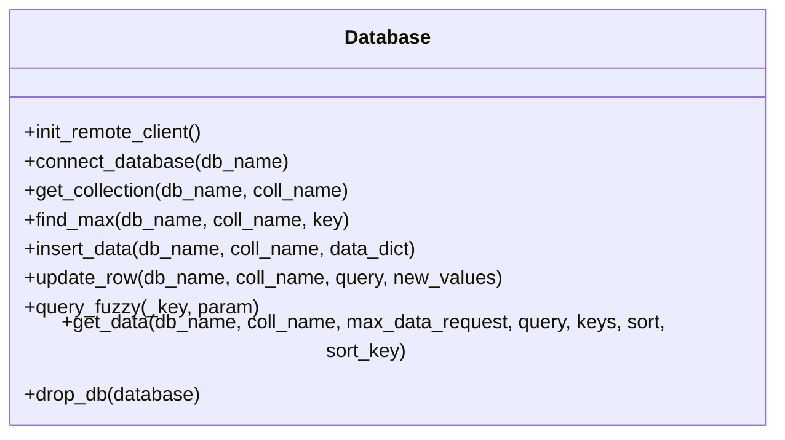
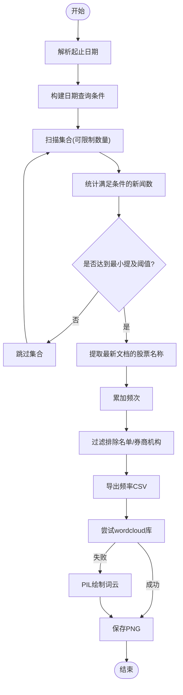
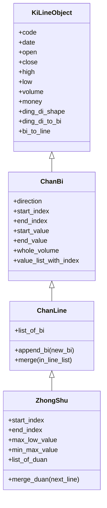
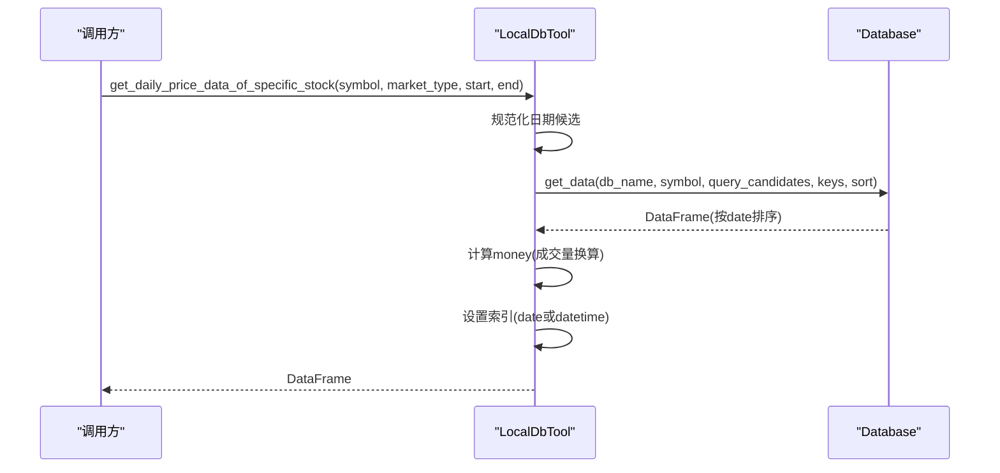
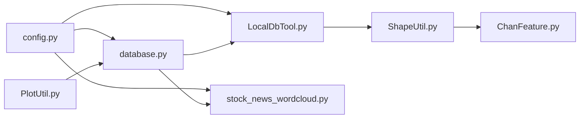

# 工具类库

<cite>
**本文引用的文件**
- [config.py](file://src/Utils/config.py)
- [database.py](file://src/Utils/database.py)
- [items.py](file://src/Utils/items.py)
- [utils.py](file://src/Utils/utils.py)
- [stock_news_wordcloud.py](file://src/Utils/stock_news_wordcloud.py)
- [LocalDbTool.py](file://src/MongoDbComTools/LocalDbTool.py)
- [JointQuantTool.py](file://src/MongoDbComTools/JointQuantTool.py)
- [BasicUtil.py](file://src/ChanUtils/BasicUtil.py)
- [PlotUtil.py](file://src/ChanUtils/PlotUtil.py)
- [DynamicUtil.py](file://src/ChanUtils/DynamicUtil.py)
- [ShapeUtil.py](file://src/ChanUtils/ShapeUtil.py)
- [ChanFeature.py](file://src/ChanUtils/ChanFeature.py)
- [README.md](file://README.md)
</cite>

## 目录
1. [简介](#简介)
2. [项目结构](#项目结构)
3. [核心组件](#核心组件)
4. [架构总览](#架构总览)
5. [详细组件分析](#详细组件分析)
6. [依赖关系分析](#依赖关系分析)
7. [性能考量](#性能考量)
8. [故障排查指南](#故障排查指南)
9. [结论](#结论)
10. [附录](#附录)

## 简介
本工具类库面向量化与金融文本分析场景，提供配置管理、数据库连接、通用工具函数、词云生成、技术分析数据结构与可视化等能力。文档将系统讲解各模块的设计思想、实现要点、使用方式与最佳实践，帮助开发者高效复用与扩展。

## 项目结构
项目采用按功能域分层的模块化组织：
- Utils：通用配置、数据库、数据项定义、通用工具、词云生成
- MongoDbComTools：本地数据库工具与联合量化工具
- ChanUtils：缠论技术分析数据结构、绘图与特征工程
- 其他目录包含爬虫、NLP模型、回测框架等业务模块

图表来源
- [config.py:1-455](file://src/Utils/config.py#L1-L455)
- [database.py:1-176](file://src/Utils/database.py#L1-L176)
- [LocalDbTool.py:1-288](file://src/MongoDbComTools/LocalDbTool.py#L1-L288)
- [JointQuantTool.py:1-51](file://src/MongoDbComTools/JointQuantTool.py#L1-L51)
- [BasicUtil.py:1-695](file://src/ChanUtils/BasicUtil.py#L1-L695)
- [PlotUtil.py:1-150](file://src/ChanUtils/PlotUtil.py#L1-L150)
- [DynamicUtil.py:1-141](file://src/ChanUtils/DynamicUtil.py#L1-L141)
- [ShapeUtil.py:1-800](file://src/ChanUtils/ShapeUtil.py#L1-L800)
- [ChanFeature.py:1-325](file://src/ChanUtils/ChanFeature.py#L1-L325)
- [stock_news_wordcloud.py:1-371](file://src/Utils/stock_news_wordcloud.py#L1-L371)

章节来源
- [README.md:1-33](file://README.md#L1-L33)

## 核心组件
- 配置管理：集中管理数据库、爬虫站点、字典路径、模型路径等全局常量与默认行为
- 数据库连接：封装MongoDB客户端初始化、重连保护、查询与写入接口
- 通用工具：日期、停用词、邮件、稀疏矩阵转换、训练集切分等常用函数
- 词云生成：基于MongoDB新闻数据统计股票名称频次，生成可视化词云
- 技术分析：缠论K线、笔、线段、中枢对象与绘图、MACD/BOLL叠加、特征工程
- 本地数据库工具：跨市场（A/H/US）价格数据加载、聚合与标准化
- 联合量化工具：账户认证与全市场股票清单获取

章节来源
- [config.py:1-455](file://src/Utils/config.py#L1-L455)
- [database.py:1-176](file://src/Utils/database.py#L1-L176)
- [utils.py:1-251](file://src/Utils/utils.py#L1-L251)
- [stock_news_wordcloud.py:1-371](file://src/Utils/stock_news_wordcloud.py#L1-L371)
- [BasicUtil.py:1-695](file://src/ChanUtils/BasicUtil.py#L1-L695)
- [PlotUtil.py:1-150](file://src/ChanUtils/PlotUtil.py#L1-L150)
- [LocalDbTool.py:1-288](file://src/MongoDbComTools/LocalDbTool.py#L1-L288)
- [JointQuantTool.py:1-51](file://src/MongoDbComTools/JointQuantTool.py#L1-L51)

## 架构总览
整体架构围绕“配置—数据库—工具—分析—可视化”的链路展开，强调模块解耦与可扩展性。

图表来源
- [config.py:1-455](file://src/Utils/config.py#L1-L455)
- [database.py:1-176](file://src/Utils/database.py#L1-L176)
- [LocalDbTool.py:1-288](file://src/MongoDbComTools/LocalDbTool.py#L1-L288)
- [ShapeUtil.py:1-800](file://src/ChanUtils/ShapeUtil.py#L1-L800)
- [ChanFeature.py:1-325](file://src/ChanUtils/ChanFeature.py#L1-L325)
- [PlotUtil.py:1-150](file://src/ChanUtils/PlotUtil.py#L1-L150)

## 详细组件分析

### 配置管理系统
- 设计要点
  - 平台检测与默认参数：根据操作系统选择MongoDB/Redis/ChromeDriver路径
  - 数据库命名与集合命名：统一管理A/H/US市场数据库与集合
  - 爬虫站点配置：聚合多家新闻源的数据库名、列表与默认页数
  - 机器学习资源：用户自定义词典、停用词、模型文件路径
  - 大模型路径：本地/远程推理路径与设备类型
- 使用建议
  - 将敏感信息（如账号密码）通过加密存储并在运行时解密
  - 通过环境变量覆盖默认值，便于CI/CD与多环境部署
  - 将站点配置集中在一个字典中，便于动态扩展

章节来源
- [config.py:1-455](file://src/Utils/config.py#L1-L455)

### 数据库连接工具（Database）
- 设计模式
  - 单例式客户端持有：避免重复初始化
  - 自动重连装饰器：指数退避策略应对瞬时断连
  - 查询封装：支持键过滤、排序、最大条数限制、空结果告警
- 关键接口
  - 初始化客户端：含超时与连接池参数
  - 获取集合：按库名/集合名定位
  - 查询与写入：find_max、insert_data、update_row、get_data
  - 模糊查询：基于正则表达式的键匹配
- 最佳实践
  - 对外暴露统一入口，内部封装异常与日志
  - 对批量写入使用pymongo的批量接口提升吞吐
  - 对高频查询建立索引，避免全表扫描

图表来源
- [database.py:36-176](file://src/Utils/database.py#L36-L176)

章节来源
- [database.py:1-176](file://src/Utils/database.py#L1-L176)

### 数据模型定义（Items）
- 设计要点
  - 基于Scrapy Item/Field定义新闻条目字段
  - 字段覆盖URL、日期、标题、正文、相关股票、分类、标签、情感分等
- 使用建议
  - 与爬虫Pipeline配合，保证入库字段一致性
  - 对缺失字段进行默认值填充或告警

章节来源
- [items.py:1-18](file://src/Utils/items.py#L1-L18)

### 实用工具函数（Utils）
- 功能概览
  - 日志与邮件：统一日志格式、SMTP发送附件
  - 显示控制：pandas显示选项设置
  - 字符串与日期：中文字符统计、日期范围生成、日期偏移
  - 网页解析：BeautifulSoup解析、最大页码探测
  - 停用词：从目录批量加载中文停用词
  - 稀疏矩阵：将模型向量转为CSR矩阵
  - 训练集切分：随机划分训练/测试集
  - Redis批处理：pipeline批量读取与修剪
- 性能与健壮性
  - 正则与BeautifulSoup解析需注意编码与异常
  - 批处理函数建议结合队列与限流

章节来源
- [utils.py:1-251](file://src/Utils/utils.py#L1-L251)

### 词云生成工具（Stock News WordCloud）
- 实现原理
  - 时间范围查询：按中文日期范围过滤新闻
  - 名称频率统计：遍历集合，统计股票名称出现次数
  - 过滤规则：排除特定名称、可选排除券商机构
  - 可视化：优先使用wordcloud库；失败则回退到PIL绘制
- 关键流程

图表来源
- [stock_news_wordcloud.py:81-371](file://src/Utils/stock_news_wordcloud.py#L81-L371)

章节来源
- [stock_news_wordcloud.py:1-371](file://src/Utils/stock_news_wordcloud.py#L1-L371)

### 技术分析数据结构与可视化（ChanUtils）
- 基础对象
  - K线对象：封装开盘/收盘/最高/最低/成交量/时间等
  - 笔/线段/中枢：定义方向、索引、值序列与合并规则
- 形态识别与合并
  - 顶底分型识别：基于三K线极值判定
  - 包含关系处理：向上/向下合并，确保笔与线段连续性
  - 中枢生成：三线段连续包含形成中枢，支持合并与扩展
- 绘图与指标
  - MACD/BOLL叠加：基于mplfinance绘制K线与副图
  - 交叉信号：MACD金叉/死叉识别
- 特征工程
  - 序列特征：方向、长度、角度、成交量占比、子区间的MACD/HIST累积
  - 统计特征：笔/线段均值/方差/标准差，中枢长度/区间/强度
  - 行业/概念嵌入：one-hot编码作为外部特征

图表来源
- [BasicUtil.py:10-695](file://src/ChanUtils/BasicUtil.py#L10-L695)

章节来源
- [BasicUtil.py:1-695](file://src/ChanUtils/BasicUtil.py#L1-L695)
- [ShapeUtil.py:1-800](file://src/ChanUtils/ShapeUtil.py#L1-L800)
- [PlotUtil.py:1-150](file://src/ChanUtils/PlotUtil.py#L1-L150)
- [ChanFeature.py:1-325](file://src/ChanUtils/ChanFeature.py#L1-L325)

### 本地数据库工具（LocalDbTool）
- 设计要点
  - 跨市场统一接口：A/H/US三类市场集合映射
  - 日期查询候选：支持多种日期格式与规范化
  - 价格数据聚合：周线聚合、资金量计算
- 关键流程

图表来源
- [LocalDbTool.py:226-277](file://src/MongoDbComTools/LocalDbTool.py#L226-L277)
- [database.py:94-172](file://src/Utils/database.py#L94-L172)

章节来源
- [LocalDbTool.py:1-288](file://src/MongoDbComTools/LocalDbTool.py#L1-L288)

### 联合量化工具（JointQuantTool）
- 设计要点
  - 账户认证：使用Fernet解密密文登录
  - 显示控制：pandas全局显示选项
  - 股票清单：获取全市场股票列表
- 最佳实践
  - 将密钥与版本信息纳入配置管理
  - 控制查询配额，避免超额调用

章节来源
- [JointQuantTool.py:1-51](file://src/MongoDbComTools/JointQuantTool.py#L1-L51)

## 依赖关系分析
- 模块内聚与耦合
  - Utils层相对独立，仅依赖配置与pymongo
  - ChanUtils层内部高度内聚，对外通过数据对象交互
  - LocalDbTool依赖Database与配置，提供跨市场统一访问
- 外部依赖
  - 数据库：pymongo、Fernet
  - 可视化：mplfinance、wordcloud、PIL
  - 数值与文本：pandas、numpy、scipy、jieba、requests、BeautifulSoup
- 潜在循环依赖
  - 未发现直接循环导入；若新增模块需避免双向引用

图表来源
- [config.py:1-455](file://src/Utils/config.py#L1-L455)
- [database.py:1-176](file://src/Utils/database.py#L1-L176)
- [LocalDbTool.py:1-288](file://src/MongoDbComTools/LocalDbTool.py#L1-L288)
- [stock_news_wordcloud.py:1-371](file://src/Utils/stock_news_wordcloud.py#L1-L371)
- [ShapeUtil.py:1-800](file://src/ChanUtils/ShapeUtil.py#L1-L800)
- [ChanFeature.py:1-325](file://src/ChanUtils/ChanFeature.py#L1-L325)
- [PlotUtil.py:1-150](file://src/ChanUtils/PlotUtil.py#L1-L150)

## 性能考量
- 数据库
  - 使用连接池与合理的超时设置，避免阻塞
  - 对高频查询建立索引（如日期、股票代码）
  - 批量写入使用pymongo的批量接口
- 计算密集
  - 特征工程与绘图建议分步执行，避免一次性加载过多数据
  - 对大型DataFrame操作使用向量化与分块处理
- I/O
  - 词云生成建议先导出频率CSV，再离线渲染图片
  - 网络请求增加重试与超时控制

## 故障排查指南
- 数据库连接失败
  - 检查IP/端口、认证信息与防火墙
  - 查看自动重连日志，确认退避策略是否生效
- 查询为空
  - 核对集合名与数据库名大小写
  - 检查查询条件与键过滤是否正确
- 词云生成异常
  - 确认MongoDB中存在目标数据库与集合
  - 检查日期范围与最小提及阈值
  - 缺少字体时回退到PIL，确保输出目录可写
- 绘图异常
  - 确保mplfinance与依赖库安装完整
  - 检查DataFrame索引与日期格式

章节来源
- [database.py:15-33](file://src/Utils/database.py#L15-L33)
- [stock_news_wordcloud.py:290-371](file://src/Utils/stock_news_wordcloud.py#L290-L371)
- [PlotUtil.py:127-150](file://src/ChanUtils/PlotUtil.py#L127-L150)

## 结论
本工具类库通过清晰的分层与模块化设计，提供了从配置、数据库、通用工具到技术分析与可视化的完整能力。建议在实际项目中遵循以下原则：
- 将敏感配置与密文分离，使用环境变量与加密存储
- 对数据库访问进行统一抽象，封装异常与重试
- 对特征工程与可视化进行模块化与参数化，便于复用与扩展
- 通过单元测试与集成测试保障关键路径稳定性

## 附录
- 使用示例（路径指引）
  - 词云生成：参考 [stock_news_wordcloud.py:290-371](file://src/Utils/stock_news_wordcloud.py#L290-L371)
  - 数据库查询：参考 [database.py:94-172](file://src/Utils/database.py#L94-L172)
  - 技术分析绘图：参考 [PlotUtil.py:127-150](file://src/ChanUtils/PlotUtil.py#L127-L150)
  - 本地数据库查询：参考 [LocalDbTool.py:226-277](file://src/MongoDbComTools/LocalDbTool.py#L226-L277)
  - 特征工程：参考 [ChanFeature.py:64-183](file://src/ChanUtils/ChanFeature.py#L64-L183)