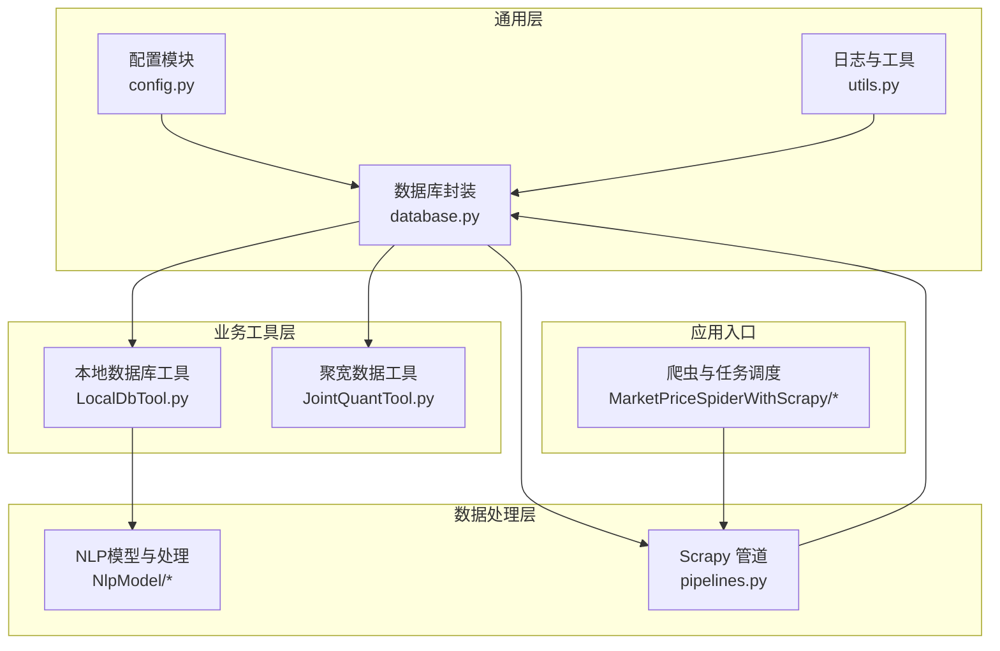
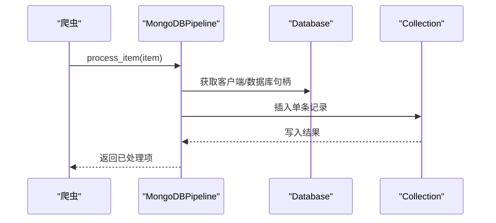
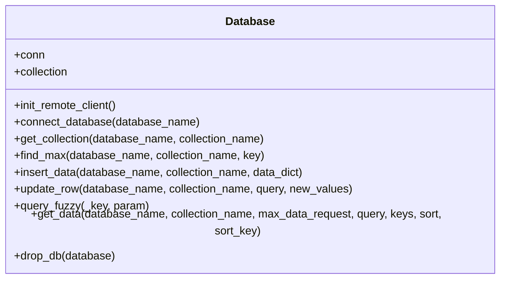
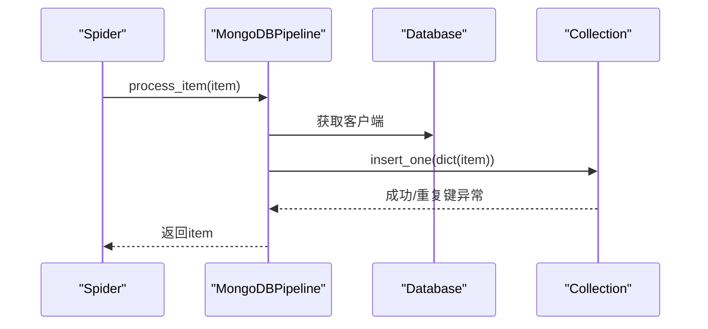
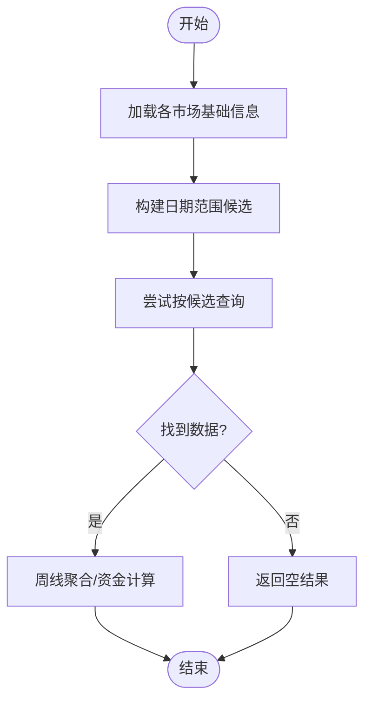
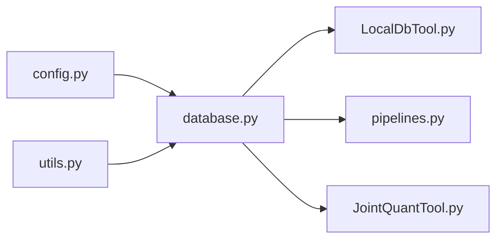

# 数据库连接工具

<cite>
**本文引用的文件**
- [database.py](file://src/Utils/database.py)
- [config.py](file://src/Utils/config.py)
- [LocalDbTool.py](file://src/MongoDbComTools/LocalDbTool.py)
- [JointQuantTool.py](file://src/MongoDbComTools/JointQuantTool.py)
- [pipelines.py](file://src/pipelines.py)
- [utils.py](file://src/Utils/utils.py)
- [README.md](file://README.md)
</cite>

## 目录
1. [简介](#简介)
2. [项目结构](#项目结构)
3. [核心组件](#核心组件)
4. [架构总览](#架构总览)
5. [详细组件分析](#详细组件分析)
6. [依赖分析](#依赖分析)
7. [性能考虑](#性能考虑)
8. [故障排查指南](#故障排查指南)
9. [结论](#结论)
10. [附录](#附录)

## 简介
本文件面向“数据库连接工具”的综合技术文档，聚焦于数据库连接池的设计与实现、连接方式选择与配置、连接复用与回收策略、安全配置（认证、加密）、异常处理与故障恢复、性能优化与监控，以及实际连接示例与排错建议。当前代码库以 MongoDB 为主要持久化存储，Redis 的使用在部分模块中存在痕迹但未见直接连接实现；因此本文将以 MongoDB 连接为核心进行深入解析，并对 Redis 的潜在集成点给出建议与注意事项。

## 项目结构
该项目采用分层与功能域结合的组织方式：
- Utils：通用工具与基础设施，包含数据库连接封装、配置读取、日志与通用函数
- MongoDbComTools：MongoDB 相关的通用工具与数据处理逻辑
- NlpModel：自然语言处理与情感分析模块，依赖数据库工具进行数据读写
- MarketPriceSpiderWithScrapy：股票价格爬虫，使用数据库管道进行入库
- Pipelines：Scrapy 管道，负责将爬取结果写入 MongoDB
- 第三方工具与数据：包含外部数据源访问与本地数据工具

图表来源
- [config.py:13-25](file://src/Utils/config.py#L13-L25)
- [database.py:36-60](file://src/Utils/database.py#L36-L60)
- [LocalDbTool.py:10-44](file://src/MongoDbComTools/LocalDbTool.py#L10-L44)
- [JointQuantTool.py:11-34](file://src/MongoDbComTools/JointQuantTool.py#L11-L34)
- [pipelines.py:8-22](file://src/pipelines.py#L8-L22)

章节来源
- [README.md:1-33](file://README.md#L1-L33)
- [config.py:13-25](file://src/Utils/config.py#L13-L25)

## 核心组件
- 数据库连接封装（Database）：提供 MongoDB 客户端初始化、集合获取、查询与写入、自动重连保护等能力
- 配置模块（config）：集中管理数据库地址、端口、数据库名称、加密密钥等
- Scrapy 管道（MongoDBPipeline）：统一将爬虫产出写入对应数据库与集合
- 本地数据库工具（LocalDbTool）：按市场类型加载股票基础信息与价格序列，支持日期范围查询与聚合
- 聚宽数据工具（JointQuantTool）：使用加密凭证对接第三方数据源（聚宽），与数据库工具配合进行数据准备

章节来源
- [database.py:36-176](file://src/Utils/database.py#L36-L176)
- [config.py:13-50](file://src/Utils/config.py#L13-L50)
- [pipelines.py:8-56](file://src/pipelines.py#L8-L56)
- [LocalDbTool.py:10-276](file://src/MongoDbComTools/LocalDbTool.py#L10-L276)
- [JointQuantTool.py:11-34](file://src/MongoDbComTools/JointQuantTool.py#L11-L34)

## 架构总览
整体架构围绕“配置驱动 + 数据库封装 + 管道写入”的模式展开。数据库封装屏蔽底层连接细节，提供统一的查询与写入接口；Scrapy 管道在数据流末端完成落库；业务工具通过封装好的数据库对象进行数据读取与处理。

图表来源
- [pipelines.py:25-56](file://src/pipelines.py#L25-L56)
- [database.py:62-69](file://src/Utils/database.py#L62-L69)

## 详细组件分析

### 组件A：数据库连接封装（Database）
- 设计要点
  - 使用装饰器对可能触发自动重连的数据库操作进行保护，避免因瞬时网络抖动导致任务失败
  - 初始化客户端时设置连接池上限与服务器选择超时，兼顾并发与可用性
  - 提供集合获取、插入、更新、模糊查询、最大值查询、排序导出等常用方法
- 关键实现路径
  - 自动重连保护装饰器：[graceful_auto_reconnect:15-33](file://src/Utils/database.py#L15-L33)
  - 客户端初始化与连接池参数：[init_remote_client:44-60](file://src/Utils/database.py#L44-L60)
  - 查询与导出为 DataFrame 的主流程：[get_data:94-172](file://src/Utils/database.py#L94-L172)
  - 写入与更新接口：[insert_data:78-80](file://src/Utils/database.py#L78-L80)、[update_row:82-88](file://src/Utils/database.py#L82-L88)

图表来源
- [database.py:36-176](file://src/Utils/database.py#L36-L176)

章节来源
- [database.py:15-176](file://src/Utils/database.py#L15-L176)

### 组件B：配置模块（config）
- 设计要点
  - 集中式管理数据库 IP、端口、数据库名称、爬虫与模型相关常量
  - 通过平台检测控制开发环境下的连接目标（本地或远程）
  - 提供加密密钥用于解密敏感凭证
- 关键实现路径
  - 数据库地址与端口：[MONGODB_IP/MONGODB_PORT:13-16](file://src/Utils/config.py#L13-L16)
  - 平台检测与默认值：[os_type/GPU_MODE:6-9](file://src/Utils/config.py#L6-L9)
  - 加密密钥：[cipher_key](file://src/Utils/config.py#L25)

章节来源
- [config.py:6-25](file://src/Utils/config.py#L6-L25)

### 组件C：Scrapy 管道（MongoDBPipeline）
- 设计要点
  - 在管道初始化阶段持有数据库客户端与多个目标数据库句柄
  - 根据爬虫名称映射到对应的集合，执行单条插入
  - 对重复键冲突进行静默跳过，保证幂等性
- 关键实现路径
  - 管道构造与数据库绑定：[MongoDBPipeline.__init__:8-22](file://src/pipelines.py#L8-L22)
  - 插入逻辑与去重处理：[process_item/insert_item:25-56](file://src/pipelines.py#L25-L56)

图表来源
- [pipelines.py:25-56](file://src/pipelines.py#L25-L56)
- [database.py:62-69](file://src/Utils/database.py#L62-L69)

章节来源
- [pipelines.py:8-56](file://src/pipelines.py#L8-L56)

### 组件D：本地数据库工具（LocalDbTool）
- 设计要点
  - 通过封装的数据库对象一次性加载多市场基础信息，便于后续查询
  - 支持按日期范围构建查询候选，兼容多种日期格式
  - 提供周线聚合、资金换算等衍生计算
- 关键实现路径
  - 初始化与基础信息加载：[LocalDbTool.__init__:10-31](file://src/MongoDbComTools/LocalDbTool.py#L10-L31)
  - 日期候选生成与查询构建：[get_daily_price_data_of_specific_stock:226-276](file://src/MongoDbComTools/LocalDbTool.py#L226-L276)

图表来源
- [LocalDbTool.py:217-276](file://src/MongoDbComTools/LocalDbTool.py#L217-L276)

章节来源
- [LocalDbTool.py:10-276](file://src/MongoDbComTools/LocalDbTool.py#L10-L276)

### 组件E：聚宽数据工具（JointQuantTool）
- 设计要点
  - 使用加密凭证对接第三方数据源（聚宽），完成认证与查询配额信息获取
  - 与数据库工具配合，将外部数据导入本地数据库
- 关键实现路径
  - 凭证解密与认证：[__init_account:26-34](file://src/MongoDbComTools/JointQuantTool.py#L26-L34)
  - 获取全市场标的：[get_all_stock:36-38](file://src/MongoDbComTools/JointQuantTool.py#L36-L38)

章节来源
- [JointQuantTool.py:11-38](file://src/MongoDbComTools/JointQuantTool.py#L11-L38)

## 依赖分析
- 组件耦合
  - Database 作为核心依赖被 LocalDbTool、MongoDBPipeline、JointQuantTool 复用
  - config 为 Database 提供运行时配置，同时被其他模块共享
  - pipelines 依赖 Database 与 config，形成数据流末端的落库通道
- 外部依赖
  - MongoDB 官方 Python 驱动（pymongo）
  - 加密库（cryptography.fernet）用于凭证解密
  - pandas 用于查询结果转 DataFrame
- 潜在循环依赖
  - 当前模块间为单向依赖，未发现循环导入

图表来源
- [config.py:13-25](file://src/Utils/config.py#L13-L25)
- [database.py:36-60](file://src/Utils/database.py#L36-L60)
- [LocalDbTool.py:3-4](file://src/MongoDbComTools/LocalDbTool.py#L3-L4)
- [pipelines.py:3-4](file://src/pipelines.py#L3-L4)
- [JointQuantTool.py:5-6](file://src/MongoDbComTools/JointQuantTool.py#L5-L6)

章节来源
- [database.py:1-11](file://src/Utils/database.py#L1-L11)
- [config.py:1-10](file://src/Utils/config.py#L1-L10)

## 性能考虑
- 连接池与并发
  - 已设置连接池上限，避免过度并发导致资源争用
  - 建议根据业务 QPS 与 MongoDB 实例规格调整 maxPoolSize
- 查询与导出
  - 导出为 DataFrame 前可先进行投影与限制数量，减少内存占用
  - 对大结果集建议分页或游标迭代，避免一次性加载
- 写入策略
  - 使用批量写入（如 insert_many）替代逐条插入，降低网络往返
  - 对重复键冲突采用幂等策略，避免重复写入
- 索引与排序
  - 对高频查询字段建立索引，减少排序与过滤成本
- 缓存与预热
  - 常用基础信息可在进程启动时预加载，减少重复查询

## 故障排查指南
- 自动重连与退避
  - 当出现自动重连异常时，系统会按指数退避等待后重试，建议检查网络稳定性与 MongoDB 可用性
  - 关注日志中的重连警告，定位网络抖动或超时问题
- 写入冲突
  - DuplicateKeyError 会被捕获并忽略，确保数据幂等；若需更新，应改为 upsert 或先查后改
- 查询为空
  - 若查询返回空，检查数据库名、集合名与查询条件是否正确
- 凭证与加密
  - 解密失败通常源于密钥不匹配或密文损坏，确认 config.cipher_key 与加密存储一致
- Redis 集成现状
  - 代码中存在 Redis 相关变量与标志位，但未见实际连接实现；如需启用，请补充连接与命令封装

章节来源
- [database.py:15-33](file://src/Utils/database.py#L15-L33)
- [pipelines.py:48-56](file://src/pipelines.py#L48-L56)
- [config.py](file://src/Utils/config.py#L25)

## 结论
本项目的数据库连接工具以“配置驱动 + 装饰器保护 + 统一封装”为核心，实现了 MongoDB 的稳定接入与高效使用。通过连接池参数、自动重连与退避、幂等写入与查询导出等机制，满足了爬虫与分析场景下的高可用与高性能需求。对于 Redis 的潜在集成，建议在现有封装基础上补充连接与命令层，确保与现有工具链一致。

## 附录

### 数据库连接方式与配置建议
- MongoDB
  - 连接参数：服务器选择超时、连接池上限、认证（如需）、TLS（如需）
  - 建议开启认证与 TLS，生产环境务必启用
  - 合理设置 maxPoolSize 与连接生命周期，避免连接泄漏
- Redis（待实现）
  - 如需启用，建议使用连接池与超时配置，统一在工具层封装
  - 注意区分读写分离与缓存失效策略

### 安全配置清单
- 凭证加密
  - 使用对称加密存储用户名与密码，运行时解密
  - 密钥管理：最小权限、定期轮换、离线存储
- 认证与授权
  - 启用数据库认证，按最小权限分配角色
- 传输安全
  - 生产环境启用 TLS/SSL，校验证书
- 网络隔离
  - 将数据库置于内网或专用子网，限制访问来源

### 性能优化与监控
- 连接池
  - 动态调整 maxPoolSize，结合慢查询日志评估
- 查询优化
  - 建立必要索引，避免全表扫描
  - 分页与投影，减少网络与内存开销
- 监控指标
  - 连接池利用率、平均响应时间、错误率、重试次数
  - 建议接入数据库自带监控或第三方 APM

### 实际连接示例与路径
- 初始化数据库客户端与获取集合
  - [Database.init_remote_client:44-60](file://src/Utils/database.py#L44-L60)
  - [Database.get_collection:65-69](file://src/Utils/database.py#L65-L69)
- 通过管道写入
  - [MongoDBPipeline.process_item:25-46](file://src/pipelines.py#L25-L46)
- 本地工具查询与导出
  - [LocalDbTool.get_daily_price_data_of_specific_stock:226-276](file://src/MongoDbComTools/LocalDbTool.py#L226-L276)
- 聚宽认证与数据获取
  - [JointQuantTool.__init_account:26-34](file://src/MongoDbComTools/JointQuantTool.py#L26-L34)