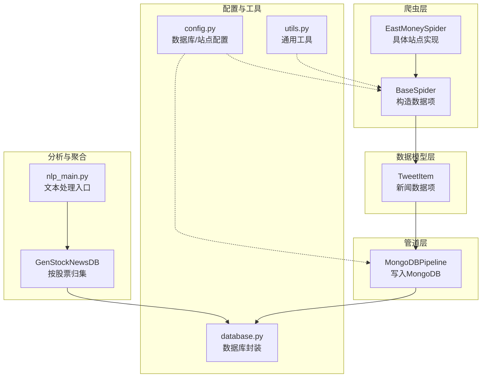
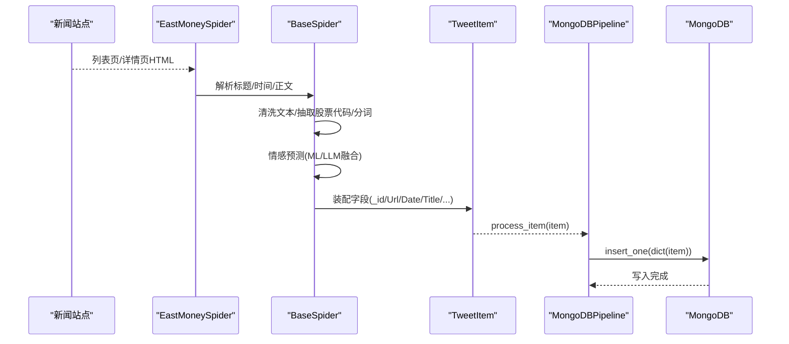
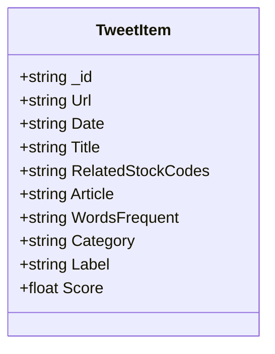
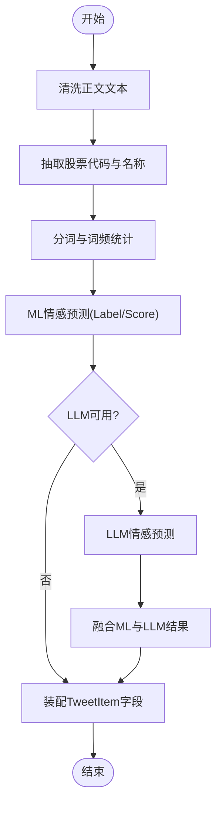
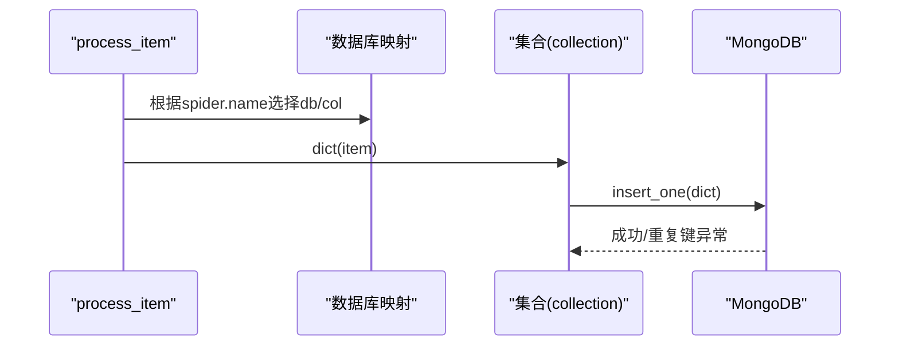
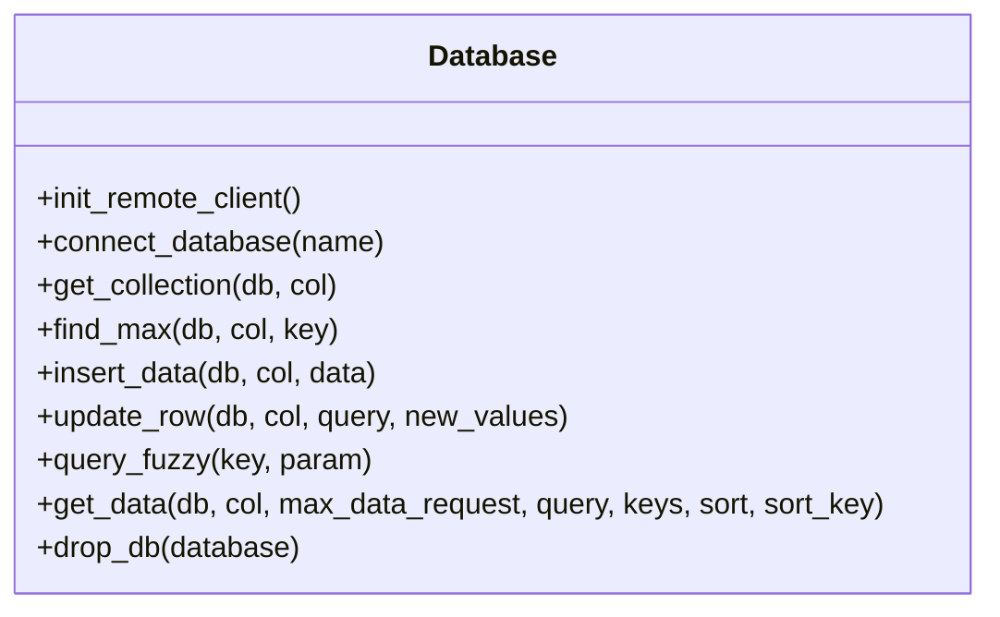
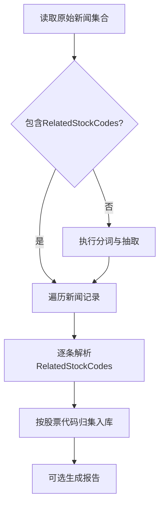
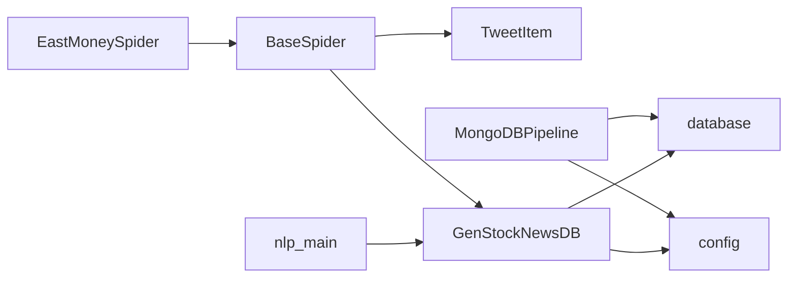

# 数据模型定义

<cite>
**本文引用的文件**
- [src/Utils/items.py](file://src/Utils/items.py)
- [src/MarketNewsSpiderWithScrapy/BaseSpider.py](file://src/MarketNewsSpiderWithScrapy/BaseSpider.py)
- [src/MarketNewsSpiderWithScrapy/east_money_spider.py](file://src/MarketNewsSpiderWithScrapy/east_money_spider.py)
- [src/pipelines.py](file://src/pipelines.py)
- [src/Utils/database.py](file://src/Utils/database.py)
- [src/Utils/config.py](file://src/Utils/config.py)
- [src/MongoDbComTools/BuildStockNewsDb.py](file://src/MongoDbComTools/BuildStockNewsDb.py)
- [src/NlpModel/nlp_main.py](file://src/NlpModel/nlp_main.py)
- [src/Utils/utils.py](file://src/Utils/utils.py)
- [src/settings.py](file://src/settings.py)
</cite>

## 目录
1. [引言](#引言)
2. [项目结构](#项目结构)
3. [核心组件](#核心组件)
4. [架构总览](#架构总览)
5. [详细组件分析](#详细组件分析)
6. [依赖分析](#依赖分析)
7. [性能考虑](#性能考虑)
8. [故障排查指南](#故障排查指南)
9. [结论](#结论)
10. [附录](#附录)

## 引言
本文件系统性阐述本项目的数据模型设计与实现，重点围绕 Scrapy 数据项模型、字段语义与约束、序列化与持久化、以及在爬虫与分析流程中的应用。当前仓库采用 Scrapy 的 Item 作为统一数据载体，配合管道（Pipeline）将数据写入 MongoDB；同时，新闻文本经自然语言处理模块进行情感打分与股票代码抽取，最终汇聚到按股票维度的统一新闻数据库，支撑后续量化分析与回测。

## 项目结构
项目采用“爬虫 + 数据模型 + 管道 + 分析工具”的分层组织方式：
- 数据模型层：位于 Utils/items.py，定义新闻数据项结构。
- 爬虫层：位于 MarketNewsSpiderWithScrapy，继承自 BaseSpider，负责从各站点抓取并构造数据项。
- 管道层：位于 pipelines.py，负责将数据项写入 MongoDB。
- 工具与配置：Utils/config.py 提供数据库与爬虫配置；Utils/database.py 提供数据库访问封装；Utils/utils.py 提供通用工具函数。
- 分析与聚合：MongoDbComTools/BuildStockNewsDb.py 负责将多源新闻按股票维度归集；NlpModel/nlp_main.py 展示了文本分类与特征工程的入口。

图表来源
- [src/MarketNewsSpiderWithScrapy/BaseSpider.py:13-149](file://src/MarketNewsSpiderWithScrapy/BaseSpider.py#L13-L149)
- [src/MarketNewsSpiderWithScrapy/east_money_spider.py:5-78](file://src/MarketNewsSpiderWithScrapy/east_money_spider.py#L5-L78)
- [src/Utils/items.py:5-17](file://src/Utils/items.py#L5-L17)
- [src/pipelines.py:8-56](file://src/pipelines.py#L8-L56)
- [src/Utils/config.py:39-450](file://src/Utils/config.py#L39-L450)
- [src/Utils/database.py:36-176](file://src/Utils/database.py#L36-L176)
- [src/MongoDbComTools/BuildStockNewsDb.py:19-241](file://src/MongoDbComTools/BuildStockNewsDb.py#L19-L241)
- [src/NlpModel/nlp_main.py:17-70](file://src/NlpModel/nlp_main.py#L17-L70)

章节来源
- [src/Utils/items.py:1-18](file://src/Utils/items.py#L1-L18)
- [src/MarketNewsSpiderWithScrapy/BaseSpider.py:1-149](file://src/MarketNewsSpiderWithScrapy/BaseSpider.py#L1-L149)
- [src/MarketNewsSpiderWithScrapy/east_money_spider.py:1-78](file://src/MarketNewsSpiderWithScrapy/east_money_spider.py#L1-L78)
- [src/pipelines.py:1-56](file://src/pipelines.py#L1-L56)
- [src/Utils/config.py:1-455](file://src/Utils/config.py#L1-L455)
- [src/Utils/database.py:1-176](file://src/Utils/database.py#L1-L176)
- [src/MongoDbComTools/BuildStockNewsDb.py:1-241](file://src/MongoDbComTools/BuildStockNewsDb.py#L1-L241)
- [src/NlpModel/nlp_main.py:1-70](file://src/NlpModel/nlp_main.py#L1-L70)
- [src/Utils/utils.py:1-251](file://src/Utils/utils.py#L1-L251)
- [src/settings.py:1-49](file://src/settings.py#L1-L49)

## 核心组件
- 新闻数据项模型 TweetItem
  - 字段定义与职责
    - _id：唯一标识，采用 URL 的 MD5 哈希，确保去重与快速检索。
    - Url：新闻原文链接。
    - Date：新闻发布时间（字符串或可解析时间格式）。
    - Title：新闻标题。
    - RelatedStockCodes：JSON 字符串，存储文章中识别到的股票名称与代码映射。
    - Article：新闻正文，清洗后的纯文本。
    - WordsFrequent：分词与词频统计结果（JSON 字符串）。
    - Category：新闻来源或分类标签（如“头条”、“市场数据”等）。
    - Label：情感标签（利好/利空）。
    - Score：情感得分（0~1，数值越大越偏向利好）。
  - 设计原则
    - 统一性：所有爬虫产出的数据项遵循同一结构，便于后续聚合与分析。
    - 可扩展性：新增字段可通过继承或扩展字典形式实现，不影响现有流程。
    - 可序列化：字段均为基本类型或 JSON 可序列化结构，适配 Scrapy 与 MongoDB。
  - 字段约束与校验建议
    - _id：必须唯一；MD5 哈希保证稳定性。
    - Url：需为有效链接；建议在爬取阶段进行格式校验。
    - Date：建议统一为 ISO 8601 或 YYYY-MM-DD 格式；入库前进行解析与校验。
    - RelatedStockCodes/WordsFrequent：建议为 JSON 字符串，入库前进行 JSON 解析校验。
    - Label：限定枚举值（利好/利空）；Score：限定范围 [0,1]。
    - Category/Title/Article：长度与字符集控制，避免异常字符导致写入失败。

- 爬虫与数据项构造
  - BaseSpider 提供统一的文本清洗、股票代码抽取、情感打分与数据项装配逻辑。
  - 具体站点（如 EastMoneySpider）仅负责列表页与详情页解析，最终调用 from_playInfos_to_item/from_paragraphs_to_item 生成 TweetItem。
  - 情感打分融合 ML 与 LLM 结果，输出 Label 与 Score。

- 管道与持久化
  - MongoDBPipeline 根据爬虫名称选择目标数据库与集合，将数据项转换为字典后写入 MongoDB。
  - 使用 insert_one 写入，捕获重复键异常以避免重复入库。

- 数据库与配置
  - config.py 定义各站点对应的数据库名、集合名、爬虫参数等。
  - database.py 提供数据库连接、查询、插入、更新等封装，含自动重连装饰器。

章节来源
- [src/Utils/items.py:5-17](file://src/Utils/items.py#L5-L17)
- [src/MarketNewsSpiderWithScrapy/BaseSpider.py:41-146](file://src/MarketNewsSpiderWithScrapy/BaseSpider.py#L41-L146)
- [src/MarketNewsSpiderWithScrapy/east_money_spider.py:21-77](file://src/MarketNewsSpiderWithScrapy/east_money_spider.py#L21-L77)
- [src/pipelines.py:25-56](file://src/pipelines.py#L25-L56)
- [src/Utils/config.py:55-450](file://src/Utils/config.py#L55-L450)
- [src/Utils/database.py:36-176](file://src/Utils/database.py#L36-L176)

## 架构总览
下图展示了从站点爬取到数据入库与后续聚合的端到端流程：

图表来源
- [src/MarketNewsSpiderWithScrapy/east_money_spider.py:21-77](file://src/MarketNewsSpiderWithScrapy/east_money_spider.py#L21-L77)
- [src/MarketNewsSpiderWithScrapy/BaseSpider.py:41-146](file://src/MarketNewsSpiderWithScrapy/BaseSpider.py#L41-L146)
- [src/pipelines.py:25-56](file://src/pipelines.py#L25-L56)

## 详细组件分析

### 数据模型类图

图表来源
- [src/Utils/items.py:5-17](file://src/Utils/items.py#L5-L17)

章节来源
- [src/Utils/items.py:1-18](file://src/Utils/items.py#L1-L18)

### 爬虫与数据项构造流程
- 文本清洗与抽取
  - 清洗正文中的多余空白与换行，合并为单一文本。
  - 基于股票名称/代码映射字典，从文章中抽取相关股票信息，形成 JSON 字符串存入 RelatedStockCodes。
  - 分词与词频统计结果存入 WordsFrequent。
- 情感打分与融合
  - 先用传统 ML 模型预测 Label 与 Score。
  - 若配置可用 LLM，则对同一文本再次预测，融合两者得到最终 Label 与 Score。
- 数据项装配
  - 生成 _id（URL 的 MD5）、填充 Url/Date/Title/Article/Category 等字段，最终返回 TweetItem。

图表来源
- [src/MarketNewsSpiderWithScrapy/BaseSpider.py:41-146](file://src/MarketNewsSpiderWithScrapy/BaseSpider.py#L41-L146)

章节来源
- [src/MarketNewsSpiderWithScrapy/BaseSpider.py:41-146](file://src/MarketNewsSpiderWithScrapy/BaseSpider.py#L41-L146)

### 管道与持久化序列
- 管道根据爬虫名称动态选择数据库与集合，将数据项转换为字典后写入 MongoDB。
- 写入采用 insert_one，捕获重复键异常以避免重复入库。

图表来源
- [src/pipelines.py:25-56](file://src/pipelines.py#L25-L56)

章节来源
- [src/pipelines.py:1-56](file://src/pipelines.py#L1-L56)

### 数据库封装与查询
- Database 类提供连接、查询、插入、更新等操作，内置自动重连装饰器，提升稳定性。
- 支持按条件查询、模糊查询、排序与导出为 DataFrame。

图表来源
- [src/Utils/database.py:36-176](file://src/Utils/database.py#L36-L176)

章节来源
- [src/Utils/database.py:1-176](file://src/Utils/database.py#L1-L176)

### 多源新闻按股票归集
- GenStockNewsDB 将来自不同站点的新闻按股票维度归集到统一数据库（按股票代码命名的集合）。
- 归集时计算 _id（基于 Date 与 Url 的 MD5），避免重复；可选覆盖 ML 情感打分，生成NewLabel/NewScore。

图表来源
- [src/MongoDbComTools/BuildStockNewsDb.py:157-241](file://src/MongoDbComTools/BuildStockNewsDb.py#L157-L241)

章节来源
- [src/MongoDbComTools/BuildStockNewsDb.py:1-241](file://src/MongoDbComTools/BuildStockNewsDb.py#L1-L241)

### 配置与站点参数
- config.py 定义各站点的数据库名、集合名、起始 URL、关键词、页面范围等。
- settings.py 配置 Scrapy 的并发、下载延迟、中间件与管道等。

章节来源
- [src/Utils/config.py:55-450](file://src/Utils/config.py#L55-L450)
- [src/settings.py:1-49](file://src/settings.py#L1-L49)

## 依赖分析
- 组件耦合
  - BaseSpider 依赖 GenStockNewsDB（信息抽取与情感预测）、TweetItem（数据结构）、utils（通用工具）。
  - 管道依赖 config（数据库/集合映射）与 database（连接与写入）。
  - GenStockNewsDB 依赖 database、config、NLP 模块（信息抽取与情感预测）。
- 外部依赖
  - Scrapy（Item、Spider、Settings、Pipelines）。
  - MongoDB（pymongo）。
  - 自然语言处理（Tokenization、InformationExtract、FinancialSentimentLLM）。

图表来源
- [src/MarketNewsSpiderWithScrapy/BaseSpider.py:13-34](file://src/MarketNewsSpiderWithScrapy/BaseSpider.py#L13-L34)
- [src/MarketNewsSpiderWithScrapy/east_money_spider.py:5-11](file://src/MarketNewsSpiderWithScrapy/east_money_spider.py#L5-L11)
- [src/pipelines.py:8-22](file://src/pipelines.py#L8-L22)
- [src/Utils/config.py:55-450](file://src/Utils/config.py#L55-L450)
- [src/Utils/database.py:36-61](file://src/Utils/database.py#L36-L61)
- [src/MongoDbComTools/BuildStockNewsDb.py:19-53](file://src/MongoDbComTools/BuildStockNewsDb.py#L19-L53)
- [src/NlpModel/nlp_main.py:17-26](file://src/NlpModel/nlp_main.py#L17-L26)

章节来源
- [src/MarketNewsSpiderWithScrapy/BaseSpider.py:1-149](file://src/MarketNewsSpiderWithScrapy/BaseSpider.py#L1-L149)
- [src/MarketNewsSpiderWithScrapy/east_money_spider.py:1-78](file://src/MarketNewsSpiderWithScrapy/east_money_spider.py#L1-L78)
- [src/pipelines.py:1-56](file://src/pipelines.py#L1-L56)
- [src/Utils/config.py:1-455](file://src/Utils/config.py#L1-L455)
- [src/Utils/database.py:1-176](file://src/Utils/database.py#L1-L176)
- [src/MongoDbComTools/BuildStockNewsDb.py:1-241](file://src/MongoDbComTools/BuildStockNewsDb.py#L1-L241)
- [src/NlpModel/nlp_main.py:1-70](file://src/NlpModel/nlp_main.py#L1-L70)

## 性能考虑
- 并发与限速
  - settings 中设置 CONCURRENT_REQUESTS 与 DOWNLOAD_DELAY，平衡抓取速度与目标站点压力。
- 数据库写入
  - 使用 insert_one 并捕获重复键异常，避免重复写入；批量写入可进一步优化时延。
- 自动重连
  - database.py 的装饰器实现指数退避重连，提升网络抖动下的稳定性。
- 文本处理
  - 分词与情感预测可缓存中间结果，减少重复计算；对大规模数据建议分批处理。

章节来源
- [src/settings.py:18-30](file://src/settings.py#L18-L30)
- [src/pipelines.py:48-56](file://src/pipelines.py#L48-L56)
- [src/Utils/database.py:15-33](file://src/Utils/database.py#L15-L33)

## 故障排查指南
- 写入异常
  - 现象：重复键异常导致写入失败。
  - 处理：确认 _id 唯一性（URL MD5）；检查集合索引；忽略重复键异常。
- 站点解析失败
  - 现象：列表页/详情页元素选择器失效。
  - 处理：检查站点结构变化；更新选择器；增加等待与超时处理。
- 情感打分异常
  - 现象：Label/Score 为空或异常。
  - 处理：检查 ML/LLM 模型初始化与输入文本；确保 Title+Article 非空。
- 数据库连接失败
  - 现象：连接超时或认证失败。
  - 处理：检查 config 中的 IP/端口；启用自动重连装饰器；核对凭据配置。

章节来源
- [src/pipelines.py:48-56](file://src/pipelines.py#L48-L56)
- [src/MarketNewsSpiderWithScrapy/east_money_spider.py:27-31](file://src/MarketNewsSpiderWithScrapy/east_money_spider.py#L27-L31)
- [src/MarketNewsSpiderWithScrapy/BaseSpider.py:66-83](file://src/MarketNewsSpiderWithScrapy/BaseSpider.py#L66-L83)
- [src/Utils/database.py:44-60](file://src/Utils/database.py#L44-L60)

## 结论
本项目以 TweetItem 为核心数据模型，结合 Scrapy 爬虫与 MongoDB 管道，实现了多站点新闻的标准化采集与持久化；通过 GenStockNewsDB 实现按股票维度的统一归集，并引入 NLP 模块进行情感分析与特征抽取，为后续量化分析奠定基础。建议在生产环境中强化字段校验、完善异常处理与监控告警，并持续优化文本处理与数据库写入性能。

## 附录
- 最佳实践
  - 字段命名与类型保持一致，避免混用。
  - 在写入前进行必填字段校验与格式转换。
  - 对大规模数据采用分批处理与增量更新策略。
  - 对外部依赖（LLM/模型）增加降级与重试机制。
- 常见问题
  - 站点结构调整导致解析失败：定期回归测试与更新选择器。
  - 情感打分不稳定：统一输入预处理与阈值策略。
  - 数据重复：严格管理 _id 生成与集合索引。