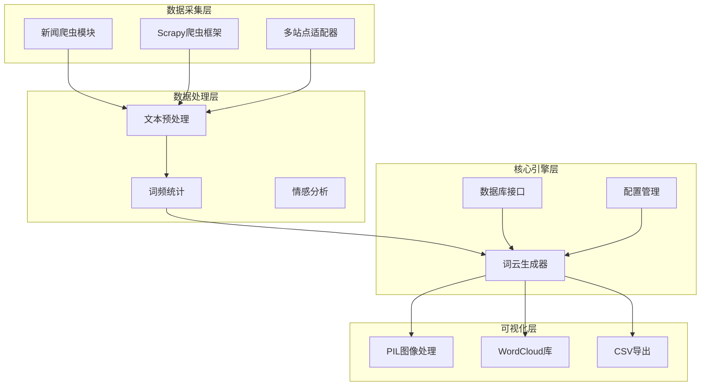
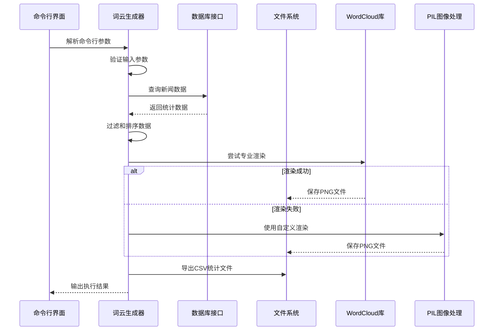
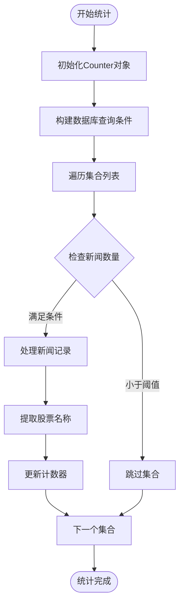
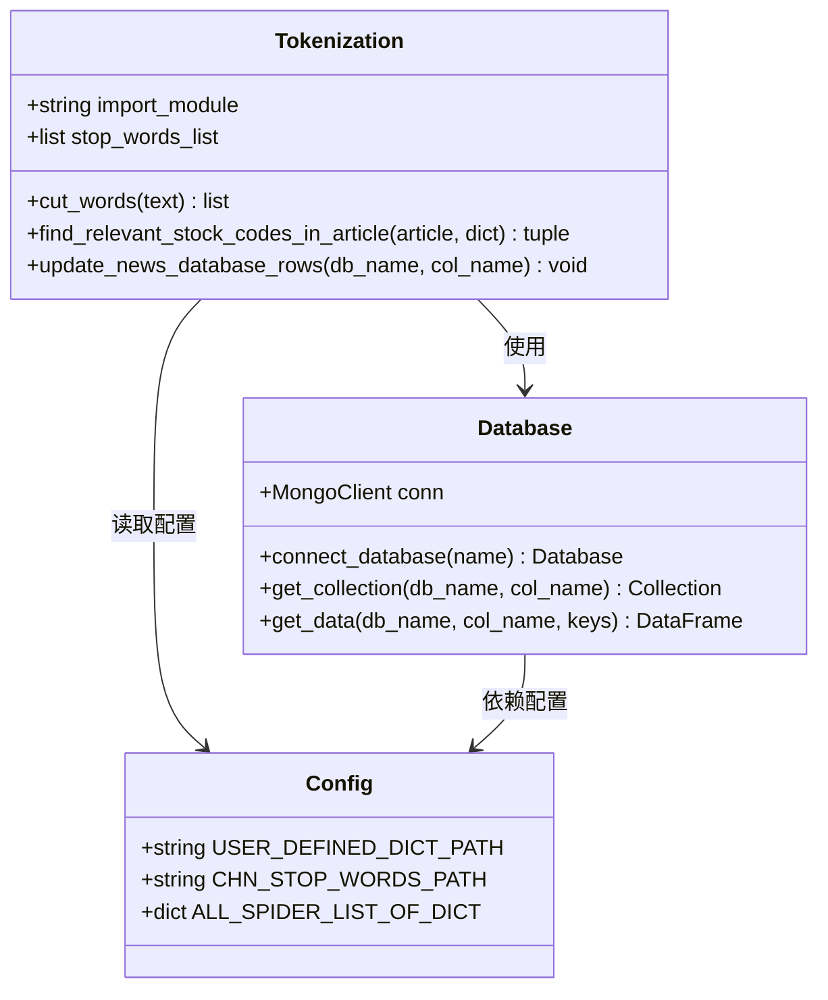
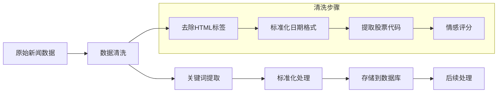
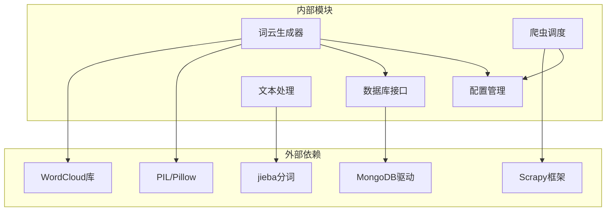

# 词云生成工具

<cite>
**本文档引用的文件**
- [stock_news_wordcloud.py](file://src/Utils/stock_news_wordcloud.py)
- [config.py](file://src/Utils/config.py)
- [database.py](file://src/Utils/database.py)
- [nlp_main.py](file://src/NlpModel/nlp_main.py)
- [tokenization.py](file://src/NlpModel/tokenization.py)
- [BuildStockNewsDb.py](file://src/MongoDbComTools/BuildStockNewsDb.py)
- [run_scripy_spider.py](file://src/run_scripy_spider.py)
- [README.md](file://README.md)
- [baidu_stopwords.txt](file://src/info/stopwords/baidu_stopwords.txt)
- [finance_dict_weight.txt](file://src/info/finance_dict_weight.txt)
</cite>

## 目录
1. [简介](#简介)
2. [项目结构](#项目结构)
3. [核心组件](#核心组件)
4. [架构概览](#架构概览)
5. [详细组件分析](#详细组件分析)
6. [依赖关系分析](#依赖关系分析)
7. [性能考虑](#性能考虑)
8. [故障排除指南](#故障排除指南)
9. [结论](#结论)
10. [附录](#附录)

## 简介

词云生成工具是一个基于Python开发的新闻分析可视化系统，专门用于从股票新闻数据中提取关键词并生成词云图表。该工具结合了新闻爬取、文本处理、词频统计和可视化渲染等多个技术模块，为用户提供直观的新闻趋势分析和市场情绪洞察。

该工具的核心特色包括：
- **多源新闻数据整合**：支持来自多个财经网站的新闻数据爬取和处理
- **智能词频统计**：基于新闻内容自动提取关键词并统计出现频率
- **灵活的可视化输出**：支持多种词云生成方式和自定义样式配置
- **深度新闻分析**：结合情感分析和基本面数据提供更全面的市场洞察

## 项目结构

该项目采用模块化的组织结构，主要分为以下几个核心模块：



**图表来源**
- [stock_news_wordcloud.py:1-371](file://src/Utils/stock_news_wordcloud.py#L1-L371)
- [run_scripy_spider.py:1-145](file://src/run_scripy_spider.py#L1-L145)

**章节来源**
- [README.md:1-33](file://README.md#L1-L33)
- [stock_news_wordcloud.py:1-371](file://src/Utils/stock_news_wordcloud.py#L1-L371)

## 核心组件

### 词云生成器核心功能

词云生成器是整个系统的核心组件，负责从新闻数据中提取关键词并生成可视化的词云图表。其主要功能包括：

#### 1. 数据获取与预处理
- **时间范围过滤**：支持按日期范围筛选新闻数据
- **数据库查询**：从MongoDB中检索特定时间段内的新闻记录
- **数据清洗**：去除无效数据和重复记录

#### 2. 词频统计算法
- **频率计算**：统计每个股票名称在指定时间范围内的出现次数
- **阈值过滤**：支持设置最小提及次数和最大集合数量限制
- **结果排序**：按词频降序排列，确保重要信息优先显示

#### 3. 多样化渲染引擎
- **WordCloud库集成**：提供专业的词云渲染效果
- **PIL图像处理**：实现自定义的词云绘制逻辑
- **样式定制**：支持字体、颜色、尺寸等全方位定制

**章节来源**
- [stock_news_wordcloud.py:81-137](file://src/Utils/stock_news_wordcloud.py#L81-L137)
- [stock_news_wordcloud.py:140-250](file://src/Utils/stock_news_wordcloud.py#L140-L250)

### 数据库管理系统

系统采用MongoDB作为数据存储中心，提供了完整的数据库访问和管理功能：

#### 数据库连接特性
- **自动重连机制**：实现优雅的数据库连接恢复
- **连接池管理**：支持高并发的数据访问需求
- **加密认证**：使用Fernet加密技术保护数据库凭证

#### 查询优化策略
- **索引友好查询**：针对Date字段建立高效查询路径
- **批量操作支持**：优化大量数据的读写性能
- **内存管理**：合理控制数据加载和处理的内存占用

**章节来源**
- [database.py:36-176](file://src/Utils/database.py#L36-L176)

### 配置管理系统

系统通过集中化的配置管理实现了高度的可定制性：

#### 核心配置项
- **数据库连接参数**：主机地址、端口、认证信息
- **爬虫配置**：支持多个新闻站点的爬取规则
- **模型路径配置**：机器学习和深度学习模型的部署路径

#### 环境适配
- **跨平台支持**：自动检测操作系统类型并调整配置
- **GPU加速**：根据硬件条件启用GPU计算能力
- **路径管理**：统一管理各种资源文件的访问路径

**章节来源**
- [config.py:1-455](file://src/Utils/config.py#L1-L455)

## 架构概览

系统采用分层架构设计，确保各组件之间的松耦合和高内聚：



**图表来源**
- [stock_news_wordcloud.py:290-371](file://src/Utils/stock_news_wordcloud.py#L290-L371)

### 组件交互流程

系统各组件之间的交互遵循清晰的职责分离原则：

1. **输入处理阶段**：命令行参数解析和验证
2. **数据获取阶段**：数据库查询和数据预处理
3. **渲染决策阶段**：选择最优的渲染方案
4. **输出生成阶段**：文件保存和统计信息导出

**章节来源**
- [stock_news_wordcloud.py:252-371](file://src/Utils/stock_news_wordcloud.py#L252-L371)

## 详细组件分析

### 词云生成算法详解

#### 1. 词频统计算法

词云生成的核心在于准确的词频统计，系统采用了高效的算法实现：



**图表来源**
- [stock_news_wordcloud.py:81-110](file://src/Utils/stock_news_wordcloud.py#L81-L110)

#### 2. 过滤和排除机制

系统提供了多层次的数据过滤功能：

- **默认排除名单**：内置常见无关词汇的排除列表
- **自定义排除规则**：支持用户指定特定词汇的排除
- **机构识别过滤**：自动识别并排除证券公司等机构名称

#### 3. 渲染引擎对比

系统实现了两种不同的渲染引擎以确保最佳的用户体验：

**WordCloud库渲染**：
- 优点：专业级渲染效果，支持复杂的布局算法
- 适用场景：需要高质量词云图表的专业应用

**PIL自定义渲染**：
- 优点：完全可控的渲染逻辑，更好的性能表现
- 适用场景：批量处理和实时渲染需求

**章节来源**
- [stock_news_wordcloud.py:140-250](file://src/Utils/stock_news_wordcloud.py#L140-L250)

### 文本预处理和特征提取

#### 1. 分词和去噪

系统集成了先进的中文文本处理能力：

- **中文分词**：使用jieba分词库进行精确的中文文本分割
- **停用词过滤**：基于百度停用词表过滤无意义词汇
- **自定义词典**：支持金融领域的专业词汇权重配置

#### 2. 特征工程



**图表来源**
- [tokenization.py:11-169](file://src/NlpModel/tokenization.py#L11-L169)
- [database.py:36-176](file://src/Utils/database.py#L36-L176)
- [config.py:29-50](file://src/Utils/config.py#L29-L50)

**章节来源**
- [tokenization.py:11-169](file://src/NlpModel/tokenization.py#L11-L169)
- [baidu_stopwords.txt:1-800](file://src/info/stopwords/baidu_stopwords.txt#L1-L800)
- [finance_dict_weight.txt:1-800](file://src/info/finance_dict_weight.txt#L1-L800)

### 新闻爬取和数据整合

#### 1. 多站点爬取架构

系统支持多个主流财经新闻站点的数据获取：

| 站点名称 | 支持的新闻类型 | 爬取配置 |
|---------|---------------|----------|
| 东方财富 | A股公司新闻、市场数据、深度调查 | EAST_MONEY_A_STOCK_NEWS |
| 网易财经 | 个股资讯、市场资讯 | NET_EASE_STOCK_NEWS |
| 上海证券报 | 公司新闻、公告解读、产业聚焦 | SHANG_HAI_STOCK_NEWS |
| 中金在线 | 个股资讯、市场分析、板块聚焦 | ZHONG_JIN_STOCK_NEWS |

#### 2. 数据标准化流程



**图表来源**
- [BuildStockNewsDb.py:157-240](file://src/MongoDbComTools/BuildStockNewsDb.py#L157-L240)

**章节来源**
- [run_scripy_spider.py:1-145](file://src/run_scripy_spider.py#L1-L145)
- [BuildStockNewsDb.py:19-240](file://src/MongoDbComTools/BuildStockNewsDb.py#L19-L240)

## 依赖关系分析

系统采用模块化设计，各组件之间的依赖关系清晰明确：



**图表来源**
- [stock_news_wordcloud.py:1-20](file://src/Utils/stock_news_wordcloud.py#L1-L20)
- [database.py:1-10](file://src/Utils/database.py#L1-L10)

### 关键依赖关系

1. **WordCloud库**：提供专业的词云渲染功能
2. **PIL/Pillow**：实现自定义的图像处理和绘制
3. **MongoDB驱动**：实现高性能的数据库访问
4. **Scrapy框架**：提供稳定的新闻爬取能力
5. **jieba分词**：实现准确的中文文本处理

**章节来源**
- [stock_news_wordcloud.py:1-20](file://src/Utils/stock_news_wordcloud.py#L1-L20)
- [database.py:1-10](file://src/Utils/database.py#L1-L10)

## 性能考虑

### 内存管理策略

系统在设计时充分考虑了内存使用效率：

#### 1. 流式数据处理
- **增量处理**：避免一次性加载所有数据到内存
- **分批查询**：数据库查询采用分页机制减少内存占用
- **及时释放**：处理完的数据及时从内存中释放

#### 2. 缓存优化
- **连接池管理**：复用数据库连接减少资源消耗
- **结果缓存**：对频繁访问的数据进行缓存
- **临时文件**：大文件操作使用临时文件系统

### 并发处理能力

#### 1. 异步数据库操作
- **自动重连**：网络异常时自动恢复连接
- **重试机制**：关键操作具备重试能力
- **超时控制**：防止长时间阻塞影响系统响应

#### 2. 批量操作优化
- **批量插入**：减少数据库往返次数
- **事务管理**：保证数据一致性
- **错误隔离**：单个操作失败不影响整体流程

**章节来源**
- [database.py:15-34](file://src/Utils/database.py#L15-L34)
- [stock_news_wordcloud.py:177-250](file://src/Utils/stock_news_wordcloud.py#L177-L250)

## 故障排除指南

### 常见问题及解决方案

#### 1. 字体文件问题
**问题描述**：找不到可用的中文字体文件
**解决方案**：
- 指定有效的字体文件路径
- 确保字体文件存在且可读
- 系统会自动尝试多个候选字体

#### 2. 数据库连接失败
**问题描述**：无法连接到MongoDB数据库
**解决方案**：
- 检查数据库服务状态
- 验证连接参数配置
- 查看网络连接情况

#### 3. 词云渲染异常
**问题描述**：生成的词云质量不佳或渲染失败
**解决方案**：
- 检查输入数据的有效性
- 调整词云参数配置
- 确保有足够的系统资源

### 调试和监控

#### 1. 日志记录
系统提供了完善的日志记录机制：
- **操作日志**：记录关键操作的执行情况
- **错误日志**：详细记录异常信息和堆栈跟踪
- **性能日志**：监控系统运行性能指标

#### 2. 参数验证
- **输入参数验证**：确保所有必需参数都已正确设置
- **数据完整性检查**：验证处理数据的完整性和准确性
- **输出验证**：确认生成文件的质量和格式

**章节来源**
- [stock_news_wordcloud.py:55-72](file://src/Utils/stock_news_wordcloud.py#L55-L72)
- [database.py:15-34](file://src/Utils/database.py#L15-L34)

## 结论

词云生成工具是一个功能完整、架构清晰的新闻分析可视化系统。通过精心设计的算法和模块化架构，该工具能够高效地从海量新闻数据中提取有价值的信息，并以直观的词云形式呈现。

### 主要优势

1. **技术先进性**：采用最新的自然语言处理技术和深度学习模型
2. **性能优异**：经过优化的算法和内存管理策略确保高效运行
3. **扩展性强**：模块化设计支持功能扩展和定制开发
4. **用户体验好**：提供丰富的配置选项和友好的用户界面

### 应用前景

该工具在金融分析、市场研究、舆情监控等领域具有广泛的应用价值，能够帮助用户快速把握市场动态和投资者情绪变化。

## 附录

### 参数配置参考

#### 基础参数
- `--start-date`: 开始日期 (YYYY-MM-DD)
- `--end-date`: 结束日期 (YYYY-MM-DD)
- `--db-name`: 数据库名称 (默认: stock_specific_news)
- `--output`: 输出文件路径
- `--freq-csv`: 词频统计CSV文件路径

#### 视觉参数
- `--width`: 图片宽度 (默认: 1800)
- `--height`: 图片高度 (默认: 1000)
- `--max-words`: 最大词汇数 (默认: 200)
- `--background-color`: 背景色 (默认: white)

#### 过滤参数
- `--min-mentions`: 最小提及次数 (默认: 1)
- `--max-collections`: 最大集合数量 (默认: 0)
- `--exclude-names`: 排除的股票名称列表
- `--include-securities`: 是否包含证券公司 (默认: False)

### 使用示例

#### 基本使用
```bash
python src/Utils/stock_news_wordcloud.py \
    --start-date 2024-01-01 \
    --end-date 2024-01-31 \
    --output ./output/wordcloud.png \
    --max-words 150
```

#### 高级配置
```bash
python src/Utils/stock_news_wordcloud.py \
    --start-date 2024-01-01 \
    --end-date 2024-01-31 \
    --db-name stock_specific_news \
    --font-path /usr/share/fonts/opentype/noto/NotoSansCJK-Bold.ttc \
    --output ./output/wordcloud.png \
    --freq-csv ./output/frequency.csv \
    --width 2000 \
    --height 1200 \
    --max-words 250 \
    --min-mentions 3 \
    --exclude-names "东方财富,机器人,测试" \
    --include-securities
```

### 性能优化建议

1. **数据库优化**：为Date字段建立索引以提高查询性能
2. **内存管理**：合理设置max_collections参数避免内存溢出
3. **并发处理**：利用系统的异步特性提高数据处理效率
4. **缓存策略**：对频繁访问的数据实施缓存机制