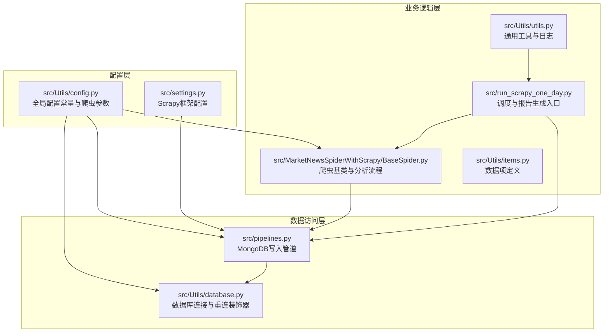
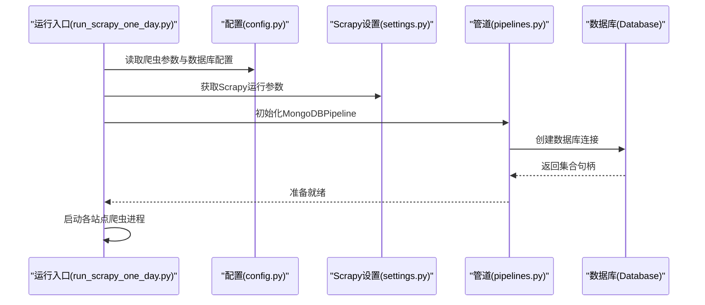
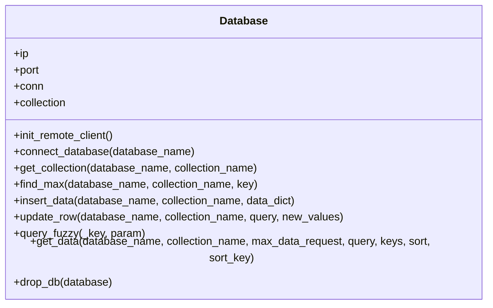
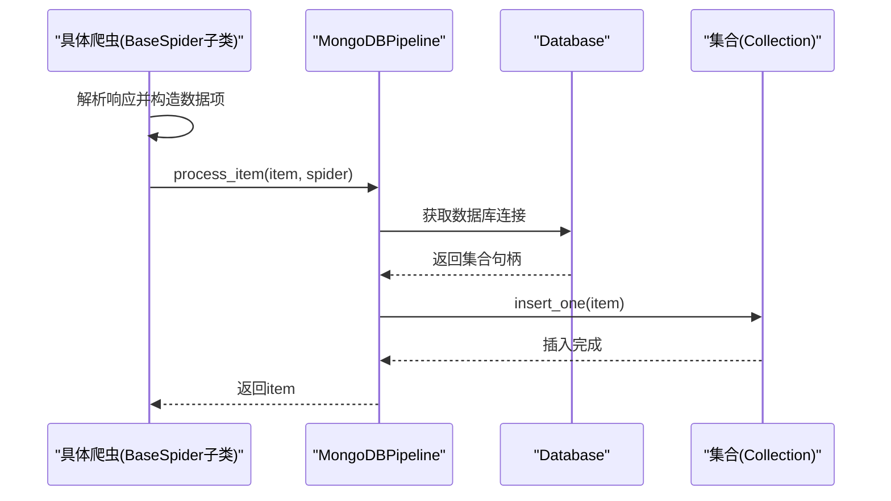
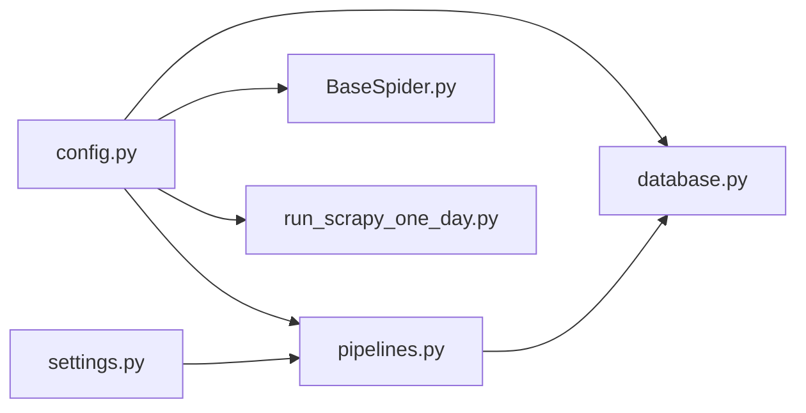

# 配置管理系统

<cite>
**本文档引用的文件**
- [src/Utils/config.py](file://src/Utils/config.py)
- [src/settings.py](file://src/settings.py)
- [src/Utils/database.py](file://src/Utils/database.py)
- [src/pipelines.py](file://src/pipelines.py)
- [src/Utils/items.py](file://src/Utils/items.py)
- [src/MarketNewsSpiderWithScrapy/BaseSpider.py](file://src/MarketNewsSpiderWithScrapy/BaseSpider.py)
- [src/Utils/utils.py](file://src/Utils/utils.py)
- [src/run_scrapy_one_day.py](file://src/run_scrapy_one_day.py)
- [README.md](file://README.md)
- [ProblemSolve.md](file://ProblemSolve.md)
</cite>

## 目录
1. [简介](#简介)
2. [项目结构](#项目结构)
3. [核心组件](#核心组件)
4. [架构总览](#架构总览)
5. [详细组件分析](#详细组件分析)
6. [依赖分析](#依赖分析)
7. [性能考虑](#性能考虑)
8. [故障排查指南](#故障排查指南)
9. [结论](#结论)
10. [附录](#附录)

## 简介
本项目是一个集“股票新闻爬取、文本情感分析与报告生成”于一体的量化分析系统。配置管理贯穿于数据库连接、爬虫参数、分析模型路径与设备类型、以及Scrapy框架参数等多个层面。本文档将系统性阐述配置文件的组织结构与加载机制，详解各类配置参数的作用与设置方法，提供默认值与推荐设置，说明配置验证与错误处理机制，并给出在不同环境（开发、测试、生产）下的切换方案、热更新与动态调整方法，以及实际配置示例与最佳实践。

## 项目结构
项目采用按功能域划分的模块化组织方式，配置相关的核心文件集中在Utils目录下，Scrapy相关配置位于settings.py，爬虫与管道分别在MarketNewsSpiderWithScrapy与pipelines.py中体现配置的使用。

图表来源
- [src/Utils/config.py:1-455](file://src/Utils/config.py#L1-L455)
- [src/settings.py:1-49](file://src/settings.py#L1-L49)
- [src/Utils/database.py:1-176](file://src/Utils/database.py#L1-L176)
- [src/pipelines.py:1-56](file://src/pipelines.py#L1-L56)
- [src/MarketNewsSpiderWithScrapy/BaseSpider.py:1-149](file://src/MarketNewsSpiderWithScrapy/BaseSpider.py#L1-L149)
- [src/run_scrapy_one_day.py:1-104](file://src/run_scrapy_one_day.py#L1-L104)
- [src/Utils/items.py:1-18](file://src/Utils/items.py#L1-L18)
- [src/Utils/utils.py:1-251](file://src/Utils/utils.py#L1-L251)

章节来源
- [README.md:1-33](file://README.md#L1-L33)
- [src/Utils/config.py:1-455](file://src/Utils/config.py#L1-L455)
- [src/settings.py:1-49](file://src/settings.py#L1-L49)

## 核心组件
本节从配置管理视角梳理系统的关键组件及其职责：
- 全局配置中心：集中定义数据库地址、端口、Redis、Chrome驱动、爬虫参数、模型路径与设备类型等。
- 数据库连接与重连：封装MongoDB客户端初始化、集合操作、异常重连与指数回退。
- Scrapy框架配置：并发、下载超时、延迟、中间件、管道等。
- 爬虫与管道：基于配置启动多站点爬虫，将解析后的条目写入对应数据库集合。
- 工具与日志：统一日志格式、邮件发送、日期计算、停用词加载等。

章节来源
- [src/Utils/config.py:1-455](file://src/Utils/config.py#L1-L455)
- [src/Utils/database.py:1-176](file://src/Utils/database.py#L1-L176)
- [src/settings.py:1-49](file://src/settings.py#L1-L49)
- [src/pipelines.py:1-56](file://src/pipelines.py#L1-L56)
- [src/Utils/utils.py:1-251](file://src/Utils/utils.py#L1-L251)

## 架构总览
配置系统以“配置文件 → 组件 → 运行时”的方式工作。配置文件提供默认值与参数集合；组件在初始化阶段读取配置；运行时根据参数动态调度爬虫与分析流程。

图表来源
- [src/run_scrapy_one_day.py:58-79](file://src/run_scrapy_one_day.py#L58-L79)
- [src/Utils/config.py:439-450](file://src/Utils/config.py#L439-L450)
- [src/settings.py:18-34](file://src/settings.py#L18-L34)
- [src/pipelines.py:8-22](file://src/pipelines.py#L8-L22)
- [src/Utils/database.py:44-60](file://src/Utils/database.py#L44-L60)

## 详细组件分析

### 全局配置中心（config.py）
- 数据库连接配置
  - MongoDB IP与端口：集中定义，支持跨平台适配。
  - Redis IP与端口：用于缓存或队列场景。
  - 加密密钥：用于解密数据库用户名与密码。
- 爬虫参数配置
  - 多站点爬虫参数字典：每个站点包含名称、起始URL、关键词、中文关键词、基础URL与最大页码。
  - 站点参数聚合：将各站点参数汇总到一个字典，便于统一调度。
- 分析模型配置
  - 文本预处理：自定义词典路径、停用词路径、分词方法。
  - 传统机器学习模型：朴素贝叶斯、SVM模型文件路径与向量化器。
  - 深度学习：行业与概念词典文件路径。
  - LLM模型路径与设备类型：支持GPU或CPU推理。
- 其他
  - Chrome驱动路径：按操作系统自动选择。
  - 股票价格请求默认日期：用于历史数据回溯。

章节来源
- [src/Utils/config.py:13-16](file://src/Utils/config.py#L13-L16)
- [src/Utils/config.py:18-19](file://src/Utils/config.py#L18-L19)
- [src/Utils/config.py:21-23](file://src/Utils/config.py#L21-L23)
- [src/Utils/config.py:25-27](file://src/Utils/config.py#L25-L27)
- [src/Utils/config.py:30-37](file://src/Utils/config.py#L30-L37)
- [src/Utils/config.py:52-53](file://src/Utils/config.py#L52-L53)
- [src/Utils/config.py:55-65](file://src/Utils/config.py#L55-L65)
- [src/Utils/config.py:439-450](file://src/Utils/config.py#L439-L450)
- [src/Utils/config.py:453-455](file://src/Utils/config.py#L453-L455)

### 数据库连接与重连（database.py）
- 连接初始化
  - 通过配置中的IP与端口创建MongoClient，设置服务器选择超时与连接池大小。
  - 使用对称加密密钥解密用户名与密码（注释掉认证字段，便于本地快速调试）。
- 自动重连装饰器
  - 对数据库操作函数进行包装，遇到AutoReconnect异常时进行指数回退重试，最多尝试固定次数。
- 常用操作
  - 获取集合、查询、插入、更新、模糊匹配、查找最大值、删除数据库等。

图表来源
- [src/Utils/database.py:36-176](file://src/Utils/database.py#L36-L176)

章节来源
- [src/Utils/database.py:44-60](file://src/Utils/database.py#L44-L60)
- [src/Utils/database.py:15-33](file://src/Utils/database.py#L15-L33)
- [src/Utils/database.py:62-172](file://src/Utils/database.py#L62-L172)

### Scrapy框架配置（settings.py）
- 基本设置
  - BOT_NAME、SPIDER_MODULES、NEWSPIDER_MODULE、ROBOTSTXT_OBEY。
- 请求与并发
  - DEFAULT_REQUEST_HEADERS、CONCURRENT_REQUESTS、DOWNLOAD_TIMEOUT、DOWNLOAD_DELAY。
- 中间件
  - 关闭Cookie与重定向中间件，启用HTTP代理中间件。
- 管道
  - 注册MongoDBPipeline，负责将条目写入MongoDB。
- 用户代理池
  - 提供多个User-Agent以降低反爬风险。

章节来源
- [src/settings.py:4-11](file://src/settings.py#L4-L11)
- [src/settings.py:14-16](file://src/settings.py#L14-L16)
- [src/settings.py:18-23](file://src/settings.py#L18-L23)
- [src/settings.py:25-30](file://src/settings.py#L25-L30)
- [src/settings.py:32-34](file://src/settings.py#L32-L34)
- [src/settings.py:36-47](file://src/settings.py#L36-L47)

### 爬虫与管道（BaseSpider.py、pipelines.py）
- 爬虫基类
  - 接收站点参数（名称、关键词、起始URL、基础URL、最大页码），解析文章内容，抽取股票代码与名称，调用ML与LLM模型进行情感打分与融合，最终封装为数据项。
- 管道
  - 根据爬虫名称映射到对应的数据库与集合，去重插入MongoDB。

图表来源
- [src/MarketNewsSpiderWithScrapy/BaseSpider.py:41-98](file://src/MarketNewsSpiderWithScrapy/BaseSpider.py#L41-L98)
- [src/pipelines.py:25-46](file://src/pipelines.py#L25-L46)
- [src/Utils/database.py:78-88](file://src/Utils/database.py#L78-L88)

章节来源
- [src/MarketNewsSpiderWithScrapy/BaseSpider.py:13-34](file://src/MarketNewsSpiderWithScrapy/BaseSpider.py#L13-L34)
- [src/MarketNewsSpiderWithScrapy/BaseSpider.py:41-98](file://src/MarketNewsSpiderWithScrapy/BaseSpider.py#L41-L98)
- [src/pipelines.py:8-22](file://src/pipelines.py#L8-L22)
- [src/pipelines.py:25-56](file://src/pipelines.py#L25-L56)

### 数据项定义（items.py）
- 定义了新闻条目的字段：URL、日期、标题、关联股票代码、正文、词频统计、分类、标签、分数等。

章节来源
- [src/Utils/items.py:5-18](file://src/Utils/items.py#L5-L18)

### 运行入口与调度（run_scrapy_one_day.py）
- 读取命令行参数，按配置启动Playwright与Scrapy两类爬虫进程，遍历配置中的站点参数列表。
- 可选生成报告，基于配置的数据库与集合名称进行数据汇总与导出。

章节来源
- [src/run_scrapy_one_day.py:58-79](file://src/run_scrapy_one_day.py#L58-L79)
- [src/run_scrapy_one_day.py:81-104](file://src/run_scrapy_one_day.py#L81-L104)

## 依赖分析
- 配置到组件的依赖
  - config.py被database.py、pipelines.py、BaseSpider.py、run_scrapy_one_day.py广泛引用。
  - settings.py被pipelines.py间接影响（通过Scrapy运行时参数）。
- 组件间的耦合
  - 管道依赖数据库连接；爬虫依赖管道与配置；运行入口依赖爬虫与配置。
- 外部依赖
  - MongoDB、Scrapy、Pandas、NumPy、Scikit-learn、Joblib、XlsxWriter等。

图表来源
- [src/Utils/config.py:1-455](file://src/Utils/config.py#L1-L455)
- [src/settings.py:1-49](file://src/settings.py#L1-L49)
- [src/Utils/database.py:1-176](file://src/Utils/database.py#L1-L176)
- [src/pipelines.py:1-56](file://src/pipelines.py#L1-L56)
- [src/MarketNewsSpiderWithScrapy/BaseSpider.py:1-149](file://src/MarketNewsSpiderWithScrapy/BaseSpider.py#L1-L149)
- [src/run_scrapy_one_day.py:1-104](file://src/run_scrapy_one_day.py#L1-L104)

章节来源
- [src/Utils/config.py:1-455](file://src/Utils/config.py#L1-L455)
- [src/settings.py:1-49](file://src/settings.py#L1-L49)

## 性能考虑
- 并发与延迟
  - Scrapy并发请求数与下载延迟直接影响抓取吞吐与目标站点的接受度，需结合目标站点限流策略调整。
- 连接池与超时
  - 数据库连接池大小与服务器选择超时影响高并发下的稳定性与响应时间。
- 指数回退重试
  - 自动重连装饰器在网络抖动或瞬断时提升可用性，但应避免过度重试导致资源占用。
- 模型推理
  - LLM模型路径与设备类型决定推理性能，GPU优先，CPU仅在资源受限时使用。

章节来源
- [src/settings.py:18-23](file://src/settings.py#L18-L23)
- [src/Utils/database.py:56-58](file://src/Utils/database.py#L56-L58)
- [src/Utils/database.py:21-31](file://src/Utils/database.py#L21-L31)
- [src/Utils/config.py:453-455](file://src/Utils/config.py#L453-L455)

## 故障排查指南
- 数据库连接问题
  - 确认IP与端口正确；检查服务器选择超时与连接池大小；关注自动重连日志与指数回退等待时间。
- 爬虫请求失败
  - 检查User-Agent池与代理中间件配置；适当提高下载超时与延迟；确认站点robots协议与反爬策略。
- 管道写入重复
  - MongoDBPipeline已处理重复键异常，确保唯一索引与去重策略一致。
- 环境差异
  - 不同操作系统下的Chrome驱动路径不同，需在配置中按平台选择。

章节来源
- [src/Utils/database.py:44-60](file://src/Utils/database.py#L44-L60)
- [src/Utils/database.py:15-33](file://src/Utils/database.py#L15-L33)
- [src/settings.py:14-16](file://src/settings.py#L14-L16)
- [src/settings.py:25-30](file://src/settings.py#L25-L30)
- [src/pipelines.py:48-56](file://src/pipelines.py#L48-L56)
- [src/Utils/config.py:21-23](file://src/Utils/config.py#L21-L23)

## 结论
本配置管理系统通过集中化的配置文件与清晰的组件边界，实现了数据库连接、爬虫参数、分析模型路径与设备类型的统一管理。配合Scrapy框架参数与自动重连机制，系统在不同环境下具备良好的可移植性与稳定性。建议在生产环境进一步完善认证配置、监控与日志体系，并探索配置热更新与动态调整能力。

## 附录

### 配置参数清单与默认值
- 数据库连接
  - MongoDB IP：本地或远程（按平台）
  - MongoDB 端口：27017
  - Redis IP：localhost
  - Redis 端口：6379
- 爬虫参数
  - 各站点的名称、起始URL、关键词、中文关键词、基础URL、最大页码等。
  - 站点参数聚合字典，便于统一调度。
- 分析模型
  - 自定义词典与权重文件路径
  - 停用词路径
  - 朴素贝叶斯、SVM模型文件路径
  - 行业与概念词典文件路径
  - LLM模型路径与设备类型
- Scrapy参数
  - 并发请求数、下载超时、下载延迟、默认请求头、用户代理池、中间件与管道配置

章节来源
- [src/Utils/config.py:13-16](file://src/Utils/config.py#L13-L16)
- [src/Utils/config.py:18-19](file://src/Utils/config.py#L18-L19)
- [src/Utils/config.py:30-37](file://src/Utils/config.py#L30-L37)
- [src/Utils/config.py:52-53](file://src/Utils/config.py#L52-L53)
- [src/Utils/config.py:439-450](file://src/Utils/config.py#L439-L450)
- [src/Utils/config.py:453-455](file://src/Utils/config.py#L453-L455)
- [src/settings.py:18-23](file://src/settings.py#L18-L23)
- [src/settings.py:14-16](file://src/settings.py#L14-L16)
- [src/settings.py:36-47](file://src/settings.py#L36-L47)

### 环境切换与最佳实践
- 开发环境
  - 使用本地MongoDB与Redis；Chrome驱动按平台选择；关闭部分中间件以便调试。
- 测试环境
  - 适度降低并发与延迟，开启必要的代理与User-Agent轮换。
- 生产环境
  - 启用认证与安全连接；合理设置连接池与超时；监控重连与错误日志。
- 最佳实践
  - 将敏感信息（如用户名、密码）放入加密配置或环境变量，避免硬编码。
  - 为不同环境准备独立配置文件，通过环境变量或命令行参数选择。
  - 对关键参数建立校验与默认值回退机制，防止配置缺失导致异常。

章节来源
- [src/Utils/database.py:44-60](file://src/Utils/database.py#L44-L60)
- [src/Utils/config.py:21-23](file://src/Utils/config.py#L21-L23)
- [src/settings.py:25-30](file://src/settings.py#L25-L30)

### 配置验证与错误处理
- 配置验证
  - 在组件初始化时对关键参数进行断言与类型检查（如查询条件、键列表、最大数据请求）。
- 错误处理
  - 数据库操作异常通过自动重连装饰器处理；管道写入重复键异常被捕获并忽略；日志记录关键事件与警告。

章节来源
- [src/Utils/database.py:108-118](file://src/Utils/database.py#L108-L118)
- [src/pipelines.py:48-56](file://src/pipelines.py#L48-L56)
- [src/Utils/database.py:21-31](file://src/Utils/database.py#L21-L31)

### 热更新与动态调整
- 当前实现
  - 配置在模块导入时加载为常量，运行期不直接热更新。
- 建议方案
  - 引入配置中心（如Consul、etcd）或文件监听机制，在检测到变更后触发组件重建与参数刷新。
  - 对于Scrapy参数，可通过重启进程或动态修改运行时参数的方式生效。

章节来源
- [src/Utils/config.py:1-455](file://src/Utils/config.py#L1-L455)
- [src/settings.py:1-49](file://src/settings.py#L1-L49)