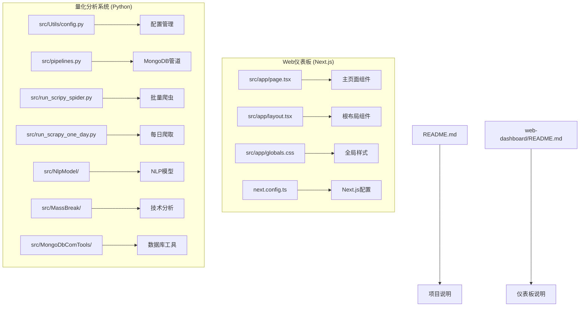
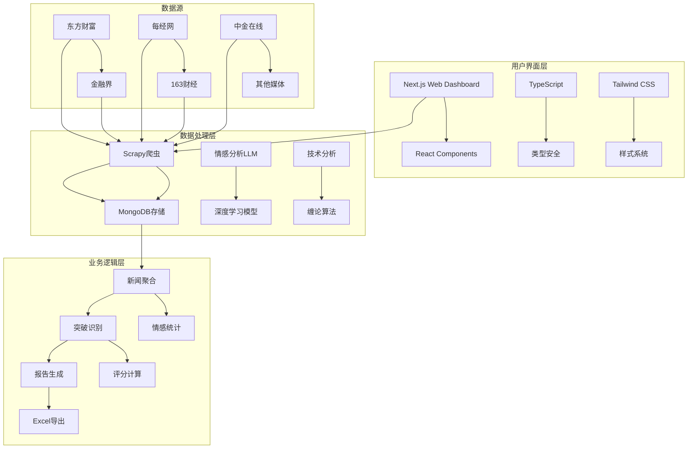
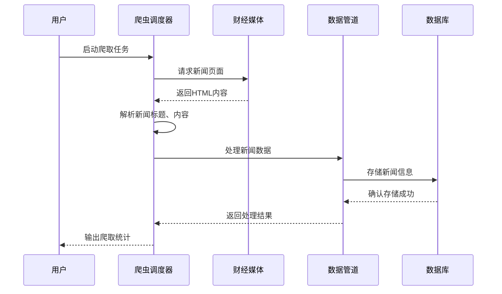
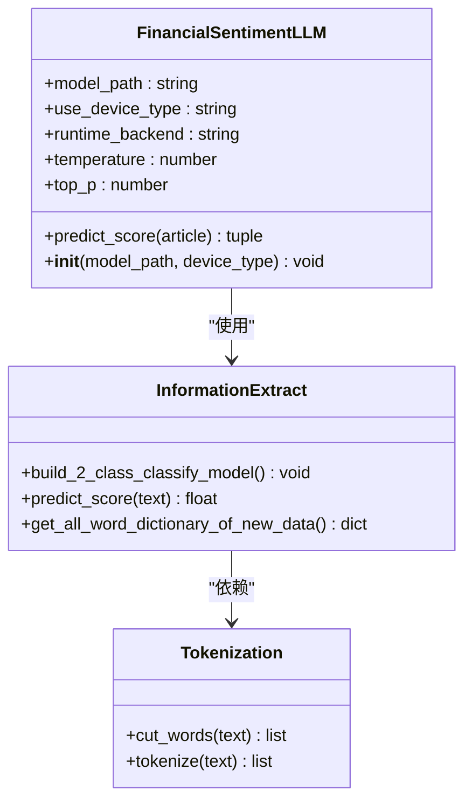
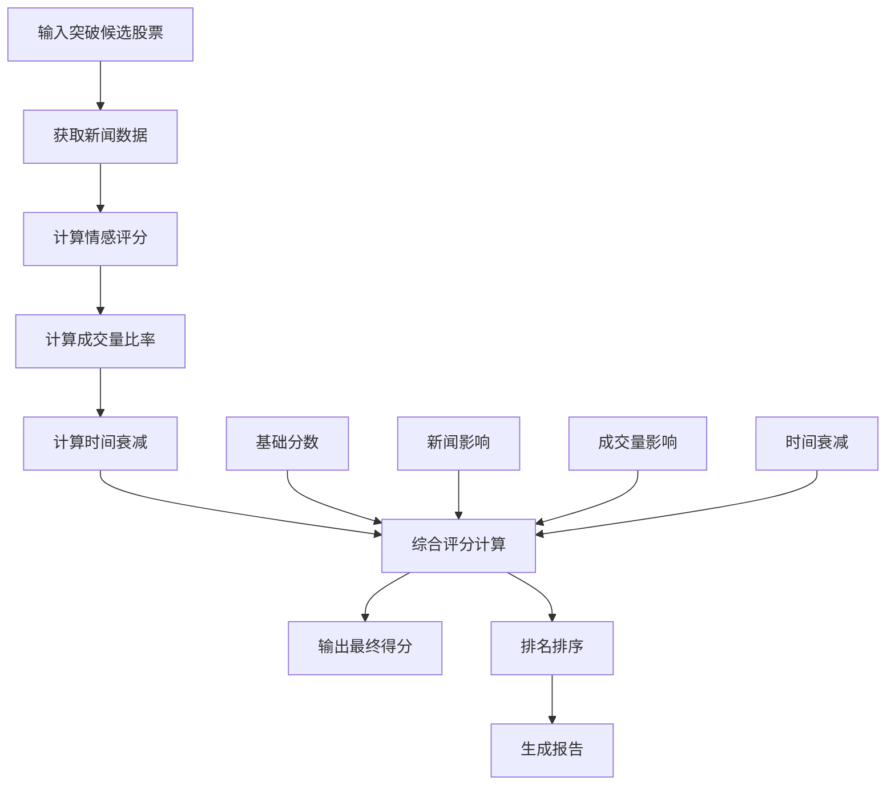
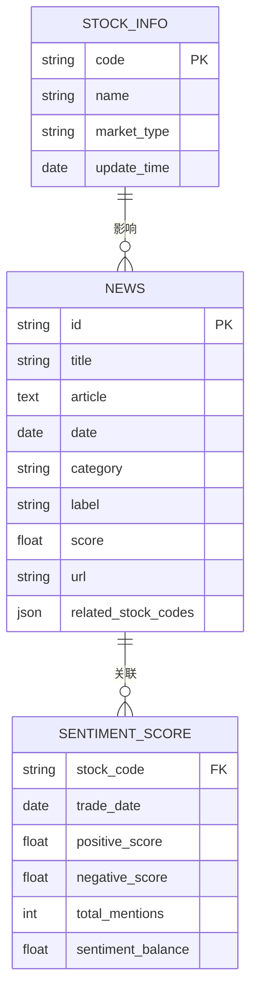
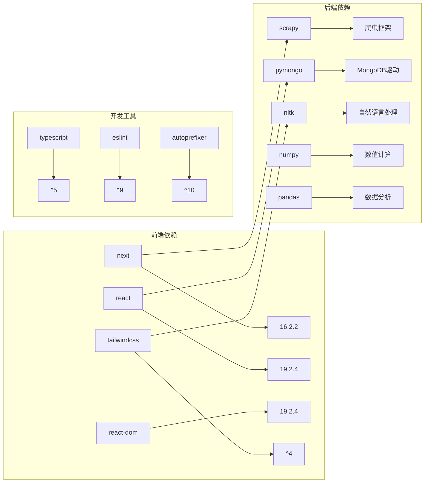

# Web仪表板开发

<cite>
**本文档引用的文件**
- [README.md](file://README.md)
- [web-dashboard/README.md](file://web-dashboard/README.md)
- [package.json](file://web-dashboard/package.json)
- [page.tsx](file://web-dashboard/src/app/page.tsx)
- [layout.tsx](file://web-dashboard/src/app/layout.tsx)
- [globals.css](file://web-dashboard/src/app/globals.css)
- [next.config.ts](file://web-dashboard/next.config.ts)
- [config.py](file://src/Utils/config.py)
- [pipelines.py](file://src/pipelines.py)
- [run_scripy_spider.py](file://src/run_scripy_spider.py)
- [run_scrapy_one_day.py](file://src/run_scrapy_one_day.py)
- [nlp_main.py](file://src/NlpModel/nlp_main.py)
- [FinancialSentimentLLM.py](file://src/NlpModel/FinancialSentimentLLM.py)
- [MassBreakAndInfosAlphaGo.py](file://src/MassBreak/MassBreakAndInfosAlphaGo.py)
- [BuildStockNewsDb.py](file://src/MongoDbComTools/BuildStockNewsDb.py)
- [utils.py](file://src/Utils/utils.py)
</cite>

## 目录
1. [简介](#简介)
2. [项目结构](#项目结构)
3. [核心组件](#核心组件)
4. [架构概览](#架构概览)
5. [详细组件分析](#详细组件分析)
6. [依赖关系分析](#依赖关系分析)
7. [性能考虑](#性能考虑)
8. [故障排除指南](#故障排除指南)
9. [结论](#结论)

## 简介

这是一个基于Next.js的Web仪表板项目，专门用于展示和分析量化投资相关的数据。该项目集成了股票新闻爬取、情感分析、技术分析等功能，为用户提供全面的市场洞察。

项目主要包含两个核心部分：
- **Web仪表板**：基于Next.js 16.2.2构建的现代化前端界面
- **量化分析引擎**：Python后端系统，包含新闻爬取、情感分析、技术分析等功能

## 项目结构

**图表来源**
- [page.tsx:1-66](file://web-dashboard/src/app/page.tsx#L1-L66)
- [layout.tsx:1-34](file://web-dashboard/src/app/layout.tsx#L1-L34)
- [config.py:1-455](file://src/Utils/config.py#L1-L455)

**章节来源**
- [README.md:1-33](file://README.md#L1-L33)
- [web-dashboard/README.md:1-37](file://web-dashboard/README.md#L1-L37)

## 核心组件

### Web仪表板组件

Web仪表板采用现代React和Next.js技术栈构建：

- **页面组件**：提供用户友好的界面，支持深色/浅色主题切换
- **布局系统**：基于Tailwind CSS的响应式设计
- **字体系统**：集成Geist字体家族，优化显示效果
- **构建配置**：支持多种包管理器（npm、yarn、pnpm、bun）

### 量化分析组件

后端系统包含完整的量化分析管道：

- **新闻爬取系统**：支持多家财经媒体的自动化爬取
- **情感分析引擎**：基于深度学习的新闻情感评分
- **技术分析模块**：缠论技术分析和突破模式识别
- **数据库管理**：MongoDB数据存储和查询

**章节来源**
- [package.json:1-27](file://web-dashboard/package.json#L1-L27)
- [config.py:1-455](file://src/Utils/config.py#L1-L455)

## 架构概览

**图表来源**
- [run_scripy_spider.py:1-145](file://src/run_scripy_spider.py#L1-L145)
- [run_scrapy_one_day.py:1-195](file://src/run_scrapy_one_day.py#L1-L195)
- [FinancialSentimentLLM.py:1-167](file://src/NlpModel/FinancialSentimentLLM.py#L1-L167)

## 详细组件分析

### 新闻爬取系统

新闻爬取系统采用Scrapy框架，支持多家财经媒体：

**图表来源**
- [run_scripy_spider.py:117-145](file://src/run_scripy_spider.py#L117-L145)
- [pipelines.py:8-56](file://src/pipelines.py#L8-L56)

#### 支持的媒体平台

系统支持以下主要财经媒体：

| 媒体名称 | 数据库 | 支持频道 | 特点 |
|---------|--------|----------|------|
| 东方财富 | east_money_news | 6个频道 | 覆盖面广，更新频繁 |
| 金融界 | jrj_news | 4个频道 | 专业财经分析 |
| 每经网 | nbd_news | 4个频道 | 深度报道较多 |
| 163财经 | net_ease_news | 2个频道 | 个股资讯丰富 |
| 上海证券报 | shanghai_cn_stock_news | 4个频道 | 板块分析深入 |
| 中金在线 | zhong_jin_stock_news_db | 7个频道 | 市场趋势分析 |

**章节来源**
- [config.py:196-437](file://src/Utils/config.py#L196-L437)
- [run_scripy_spider.py:78-114](file://src/run_scripy_spider.py#L78-L114)

### 情感分析引擎

情感分析引擎采用先进的LLM模型进行新闻情感评分：

**图表来源**
- [FinancialSentimentLLM.py:5-167](file://src/NlpModel/FinancialSentimentLLM.py#L5-L167)
- [nlp_main.py:1-70](file://src/NlpModel/nlp_main.py#L1-L70)

#### 模型配置

| 配置项 | 值 | 说明 |
|-------|-----|------|
| 模型路径 | /home/zhangSongbo/work/DL/kaggle/MAP/jigsawCode/models/Qwen3-4B | 深度学习模型位置 |
| 设备类型 | gpu | 运行设备选择 |
| Ollama模型 | qwen3:1.7b | 本地推理模型 |
| 温度参数 | 0.6 | 控制生成随机性 |
| 采样概率 | 0.8 | 控制词汇选择 |

**章节来源**
- [FinancialSentimentLLM.py:19-105](file://src/NlpModel/FinancialSentimentLLM.py#L19-L105)
- [nlp_main.py:17-31](file://src/NlpModel/nlp_main.py#L17-L31)

### 技术分析模块

技术分析模块基于缠论理论，识别股票突破模式：

**图表来源**
- [MassBreakAndInfosAlphaGo.py:353-392](file://src/MassBreak/MassBreakAndInfosAlphaGo.py#L353-L392)

#### 评分算法

评分算法综合考虑多个因素：

| 因素 | 权重 | 计算方式 | 说明 |
|------|------|----------|------|
| 基础分数 | 100% | 固定值 | 股票质量基础分 |
| 新闻影响 | 15% | (利好-利空)/提及次数 | 新闻情感对股价影响 |
| 成交量影响 | 6% | (今日成交量/N日均量-1) | 成交量异常放量 |
| 时间衰减 | 100% | exp(-λ×天数) | 新闻时效性影响 |
| 提及强度 | 100% | min(1, 提及次数/20) | 新闻热度影响 |

**章节来源**
- [MassBreakAndInfosAlphaGo.py:334-350](file://src/MassBreak/MassBreakAndInfosAlphaGo.py#L334-L350)

### 数据库管理系统

数据库管理系统负责新闻数据的存储和查询：

**图表来源**
- [pipelines.py:8-56](file://src/pipelines.py#L8-L56)
- [BuildStockNewsDb.py:19-52](file://src/MongoDbComTools/BuildStockNewsDb.py#L19-L52)

**章节来源**
- [pipelines.py:25-46](file://src/pipelines.py#L25-L46)
- [BuildStockNewsDb.py:27-51](file://src/MongoDbComTools/BuildStockNewsDb.py#L27-L51)

## 依赖关系分析

**图表来源**
- [package.json:11-25](file://web-dashboard/package.json#L11-L25)

### 核心依赖说明

| 依赖包 | 版本 | 用途 |
|--------|------|------|
| next | 16.2.2 | Web框架 |
| react | 19.2.4 | 用户界面库 |
| react-dom | 19.2.4 | DOM操作 |
| tailwindcss | ^4 | CSS框架 |
| scrapy | 最新版本 | 网页爬取 |
| pymongo | 最新版本 | MongoDB操作 |
| pandas | 最新版本 | 数据分析 |
| numpy | 最新版本 | 数值计算 |

**章节来源**
- [package.json:1-27](file://web-dashboard/package.json#L1-L27)

## 性能考虑

### 前端性能优化

- **静态资源优化**：利用Next.js的自动优化功能
- **字体加载**：使用Google Fonts的优化加载
- **响应式设计**：基于Tailwind CSS的移动端适配
- **代码分割**：按需加载组件，减少初始包大小

### 后端性能优化

- **异步爬取**：使用Scrapy的并发特性
- **数据库索引**：为常用查询字段建立索引
- **缓存策略**：对热点数据进行缓存
- **批处理**：批量处理大量新闻数据

### 数据处理优化

- **内存管理**：合理控制数据量，避免内存溢出
- **并发处理**：多进程并行情感分析任务
- **增量更新**：只处理新增的新闻数据
- **数据压缩**：存储时进行必要的数据压缩

## 故障排除指南

### 常见问题及解决方案

#### 爬虫相关问题

| 问题 | 可能原因 | 解决方案 |
|------|----------|----------|
| 爬取失败 | 网站反爬虫机制 | 更新User-Agent，添加请求延迟 |
| 数据缺失 | 网页结构调整 | 更新CSS选择器 |
| 存储错误 | MongoDB连接问题 | 检查连接字符串和权限 |
| 编码问题 | 字符编码不一致 | 统一使用UTF-8编码 |

#### 情感分析问题

| 问题 | 可能原因 | 解决方案 |
|------|----------|----------|
| 分数异常 | 文本过长或格式问题 | 截断文本，清理HTML标签 |
| 模型加载失败 | 显存不足 | 降低批处理大小，使用CPU模式 |
| 推理速度慢 | 模型过大 | 使用轻量级模型或优化推理参数 |

#### 前端显示问题

| 问题 | 可能原因 | 解决方案 |
|------|----------|----------|
| 页面空白 | 组件渲染错误 | 检查组件导入和依赖 |
| 样式异常 | CSS冲突 | 检查Tailwind配置 |
| 字体加载慢 | 网络问题 | 使用本地字体或CDN加速 |

**章节来源**
- [utils.py:30-58](file://src/Utils/utils.py#L30-L58)
- [FinancialSentimentLLM.py:164-167](file://src/NlpModel/FinancialSentimentLLM.py#L164-L167)

### 调试工具

- **日志系统**：统一的日志记录和输出
- **错误监控**：异常捕获和错误报告
- **性能分析**：爬取和分析过程的性能监控
- **数据库监控**：MongoDB连接和查询性能

## 结论

这个Web仪表板项目成功整合了现代化的前端技术和强大的量化分析能力。通过模块化的架构设计，系统能够有效地处理大量的财经新闻数据，并为用户提供直观的数据可视化和分析功能。

### 主要优势

1. **技术先进**：采用最新的Next.js 16.2.2和React 19.2.4
2. **功能完整**：从数据爬取到分析展示的完整流程
3. **扩展性强**：模块化设计便于功能扩展
4. **用户体验好**：响应式设计和深色主题支持

### 发展方向

1. **实时数据更新**：增加WebSocket支持实现实时数据推送
2. **个性化推荐**：基于用户行为的新闻推荐算法
3. **多维度分析**：增加更多技术指标和财务分析
4. **移动端优化**：进一步优化移动端用户体验