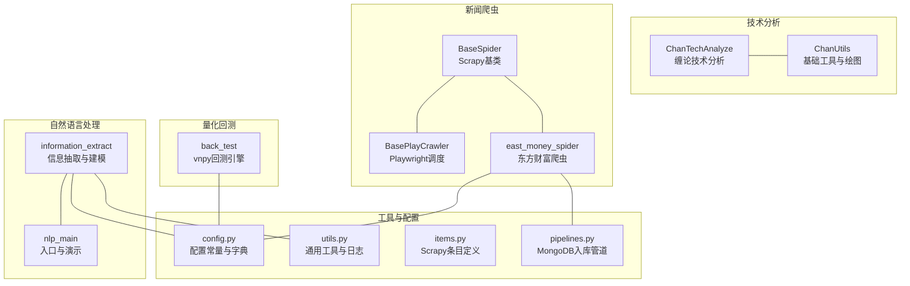
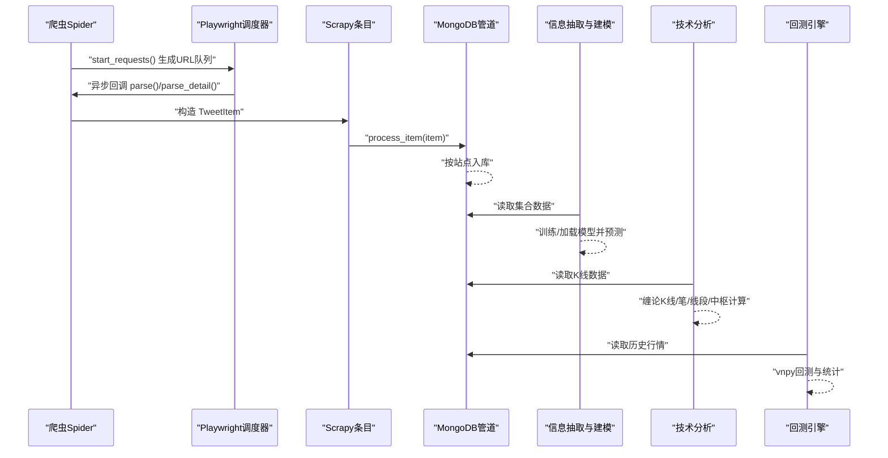
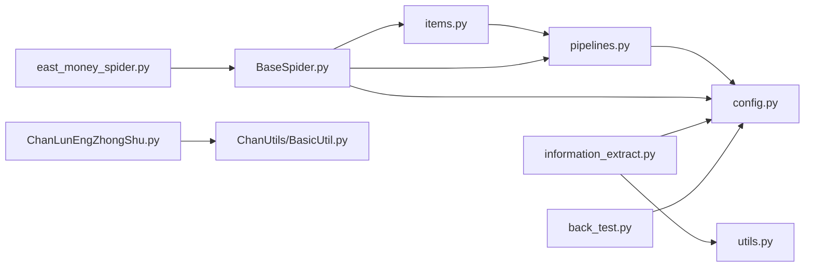

# 代码规范与标准

<cite>
**本文引用的文件**
- [README.md](file://README.md)
- [ProblemSolve.md](file://ProblemSolve.md)
- [src/Utils/config.py](file://src/Utils/config.py)
- [src/Utils/utils.py](file://src/Utils/utils.py)
- [src/Utils/items.py](file://src/Utils/items.py)
- [src/ChanUtils/BasicUtil.py](file://src/ChanUtils/BasicUtil.py)
- [src/ChanTechAnalyze/ChanLunEngZhongShu.py](file://src/ChanTechAnalyze/ChanLunEngZhongShu.py)
- [src/MarketNewsSpiderWithScrapy/BaseSpider.py](file://src/MarketNewsSpiderWithScrapy/BaseSpider.py)
- [src/MarketNewsSpiderWithScrapy/BasePlayCrawler.py](file://src/MarketNewsSpiderWithScrapy/BasePlayCrawler.py)
- [src/MarketNewsSpiderWithScrapy/east_money_spider.py](file://src/MarketNewsSpiderWithScrapy/east_money_spider.py)
- [src/NlpModel/information_extract.py](file://src/NlpModel/information_extract.py)
- [src/NlpModel/nlp_main.py](file://src/NlpModel/nlp_main.py)
- [src/VnpyBacktesting/back_test.py](file://src/VnpyBacktesting/back_test.py)
- [src/pipelines.py](file://src/pipelines.py)
</cite>

## 目录
1. [引言](#引言)
2. [项目结构](#项目结构)
3. [核心组件](#核心组件)
4. [架构总览](#架构总览)
5. [详细组件分析](#详细组件分析)
6. [依赖分析](#依赖分析)
7. [性能考虑](#性能考虑)
8. [故障排查指南](#故障排查指南)
9. [结论](#结论)
10. [附录](#附录)

## 引言
本文件旨在建立并规范本项目的代码风格与标准，覆盖命名约定、缩进与注释、模块导入与包组织、格式化工具建议、变量与函数定义、类设计最佳实践、异常处理与错误报告、文档字符串规范、以及代码审查清单与质量检查标准。目标是提升代码一致性、可读性与可维护性，降低协作成本与技术债。

## 项目结构
项目采用按功能域分层的模块化组织方式，主要模块包括：
- 技术分析：ChanTechAnalyze、ChanUtils
- 新闻爬虫：MarketNewsSpiderWithScrapy
- 价格爬虫：MarketPriceSpiderWithScrapy
- 自然语言处理：NlpModel
- 量化回测：VnpyBacktesting
- 工具与配置：Utils、MongoDbComTools、ThirdPartyToolSurpriver
- 数据与资源：data、info

**图示来源**
- [src/ChanTechAnalyze/ChanLunEngZhongShu.py:1-185](file://src/ChanTechAnalyze/ChanLunEngZhongShu.py#L1-L185)
- [src/ChanUtils/BasicUtil.py:1-695](file://src/ChanUtils/BasicUtil.py#L1-L695)
- [src/MarketNewsSpiderWithScrapy/BaseSpider.py:1-149](file://src/MarketNewsSpiderWithScrapy/BaseSpider.py#L1-L149)
- [src/MarketNewsSpiderWithScrapy/BasePlayCrawler.py:1-120](file://src/MarketNewsSpiderWithScrapy/BasePlayCrawler.py#L1-L120)
- [src/MarketNewsSpiderWithScrapy/east_money_spider.py:1-78](file://src/MarketNewsSpiderWithScrapy/east_money_spider.py#L1-L78)
- [src/NlpModel/information_extract.py:1-424](file://src/NlpModel/information_extract.py#L1-L424)
- [src/NlpModel/nlp_main.py:1-70](file://src/NlpModel/nlp_main.py#L1-L70)
- [src/VnpyBacktesting/back_test.py:1-287](file://src/VnpyBacktesting/back_test.py#L1-L287)
- [src/Utils/config.py:1-455](file://src/Utils/config.py#L1-L455)
- [src/Utils/utils.py:1-251](file://src/Utils/utils.py#L1-L251)
- [src/Utils/items.py:1-18](file://src/Utils/items.py#L1-L18)
- [src/pipelines.py:1-56](file://src/pipelines.py#L1-L56)

**章节来源**
- [README.md:1-33](file://README.md#L1-L33)

## 核心组件
- 配置中心：集中管理数据库、爬虫站点、模型路径等全局常量与字典。
- 通用工具：日志、邮件、日期、分词、向量化、训练集拆分等。
- 爬虫体系：基于Scrapy的Spider基类与Playwright异步调度器。
- NLP模块：分词、特征工程、朴素贝叶斯与SVM二分类模型训练与预测。
- 技术分析：缠论K线对象、笔与线段、中枢与买卖点识别。
- 回测引擎：vnpy回测框架封装与可视化。

**章节来源**
- [src/Utils/config.py:1-455](file://src/Utils/config.py#L1-L455)
- [src/Utils/utils.py:1-251](file://src/Utils/utils.py#L1-L251)
- [src/MarketNewsSpiderWithScrapy/BaseSpider.py:1-149](file://src/MarketNewsSpiderWithScrapy/BaseSpider.py#L1-L149)
- [src/MarketNewsSpiderWithScrapy/BasePlayCrawler.py:1-120](file://src/MarketNewsSpiderWithScrapy/BasePlayCrawler.py#L1-L120)
- [src/NlpModel/information_extract.py:1-424](file://src/NlpModel/information_extract.py#L1-L424)
- [src/ChanUtils/BasicUtil.py:1-695](file://src/ChanUtils/BasicUtil.py#L1-L695)
- [src/VnpyBacktesting/back_test.py:1-287](file://src/VnpyBacktesting/back_test.py#L1-L287)

## 架构总览
下图展示从爬虫采集、NLP处理到技术分析与回测的整体流程。

**图示来源**
- [src/MarketNewsSpiderWithScrapy/BaseSpider.py:1-149](file://src/MarketNewsSpiderWithScrapy/BaseSpider.py#L1-L149)
- [src/MarketNewsSpiderWithScrapy/BasePlayCrawler.py:1-120](file://src/MarketNewsSpiderWithScrapy/BasePlayCrawler.py#L1-L120)
- [src/Utils/items.py:1-18](file://src/Utils/items.py#L1-L18)
- [src/pipelines.py:1-56](file://src/pipelines.py#L1-L56)
- [src/NlpModel/information_extract.py:1-424](file://src/NlpModel/information_extract.py#L1-L424)
- [src/ChanTechAnalyze/ChanLunEngZhongShu.py:1-185](file://src/ChanTechAnalyze/ChanLunEngZhongShu.py#L1-L185)
- [src/VnpyBacktesting/back_test.py:1-287](file://src/VnpyBacktesting/back_test.py#L1-L287)

## 详细组件分析

### 组件A：配置与常量管理（config.py）
- 规范要点
  - 使用UTF-8编码声明与注释，确保跨平台兼容。
  - 全局常量采用全大写命名，便于静态扫描与IDE索引。
  - 站点字典与数据库集合名称集中管理，便于扩展与维护。
  - 模型路径、停用词路径、分词方法等统一出口，减少硬编码。
- 建议
  - 对外暴露的配置项建议提供默认值与校验，避免运行期异常。
  - 将敏感信息（如账号密码）放入环境变量或安全配置文件。

**章节来源**
- [src/Utils/config.py:1-455](file://src/Utils/config.py#L1-L455)

### 组件B：通用工具与日志（utils.py）
- 规范要点
  - 日志格式统一，包含时间、文件名、行号、级别与消息。
  - 邮件发送函数封装异常捕获，记录错误日志。
  - 日期工具函数支持范围生成与分组，便于批量处理。
  - 文本处理函数支持中文字符计数、停用词加载与稀疏矩阵转换。
- 建议
  - 将日志级别与格式通过配置文件控制，便于不同环境切换。
  - 对网络请求设置超时与重试策略，增强健壮性。

**章节来源**
- [src/Utils/utils.py:1-251](file://src/Utils/utils.py#L1-L251)

### 组件C：爬虫基类与调度（BaseSpider、BasePlayCrawler）
- 规范要点
  - Spider基类统一初始化字段、日志与名称映射，便于后续扩展。
  - 详情页解析统一为from_paragraphs_to_item/from_playInfos_to_item，保证输出结构一致。
  - Playwright调度器并发运行多个爬虫，共享浏览器实例但隔离上下文，提高效率。
- 建议
  - 对回调异常进行更细粒度的捕获与重试。
  - 对页面元素选择器增加容错与降级策略。

**章节来源**
- [src/MarketNewsSpiderWithScrapy/BaseSpider.py:1-149](file://src/MarketNewsSpiderWithScrapy/BaseSpider.py#L1-L149)
- [src/MarketNewsSpiderWithScrapy/BasePlayCrawler.py:1-120](file://src/MarketNewsSpiderWithScrapy/BasePlayCrawler.py#L1-L120)

### 组件D：NLP信息抽取与建模（information_extract、nlp_main）
- 规范要点
  - 分词器与停用词路径来自配置，便于切换与定制。
  - 训练集与测试集拆分、TF-IDF向量化、多模型融合预测。
  - 输出结构清晰，便于后续入库与分析。
- 建议
  - 对模型持久化文件增加版本控制与校验。
  - 对未知数据的预测增加置信度阈值过滤。

**章节来源**
- [src/NlpModel/information_extract.py:1-424](file://src/NlpModel/information_extract.py#L1-L424)
- [src/NlpModel/nlp_main.py:1-70](file://src/NlpModel/nlp_main.py#L1-L70)

### 组件E：技术分析（ChanUtils、ChanTechAnalyze）
- 规范要点
  - K线、笔、线段、中枢等对象化建模，接口清晰。
  - 支持合并与包含关系判断，保证技术形态识别的准确性。
  - 买卖点识别与绘图工具分离，便于扩展与复用。
- 建议
  - 对边界条件与异常输入增加断言与日志。
  - 对绘图参数进行配置化，支持不同分辨率与主题。

**章节来源**
- [src/ChanUtils/BasicUtil.py:1-695](file://src/ChanUtils/BasicUtil.py#L1-L695)
- [src/ChanTechAnalyze/ChanLunEngZhongShu.py:1-185](file://src/ChanTechAnalyze/ChanLunEngZhongShu.py#L1-L185)

### 组件F：Scrapy条目与入库管道（items、pipelines）
- 规范要点
  - 条目字段与爬虫输出保持一致，便于序列化与入库。
  - 管道按站点动态选择集合，避免重复写入。
- 建议
  - 对重复键异常进行幂等处理与告警。
  - 对入库失败进行重试与死信队列处理。

**章节来源**
- [src/Utils/items.py:1-18](file://src/Utils/items.py#L1-L18)
- [src/pipelines.py:1-56](file://src/pipelines.py#L1-L56)

## 依赖分析
- 模块内聚与耦合
  - NLP模块依赖配置与数据库工具，耦合度适中，便于替换分词器或模型。
  - 技术分析模块依赖数据工具与绘图工具，关注点分离良好。
  - 爬虫模块与管道解耦，调度器独立于具体站点实现。
- 外部依赖
  - Scrapy、Playwright、MongoDB、vnpy、pandas、numpy、sklearn等。
- 循环依赖
  - 未见明显循环导入；若新增模块需避免双向引用。

**图示来源**
- [src/Utils/items.py:1-18](file://src/Utils/items.py#L1-L18)
- [src/pipelines.py:1-56](file://src/pipelines.py#L1-L56)
- [src/Utils/config.py:1-455](file://src/Utils/config.py#L1-L455)
- [src/MarketNewsSpiderWithScrapy/BaseSpider.py:1-149](file://src/MarketNewsSpiderWithScrapy/BaseSpider.py#L1-L149)
- [src/MarketNewsSpiderWithScrapy/east_money_spider.py:1-78](file://src/MarketNewsSpiderWithScrapy/east_money_spider.py#L1-L78)
- [src/NlpModel/information_extract.py:1-424](file://src/NlpModel/information_extract.py#L1-L424)
- [src/Utils/utils.py:1-251](file://src/Utils/utils.py#L1-L251)
- [src/ChanTechAnalyze/ChanLunEngZhongShu.py:1-185](file://src/ChanTechAnalyze/ChanLunEngZhongShu.py#L1-L185)
- [src/ChanUtils/BasicUtil.py:1-695](file://src/ChanUtils/BasicUtil.py#L1-L695)
- [src/VnpyBacktesting/back_test.py:1-287](file://src/VnpyBacktesting/back_test.py#L1-L287)

## 性能考虑
- 网络与IO
  - 爬虫请求设置合理超时与重试；对慢响应站点采用限速与排队。
  - 数据库批量插入与索引优化，避免重复写入。
- 内存与计算
  - 向量化与稀疏矩阵转换时注意内存峰值；分批处理大数据集。
  - 模型预测阶段尽量复用向量化器与缓存中间结果。
- 可视化
  - 图表生成使用无头模式，避免阻塞；批量导出PNG时控制并发。

## 故障排查指南
- 爬虫异常
  - 页面元素选择器失效：检查selector变更与降级策略。
  - 超时与反爬：调整UA、延时与代理；必要时启用会话复用。
- 数据库异常
  - 重复键冲突：入库前去重或使用upsert；记录告警日志。
  - 连接失败：检查主机、端口与认证配置。
- NLP异常
  - 模型文件缺失：确认模型路径与版本；提供降级方案。
  - 文本编码问题：统一UTF-8编码，清洗特殊字符。
- 回测异常
  - 缺失历史数据：检查数据准备流程与日期范围。
  - 参数非法：对输入参数进行严格校验与默认值处理。

**章节来源**
- [src/pipelines.py:1-56](file://src/pipelines.py#L1-L56)
- [src/Utils/utils.py:1-251](file://src/Utils/utils.py#L1-L251)
- [src/VnpyBacktesting/back_test.py:1-287](file://src/VnpyBacktesting/back_test.py#L1-L287)

## 结论
本规范以项目现有代码为基础，总结了命名、导入、注释、异常处理、文档字符串与质量检查等方面的要求。建议在团队内推广并持续演进，结合自动化工具（如lint、format、test）形成完整的质量闭环。

## 附录

### Python代码编写规范与标准
- 命名约定
  - 模块与包：全小写，必要时以下划线分隔（如 market_news_spider）。
  - 类名：采用PascalCase（如 BaseSpider、InformationExtract）。
  - 函数与方法：采用snake_case（如 get_logger、build_2_class_classify_model）。
  - 常量：全大写，单词间下划线分隔（如 MAX_RETRY、DEFAULT_TIMEOUT）。
  - 私有成员：以下划线前缀（如 _private_method）。
- 缩进与排版
  - 统一使用4空格缩进；行宽不超过100字符。
  - 函数与类之间空两行；方法之间空一行；逻辑分组内空一行。
- 注释与文档字符串
  - 文件顶部添加编码声明与简要说明。
  - 类与公共函数必须包含文档字符串，描述用途、参数、返回值与异常。
  - 复杂逻辑处添加行内注释，解释“为什么”而非“是什么”。

**章节来源**
- [src/Utils/config.py:1-455](file://src/Utils/config.py#L1-L455)
- [src/Utils/utils.py:1-251](file://src/Utils/utils.py#L1-L251)
- [src/Utils/items.py:1-18](file://src/Utils/items.py#L1-L18)
- [src/ChanUtils/BasicUtil.py:1-695](file://src/ChanUtils/BasicUtil.py#L1-L695)
- [src/NlpModel/information_extract.py:1-424](file://src/NlpModel/information_extract.py#L1-L424)
- [src/VnpyBacktesting/back_test.py:1-287](file://src/VnpyBacktesting/back_test.py#L1-L287)

### PEP8遵循情况
- 已遵循
  - 模块编码声明、函数与类命名、缩进与空行规范。
  - 导入分组（标准库、第三方、本地模块）与相对导入限制。
- 建议改进
  - 对长行进行断行与续行符使用的一致性检查。
  - 对未使用的导入与变量进行清理。

**章节来源**
- [src/MarketNewsSpiderWithScrapy/BaseSpider.py:1-149](file://src/MarketNewsSpiderWithScrapy/BaseSpider.py#L1-L149)
- [src/MarketNewsSpiderWithScrapy/east_money_spider.py:1-78](file://src/MarketNewsSpiderWithScrapy/east_money_spider.py#L1-L78)
- [src/ChanTechAnalyze/ChanLunEngZhongShu.py:1-185](file://src/ChanTechAnalyze/ChanLunEngZhongShu.py#L1-L185)

### 模块导入规范与包组织
- 导入顺序
  - 标准库 → 第三方库 → 本地模块；同一组内按字母序。
  - 使用绝对导入优先，仅在同包内使用相对导入。
- 包组织
  - 功能域明确：技术分析、新闻爬虫、NLP、回测、工具与配置。
  - 避免跨包循环依赖；通过接口或中间层解耦。

**章节来源**
- [src/Utils/config.py:1-455](file://src/Utils/config.py#L1-L455)
- [src/Utils/utils.py:1-251](file://src/Utils/utils.py#L1-L251)
- [src/pipelines.py:1-56](file://src/pipelines.py#L1-L56)

### 代码格式化工具配置与使用
- 推荐工具
  - 格式化：black（统一风格）
  - 类型检查：mypy（可选）
  - Lint：flake8 + import-order（自定义规则）
  - 文档字符串：docformatter（统一格式）
- 使用建议
  - 在CI中强制执行；提交前本地运行；IDE集成自动格式化。
  - 对第三方库与配置文件（如配置）可放宽格式化要求。

[本节为通用指导，无需特定文件来源]

### 变量命名、函数定义与类设计最佳实践
- 变量命名
  - 使用语义化名称；布尔变量以is_/has_/can_开头。
  - 避免单字母变量（除非循环索引）。
- 函数定义
  - 参数数量不宜过多；默认参数放在末尾；使用关键字参数。
  - 单一职责；短小精悍；必要时拆分为子函数。
- 类设计
  - 封装内部状态；公开清晰的接口；避免魔法数字与字符串。
  - 使用数据类或命名元组简化简单容器。

**章节来源**
- [src/Utils/utils.py:1-251](file://src/Utils/utils.py#L1-L251)
- [src/ChanUtils/BasicUtil.py:1-695](file://src/ChanUtils/BasicUtil.py#L1-L695)
- [src/NlpModel/information_extract.py:1-424](file://src/NlpModel/information_extract.py#L1-L424)

### 异常处理与错误报告标准
- 异常处理
  - 明确捕获范围；记录上下文信息；避免吞掉异常。
  - 对可恢复错误使用重试与退避；对不可恢复错误快速失败。
- 错误报告
  - 统一日志格式；包含时间戳、模块、行号、严重级别。
  - 对外部系统调用（数据库、网络）记录请求与响应摘要。

**章节来源**
- [src/Utils/utils.py:1-251](file://src/Utils/utils.py#L1-L251)
- [src/pipelines.py:1-56](file://src/pipelines.py#L1-L56)

### 文档字符串编写规范与示例
- 规范
  - 使用三重双引号；首行简述用途；空一行后详述参数、返回与异常。
  - 参数与返回值标注类型（可选）；异常说明触发条件。
- 示例参考
  - 通用工具中的函数文档字符串展示了参数与返回说明。
  - NLP模块中的类与方法文档字符串体现了职责与接口。

**章节来源**
- [src/Utils/utils.py:1-251](file://src/Utils/utils.py#L1-L251)
- [src/NlpModel/information_extract.py:1-424](file://src/NlpModel/information_extract.py#L1-L424)

### 代码审查清单与质量检查标准
- 代码审查清单
  - 命名是否清晰、一致；导入是否规范；注释是否充分。
  - 是否存在重复代码；复杂度是否过高；边界条件是否覆盖。
  - 异常处理是否完善；日志是否可观测；性能瓶颈是否识别。
- 质量检查标准
  - 通过单元测试与集成测试；覆盖率不低于80%。
  - 通过静态分析与格式化检查；无未处理的TODO/FIXME。
  - CI流水线包含构建、测试、打包与部署步骤。

[本节为通用指导，无需特定文件来源]