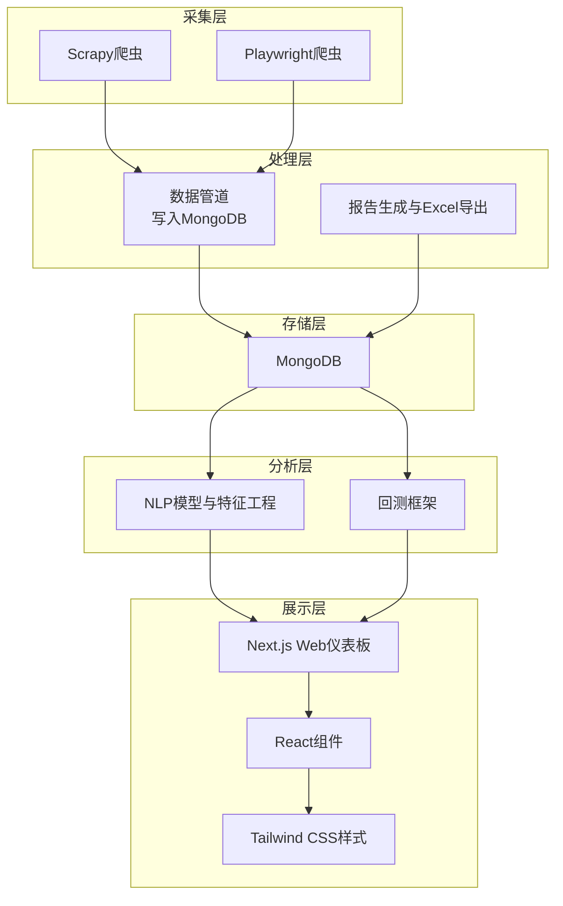
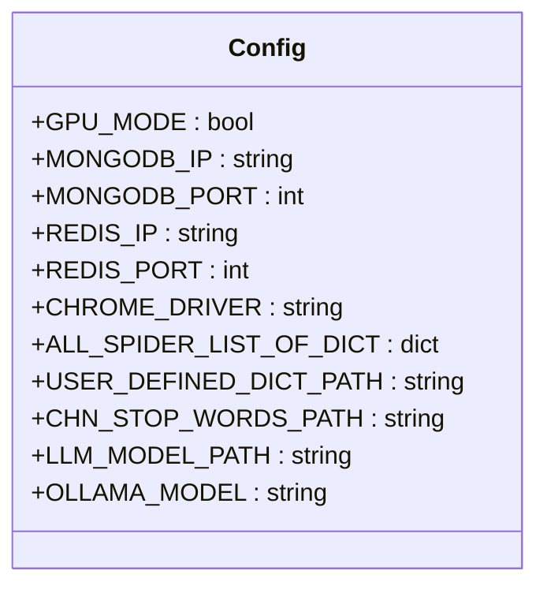
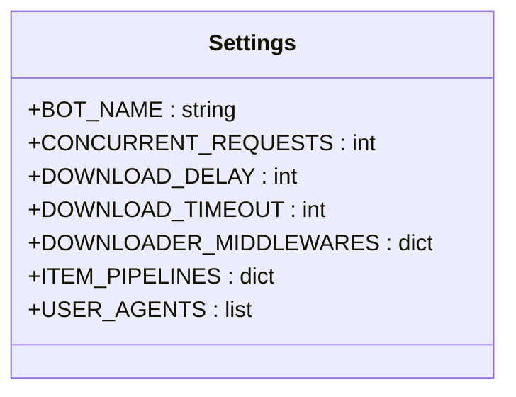
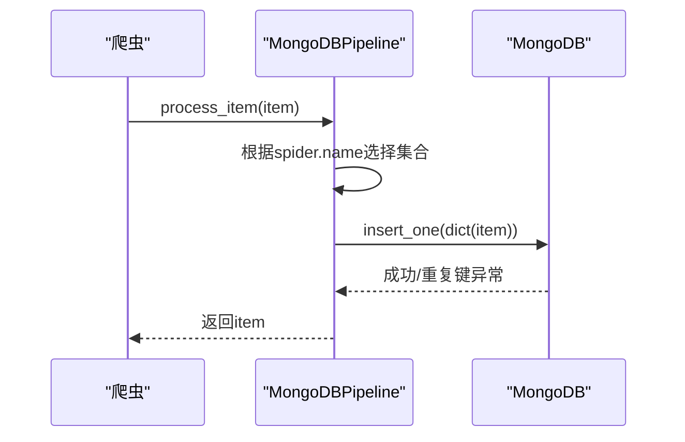
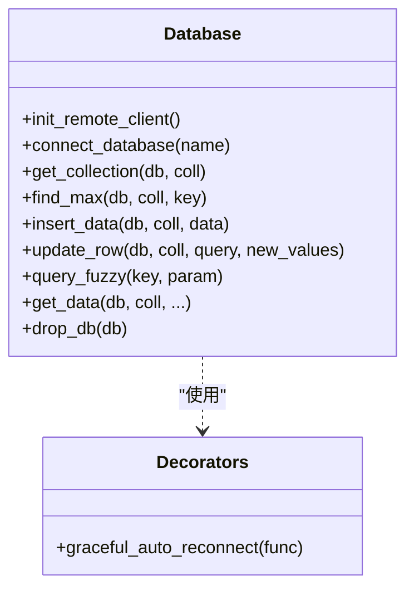
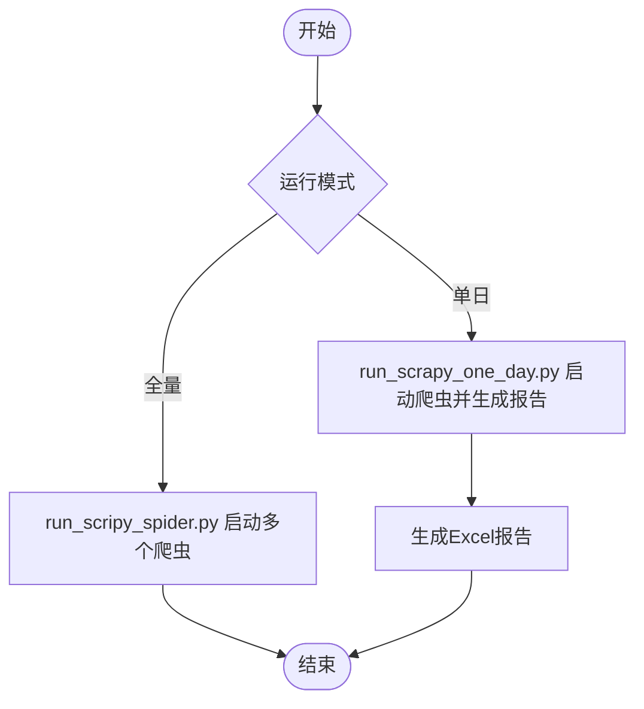
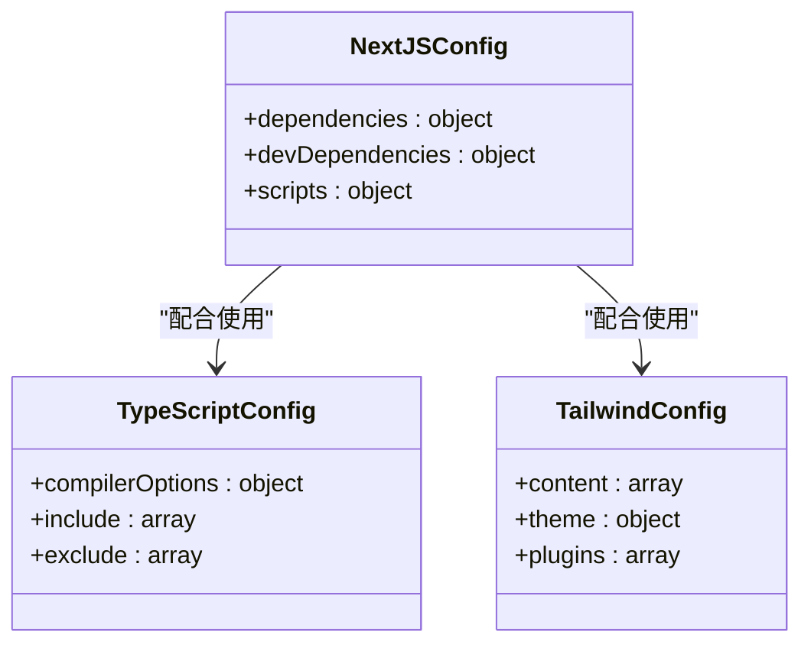
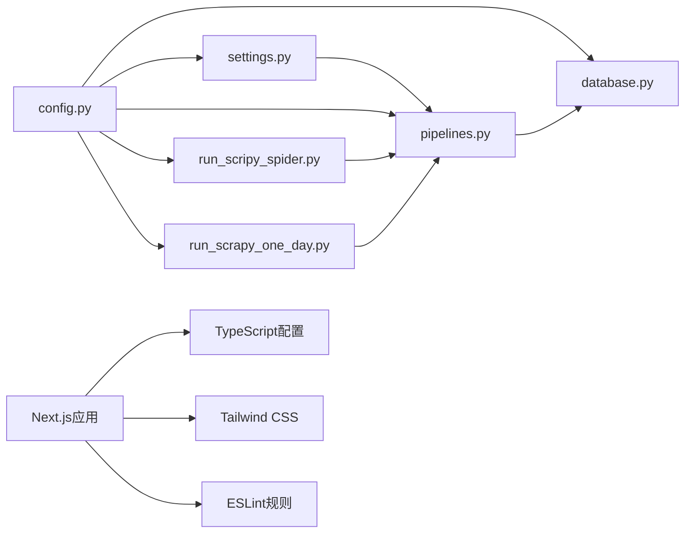
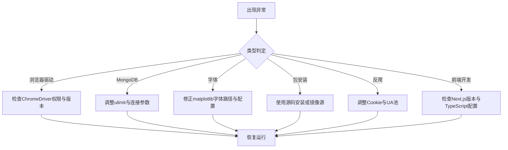

# 开发工具与环境配置

<cite>
**本文档引用的文件**
- [README.md](file://README.md)
- [ProblemSolve.md](file://ProblemSolve.md)
- [.gitignore](file://.gitignore)
- [src/Utils/config.py](file://src/Utils/config.py)
- [src/settings.py](file://src/settings.py)
- [src/pipelines.py](file://src/pipelines.py)
- [src/Utils/database.py](file://src/Utils/database.py)
- [src/Utils/utils.py](file://src/Utils/utils.py)
- [src/run_scripy_spider.py](file://src/run_scripy_spider.py)
- [src/run_scrapy_one_day.py](file://src/run_scrapy_one_day.py)
- [src/run1.sh](file://src/run1.sh)
- [web-dashboard/package.json](file://web-dashboard/package.json)
- [web-dashboard/tsconfig.json](file://web-dashboard/tsconfig.json)
- [web-dashboard/next.config.ts](file://web-dashboard/next.config.ts)
- [web-dashboard/postcss.config.mjs](file://web-dashboard/postcss.config.mjs)
- [web-dashboard/eslint.config.mjs](file://web-dashboard/eslint.config.mjs)
- [web-dashboard/src/app/layout.tsx](file://web-dashboard/src/app/layout.tsx)
- [web-dashboard/src/app/page.tsx](file://web-dashboard/src/app/page.tsx)
- [web-dashboard/src/app/globals.css](file://web-dashboard/src/app/globals.css)
- [web-dashboard/next-env.d.ts](file://web-dashboard/next-env.d.ts)
- [web-dashboard/AGENTS.md](file://web-dashboard/AGENTS.md)
- [web-dashboard/CLAUDE.md](file://web-dashboard/CLAUDE.md)
- [web-dashboard/README.md](file://web-dashboard/README.md)
</cite>

## 更新摘要
**所做更改**
- 新增Next.js开发环境配置章节，涵盖TypeScript设置、Tailwind CSS集成
- 更新项目结构图，添加web-dashboard目录
- 新增前端开发工具链配置说明
- 更新架构总览，反映技术栈迁移至Web仪表板

## 目录
1. [简介](#简介)
2. [项目结构](#项目结构)
3. [核心组件](#核心组件)
4. [架构总览](#架构总览)
5. [详细组件分析](#详细组件分析)
6. [依赖关系分析](#依赖关系分析)
7. [性能考虑](#性能考虑)
8. [故障排除指南](#故障排除指南)
9. [结论](#结论)
10. [附录](#附录)

## 简介
本指南面向量化新闻爬取与文本分析项目的开发团队，提供从IDE配置、虚拟环境、Git工作流、代码格式化与静态分析、数据库与可视化工具、API测试、容器化与本地开发服务器到性能分析与profiler使用的完整配置方案。**更新内容**：新增Next.js Web仪表板开发环境配置，涵盖TypeScript设置、Tailwind CSS集成、前端工具链等，反映项目从Python爬虫到Web仪表板的技术栈迁移。

## 项目结构
项目采用按功能域划分的模块化组织方式，核心目录与职责如下：
- src：核心业务代码，包含爬虫、数据处理、NLP模型、数据库工具、回测框架等
- web-dashboard：Next.js Web仪表板前端应用
- src/Utils：通用工具与配置模块
- src/MarketNewsSpiderWithScrapy：Scrapy爬虫实现
- src/NlpModel：自然语言处理与深度学习模型
- src/MongoDbComTools：MongoDB相关工具
- src/VnpyBacktesting：基于vn.py的回测框架
- src/data、src/info：数据与资源文件
- docs/images：文档图片
- 根目录：README、问题解决记录、忽略规则等

```mermaid
graph TB
A["项目根目录"] --> B["src"]
A --> C["web-dashboard"]
A --> D["docs/images"]
A --> E[".gitignore"]
A --> F["README.md"]
A --> G["ProblemSolve.md"]
B --> B1["ChanTechAnalyze"]
B --> B2["ChanUtils"]
B --> B3["FundamentalMarketAnalyze"]
B --> B4["MarketNewsSpiderWithScrapy"]
B --> B5["MarketPriceSpiderWithScrapy"]
B --> B6["MassBreak"]
B --> B7["MongoDbComTools"]
B --> B8["NlpModel"]
B --> B9["QuantAnalyze"]
B --> B10["ThirdPartyToolSurpriver"]
B --> B11["Utils"]
B --> B12["VnpyBacktesting"]
B --> B13["data"]
B --> B14["info"]
C --> C1["src/app"]
C --> C2["public"]
C --> C3[".next/types"]
C --> C4["package.json"]
C --> C5["tsconfig.json"]
C --> C6["next.config.ts"]
```

**图表来源**
- [README.md:1-33](file://README.md#L1-L33)
- [ProblemSolve.md:1-68](file://ProblemSolve.md#L1-L68)
- [web-dashboard/package.json:1-27](file://web-dashboard/package.json#L1-L27)

**章节来源**
- [README.md:1-33](file://README.md#L1-L33)
- [.gitignore:1-141](file://.gitignore#L1-L141)
- [web-dashboard/package.json:1-27](file://web-dashboard/package.json#L1-L27)

## 核心组件
- 配置中心：集中管理数据库、Redis、ChromeDriver路径、爬虫站点配置、模型路径等
- Scrapy设置：并发、下载延迟、中间件、管道等
- 数据管道：统一写入MongoDB，按站点分库分表
- 数据库工具：封装MongoClient、重连机制、查询与更新接口
- 运行入口：全量与单日爬取脚本，支持参数化控制
- 实用工具：邮件发送、日期处理、中文分词停用词加载等
- **前端应用**：Next.js Web仪表板，支持TypeScript、Tailwind CSS、React组件

**章节来源**
- [src/Utils/config.py:1-455](file://src/Utils/config.py#L1-L455)
- [src/settings.py:1-49](file://src/settings.py#L1-L49)
- [src/pipelines.py:1-56](file://src/pipelines.py#L1-L56)
- [src/Utils/database.py:1-176](file://src/Utils/database.py#L1-L176)
- [src/Utils/utils.py:1-251](file://src/Utils/utils.py#L1-L251)
- [src/run_scripy_spider.py:1-145](file://src/run_scripy_spider.py#L1-L145)
- [src/run_scrapy_one_day.py:1-195](file://src/run_scrapy_one_day.py#L1-L195)
- [web-dashboard/package.json:1-27](file://web-dashboard/package.json#L1-L27)

## 架构总览
系统采用"爬虫调度—数据清洗—存储—分析—报告"的流水线式架构。**更新内容**：新增Web仪表板前端层，提供现代化的数据可视化界面。Scrapy与Playwright并用以适配不同站点渲染需求；数据统一写入MongoDB；前端通过API接口访问后端数据，输出分析结果与交互式仪表板。

**图表来源**
- [src/run_scripy_spider.py:117-145](file://src/run_scripy_spider.py#L117-L145)
- [src/run_scrapy_one_day.py:32-195](file://src/run_scrapy_one_day.py#L32-L195)
- [src/pipelines.py:8-56](file://src/pipelines.py#L8-L56)
- [src/Utils/database.py:36-176](file://src/Utils/database.py#L36-L176)
- [web-dashboard/src/app/layout.tsx:1-34](file://web-dashboard/src/app/layout.tsx#L1-L34)

## 详细组件分析

### 组件A：配置中心与环境变量
- 平台检测与默认路径：根据操作系统类型自动选择MongoDB、Redis、ChromeDriver等路径
- 数据库与缓存：集中定义IP、端口、认证信息与数据库名称
- 爬虫站点清单：统一维护各新闻站点的数据库名、集合名、起始URL、关键词等
- 模型与字典：用户自定义词典、停用词、机器学习模型文件路径
- 大模型配置：本地或Ollama模型路径与设备类型

**图表来源**
- [src/Utils/config.py:1-455](file://src/Utils/config.py#L1-L455)

**章节来源**
- [src/Utils/config.py:1-455](file://src/Utils/config.py#L1-L455)

### 组件B：Scrapy设置与中间件
- 并发与超时：高并发请求、短超时与合理延迟平衡
- Cookie与重定向：禁用Cookie中间件，启用代理中间件
- 管道：MongoDBPipeline负责入库
- 用户代理池：轮换UA提升稳定性

**图表来源**
- [src/settings.py:1-49](file://src/settings.py#L1-L49)

**章节来源**
- [src/settings.py:1-49](file://src/settings.py#L1-L49)

### 组件C：数据管道与MongoDB写入
- 动态路由：根据爬虫名称映射到对应数据库与集合
- 去重处理：捕获重复键异常，避免重复写入
- 插入策略：使用单条插入，保证幂等性

**图表来源**
- [src/pipelines.py:25-56](file://src/pipelines.py#L25-L56)

**章节来源**
- [src/pipelines.py:1-56](file://src/pipelines.py#L1-L56)

### 组件D：数据库工具与重连机制
- 自动重连装饰器：指数退避重试，提升网络抖动下的稳定性
- 连接初始化：解密配置中的敏感信息，建立MongoClient
- 查询与更新：提供通用查询、模糊匹配、更新接口
- 性能参数：连接池大小、超时设置

**图表来源**
- [src/Utils/database.py:36-176](file://src/Utils/database.py#L36-L176)

**章节来源**
- [src/Utils/database.py:1-176](file://src/Utils/database.py#L1-L176)

### 组件E：运行入口与工作流
- 全量运行：run_scripy_spider.py支持按站点批量启动爬虫
- 单日运行：run_scrapy_one_day.py整合Playwright与Scrapy爬虫，并生成Excel报告
- Shell脚本：run1.sh演示定时任务与日志输出

**图表来源**
- [src/run_scripy_spider.py:117-145](file://src/run_scripy_spider.py#L117-L145)
- [src/run_scrapy_one_day.py:32-195](file://src/run_scrapy_one_day.py#L32-L195)

**章节来源**
- [src/run_scripy_spider.py:1-145](file://src/run_scripy_spider.py#L1-L145)
- [src/run_scrapy_one_day.py:1-195](file://src/run_scrapy_one_day.py#L1-L195)
- [src/run1.sh:1-49](file://src/run1.sh#L1-L49)

### 组件F：Next.js前端开发环境配置
**新增内容**：Web仪表板前端应用配置，支持TypeScript、Tailwind CSS、React组件开发。

- **包管理配置**：Next.js 16.2.2、React 19.2.4、TypeScript 5、Tailwind CSS 4
- **TypeScript设置**：严格模式、ESNext模块解析、路径别名@/*
- **构建配置**：Next.js配置文件、PostCSS集成、ESLint规则
- **样式系统**：Tailwind CSS集成、Geist字体、暗色主题支持
- **开发工具**：热重载、类型检查、代码格式化

**图表来源**
- [web-dashboard/package.json:1-27](file://web-dashboard/package.json#L1-L27)
- [web-dashboard/tsconfig.json:1-35](file://web-dashboard/tsconfig.json#L1-L35)
- [web-dashboard/postcss.config.mjs:1-8](file://web-dashboard/postcss.config.mjs#L1-L8)

**章节来源**
- [web-dashboard/package.json:1-27](file://web-dashboard/package.json#L1-L27)
- [web-dashboard/tsconfig.json:1-35](file://web-dashboard/tsconfig.json#L1-L35)
- [web-dashboard/next.config.ts:1-8](file://web-dashboard/next.config.ts#L1-L8)
- [web-dashboard/postcss.config.mjs:1-8](file://web-dashboard/postcss.config.mjs#L1-L8)
- [web-dashboard/eslint.config.mjs:1-19](file://web-dashboard/eslint.config.mjs#L1-L19)

## 依赖关系分析
- 组件内聚：配置、设置、管道、数据库工具在src/Utils下集中管理，便于复用与维护
- 组件耦合：爬虫与管道通过Scrapy框架解耦；管道与数据库通过统一接口解耦
- 外部依赖：MongoDB、Scrapy、Playwright、pandas、numpy、requests等
- **前端依赖**：Next.js、React、TypeScript、Tailwind CSS、ESLint等
- 可能的循环依赖：当前文件未见循环导入

**图表来源**
- [src/Utils/config.py:1-455](file://src/Utils/config.py#L1-L455)
- [src/settings.py:1-49](file://src/settings.py#L1-L49)
- [src/pipelines.py:1-56](file://src/pipelines.py#L1-L56)
- [src/Utils/database.py:1-176](file://src/Utils/database.py#L1-L176)
- [src/run_scripy_spider.py:1-145](file://src/run_scripy_spider.py#L1-L145)
- [src/run_scrapy_one_day.py:1-195](file://src/run_scrapy_one_day.py#L1-L195)
- [web-dashboard/package.json:1-27](file://web-dashboard/package.json#L1-L27)

**章节来源**
- [src/Utils/config.py:1-455](file://src/Utils/config.py#L1-L455)
- [src/settings.py:1-49](file://src/settings.py#L1-L49)
- [src/pipelines.py:1-56](file://src/pipelines.py#L1-L56)
- [src/Utils/database.py:1-176](file://src/Utils/database.py#L1-L176)
- [src/run_scripy_spider.py:1-145](file://src/run_scripy_spider.py#L1-L145)
- [src/run_scrapy_one_day.py:1-195](file://src/run_scrapy_one_day.py#L1-L195)
- [web-dashboard/package.json:1-27](file://web-dashboard/package.json#L1-L27)

## 性能考虑
- 爬虫并发与延迟：通过settings.py中的并发与延迟参数平衡吞吐与反爬策略
- 数据库连接池：database.py中设置最大连接池大小，减少连接开销
- 指数退避重试：graceful_auto_reconnect装饰器降低网络抖动影响
- 批量写入：优先使用单条插入，避免重复键异常导致的失败重试
- 报告生成：run_scrapy_one_day.py中对Excel写入进行分表与分页处理，避免内存峰值
- **前端性能**：Next.js自动代码分割、React组件懒加载、Tailwind CSS原子化样式优化

**章节来源**
- [src/settings.py:18-30](file://src/settings.py#L18-L30)
- [src/Utils/database.py:57-60](file://src/Utils/database.py#L57-L60)
- [src/Utils/database.py:15-33](file://src/Utils/database.py#L15-L33)
- [src/pipelines.py:48-56](file://src/pipelines.py#L48-L56)
- [src/run_scrapy_one_day.py:117-185](file://src/run_scrapy_one_day.py#L117-L185)
- [web-dashboard/src/app/layout.tsx:20-34](file://web-dashboard/src/app/layout.tsx#L20-L34)

## 故障排除指南
- 浏览览器驱动权限问题：确保ChromeDriver可执行权限，参考问题解决记录
- MongoDB连接限制：调整系统ulimit，增加最大文件句柄数
- 字体与绘图问题：Matplotlib字体路径与配置文件修正
- 包安装问题：特定包需从源码安装，参考问题解决记录
- 爬虫Cookie与UA：根据目标站点调整settings.py中的Cookie与UA池
- **前端开发问题**：Next.js版本兼容性、TypeScript类型错误、Tailwind CSS样式冲突

**图表来源**
- [ProblemSolve.md:47-67](file://ProblemSolve.md#L47-L67)
- [web-dashboard/AGENTS.md:1-6](file://web-dashboard/AGENTS.md#L1-L6)

**章节来源**
- [ProblemSolve.md:1-68](file://ProblemSolve.md#L1-L68)
- [web-dashboard/AGENTS.md:1-6](file://web-dashboard/AGENTS.md#L1-L6)

## 结论
本指南基于仓库现有配置与脚本，提供了从IDE到数据库、从爬虫到分析报告的完整开发环境配置方案。**更新内容**：新增Next.js Web仪表板开发环境配置，涵盖TypeScript设置、Tailwind CSS集成、前端工具链等，反映了项目从Python爬虫到Web仪表板的技术栈迁移。建议团队在实际落地时结合自身平台差异与安全策略，对敏感配置进行环境变量注入与密钥管理，持续优化并发参数与数据库连接池，确保在大规模数据采集与分析场景下的稳定性与性能。

## 附录

### A. IDE配置与插件推荐
- VSCode
  - Python扩展：提供语法高亮、调试、格式化与单元测试集成
  - Pylance：类型检查与智能提示
  - GitLens：增强Git体验
  - MongoDB插件：连接与查询MongoDB
  - Docker扩展：容器化开发与部署
  - **Next.js扩展**：提供TypeScript支持、代码片段、组件预览
  - **Tailwind CSS扩展**：提供智能提示与颜色预览
- PyCharm
  - 专业版：内置数据库工具、Docker、科学模式
  - 插件：MongoGogo、Rainbow Brackets、String Manipulation

### B. 虚拟环境与依赖管理
- Conda/Miniconda：创建隔离环境，管理Python版本与包
- pip-tools：锁定依赖版本，生成requirements
- Poetry：现代依赖管理与打包工具（可选）
- **前端依赖管理**：npm、yarn、pnpm、bun等包管理器

### C. Git工作流与分支管理
- 分支策略：主分支保护，特性分支从develop切出，合并后回主干
- 提交规范：使用清晰的提交信息，关联Issue编号
- 合并与审查：Pull Request进行代码审查，自动化测试通过后合并

### D. 代码格式化与静态分析
- 格式化：Black统一风格，isort整理导入顺序
- 类型检查：mypy或Pyright
- 规范检查：flake8、pylint
- 文档检查：doc8、pydocstyle
- **前端代码检查**：ESLint配置Next.js最佳实践，TypeScript类型检查

### E. 数据库客户端与可视化
- MongoDB：MongoDB Compass或Studio 3T
- 可视化：MongoDB Charts或自定义仪表板

### F. API测试与Postman配置
- Postman：导入集合，配置环境变量（URL、Token）
- 新建环境：包含基础URL、鉴权参数
- 集合：按模块划分，使用Tests脚本验证响应

### G. Docker与容器化开发
- Dockerfile：定义应用镜像，暴露端口，设置工作目录
- docker-compose.yml：编排MongoDB、Redis等依赖服务
- 环境变量：通过.env文件管理敏感配置
- 构建与运行：docker build && docker compose up

### H. 性能分析与profiler
- Python：cProfile、line_profiler、memory_profiler
- Web：浏览器开发者工具Network与Performance面板
- 数据库：MongoDB慢查询日志与索引分析
- **前端性能**：React DevTools、Next.js性能分析工具

### I. 开发服务器与本地测试
- 本地服务：使用uvicorn/Gunicorn运行FastAPI/Flask应用
- **前端开发**：Next.js开发服务器，支持热重载与SSR
- 测试：pytest + fixtures，覆盖爬虫、管道与工具函数
- 日志：集中化日志收集与检索