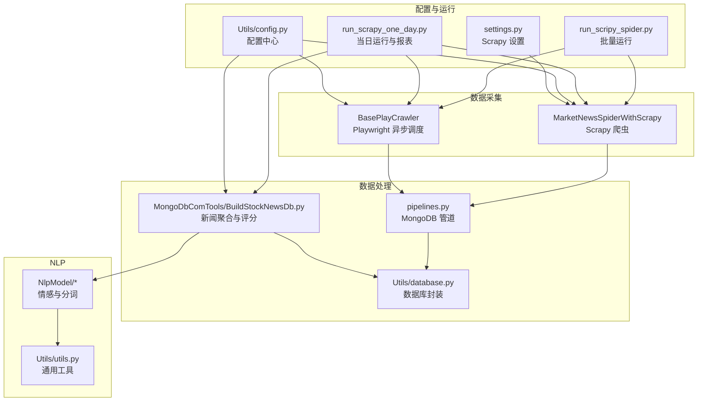
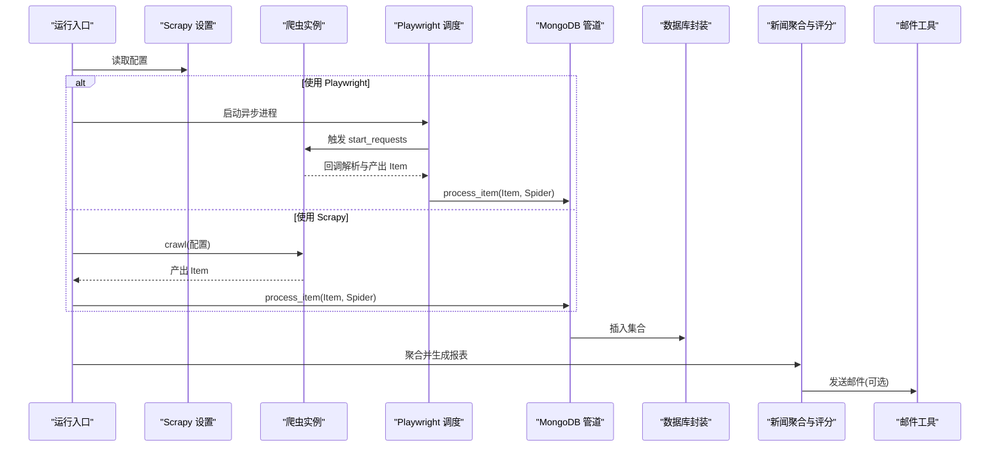
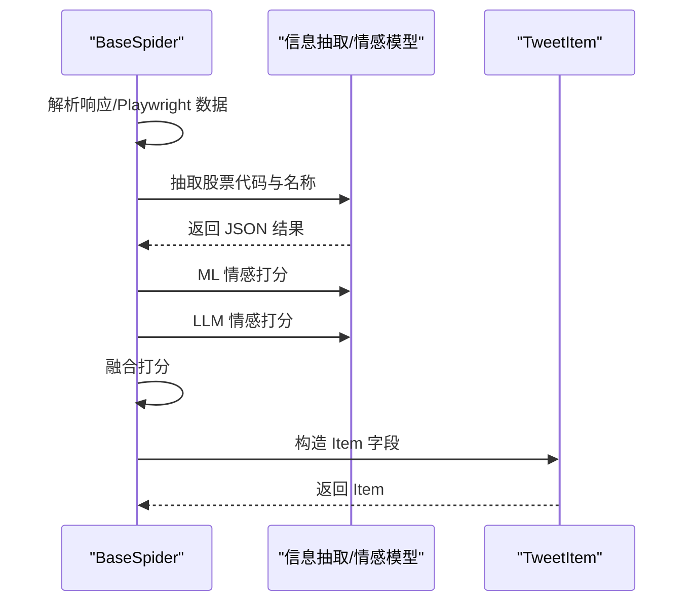
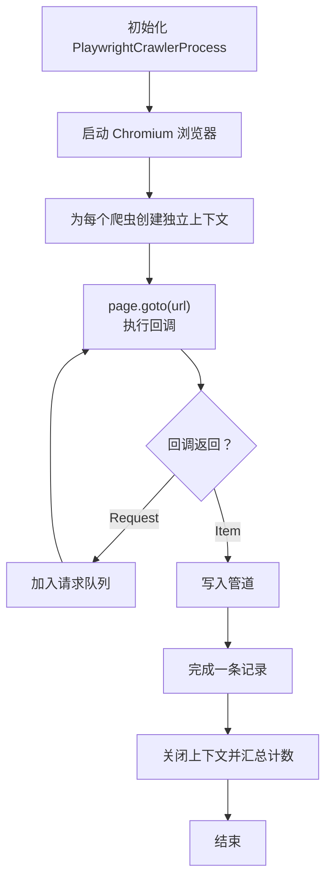
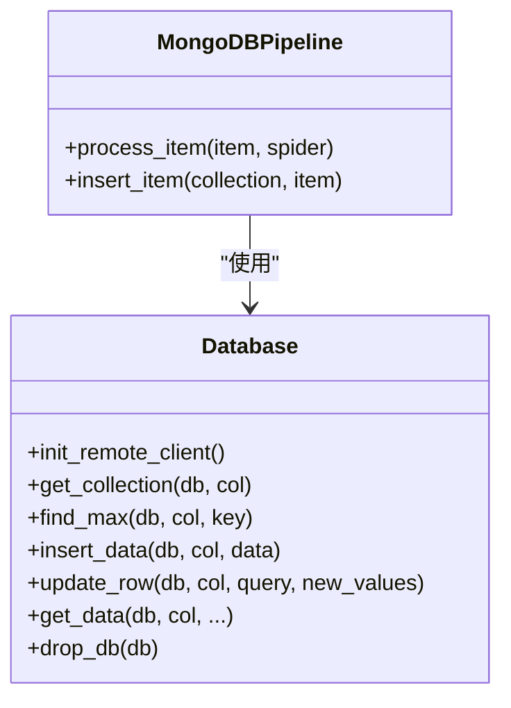
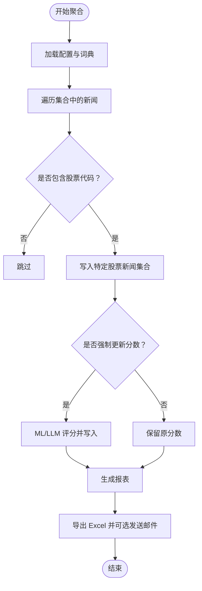
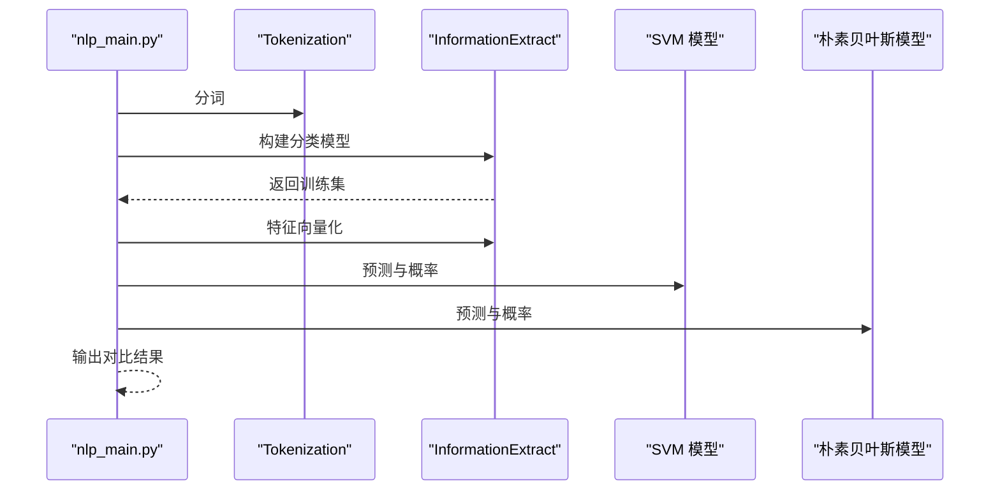
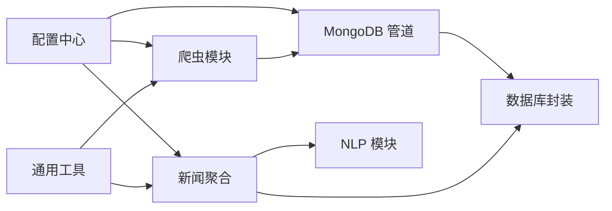

# 开发指南

<cite>
**本文引用的文件**
- [README.md](file://README.md)
- [ProblemSolve.md](file://ProblemSolve.md)
- [src/Utils/config.py](file://src/Utils/config.py)
- [src/settings.py](file://src/settings.py)
- [src/pipelines.py](file://src/pipelines.py)
- [src/Utils/database.py](file://src/Utils/database.py)
- [src/MarketNewsSpiderWithScrapy/BaseSpider.py](file://src/MarketNewsSpiderWithScrapy/BaseSpider.py)
- [src/MarketNewsSpiderWithScrapy/BasePlayCrawler.py](file://src/MarketNewsSpiderWithScrapy/BasePlayCrawler.py)
- [src/Utils/utils.py](file://src/Utils/utils.py)
- [src/MongoDbComTools/BuildStockNewsDb.py](file://src/MongoDbComTools/BuildStockNewsDb.py)
- [src/NlpModel/nlp_main.py](file://src/NlpModel/nlp_main.py)
- [src/run_scripy_spider.py](file://src/run_scripy_spider.py)
- [src/run_scrapy_one_day.py](file://src/run_scrapy_one_day.py)
- [src/test.py](file://src/test.py)
</cite>

## 目录
1. [简介](#简介)
2. [项目结构](#项目结构)
3. [核心组件](#核心组件)
4. [架构总览](#架构总览)
5. [详细组件分析](#详细组件分析)
6. [依赖分析](#依赖分析)
7. [性能考虑](#性能考虑)
8. [故障排查指南](#故障排查指南)
9. [结论](#结论)
10. [附录](#附录)

## 简介
本开发指南面向新加入的开发者，旨在帮助快速理解与融入项目开发，统一代码规范与开发标准，明确测试策略与单元测试编写方法，掌握部署流程与生产环境配置要点，提升性能优化与调试技巧，建立常见问题排查与解决方案体系，给出重构与扩展开发的指导原则，解释版本管理与发布流程，并提供开发工具与 IDE 配置建议，最终提升团队协作效率与代码质量。

## 项目结构
项目采用按功能域划分的目录结构，主要模块包括：
- 数据采集层：基于 Scrapy 与 Playwright 的新闻爬虫模块
- 数据处理与存储：MongoDB 管道与通用数据库访问封装
- 自然语言处理：新闻情感分析与关键词抽取
- 技术分析与基本面分析：缠论技术分析与基础财务分析
- 回测与交易：基于 vn.py 的回测框架
- 工具与配置：通用配置、日志、邮件、日期与数据处理工具



**图示来源**
- [src/run_scripy_spider.py:117-145](file://src/run_scripy_spider.py#L117-L145)
- [src/run_scrapy_one_day.py:32-195](file://src/run_scrapy_one_day.py#L32-L195)
- [src/pipelines.py:8-56](file://src/pipelines.py#L8-L56)
- [src/Utils/database.py:36-176](file://src/Utils/database.py#L36-L176)
- [src/MongoDbComTools/BuildStockNewsDb.py:19-241](file://src/MongoDbComTools/BuildStockNewsDb.py#L19-L241)
- [src/Utils/config.py:1-455](file://src/Utils/config.py#L1-L455)
- [src/settings.py:1-49](file://src/settings.py#L1-L49)

**章节来源**
- [README.md:1-33](file://README.md#L1-L33)
- [src/Utils/config.py:1-455](file://src/Utils/config.py#L1-L455)
- [src/settings.py:1-49](file://src/settings.py#L1-L49)

## 核心组件
- 配置中心：集中管理数据库、Redis、爬虫站点、模型路径、设备类型等配置项
- Scrapy 爬虫：定义各新闻源的爬取规则与字段映射
- Playwright 异步调度：对需要 JS 渲染或复杂交互的站点进行异步抓取
- MongoDB 管道：将不同来源的新闻写入对应数据库与集合
- 数据库封装：统一连接、查询、更新、异常重连等能力
- 新闻聚合与评分：抽取股票代码、情感打分、生成报表
- 通用工具：日志、邮件、日期、停用词加载、稀疏矩阵转换等

**章节来源**
- [src/Utils/config.py:1-455](file://src/Utils/config.py#L1-L455)
- [src/MarketNewsSpiderWithScrapy/BaseSpider.py:13-149](file://src/MarketNewsSpiderWithScrapy/BaseSpider.py#L13-L149)
- [src/MarketNewsSpiderWithScrapy/BasePlayCrawler.py:21-120](file://src/MarketNewsSpiderWithScrapy/BasePlayCrawler.py#L21-L120)
- [src/pipelines.py:8-56](file://src/pipelines.py#L8-L56)
- [src/Utils/database.py:36-176](file://src/Utils/database.py#L36-L176)
- [src/MongoDbComTools/BuildStockNewsDb.py:19-241](file://src/MongoDbComTools/BuildStockNewsDb.py#L19-L241)
- [src/Utils/utils.py:1-251](file://src/Utils/utils.py#L1-L251)

## 架构总览
整体流程从运行入口出发，按需选择 Scrapy 或 Playwright 爬虫，解析页面内容，抽取股票代码与情感分数，写入 MongoDB，再通过新闻聚合工具生成报表并可选发送邮件。



**图示来源**
- [src/run_scripy_spider.py:117-145](file://src/run_scripy_spider.py#L117-L145)
- [src/run_scrapy_one_day.py:32-195](file://src/run_scrapy_one_day.py#L32-L195)
- [src/MarketNewsSpiderWithScrapy/BasePlayCrawler.py:34-120](file://src/MarketNewsSpiderWithScrapy/BasePlayCrawler.py#L34-L120)
- [src/pipelines.py:25-56](file://src/pipelines.py#L25-L56)
- [src/Utils/database.py:78-88](file://src/Utils/database.py#L78-L88)
- [src/MongoDbComTools/BuildStockNewsDb.py:157-241](file://src/MongoDbComTools/BuildStockNewsDb.py#L157-L241)
- [src/Utils/utils.py:30-58](file://src/Utils/utils.py#L30-L58)

## 详细组件分析

### 配置中心与运行入口
- 配置中心负责数据库、Redis、爬虫站点、模型路径、设备类型等集中管理
- 运行入口支持批量与单日两种模式，分别调度 Playwright 与 Scrapy 爬虫，并可生成报表

```mermaid
flowchart TD
Start(["启动入口"]) --> Mode{"运行模式"}
Mode --> |批量(all)| RunAll["run_scripy_spider.py<br/>调度多个爬虫"]
Mode --> |单日(one_day)| RunOne["run_scrapy_one_day.py<br/>调度 Playwright/Scrapy"]
RunAll --> Cfg["读取配置<br/>Utils/config.py"]
RunOne --> Cfg
RunOne --> Report["生成报表并导出Excel"]
Cfg --> End(["完成"])
Report --> End
```

**图示来源**
- [src/run_scripy_spider.py:117-145](file://src/run_scripy_spider.py#L117-L145)
- [src/run_scrapy_one_day.py:32-195](file://src/run_scrapy_one_day.py#L32-L195)
- [src/Utils/config.py:1-455](file://src/Utils/config.py#L1-L455)

**章节来源**
- [src/Utils/config.py:1-455](file://src/Utils/config.py#L1-L455)
- [src/run_scripy_spider.py:117-145](file://src/run_scripy_spider.py#L117-L145)
- [src/run_scrapy_one_day.py:32-195](file://src/run_scrapy_one_day.py#L32-L195)

### 爬虫基类与回调流程
- BaseSpider 提供通用解析逻辑：段落清洗、股票代码与名称抽取、情感打分融合、构造 Item
- 支持 Playwright 回调与 Scrapy 回调两种模式



**图示来源**
- [src/MarketNewsSpiderWithScrapy/BaseSpider.py:41-146](file://src/MarketNewsSpiderWithScrapy/BaseSpider.py#L41-L146)
- [src/MongoDbComTools/BuildStockNewsDb.py:28-52](file://src/MongoDbComTools/BuildStockNewsDb.py#L28-L52)

**章节来源**
- [src/MarketNewsSpiderWithScrapy/BaseSpider.py:13-149](file://src/MarketNewsSpiderWithScrapy/BaseSpider.py#L13-L149)

### Playwright 异步调度
- 通过 asyncio 并发运行多个爬虫，共享浏览器实例但使用独立上下文，避免 Cookie 干扰
- 支持随机 UA、并发抓取、回调处理与管道写入



**图示来源**
- [src/MarketNewsSpiderWithScrapy/BasePlayCrawler.py:21-120](file://src/MarketNewsSpiderWithScrapy/BasePlayCrawler.py#L21-L120)

**章节来源**
- [src/MarketNewsSpiderWithScrapy/BasePlayCrawler.py:21-120](file://src/MarketNewsSpiderWithScrapy/BasePlayCrawler.py#L21-L120)

### MongoDB 管道与数据库封装
- 管道根据爬虫名称将数据写入对应数据库与集合
- 数据库封装提供自动重连、查询、更新、最大值查询等能力



**图示来源**
- [src/pipelines.py:8-56](file://src/pipelines.py#L8-L56)
- [src/Utils/database.py:36-176](file://src/Utils/database.py#L36-L176)

**章节来源**
- [src/pipelines.py:8-56](file://src/pipelines.py#L8-L56)
- [src/Utils/database.py:36-176](file://src/Utils/database.py#L36-L176)

### 新闻聚合与评分
- 从各新闻源集合中读取数据，抽取股票代码，写入“特定股票新闻”集合
- 可选强制使用模型或 LLM 更新情感分数，生成报表并导出 Excel



**图示来源**
- [src/MongoDbComTools/BuildStockNewsDb.py:157-241](file://src/MongoDbComTools/BuildStockNewsDb.py#L157-L241)
- [src/Utils/utils.py:30-58](file://src/Utils/utils.py#L30-L58)

**章节来源**
- [src/MongoDbComTools/BuildStockNewsDb.py:19-241](file://src/MongoDbComTools/BuildStockNewsDb.py#L19-L241)
- [src/Utils/utils.py:1-251](file://src/Utils/utils.py#L1-L251)

### NLP 主流程与测试入口
- NLP 主流程演示了分词、特征提取、模型预测与结果输出
- 测试入口提供示例与回测框架调用方式（注释）



**图示来源**
- [src/NlpModel/nlp_main.py:17-70](file://src/NlpModel/nlp_main.py#L17-L70)

**章节来源**
- [src/NlpModel/nlp_main.py:1-70](file://src/NlpModel/nlp_main.py#L1-L70)
- [src/test.py:1-148](file://src/test.py#L1-L148)

## 依赖分析
- 组件内聚高、耦合低：爬虫、管道、数据库封装职责清晰
- 外部依赖集中在配置中心，便于集中管理与切换
- 运行入口与爬虫解耦，通过配置驱动



**图示来源**
- [src/Utils/config.py:1-455](file://src/Utils/config.py#L1-L455)
- [src/pipelines.py:8-56](file://src/pipelines.py#L8-L56)
- [src/Utils/database.py:36-176](file://src/Utils/database.py#L36-L176)
- [src/MongoDbComTools/BuildStockNewsDb.py:19-241](file://src/MongoDbComTools/BuildStockNewsDb.py#L19-L241)
- [src/Utils/utils.py:1-251](file://src/Utils/utils.py#L1-L251)

**章节来源**
- [src/Utils/config.py:1-455](file://src/Utils/config.py#L1-L455)
- [src/pipelines.py:8-56](file://src/pipelines.py#L8-L56)
- [src/Utils/database.py:36-176](file://src/Utils/database.py#L36-L176)
- [src/MongoDbComTools/BuildStockNewsDb.py:19-241](file://src/MongoDbComTools/BuildStockNewsDb.py#L19-L241)
- [src/Utils/utils.py:1-251](file://src/Utils/utils.py#L1-L251)

## 性能考虑
- 并发与限速：Scrapy 设置中限制并发请求数与下载延迟，避免触发目标站点反爬
- 异步抓取：Playwright 并发运行多个爬虫，减少总耗时
- 数据库连接池：设置最大连接池大小，降低连接开销
- 自动重连与指数退避：数据库封装内置自动重连机制，提升稳定性
- 缓存与去重：管道层捕获重复键异常，避免重复入库

**章节来源**
- [src/settings.py:18-30](file://src/settings.py#L18-L30)
- [src/MarketNewsSpiderWithScrapy/BasePlayCrawler.py:47-58](file://src/MarketNewsSpiderWithScrapy/BasePlayCrawler.py#L47-L58)
- [src/Utils/database.py:12-33](file://src/Utils/database.py#L12-L33)
- [src/pipelines.py:48-56](file://src/pipelines.py#L48-L56)

## 故障排查指南
- MongoDB 文件句柄过多：调整系统 ulimit，确保最大文件句柄数足够
- brew 安装与升级：提供常用命令与卸载脚本
- ChromeDriver 权限问题：检查可执行权限与版本匹配
- Matplotlib 字体问题：修改字体目录与配置文件
- 股票数据源：提供 akshare 等数据接口参考

**章节来源**
- [ProblemSolve.md:1-68](file://ProblemSolve.md#L1-L68)

## 结论
本指南从架构、组件、流程、性能与故障排查等方面系统梳理了项目开发要点。建议新成员先从运行入口与配置中心入手，逐步熟悉爬虫与管道的工作流，再深入 NLP 与数据库封装模块。遵循统一的配置与日志规范，结合并发与重试策略，可有效提升稳定性与性能。

## 附录

### 代码规范与开发标准
- 命名规范：模块与类使用 PascalCase，函数与变量使用 snake_case；常量使用 UPPER_CASE
- 注释规范：公共接口与复杂逻辑必须添加中文注释，说明输入、输出与边界条件
- 日志规范：统一使用 logging，级别区分 INFO/WARNING/ERROR，避免 print
- 配置集中化：所有外部依赖与路径统一在配置中心维护
- 错误处理：对外部依赖异常（网络、数据库）进行捕获与重试，必要时记录上下文

**章节来源**
- [src/Utils/config.py:1-455](file://src/Utils/config.py#L1-L455)
- [src/Utils/database.py:15-33](file://src/Utils/database.py#L15-L33)
- [src/Utils/utils.py:18-27](file://src/Utils/utils.py#L18-L27)

### 测试策略与单元测试编写方法
- 单元测试：针对 NLP 模块与工具函数编写最小可验证用例，覆盖分词、向量化、预测等关键路径
- 集成测试：通过 run_scripy_spider.py 与 run_scrapy_one_day.py 的参数组合，验证爬取与聚合流程
- 回归测试：对 BaseSpider 的解析逻辑与情感打分融合逻辑进行回归验证
- 性能测试：在相同硬件条件下对比不同并发配置下的吞吐与延迟

**章节来源**
- [src/NlpModel/nlp_main.py:17-70](file://src/NlpModel/nlp_main.py#L17-L70)
- [src/test.py:78-126](file://src/test.py#L78-L126)
- [src/run_scripy_spider.py:117-145](file://src/run_scripy_spider.py#L117-L145)
- [src/run_scrapy_one_day.py:32-195](file://src/run_scrapy_one_day.py#L32-L195)

### 部署流程与生产环境配置
- 环境准备：安装 Python 依赖、MongoDB、Redis、ChromeDriver
- 配置项：在配置中心设置数据库 IP/端口、模型路径、设备类型、站点列表
- 运行方式：使用 run_scripy_spider.py 批量运行或 run_scrapy_one_day.py 每日运行
- 监控与日志：集中化日志输出，关注数据库连接与爬取失败率

**章节来源**
- [src/Utils/config.py:1-455](file://src/Utils/config.py#L1-L455)
- [src/run_scripy_spider.py:117-145](file://src/run_scripy_spider.py#L117-L145)
- [src/run_scrapy_one_day.py:32-195](file://src/run_scrapy_one_day.py#L32-L195)

### 性能优化技术与调试技巧
- 并发与限速：合理设置 Scrapy 的并发与延迟，避免触发风控
- 异步抓取：对复杂交互站点优先使用 Playwright 并发
- 数据库优化：启用索引、分批写入、连接池复用
- 调试技巧：使用日志定位瓶颈，利用异常重试与降级策略

**章节来源**
- [src/settings.py:18-30](file://src/settings.py#L18-L30)
- [src/MarketNewsSpiderWithScrapy/BasePlayCrawler.py:47-58](file://src/MarketNewsSpiderWithScrapy/BasePlayCrawler.py#L47-L58)
- [src/Utils/database.py:50-60](file://src/Utils/database.py#L50-L60)

### 常见问题排查与解决方案
- Too many open files：提升系统 ulimit
- brew 命令失效：使用国内镜像脚本或手动安装
- ChromeDriver 权限：chmod +x 并确认版本匹配
- Matplotlib 字体：替换字体目录与删除注释行
- 数据重复：管道层捕获重复键异常，避免二次入库

**章节来源**
- [ProblemSolve.md:1-68](file://ProblemSolve.md#L1-L68)
- [src/pipelines.py:48-56](file://src/pipelines.py#L48-L56)

### 代码重构与扩展开发指导
- 重构原则：保持接口稳定、拆分职责、减少全局状态
- 扩展点：新增爬虫时在配置中心注册站点列表，在管道中映射集合
- 模型扩展：在 NLP 模块增加新模型接口，统一预测与评分流程

**章节来源**
- [src/Utils/config.py:439-455](file://src/Utils/config.py#L439-L455)
- [src/pipelines.py:25-46](file://src/pipelines.py#L25-L46)
- [src/MongoDbComTools/BuildStockNewsDb.py:28-52](file://src/MongoDbComTools/BuildStockNewsDb.py#L28-L52)

### 版本管理与发布流程
- 版本号：语义化版本，变更记录在 README 中同步更新
- 分支策略：主分支保护，特性分支合并前需通过测试
- 发布流程：本地验证 → CI（可选）→ 手动部署 → 回滚预案

**章节来源**
- [README.md:1-33](file://README.md#L1-L33)

### 开发工具与 IDE 配置建议
- 编辑器：VS Code 或 PyCharm，启用 Python Linter 与格式化
- 插件：Python 扩展、flake8/black/isort、Markdown 预览
- 调试：断点调试、日志级别调整、数据库可视化工具
- 依赖管理：pipenv/conda，锁定版本，定期更新安全补丁

[本节为通用实践建议，无需具体文件引用]