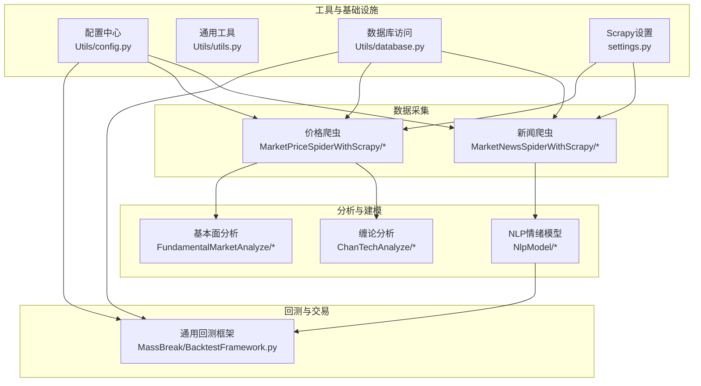
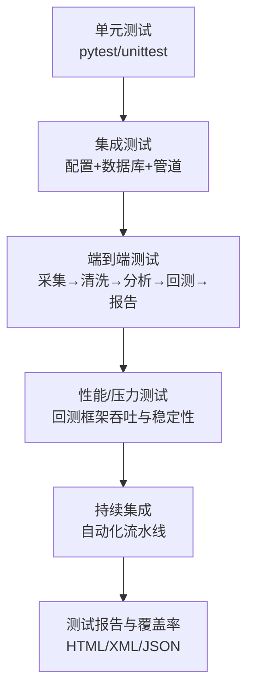
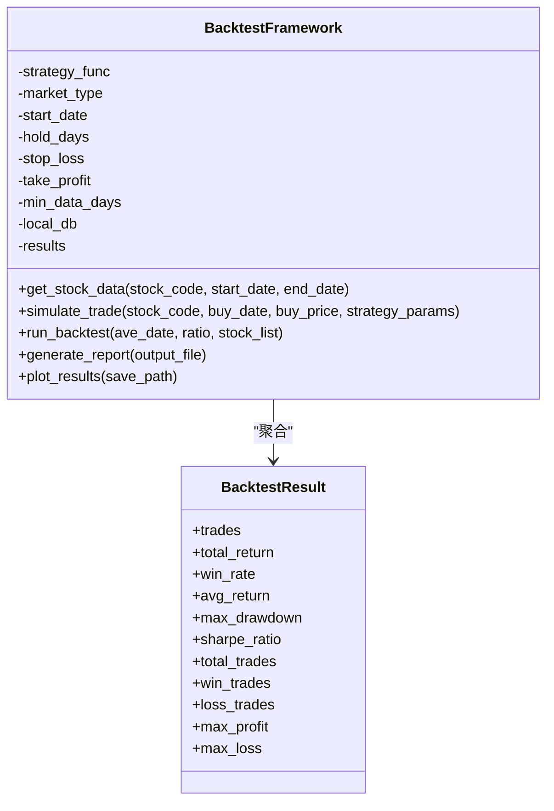
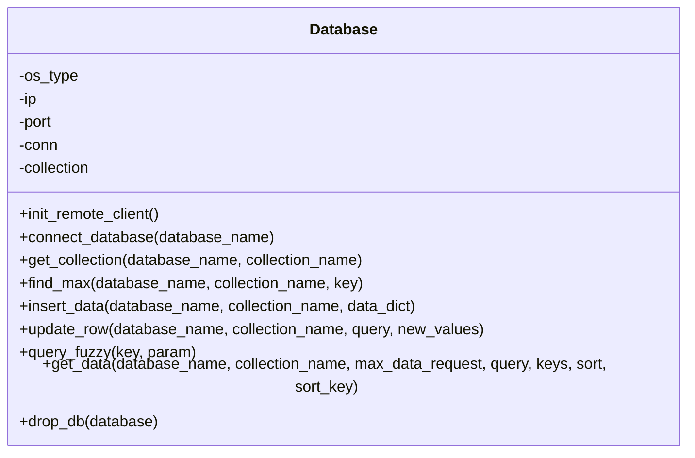
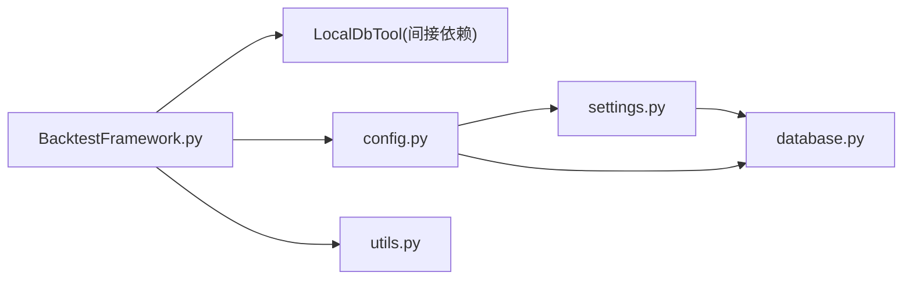
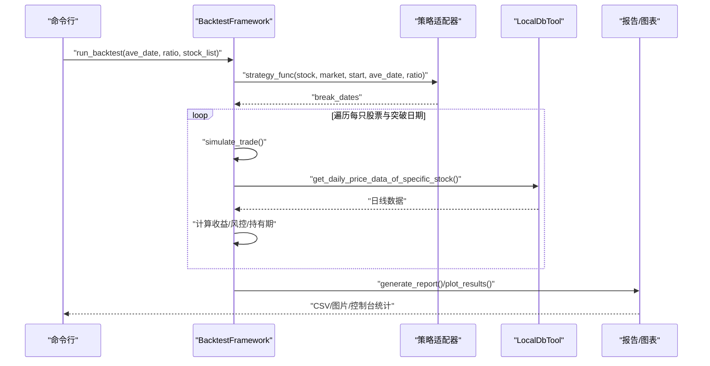
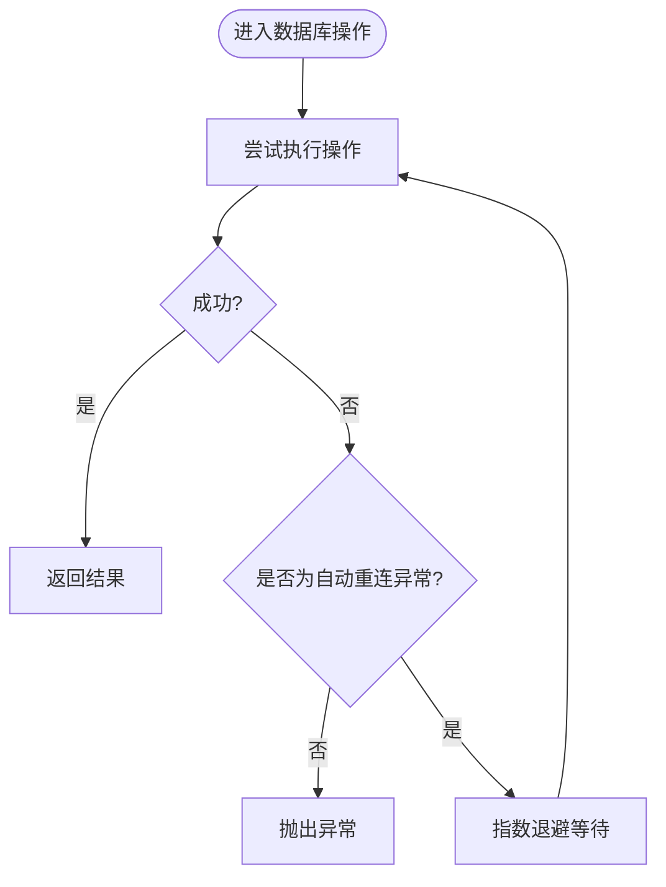

# 测试策略与实践

<cite>
**本文引用的文件**   
- [README.md](file://README.md)
- [.gitignore](file://.gitignore)
- [src/test.py](file://src/test.py)
- [src/QuantAnalyze/TestUtil.py](file://src/QuantAnalyze/TestUtil.py)
- [src/Utils/utils.py](file://src/Utils/utils.py)
- [src/Utils/config.py](file://src/Utils/config.py)
- [src/Utils/database.py](file://src/Utils/database.py)
- [src/MassBreak/BacktestFramework.py](file://src/MassBreak/BacktestFramework.py)
- [src/settings.py](file://src/settings.py)
- [src/ThirdPartyToolSurpriver/README.md](file://src/ThirdPartyToolSurpriver/README.md)
</cite>

## 目录
1. [引言](#引言)
2. [项目结构](#项目结构)
3. [核心组件](#核心组件)
4. [架构总览](#架构总览)
5. [详细组件分析](#详细组件分析)
6. [依赖关系分析](#依赖关系分析)
7. [性能考量](#性能考量)
8. [故障排查指南](#故障排查指南)
9. [结论](#结论)
10. [附录](#附录)

## 引言
本文件面向量化项目“公司新闻爬取与文本分析（feat. 情绪）”的测试策略与实践，目标是帮助团队建立覆盖单元测试、集成测试、端到端测试、性能与压力测试的完整测试体系，配套测试数据准备、模拟对象使用、持续集成与自动化测试流程、测试覆盖率要求与提升方法、测试环境搭建与配置、测试报告生成与分析工具，以及常见问题排查与解决方法。  
项目当前仓库中尚未包含标准的 pytest/unittest 测试目录与测试用例，但具备可测试性强的模块（如回测框架、数据访问层、工具函数、配置与爬虫设置等）。本文将基于现有代码结构，提出可落地的测试方案与最佳实践。

## 项目结构
项目采用按功能域划分的模块化组织方式，主要模块包括：
- 数据采集与预处理：新闻爬虫（Scrapy）、价格数据爬虫、数据清洗与去重
- 分析与建模：缠论技术分析、基本面分析、NLP 情绪模型、深度学习与统计模型
- 回测与交易：通用回测框架、策略适配器
- 工具与基础设施：通用工具函数、配置中心、数据库访问、管道与设置

**图表来源**
- [README.md:1-33](file://README.md#L1-L33)
- [src/Utils/config.py:1-455](file://src/Utils/config.py#L1-L455)
- [src/settings.py:32-47](file://src/settings.py#L32-L47)

**章节来源**
- [README.md:1-33](file://README.md#L1-L33)
- [src/settings.py:32-47](file://src/settings.py#L32-L47)

## 核心组件
- 配置中心：集中管理数据库地址、爬虫站点列表、模型路径、设备类型等，便于测试隔离与环境切换
- 数据访问层：封装 MongoDB 连接、查询、插入、更新、模糊匹配与自动重连机制
- 通用回测框架：支持策略适配、交易模拟、指标计算（胜率、平均收益、最大回撤、夏普比率）、报告生成与可视化
- 工具函数：日期处理、中文文本处理、训练集拆分、日志与邮件发送等
- 爬虫设置：定义管道、用户代理池、MongoDB 写入等

**章节来源**
- [src/Utils/config.py:1-455](file://src/Utils/config.py#L1-L455)
- [src/Utils/database.py:1-176](file://src/Utils/database.py#L1-L176)
- [src/MassBreak/BacktestFramework.py:1-498](file://src/MassBreak/BacktestFramework.py#L1-L498)
- [src/Utils/utils.py:1-251](file://src/Utils/utils.py#L1-L251)
- [src/settings.py:32-47](file://src/settings.py#L32-L47)

## 架构总览
测试策略应覆盖以下层次：
- 单元测试：针对工具函数、配置解析、数据访问层的原子能力
- 集成测试：验证配置与数据库、爬虫管道、回测框架的协同工作
- 端到端测试：从数据采集到回测报告生成的完整链路
- 性能与压力测试：评估回测框架在大规模股票与时间窗口下的吞吐与稳定性
- 持续集成：自动化执行测试、覆盖率统计、报告输出

[此图为概念性架构示意，无需图表来源]

## 详细组件分析

### 通用回测框架（BacktestFramework）
该组件是回测与交易策略的核心，具备策略适配、交易模拟、指标计算、报告生成与可视化等功能。建议将其作为测试重点，覆盖：
- 策略适配器调用正确性
- 交易模拟逻辑（止损/止盈/持有期）
- 指标计算准确性（胜率、平均收益、最大回撤、夏普比率）
- 报告生成与可视化输出

**图表来源**
- [src/MassBreak/BacktestFramework.py:19-66](file://src/MassBreak/BacktestFramework.py#L19-L66)
- [src/MassBreak/BacktestFramework.py:34-333](file://src/MassBreak/BacktestFramework.py#L34-L333)

**章节来源**
- [src/MassBreak/BacktestFramework.py:1-498](file://src/MassBreak/BacktestFramework.py#L1-L498)

### 数据访问层（Database）
封装 MongoDB 连接、查询、插入、更新、模糊匹配与自动重连机制。测试要点：
- 连接初始化与凭证解密
- 查询与分页、键过滤、排序
- 自动重连与异常恢复
- 插入/更新一致性

**图表来源**
- [src/Utils/database.py:36-176](file://src/Utils/database.py#L36-L176)

**章节来源**
- [src/Utils/database.py:1-176](file://src/Utils/database.py#L1-L176)

### 工具函数与配置
- 工具函数：日期范围生成、中文文本处理、训练集拆分、日志与邮件发送等
- 配置中心：数据库地址、爬虫站点列表、模型路径、设备类型、ChromeDriver 路径等

测试要点：
- 日期处理函数边界与格式兼容
- 中文文本处理正则与编码
- 训练集拆分随机性与比例
- 配置项加载与默认值

**章节来源**
- [src/Utils/utils.py:1-251](file://src/Utils/utils.py#L1-L251)
- [src/Utils/config.py:1-455](file://src/Utils/config.py#L1-L455)

### 爬虫设置与管道
- ITEM_PIPELINES：定义数据写入 MongoDB 的管道
- USER_AGENTS：轮换 UA，降低反爬风险

测试要点：
- 管道顺序与职责
- UA 列表有效性
- 与数据库连接的集成

**章节来源**
- [src/settings.py:32-47](file://src/settings.py#L32-L47)

## 依赖关系分析
- 回测框架依赖本地数据库工具以获取日线数据
- 工具函数提供日期、中文文本、训练集拆分等支撑
- 配置中心统一管理外部资源（数据库、模型、站点列表）
- 爬虫设置决定数据采集与入库流程

**图表来源**
- [src/MassBreak/BacktestFramework.py:1-17](file://src/MassBreak/BacktestFramework.py#L1-L17)
- [src/Utils/config.py:1-455](file://src/Utils/config.py#L1-L455)
- [src/Utils/utils.py:1-251](file://src/Utils/utils.py#L1-L251)
- [src/settings.py:32-47](file://src/settings.py#L32-L47)
- [src/Utils/database.py:1-176](file://src/Utils/database.py#L1-L176)

**章节来源**
- [src/MassBreak/BacktestFramework.py:1-498](file://src/MassBreak/BacktestFramework.py#L1-L498)
- [src/Utils/config.py:1-455](file://src/Utils/config.py#L1-L455)
- [src/Utils/utils.py:1-251](file://src/Utils/utils.py#L1-L251)
- [src/settings.py:32-47](file://src/settings.py#L32-L47)
- [src/Utils/database.py:1-176](file://src/Utils/database.py#L1-L176)

## 性能考量
- 回测框架在大规模股票与长时间序列上的吞吐与内存占用
- 数据库查询与分页、索引缺失导致的性能瓶颈
- 爬虫并发与限速策略对整体性能的影响
- 可视化与报告生成的 I/O 成本

建议：
- 对回测框架进行分批回测与并行化改造
- 为 MongoDB 查询字段建立索引
- 合理设置爬虫并发与延迟
- 采用增量报告与缓存中间结果

[本节为通用指导，无需章节来源]

## 故障排查指南
- 数据库连接失败或超时：检查配置中心的主机与端口、凭证解密、自动重连装饰器
- 爬虫无法写入数据库：确认管道配置、UA 列表、MongoDB 可达性
- 回测结果为空：检查策略适配器返回值、日期范围、股票列表有效性
- 可视化图表异常：确认 Matplotlib 字体与中文字体配置

**章节来源**
- [src/Utils/database.py:15-33](file://src/Utils/database.py#L15-L33)
- [src/Utils/config.py:13-23](file://src/Utils/config.py#L13-L23)
- [src/settings.py:32-47](file://src/settings.py#L32-L47)
- [src/MassBreak/BacktestFramework.py:382-437](file://src/MassBreak/BacktestFramework.py#L382-L437)

## 结论
本项目具备良好的可测试性基础，建议优先围绕回测框架、数据访问层与工具函数开展单元与集成测试，逐步扩展至端到端测试与性能压力测试。通过配置中心与管道设置的标准化，可实现跨环境的一致性测试与自动化流水线。

[本节为总结性内容，无需章节来源]

## 附录

### 测试策略与实践清单
- 单元测试
  - 工具函数：日期范围、中文文本处理、训练集拆分
  - 配置中心：默认值、路径拼接、平台差异
  - 数据访问层：连接初始化、查询与更新、异常恢复
- 集成测试
  - 配置+数据库：连接可用性、查询正确性
  - 爬虫管道：数据写入、去重、异常处理
- 端到端测试
  - 采集→清洗→分析→回测→报告生成
- 性能与压力测试
  - 回测框架在多股票/长周期下的吞吐与稳定性
- 持续集成与自动化
  - 触发条件、测试步骤、覆盖率统计、报告输出
- 测试数据准备与模拟对象
  - 使用内存数据库/Mock 替代真实数据库
  - 使用固定种子的随机函数保证可重复性
- 测试覆盖率
  - 关键路径与分支覆盖率目标（如 80%+）
- 测试环境
  - 配置隔离、容器化部署、资源限制
- 测试报告与分析
  - HTML/XML/JSON 报告，趋势与对比分析

### 关键流程图：回测框架运行序列

**图表来源**
- [src/MassBreak/BacktestFramework.py:218-333](file://src/MassBreak/BacktestFramework.py#L218-L333)
- [src/MassBreak/BacktestFramework.py:335-437](file://src/MassBreak/BacktestFramework.py#L335-L437)

### 关键流程图：数据库访问与自动重连

**图表来源**
- [src/Utils/database.py:15-33](file://src/Utils/database.py#L15-L33)
- [src/Utils/database.py:94-172](file://src/Utils/database.py#L94-L172)

### 测试环境搭建与配置
- Python 与依赖：确保 Python 版本与依赖一致，参考第三方工具的安装脚本
- 数据库：本地或远程 MongoDB，配置连接参数与认证
- 爬虫驱动：根据操作系统配置 ChromeDriver 路径
- 环境变量：通过配置中心读取，避免硬编码

**章节来源**
- [src/ThirdPartyToolSurpriver/README.md:35-51](file://src/ThirdPartyToolSurpriver/README.md#L35-L51)
- [src/Utils/config.py:13-23](file://src/Utils/config.py#L13-L23)

### 持续集成与自动化测试流程
- 触发：Push/Pull Request/定时任务
- 步骤：安装依赖、启动数据库容器、执行测试、收集覆盖率、生成报告
- 工具：pytest、coverage、pytest-html、CI 平台（GitHub Actions/Azure DevOps/Jenkins）

**章节来源**
- [.gitignore:51-63](file://.gitignore#L51-L63)

### 测试覆盖率要求与提升方法
- 目标：关键模块覆盖率≥80%，分支覆盖率≥60%
- 提升方法：增加边界条件与异常场景用例、引入 Mock 与 Fixture、拆分复杂函数

**章节来源**
- [.gitignore:51-63](file://.gitignore#L51-L63)

### 常见测试问题与解决
- 测试不稳定：固定随机种子、使用 Mock 替代外部依赖
- 资源泄漏：在测试结束释放数据库连接与文件句柄
- 报告缺失：确保测试框架生成报告并上传 Artifacts

**章节来源**
- [src/Utils/database.py:94-172](file://src/Utils/database.py#L94-L172)
- [src/Utils/utils.py:18-27](file://src/Utils/utils.py#L18-L27)