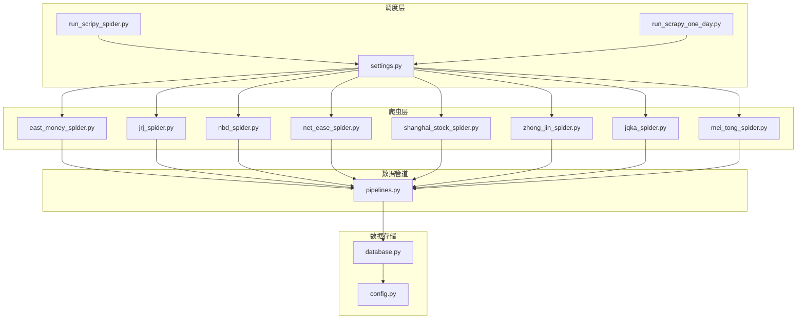
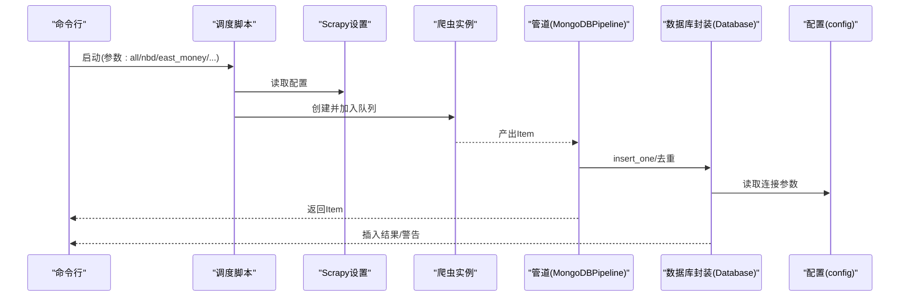
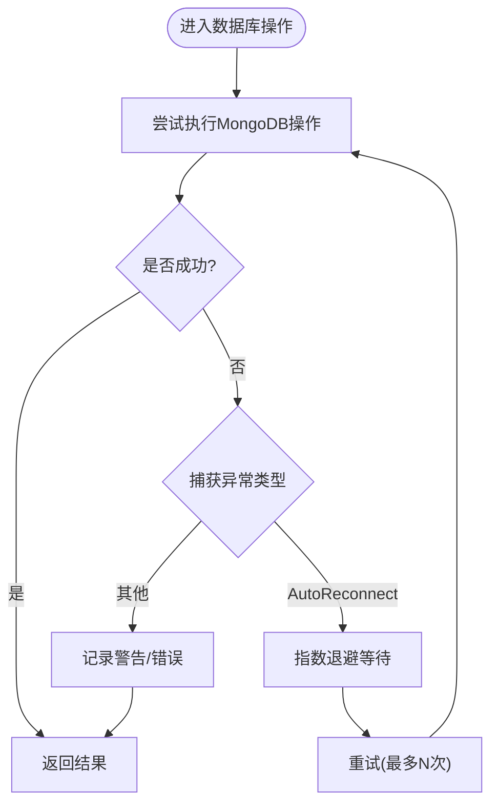
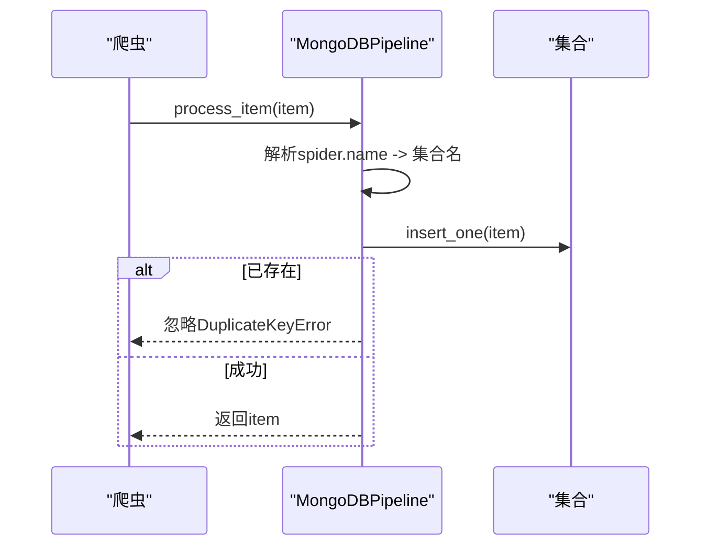
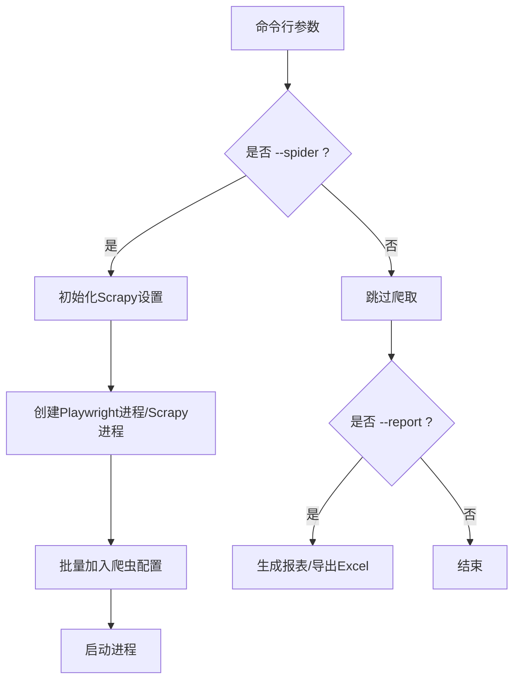
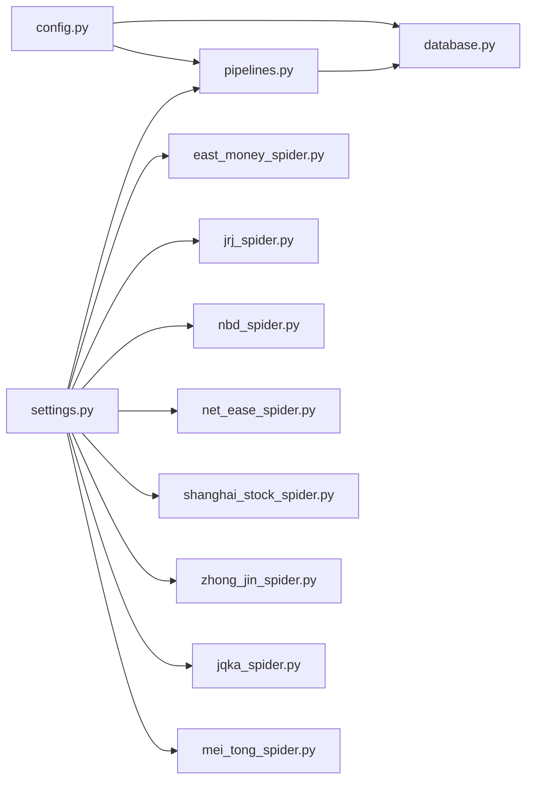

# 调试技巧与故障排查

<cite>
**本文引用的文件**   
- [README.md](file://README.md)
- [ProblemSolve.md](file://ProblemSolve.md)
- [src/Utils/config.py](file://src/Utils/config.py)
- [src/Utils/database.py](file://src/Utils/database.py)
- [src/pipelines.py](file://src/pipelines.py)
- [src/run_scripy_spider.py](file://src/run_scripy_spider.py)
- [src/run_scrapy_one_day.py](file://src/run_scrapy_one_day.py)
- [src/settings.py](file://src/settings.py)
- [src/Utils/utils.py](file://src/Utils/utils.py)
</cite>

## 目录
1. [引言](#引言)
2. [项目结构](#项目结构)
3. [核心组件](#核心组件)
4. [架构总览](#架构总览)
5. [详细组件分析](#详细组件分析)
6. [依赖分析](#依赖分析)
7. [性能考量](#性能考量)
8. [故障排查指南](#故障排查指南)
9. [结论](#结论)
10. [附录](#附录)

## 引言
本指南面向量化金融与内容爬取场景，聚焦调试与故障排查的实战方法。结合仓库中的Scrapy爬虫、MongoDB数据管道、日志与异常处理、以及配置管理等模块，系统讲解以下主题：
- Python调试工具与IDE调试器的使用要点
- 日志记录与分析最佳实践
- 网络爬虫调试与反爬虫应对策略
- 数据库连接与查询性能调试
- 内存泄漏与性能瓶颈排查
- 分布式系统调试与监控思路
- 异常处理与错误追踪
- 常见问题诊断流程与解决方案
- 生产环境故障应急响应流程

## 项目结构
该项目围绕“新闻爬取—清洗—入库—分析”的主链路展开，主要目录与职责如下：
- src/Utils：通用配置、数据库封装、工具函数与日志
- src/MarketNewsSpiderWithScrapy：各媒体站点的Scrapy爬虫实现
- src/pipelines.py：Scrapy管道，负责去重与入库
- src/settings.py：Scrapy全局配置（并发、下载延迟、中间件、管道等）
- src/run_scripy_spider.py 与 src/run_scrapy_one_day.py：调度入口，分别支持全量与按日运行
- ProblemSolve.md：运维与常见问题处理清单
- README.md：项目目标与模块概览

图表来源
- [src/run_scripy_spider.py:117-145](file://src/run_scripy_spider.py#L117-L145)
- [src/run_scrapy_one_day.py:32-80](file://src/run_scrapy_one_day.py#L32-L80)
- [src/settings.py:1-49](file://src/settings.py#L1-L49)
- [src/pipelines.py:8-56](file://src/pipelines.py#L8-L56)
- [src/Utils/database.py:36-176](file://src/Utils/database.py#L36-L176)
- [src/Utils/config.py:1-455](file://src/Utils/config.py#L1-L455)

章节来源
- [README.md:1-33](file://README.md#L1-L33)
- [src/run_scripy_spider.py:117-145](file://src/run_scripy_spider.py#L117-L145)
- [src/run_scrapy_one_day.py:32-80](file://src/run_scrapy_one_day.py#L32-L80)
- [src/settings.py:1-49](file://src/settings.py#L1-L49)

## 核心组件
- 配置中心：集中管理数据库地址、端口、集合名、爬虫站点参数与模型路径等
- 数据库封装：统一连接、自动重连、查询与写入接口
- Scrapy管道：统一入库、去重处理
- 调度入口：按需启动不同爬虫集，支持Playwright与Scrapy两类
- 日志与工具：基础日志配置、邮件发送、日期与文本处理等

章节来源
- [src/Utils/config.py:13-455](file://src/Utils/config.py#L13-L455)
- [src/Utils/database.py:36-176](file://src/Utils/database.py#L36-L176)
- [src/pipelines.py:8-56](file://src/pipelines.py#L8-L56)
- [src/run_scripy_spider.py:117-145](file://src/run_scripy_spider.py#L117-L145)
- [src/run_scrapy_one_day.py:32-80](file://src/run_scrapy_one_day.py#L32-L80)
- [src/Utils/utils.py:18-58](file://src/Utils/utils.py#L18-L58)

## 架构总览
下图展示从调度到入库的关键调用链，标注了异常与重试点，便于定位问题。

图表来源
- [src/run_scripy_spider.py:117-145](file://src/run_scripy_spider.py#L117-L145)
- [src/run_scrapy_one_day.py:32-80](file://src/run_scrapy_one_day.py#L32-L80)
- [src/settings.py:32-34](file://src/settings.py#L32-L34)
- [src/pipelines.py:25-56](file://src/pipelines.py#L25-L56)
- [src/Utils/database.py:94-172](file://src/Utils/database.py#L94-L172)
- [src/Utils/config.py:13-60](file://src/Utils/config.py#L13-L60)

## 详细组件分析

### 组件A：数据库封装与自动重连
- 设计要点
  - 使用装饰器对MongoDB操作进行指数退避重试，提升网络抖动下的稳定性
  - 提供统一的连接、集合获取、查询、插入、更新、模糊查询等接口
  - 对空结果进行显式警告，避免静默失败
- 关键流程

图表来源
- [src/Utils/database.py:15-33](file://src/Utils/database.py#L15-L33)
- [src/Utils/database.py:94-172](file://src/Utils/database.py#L94-L172)

章节来源
- [src/Utils/database.py:15-33](file://src/Utils/database.py#L15-L33)
- [src/Utils/database.py:94-172](file://src/Utils/database.py#L94-L172)

### 组件B：Scrapy管道与去重
- 设计要点
  - 根据爬虫名称映射到对应数据库与集合
  - 使用单条插入并捕获重复键异常，避免重复入库
- 关键流程

图表来源
- [src/pipelines.py:25-56](file://src/pipelines.py#L25-L56)

章节来源
- [src/pipelines.py:8-56](file://src/pipelines.py#L8-L56)

### 组件C：调度与并发控制
- 设计要点
  - 支持Playwright与Scrapy两类爬虫混合运行
  - 通过Scrapy设置控制并发、下载超时、延迟与中间件
  - 提供按日聚合与报表导出能力
- 关键流程

图表来源
- [src/run_scrapy_one_day.py:32-80](file://src/run_scrapy_one_day.py#L32-L80)
- [src/settings.py:18-30](file://src/settings.py#L18-L30)

章节来源
- [src/run_scripy_spider.py:117-145](file://src/run_scripy_spider.py#L117-L145)
- [src/run_scrapy_one_day.py:32-80](file://src/run_scrapy_one_day.py#L32-L80)
- [src/settings.py:18-30](file://src/settings.py#L18-L30)

## 依赖分析
- 组件耦合
  - 管道依赖数据库封装与配置
  - 爬虫依赖Scrapy设置与站点配置字典
  - 调度脚本依赖爬虫模块与配置字典
- 外部依赖
  - MongoDB：连接池大小、自动重连
  - Scrapy：并发、下载延迟、代理中间件
  - 日志：标准库logging，统一格式化输出

图表来源
- [src/Utils/config.py:13-60](file://src/Utils/config.py#L13-L60)
- [src/Utils/database.py:36-69](file://src/Utils/database.py#L36-L69)
- [src/pipelines.py:8-22](file://src/pipelines.py#L8-L22)
- [src/settings.py:8-34](file://src/settings.py#L8-L34)

章节来源
- [src/Utils/config.py:13-60](file://src/Utils/config.py#L13-L60)
- [src/Utils/database.py:36-69](file://src/Utils/database.py#L36-L69)
- [src/pipelines.py:8-22](file://src/pipelines.py#L8-L22)
- [src/settings.py:8-34](file://src/settings.py#L8-L34)

## 性能考量
- 并发与限速
  - 设置合理的并发请求数与下载延迟，避免触发站点限流
  - 下载超时短有助于快速失败，减少资源占用
- 连接池与重试
  - MongoDB连接池上限与自动重连可缓解瞬时抖动
  - 查询与插入尽量批量化，减少往返次数
- 日志与可观测性
  - 统一日志格式，区分级别，便于定位慢点
  - 对关键路径增加耗时埋点（建议在业务层扩展）

章节来源
- [src/settings.py:18-23](file://src/settings.py#L18-L23)
- [src/Utils/database.py:57-60](file://src/Utils/database.py#L57-L60)
- [src/Utils/database.py:15-33](file://src/Utils/database.py#L15-L33)
- [src/Utils/utils.py:18-22](file://src/Utils/utils.py#L18-L22)

## 故障排查指南

### 1) Python调试工具与IDE调试器
- 断点与变量检查
  - 在调度入口、爬虫回调、管道处理处设置断点，观察请求参数、响应状态与Item结构
- 日志辅助
  - 使用统一日志格式，结合时间戳与行号快速定位
- 交互式调试
  - 在关键函数中临时打印或使用内置调试器，确认数据流向与异常抛出点

章节来源
- [src/Utils/utils.py:18-22](file://src/Utils/utils.py#L18-L22)
- [src/run_scripy_spider.py:117-145](file://src/run_scripy_spider.py#L117-L145)
- [src/run_scrapy_one_day.py:32-80](file://src/run_scrapy_one_day.py#L32-L80)

### 2) 日志记录与分析最佳实践
- 格式化输出
  - 使用标准库日志，统一格式与级别
- 关键事件记录
  - 插入失败、空查询、重复键等应记录明确上下文
- 日志轮转与归档
  - 建议接入外部日志系统，保留关键时段日志以便复盘

章节来源
- [src/Utils/utils.py:18-22](file://src/Utils/utils.py#L18-L22)
- [src/Utils/database.py:142-147](file://src/Utils/database.py#L142-L147)
- [src/pipelines.py:53-55](file://src/pipelines.py#L53-L55)

### 3) 网络爬虫调试与反爬虫应对
- 常见问题
  - 请求超时、状态码异常、内容解析失败
- 应对策略
  - 调整并发与延迟，启用代理中间件
  - 针对特定站点设置Cookie或User-Agent轮换
  - 对不稳定站点采用降级策略（减少页数/字段）
- 反爬虫对抗
  - 使用随机UA、合理延时、必要时引入代理池
  - 对验证码或登录型站点，优先考虑官方API或合规渠道

章节来源
- [src/settings.py:14-16](file://src/settings.py#L14-L16)
- [src/settings.py:18-23](file://src/settings.py#L18-L23)
- [src/settings.py:25-30](file://src/settings.py#L25-L30)
- [src/settings.py:36-47](file://src/settings.py#L36-L47)

### 4) 数据库连接与查询性能调试
- 连接问题
  - 自动重连装饰器可缓解短暂中断
  - 检查连接池上限与超时设置
- 查询问题
  - 对大数据量查询限制返回条数，必要时加索引
  - 对空查询给出明确警告，避免误判
- 写入问题
  - 去重键冲突需显式处理，避免阻塞

章节来源
- [src/Utils/database.py:15-33](file://src/Utils/database.py#L15-L33)
- [src/Utils/database.py:57-60](file://src/Utils/database.py#L57-L60)
- [src/Utils/database.py:142-147](file://src/Utils/database.py#L142-L147)
- [src/pipelines.py:53-55](file://src/pipelines.py#L53-L55)

### 5) 内存泄漏与性能瓶颈排查
- 症状
  - 进程内存持续增长、CPU占用高、IO阻塞
- 排查步骤
  - 分段采样：对爬取、解析、入库三个阶段分别测量
  - 减少一次性加载大量数据，采用迭代器或分页
  - 关闭未使用的资源（会话、文件句柄、数据库游标）
- 工具建议
  - 使用性能分析器定位热点函数
  - 结合系统监控工具观察资源曲线

章节来源
- [src/Utils/database.py:120-172](file://src/Utils/database.py#L120-L172)
- [src/run_scrapy_one_day.py:172-185](file://src/run_scrapy_one_day.py#L172-L185)

### 6) 分布式系统调试与监控
- 调试思路
  - 明确上下游边界，区分本地与远端异常
  - 对跨服务调用增加唯一ID，便于串联日志
- 监控建议
  - 关键指标：吞吐、延迟、错误率、重试次数、连接池使用率
  - 告警阈值分级，配合日志与链路追踪

章节来源
- [src/Utils/database.py:57-60](file://src/Utils/database.py#L57-L60)
- [src/Utils/utils.py:18-22](file://src/Utils/utils.py#L18-L22)

### 7) 异常处理与错误追踪
- 自动重连
  - 对网络异常采用指数退避重试，避免雪崩
- 去重与幂等
  - 管道层对重复键异常进行捕获与忽略
- 日志与告警
  - 对关键异常进行记录与上报，便于事后复盘

章节来源
- [src/Utils/database.py:15-33](file://src/Utils/database.py#L15-L33)
- [src/pipelines.py:53-55](file://src/pipelines.py#L53-L55)
- [src/Utils/utils.py:49-58](file://src/Utils/utils.py#L49-L58)

### 8) 常见问题诊断流程与解决方案
- 问题：Too many open files
  - 现象：MongoDB索引构建或大量文件句柄导致系统限制
  - 处理：调整系统ulimit，限制最大文件句柄数
- 问题：爬虫超时/被拒
  - 现象：DOWNLOAD_TIMEOUT过短、User-Agent/代理不当
  - 处理：增大超时、轮换UA、启用代理中间件
- 问题：数据重复入库
  - 现象：未设置唯一键或去重逻辑缺失
  - 处理：在管道层捕获重复键异常，或建立唯一索引

章节来源
- [ProblemSolve.md:37-41](file://ProblemSolve.md#L37-L41)
- [src/settings.py:21-23](file://src/settings.py#L21-L23)
- [src/settings.py:25-30](file://src/settings.py#L25-L30)
- [src/pipelines.py:53-55](file://src/pipelines.py#L53-L55)

### 9) 生产环境故障应急响应流程
- 快速评估
  - 判断是网络、数据库、爬虫还是数据质量问题
- 降级与隔离
  - 临时降低并发、禁用不稳定站点、切换备用代理
- 修复与验证
  - 修复后小流量灰度验证，逐步恢复
- 复盘与改进
  - 输出故障报告，完善监控与告警

章节来源
- [src/settings.py:18-23](file://src/settings.py#L18-L23)
- [src/Utils/database.py:15-33](file://src/Utils/database.py#L15-L33)
- [src/pipelines.py:53-55](file://src/pipelines.py#L53-L55)

## 结论
本指南基于仓库现有实现，总结了从调度、爬虫、管道到数据库与日志的调试与排障方法。建议在现有基础上补充：
- 链路追踪与指标采集
- 更细粒度的异常分类与熔断策略
- 自动化回归测试与慢查询检测
- 生产级监控与告警体系

## 附录
- 快速参考
  - 调度入口：[src/run_scripy_spider.py:117-145](file://src/run_scripy_spider.py#L117-L145)，[src/run_scrapy_one_day.py:32-80](file://src/run_scrapy_one_day.py#L32-L80)
  - 管道与去重：[src/pipelines.py:25-56](file://src/pipelines.py#L25-L56)
  - 数据库封装与重试：[src/Utils/database.py:15-33](file://src/Utils/database.py#L15-L33)，[src/Utils/database.py:94-172](file://src/Utils/database.py#L94-L172)
  - 配置中心：[src/Utils/config.py:13-60](file://src/Utils/config.py#L13-L60)
  - Scrapy设置：[src/settings.py:18-30](file://src/settings.py#L18-L30)
  - 日志与工具：[src/Utils/utils.py:18-58](file://src/Utils/utils.py#L18-L58)