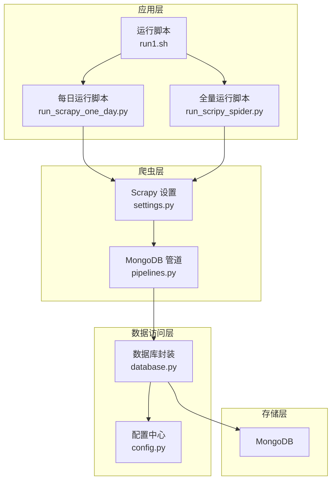
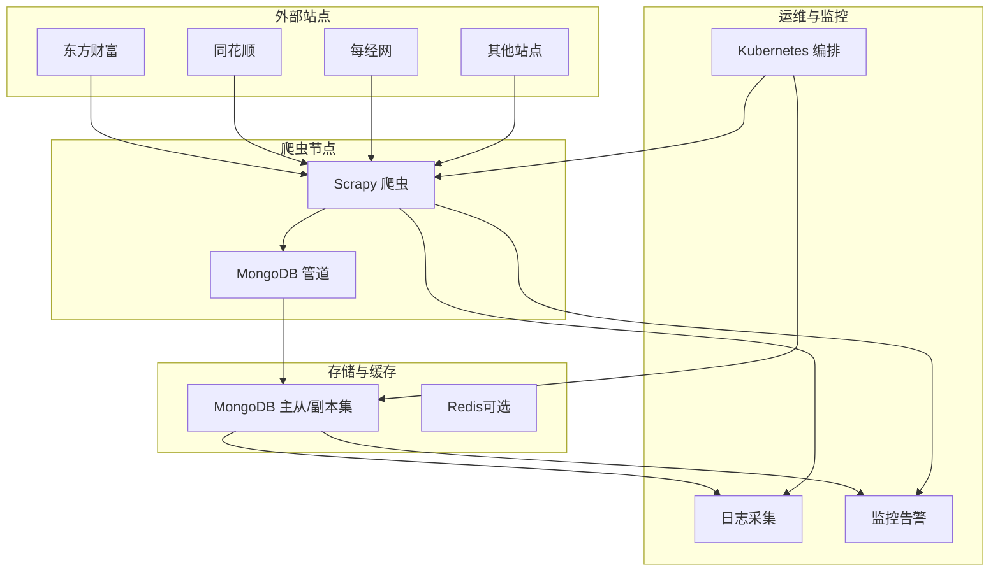
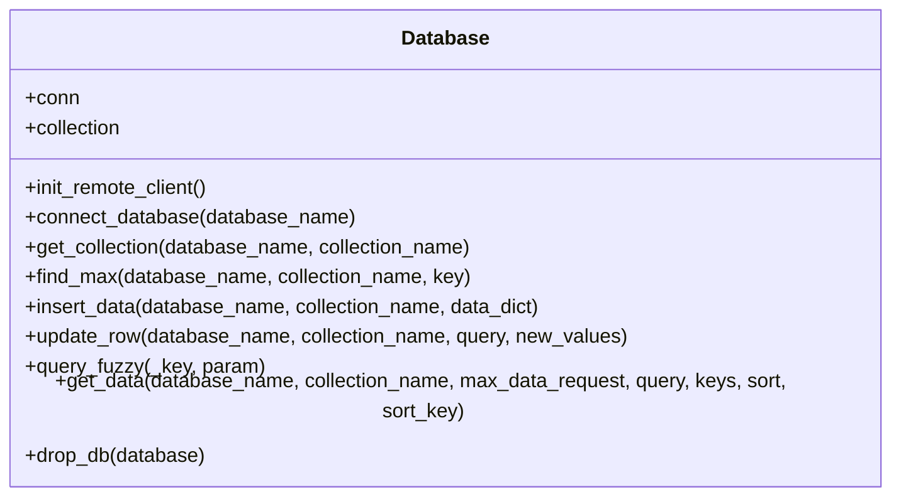
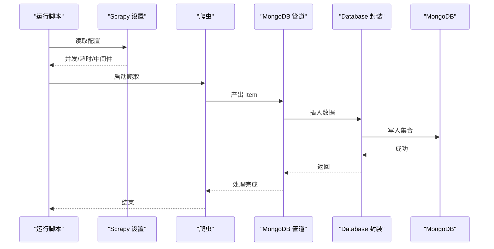
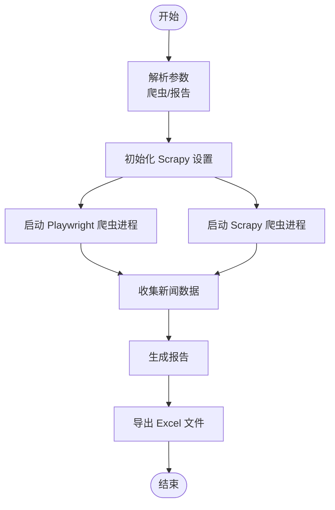
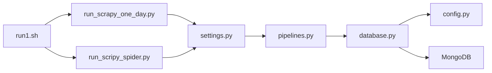

# 部署与运维

<cite>
**本文引用的文件**   
- [README.md](file://README.md)
- [ProblemSolve.md](file://ProblemSolve.md)
- [src/Utils/config.py](file://src/Utils/config.py)
- [src/Utils/database.py](file://src/Utils/database.py)
- [src/settings.py](file://src/settings.py)
- [src/pipelines.py](file://src/pipelines.py)
- [src/run_scripy_spider.py](file://src/run_scripy_spider.py)
- [src/run_scrapy_one_day.py](file://src/run_scrapy_one_day.py)
- [src/run1.sh](file://src/run1.sh)
- [src/info/week_buy_point_res.json.bak.sh](file://src/info/week_buy_point_res.json.bak.sh)
- [src/ThirdPartyToolSurpriver/README.md](file://src/ThirdPartyToolSurpriver/README.md)
</cite>

## 目录
1. [简介](#简介)
2. [项目结构](#项目结构)
3. [核心组件](#核心组件)
4. [架构总览](#架构总览)
5. [详细组件分析](#详细组件分析)
6. [依赖关系分析](#依赖关系分析)
7. [性能考量](#性能考量)
8. [故障排查指南](#故障排查指南)
9. [结论](#结论)
10. [附录](#附录)

## 简介
本指南面向生产环境的部署与运维，覆盖以下主题：
- 生产环境部署流程与配置要求
- Docker 容器化与 Kubernetes 编排策略
- 数据库部署与备份恢复流程
- 监控与告警配置建议
- 负载均衡与高可用部署方案
- 日志收集与分析系统配置
- 安全加固与权限管理最佳实践
- 版本升级与回滚策略
- 运维脚本与自动化工具使用指南

本项目以 Scrapy 爬虫为核心，将新闻数据写入 MongoDB，并提供每日报告生成与可视化输出能力。部署目标为稳定、可扩展、可观测、可回滚的生产环境。

## 项目结构
项目采用按功能模块划分的目录结构，核心模块包括：
- 爬虫与调度：Scrapy 爬虫、运行入口脚本
- 数据库访问：统一数据库封装与连接池配置
- 配置中心：数据库、爬虫站点、模型路径等集中配置
- 数据管道：将爬取结果写入 MongoDB
- 运维脚本：定时任务与日志输出
- 第三方工具：异常检测工具的 Docker 化说明

图表来源
- [src/run1.sh:1-49](file://src/run1.sh#L1-L49)
- [src/run_scrapy_one_day.py:1-195](file://src/run_scrapy_one_day.py#L1-L195)
- [src/run_scripy_spider.py:1-145](file://src/run_scripy_spider.py#L1-L145)
- [src/settings.py:1-49](file://src/settings.py#L1-L49)
- [src/pipelines.py:1-56](file://src/pipelines.py#L1-L56)
- [src/Utils/config.py:1-455](file://src/Utils/config.py#L1-L455)
- [src/Utils/database.py:1-176](file://src/Utils/database.py#L1-L176)

章节来源
- [README.md:1-33](file://README.md#L1-L33)
- [src/run1.sh:1-49](file://src/run1.sh#L1-L49)
- [src/run_scrapy_one_day.py:1-195](file://src/run_scrapy_one_day.py#L1-L195)
- [src/run_scripy_spider.py:1-145](file://src/run_scripy_spider.py#L1-L145)
- [src/settings.py:1-49](file://src/settings.py#L1-L49)
- [src/pipelines.py:1-56](file://src/pipelines.py#L1-L56)
- [src/Utils/config.py:1-455](file://src/Utils/config.py#L1-L455)
- [src/Utils/database.py:1-176](file://src/Utils/database.py#L1-L176)

## 核心组件
- 配置中心（config.py）：集中管理数据库地址、端口、爬虫站点清单、模型路径、字典路径等。
- 数据库封装（database.py）：提供连接初始化、集合操作、自动重连装饰器、查询与更新接口。
- Scrapy 设置（settings.py）：并发、下载超时、中间件、管道等爬虫运行参数。
- 数据管道（pipelines.py）：将不同来源的新闻数据写入对应的数据库与集合。
- 运行脚本（run_scrapy_one_day.py、run_scripy_spider.py）：调度爬虫、生成报告、写入 Excel。
- 运维脚本（run1.sh）：定时执行每日任务、记录日志。

章节来源
- [src/Utils/config.py:1-455](file://src/Utils/config.py#L1-L455)
- [src/Utils/database.py:1-176](file://src/Utils/database.py#L1-L176)
- [src/settings.py:1-49](file://src/settings.py#L1-L49)
- [src/pipelines.py:1-56](file://src/pipelines.py#L1-L56)
- [src/run_scrapy_one_day.py:1-195](file://src/run_scrapy_one_day.py#L1-L195)
- [src/run_scripy_spider.py:1-145](file://src/run_scripy_spider.py#L1-L145)
- [src/run1.sh:1-49](file://src/run1.sh#L1-L49)

## 架构总览
生产环境建议采用“爬虫节点 + 数据库 + 可选缓存/代理 + 监控告警”的架构。爬虫节点负责抓取与入库，数据库提供高可用与备份，监控与日志采集保障可观测性。

图表来源
- [src/settings.py:1-49](file://src/settings.py#L1-L49)
- [src/pipelines.py:1-56](file://src/pipelines.py#L1-L56)
- [src/Utils/database.py:1-176](file://src/Utils/database.py#L1-L176)
- [src/ThirdPartyToolSurpriver/README.md:35-51](file://src/ThirdPartyToolSurpriver/README.md#L35-L51)

## 详细组件分析

### 组件A：数据库连接与自动重连（Database 类）
- 功能要点
  - 初始化客户端，设置连接池大小与超时
  - 提供集合读写、模糊查询、最大值查询、更新与删除
  - 使用装饰器处理 MongoDB 自动重连，指数退避重试
- 性能与可靠性
  - 连接池上限与超时参数影响吞吐与稳定性
  - 自动重连减少网络抖动对业务的影响
- 部署建议
  - 生产环境启用副本集或分片集群
  - 合理设置连接池大小与超时时间
  - 对高频查询建立索引，避免全表扫描

图表来源
- [src/Utils/database.py:36-176](file://src/Utils/database.py#L36-L176)

章节来源
- [src/Utils/database.py:1-176](file://src/Utils/database.py#L1-L176)

### 组件B：Scrapy 爬虫与数据管道（settings + pipelines）
- 功能要点
  - settings.py 控制并发、下载超时、Cookie、代理中间件、管道注册
  - pipelines.py 将不同来源的新闻写入对应数据库与集合
- 运行流程
  - run_scrapy_one_day.py 与 run_scripy_spider.py 分别调度爬虫
  - 爬取完成后写入 MongoDB，随后生成报告并导出 Excel

图表来源
- [src/run_scrapy_one_day.py:30-195](file://src/run_scrapy_one_day.py#L30-L195)
- [src/run_scripy_spider.py:117-145](file://src/run_scripy_spider.py#L117-L145)
- [src/settings.py:1-49](file://src/settings.py#L1-L49)
- [src/pipelines.py:1-56](file://src/pipelines.py#L1-L56)
- [src/Utils/database.py:1-176](file://src/Utils/database.py#L1-L176)

章节来源
- [src/run_scrapy_one_day.py:1-195](file://src/run_scrapy_one_day.py#L1-L195)
- [src/run_scripy_spider.py:1-145](file://src/run_scripy_spider.py#L1-L145)
- [src/settings.py:1-49](file://src/settings.py#L1-L49)
- [src/pipelines.py:1-56](file://src/pipelines.py#L1-L56)

### 组件C：每日运行与报告生成（run_scrapy_one_day.py）
- 功能要点
  - 支持 Playwright 与 Scrapy 两类爬虫
  - 生成新闻汇总报告并导出 Excel
  - 可配置报告周期与输出路径
- 运维要点
  - 定时任务需确保数据库可用与磁盘空间充足
  - 报告生成涉及大量数据读取，建议在低峰期执行

图表来源
- [src/run_scrapy_one_day.py:30-195](file://src/run_scrapy_one_day.py#L30-L195)

章节来源
- [src/run_scrapy_one_day.py:1-195](file://src/run_scrapy_one_day.py#L1-L195)

### 组件D：全量运行与站点配置（run_scripy_spider.py + config.py）
- 功能要点
  - 通过 config.py 统一管理各站点爬取配置
  - run_scripy_spider.py 提供全量运行入口，支持按站点选择
- 部署建议
  - 将敏感配置放入环境变量或密钥管理服务
  - 不同站点的并发与延迟需独立调优

章节来源
- [src/run_scripy_spider.py:1-145](file://src/run_scripy_spider.py#L1-L145)
- [src/Utils/config.py:1-455](file://src/Utils/config.py#L1-L455)

## 依赖关系分析
- 组件耦合
  - pipelines 依赖 database 与 config
  - run 脚本依赖 settings 与 config
  - database 依赖 config 的主机与端口配置
- 外部依赖
  - MongoDB：作为主存储
  - 可选 Redis：用于缓存或会话（当前未启用）
  - Docker/Kubernetes：容器化与编排（第三方工具提供 Docker 使用说明）

图表来源
- [src/run1.sh:1-49](file://src/run1.sh#L1-L49)
- [src/run_scrapy_one_day.py:1-195](file://src/run_scrapy_one_day.py#L1-L195)
- [src/run_scripy_spider.py:1-145](file://src/run_scripy_spider.py#L1-L145)
- [src/settings.py:1-49](file://src/settings.py#L1-L49)
- [src/pipelines.py:1-56](file://src/pipelines.py#L1-L56)
- [src/Utils/database.py:1-176](file://src/Utils/database.py#L1-L176)
- [src/Utils/config.py:1-455](file://src/Utils/config.py#L1-L455)

章节来源
- [src/run1.sh:1-49](file://src/run1.sh#L1-L49)
- [src/run_scrapy_one_day.py:1-195](file://src/run_scrapy_one_day.py#L1-L195)
- [src/run_scripy_spider.py:1-145](file://src/run_scripy_spider.py#L1-L145)
- [src/settings.py:1-49](file://src/settings.py#L1-L49)
- [src/pipelines.py:1-56](file://src/pipelines.py#L1-L56)
- [src/Utils/database.py:1-176](file://src/Utils/database.py#L1-L176)
- [src/Utils/config.py:1-455](file://src/Utils/config.py#L1-L455)

## 性能考量
- 爬虫性能
  - 并发与下载超时需结合目标站点限流策略调整
  - 启用代理中间件时注意代理质量与稳定性
- 数据库性能
  - 合理设置连接池大小与超时
  - 对高频查询字段建立索引
  - 使用自动重连装饰器提升稳定性
- 报告生成
  - 导出 Excel 前先进行数据清洗与排序，避免重复计算
  - 在低峰期执行，避免与爬虫高峰冲突

[本节为通用指导，无需列出具体文件来源]

## 故障排查指南
- MongoDB 连接问题
  - 检查连接池上限与超时设置
  - 观察自动重连日志，确认网络与服务器状态
- 文件句柄过多
  - macOS 示例：提高 maxfiles 限制
- 安装与依赖
  - 使用 Homebrew 管理软件包
  - 按需安装第三方分词库
- Chrome Driver 权限
  - 确保可执行权限与版本匹配

章节来源
- [src/Utils/database.py:1-176](file://src/Utils/database.py#L1-L176)
- [ProblemSolve.md:18-49](file://ProblemSolve.md#L18-L49)

## 结论
本指南提供了从部署到运维的完整路径：明确配置中心、数据库封装、爬虫与管道、运行脚本之间的关系；给出容器化与编排、数据库高可用、监控告警、日志采集、安全加固、版本升级与回滚、自动化脚本使用的建议。生产落地时应结合业务规模与合规要求细化各项参数与流程。

[本节为总结性内容，无需列出具体文件来源]

## 附录

### A. 生产环境部署流程与配置要求
- 基础设施
  - 应用服务器：部署 Python 环境与依赖
  - 数据库：MongoDB 副本集或分片集群
  - 可选：Redis（会话/缓存）
- 配置管理
  - 将数据库凭据、站点 Cookie、模型路径等放入环境变量或密钥管理服务
  - 使用 config.py 统一读取配置
- 网络与安全
  - 限制数据库访问白名单
  - 启用 TLS/SSL（如适用）
  - 代理与反向代理仅暴露必要端口

章节来源
- [src/Utils/config.py:1-455](file://src/Utils/config.py#L1-L455)
- [src/settings.py:1-49](file://src/settings.py#L1-L49)

### B. Docker 容器化与 Kubernetes 编排
- Docker 使用说明（第三方工具）
  - 提供构建镜像与 docker-compose 使用示例
- Kubernetes 编排建议
  - 使用 Deployment 管理爬虫 Pod
  - 使用 ConfigMap 管理配置，Secret 管理敏感信息
  - 使用 PersistentVolume 保存报告与日志
  - 使用 Service 暴露监控端点

章节来源
- [src/ThirdPartyToolSurpriver/README.md:35-51](file://src/ThirdPartyToolSurpriver/README.md#L35-L51)

### C. 数据库部署与备份恢复
- 部署
  - 副本集或分片集群，启用认证与审计
  - 合理设置连接池与超时
- 备份
  - 使用 mongodump/mongorestore 或快照
  - 定期校验备份完整性
- 恢复
  - 制定恢复演练计划，验证 RPO/RTO

章节来源
- [src/Utils/database.py:1-176](file://src/Utils/database.py#L1-L176)

### D. 监控与告警
- 指标
  - 爬虫成功率、失败率、耗时分布
  - 数据库连接数、慢查询、错误计数
  - 磁盘空间、CPU/内存使用
- 工具
  - Prometheus + Grafana + Alertmanager
  - 日志：ELK/EFK 或 OpenSearch
- 告警
  - 关键阈值告警（如连续失败、慢查询超阈）

[本节为通用指导，无需列出具体文件来源]

### E. 负载均衡与高可用
- 负载均衡
  - 使用 Nginx/HAProxy 做反向代理
- 高可用
  - 爬虫节点无状态化，支持水平扩展
  - 数据库使用副本集/分片，开启自动故障转移

[本节为通用指导，无需列出具体文件来源]

### F. 日志收集与分析
- 输出
  - 爬虫与脚本标准输出与错误输出重定向到文件
- 收集
  - 使用 Filebeat/Fluent Bit 收集日志
- 分析
  - Kibana/OpenSearch Dashboards 可视化
  - 关键告警规则（如异常退出、超时）

章节来源
- [src/run1.sh:6-8](file://src/run1.sh#L6-L8)

### G. 安全加固与权限管理
- 最小权限原则：数据库只授予必要权限
- 凭据管理：使用 Secret 管理服务
- 网络隔离：数据库与应用分离
- 审计与合规：启用审计日志与合规检查

[本节为通用指导，无需列出具体文件来源]

### H. 版本升级与回滚策略
- 发布
  - 使用 Git 标签与分支管理
  - Docker 镜像版本化
- 回滚
  - 快速回滚至上一个稳定版本
  - 数据库变更需配套迁移脚本与回滚步骤

[本节为通用指导，无需列出具体文件来源]

### I. 运维脚本与自动化工具
- 定时任务
  - 使用 cron 定时执行 run1.sh
  - 输出日志到独立文件，便于检索
- 自动化
  - CI/CD 流水线构建镜像与发布
  - 健康检查与就绪探针

章节来源
- [src/run1.sh:1-49](file://src/run1.sh#L1-L49)