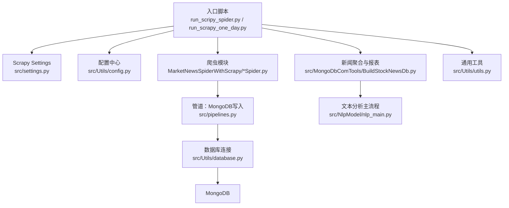
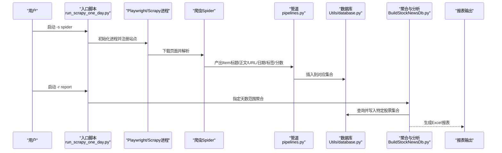
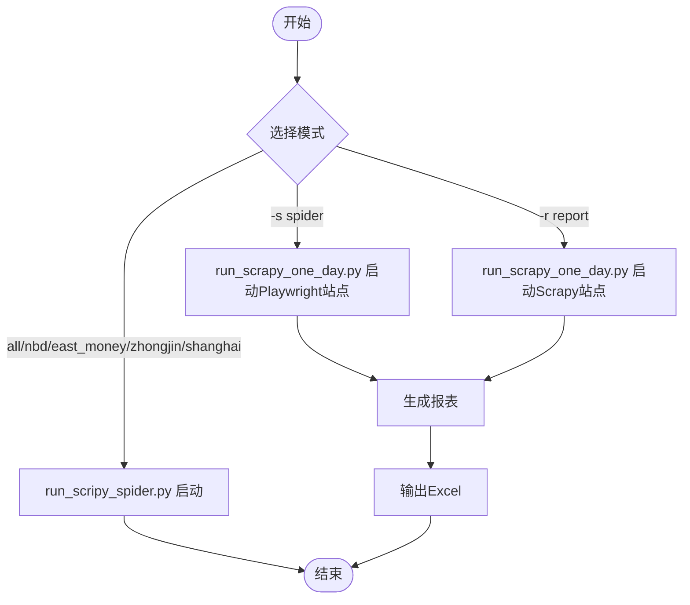
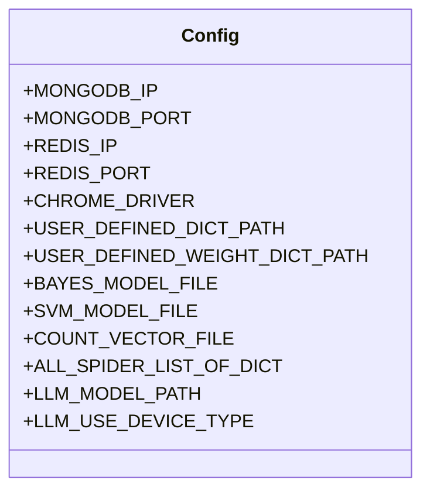
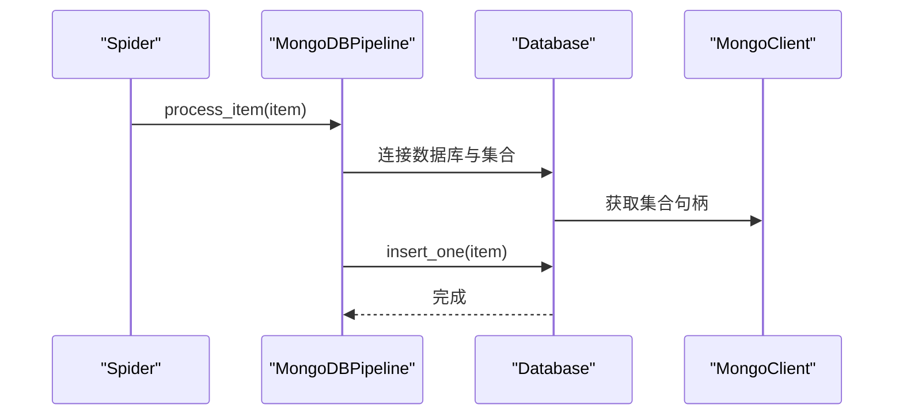
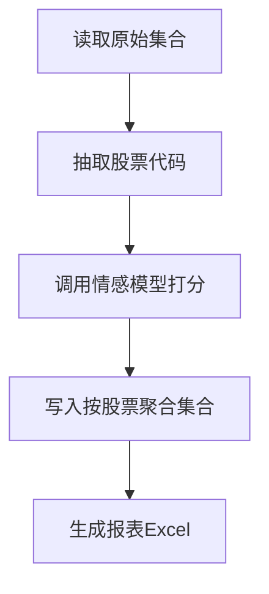
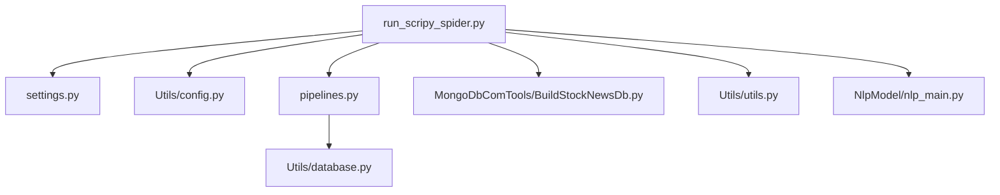

# 快速开始

<cite>
**本文引用的文件**
- [README.md](file://README.md)
- [src/settings.py](file://src/settings.py)
- [src/Utils/config.py](file://src/Utils/config.py)
- [src/run_scripy_spider.py](file://src/run_scripy_spider.py)
- [src/run_scrapy_one_day.py](file://src/run_scrapy_one_day.py)
- [src/pipelines.py](file://src/pipelines.py)
- [src/Utils/database.py](file://src/Utils/database.py)
- [src/MongoDbComTools/BuildStockNewsDb.py](file://src/MongoDbComTools/BuildStockNewsDb.py)
- [src/MarketNewsSpiderWithScrapy/BaseSpider.py](file://src/MarketNewsSpiderWithScrapy/BaseSpider.py)
- [src/Utils/utils.py](file://src/Utils/utils.py)
- [src/NlpModel/nlp_main.py](file://src/NlpModel/nlp_main.py)
</cite>

## 目录
1. [简介](#简介)
2. [项目结构](#项目结构)
3. [核心组件](#核心组件)
4. [架构总览](#架构总览)
5. [详细组件分析](#详细组件分析)
6. [依赖分析](#依赖分析)
7. [性能考虑](#性能考虑)
8. [故障排除指南](#故障排除指南)
9. [结论](#结论)
10. [附录](#附录)

## 简介
本指南面向量化投资新闻爬取与文本分析系统的新手与有经验用户，帮助你在30分钟内完成环境搭建、运行第一个新闻爬取任务，并进行基础的文本分析与结果导出。系统支持多来源新闻站点的Scrapy与Playwright爬取，自动抽取新闻中的股票代码并进行情感打分，最终生成Excel报表。

## 项目结构
项目采用模块化组织，主要目录与职责如下：
- src/Utils：通用配置、数据库连接与工具函数
- src/MarketNewsSpiderWithScrapy：基于Scrapy与Playwright的各新闻源爬虫
- src/MongoDbComTools：新闻聚合与报表生成
- src/NlpModel：文本预处理、分词与情感分析模型
- src/data、src/info：数据与词典资源存放位置

图表来源
- [src/run_scripy_spider.py:117-142](file://src/run_scripy_spider.py#L117-L142)
- [src/run_scrapy_one_day.py:32-80](file://src/run_scrapy_one_day.py#L32-L80)
- [src/settings.py:1-49](file://src/settings.py#L1-L49)
- [src/Utils/config.py:1-455](file://src/Utils/config.py#L1-L455)
- [src/pipelines.py:8-56](file://src/pipelines.py#L8-L56)
- [src/Utils/database.py:36-176](file://src/Utils/database.py#L36-L176)
- [src/MongoDbComTools/BuildStockNewsDb.py:19-241](file://src/MongoDbComTools/BuildStockNewsDb.py#L19-L241)
- [src/NlpModel/nlp_main.py:17-70](file://src/NlpModel/nlp_main.py#L17-L70)
- [src/Utils/utils.py:18-251](file://src/Utils/utils.py#L18-L251)

章节来源
- [README.md:1-33](file://README.md#L1-L33)
- [src/settings.py:1-49](file://src/settings.py#L1-L49)
- [src/Utils/config.py:1-455](file://src/Utils/config.py#L1-L455)

## 核心组件
- 配置中心：集中管理数据库、爬虫站点参数、词典路径、模型路径等
- 爬虫入口：run_scripy_spider.py与run_scrapy_one_day.py分别支持批量与按日运行
- 管道：将爬取结果写入MongoDB，按站点自动路由集合
- 数据库：统一连接MongoDB，提供查询与插入能力
- 新闻聚合：抽取股票代码、调用情感模型、生成报表
- 文本分析：加载词典、分词、训练或加载分类模型进行情感打分

章节来源
- [src/Utils/config.py:13-54](file://src/Utils/config.py#L13-L54)
- [src/run_scripy_spider.py:117-142](file://src/run_scripy_spider.py#L117-L142)
- [src/run_scrapy_one_day.py:32-80](file://src/run_scrapy_one_day.py#L32-L80)
- [src/pipelines.py:8-56](file://src/pipelines.py#L8-L56)
- [src/Utils/database.py:36-176](file://src/Utils/database.py#L36-L176)
- [src/MongoDbComTools/BuildStockNewsDb.py:19-241](file://src/MongoDbComTools/BuildStockNewsDb.py#L19-L241)
- [src/NlpModel/nlp_main.py:17-70](file://src/NlpModel/nlp_main.py#L17-L70)

## 架构总览
系统以“入口脚本 -> 爬虫 -> 管道 -> 数据库 -> 聚合与分析 -> 报表”的链路运行。入口脚本根据参数选择站点集合，Scrapy/Playwright爬取页面，提取正文与标题，识别股票代码，调用情感模型打分，写入MongoDB；随后可按日生成Excel报表。

图表来源
- [src/run_scrapy_one_day.py:32-80](file://src/run_scrapy_one_day.py#L32-L80)
- [src/MarketNewsSpiderWithScrapy/BaseSpider.py:38-98](file://src/MarketNewsSpiderWithScrapy/BaseSpider.py#L38-L98)
- [src/pipelines.py:25-56](file://src/pipelines.py#L25-L56)
- [src/Utils/database.py:78-88](file://src/Utils/database.py#L78-L88)
- [src/MongoDbComTools/BuildStockNewsDb.py:157-241](file://src/MongoDbComTools/BuildStockNewsDb.py#L157-L241)

## 详细组件分析

### 组件A：入口脚本与运行方式
- run_scripy_spider.py：支持全量或按站点运行，打印Scrapy配置并启动CrawlerProcess
- run_scrapy_one_day.py：支持按日爬取与报表生成，区分Playwright与Scrapy站点，生成Excel报表

图表来源
- [src/run_scripy_spider.py:117-142](file://src/run_scripy_spider.py#L117-L142)
- [src/run_scrapy_one_day.py:32-80](file://src/run_scrapy_one_day.py#L32-L80)

章节来源
- [src/run_scripy_spider.py:117-142](file://src/run_scripy_spider.py#L117-L142)
- [src/run_scrapy_one_day.py:32-80](file://src/run_scrapy_one_day.py#L32-L80)

### 组件B：配置中心与站点参数
- 数据库与驱动：MongoDB IP/端口、Redis、ChromeDriver路径
- 爬虫站点：各平台的数据库名、集合名、起始URL、关键词、页码等
- 情感分析：词典路径、模型文件路径、LLM模型路径与设备类型

图表来源
- [src/Utils/config.py:13-54](file://src/Utils/config.py#L13-L54)
- [src/Utils/config.py:55-455](file://src/Utils/config.py#L55-L455)

章节来源
- [src/Utils/config.py:13-54](file://src/Utils/config.py#L13-L54)
- [src/Utils/config.py:55-455](file://src/Utils/config.py#L55-L455)

### 组件C：管道与数据库写入
- 管道根据Spider名称前缀将数据写入不同数据库与集合
- 数据库类负责连接、查询、插入、更新与异常重连

图表来源
- [src/pipelines.py:25-56](file://src/pipelines.py#L25-L56)
- [src/Utils/database.py:36-176](file://src/Utils/database.py#L36-L176)

章节来源
- [src/pipelines.py:8-56](file://src/pipelines.py#L8-L56)
- [src/Utils/database.py:36-176](file://src/Utils/database.py#L36-L176)

### 组件D：新闻聚合与情感分析
- 抽取股票代码与词频，调用情感模型打分，写入“按股票”聚合库
- 可选使用LLM融合打分，生成Excel报表

图表来源
- [src/MongoDbComTools/BuildStockNewsDb.py:157-241](file://src/MongoDbComTools/BuildStockNewsDb.py#L157-L241)
- [src/MarketNewsSpiderWithScrapy/BaseSpider.py:66-98](file://src/MarketNewsSpiderWithScrapy/BaseSpider.py#L66-L98)

章节来源
- [src/MongoDbComTools/BuildStockNewsDb.py:19-241](file://src/MongoDbComTools/BuildStockNewsDb.py#L19-L241)
- [src/MarketNewsSpiderWithScrapy/BaseSpider.py:38-98](file://src/MarketNewsSpiderWithScrapy/BaseSpider.py#L38-L98)

## 依赖分析
- 运行时依赖：Scrapy、Playwright、MongoDB、pandas、numpy、scikit-learn等
- 配置依赖：ChromeDriver路径、MongoDB连接参数、词典与模型文件路径
- 外部接口：各新闻站点的HTTP接口与反爬策略

图表来源
- [src/run_scripy_spider.py:117-142](file://src/run_scripy_spider.py#L117-L142)
- [src/settings.py:1-49](file://src/settings.py#L1-L49)
- [src/Utils/config.py:1-455](file://src/Utils/config.py#L1-L455)
- [src/pipelines.py:8-56](file://src/pipelines.py#L8-L56)
- [src/Utils/database.py:36-176](file://src/Utils/database.py#L36-L176)
- [src/MongoDbComTools/BuildStockNewsDb.py:19-241](file://src/MongoDbComTools/BuildStockNewsDb.py#L19-L241)
- [src/Utils/utils.py:18-251](file://src/Utils/utils.py#L18-L251)
- [src/NlpModel/nlp_main.py:17-70](file://src/NlpModel/nlp_main.py#L17-L70)

章节来源
- [src/run_scripy_spider.py:117-142](file://src/run_scripy_spider.py#L117-L142)
- [src/settings.py:1-49](file://src/settings.py#L1-L49)
- [src/Utils/config.py:1-455](file://src/Utils/config.py#L1-L455)

## 性能考虑
- 并发与延迟：Scrapy并发请求与下载延迟可调，建议根据目标站点限流策略调整
- 数据库连接池：MongoDB最大连接池大小与自动重连机制有助于稳定性
- 文本分析：词典加载与模型预测可缓存，避免重复初始化
- 报表生成：大数据量时建议分批写入Excel工作表

章节来源
- [src/settings.py:18-23](file://src/settings.py#L18-L23)
- [src/Utils/database.py:50-60](file://src/Utils/database.py#L50-L60)
- [src/MongoDbComTools/BuildStockNewsDb.py:19-53](file://src/MongoDbComTools/BuildStockNewsDb.py#L19-L53)

## 故障排除指南
- 数据库连接失败：检查MongoDB IP/端口与网络连通性
- ChromeDriver问题：确认CHROME_DRIVER路径与系统驱动版本匹配
- 爬虫被反爬：适当提高DOWNLOAD_DELAY、更换User-Agent或代理
- 报表为空：确认已先执行爬取再执行报表生成，且时间范围参数正确
- 邮件发送：若启用邮件功能，请配置SMTP账号与密码

章节来源
- [src/Utils/config.py:13-23](file://src/Utils/config.py#L13-L23)
- [src/settings.py:21-30](file://src/settings.py#L21-L30)
- [src/Utils/utils.py:30-58](file://src/Utils/utils.py#L30-L58)

## 结论
通过本指南，你可以在30分钟内完成环境准备、运行首个爬取任务并生成报表。建议新手从按日运行脚本入手，逐步熟悉配置与流程；有经验用户可扩展站点、优化并发与分析模型，提升整体吞吐与准确性。

## 附录

### 快速开始步骤
- 准备环境
  - Python版本：建议使用较新的稳定版本（具体以项目实际兼容为准）
  - 安装依赖：Scrapy、Playwright、MongoDB客户端、pandas、numpy、scikit-learn等
  - 准备数据库：本地或远程MongoDB可用
- 配置文件
  - 修改数据库IP/端口、ChromeDriver路径、词典与模型路径
  - 如需LLM打分，配置LLM模型路径与设备类型
- 运行第一个任务
  - 按日运行：python src/run_scrapy_one_day.py -s spider
  - 生成报表：python src/run_scrapy_one_day.py -r report
- 查看结果
  - 爬取结果写入MongoDB对应集合
  - 报表生成在info目录下，文件名为news_YYYY-MM-DD.xlsx

章节来源
- [src/Utils/config.py:13-54](file://src/Utils/config.py#L13-L54)
- [src/run_scrapy_one_day.py:32-80](file://src/run_scrapy_one_day.py#L32-L80)
- [src/Utils/utils.py:18-251](file://src/Utils/utils.py#L18-L251)