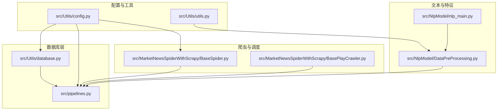
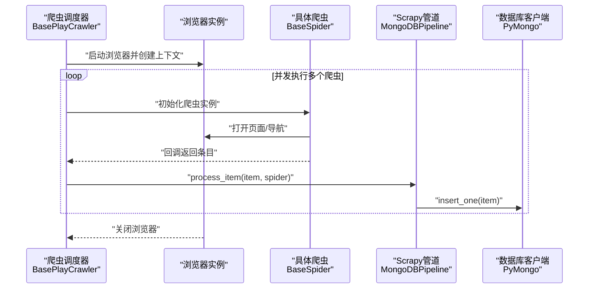
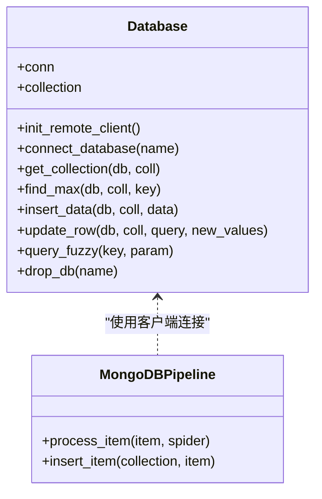
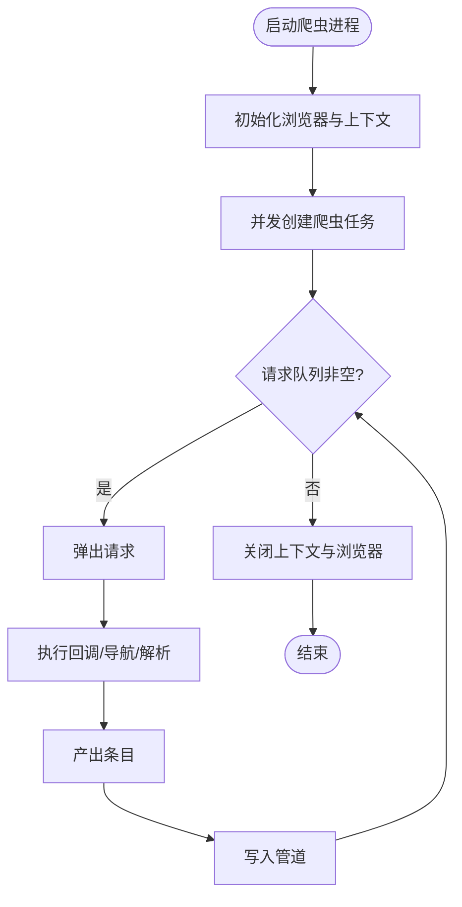
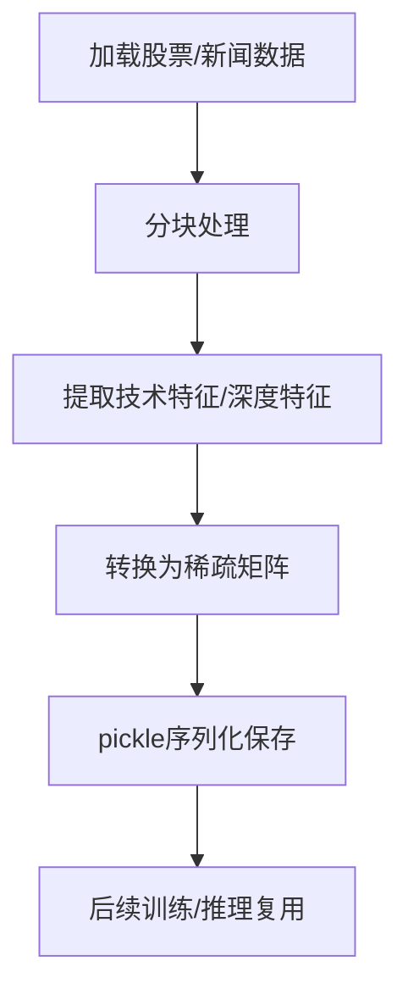
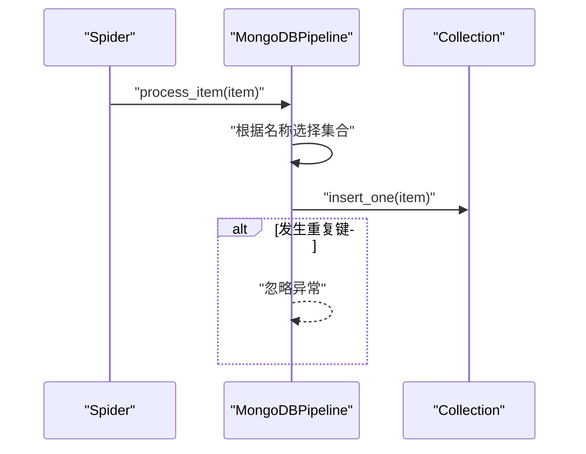
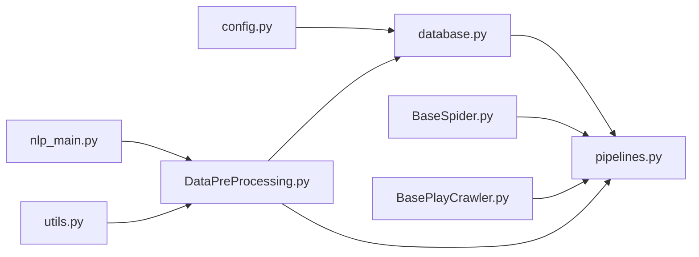

# 内存与资源管理

<cite>
**本文引用的文件**
- [README.md](file://README.md)
- [ProblemSolve.md](file://ProblemSolve.md)
- [src/Utils/config.py](file://src/Utils/config.py)
- [src/Utils/database.py](file://src/Utils/database.py)
- [src/pipelines.py](file://src/pipelines.py)
- [src/Utils/utils.py](file://src/Utils/utils.py)
- [src/MarketNewsSpiderWithScrapy/BaseSpider.py](file://src/MarketNewsSpiderWithScrapy/BaseSpider.py)
- [src/MarketNewsSpiderWithScrapy/BasePlayCrawler.py](file://src/MarketNewsSpiderWithScrapy/BasePlayCrawler.py)
- [src/NlpModel/DataPreProcessing.py](file://src/NlpModel/DataPreProcessing.py)
- [src/NlpModel/nlp_main.py](file://src/NlpModel/nlp_main.py)
</cite>

## 目录
1. [引言](#引言)
2. [项目结构](#项目结构)
3. [核心组件](#核心组件)
4. [架构总览](#架构总览)
5. [详细组件分析](#详细组件分析)
6. [依赖分析](#依赖分析)
7. [性能考量](#性能考量)
8. [故障排查指南](#故障排查指南)
9. [结论](#结论)
10. [附录](#附录)

## 引言
本文件面向量化分析与新闻爬取场景，系统梳理仓库中的内存与资源管理实践，覆盖以下主题：
- Python 程序的内存管理策略与对象生命周期管理
- 垃圾回收机制与内存泄漏预防
- 资源池化：数据库连接池、HTTP 连接池、线程池配置
- 大数据处理的内存优化：分块处理、流式处理、稀疏矩阵与序列化
- 进程间通信的资源管理：共享内存、消息队列、进程同步机制
- 系统资源监控与性能分析工具使用
- 最佳实践与常见问题解决方案

## 项目结构
该项目由多模块组成，涵盖新闻爬取、数据入库、文本处理与特征工程、技术分析等环节。与内存与资源管理相关的关键路径如下：
- 配置与环境：src/Utils/config.py
- 数据库访问与连接池：src/Utils/database.py、src/pipelines.py
- 爬虫与异步调度：src/MarketNewsSpiderWithScrapy/BasePlayCrawler.py、src/MarketNewsSpiderWithScrapy/BaseSpider.py
- 文本处理与特征工程：src/NlpModel/DataPreProcessing.py、src/NlpModel/nlp_main.py
- 工具与通用函数：src/Utils/utils.py
- 问题与系统资源限制：ProblemSolve.md

图表来源
- [src/Utils/config.py:1-455](file://src/Utils/config.py#L1-L455)
- [src/Utils/database.py:1-176](file://src/Utils/database.py#L1-L176)
- [src/pipelines.py:1-56](file://src/pipelines.py#L1-L56)
- [src/MarketNewsSpiderWithScrapy/BaseSpider.py:1-149](file://src/MarketNewsSpiderWithScrapy/BaseSpider.py#L1-L149)
- [src/MarketNewsSpiderWithScrapy/BasePlayCrawler.py:1-120](file://src/MarketNewsSpiderWithScrapy/BasePlayCrawler.py#L1-L120)
- [src/NlpModel/DataPreProcessing.py:1-304](file://src/NlpModel/DataPreProcessing.py#L1-L304)
- [src/NlpModel/nlp_main.py:1-70](file://src/NlpModel/nlp_main.py#L1-L70)
- [src/Utils/utils.py:1-251](file://src/Utils/utils.py#L1-L251)

章节来源
- [README.md:1-33](file://README.md#L1-L33)
- [src/Utils/config.py:1-455](file://src/Utils/config.py#L1-L455)

## 核心组件
- 数据库连接池与重连策略：通过 PyMongo 客户端配置连接池大小与自动重连装饰器，降低网络抖动对稳定性的影响。
- 爬虫异步调度与浏览器上下文隔离：Playwright 异步并发爬取，每个爬虫拥有独立上下文，避免 Cookie 与状态污染，减少内存冗余。
- 文本处理与特征工程：使用 Pandas、NumPy、SciPy 稀疏矩阵，结合分块与序列化，平衡内存占用与计算效率。
- 管道写入与去重：Scrapy 管道统一入库，MongoDB 去重键冲突处理，避免重复写入造成资源浪费。

章节来源
- [src/Utils/database.py:36-176](file://src/Utils/database.py#L36-L176)
- [src/pipelines.py:8-56](file://src/pipelines.py#L8-L56)
- [src/MarketNewsSpiderWithScrapy/BasePlayCrawler.py:21-120](file://src/MarketNewsSpiderWithScrapy/BasePlayCrawler.py#L21-L120)
- [src/NlpModel/DataPreProcessing.py:17-304](file://src/NlpModel/DataPreProcessing.py#L17-L304)

## 架构总览
下图展示从爬取到入库、再到特征工程的整体流程，以及资源管理的关键节点。

图表来源
- [src/MarketNewsSpiderWithScrapy/BasePlayCrawler.py:41-120](file://src/MarketNewsSpiderWithScrapy/BasePlayCrawler.py#L41-L120)
- [src/MarketNewsSpiderWithScrapy/BaseSpider.py:41-148](file://src/MarketNewsSpiderWithScrapy/BaseSpider.py#L41-L148)
- [src/pipelines.py:25-56](file://src/pipelines.py#L25-L56)
- [src/Utils/database.py:78-93](file://src/Utils/database.py#L78-L93)

## 详细组件分析

### 数据库连接池与重连策略
- 连接池配置：MongoDB 客户端设置最大连接池大小，避免高并发下的连接耗尽。
- 自动重连装饰器：对可能因网络抖动失败的操作进行指数退避重试，提升鲁棒性。
- 查询与写入：统一封装查询、插入、更新、去重等操作，避免重复构造连接与集合对象。

图表来源
- [src/Utils/database.py:36-176](file://src/Utils/database.py#L36-L176)
- [src/pipelines.py:8-56](file://src/pipelines.py#L8-L56)

章节来源
- [src/Utils/database.py:44-60](file://src/Utils/database.py#L44-L60)
- [src/Utils/database.py:94-172](file://src/Utils/database.py#L94-L172)
- [src/pipelines.py:25-56](file://src/pipelines.py#L25-L56)

### 爬虫异步调度与资源隔离
- 异步并发：使用 asyncio 并发运行多个爬虫任务，显著提升吞吐。
- 浏览器与上下文：每个爬虫拥有独立上下文，避免会话状态交叉污染，降低内存冗余。
- 请求队列与回调：统一处理 Request/Response，支持异步迭代回调，边解析边入库。

图表来源
- [src/MarketNewsSpiderWithScrapy/BasePlayCrawler.py:41-120](file://src/MarketNewsSpiderWithScrapy/BasePlayCrawler.py#L41-L120)

章节来源
- [src/MarketNewsSpiderWithScrapy/BasePlayCrawler.py:21-120](file://src/MarketNewsSpiderWithScrapy/BasePlayCrawler.py#L21-L120)
- [src/MarketNewsSpiderWithScrapy/BaseSpider.py:41-148](file://src/MarketNewsSpiderWithScrapy/BaseSpider.py#L41-L148)

### 文本处理与特征工程的内存优化
- 分块与流式：在特征生成与数据读取阶段，优先采用分块处理与延迟计算，避免一次性加载全量数据。
- 稀疏矩阵：将模型向量转换为稀疏矩阵，降低内存占用，提升大规模向量运算效率。
- 序列化与缓存：使用 pickle 对中间特征进行持久化，减少重复计算带来的内存峰值。

图表来源
- [src/NlpModel/DataPreProcessing.py:104-118](file://src/NlpModel/DataPreProcessing.py#L104-L118)
- [src/NlpModel/DataPreProcessing.py:188-208](file://src/NlpModel/DataPreProcessing.py#L188-L208)
- [src/NlpModel/nlp_main.py:17-70](file://src/NlpModel/nlp_main.py#L17-L70)

章节来源
- [src/NlpModel/DataPreProcessing.py:17-304](file://src/NlpModel/DataPreProcessing.py#L17-L304)
- [src/NlpModel/nlp_main.py:1-70](file://src/NlpModel/nlp_main.py#L1-L70)

### 管道写入与去重
- 统一入口：根据爬虫名称路由至对应数据库与集合，集中处理写入。
- 去重策略：捕获重复键异常，忽略重复项，避免无效写入与索引膨胀。

图表来源
- [src/pipelines.py:25-56](file://src/pipelines.py#L25-L56)

章节来源
- [src/pipelines.py:8-56](file://src/pipelines.py#L8-L56)

## 依赖分析
- 组件耦合
  - Database 与 config 强耦合，依赖配置中的主机、端口与加密密钥。
  - MongoDBPipeline 依赖 Database 客户端，按爬虫命名空间路由集合。
  - BasePlayCrawler 与 BaseSpider 解耦，前者负责调度与上下文隔离，后者负责解析与条目生成。
  - DataPreProcessing 依赖数据库与第三方特征引擎，输出特征供训练使用。
- 外部依赖
  - PyMongo 提供连接池与自动重连能力。
  - Playwright 提供异步浏览器与上下文隔离。
  - Pandas/NumPy/SciPy 支持大规模数值计算与稀疏矩阵。

图表来源
- [src/Utils/config.py:1-455](file://src/Utils/config.py#L1-L455)
- [src/Utils/database.py:1-176](file://src/Utils/database.py#L1-L176)
- [src/pipelines.py:1-56](file://src/pipelines.py#L1-L56)
- [src/MarketNewsSpiderWithScrapy/BaseSpider.py:1-149](file://src/MarketNewsSpiderWithScrapy/BaseSpider.py#L1-L149)
- [src/MarketNewsSpiderWithScrapy/BasePlayCrawler.py:1-120](file://src/MarketNewsSpiderWithScrapy/BasePlayCrawler.py#L1-L120)
- [src/NlpModel/DataPreProcessing.py:1-304](file://src/NlpModel/DataPreProcessing.py#L1-L304)
- [src/NlpModel/nlp_main.py:1-70](file://src/NlpModel/nlp_main.py#L1-L70)
- [src/Utils/utils.py:1-251](file://src/Utils/utils.py#L1-L251)

章节来源
- [src/Utils/config.py:1-455](file://src/Utils/config.py#L1-L455)
- [src/Utils/database.py:1-176](file://src/Utils/database.py#L1-L176)
- [src/pipelines.py:1-56](file://src/pipelines.py#L1-L56)
- [src/MarketNewsSpiderWithScrapy/BasePlayCrawler.py:1-120](file://src/MarketNewsSpiderWithScrapy/BasePlayCrawler.py#L1-L120)
- [src/MarketNewsSpiderWithScrapy/BaseSpider.py:1-149](file://src/MarketNewsSpiderWithScrapy/BaseSpider.py#L1-L149)
- [src/NlpModel/DataPreProcessing.py:1-304](file://src/NlpModel/DataPreProcessing.py#L1-L304)
- [src/NlpModel/nlp_main.py:1-70](file://src/NlpModel/nlp_main.py#L1-L70)
- [src/Utils/utils.py:1-251](file://src/Utils/utils.py#L1-L251)

## 性能考量
- 连接池与并发
  - PyMongo 最大连接池大小：在高并发场景下避免连接争用，建议根据 CPU 与数据库承载能力调优。
  - 自动重连与指数退避：在网络抖动时提升稳定性，减少失败重试对吞吐的影响。
- 爬虫并发与上下文隔离
  - 每个爬虫独立上下文，避免 Cookie/Storage 污染，降低内存碎片与会话开销。
  - 异步并发提升吞吐，但需注意目标站点的反爬策略与限速。
- 数据处理与内存
  - 使用稀疏矩阵与分块处理，降低内存峰值；必要时启用序列化缓存，避免重复计算。
  - 避免一次性加载全量数据到内存，优先使用迭代器与延迟计算。
- I/O 与磁盘
  - 管道写入前尽量做去重与清洗，减少无效写入与索引重建成本。
  - 大文件序列化建议使用压缩或分片存储，配合流式读取。

## 故障排查指南
- 文件描述符过多
  - 现象：系统提示“too many open files”。
  - 处理：调整系统 ulimit，确保数据库与浏览器句柄上限满足并发需求。
  - 参考：系统资源限制与 MongoDB ulimit 设置。
- 网络抖动导致连接中断
  - 现象：AutoReconnect 异常。
  - 处理：利用自动重连装饰器与指数退避；必要时增加超时与重试次数。
- 内存占用过高
  - 现象：特征工程阶段内存飙升。
  - 处理：采用分块处理、稀疏矩阵、及时释放中间变量；序列化中间结果。
- 爬虫崩溃或超时
  - 现象：页面加载超时或回调异常。
  - 处理：为页面导航设置合理超时；在回调中捕获异常并记录日志，避免中断整个任务队列。

章节来源
- [ProblemSolve.md:18-41](file://ProblemSolve.md#L18-L41)
- [src/Utils/database.py:15-33](file://src/Utils/database.py#L15-L33)
- [src/MarketNewsSpiderWithScrapy/BasePlayCrawler.py:94-118](file://src/MarketNewsSpiderWithScrapy/BasePlayCrawler.py#L94-L118)
- [src/NlpModel/DataPreProcessing.py:188-208](file://src/NlpModel/DataPreProcessing.py#L188-L208)

## 结论
本项目在内存与资源管理方面采取了多项务实措施：通过 PyMongo 连接池与自动重连增强数据库稳定性；通过 Playwright 异步并发与上下文隔离提升爬虫吞吐与资源利用率；通过分块处理、稀疏矩阵与序列化优化特征工程阶段的内存占用。建议在生产环境中持续监控系统资源与数据库连接池使用情况，结合业务负载动态调整并发度与连接池参数，确保系统在高负载下的稳定与高效。

## 附录
- 最佳实践清单
  - 数据库：设置合理的最大连接池大小；启用自动重连与指数退避；对写入前进行去重校验。
  - 爬虫：为每个爬虫分配独立上下文；设置页面导航超时；在回调中捕获异常并记录日志。
  - 特征工程：采用分块与延迟计算；使用稀疏矩阵；对中间结果进行序列化缓存。
  - 监控与分析：关注系统文件描述符、内存使用、数据库连接池占用与爬虫任务队列长度。
- 常见问题
  - “Too many open files”：提升系统 ulimit，检查数据库与浏览器句柄上限。
  - AutoReconnect：通过装饰器与退避策略缓解网络抖动影响。
  - 内存峰值：采用分块、稀疏矩阵与序列化，避免一次性加载全量数据。