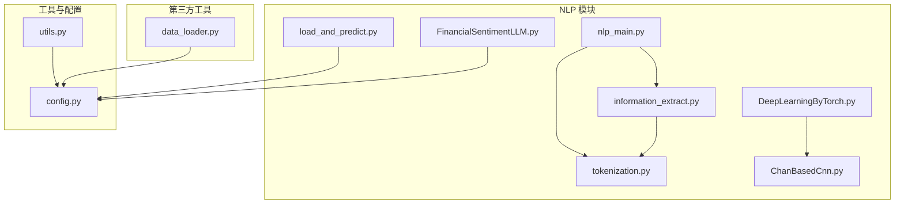
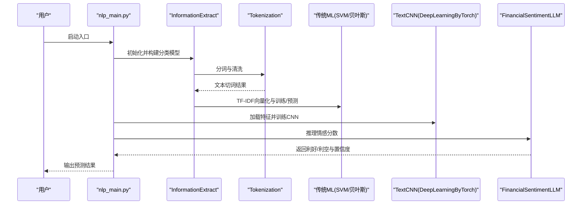
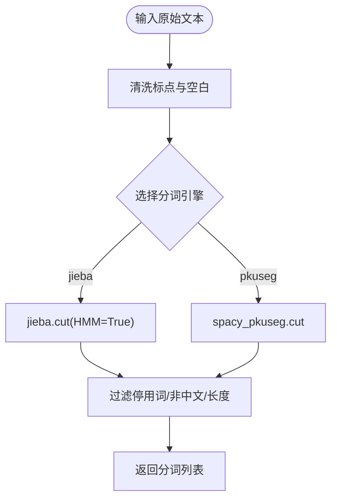
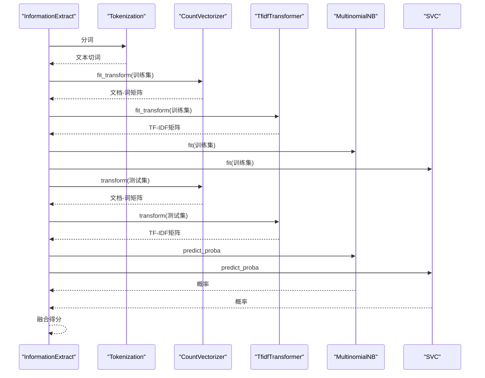
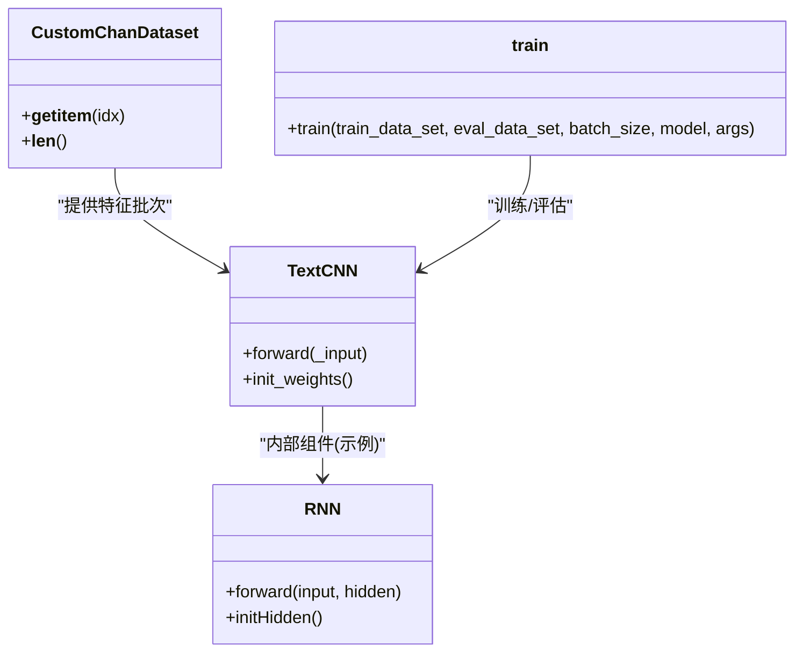
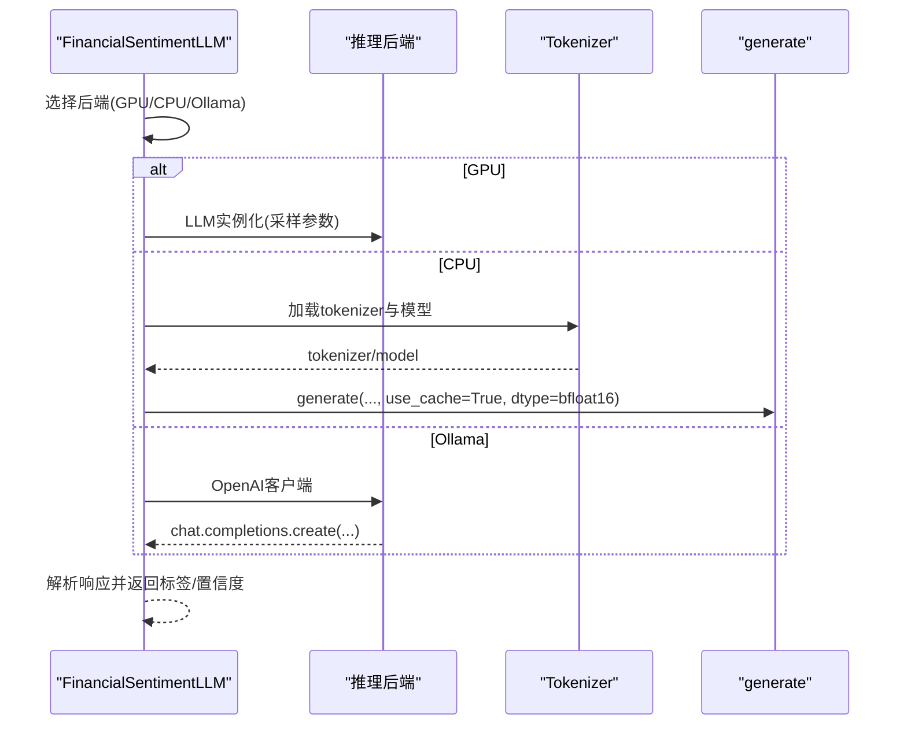
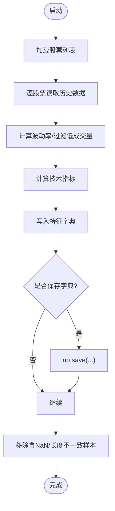
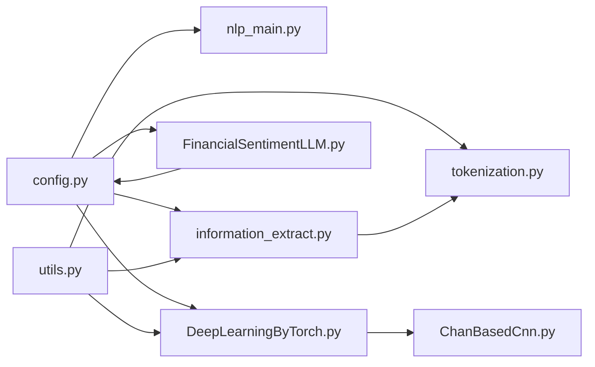

# 分析性能优化

<cite>
**本文引用的文件**
- [README.md](file://README.md)
- [src/Utils/config.py](file://src/Utils/config.py)
- [src/Utils/utils.py](file://src/Utils/utils.py)
- [src/NlpModel/nlp_main.py](file://src/NlpModel/nlp_main.py)
- [src/NlpModel/information_extract.py](file://src/NlpModel/information_extract.py)
- [src/NlpModel/tokenization.py](file://src/NlpModel/tokenization.py)
- [src/NlpModel/FinancialSentimentLLM.py](file://src/NlpModel/FinancialSentimentLLM.py)
- [src/NlpModel/DeepLearningByTorch.py](file://src/NlpModel/DeepLearningByTorch.py)
- [src/NlpModel/ChanBasedCnn.py](file://src/NlpModel/ChanBasedCnn.py)
- [src/NlpModel/load_and_predict.py](file://src/NlpModel/load_and_predict.py)
- [src/ThirdPartyToolSurpriver/data_loader.py](file://src/ThirdPartyToolSurpriver/data_loader.py)
</cite>

## 目录
1. [简介](#简介)
2. [项目结构](#项目结构)
3. [核心组件](#核心组件)
4. [架构总览](#架构总览)
5. [详细组件分析](#详细组件分析)
6. [依赖分析](#依赖分析)
7. [性能考量](#性能考量)
8. [故障排查指南](#故障排查指南)
9. [结论](#结论)
10. [附录](#附录)

## 简介
本技术文档聚焦于文本分析系统的性能优化，结合仓库中现有的自然语言处理与深度学习模块，系统性阐述以下主题：
- 自然语言处理模型的性能优化策略：模型压缩、量化技术、批处理优化
- 大语言模型的推理加速：CUDA优化、混合精度、缓存机制
- 传统机器学习模型的性能调优：特征工程优化、算法参数调整、并行计算
- 文本预处理流水线的性能优化：内存管理、数据缓存、计算图优化
- 情感分析算法的时间/空间复杂度优化
- 性能基准测试方法与模型选择策略

本项目同时包含基于传统机器学习与深度学习的文本情感分析流程，以及面向大语言模型的推理封装，适合在资源受限或高吞吐场景下进行针对性优化。

## 项目结构
项目采用按功能域划分的目录结构，NLP相关逻辑集中在 src/NlpModel 下，工具与配置位于 src/Utils 与 src/ThirdPartyToolSurpriver，爬虫与数据采集位于 MarketNewsSpiderWithScrapy 等目录。

图表来源
- [src/NlpModel/nlp_main.py:17-69](file://src/NlpModel/nlp_main.py#L17-L69)
- [src/NlpModel/information_extract.py:26-60](file://src/NlpModel/information_extract.py#L26-L60)
- [src/NlpModel/tokenization.py:11-24](file://src/NlpModel/tokenization.py#L11-L24)
- [src/NlpModel/FinancialSentimentLLM.py:5-49](file://src/NlpModel/FinancialSentimentLLM.py#L5-L49)
- [src/NlpModel/DeepLearningByTorch.py:69-118](file://src/NlpModel/DeepLearningByTorch.py#L69-L118)
- [src/NlpModel/ChanBasedCnn.py:13-14](file://src/NlpModel/ChanBasedCnn.py#L13-L14)
- [src/NlpModel/load_and_predict.py:19-78](file://src/NlpModel/load_and_predict.py#L19-L78)
- [src/Utils/config.py:1-455](file://src/Utils/config.py#L1-L455)
- [src/Utils/utils.py:1-251](file://src/Utils/utils.py#L1-L251)
- [src/ThirdPartyToolSurpriver/data_loader.py:16-66](file://src/ThirdPartyToolSurpriver/data_loader.py#L16-L66)

章节来源
- [README.md:1-33](file://README.md#L1-L33)
- [src/Utils/config.py:1-455](file://src/Utils/config.py#L1-L455)

## 核心组件
- 文本预处理与特征工程：分词、去停用词、统计词频、规则打标、TF-IDF向量化
- 传统机器学习分类器：朴素贝叶斯与SVM，集成预测融合
- 深度学习CNN模型：多特征拼接（缠论特征、行业/概念嵌入、技术指标）
- 大语言模型推理封装：GPU/CPU/Ollama后端切换、采样参数、缓存与dtype
- 数据加载与缓存：pickle持久化、字典缓存、批量数据加载

章节来源
- [src/NlpModel/information_extract.py:26-60](file://src/NlpModel/information_extract.py#L26-L60)
- [src/NlpModel/tokenization.py:11-24](file://src/NlpModel/tokenization.py#L11-L24)
- [src/NlpModel/ChanBasedCnn.py:155-261](file://src/NlpModel/ChanBasedCnn.py#L155-L261)
- [src/NlpModel/FinancialSentimentLLM.py:5-105](file://src/NlpModel/FinancialSentimentLLM.py#L5-L105)
- [src/ThirdPartyToolSurpriver/data_loader.py:148-224](file://src/ThirdPartyToolSurpriver/data_loader.py#L148-L224)

## 架构总览
整体流程从新闻数据抓取开始，经由分词与特征工程，进入传统ML与深度学习两条路径；同时提供大语言模型的快速推理接口，用于情感打分。

图表来源
- [src/NlpModel/nlp_main.py:17-69](file://src/NlpModel/nlp_main.py#L17-L69)
- [src/NlpModel/information_extract.py:260-338](file://src/NlpModel/information_extract.py#L260-L338)
- [src/NlpModel/tokenization.py:77-103](file://src/NlpModel/tokenization.py#L77-L103)
- [src/NlpModel/DeepLearningByTorch.py:69-118](file://src/NlpModel/DeepLearningByTorch.py#L69-L118)
- [src/NlpModel/FinancialSentimentLLM.py:108-166](file://src/NlpModel/FinancialSentimentLLM.py#L108-L166)

## 详细组件分析

### 文本预处理与分词（Tokenization）
- 支持多种分词引擎（jieba、pkuseg），可加载自定义词典与停用词表
- 清洗与过滤规则：去除标点、保留中文、长度阈值、停用词过滤
- 提供批量更新数据库字段的能力，减少重复计算

图表来源
- [src/NlpModel/tokenization.py:77-103](file://src/NlpModel/tokenization.py#L77-L103)

章节来源
- [src/NlpModel/tokenization.py:11-103](file://src/NlpModel/tokenization.py#L11-L103)

### 传统机器学习文本分类（InformationExtract + ML）
- 数据准备：从数据库聚合多源新闻，构造规则标签，过滤未知样本
- 特征工程：CountVectorizer + TfidfTransformer，固定词汇表以复用模型
- 模型训练：朴素贝叶斯与SVM，保存joblib模型，支持增量加载
- 预测融合：对同一文本分别预测并归一化得到最终得分

图表来源
- [src/NlpModel/information_extract.py:260-338](file://src/NlpModel/information_extract.py#L260-L338)
- [src/NlpModel/tokenization.py:77-103](file://src/NlpModel/tokenization.py#L77-L103)

章节来源
- [src/NlpModel/information_extract.py:26-60](file://src/NlpModel/information_extract.py#L26-L60)
- [src/NlpModel/information_extract.py:260-338](file://src/NlpModel/information_extract.py#L260-L338)

### 深度学习CNN文本分类（ChanBasedCnn + DeepLearningByTorch）
- 数据集：CustomChanDataset，将多源特征（缠论序列、行业/概念、技术指标）拼接为张量
- 模型：TextCNN，对不同特征分支分别卷积与池化，最后拼接全连接分类
- 训练：Adam优化器、交叉熵损失、早停与断点保存
- 设备：自动检测CUDA可用性，优先使用GPU

图表来源
- [src/NlpModel/ChanBasedCnn.py:83-149](file://src/NlpModel/ChanBasedCnn.py#L83-L149)
- [src/NlpModel/ChanBasedCnn.py:155-261](file://src/NlpModel/ChanBasedCnn.py#L155-L261)
- [src/NlpModel/ChanBasedCnn.py:336-390](file://src/NlpModel/ChanBasedCnn.py#L336-L390)

章节来源
- [src/NlpModel/DeepLearningByTorch.py:69-118](file://src/NlpModel/DeepLearningByTorch.py#L69-L118)
- [src/NlpModel/ChanBasedCnn.py:155-261](file://src/NlpModel/ChanBasedCnn.py#L155-L261)

### 大语言模型情感推理（FinancialSentimentLLM）
- 后端选择：GPU（vLLM）、CPU（transformers）、Ollama（OpenAI兼容客户端）
- 参数：温度、top_p、最大生成长度、采样策略
- 缓存与dtype：CPU后端启用use_cache与bfloat16，降低显存占用
- 结果解析：正则抽取JSON中的数值并映射为利好/利空

图表来源
- [src/NlpModel/FinancialSentimentLLM.py:19-105](file://src/NlpModel/FinancialSentimentLLM.py#L19-L105)
- [src/NlpModel/FinancialSentimentLLM.py:108-166](file://src/NlpModel/FinancialSentimentLLM.py#L108-L166)
- [src/Utils/config.py:452-455](file://src/Utils/config.py#L452-L455)

章节来源
- [src/NlpModel/FinancialSentimentLLM.py:5-105](file://src/NlpModel/FinancialSentimentLLM.py#L5-L105)
- [src/Utils/config.py:452-455](file://src/Utils/config.py#L452-L455)

### 数据加载与缓存（ThirdPartyToolSurpriver/data_loader.py）
- 从MongoDB读取历史行情，计算波动率与成交量过滤
- 技术指标缓存：支持将特征字典保存/加载，避免重复计算
- 批量收集：进度条与异常清理，保证特征维度一致性

图表来源
- [src/ThirdPartyToolSurpriver/data_loader.py:148-224](file://src/ThirdPartyToolSurpriver/data_loader.py#L148-L224)
- [src/ThirdPartyToolSurpriver/data_loader.py:226-261](file://src/ThirdPartyToolSurpriver/data_loader.py#L226-L261)

章节来源
- [src/ThirdPartyToolSurpriver/data_loader.py:16-66](file://src/ThirdPartyToolSurpriver/data_loader.py#L16-L66)
- [src/ThirdPartyToolSurpriver/data_loader.py:148-224](file://src/ThirdPartyToolSurpriver/data_loader.py#L148-L224)

## 依赖分析
- 配置驱动：通过config.py集中管理数据库、停用词、模型路径、设备类型等
- 工具函数：utils.py提供日志、合并字典、日期处理、中文判断等通用能力
- 模块耦合：NLP主流程依赖分词与特征工程；深度学习依赖数据预处理；LLM依赖配置后端

图表来源
- [src/Utils/config.py:1-455](file://src/Utils/config.py#L1-L455)
- [src/Utils/utils.py:1-251](file://src/Utils/utils.py#L1-L251)
- [src/NlpModel/nlp_main.py:17-31](file://src/NlpModel/nlp_main.py#L17-L31)
- [src/NlpModel/information_extract.py:26-60](file://src/NlpModel/information_extract.py#L26-L60)
- [src/NlpModel/FinancialSentimentLLM.py:5-49](file://src/NlpModel/FinancialSentimentLLM.py#L5-L49)
- [src/NlpModel/DeepLearningByTorch.py:69-118](file://src/NlpModel/DeepLearningByTorch.py#L69-L118)
- [src/NlpModel/ChanBasedCnn.py:155-261](file://src/NlpModel/ChanBasedCnn.py#L155-L261)

章节来源
- [src/Utils/config.py:1-455](file://src/Utils/config.py#L1-L455)
- [src/Utils/utils.py:1-251](file://src/Utils/utils.py#L1-L251)

## 性能考量

### 模型压缩与量化
- 传统ML
  - 使用固定词汇表与TF-IDF矩阵，避免每次fit导致的额外开销
  - joblib持久化模型，减少重复训练成本
- 深度学习
  - 使用稀疏嵌入与较小的嵌入维度，降低参数规模
  - 在CPU后端启用bfloat16与use_cache，减少显存与计算压力
- 大语言模型
  - 通过配置选择GPU/CPU/Ollama后端，依据显存与延迟需求权衡
  - 可考虑AWQ/FP8等量化（注释中提及），在满足精度前提下显著降低显存占用

章节来源
- [src/NlpModel/information_extract.py:306-311](file://src/NlpModel/information_extract.py#L306-L311)
- [src/NlpModel/FinancialSentimentLLM.py:61-76](file://src/NlpModel/FinancialSentimentLLM.py#L61-L76)
- [src/NlpModel/FinancialSentimentLLM.py:88-96](file://src/NlpModel/FinancialSentimentLLM.py#L88-L96)

### 批处理优化
- 数据加载
  - DataLoader批处理训练/评估，合理设置batch_size与shuffle
  - 早期停止与断点保存，避免无效迭代
- 文本向量化
  - 固定词汇表与一次性transform，减少重复计算
- 推理
  - LLM后端统一使用generate接口，避免逐句推理的开销

章节来源
- [src/NlpModel/ChanBasedCnn.py:273-282](file://src/NlpModel/ChanBasedCnn.py#L273-L282)
- [src/NlpModel/ChanBasedCnn.py:336-390](file://src/NlpModel/ChanBasedCnn.py#L336-L390)
- [src/NlpModel/information_extract.py:294-311](file://src/NlpModel/information_extract.py#L294-L311)

### CUDA优化与混合精度
- 自动设备检测：优先使用CUDA，否则回退CPU
- 深度学习
  - 使用torch.bfloat16与use_cache，降低显存占用
  - tensor在GPU/CPU间移动时注意设备一致性
- 大语言模型
  - GPU后端通过dtype="auto"与gpu_memory_utilization控制显存

章节来源
- [src/NlpModel/ChanBasedCnn.py:13-14](file://src/NlpModel/ChanBasedCnn.py#L13-L14)
- [src/NlpModel/FinancialSentimentLLM.py:88-96](file://src/NlpModel/FinancialSentimentLLM.py#L88-L96)
- [src/NlpModel/FinancialSentimentLLM.py:61-76](file://src/NlpModel/FinancialSentimentLLM.py#L61-L76)

### 缓存机制
- 字典缓存：技术指标计算结果保存为字典，支持后续加载
- 模型缓存：joblib持久化SVM/贝叶斯与CountVectorizer
- 数据缓存：pickle持久化特征DataFrame，避免重复特征生成

章节来源
- [src/ThirdPartyToolSurpriver/data_loader.py:186-191](file://src/ThirdPartyToolSurpriver/data_loader.py#L186-L191)
- [src/NlpModel/information_extract.py:104-107](file://src/NlpModel/information_extract.py#L104-L107)
- [src/NlpModel/information_extract.py:309-311](file://src/NlpModel/information_extract.py#L309-L311)

### 并行计算与特征工程
- LightGBM训练时使用多核（n_jobs），提升训练效率
- 数据加载阶段利用tqdm显示进度，便于监控与调参

章节来源
- [src/NlpModel/load_and_predict.py:46-50](file://src/NlpModel/load_and_predict.py#L46-L50)
- [src/ThirdPartyToolSurpriver/data_loader.py:16-13](file://src/ThirdPartyToolSurpriver/data_loader.py#L16-L13)

### 时间/空间复杂度优化建议
- 分词与向量化
  - 使用更高效的分词引擎（如pkuseg）与停用词表，减少无效token
  - 控制词汇表规模与最大文档长度，避免稀疏矩阵过大
- 深度学习
  - 降低嵌入维度与卷积核数量，减少参数与计算量
  - 使用动态长度裁剪/填充，避免不必要的pad操作
- 大语言模型
  - 限制上下文长度与生成长度，结合正则约束输出格式
  - 合理设置temperature/top_p，平衡质量与速度

## 故障排查指南
- 分词异常
  - 检查停用词路径与自定义词典加载是否成功
  - 确认文本清洗规则未误删有效字符
- 模型加载失败
  - 确认joblib文件存在且与当前环境兼容
  - 检查CountVectorizer词汇表是否与训练一致
- 设备/显存问题
  - GPU不可用时自动回退CPU，确认CUDA驱动与库版本
  - 调整gpu_memory_utilization与batch_size
- 数据不一致
  - 技术指标计算后检查NaN与长度一致性，必要时清理
  - 特征DataFrame保存前确保列名与顺序一致

章节来源
- [src/NlpModel/tokenization.py:16-23](file://src/NlpModel/tokenization.py#L16-L23)
- [src/NlpModel/information_extract.py:97-107](file://src/NlpModel/information_extract.py#L97-L107)
- [src/ThirdPartyToolSurpriver/data_loader.py:263-292](file://src/ThirdPartyToolSurpriver/data_loader.py#L263-L292)

## 结论
本项目提供了从文本预处理到传统ML、深度学习与大语言模型推理的完整链路。通过合理的批处理、缓存与设备选择，可在不同硬件条件下实现高效运行。建议在生产环境中进一步引入量化、动态图优化与分布式推理，以满足更高吞吐与更低延迟的需求。

## 附录
- 性能基准测试方法
  - 传统ML：划分训练/测试集，记录训练时间与准确率；对比不同特征维度与算法参数
  - 深度学习：记录epoch耗时、显存峰值、早停步数；比较不同batch_size与网络规模
  - 大语言模型：记录请求延迟、吞吐量、显存占用；对比不同后端与采样参数
- 模型选择策略
  - 小数据/低延迟：SVM/贝叶斯 + TF-IDF
  - 中等规模/中等延迟：TextCNN + 多特征融合
  - 大模型/高吞吐：GPU后端vLLM或Ollama，结合缓存与批处理