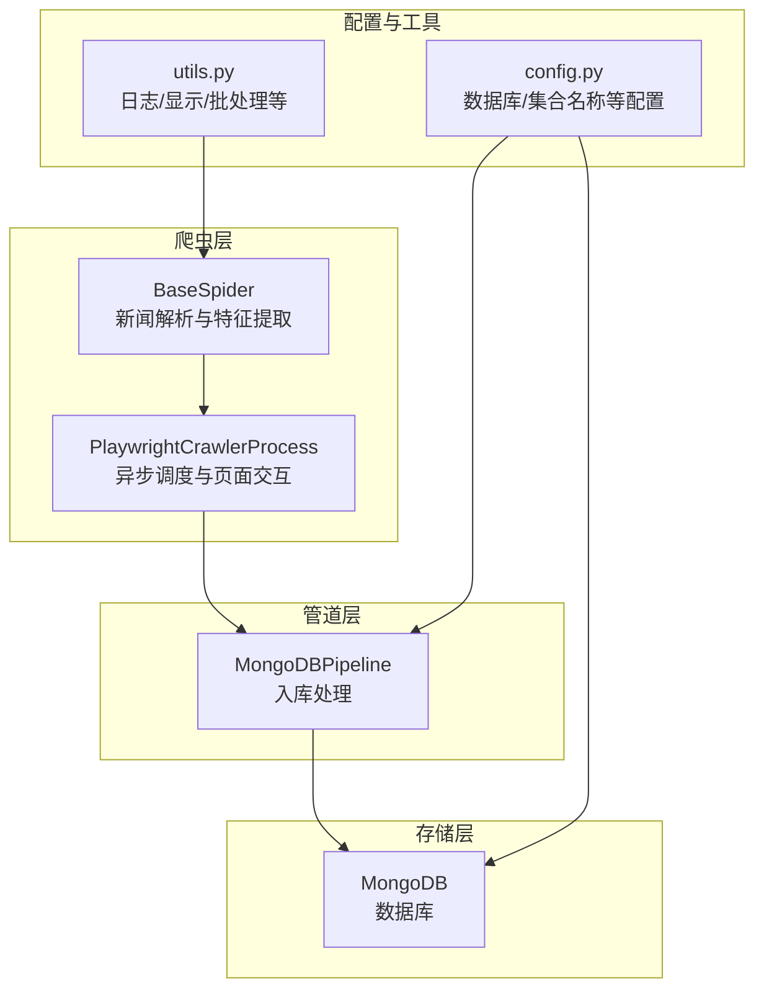
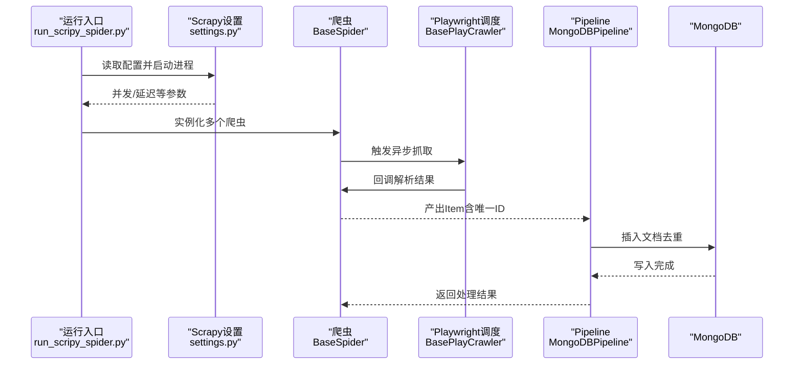
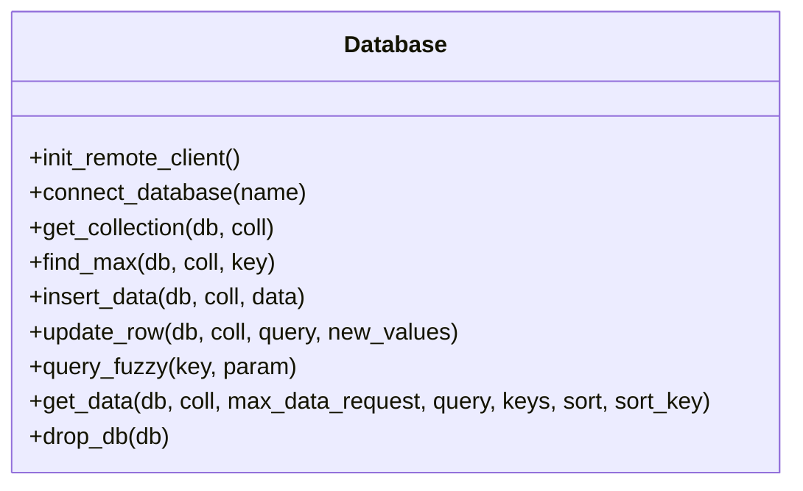
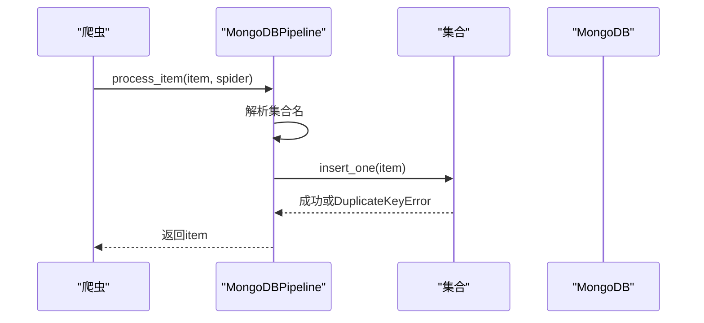
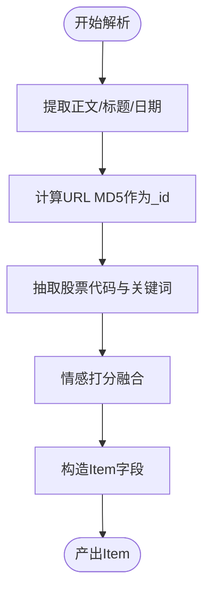
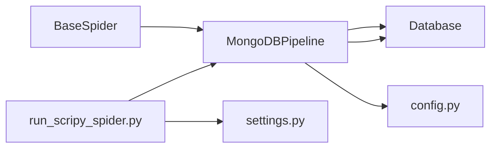

# 存储性能优化

<cite>
**本文引用的文件**
- [database.py](file://src/Utils/database.py)
- [LocalDbTool.py](file://src/MongoDbComTools/LocalDbTool.py)
- [config.py](file://src/Utils/config.py)
- [pipelines.py](file://src/pipelines.py)
- [BaseSpider.py](file://src/MarketNewsSpiderWithScrapy/BaseSpider.py)
- [BasePlayCrawler.py](file://src/MarketNewsSpiderWithScrapy/BasePlayCrawler.py)
- [run_scripy_spider.py](file://src/run_scripy_spider.py)
- [settings.py](file://src/settings.py)
- [utils.py](file://src/Utils/utils.py)
</cite>

## 目录
1. [简介](#简介)
2. [项目结构](#项目结构)
3. [核心组件](#核心组件)
4. [架构总览](#架构总览)
5. [详细组件分析](#详细组件分析)
6. [依赖分析](#依赖分析)
7. [性能考虑](#性能考虑)
8. [故障排查指南](#故障排查指南)
9. [结论](#结论)
10. [附录](#附录)

## 简介
本技术文档面向构建高性能数据存储系统的开发者，围绕本仓库中与存储相关的关键模块，系统梳理MongoDB数据库的性能优化策略（集合设计、索引优化、分片策略、写入优化、查询优化）与Redis在本项目中的潜在应用方向，并结合项目实际的数据采集与入库流程，给出可落地的监控与容量规划建议。由于本项目未直接使用Redis，文档将重点落在MongoDB的优化实践上，并在Redis章节提供通用调优思路与本项目的适配建议。

## 项目结构
该项目采用Scrapy+Playwright异步爬虫框架进行新闻采集，数据通过Scrapy Pipeline写入MongoDB。核心存储相关模块包括：
- 数据库连接与封装：database.py
- 爬虫与Pipeline：pipelines.py、BaseSpider.py、BasePlayCrawler.py
- 配置与常量：config.py
- 运行入口与并发控制：run_scripy_spider.py、settings.py
- 工具函数：utils.py

图表来源
- [BaseSpider.py:13-149](file://src/MarketNewsSpiderWithScrapy/BaseSpider.py#L13-L149)
- [BasePlayCrawler.py:21-120](file://src/MarketNewsSpiderWithScrapy/BasePlayCrawler.py#L21-L120)
- [pipelines.py:8-56](file://src/pipelines.py#L8-L56)
- [config.py:39-49](file://src/Utils/config.py#L39-L49)
- [utils.py:18-28](file://src/Utils/utils.py#L18-L28)

章节来源
- [run_scripy_spider.py:117-145](file://src/run_scripy_spider.py#L117-L145)
- [settings.py:32-34](file://src/settings.py#L32-L34)

## 核心组件
- 数据库连接与封装：提供MongoDB客户端初始化、自动重连装饰器、集合操作、查询与导出等能力。
- 爬虫与Pipeline：定义新闻条目结构、生成唯一ID、通过Pipeline写入MongoDB。
- 配置中心：集中管理数据库IP、端口、各新闻库与集合名称等。
- 运行入口：统一调度多个新闻源爬虫，控制并发与延迟。

章节来源
- [database.py:36-176](file://src/Utils/database.py#L36-L176)
- [pipelines.py:8-56](file://src/pipelines.py#L8-L56)
- [config.py:39-49](file://src/Utils/config.py#L39-L49)
- [BaseSpider.py:100-146](file://src/MarketNewsSpiderWithScrapy/BaseSpider.py#L100-L146)

## 架构总览
从数据采集到持久化的整体流程如下：

图表来源
- [run_scripy_spider.py:117-145](file://src/run_scripy_spider.py#L117-L145)
- [settings.py:32-34](file://src/settings.py#L32-L34)
- [BaseSpider.py:100-146](file://src/MarketNewsSpiderWithScrapy/BaseSpider.py#L100-L146)
- [BasePlayCrawler.py:64-118](file://src/MarketNewsSpiderWithScrapy/BasePlayCrawler.py#L64-L118)
- [pipelines.py:25-56](file://src/pipelines.py#L25-L56)

## 详细组件分析

### 组件A：数据库连接与封装（Database）
- 自动重连机制：通过装饰器对MongoDB操作进行指数退避重试，提升网络抖动下的稳定性。
- 连接池配置：最大连接池大小、服务器选择超时等参数，影响并发写入与查询吞吐。
- 常用操作：获取集合、插入单条、更新、模糊查询、按键排序导出等。
- 注意事项：查询导出时将游标转换为DataFrame，需关注大数据量导出的内存占用与分页策略。

图表来源
- [database.py:36-176](file://src/Utils/database.py#L36-L176)

章节来源
- [database.py:15-34](file://src/Utils/database.py#L15-L34)
- [database.py:44-60](file://src/Utils/database.py#L44-L60)
- [database.py:78-88](file://src/Utils/database.py#L78-L88)
- [database.py:94-172](file://src/Utils/database.py#L94-L172)

### 组件B：MongoDBPipeline（Scrapy Pipeline）
- 功能职责：根据爬虫名称将Item写入对应数据库与集合；对重复键异常进行捕获与忽略，避免重复写入。
- 写入策略：使用单条插入，适合低并发场景；高并发写入建议改为批量插入以提升吞吐。
- 去重策略：基于Item的URL生成MD5作为文档ID，确保同一URL只写入一次。

图表来源
- [pipelines.py:25-56](file://src/pipelines.py#L25-L56)
- [BaseSpider.py:134-136](file://src/MarketNewsSpiderWithScrapy/BaseSpider.py#L134-L136)

章节来源
- [pipelines.py:8-56](file://src/pipelines.py#L8-L56)
- [BaseSpider.py:84-98](file://src/MarketNewsSpiderWithScrapy/BaseSpider.py#L84-L98)

### 组件C：爬虫与数据结构（BaseSpider）
- 数据结构：统一的Item字段包含URL、标题、日期、正文、相关股票代码、关键词频率、分类、情感标签与分数等。
- 唯一ID：使用URL的MD5作为文档ID，便于去重与幂等写入。
- 特征提取：集成信息抽取与情感打分，输出相关股票与关键词分布，便于后续分析。

图表来源
- [BaseSpider.py:100-146](file://src/MarketNewsSpiderWithScrapy/BaseSpider.py#L100-L146)

章节来源
- [BaseSpider.py:13-34](file://src/MarketNewsSpiderWithScrapy/BaseSpider.py#L13-L34)
- [BaseSpider.py:84-98](file://src/MarketNewsSpiderWithScrapy/BaseSpider.py#L84-L98)

### 组件D：运行入口与并发控制（run_scripy_spider.py、settings.py）
- 并发与延迟：通过Scrapy设置控制并发请求数、下载延迟与超时，平衡抓取速度与目标站点压力。
- 爬虫编排：按配置批量注册多个新闻源爬虫，统一启动执行。
- Pipeline绑定：将MongoDBPipeline绑定至Scrapy，确保数据写入。

章节来源
- [run_scripy_spider.py:117-145](file://src/run_scripy_spider.py#L117-L145)
- [settings.py:18-34](file://src/settings.py#L18-L34)

## 依赖分析
- 爬虫与Pipeline：爬虫产出Item，Pipeline负责入库；两者通过Scrapy框架解耦。
- Pipeline与数据库：Pipeline依赖Database封装的连接与集合操作。
- 配置与运行：config.py提供数据库与集合名称，settings.py控制并发与延迟，run_scripy_spider.py负责调度。

图表来源
- [BaseSpider.py:100-146](file://src/MarketNewsSpiderWithScrapy/BaseSpider.py#L100-L146)
- [pipelines.py:8-22](file://src/pipelines.py#L8-L22)
- [config.py:39-49](file://src/Utils/config.py#L39-L49)
- [run_scripy_spider.py:117-145](file://src/run_scripy_spider.py#L117-L145)
- [settings.py:32-34](file://src/settings.py#L32-L34)

章节来源
- [pipelines.py:8-22](file://src/pipelines.py#L8-L22)
- [config.py:39-49](file://src/Utils/config.py#L39-L49)

## 性能考虑

### MongoDB集合设计与索引优化
- 文档结构设计
  - 使用统一的字段命名与类型，便于建立复合索引与查询优化。
  - 将高频查询字段（如日期、URL、股票代码）纳入索引，减少扫描范围。
- 索引策略
  - 唯一键：以URL的MD5作为_id，天然具备唯一性与快速定位能力。
  - 查询键：对Date、RelatedStockCodes等字段建立单键或复合索引，加速过滤与排序。
  - 聚合键：若存在按日期/来源统计的需求，可考虑建立复合索引以支持多维过滤。
- 分片策略
  - 若数据量持续增长，建议按Date或Source进行分片，使热点数据均匀分布，避免分片热点。
  - 分片键选择应与查询模式一致，避免跨分片全表扫描。

### 写入性能优化
- 批量插入
  - 当前Pipeline使用单条插入，建议在高并发场景下改为批量插入，减少网络往返与锁竞争。
  - 批量大小建议根据文档平均大小与MongoDB写入缓冲区进行权衡。
- 事务与副本集
  - 对于强一致性的写入需求，可在应用层使用事务包裹相关写入，确保原子性。
  - 副本集配置可提升可用性与读扩展，但需注意写入确认级别与延迟。
- 自动重连与退避
  - 已有装饰器实现指数退避重试，建议结合连接池大小与超时参数进行调优，避免瞬时抖动导致大量重试。

### 查询性能优化
- 查询计划分析
  - 使用数据库的explain输出分析查询计划，优先保证索引命中与覆盖索引。
- 索引使用策略
  - 针对常见过滤条件（如日期范围、来源、股票代码）建立复合索引，避免回表。
- 聚合管道优化
  - 在聚合阶段尽量前置过滤与投影，减少中间文档数量。
  - 对排序与分组操作，确保排序键与分组键与索引一致，避免临时文件与内存排序。

### Redis调优（概念性指导）
- 缓存策略
  - 对热点查询结果进行短期缓存，降低数据库压力；结合LRU淘汰策略，避免内存膨胀。
- 过期时间设置
  - 不同业务的缓存时效不同，建议按访问频率与数据新鲜度设定TTL，定期评估命中率。
- 内存碎片整理
  - 定期执行内存碎片整理与键空间扫描，保持内存利用率稳定。
- 本项目适配建议
  - 本项目未直接使用Redis，若引入缓存层，建议在Pipeline或查询层增加Redis缓存，注意与MongoDB的一致性与失效策略。

### 数据压缩与归档
- 热数据冷数据分离
  - 按时间维度将近期数据（热）与历史数据（冷）分层存储，热数据使用SSD，冷数据迁移至成本更低的存储。
- 存储空间优化
  - 对长文本字段（如正文）可考虑压缩存储或外部化存储，减少文档体积。
  - 定期清理无效数据与重复数据，保持集合健康。

### 监控指标与容量规划
- 监控指标
  - 连接池使用率、写入延迟、查询延迟、索引命中率、集合大小与文档数量、分片负载均衡度。
- 容量规划
  - 基于日均新增文档量与文档平均大小估算存储需求，预留增长空间。
  - 评估查询峰值与写入峰值，结合连接池与副本集规模进行容量与性能双保障。

## 故障排查指南
- 连接问题
  - 自动重连装饰器已内置指数退避，若仍频繁断开，检查网络与服务器选择超时参数。
- 写入冲突
  - DuplicateKeyError表示重复写入，当前Pipeline会忽略；若需幂等更新，可在Pipeline中增加upsert逻辑。
- 查询性能下降
  - 检查是否有全表扫描，确认相关字段是否建立索引；必要时调整复合索引顺序与覆盖索引。
- 内存与导出
  - 导出为DataFrame时注意大数据量内存占用，建议分页导出或限制返回字段。

章节来源
- [database.py:15-34](file://src/Utils/database.py#L15-L34)
- [pipelines.py:48-56](file://src/pipelines.py#L48-L56)
- [database.py:94-172](file://src/Utils/database.py#L94-L172)

## 结论
本项目在MongoDB写入与查询方面具备良好的基础：统一的Item结构、幂等写入策略与自动重连机制。为进一步提升性能，建议在高并发场景下采用批量写入、合理设计索引与分片策略、优化查询计划与聚合管道，并结合监控指标进行容量规划。对于Redis的引入，可作为热点数据缓存层，但需谨慎处理一致性与失效策略。

## 附录
- 项目配置要点
  - 数据库与集合名称集中在配置文件中，便于统一管理与切换环境。
- 工具函数
  - 日志配置与显示设置有助于调试与监控；批处理工具可用于批量读取与处理。

章节来源
- [config.py:39-49](file://src/Utils/config.py#L39-L49)
- [utils.py:18-28](file://src/Utils/utils.py#L18-L28)
- [utils.py:240-245](file://src/Utils/utils.py#L240-L245)