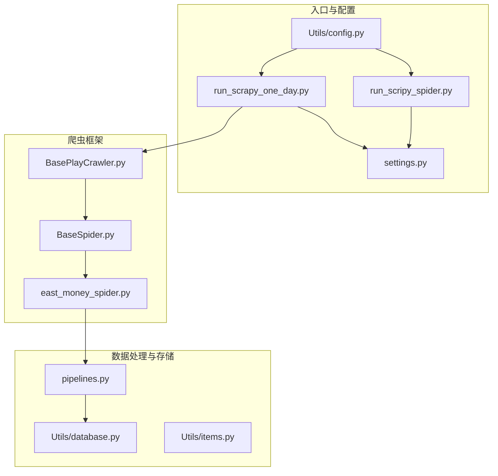
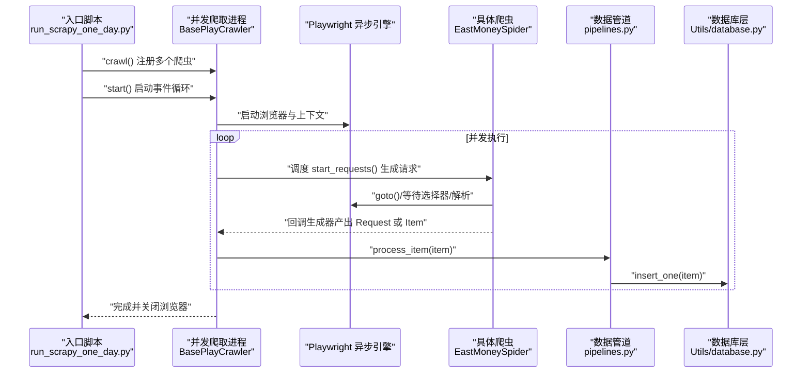
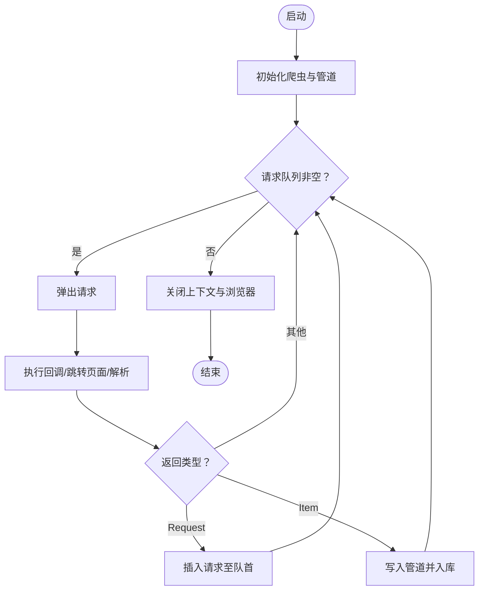
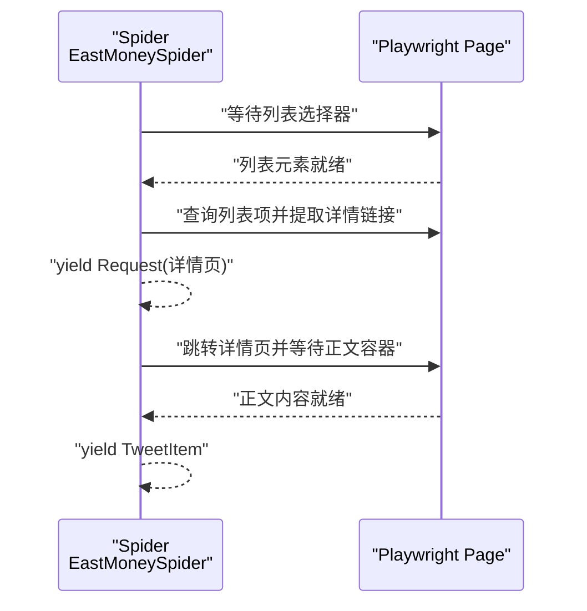
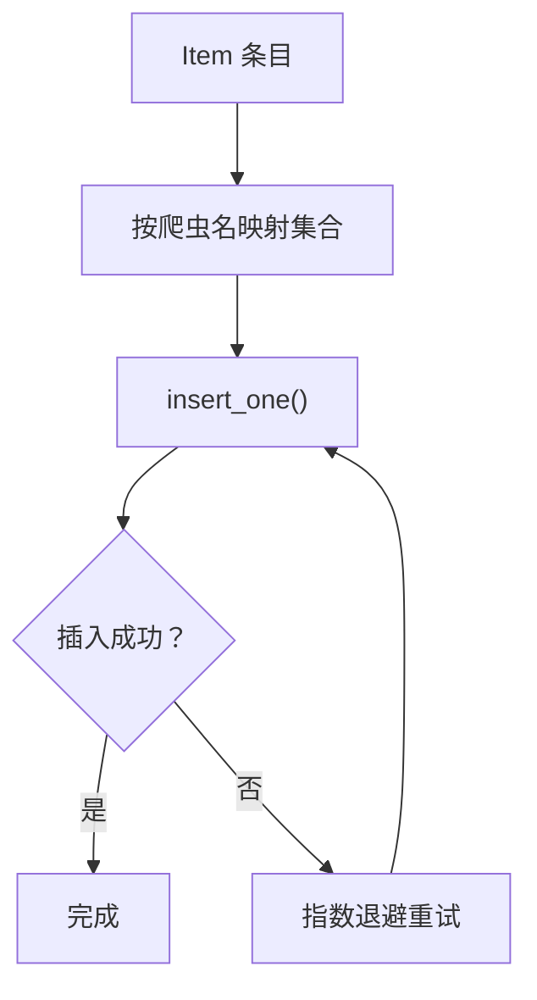
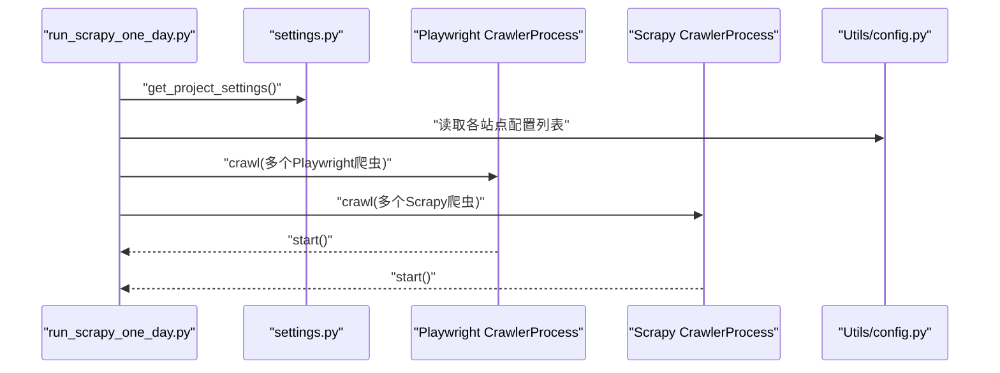
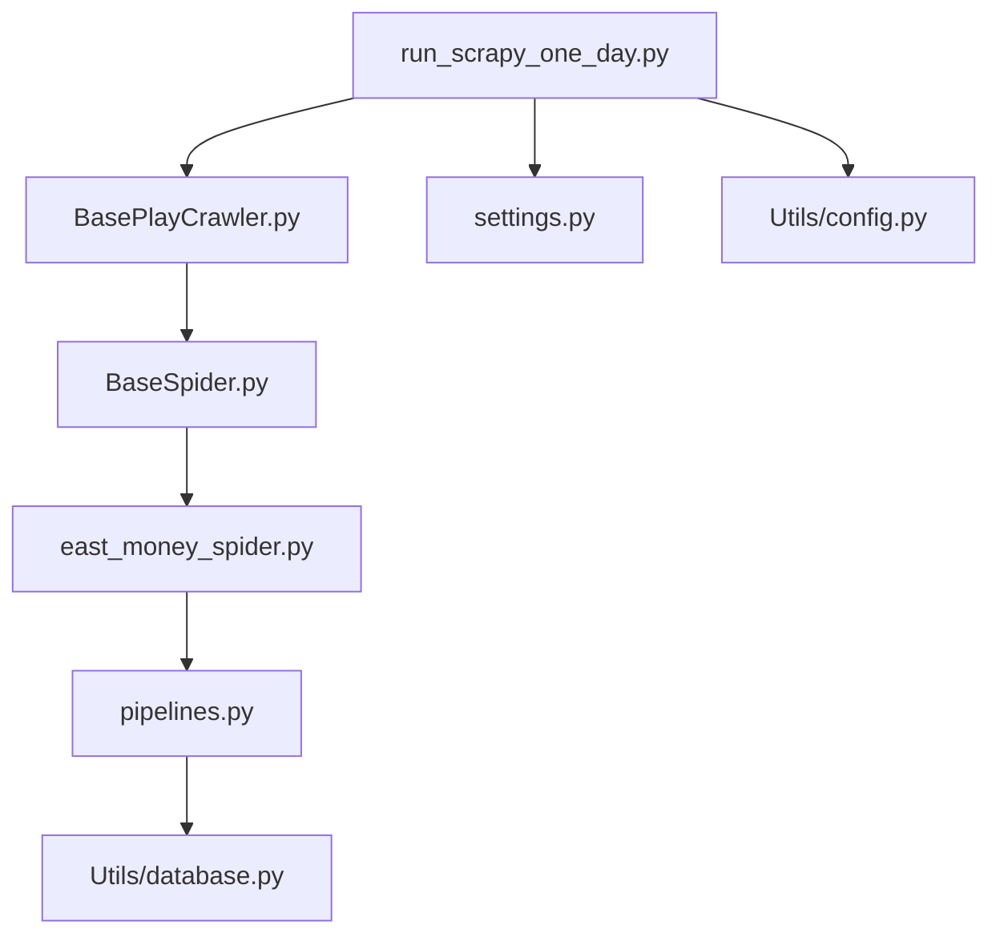

# 并发与异步编程

<cite>
**本文引用的文件**
- [README.md](file://README.md)
- [src/run_scrapy_one_day.py](file://src/run_scrapy_one_day.py)
- [src/run_scripy_spider.py](file://src/run_scripy_spider.py)
- [src/settings.py](file://src/settings.py)
- [src/pipelines.py](file://src/pipelines.py)
- [src/Utils/database.py](file://src/Utils/database.py)
- [src/Utils/utils.py](file://src/Utils/utils.py)
- [src/Utils/config.py](file://src/Utils/config.py)
- [src/Utils/items.py](file://src/Utils/items.py)
- [src/MarketNewsSpiderWithScrapy/BasePlayCrawler.py](file://src/MarketNewsSpiderWithScrapy/BasePlayCrawler.py)
- [src/MarketNewsSpiderWithScrapy/BaseSpider.py](file://src/MarketNewsSpiderWithScrapy/BaseSpider.py)
- [src/MarketNewsSpiderWithScrapy/east_money_spider.py](file://src/MarketNewsSpiderWithScrapy/east_money_spider.py)
</cite>

## 目录
1. [引言](#引言)
2. [项目结构](#项目结构)
3. [核心组件](#核心组件)
4. [架构总览](#架构总览)
5. [详细组件分析](#详细组件分析)
6. [依赖分析](#依赖分析)
7. [性能考量](#性能考量)
8. [故障排查指南](#故障排查指南)
9. [结论](#结论)
10. [附录](#附录)

## 引言
本技术文档面向高并发量化数据处理系统的开发者，系统性梳理并发与异步编程的关键技术，并结合仓库中基于 Scrapy 的新闻爬取子系统，深入讲解异步爬取机制、事件循环与异步 I/O 的应用、数据库与管道的并发写入策略、以及多线程/多进程在 GIL 限制下的优化路径。文档同时提供最佳实践、性能测试与调试方法，帮助读者构建稳定高效的高并发数据采集与处理流水线。

## 项目结构
该项目围绕“新闻爬取—文本分析—数据库入库—报表生成”的主线展开，其中爬虫部分采用 Scrapy 与 Playwright 异步结合的方式，配合自定义的并发爬取进程与数据库连接池策略，实现高吞吐的数据采集。

图示来源
- [src/run_scrapy_one_day.py:32-80](file://src/run_scrapy_one_day.py#L32-L80)
- [src/run_scripy_spider.py:117-142](file://src/run_scripy_spider.py#L117-L142)
- [src/settings.py:18-34](file://src/settings.py#L18-L34)
- [src/Utils/config.py:439-450](file://src/Utils/config.py#L439-L450)
- [src/MarketNewsSpiderWithScrapy/BasePlayCrawler.py:21-62](file://src/MarketNewsSpiderWithScrapy/BasePlayCrawler.py#L21-L62)
- [src/MarketNewsSpiderWithScrapy/BaseSpider.py:13-34](file://src/MarketNewsSpiderWithScrapy/BaseSpider.py#L13-L34)
- [src/MarketNewsSpiderWithScrapy/east_money_spider.py:5-19](file://src/MarketNewsSpiderWithScrapy/east_money_spider.py#L5-L19)
- [src/pipelines.py:8-46](file://src/pipelines.py#L8-L46)
- [src/Utils/database.py:36-60](file://src/Utils/database.py#L36-L60)
- [src/Utils/items.py:5-18](file://src/Utils/items.py#L5-L18)

章节来源
- [README.md:1-33](file://README.md#L1-L33)
- [src/run_scrapy_one_day.py:32-80](file://src/run_scrapy_one_day.py#L32-L80)
- [src/run_scripy_spider.py:117-142](file://src/run_scripy_spider.py#L117-L142)
- [src/settings.py:18-34](file://src/settings.py#L18-L34)
- [src/Utils/config.py:439-450](file://src/Utils/config.py#L439-L450)

## 核心组件
- 并发爬取进程（Playwright + asyncio）：通过统一的并发调度器启动多个爬虫任务，共享浏览器实例但使用独立上下文，实现高并发与资源隔离。
- 自定义 CrawlerProcess：封装 asyncio 事件循环与任务聚合，支持阻塞式启动与异常处理。
- 爬虫基类与具体爬虫：继承 Scrapy Spider，扩展异步解析与回调生成器，统一产出结构化条目。
- 数据管道与数据库层：统一的 MongoDB 插入逻辑，带自动重连与指数退避策略，提升稳定性。
- 配置中心：集中管理各站点爬取参数、数据库与缓存地址、并发与延迟等关键参数。

章节来源
- [src/MarketNewsSpiderWithScrapy/BasePlayCrawler.py:21-120](file://src/MarketNewsSpiderWithScrapy/BasePlayCrawler.py#L21-L120)
- [src/MarketNewsSpiderWithScrapy/BaseSpider.py:13-149](file://src/MarketNewsSpiderWithScrapy/BaseSpider.py#L13-L149)
- [src/MarketNewsSpiderWithScrapy/east_money_spider.py:5-78](file://src/MarketNewsSpiderWithScrapy/east_money_spider.py#L5-L78)
- [src/pipelines.py:8-56](file://src/pipelines.py#L8-L56)
- [src/Utils/database.py:36-176](file://src/Utils/database.py#L36-L176)
- [src/Utils/config.py:13-455](file://src/Utils/config.py#L13-L455)

## 架构总览
下图展示从入口脚本到数据入库的整体流程，强调异步事件循环、并发调度、回调链路与数据库写入的协作关系。

图示来源
- [src/run_scrapy_one_day.py:47-79](file://src/run_scrapy_one_day.py#L47-L79)
- [src/MarketNewsSpiderWithScrapy/BasePlayCrawler.py:34-62](file://src/MarketNewsSpiderWithScrapy/BasePlayCrawler.py#L34-L62)
- [src/MarketNewsSpiderWithScrapy/east_money_spider.py:21-77](file://src/MarketNewsSpiderWithScrapy/east_money_spider.py#L21-L77)
- [src/pipelines.py:25-46](file://src/pipelines.py#L25-L46)
- [src/Utils/database.py:94-104](file://src/Utils/database.py#L94-L104)

## 详细组件分析

### 组件A：并发爬取进程与事件循环
- 设计要点
  - 使用 asyncio 事件循环统一调度多个爬虫任务，避免阻塞。
  - 共享浏览器实例，但为每个爬虫创建独立上下文，降低 Cookie 干扰与内存占用。
  - 通过 gather 并发执行所有任务，提升吞吐。
- 关键流程
  - 初始化：注册爬虫、构造管道。
  - 启动：进入事件循环，启动浏览器与上下文。
  - 调度：按请求队列顺序执行，支持回调生成器追加新请求或产出条目。
  - 收尾：关闭上下文与浏览器，输出抓取统计。

图示来源
- [src/MarketNewsSpiderWithScrapy/BasePlayCrawler.py:34-118](file://src/MarketNewsSpiderWithScrapy/BasePlayCrawler.py#L34-L118)

章节来源
- [src/MarketNewsSpiderWithScrapy/BasePlayCrawler.py:21-120](file://src/MarketNewsSpiderWithScrapy/BasePlayCrawler.py#L21-L120)

### 组件B：爬虫基类与具体爬虫
- 设计要点
  - 统一字段与解析模板，便于扩展不同站点。
  - 异步解析列表页与详情页，支持等待选择器与超时控制。
  - 通过回调生成器产出后续请求或最终条目。
- 关键流程
  - start_requests 生成初始 URL 列表。
  - parse 解析列表项并生成详情页请求。
  - parse_detail 抽取正文并转换为条目。
  - from_playInfos_to_item 统一构造 TweetItem 字段。

图示来源
- [src/MarketNewsSpiderWithScrapy/east_money_spider.py:21-77](file://src/MarketNewsSpiderWithScrapy/east_money_spider.py#L21-L77)
- [src/MarketNewsSpiderWithScrapy/BaseSpider.py:100-146](file://src/MarketNewsSpiderWithScrapy/BaseSpider.py#L100-L146)
- [src/Utils/items.py:5-18](file://src/Utils/items.py#L5-L18)

章节来源
- [src/MarketNewsSpiderWithScrapy/BaseSpider.py:13-149](file://src/MarketNewsSpiderWithScrapy/BaseSpider.py#L13-L149)
- [src/MarketNewsSpiderWithScrapy/east_money_spider.py:5-78](file://src/MarketNewsSpiderWithScrapy/east_money_spider.py#L5-L78)
- [src/Utils/items.py:5-18](file://src/Utils/items.py#L5-L18)

### 组件C：数据管道与数据库层
- 设计要点
  - 管道按爬虫名称映射到对应数据库集合，统一插入逻辑。
  - 数据库层提供自动重连装饰器与指数退避，降低网络抖动影响。
  - 连接池最大大小与超时配置，平衡并发与稳定性。
- 关键流程
  - process_item 根据爬虫名选择集合，调用 insert_one。
  - 数据库层 get_data 支持模糊查询、排序与分页参数。
  - graceful_auto_reconnect 包裹可能断开的操作，自动重试。

图示来源
- [src/pipelines.py:25-56](file://src/pipelines.py#L25-L56)
- [src/Utils/database.py:94-104](file://src/Utils/database.py#L94-L104)
- [src/Utils/database.py:15-34](file://src/Utils/database.py#L15-L34)

章节来源
- [src/pipelines.py:8-56](file://src/pipelines.py#L8-L56)
- [src/Utils/database.py:36-176](file://src/Utils/database.py#L36-L176)

### 组件D：入口与配置
- 设计要点
  - run_scrapy_one_day.py 同时运行 Playwright 与 Scrapy 两类爬虫，分别注入不同配置列表。
  - settings.py 控制并发请求数、下载超时、延迟与中间件。
  - Utils/config.py 集中管理各站点爬取参数与数据库/缓存地址。
- 关键流程
  - 设置环境变量与项目设置。
  - 构造 Playwright 与 Scrapy 的 CrawlerProcess。
  - 遍历配置列表，逐个 crawl() 注册爬虫。
  - start() 启动事件循环并等待完成。

图示来源
- [src/run_scrapy_one_day.py:32-80](file://src/run_scrapy_one_day.py#L32-L80)
- [src/settings.py:18-34](file://src/settings.py#L18-L34)
- [src/Utils/config.py:439-450](file://src/Utils/config.py#L439-L450)

章节来源
- [src/run_scrapy_one_day.py:32-80](file://src/run_scrapy_one_day.py#L32-L80)
- [src/run_scripy_spider.py:117-142](file://src/run_scripy_spider.py#L117-L142)
- [src/settings.py:18-34](file://src/settings.py#L18-L34)
- [src/Utils/config.py:13-455](file://src/Utils/config.py#L13-L455)

## 依赖分析
- 组件耦合
  - BasePlayCrawler 与具体爬虫解耦，通过回调生成器传递控制流。
  - 管道与数据库层通过统一接口对接，便于替换存储后端。
- 外部依赖
  - Scrapy 提供爬虫框架与中间件生态。
  - Playwright 提供异步渲染与交互能力。
  - PyMongo 提供 MongoDB 客户端与连接池。
- 潜在风险
  - 网络抖动与目标站点限流可能导致断连与超时。
  - 大批量并发写入对数据库造成压力，需合理配置连接池与写入策略。

图示来源
- [src/MarketNewsSpiderWithScrapy/BasePlayCrawler.py:21-62](file://src/MarketNewsSpiderWithScrapy/BasePlayCrawler.py#L21-L62)
- [src/MarketNewsSpiderWithScrapy/BaseSpider.py:13-34](file://src/MarketNewsSpiderWithScrapy/BaseSpider.py#L13-L34)
- [src/MarketNewsSpiderWithScrapy/east_money_spider.py:5-19](file://src/MarketNewsSpiderWithScrapy/east_money_spider.py#L5-L19)
- [src/pipelines.py:8-22](file://src/pipelines.py#L8-L22)
- [src/Utils/database.py:36-60](file://src/Utils/database.py#L36-L60)
- [src/run_scrapy_one_day.py:32-80](file://src/run_scrapy_one_day.py#L32-L80)
- [src/settings.py:18-34](file://src/settings.py#L18-L34)
- [src/Utils/config.py:439-450](file://src/Utils/config.py#L439-L450)

章节来源
- [src/MarketNewsSpiderWithScrapy/BasePlayCrawler.py:21-120](file://src/MarketNewsSpiderWithScrapy/BasePlayCrawler.py#L21-L120)
- [src/MarketNewsSpiderWithScrapy/BaseSpider.py:13-149](file://src/MarketNewsSpiderWithScrapy/BaseSpider.py#L13-L149)
- [src/MarketNewsSpiderWithScrapy/east_money_spider.py:5-78](file://src/MarketNewsSpiderWithScrapy/east_money_spider.py#L5-L78)
- [src/pipelines.py:8-56](file://src/pipelines.py#L8-L56)
- [src/Utils/database.py:36-176](file://src/Utils/database.py#L36-L176)
- [src/run_scrapy_one_day.py:32-80](file://src/run_scrapy_one_day.py#L32-L80)
- [src/settings.py:18-34](file://src/settings.py#L18-L34)
- [src/Utils/config.py:13-455](file://src/Utils/config.py#L13-L455)

## 性能考量
- 并发参数
  - settings.py 中的并发请求数与下载延迟直接影响吞吐与稳定性，建议结合目标站点限流策略动态调整。
- 连接池与写入
  - 数据库连接池最大大小与超时配置需与并发请求数匹配，避免连接耗尽。
  - 使用指数退避与去重策略减少重复写入与冲突。
- I/O 优化
  - 异步渲染与等待选择器可减少无效轮询；对静态内容优先使用 Scrapy 的同步解析。
  - 管道层尽量批量写入（若业务允许），降低网络往返次数。
- GIL 与多进程
  - Python 的 GIL 限制 CPU 密集型任务的并行，建议将计算密集型（如文本特征提取）放入独立进程池，避免阻塞事件循环。
- 负载均衡
  - 将不同站点的爬虫拆分为独立进程或容器，避免相互影响；对热点站点增加随机延迟与代理池。

## 故障排查指南
- 断连与重试
  - 使用数据库层的自动重连装饰器，记录警告日志并按指数退避重试，防止瞬时网络问题导致任务失败。
- 超时与等待
  - 列表页与详情页等待选择器时设置合理超时；对不可用节点进行降级处理并记录错误。
- 日志与监控
  - 在入口脚本与爬虫中输出关键信息（如当前日期、任务进度、错误堆栈），便于定位问题。
- 数据一致性
  - 管道层捕获重复键错误并忽略，确保任务连续性；必要时引入幂等写入策略。

章节来源
- [src/Utils/database.py:15-34](file://src/Utils/database.py#L15-L34)
- [src/MarketNewsSpiderWithScrapy/BasePlayCrawler.py:113-118](file://src/MarketNewsSpiderWithScrapy/BasePlayCrawler.py#L113-L118)
- [src/pipelines.py:48-56](file://src/pipelines.py#L48-L56)
- [src/Utils/utils.py:18-22](file://src/Utils/utils.py#L18-L22)

## 结论
本项目在实际场景中展示了如何将 Scrapy 的结构化爬虫能力与 Playwright 的异步渲染能力相结合，通过统一的并发调度器与事件循环实现高吞吐、低耦合的数据采集流水线。配合数据库层的自动重连与连接池策略，系统在面对网络抖动与高并发写入时具备较好的稳定性。建议在后续迭代中进一步引入进程池与代理池，完善监控与告警体系，持续优化并发参数与写入策略，以支撑更大规模的量化数据处理需求。

## 附录
- 最佳实践清单
  - 异步回调中避免长时间阻塞操作，保持事件循环响应性。
  - 对外部依赖（数据库、HTTP）统一抽象与超时控制。
  - 使用装饰器或中间件统一处理异常与重试。
  - 对 CPU 密集型任务使用多进程池，避免 GIL 影响。
  - 通过配置中心集中管理参数，便于灰度与快速回滚。
- 性能测试与调试
  - 压测：逐步提升并发请求数与爬虫数量，观察延迟、错误率与数据库连接池使用率。
  - 调试：启用详细日志，记录关键时间点与异常堆栈；对热点站点增加代理与随机延迟。
  - 观察：关注数据库写入延迟、连接池饱和与目标站点限流信号。