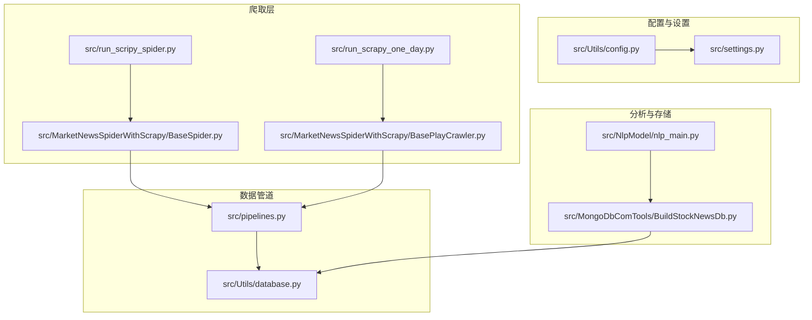
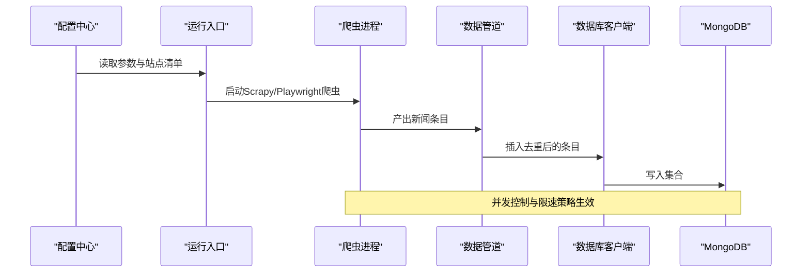
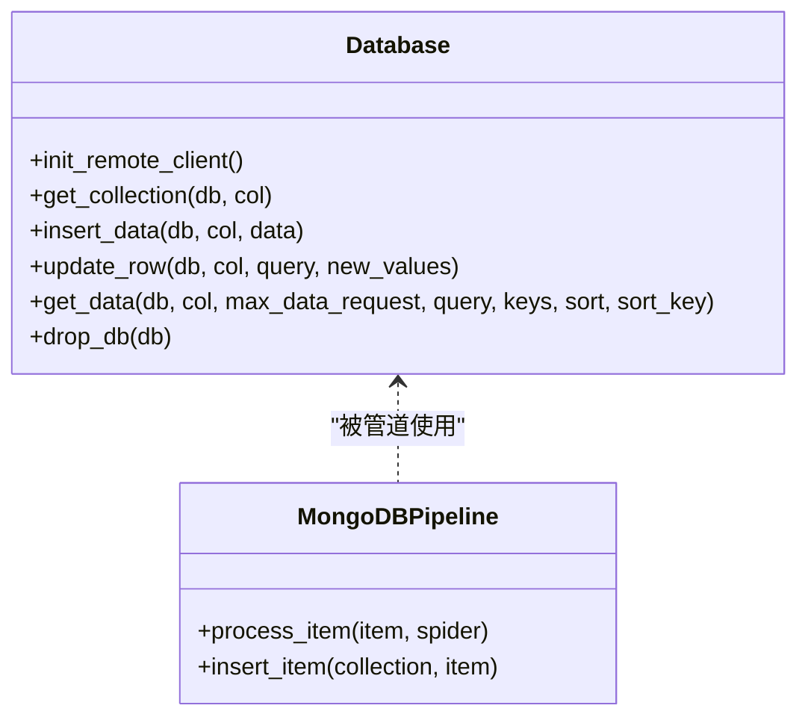
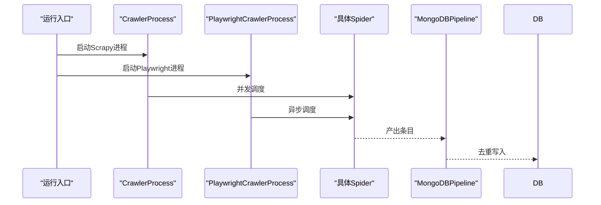
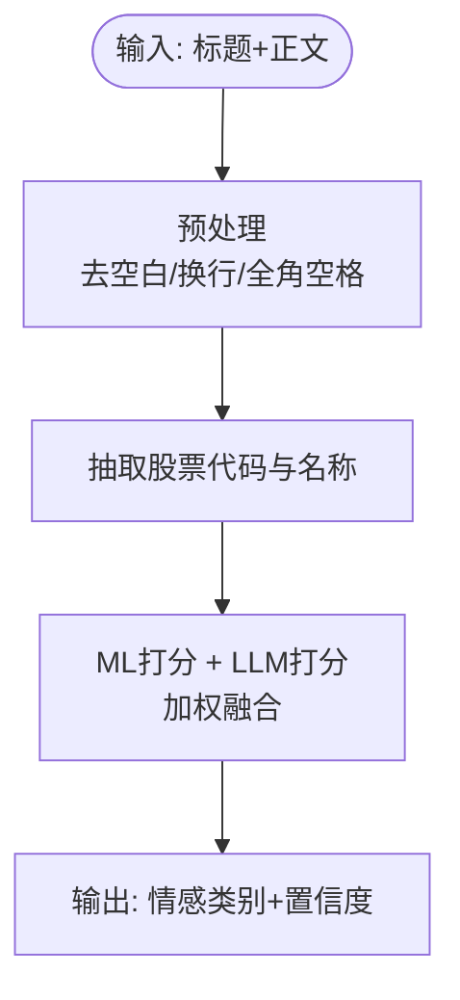
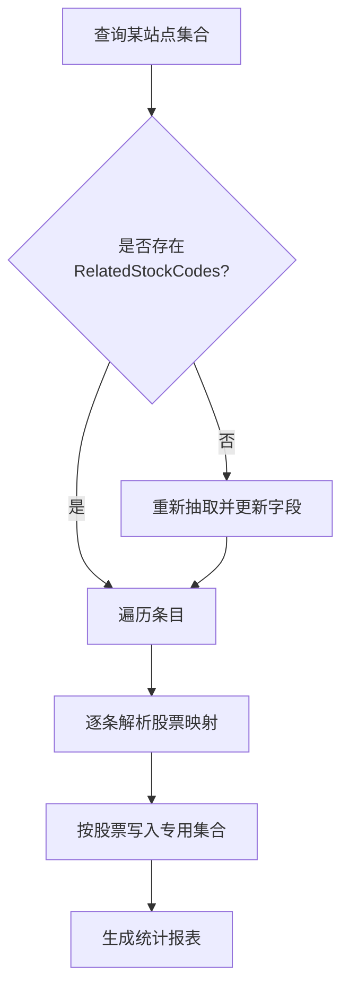
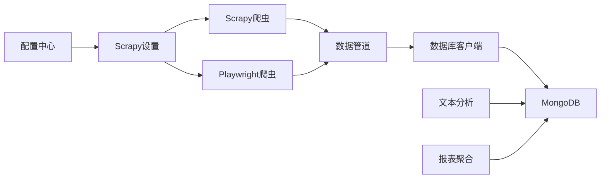

# 性能优化

<cite>
**本文引用的文件**   
- [README.md](file://README.md)
- [ProblemSolve.md](file://ProblemSolve.md)
- [src/Utils/config.py](file://src/Utils/config.py)
- [src/Utils/database.py](file://src/Utils/database.py)
- [src/pipelines.py](file://src/pipelines.py)
- [src/settings.py](file://src/settings.py)
- [src/run_scripy_spider.py](file://src/run_scripy_spider.py)
- [src/run_scrapy_one_day.py](file://src/run_scrapy_one_day.py)
- [src/MarketNewsSpiderWithScrapy/BaseSpider.py](file://src/MarketNewsSpiderWithScrapy/BaseSpider.py)
- [src/Utils/utils.py](file://src/Utils/utils.py)
- [src/NlpModel/nlp_main.py](file://src/NlpModel/nlp_main.py)
- [src/MongoDbComTools/BuildStockNewsDb.py](file://src/MongoDbComTools/BuildStockNewsDb.py)
- [src/MarketNewsSpiderWithScrapy/BasePlayCrawler.py](file://src/MarketNewsSpiderWithScrapy/BasePlayCrawler.py)
</cite>

## 目录
1. [简介](#简介)
2. [项目结构](#项目结构)
3. [核心组件](#核心组件)
4. [架构总览](#架构总览)
5. [详细组件分析](#详细组件分析)
6. [依赖分析](#依赖分析)
7. [性能考量](#性能考量)
8. [故障排查指南](#故障排查指南)
9. [结论](#结论)
10. [附录](#附录)

## 简介
本文件面向“公司新闻爬取与文本分析（含情感）”项目，系统化梳理并输出一套面向生产环境的性能优化方案。内容覆盖爬取并发与异步、存储写入与索引、文本分析与模型推理、内存与资源管理、缓存与预处理、监控与测试方法，以及常见性能问题的诊断与解决路径。目标是帮助开发者构建高性能的量化分析流水线，显著提升吞吐与稳定性，改善用户体验。

## 项目结构
该项目采用模块化分层组织，围绕“爬取—清洗—分析—存储—报表”的主干流程展开，主要模块如下：
- 配置与设置：集中管理数据库、Redis、爬虫并发、下载延迟等参数
- 爬虫层：Scrapy 与 Playwright 异步双引擎，覆盖多家新闻源
- 数据管道：统一写入 MongoDB，避免重复入库
- 文本分析：基于传统 ML 与 LLM 的情感打分融合
- 报表与聚合：按股票维度汇总新闻，生成统计报表

图表来源
- [src/Utils/config.py:1-455](file://src/Utils/config.py#L1-L455)
- [src/settings.py:1-49](file://src/settings.py#L1-L49)
- [src/run_scripy_spider.py:1-145](file://src/run_scripy_spider.py#L1-L145)
- [src/run_scrapy_one_day.py:1-195](file://src/run_scrapy_one_day.py#L1-L195)
- [src/MarketNewsSpiderWithScrapy/BaseSpider.py:1-149](file://src/MarketNewsSpiderWithScrapy/BaseSpider.py#L1-L149)
- [src/MarketNewsSpiderWithScrapy/BasePlayCrawler.py:1-120](file://src/MarketNewsSpiderWithScrapy/BasePlayCrawler.py#L1-L120)
- [src/pipelines.py:1-56](file://src/pipelines.py#L1-L56)
- [src/Utils/database.py:1-176](file://src/Utils/database.py#L1-L176)
- [src/NlpModel/nlp_main.py:1-70](file://src/NlpModel/nlp_main.py#L1-L70)
- [src/MongoDbComTools/BuildStockNewsDb.py:1-241](file://src/MongoDbComTools/BuildStockNewsDb.py#L1-L241)

章节来源
- [README.md:1-33](file://README.md#L1-L33)
- [src/Utils/config.py:1-455](file://src/Utils/config.py#L1-L455)
- [src/settings.py:1-49](file://src/settings.py#L1-L49)

## 核心组件
- 配置中心：集中定义数据库、Redis、爬虫参数、模型路径、各站点爬虫清单等
- 数据库客户端：封装连接池、自动重连、批量读取与写入
- 爬虫进程：Scrapy 并发请求与 Playwright 异步抓取双通道
- 数据管道：统一入库，去重与路由
- 文本分析：ML 分类器与 LLM 融合打分
- 报表聚合：按股票维度归集新闻，生成统计与导出

章节来源
- [src/Utils/config.py:1-455](file://src/Utils/config.py#L1-L455)
- [src/Utils/database.py:36-176](file://src/Utils/database.py#L36-L176)
- [src/pipelines.py:8-56](file://src/pipelines.py#L8-L56)
- [src/MarketNewsSpiderWithScrapy/BaseSpider.py:13-149](file://src/MarketNewsSpiderWithScrapy/BaseSpider.py#L13-L149)
- [src/MongoDbComTools/BuildStockNewsDb.py:19-241](file://src/MongoDbComTools/BuildStockNewsDb.py#L19-L241)

## 架构总览
整体数据流从“配置与设置”出发，启动“爬取层”，产出“新闻条目”，进入“数据管道”，最终写入“存储层”。分析阶段由“文本分析”对条目进行情感打分，再由“报表聚合”生成统计结果。

图表来源
- [src/Utils/config.py:439-455](file://src/Utils/config.py#L439-L455)
- [src/run_scripy_spider.py:117-145](file://src/run_scripy_spider.py#L117-L145)
- [src/run_scrapy_one_day.py:32-80](file://src/run_scrapy_one_day.py#L32-L80)
- [src/pipelines.py:25-56](file://src/pipelines.py#L25-L56)
- [src/Utils/database.py:78-88](file://src/Utils/database.py#L78-L88)

## 详细组件分析

### 组件A：数据库客户端与存储写入
- 连接池与自动重连：通过装饰器实现指数退避重试，降低网络抖动影响
- 写入策略：单条插入，结合唯一键去重，避免重复数据
- 读取策略：支持条件查询、键子集投影、最大记录数限制、排序，兼顾灵活性与性能

图表来源
- [src/Utils/database.py:36-176](file://src/Utils/database.py#L36-L176)
- [src/pipelines.py:8-56](file://src/pipelines.py#L8-L56)

章节来源
- [src/Utils/database.py:15-34](file://src/Utils/database.py#L15-L34)
- [src/Utils/database.py:78-88](file://src/Utils/database.py#L78-L88)
- [src/pipelines.py:25-56](file://src/pipelines.py#L25-L56)

### 组件B：爬取并发与异步处理
- Scrapy 并发：通过设置并发请求数、下载超时与延迟，平衡吞吐与反爬策略
- Playwright 异步：基于 asyncio 并行启动浏览器实例，抓取动态内容，提高吞吐
- 双通道策略：不同站点根据页面复杂度与反爬强度选择合适引擎

图表来源
- [src/run_scripy_spider.py:117-145](file://src/run_scripy_spider.py#L117-L145)
- [src/run_scrapy_one_day.py:46-80](file://src/run_scrapy_one_day.py#L46-L80)
- [src/MarketNewsSpiderWithScrapy/BasePlayCrawler.py:38-60](file://src/MarketNewsSpiderWithScrapy/BasePlayCrawler.py#L38-L60)

章节来源
- [src/settings.py:18-34](file://src/settings.py#L18-L34)
- [src/run_scripy_spider.py:117-145](file://src/run_scripy_spider.py#L117-L145)
- [src/run_scrapy_one_day.py:43-80](file://src/run_scrapy_one_day.py#L43-L80)
- [src/MarketNewsSpiderWithScrapy/BasePlayCrawler.py:38-120](file://src/MarketNewsSpiderWithScrapy/BasePlayCrawler.py#L38-L120)

### 组件C：文本分析与情感打分
- 多模型融合：传统 ML 与 LLM 结果加权平均，提升鲁棒性
- 预处理与特征：标题+正文拼接，分词与向量化，TF-IDF 变换
- 实时打分：对每条新闻进行情感类别与置信度评分

图表来源
- [src/MarketNewsSpiderWithScrapy/BaseSpider.py:41-98](file://src/MarketNewsSpiderWithScrapy/BaseSpider.py#L41-L98)
- [src/MarketNewsSpiderWithScrapy/BaseSpider.py:100-146](file://src/MarketNewsSpiderWithScrapy/BaseSpider.py#L100-L146)
- [src/NlpModel/nlp_main.py:27-69](file://src/NlpModel/nlp_main.py#L27-L69)

章节来源
- [src/MarketNewsSpiderWithScrapy/BaseSpider.py:41-146](file://src/MarketNewsSpiderWithScrapy/BaseSpider.py#L41-L146)
- [src/NlpModel/nlp_main.py:17-69](file://src/NlpModel/nlp_main.py#L17-L69)

### 组件D：报表聚合与导出
- 聚合逻辑：遍历各站点集合，解析 RelatedStockCodes，按股票归档至专用集合
- 报表生成：统计利好/利空数量，导出 Excel，支持按股票展开明细

图表来源
- [src/MongoDbComTools/BuildStockNewsDb.py:157-241](file://src/MongoDbComTools/BuildStockNewsDb.py#L157-L241)
- [src/run_scrapy_one_day.py:81-195](file://src/run_scrapy_one_day.py#L81-L195)

章节来源
- [src/MongoDbComTools/BuildStockNewsDb.py:19-241](file://src/MongoDbComTools/BuildStockNewsDb.py#L19-L241)
- [src/run_scrapy_one_day.py:81-195](file://src/run_scrapy_one_day.py#L81-L195)

## 依赖分析
- 组件耦合
  - 爬取层依赖配置中心与设置模块，确保参数一致性
  - 数据管道依赖数据库客户端，保证写入稳定
  - 分析模块依赖配置中的模型路径与设备类型
- 外部依赖
  - MongoDB：连接池大小、超时、索引策略直接影响吞吐
  - Playwright：浏览器实例并发数与页面等待策略
  - LLM 推理：显存占用与批处理策略

图表来源
- [src/Utils/config.py:439-455](file://src/Utils/config.py#L439-L455)
- [src/settings.py:18-34](file://src/settings.py#L18-L34)
- [src/pipelines.py:8-56](file://src/pipelines.py#L8-L56)
- [src/Utils/database.py:36-176](file://src/Utils/database.py#L36-L176)
- [src/MongoDbComTools/BuildStockNewsDb.py:19-241](file://src/MongoDbComTools/BuildStockNewsDb.py#L19-L241)

章节来源
- [src/Utils/config.py:1-455](file://src/Utils/config.py#L1-L455)
- [src/settings.py:1-49](file://src/settings.py#L1-L49)
- [src/Utils/database.py:1-176](file://src/Utils/database.py#L1-L176)

## 性能考量

### 爬取性能优化
- 并发与限速
  - 合理设置并发请求数与下载延迟，避免触发反爬或被限速
  - 对不同站点差异化配置，动态内容优先使用异步引擎
- 超时与重试
  - 下载超时与重试间隔需平衡成功率与资源占用
- 请求去重
  - 使用 URL 的哈希作为唯一键，减少重复抓取

章节来源
- [src/settings.py:18-34](file://src/settings.py#L18-L34)
- [src/MarketNewsSpiderWithScrapy/BaseSpider.py:86-88](file://src/MarketNewsSpiderWithScrapy/BaseSpider.py#L86-L88)

### 存储系统性能调优与索引优化
- 连接池与超时
  - 合理设置最大连接数与超时时间，避免连接耗尽
- 写入策略
  - 使用单条插入并结合唯一键去重，减少重复写入
- 查询与投影
  - 仅投影所需字段，限制返回数量，必要时启用排序
- 索引建议
  - 为高频查询字段建立索引（如时间、URL 哈希、股票代码映射字段）

章节来源
- [src/Utils/database.py:50-60](file://src/Utils/database.py#L50-L60)
- [src/Utils/database.py:78-88](file://src/Utils/database.py#L78-L88)
- [src/Utils/database.py:104-172](file://src/Utils/database.py#L104-L172)

### 文本分析与模型推理优化
- 特征工程
  - 采用 TF-IDF 或更高效的稀疏表示，降低内存与计算开销
- 模型融合
  - ML 与 LLM 结果加权融合，既保证速度又提升准确性
- 批处理
  - 对待预测样本进行批处理，充分利用 GPU/CPU 并行能力

章节来源
- [src/NlpModel/nlp_main.py:36-69](file://src/NlpModel/nlp_main.py#L36-L69)
- [src/MarketNewsSpiderWithScrapy/BaseSpider.py:66-83](file://src/MarketNewsSpiderWithScrapy/BaseSpider.py#L66-L83)

### 内存管理与资源使用
- 数据结构
  - 使用生成器与迭代器处理大数据集合，避免一次性加载
- 去重与缓存
  - 利用 URL 哈希与 Redis 缓存热点数据，减少重复计算
- 日志与资源释放
  - 控制日志级别，及时关闭文件句柄与数据库连接

章节来源
- [src/Utils/utils.py:25-28](file://src/Utils/utils.py#L25-L28)
- [src/Utils/utils.py:240-245](file://src/Utils/utils.py#L240-L245)
- [src/MarketNewsSpiderWithScrapy/BaseSpider.py:86-88](file://src/MarketNewsSpiderWithScrapy/BaseSpider.py#L86-L88)

### 并发处理与异步编程
- 异步抓取
  - 使用 asyncio 并行启动多个浏览器实例，提高动态页面抓取吞吐
- 并行调度
  - Scrapy 的并发请求与延迟配置需与目标站点规则匹配

章节来源
- [src/MarketNewsSpiderWithScrapy/BasePlayCrawler.py:38-60](file://src/MarketNewsSpiderWithScrapy/BasePlayCrawler.py#L38-L60)
- [src/settings.py:18-34](file://src/settings.py#L18-L34)

### 缓存策略与数据预处理
- 缓存热点
  - 对常用股票映射与停用词表进行缓存，减少 IO
- 预处理管线
  - 统一去除多余空白字符，规范化文本，提升后续分析效率

章节来源
- [src/Utils/utils.py:171-186](file://src/Utils/utils.py#L171-L186)
- [src/MarketNewsSpiderWithScrapy/BaseSpider.py:41-58](file://src/MarketNewsSpiderWithScrapy/BaseSpider.py#L41-L58)

### 监控指标与性能测试
- 指标建议
  - 爬取成功率、平均响应时间、并发队列长度、数据库写入速率、模型推理耗时
- 测试方法
  - 压力测试与回归测试，验证不同站点与页面复杂度下的稳定性

章节来源
- [src/run_scrapy_one_day.py:81-195](file://src/run_scrapy_one_day.py#L81-L195)

## 故障排查指南

### 常见问题与定位
- Too many open files
  - 提升系统文件句柄上限，检查 MongoDB/Scrapy 进程资源占用
- PyMongo AutoReconnect
  - 指数退避重试机制生效，适当增大连接池与超时
- 爬虫被限速/封禁
  - 降低并发、增加随机延迟、更换 UA/代理

章节来源
- [ProblemSolve.md:37-41](file://ProblemSolve.md#L37-L41)
- [src/Utils/database.py:15-34](file://src/Utils/database.py#L15-L34)
- [src/settings.py:18-34](file://src/settings.py#L18-L34)

### 诊断步骤
- 网络与系统
  - 检查 ulimit、防火墙与代理设置
- 数据库
  - 查看连接池使用率、慢查询日志、索引命中情况
- 爬虫
  - 关注失败重试次数、超时比例、异常日志
- 分析
  - 模型推理耗时分布、特征构造成本

章节来源
- [ProblemSolve.md:18-41](file://ProblemSolve.md#L18-L41)
- [src/Utils/database.py:15-34](file://src/Utils/database.py#L15-L34)
- [src/Utils/database.py:94-172](file://src/Utils/database.py#L94-L172)

## 结论
通过“并发与异步抓取 + 连接池与索引优化 + 特征与模型融合 + 缓存与预处理 + 监控与压测”的体系化优化，可在保证稳定性的同时显著提升整体吞吐与响应速度。建议在生产环境中持续观测关键指标，按站点特性动态调整并发与限速策略，并定期评估模型与索引效果，以获得最佳性价比。

## 附录

### 关键参数与路径参考
- 数据库与模型路径
  - 数据库主机与端口、Redis 地址与端口、模型路径与设备类型
- 爬虫站点清单
  - 各新闻源的数据库名、集合名、起始页与结束页

章节来源
- [src/Utils/config.py:13-54](file://src/Utils/config.py#L13-L54)
- [src/Utils/config.py:439-455](file://src/Utils/config.py#L439-L455)