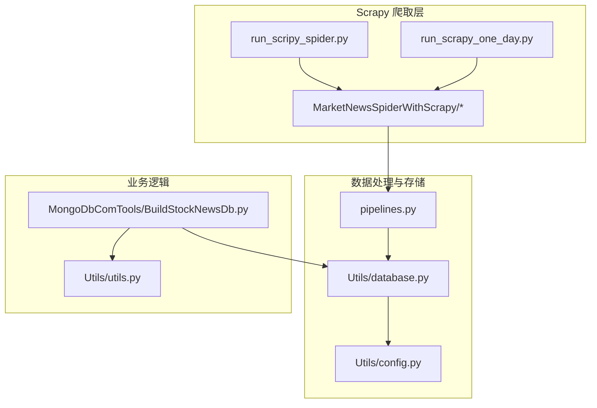
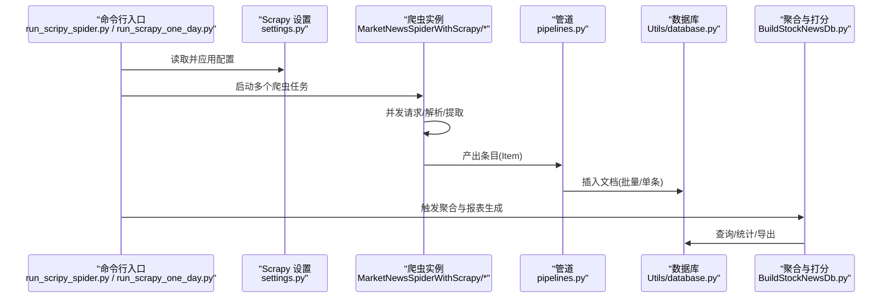
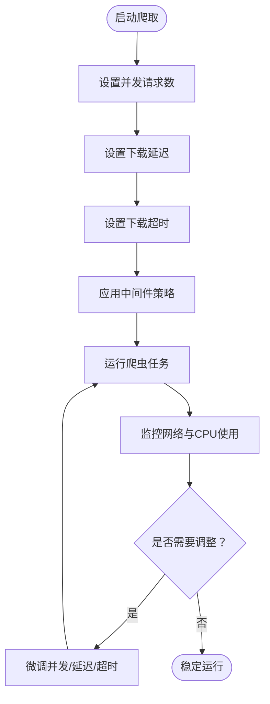
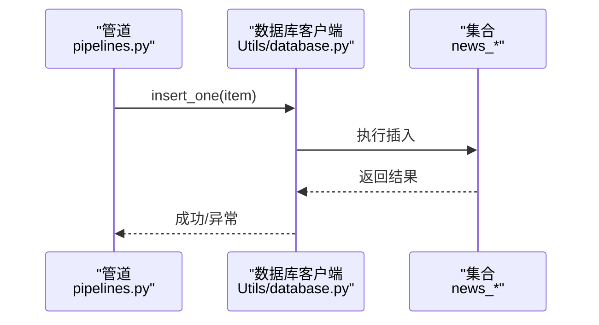
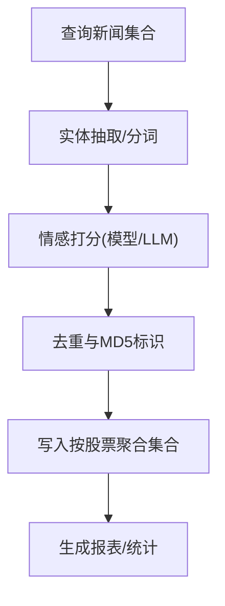
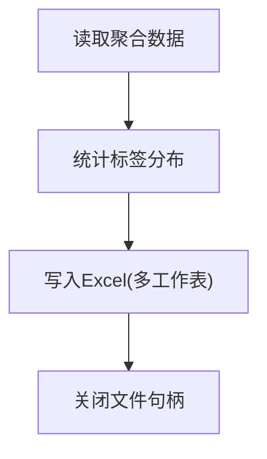
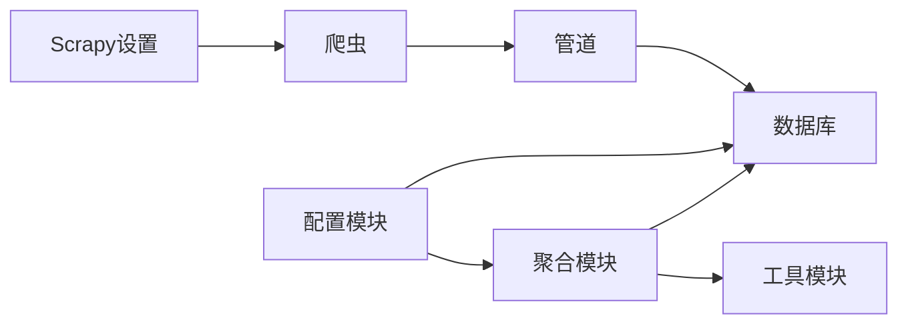

# 性能监控与测试

<cite>
**本文引用的文件**   
- [README.md](file://README.md)
- [ProblemSolve.md](file://ProblemSolve.md)
- [src/settings.py](file://src/settings.py)
- [src/Utils/config.py](file://src/Utils/config.py)
- [src/Utils/database.py](file://src/Utils/database.py)
- [src/Utils/utils.py](file://src/Utils/utils.py)
- [src/pipelines.py](file://src/pipelines.py)
- [src/run_scripy_spider.py](file://src/run_scripy_spider.py)
- [src/run_scrapy_one_day.py](file://src/run_scrapy_one_day.py)
- [src/MongoDbComTools/BuildStockNewsDb.py](file://src/MongoDbComTools/BuildStockNewsDb.py)
</cite>

## 目录
1. [简介](#简介)
2. [项目结构](#项目结构)
3. [核心组件](#核心组件)
4. [架构总览](#架构总览)
5. [详细组件分析](#详细组件分析)
6. [依赖分析](#依赖分析)
7. [性能考量](#性能考量)
8. [故障排查指南](#故障排查指南)
9. [结论](#结论)
10. [附录](#附录)

## 简介
本技术文档面向“量化新闻爬取与文本分析”项目，聚焦于性能监控与测试的实践方法，涵盖以下主题：
- 关键性能指标与采集：CPU、内存、网络延迟、磁盘 I/O 的观测与采集建议
- 性能基准测试：压力测试、负载测试、稳定性测试的策略与落地
- 代码性能分析工具：cProfile、memory_profiler、line_profiler 的应用建议
- 瓶颈识别与诊断：火焰图、调用栈追踪、内存快照分析
- 自动化性能测试：在持续集成中引入性能回归测试
- 性能优化评估与对比：建立可复现的评估流程与指标体系

本项目以 Scrapy 为核心抓取框架，结合 MongoDB 数据存储与自然语言处理模块，整体工作流包含“爬取 → 文本抽取与情感打分 → 结果聚合与报表生成”。性能优化应覆盖抓取并发、数据库写入、文本处理与报表导出等关键环节。

## 项目结构
项目采用模块化组织，主要目录与职责如下：
- src/Utils：通用配置、数据库连接、工具函数
- src/pipelines.py：Scrapy 管道，负责将条目写入 MongoDB
- src/MarketNewsSpiderWithScrapy：各站点爬虫实现
- src/MongoDbComTools：新闻聚合、情感打分与报表生成
- src/settings.py：Scrapy 全局配置（并发、下载延时、中间件、管道等）

**图示来源**
- [src/run_scripy_spider.py:117-145](file://src/run_scripy_spider.py#L117-L145)
- [src/run_scrapy_one_day.py:32-80](file://src/run_scrapy_one_day.py#L32-L80)
- [src/pipelines.py:8-56](file://src/pipelines.py#L8-L56)
- [src/Utils/database.py:36-61](file://src/Utils/database.py#L36-L61)
- [src/Utils/config.py:13-23](file://src/Utils/config.py#L13-L23)
- [src/MongoDbComTools/BuildStockNewsDb.py:19-53](file://src/MongoDbComTools/BuildStockNewsDb.py#L19-L53)

**章节来源**
- [README.md:1-33](file://README.md#L1-L33)
- [src/settings.py:1-49](file://src/settings.py#L1-L49)

## 核心组件
- Scrapy 设置与并发控制：通过全局设置控制并发请求数、下载超时与延迟，直接影响网络 I/O 与 CPU 使用率
- 数据库连接与重连：封装 MongoDB 客户端初始化、连接池大小与自动重连策略，影响磁盘 I/O 与内存占用
- 管道写入：统一将条目写入对应数据库集合，是 I/O 密集型关键路径
- 新闻聚合与情感打分：对每条新闻进行实体抽取、分词与情感打分，是 CPU 密集型路径
- 报表生成：批量读取、统计与导出 Excel，涉及大量内存与磁盘写入

**章节来源**
- [src/settings.py:18-34](file://src/settings.py#L18-L34)
- [src/Utils/database.py:36-61](file://src/Utils/database.py#L36-L61)
- [src/pipelines.py:8-56](file://src/pipelines.py#L8-L56)
- [src/MongoDbComTools/BuildStockNewsDb.py:19-53](file://src/MongoDbComTools/BuildStockNewsDb.py#L19-L53)
- [src/Utils/utils.py:1-251](file://src/Utils/utils.py#L1-L251)

## 架构总览
下图展示从启动到数据落库的整体流程，标注了性能关注点（并发、网络、磁盘、内存）：

**图示来源**
- [src/run_scripy_spider.py:117-145](file://src/run_scripy_spider.py#L117-L145)
- [src/run_scrapy_one_day.py:32-80](file://src/run_scrapy_one_day.py#L32-L80)
- [src/settings.py:18-34](file://src/settings.py#L18-L34)
- [src/pipelines.py:25-46](file://src/pipelines.py#L25-L46)
- [src/Utils/database.py:78-88](file://src/Utils/database.py#L78-L88)
- [src/MongoDbComTools/BuildStockNewsDb.py:157-240](file://src/MongoDbComTools/BuildStockNewsDb.py#L157-L240)

## 详细组件分析

### 组件A：Scrapy 并发与下载参数（网络延迟、CPU 使用率）
- 关键参数
  - 并发请求数：CONCURRENT_REQUESTS
  - 下载超时：DOWNLOAD_TIMEOUT
  - 下载延迟：DOWNLOAD_DELAY
  - 中间件：Cookies、HTTP 代理、重定向控制
- 性能影响
  - 提高并发可提升吞吐，但会增加 CPU 与网络带宽占用；过低则影响吞吐
  - 合理的 DOWNLOAD_DELAY 可避免目标站点限流或触发反爬机制
  - 适当调整超时可减少无效等待，降低资源占用

**图示来源**
- [src/settings.py:18-34](file://src/settings.py#L18-L34)

**章节来源**
- [src/settings.py:18-34](file://src/settings.py#L18-L34)

### 组件B：数据库连接与写入（磁盘 I/O、内存占用）
- 连接与池化
  - 最大连接池大小：maxPoolSize
  - 服务器选择超时：serverSelectionTimeoutMS
  - 自动重连：graceful_auto_reconnect 装饰器指数退避
- 写入路径
  - 管道统一插入：pipelines.py 使用 insert_one
  - 聚合写入：BuildStockNewsDb 对每只股票独立集合写入
- 性能影响
  - 连接池过大可能增加内存占用；过小导致频繁建连
  - 大量小事务写入会放大磁盘 I/O；可考虑批量写入策略

**图示来源**
- [src/pipelines.py:48-56](file://src/pipelines.py#L48-L56)
- [src/Utils/database.py:50-60](file://src/Utils/database.py#L50-L60)
- [src/Utils/database.py:78-88](file://src/Utils/database.py#L78-L88)

**章节来源**
- [src/Utils/database.py:36-61](file://src/Utils/database.py#L36-L61)
- [src/pipelines.py:8-56](file://src/pipelines.py#L8-L56)

### 组件C：新闻聚合与情感打分（CPU 使用率、内存占用）
- 功能链路
  - 从各站点集合读取新闻
  - 实体抽取与分词
  - 情感打分（传统分类或 LLM）
  - 写入“按股票聚合”的集合
- 性能关注点
  - 文本处理链路（抽取/分词/打分）为 CPU 密集型
  - 大批量读取与拼接会增加内存峰值
  - 写入前去重与 MD5 标识可降低重复写入

**图示来源**
- [src/MongoDbComTools/BuildStockNewsDb.py:180-240](file://src/MongoDbComTools/BuildStockNewsDb.py#L180-L240)
- [src/Utils/config.py:449-455](file://src/Utils/config.py#L449-L455)

**章节来源**
- [src/MongoDbComTools/BuildStockNewsDb.py:19-53](file://src/MongoDbComTools/BuildStockNewsDb.py#L19-L53)
- [src/MongoDbComTools/BuildStockNewsDb.py:157-240](file://src/MongoDbComTools/BuildStockNewsDb.py#L157-L240)
- [src/Utils/config.py:449-455](file://src/Utils/config.py#L449-L455)

### 组件D：报表生成（磁盘 I/O、内存占用）
- 功能链路
  - 读取聚合结果
  - 统计利好/利空数量
  - 导出 Excel（多工作表）
- 性能关注点
  - 大文件写入需注意磁盘 I/O
  - 内存中累积大量行数据可能导致峰值升高，建议分批写入

**图示来源**
- [src/run_scrapy_one_day.py:81-195](file://src/run_scrapy_one_day.py#L81-L195)

**章节来源**
- [src/run_scrapy_one_day.py:81-195](file://src/run_scrapy_one_day.py#L81-L195)

## 依赖分析
- 组件耦合
  - 爬虫与管道：通过 Scrapy Item 流程耦合，管道依赖数据库模块
  - 管道与数据库：管道直接调用数据库客户端接口
  - 聚合模块与数据库：聚合模块依赖数据库读取与写入
  - 工具模块：通用工具函数被多个模块复用
- 外部依赖
  - MongoDB：作为主存储，连接池与自动重连策略至关重要
  - Scrapy：并发与中间件配置决定网络 I/O 与稳定性
  - 第三方模型/LLM：情感打分依赖外部模型加载与推理

**图示来源**
- [src/run_scripy_spider.py:117-145](file://src/run_scripy_spider.py#L117-L145)
- [src/pipelines.py:8-56](file://src/pipelines.py#L8-L56)
- [src/Utils/database.py:36-61](file://src/Utils/database.py#L36-L61)
- [src/MongoDbComTools/BuildStockNewsDb.py:19-53](file://src/MongoDbComTools/BuildStockNewsDb.py#L19-L53)
- [src/Utils/config.py:13-23](file://src/Utils/config.py#L13-L23)
- [src/settings.py:18-34](file://src/settings.py#L18-L34)

**章节来源**
- [src/Utils/config.py:13-23](file://src/Utils/config.py#L13-L23)
- [src/Utils/database.py:36-61](file://src/Utils/database.py#L36-L61)
- [src/pipelines.py:8-56](file://src/pipelines.py#L8-L56)
- [src/MongoDbComTools/BuildStockNewsDb.py:19-53](file://src/MongoDbComTools/BuildStockNewsDb.py#L19-L53)
- [src/run_scripy_spider.py:117-145](file://src/run_scripy_spider.py#L117-L145)
- [src/run_scrapy_one_day.py:32-80](file://src/run_scrapy_one_day.py#L32-L80)

## 性能考量
- 指标采集建议
  - CPU 使用率：使用系统工具（如 top/htop、perf）或 Python 工具（psutil）在关键阶段采样
  - 内存占用：监控进程常驻集（RSS）与分配峰值，关注文本处理与大数据帧阶段
  - 网络延迟：记录请求往返时间（RTT）、失败率与重试次数
  - 磁盘 I/O：监控读写速率与队列深度，关注写入密集阶段
- 基准测试策略
  - 压力测试：逐步提高并发与请求速率，观察系统饱和点与异常行为
  - 负载测试：在稳定负载下长时间运行，评估稳定性与资源耗散
  - 稳定性测试：模拟网络抖动、数据库断连与慢查询，验证恢复能力
- 代码性能分析工具
  - cProfile：定位 CPU 热点函数，识别长耗时路径
  - memory_profiler：跟踪内存分配，识别泄漏与峰值
  - line_profiler：逐行分析热点行，指导局部优化
- 瓶颈识别与诊断
  - 火焰图：结合 perf 或 py-spy 生成，直观显示调用栈占比
  - 调用栈追踪：在异常与超时场景打印完整堆栈
  - 内存快照：使用 objgraph 或 tracemalloc 分析对象生命周期
- 自动化性能测试
  - CI 集成：在流水线中加入性能回归检查，设定阈值与基线
  - 场景化测试：针对爬取、聚合、报表导出等关键路径编写自动化脚本
- 优化评估与对比
  - 建立可复现的测试环境与数据集
  - 以端到端时延、吞吐量、资源占用为指标，对比优化前后差异
  - 记录基线与变更清单，便于追溯

## 故障排查指南
- MongoDB 连接与性能
  - 连接池过小导致阻塞：增大 maxPoolSize 并观察资源占用
  - 自动重连与退避：确认 graceful_auto_reconnect 生效，避免瞬断引发雪崩
  - 大量小事务：考虑批量写入策略，减少网络往返
- 爬虫并发与限流
  - 并发过高触发反爬：降低 CONCURRENT_REQUESTS 或增加随机延迟
  - 超时与失败：提高 DOWNLOAD_TIMEOUT 并检查代理中间件
- 文本处理与内存
  - 大数据帧与拼接：分批处理，及时释放中间变量
  - 模型加载：预热模型，避免首次推理开销
- 报表导出
  - 大文件写入：分批写入与关闭句柄，避免句柄泄露

**章节来源**
- [src/Utils/database.py:15-33](file://src/Utils/database.py#L15-L33)
- [src/Utils/database.py:50-60](file://src/Utils/database.py#L50-L60)
- [src/Utils/database.py:78-88](file://src/Utils/database.py#L78-L88)
- [src/settings.py:18-34](file://src/settings.py#L18-L34)
- [src/MongoDbComTools/BuildStockNewsDb.py:180-240](file://src/MongoDbComTools/BuildStockNewsDb.py#L180-L240)
- [src/run_scrapy_one_day.py:172-195](file://src/run_scrapy_one_day.py#L172-L195)

## 结论
本项目在数据采集、处理与报表层面存在明显的性能热点：网络 I/O、数据库写入与文本处理。建议从以下方面入手：
- 以 Scrapy 设置为切入点，平衡并发与稳定性
- 强化数据库连接池与批量写入策略，降低磁盘 I/O
- 在文本处理与报表导出阶段引入内存与 CPU 分析工具，定位热点
- 在 CI 中引入自动化性能回归测试，确保长期稳定性
- 建立指标体系与基线，持续评估优化效果

## 附录
- 相关文件索引
  - [README.md:1-33](file://README.md#L1-L33)
  - [ProblemSolve.md:1-68](file://ProblemSolve.md#L1-L68)
  - [src/settings.py:1-49](file://src/settings.py#L1-L49)
  - [src/Utils/config.py:13-23](file://src/Utils/config.py#L13-L23)
  - [src/Utils/database.py:36-61](file://src/Utils/database.py#L36-L61)
  - [src/Utils/utils.py:1-251](file://src/Utils/utils.py#L1-L251)
  - [src/pipelines.py:8-56](file://src/pipelines.py#L8-L56)
  - [src/run_scripy_spider.py:117-145](file://src/run_scripy_spider.py#L117-L145)
  - [src/run_scrapy_one_day.py:32-80](file://src/run_scrapy_one_day.py#L32-L80)
  - [src/MongoDbComTools/BuildStockNewsDb.py:19-53](file://src/MongoDbComTools/BuildStockNewsDb.py#L19-L53)