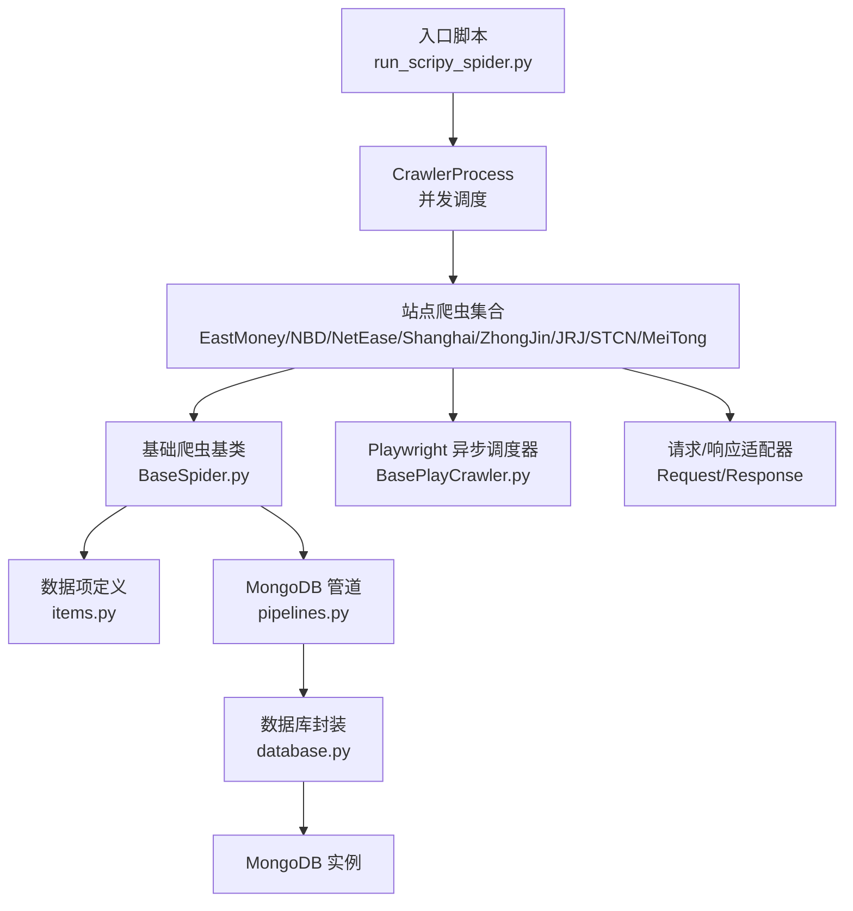
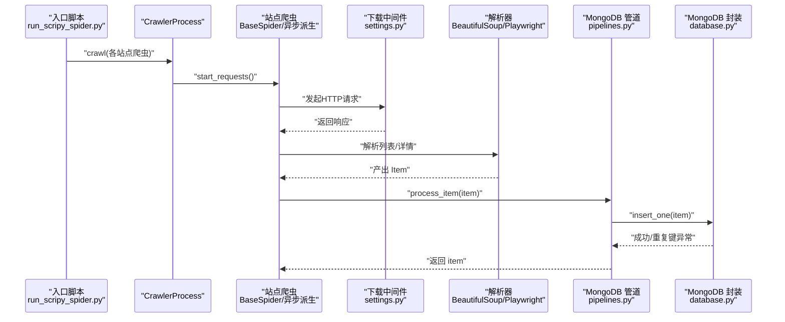
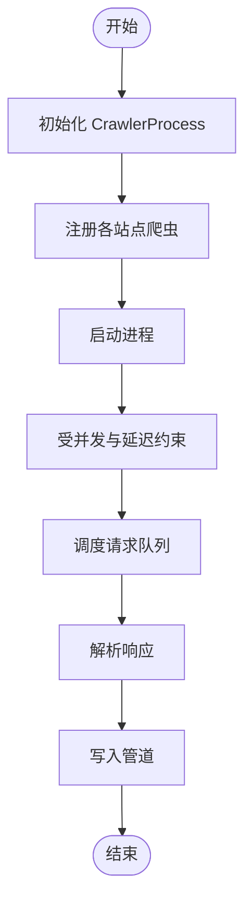
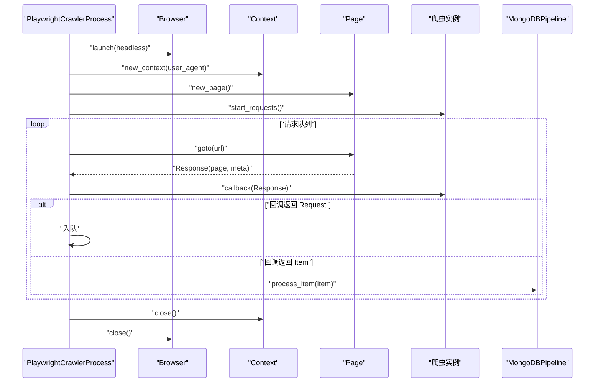
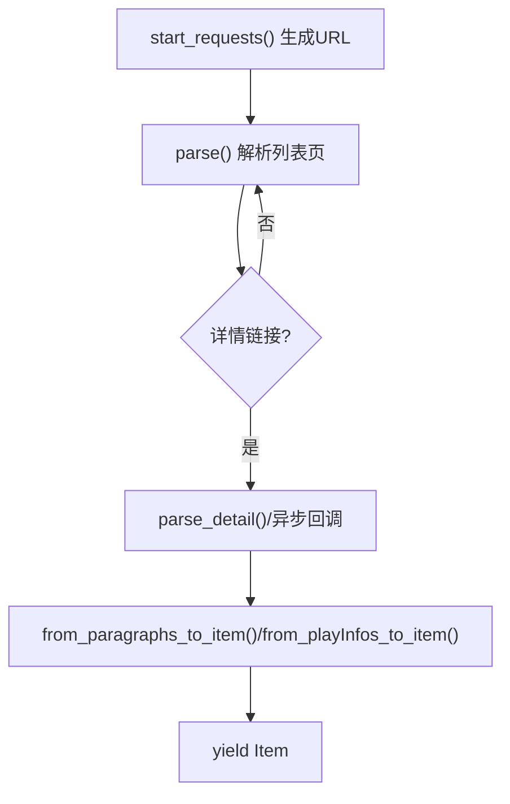
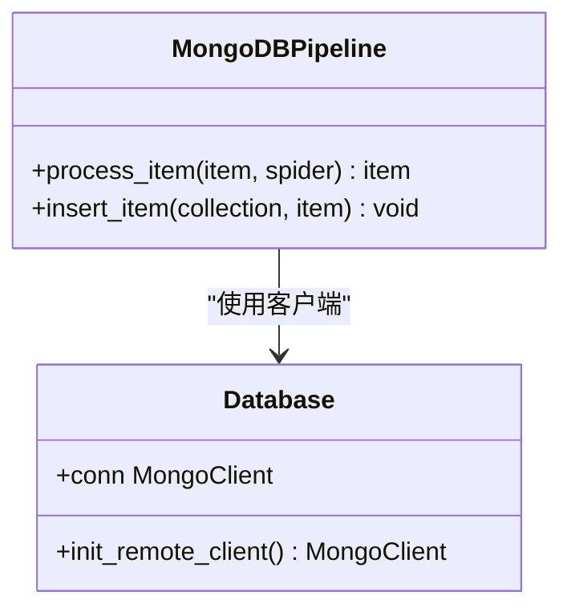
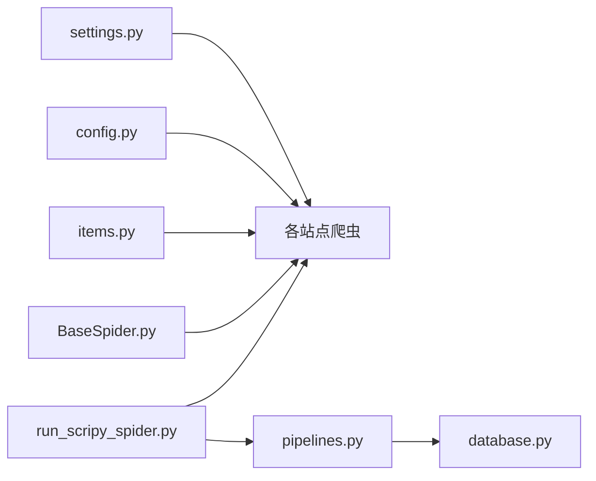

# 爬取性能优化

<cite>
**本文引用的文件**   
- [settings.py](file://src/settings.py)
- [run_scripy_spider.py](file://src/run_scripy_spider.py)
- [pipelines.py](file://src/pipelines.py)
- [BaseSpider.py](file://src/MarketNewsSpiderWithScrapy/BaseSpider.py)
- [BasePlayCrawler.py](file://src/MarketNewsSpiderWithScrapy/BasePlayCrawler.py)
- [east_money_spider.py](file://src/MarketNewsSpiderWithScrapy/east_money_spider.py)
- [nbd_spider.py](file://src/MarketNewsSpiderWithScrapy/nbd_spider.py)
- [net_ease_spider.py](file://src/MarketNewsSpiderWithScrapy/net_ease_spider.py)
- [shanghai_stock_spider.py](file://src/MarketNewsSpiderWithScrapy/shanghai_stock_spider.py)
- [config.py](file://src/Utils/config.py)
- [items.py](file://src/Utils/items.py)
- [database.py](file://src/Utils/database.py)
</cite>

## 目录
1. [引言](#引言)
2. [项目结构](#项目结构)
3. [核心组件](#核心组件)
4. [架构总览](#架构总览)
5. [详细组件分析](#详细组件分析)
6. [依赖分析](#依赖分析)
7. [性能考量与优化建议](#性能考量与优化建议)
8. [故障排查指南](#故障排查指南)
9. [结论](#结论)
10. [附录](#附录)

## 引言
本技术文档围绕基于 Scrapy 的新闻爬取系统，系统性梳理并提出性能优化策略，覆盖并发控制、请求频率限制、代理池管理、异步爬取机制、调度器调优、连接池与超时设置、错误重试、多站点负载均衡与资源分配、以及性能监控与瓶颈分析方法。目标是帮助开发者构建高效、稳定、可扩展的新闻爬取系统。

## 项目结构
该项目采用“模块化 + 多站点爬虫”的组织方式，核心目录与职责如下：
- src/settings.py：Scrapy 全局配置，含并发、下载超时、延迟、UA 列表、中间件与管道等
- src/run_scripy_spider.py：入口脚本，统一调度多个站点爬虫
- src/pipelines.py：MongoDB 管道，负责去重与入库
- src/MarketNewsSpiderWithScrapy/*：各站点爬虫实现，包含同步与异步两种模式
- src/Utils/config.py：站点配置、数据库与模型路径等常量
- src/Utils/items.py：数据项定义
- src/Utils/database.py：MongoDB 客户端封装与自动重连

**图示来源**
- [run_scripy_spider.py:117-142](file://src/run_scripy_spider.py#L117-L142)
- [BasePlayCrawler.py:21-62](file://src/MarketNewsSpiderWithScrapy/BasePlayCrawler.py#L21-L62)
- [pipelines.py:8-46](file://src/pipelines.py#L8-L46)
- [database.py:36-60](file://src/Utils/database.py#L36-L60)

**章节来源**
- [settings.py:1-49](file://src/settings.py#L1-L49)
- [run_scripy_spider.py:1-145](file://src/run_scripy_spider.py#L1-L145)
- [pipelines.py:1-56](file://src/pipelines.py#L1-L56)
- [BaseSpider.py:1-149](file://src/MarketNewsSpiderWithScrapy/BaseSpider.py#L1-L149)
- [BasePlayCrawler.py:1-120](file://src/MarketNewsSpiderWithScrapy/BasePlayCrawler.py#L1-L120)
- [config.py:1-455](file://src/Utils/config.py#L1-L455)
- [items.py:1-18](file://src/Utils/items.py#L1-L18)
- [database.py:1-176](file://src/Utils/database.py#L1-L176)

## 核心组件
- 全局配置与中间件
  - 并发与延迟：通过并发请求数与下载延迟控制整体吞吐与对目标站点的压力
  - UA 列表：轮换 User-Agent 降低被反爬识别风险
  - 中间件：禁用 Cookie 与重定向中间件，启用 HTTP 代理中间件（预留代理池）
- 管道层
  - MongoDB 插入：按站点命名空间写入不同集合，避免冲突；捕获重复键异常进行去重
- 爬虫基类
  - 统一抽取、清洗、特征提取与情感打分流程；MD5 作为去重键
- 异步调度器
  - 基于 Playwright 的并发浏览器实例，支持独立上下文与并发任务
- 站点爬虫
  - 同步：BeautifulSoup 解析静态 HTML
  - 异步：Playwright 抓取动态内容，支持 AJAX 数据拦截与滚动加载

**章节来源**
- [settings.py:18-47](file://src/settings.py#L18-L47)
- [pipelines.py:8-56](file://src/pipelines.py#L8-L56)
- [BaseSpider.py:13-149](file://src/MarketNewsSpiderWithScrapy/BaseSpider.py#L13-L149)
- [BasePlayCrawler.py:21-120](file://src/MarketNewsSpiderWithScrapy/BasePlayCrawler.py#L21-L120)
- [east_money_spider.py:1-78](file://src/MarketNewsSpiderWithScrapy/east_money_spider.py#L1-L78)
- [nbd_spider.py:1-67](file://src/MarketNewsSpiderWithScrapy/nbd_spider.py#L1-L67)
- [net_ease_spider.py:1-68](file://src/MarketNewsSpiderWithScrapy/net_ease_spider.py#L1-L68)
- [shanghai_stock_spider.py:1-60](file://src/MarketNewsSpiderWithScrapy/shanghai_stock_spider.py#L1-L60)

## 架构总览
下图展示从入口到数据落库的整体流程，突出并发调度、中间件、解析与存储链路。

**图示来源**
- [run_scripy_spider.py:117-142](file://src/run_scripy_spider.py#L117-L142)
- [settings.py:25-34](file://src/settings.py#L25-L34)
- [pipelines.py:25-56](file://src/pipelines.py#L25-L56)
- [database.py:94-172](file://src/Utils/database.py#L94-L172)

## 详细组件分析

### 组件A：并发与调度器（CrawlerProcess）
- 并发控制
  - 全局并发请求数由配置项控制，影响同时活跃的下载任务数
  - 下载延迟用于平滑请求节奏，避免触发站点限流
- 调度策略
  - 使用 Scrapy 默认调度器，结合去重过滤器保证 URL 不重复抓取
- 资源隔离
  - 多站点并发执行，入口脚本统一调度，便于资源分配与监控

**图示来源**
- [run_scripy_spider.py:117-142](file://src/run_scripy_spider.py#L117-L142)
- [settings.py:18-24](file://src/settings.py#L18-L24)

**章节来源**
- [run_scripy_spider.py:117-142](file://src/run_scripy_spider.py#L117-L142)
- [settings.py:18-24](file://src/settings.py#L18-L24)

### 组件B：异步爬取机制（Playwright）
- 异步主循环
  - 启动浏览器后为每个爬虫创建独立上下文，共享浏览器实例但互不影响 Cookie
  - 使用 gather 并发执行多个爬虫任务，提升吞吐
- 页面交互
  - 支持 goto、等待选择器、AJAX 拦截、滚动加载等动态场景
- 回调与队列
  - 自定义 Request/Response 适配器，支持回调返回生成器，实现“请求-解析-产出 Item”的流水线

**图示来源**
- [BasePlayCrawler.py:41-118](file://src/MarketNewsSpiderWithScrapy/BasePlayCrawler.py#L41-L118)

**章节来源**
- [BasePlayCrawler.py:1-120](file://src/MarketNewsSpiderWithScrapy/BasePlayCrawler.py#L1-L120)
- [shanghai_stock_spider.py:16-59](file://src/MarketNewsSpiderWithScrapy/shanghai_stock_spider.py#L16-L59)

### 组件C：站点爬虫（同步与异步）
- 同步站点（如 NBD、网易）
  - 使用 BeautifulSoup 解析静态 HTML，适合结构稳定、无需 JS 渲染的站点
  - 列表页提取详情链接，详情页提取正文并产出 Item
- 异步站点（如东方财富、上交所）
  - 东方财富：列表页等待元素加载，提取标题与时间，跳转详情页
  - 上交所：拦截 AJAX 返回的 JSON 数据，模拟滚动加载，批量产出 Item

**图示来源**
- [nbd_spider.py:13-64](file://src/MarketNewsSpiderWithScrapy/nbd_spider.py#L13-L64)
- [net_ease_spider.py:15-65](file://src/MarketNewsSpiderWithScrapy/net_ease_spider.py#L15-L65)
- [east_money_spider.py:21-76](file://src/MarketNewsSpiderWithScrapy/east_money_spider.py#L21-L76)
- [shanghai_stock_spider.py:16-59](file://src/MarketNewsSpiderWithScrapy/shanghai_stock_spider.py#L16-L59)

**章节来源**
- [nbd_spider.py:1-67](file://src/MarketNewsSpiderWithScrapy/nbd_spider.py#L1-L67)
- [net_ease_spider.py:1-68](file://src/MarketNewsSpiderWithScrapy/net_ease_spider.py#L1-L68)
- [east_money_spider.py:1-78](file://src/MarketNewsSpiderWithScrapy/east_money_spider.py#L1-L78)
- [shanghai_stock_spider.py:1-60](file://src/MarketNewsSpiderWithScrapy/shanghai_stock_spider.py#L1-L60)

### 组件D：管道与去重（MongoDBPipeline）
- 集合路由
  - 根据爬虫名称映射到对应数据库与集合，避免跨站点数据混淆
- 去重策略
  - 使用 MD5(url) 作为 _id，插入时捕获重复键异常，忽略重复记录
- 错误恢复
  - 数据库异常采用指数退避自动重连装饰器，提升稳定性

**图示来源**
- [pipelines.py:8-56](file://src/pipelines.py#L8-L56)
- [database.py:36-60](file://src/Utils/database.py#L36-L60)

**章节来源**
- [pipelines.py:1-56](file://src/pipelines.py#L1-L56)
- [database.py:15-33](file://src/Utils/database.py#L15-L33)

## 依赖分析
- 组件耦合
  - 爬虫依赖基础类与数据项；管道依赖数据库封装；入口脚本统一调度
- 外部依赖
  - Scrapy、BeautifulSoup、Playwright、MongoDB
- 潜在环路
  - 当前结构为单向依赖，未见循环导入

**图示来源**
- [settings.py:1-49](file://src/settings.py#L1-L49)
- [config.py:1-455](file://src/Utils/config.py#L1-L455)
- [items.py:1-18](file://src/Utils/items.py#L1-L18)
- [BaseSpider.py:1-149](file://src/MarketNewsSpiderWithScrapy/BaseSpider.py#L1-L149)
- [pipelines.py:1-56](file://src/pipelines.py#L1-L56)
- [database.py:1-176](file://src/Utils/database.py#L1-L176)
- [run_scripy_spider.py:1-145](file://src/run_scripy_spider.py#L1-L145)

**章节来源**
- [settings.py:1-49](file://src/settings.py#L1-L49)
- [config.py:1-455](file://src/Utils/config.py#L1-L455)
- [items.py:1-18](file://src/Utils/items.py#L1-L18)
- [BaseSpider.py:1-149](file://src/MarketNewsSpiderWithScrapy/BaseSpider.py#L1-L149)
- [pipelines.py:1-56](file://src/pipelines.py#L1-L56)
- [database.py:1-176](file://src/Utils/database.py#L1-L176)
- [run_scripy_spider.py:1-145](file://src/run_scripy_spider.py#L1-L145)

## 性能考量与优化建议

### 并发控制与请求频率
- 并发上限
  - 通过全局并发请求数控制同时活跃任务数，避免目标站点限流或自身资源耗尽
- 下载延迟
  - 合理设置下载延迟，平衡抓取速度与稳定性
- UA 轮换
  - 使用 UA 列表降低指纹相似度，减少验证码/封禁概率

**章节来源**
- [settings.py:18-24](file://src/settings.py#L18-L24)
- [settings.py:36-47](file://src/settings.py#L36-L47)

### 代理池管理
- 现状
  - 已预留代理中间件开关，当前未启用
- 建议
  - 启用代理中间件并接入高质量代理池，按站点/区域轮换
  - 结合失败率与响应时间动态剔除低质量代理

**章节来源**
- [settings.py:25-30](file://src/settings.py#L25-L30)

### 异步爬取优化
- 浏览器实例复用
  - 多爬虫共享 Browser，独立 Context，降低内存占用
- 并发任务
  - 使用 gather 并发执行，缩短总耗时
- 动态交互
  - 等待关键选择器、AJAX 拦截、滚动加载，确保数据完整性

**章节来源**
- [BasePlayCrawler.py:41-118](file://src/MarketNewsSpiderWithScrapy/BasePlayCrawler.py#L41-L118)
- [shanghai_stock_spider.py:16-59](file://src/MarketNewsSpiderWithScrapy/shanghai_stock_spider.py#L16-L59)

### 调度器与队列管理
- 去重策略
  - 使用 Scrapy 默认去重过滤器，避免重复请求
- 内存控制
  - 控制并发与延迟，避免队列堆积导致内存飙升
- 优先级与深度
  - 可引入自定义优先级与最大深度，防止无限展开

**章节来源**
- [settings.py:18-24](file://src/settings.py#L18-L24)

### 连接池、超时与重试
- 连接池
  - 通过数据库连接池参数提升写入吞吐
- 超时设置
  - 下载超时与页面等待超时需结合站点响应特性调整
- 自动重试
  - 对网络异常与数据库异常采用指数退避重试

**章节来源**
- [settings.py:21](file://src/settings.py#L21)
- [database.py:15-33](file://src/Utils/database.py#L15-L33)

### 多站点负载均衡与资源分配
- 资源隔离
  - 每个站点独立爬虫，入口统一调度，便于限速与资源分配
- 动态权重
  - 根据站点稳定性与数据价值分配并发权重
- 分批执行
  - 可按站点分批启动，避免瞬时压力过大

**章节来源**
- [run_scripy_spider.py:117-142](file://src/run_scripy_spider.py#L117-L142)

### 性能监控与瓶颈分析
- 指标建议
  - QPS、平均响应时间、错误率、重复键率、数据库写入速率
- 瓶颈定位
  - 网络：DNS/连接/SSL/TLS 成本
  - 解析：HTML/XML 解析复杂度
  - 存储：写入延迟与索引开销
- 工具建议
  - 使用 Scrapy 内置日志与统计；结合外部 APM 或 Prometheus

[本节为通用指导，无需列出具体文件来源]

## 故障排查指南
- 数据重复
  - 现象：同一条新闻多次入库
  - 排查：确认 _id 是否为 MD5(url)，MongoDB 是否存在唯一索引
- 写入失败
  - 现象：偶发连接中断或超时
  - 排查：检查数据库装饰器是否生效，连接池大小与超时设置
- 页面解析失败
  - 现象：列表页元素缺失或详情页为空
  - 排查：增加等待条件、检查选择器与站点结构变化
- 并发过高
  - 现象：目标站点限流或自身资源不足
  - 排查：降低并发与延迟，启用代理池

**章节来源**
- [pipelines.py:48-56](file://src/pipelines.py#L48-L56)
- [database.py:94-172](file://src/Utils/database.py#L94-L172)
- [BasePlayCrawler.py:86-118](file://src/MarketNewsSpiderWithScrapy/BasePlayCrawler.py#L86-L118)

## 结论
本系统在同步与异步双模式下实现了多站点新闻采集，具备良好的扩展性。通过合理的并发与延迟控制、UA 轮换、代理池接入、数据库自动重连与去重策略，可在保证稳定性的同时显著提升吞吐。建议进一步引入代理池、动态权重与监控指标，持续迭代性能与可靠性。

## 附录
- 配置清单（关键项）
  - 并发请求数、下载延迟、下载超时、UA 列表、代理中间件开关、MongoDB 连接池参数
- 站点配置
  - 各站点起始 URL、分类标签、最大页码等集中于配置文件，便于维护与扩展

**章节来源**
- [settings.py:18-47](file://src/settings.py#L18-L47)
- [config.py:55-450](file://src/Utils/config.py#L55-L450)