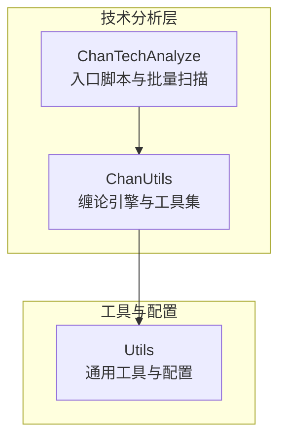
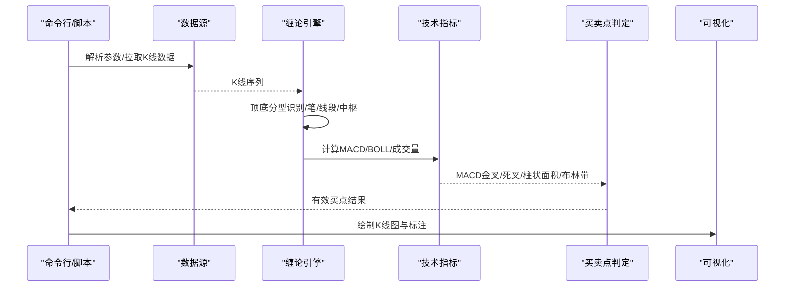
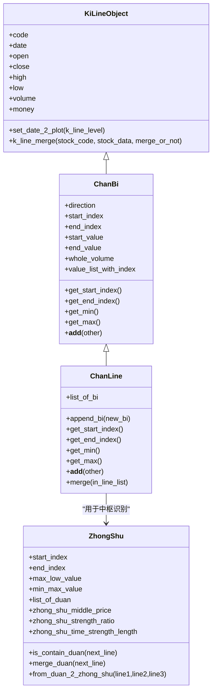
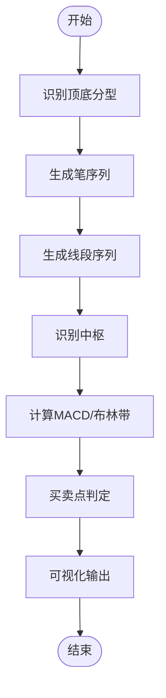
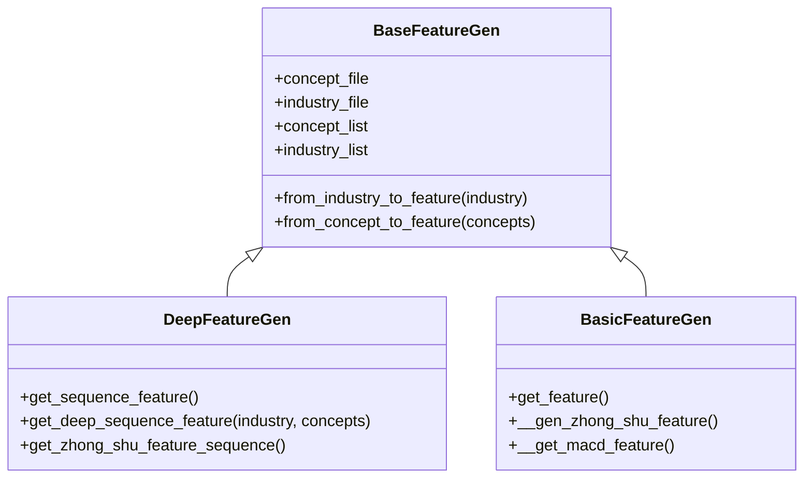
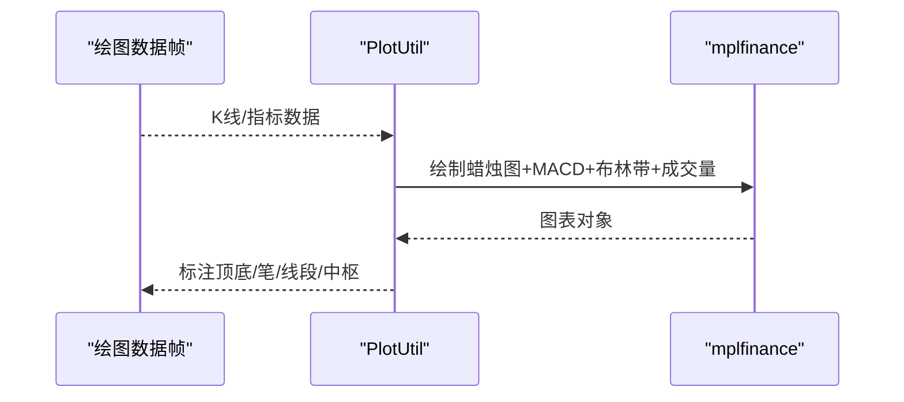
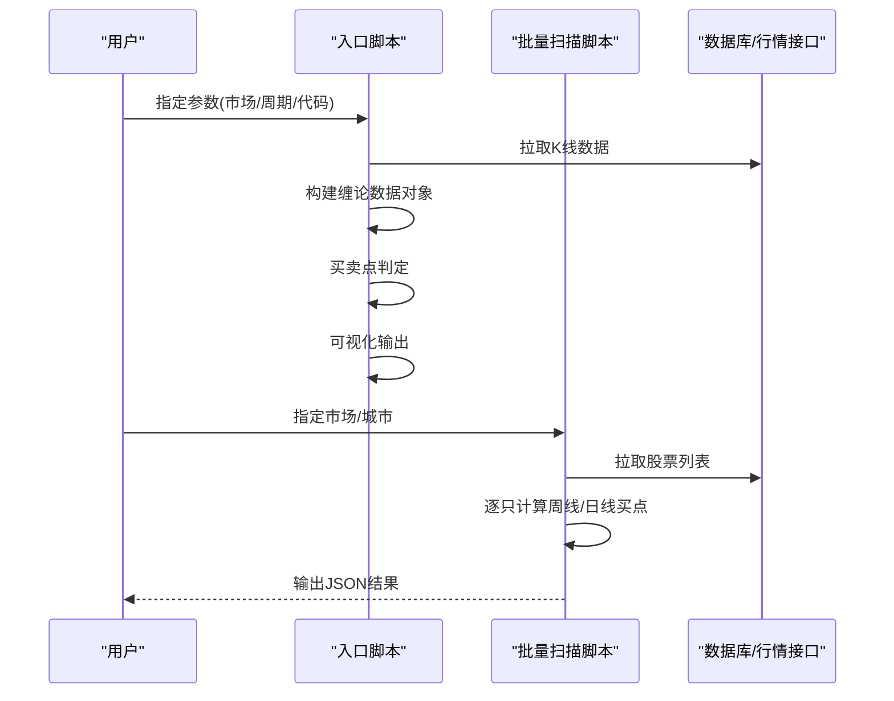
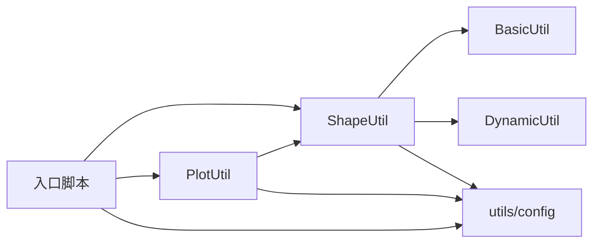

# 技术分析模块

<cite>
**本文引用的文件**
- [ChanLunEngZhongShu.py](file://src/ChanTechAnalyze/ChanLunEngZhongShu.py)
- [get_all_week_line_buy_point_valid_stock.py](file://src/ChanTechAnalyze/get_all_week_line_buy_point_valid_stock.py)
- [BasicUtil.py](file://src/ChanUtils/BasicUtil.py)
- [ShapeUtil.py](file://src/ChanUtils/ShapeUtil.py)
- [ChanFeature.py](file://src/ChanUtils/ChanFeature.py)
- [PlotUtil.py](file://src/ChanUtils/PlotUtil.py)
- [DynamicUtil.py](file://src/ChanUtils/DynamicUtil.py)
- [utils.py](file://src/Utils/utils.py)
- [config.py](file://src/Utils/config.py)
- [README.md](file://README.md)
</cite>

## 目录
1. [简介](#简介)
2. [项目结构](#项目结构)
3. [核心组件](#核心组件)
4. [架构总览](#架构总览)
5. [详细组件分析](#详细组件分析)
6. [依赖关系分析](#依赖关系分析)
7. [性能考量](#性能考量)
8. [故障排查指南](#故障排查指南)
9. [结论](#结论)
10. [附录](#附录)

## 简介
本技术分析模块基于缠论（ChanLun）理论，提供从K线数据到买卖点识别、中枢识别、MACD辅助判断、可视化展示的完整流程。模块支持日线、周线、30分钟、15分钟等多周期分析，重点覆盖周线级别“第一类买点”的识别规则与日线辅助验证，同时集成成交量放量检测、布林带辅助、MACD柱状面积变化等技术指标，形成可复用的量化分析流水线。

## 项目结构
- 技术分析核心位于 ChanTechAnalyze 与 ChanUtils 两个包：
  - ChanTechAnalyze：入口脚本与批量扫描脚本，负责数据拉取、参数解析、调用缠论引擎与可视化输出。
  - ChanUtils：缠论引擎与工具集，包含基础对象（K线、笔、线段、中枢）、形态识别、特征工程、绘图工具等。
- 工具与配置：
  - Utils：通用工具、配置常量、数据库访问等。
  - README.md：整体架构与待办事项说明。

**章节来源**
- [README.md:1-33](file://README.md#L1-L33)

## 核心组件
- 缠论引擎与数据结构
  - K线、笔、线段、中枢对象与合并算法，支撑缠论形态识别与中枢构建。
- 形态识别与买卖点判定
  - 顶底分型识别、笔与线段生成、中枢识别、MACD金叉死叉与柱状面积变化辅助买卖点判断。
- 特征工程
  - 基于笔/线段序列的统计特征、MACD波动特征、中枢强度特征等，便于后续机器学习建模。
- 可视化
  - 使用mplfinance绘制K线蜡烛图，叠加MACD柱状图、布林带、顶底分型、笔、线段、中枢边界等。
- 批量扫描与参数化
  - 支持按市场、周期、代码/符号参数化运行，批量输出周线与日线的有效买点候选。

**章节来源**
- [BasicUtil.py:10-695](file://src/ChanUtils/BasicUtil.py#L10-L695)
- [ShapeUtil.py:22-530](file://src/ChanUtils/ShapeUtil.py#L22-L530)
- [ChanFeature.py:14-325](file://src/ChanUtils/ChanFeature.py#L14-L325)
- [PlotUtil.py:15-150](file://src/ChanUtils/PlotUtil.py#L15-L150)
- [ChanLunEngZhongShu.py:26-185](file://src/ChanTechAnalyze/ChanLunEngZhongShu.py#L26-L185)
- [get_all_week_line_buy_point_valid_stock.py:55-185](file://src/ChanTechAnalyze/get_all_week_line_buy_point_valid_stock.py#L55-L185)

## 架构总览
模块采用“数据输入 -> 缠论引擎 -> 指标增强 -> 买卖点判定 -> 可视化输出”的流水线式架构。核心流程如下：

**图表来源**
- [ChanLunEngZhongShu.py:147-182](file://src/ChanTechAnalyze/ChanLunEngZhongShu.py#L147-L182)
- [ShapeUtil.py:197-276](file://src/ChanUtils/ShapeUtil.py#L197-L276)
- [PlotUtil.py:15-125](file://src/ChanUtils/PlotUtil.py#L15-L125)

**章节来源**
- [ChanLunEngZhongShu.py:26-185](file://src/ChanTechAnalyze/ChanLunEngZhongShu.py#L26-L185)
- [ShapeUtil.py:22-530](file://src/ChanUtils/ShapeUtil.py#L22-L530)

## 详细组件分析

### 组件A：缠论引擎与数据结构（BasicUtil）
- K线对象与合并
  - 提供KiLineObject封装K线字段与日期定位；k_line_merge将原始K线序列合并为符合缠论的K线序列。
  - is_contain与inner_merge实现包含关系判断与合并，确保K线序列满足缠论最小约束。
- 笔与线段
  - ChanBi与ChanLine分别表示笔与线段，支持方向、起止索引、高低点、成交量聚合与拼接合并。
  - bi_inner_merge与from_bi_list_to_line完成笔序列到线段序列的生成与合并。
- 中枢
  - ZhongShu描述中枢的上下沿、时间跨度、强度比率等，提供合并与包含判断能力，支撑中枢识别。

**图表来源**
- [BasicUtil.py:11-695](file://src/ChanUtils/BasicUtil.py#L11-L695)

**章节来源**
- [BasicUtil.py:11-695](file://src/ChanUtils/BasicUtil.py#L11-L695)

### 组件B：形态识别与买卖点判定（ShapeUtil）
- 顶底分型识别
  - is_ding_di_shape对合并后的K线序列进行三K线窗口识别，支持首遍标记、二遍合并、三遍修正，确保相邻顶底不冲突且满足笔构成条件。
- 笔与线段生成
  - from_point_to_bi根据顶底信号生成笔序列；from_bi_list_to_line将笔序列聚合成线段，处理笔破坏与线段破坏场景。
- 中枢识别
  - from_xian_duan_to_zhong_shu基于线段序列按三段组合形成中枢，支持中枢合并与包含扩展。
- 买卖点判定（周线为主）
  - is_valid_buy_sell_point_on_k_line在周线级别要求MACD柱状在0轴附近或以上，且最近MACD柱面积增大；在日线级别还需满足最近底分型晚于最近顶分型或柱面积增大。
- MACD与布林带
  - gen_data_frame中计算MACD、柱状图正负拆分、标准化与交叉列表；布林带计算并加入绘图。

**图表来源**
- [ShapeUtil.py:299-375](file://src/ChanUtils/ShapeUtil.py#L299-L375)
- [ShapeUtil.py:197-276](file://src/ChanUtils/ShapeUtil.py#L197-L276)

**章节来源**
- [ShapeUtil.py:299-375](file://src/ChanUtils/ShapeUtil.py#L299-L375)
- [ShapeUtil.py:384-528](file://src/ChanUtils/ShapeUtil.py#L384-L528)
- [ShapeUtil.py:197-276](file://src/ChanUtils/ShapeUtil.py#L197-L276)

### 组件C：特征工程（ChanFeature）
- 序列特征
  - DeepFeatureGen提取笔/线段的方向序列、长度序列、角度序列、成交量序列、MACD柱面积序列等，支持归一化与拼接。
- 统计特征
  - BasicFeatureGen计算笔/线段的均值、方差、标准差，中枢长度、中枢极值、中枢强度比率等，以及MACD区间方差与标准差。
- 行业/概念嵌入
  - BaseFeatureGen加载概念/行业字典，将行业与概念映射为one-hot向量，便于下游模型输入。

**图表来源**
- [ChanFeature.py:14-325](file://src/ChanUtils/ChanFeature.py#L14-L325)

**章节来源**
- [ChanFeature.py:14-325](file://src/ChanUtils/ChanFeature.py#L14-L325)

### 组件D：可视化工具（PlotUtil）
- 技术指标叠加
  - 计算MACD、信号线、柱状图正负拆分；布林带上中下轨；均线（5/10/30）。
- 绘图样式
  - 使用mplfinance绘制蜡烛图，主图叠加MACD柱状、布林带，成交量次图叠加放量买点/卖点标记。
- 与缠论数据对接
  - 通过ChanSourceDataObject提供的绘图数据帧，叠加顶底分型、笔、线段、中枢边界等。

**图表来源**
- [PlotUtil.py:15-125](file://src/ChanUtils/PlotUtil.py#L15-L125)
- [ShapeUtil.py:1463-1643](file://src/ChanUtils/ShapeUtil.py#L1463-L1643)

**章节来源**
- [PlotUtil.py:15-125](file://src/ChanUtils/PlotUtil.py#L15-L125)
- [ShapeUtil.py:1463-1643](file://src/ChanUtils/ShapeUtil.py#L1463-L1643)

### 组件E：入口与批量扫描（ChanLunEngZhongShu、get_all_week_line_buy_point_valid_stock）
- 单只股票分析
  - 解析市场、周期、代码/符号参数，拉取K线，构建缠论数据对象，计算买卖点，输出可视化。
- 批量扫描
  - 遍历指定市场与城市股票池，分别计算周线与日线的有效买点，输出JSON结果，便于后续策略筛选。

**图表来源**
- [ChanLunEngZhongShu.py:26-185](file://src/ChanTechAnalyze/ChanLunEngZhongShu.py#L26-L185)
- [get_all_week_line_buy_point_valid_stock.py:55-185](file://src/ChanTechAnalyze/get_all_week_line_buy_point_valid_stock.py#L55-L185)

**章节来源**
- [ChanLunEngZhongShu.py:26-185](file://src/ChanTechAnalyze/ChanLunEngZhongShu.py#L26-L185)
- [get_all_week_line_buy_point_valid_stock.py:55-185](file://src/ChanTechAnalyze/get_all_week_line_buy_point_valid_stock.py#L55-L185)

## 依赖关系分析
- 组件耦合
  - ShapeUtil依赖BasicUtil的K线/笔/线段/中枢对象；PlotUtil依赖ShapeUtil的绘图数据帧；入口脚本依赖ShapeUtil与PlotUtil。
- 外部依赖
  - 数据：akshare（日线/分钟线）、本地数据库工具（LocalDbTool）。
  - 可视化：mplfinance、ta（MACD/BOLL）。
  - 工具：pandas、numpy、argparse、logging。

**图表来源**
- [ChanLunEngZhongShu.py:5-12](file://src/ChanTechAnalyze/ChanLunEngZhongShu.py#L5-L12)
- [ShapeUtil.py:3-16](file://src/ChanUtils/ShapeUtil.py#L3-L16)
- [PlotUtil.py:8-12](file://src/ChanUtils/PlotUtil.py#L8-L12)

**章节来源**
- [ChanLunEngZhongShu.py:5-12](file://src/ChanTechAnalyze/ChanLunEngZhongShu.py#L5-L12)
- [ShapeUtil.py:3-16](file://src/ChanUtils/ShapeUtil.py#L3-L16)
- [PlotUtil.py:8-12](file://src/ChanUtils/PlotUtil.py#L8-L12)

## 性能考量
- 时间复杂度
  - K线合并与包含关系判断：O(n)；笔/线段生成与合并：O(n)；中枢识别：O(n)；MACD/BOLL计算：O(n)。
- 内存占用
  - 主要消耗在DataFrame存储与绘图对象，可通过分批处理与延迟计算优化。
- 并行化
  - 批量扫描脚本可并行化处理不同股票，减少总耗时；注意数据库/接口限流。
- 参数敏感性
  - 顶底分型窗口、MACD阈值、中枢合并阈值等超参数需结合历史回测调优。

[本节为通用指导，无需具体文件引用]

## 故障排查指南
- 数据为空或不足
  - 检查数据拉取逻辑与数据长度过滤条件；确保至少33根K线以满足形态识别。
- 买卖点判定失败
  - 确认周线级别MACD柱面积与阈值设置；检查日线级别顶底分型时间先后关系。
- 可视化异常
  - 检查matplotlib字体与渲染配置；确认绘图数据帧列名与索引格式。
- 参数错误
  - 使用argparse校验市场、周期、代码/符号参数；避免非法组合。

**章节来源**
- [get_all_week_line_buy_point_valid_stock.py:32-52](file://src/ChanTechAnalyze/get_all_week_line_buy_point_valid_stock.py#L32-L52)
- [ChanLunEngZhongShu.py:130-132](file://src/ChanTechAnalyze/ChanLunEngZhongShu.py#L130-L132)

## 结论
本模块以缠论为核心，融合MACD、布林带、成交量放量等指标，形成从数据到可视化的一体化分析流程。通过周线主导、日线辅助的买卖点识别规则，结合中枢识别与MACD柱面积变化，为量化分析师提供了可复用、可扩展的技术分析框架。建议在实际应用中结合历史回测与参数优化，持续迭代规则与特征。

[本节为总结性内容，无需具体文件引用]

## 附录

### 周线买卖点分析的计算方法与判断标准
- 周线级别
  - MACD柱面积近期增大；MACD与信号线在0轴附近或以上；最近MACD金叉为红色柱面积扩大。
- 日线级别
  - 在周线买点区间内，日线MACD金叉且最近底分型时间晚于最近顶分型，或MACD柱面积仍保持增长。

**章节来源**
- [ShapeUtil.py:299-375](file://src/ChanUtils/ShapeUtil.py#L299-L375)

### 技术指标计算实现细节与参数配置
- MACD
  - 快线：12日指数平滑；慢线：26日指数平滑；信号线：9日指数平滑；柱状图：快线-慢线。
- 布林带
  - 上轨：20日均线+2倍标准差；中轨：20日均线；下轨：20日均线-2倍标准差。
- 成交量放量
  - 以7日平均成交量为基准，成交量超过3倍即标记为放量买点/卖点。

**章节来源**
- [PlotUtil.py:18-95](file://src/ChanUtils/PlotUtil.py#L18-L95)
- [DynamicUtil.py:9-85](file://src/ChanUtils/DynamicUtil.py#L9-L85)

### 形态识别算法工作原理与应用场景
- 顶底分型
  - 三K线窗口内，第二K线的高点/低点分别为三者中的最高/最低，形成顶/底分型。
- 笔与线段
  - 笔由相邻顶底分型构成；线段由连续同向笔组成，支持笔破坏与线段破坏处理。
- 中枢
  - 由三段线段的高低点重叠形成，支持合并与包含扩展，用于震荡差价与三类买卖点判断。

**章节来源**
- [ShapeUtil.py:384-528](file://src/ChanUtils/ShapeUtil.py#L384-L528)
- [ShapeUtil.py:1169-1222](file://src/ChanUtils/ShapeUtil.py#L1169-L1222)
- [BasicUtil.py:434-543](file://src/ChanUtils/BasicUtil.py#L434-L543)

### 可视化工具使用方法
- 绘图要素
  - 主图：K线蜡烛图；叠加MACD柱状图（红/绿）、布林带上中下轨；次图：成交量。
  - 标注：顶底分型（三角形）、笔/线段（虚线）、中枢边界（细实线）。
- 输出
  - 保存PNG图片，标题包含股票名称与日期；支持交互式显示。

**章节来源**
- [ShapeUtil.py:1463-1643](file://src/ChanUtils/ShapeUtil.py#L1463-L1643)
- [PlotUtil.py:110-125](file://src/ChanUtils/PlotUtil.py#L110-L125)

### 与其他技术分析方法的结合
- 与MACD结合
  - 用MACD金叉/死叉与柱面积变化辅助确认缠论买卖点，避免单一形态误判。
- 与布林带结合
  - 布林带超买/超卖区域与中枢震荡相辅相成，辅助判断第二类买卖点。
- 与成交量结合
  - 成交量放量作为确认信号，提升买卖点可靠性。

**章节来源**
- [ShapeUtil.py:197-276](file://src/ChanUtils/ShapeUtil.py#L197-L276)
- [PlotUtil.py:34-95](file://src/ChanUtils/PlotUtil.py#L34-L95)
- [DynamicUtil.py:67-85](file://src/ChanUtils/DynamicUtil.py#L67-L85)

### 实际分析案例与策略应用示例
- 案例思路
  - 以某股票为例，先在周线级别识别中枢与MACD柱面积变化，确认第一类买点区间；随后在日线级别寻找底分型与MACD金叉，结合成交量放量确认入场时机。
- 策略要点
  - 操作级别：周线主导，日线辅助；趋势明确后再参与震荡差价。
  - 风控：中枢破位即离场，避免追涨杀跌；严格控制回撤。

[本节为方法论与实践建议，无需具体文件引用]