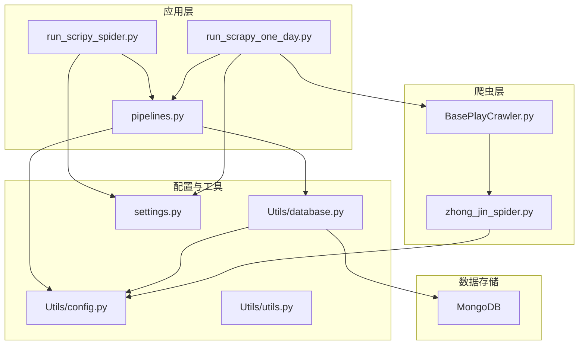
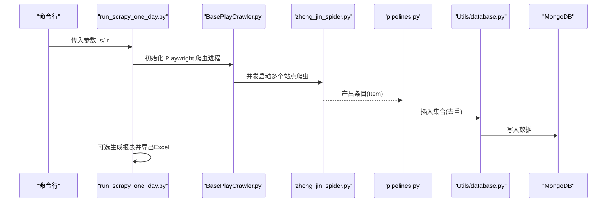
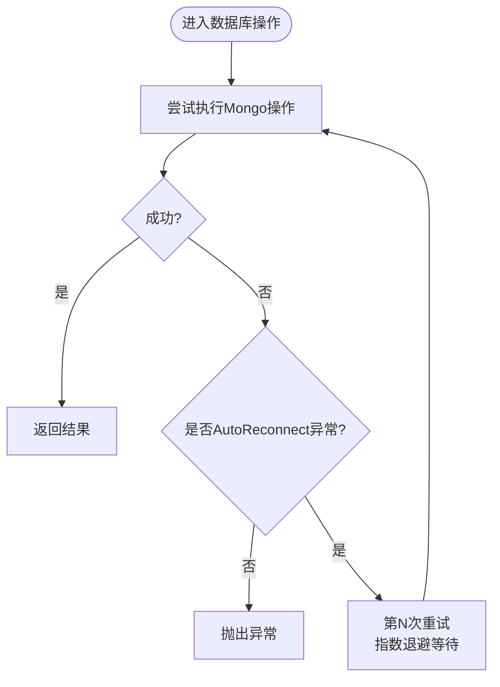
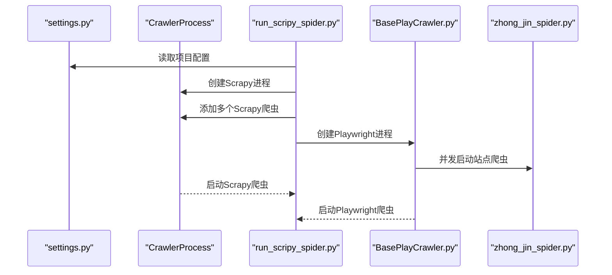
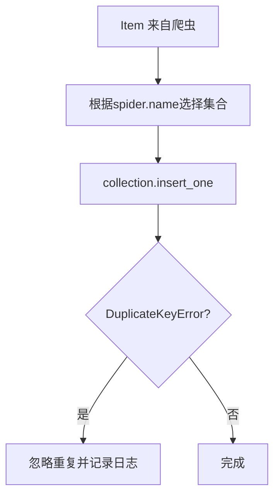
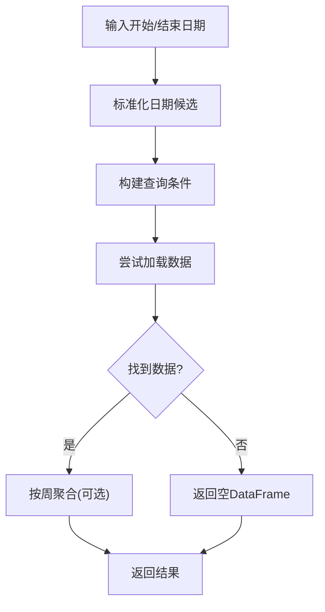
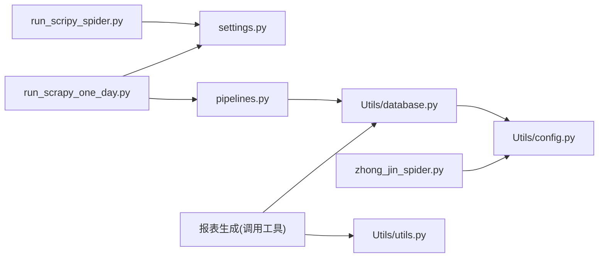

# 常见问题诊断

<cite>
**本文引用的文件**
- [ProblemSolve.md](file://ProblemSolve.md)
- [README.md](file://README.md)
- [src/Utils/config.py](file://src/Utils/config.py)
- [src/Utils/database.py](file://src/Utils/database.py)
- [src/settings.py](file://src/settings.py)
- [src/run_scripy_spider.py](file://src/run_scripy_spider.py)
- [src/run_scrapy_one_day.py](file://src/run_scrapy_one_day.py)
- [src/pipelines.py](file://src/pipelines.py)
- [src/Utils/utils.py](file://src/Utils/utils.py)
- [src/MongoDbComTools/LocalDbTool.py](file://src/MongoDbComTools/LocalDbTool.py)
- [src/MarketNewsSpiderWithScrapy/zhong_jin_spider.py](file://src/MarketNewsSpiderWithScrapy/zhong_jin_spider.py)
- [src/MarketNewsSpiderWithScrapy/BasePlayCrawler.py](file://src/MarketNewsSpiderWithScrapy/BasePlayCrawler.py)
- [src/ThirdPartyToolSurpriver/library_installation.bat](file://src/ThirdPartyToolSurpriver/library_installation.bat)
</cite>

## 目录
1. [简介](#简介)
2. [项目结构](#项目结构)
3. [核心组件](#核心组件)
4. [架构总览](#架构总览)
5. [详细组件分析](#详细组件分析)
6. [依赖关系分析](#依赖关系分析)
7. [性能考量](#性能考量)
8. [故障排除指南](#故障排除指南)
9. [结论](#结论)
10. [附录](#附录)

## 简介
本文件面向日常运维与开发人员，提供系统常见问题的诊断与解决指南。内容覆盖环境配置、依赖包冲突、权限问题、数据库连接、浏览器驱动、日志分析与快速检查清单，帮助快速定位并修复典型问题。涉及组件包括 Python 环境、MongoDB、Chrome Driver、Scrapy/Playwright 爬虫链路与数据管道等。

## 项目结构
项目采用模块化组织，主要目录与职责如下：
- src/Utils：通用配置、数据库封装、工具函数
- src/MarketNewsSpiderWithScrapy：基于 Scrapy 和 Playwright 的新闻爬虫集合
- src/MongoDbComTools：本地数据库工具与数据处理
- src/NlpModel：自然语言处理与情感分析相关模块
- src/ThirdPartyToolSurpriver：第三方工具与安装脚本
- docs/images：文档配图
- src/data、src/info：数据与资源文件
- 根目录：问题排查记录与总体说明

图表来源
- [src/run_scripy_spider.py:117-142](file://src/run_scripy_spider.py#L117-L142)
- [src/run_scrapy_one_day.py:32-79](file://src/run_scrapy_one_day.py#L32-L79)
- [src/pipelines.py:8-46](file://src/pipelines.py#L8-L46)
- [src/MarketNewsSpiderWithScrapy/BasePlayCrawler.py:41-81](file://src/MarketNewsSpiderWithScrapy/BasePlayCrawler.py#L41-L81)
- [src/MarketNewsSpiderWithScrapy/zhong_jin_spider.py:39-40](file://src/MarketNewsSpiderWithScrapy/zhong_jin_spider.py#L39-L40)
- [src/Utils/config.py:13-23](file://src/Utils/config.py#L13-L23)
- [src/Utils/database.py:36-60](file://src/Utils/database.py#L36-L60)
- [src/settings.py:1-49](file://src/settings.py#L1-L49)

章节来源
- [README.md:1-33](file://README.md#L1-L33)
- [src/Utils/config.py:13-23](file://src/Utils/config.py#L13-L23)

## 核心组件
- 配置中心：集中管理数据库地址、端口、Chrome Driver 路径、爬虫站点参数与模型路径等
- 数据库封装：统一初始化客户端、重连机制、查询与写入接口
- 爬虫入口：支持按模块批量启动，区分 Playwright 与 Scrapy 爬虫
- 数据管道：将爬取结果写入对应数据库集合，避免重复键冲突
- 工具函数：日志、邮件发送、日期解析、中文分词词典等

章节来源
- [src/Utils/config.py:13-23](file://src/Utils/config.py#L13-L23)
- [src/Utils/database.py:36-60](file://src/Utils/database.py#L36-L60)
- [src/run_scripy_spider.py:117-142](file://src/run_scripy_spider.py#L117-L142)
- [src/run_scrapy_one_day.py:32-79](file://src/run_scrapy_one_day.py#L32-L79)
- [src/pipelines.py:8-46](file://src/pipelines.py#L8-L46)
- [src/Utils/utils.py:18-22](file://src/Utils/utils.py#L18-L22)

## 架构总览
系统以“爬虫调度 → 数据清洗/入库 → 分析与报表”为主线，数据流从各新闻站点抓取，经管道写入 MongoDB，再由报表生成模块读取并输出 Excel 报告。

图表来源
- [src/run_scrapy_one_day.py:32-79](file://src/run_scrapy_one_day.py#L32-L79)
- [src/MarketNewsSpiderWithScrapy/BasePlayCrawler.py:41-81](file://src/MarketNewsSpiderWithScrapy/BasePlayCrawler.py#L41-L81)
- [src/MarketNewsSpiderWithScrapy/zhong_jin_spider.py:39-40](file://src/MarketNewsSpiderWithScrapy/zhong_jin_spider.py#L39-L40)
- [src/pipelines.py:25-46](file://src/pipelines.py#L25-L46)
- [src/Utils/database.py:78-88](file://src/Utils/database.py#L78-L88)

## 详细组件分析

### 组件A：数据库连接与重连机制
- 自动重连装饰器在网络抖动或超时场景下进行指数退避重试
- 客户端初始化设置连接超时、最大连接池大小
- 查询接口支持条件过滤、字段选择、排序与上限控制

图表来源
- [src/Utils/database.py:15-33](file://src/Utils/database.py#L15-L33)
- [src/Utils/database.py:44-60](file://src/Utils/database.py#L44-L60)
- [src/Utils/database.py:94-172](file://src/Utils/database.py#L94-L172)

章节来源
- [src/Utils/database.py:15-33](file://src/Utils/database.py#L15-L33)
- [src/Utils/database.py:44-60](file://src/Utils/database.py#L44-L60)
- [src/Utils/database.py:94-172](file://src/Utils/database.py#L94-L172)

### 组件B：爬虫调度与并发
- 支持 Playwright 与 Scrapy 两类爬虫并行运行
- 通过配置列表批量添加爬虫任务
- Playwright 使用独立上下文，避免 Cookie 干扰并节省内存

图表来源
- [src/settings.py:18-34](file://src/settings.py#L18-L34)
- [src/run_scripy_spider.py:117-142](file://src/run_scripy_spider.py#L117-L142)
- [src/MarketNewsSpiderWithScrapy/BasePlayCrawler.py:41-81](file://src/MarketNewsSpiderWithScrapy/BasePlayCrawler.py#L41-L81)
- [src/MarketNewsSpiderWithScrapy/zhong_jin_spider.py:39-40](file://src/MarketNewsSpiderWithScrapy/zhong_jin_spider.py#L39-L40)

章节来源
- [src/settings.py:18-34](file://src/settings.py#L18-L34)
- [src/run_scripy_spider.py:117-142](file://src/run_scripy_spider.py#L117-L142)
- [src/run_scrapy_one_day.py:32-79](file://src/run_scrapy_one_day.py#L32-L79)
- [src/MarketNewsSpiderWithScrapy/BasePlayCrawler.py:41-81](file://src/MarketNewsSpiderWithScrapy/BasePlayCrawler.py#L41-L81)

### 组件C：数据管道与去重
- 按爬虫名称映射到对应数据库集合
- 使用唯一键避免重复插入
- 日志记录插入状态与异常

图表来源
- [src/pipelines.py:25-46](file://src/pipelines.py#L25-L46)
- [src/pipelines.py:48-56](file://src/pipelines.py#L48-L56)

章节来源
- [src/pipelines.py:25-46](file://src/pipelines.py#L25-L46)
- [src/pipelines.py:48-56](file://src/pipelines.py#L48-L56)

### 组件D：本地数据库工具与日期查询
- 提供跨市场（A/H/US）日线数据查询与周线聚合
- 支持多种日期格式归一化与候选查询构建
- 自动索引与排序，确保时间序列一致性

图表来源
- [src/MongoDbComTools/LocalDbTool.py:127-173](file://src/MongoDbComTools/LocalDbTool.py#L127-L173)
- [src/MongoDbComTools/LocalDbTool.py:175-215](file://src/MongoDbComTools/LocalDbTool.py#L175-L215)
- [src/MongoDbComTools/LocalDbTool.py:217-224](file://src/MongoDbComTools/LocalDbTool.py#L217-L224)

章节来源
- [src/MongoDbComTools/LocalDbTool.py:127-173](file://src/MongoDbComTools/LocalDbTool.py#L127-L173)
- [src/MongoDbComTools/LocalDbTool.py:175-215](file://src/MongoDbComTools/LocalDbTool.py#L175-L215)
- [src/MongoDbComTools/LocalDbTool.py:217-224](file://src/MongoDbComTools/LocalDbTool.py#L217-L224)

## 依赖关系分析
- 爬虫入口依赖配置中心与设置模块
- 数据管道依赖数据库封装与配置中心
- 爬虫实现依赖配置中心中的 Chrome Driver 路径
- 报表生成依赖数据库封装与工具函数

图表来源
- [src/run_scripy_spider.py:117-142](file://src/run_scripy_spider.py#L117-L142)
- [src/run_scrapy_one_day.py:32-79](file://src/run_scrapy_one_day.py#L32-L79)
- [src/pipelines.py:8-22](file://src/pipelines.py#L8-L22)
- [src/Utils/database.py:36-60](file://src/Utils/database.py#L36-L60)
- [src/Utils/config.py:13-23](file://src/Utils/config.py#L13-L23)
- [src/Utils/utils.py:18-22](file://src/Utils/utils.py#L18-L22)

章节来源
- [src/run_scripy_spider.py:117-142](file://src/run_scripy_spider.py#L117-L142)
- [src/run_scrapy_one_day.py:32-79](file://src/run_scrapy_one_day.py#L32-L79)
- [src/pipelines.py:8-22](file://src/pipelines.py#L8-L22)
- [src/Utils/database.py:36-60](file://src/Utils/database.py#L36-L60)
- [src/Utils/config.py:13-23](file://src/Utils/config.py#L13-L23)
- [src/Utils/utils.py:18-22](file://src/Utils/utils.py#L18-L22)

## 性能考量
- 并发与延迟：settings 中设置了并发请求数与下载延迟，建议根据目标站点限流策略调整
- 连接池：数据库客户端设置了最大连接池大小，避免高并发下的连接瓶颈
- 查询优化：按日期字段建立索引可显著提升范围查询性能
- 浏览器资源：Playwright 多上下文并发需合理控制 UA 与页面生命周期，避免内存泄漏

章节来源
- [src/settings.py:18-34](file://src/settings.py#L18-L34)
- [src/Utils/database.py:56-58](file://src/Utils/database.py#L56-L58)
- [src/MarketNewsSpiderWithScrapy/BasePlayCrawler.py:70-74](file://src/MarketNewsSpiderWithScrapy/BasePlayCrawler.py#L70-L74)

## 故障排除指南

### 环境配置问题
- macOS Homebrew 安装与卸载
  - 使用国内镜像脚本安装/卸载
  - 常用命令：安装、卸载、搜索、升级、列出、更新、清理
- Python 依赖安装
  - 使用批处理脚本安装 requirements.txt
  - 特定包安装参考问题记录中的链接与方式
- Chrome Driver 权限与路径
  - 确认 CHROME_DRIVER 路径与可执行权限
  - macOS 下注意驱动权限问题与版本匹配

章节来源
- [ProblemSolve.md:1-16](file://ProblemSolve.md#L1-L16)
- [ProblemSolve.md:42-49](file://ProblemSolve.md#L42-L49)
- [src/Utils/config.py:21-23](file://src/Utils/config.py#L21-L23)
- [src/MarketNewsSpiderWithScrapy/zhong_jin_spider.py:39-40](file://src/MarketNewsSpiderWithScrapy/zhong_jin_spider.py#L39-L40)

### 依赖包冲突
- 常见包安装问题与解决思路
  - 参考问题记录中对特定包的安装方式
  - 建议使用虚拟环境隔离依赖
- 包安装脚本
  - Windows 批处理脚本一键安装 requirements.txt

章节来源
- [ProblemSolve.md:42-49](file://ProblemSolve.md#L42-L49)
- [src/ThirdPartyToolSurpriver/library_installation.bat:1-3](file://src/ThirdPartyToolSurpriver/library_installation.bat#L1-L3)

### 权限问题
- 文件与可执行文件权限
  - Chrome Driver 可执行位缺失导致权限错误
  - macOS 需要修正驱动权限
- 系统级限制
  - macOS 文件句柄限制过高/过低会影响数据库连接
  - 可通过系统命令调整 maxfiles 限制

章节来源
- [ProblemSolve.md:47-50](file://ProblemSolve.md#L47-L50)
- [ProblemSolve.md:18-41](file://ProblemSolve.md#L18-L41)

### MongoDB 连接与性能问题
- 连接失败/超时
  - 检查 MONGODB_IP/PORT 与防火墙
  - 调整 serverSelectionTimeoutMS 与连接池大小
- AutoReconnect 重连
  - 网络抖动时自动重试，指数退避等待
- 文件句柄过多
  - macOS 调整 maxfiles 限制
  - 参考官方 ulimit 文档

章节来源
- [src/Utils/config.py:13-16](file://src/Utils/config.py#L13-L16)
- [src/Utils/database.py:44-60](file://src/Utils/database.py#L44-L60)
- [src/Utils/database.py:15-33](file://src/Utils/database.py#L15-L33)
- [ProblemSolve.md:18-41](file://ProblemSolve.md#L18-L41)

### Chrome/Playwright 爬虫问题
- 驱动权限与版本不匹配
  - 确保驱动可执行且与浏览器版本兼容
- 无头模式与沙箱
  - 使用无头模式与禁用沙箱参数
- 并发上下文
  - Playwright 多上下文并发需避免 Cookie 干扰
- 页面交互
  - 动态加载按钮点击与等待策略需稳定

章节来源
- [src/MarketNewsSpiderWithScrapy/zhong_jin_spider.py:16-26](file://src/MarketNewsSpiderWithScrapy/zhong_jin_spider.py#L16-L26)
- [src/MarketNewsSpiderWithScrapy/zhong_jin_spider.py:39-40](file://src/MarketNewsSpiderWithScrapy/zhong_jin_spider.py#L39-L40)
- [src/MarketNewsSpiderWithScrapy/BasePlayCrawler.py:41-81](file://src/MarketNewsSpiderWithScrapy/BasePlayCrawler.py#L41-L81)

### 日志分析与定位
- 日志级别与格式
  - 统一配置日志级别与格式，便于定位
- 关键日志点
  - 数据库查询为空、插入重复键、爬虫异常、浏览器交互失败
- 报表生成
  - 导出 Excel 前检查数据完整性与日期范围

章节来源
- [src/Utils/utils.py:18-22](file://src/Utils/utils.py#L18-L22)
- [src/Utils/database.py:142-147](file://src/Utils/database.py#L142-L147)
- [src/pipelines.py:50-56](file://src/pipelines.py#L50-L56)
- [src/run_scrapy_one_day.py:81-194](file://src/run_scrapy_one_day.py#L81-L194)

### 快速检查清单
- 环境
  - Python 版本与虚拟环境
  - Homebrew 可用性与包列表
  - Chrome Driver 权限与版本
- 依赖
  - requirements.txt 是否完整安装
  - 特定包安装方式是否正确
- 数据库
  - MongoDB 服务状态与连接参数
  - 文件句柄限制是否合理
- 爬虫
  - settings 中并发与延迟配置
  - Playwright/Chrome 参数是否正确
- 运行
  - run_scripy_spider.py/run_scrapy_one_day.py 参数是否正确
  - 日志输出是否正常

章节来源
- [ProblemSolve.md:1-16](file://ProblemSolve.md#L1-L16)
- [ProblemSolve.md:42-49](file://ProblemSolve.md#L42-L49)
- [src/Utils/config.py:13-23](file://src/Utils/config.py#L13-L23)
- [src/settings.py:18-34](file://src/settings.py#L18-L34)
- [src/run_scripy_spider.py:117-142](file://src/run_scripy_spider.py#L117-L142)
- [src/run_scrapy_one_day.py:32-79](file://src/run_scrapy_one_day.py#L32-L79)

## 结论
通过规范化的配置、健壮的数据库重连机制、合理的并发策略与完善的日志体系，系统可在复杂网络环境下稳定运行。建议在部署前完成环境与依赖的预检，运行中关注数据库与浏览器资源使用，出现问题时结合日志与检查清单快速定位根因。

## 附录

### 常见症状与解决步骤对照
- 症状：无法连接 MongoDB
  - 步骤：检查 IP/端口、防火墙、serverSelectionTimeoutMS、maxPoolSize
- 症状：Chrome Driver 权限错误
  - 步骤：修正可执行权限、确认版本匹配、检查路径
- 症状：爬虫频繁超时/失败
  - 步骤：降低并发、增加下载延迟、检查代理与 UA
- 症状：报表导出为空
  - 步骤：检查日期范围、数据库查询结果、数据完整性

章节来源
- [src/Utils/database.py:44-60](file://src/Utils/database.py#L44-L60)
- [src/Utils/config.py:13-16](file://src/Utils/config.py#L13-L16)
- [src/MarketNewsSpiderWithScrapy/zhong_jin_spider.py:39-40](file://src/MarketNewsSpiderWithScrapy/zhong_jin_spider.py#L39-L40)
- [src/run_scrapy_one_day.py:81-194](file://src/run_scrapy_one_day.py#L81-L194)