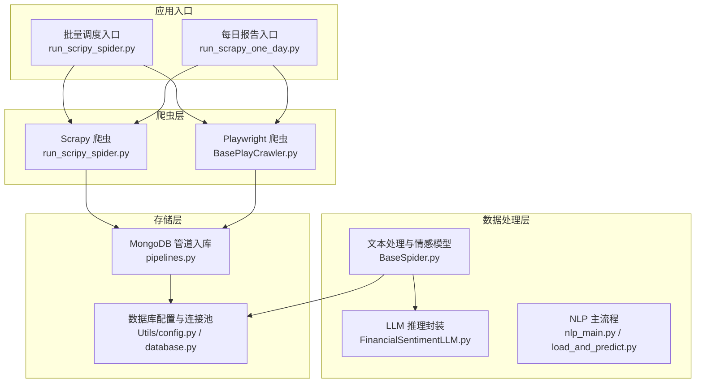
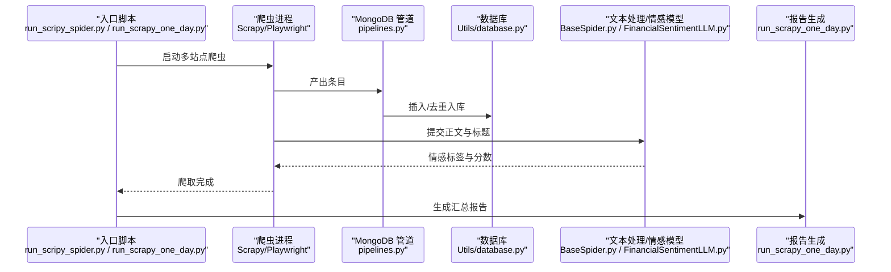
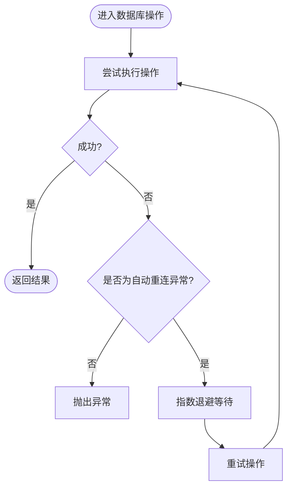
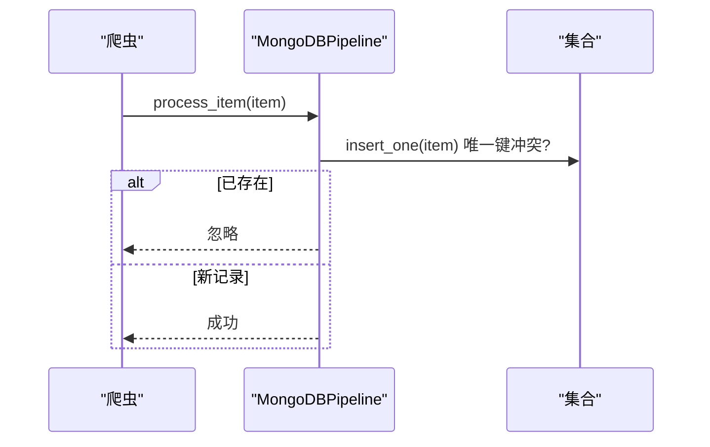
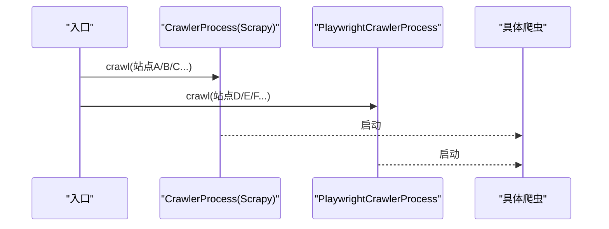
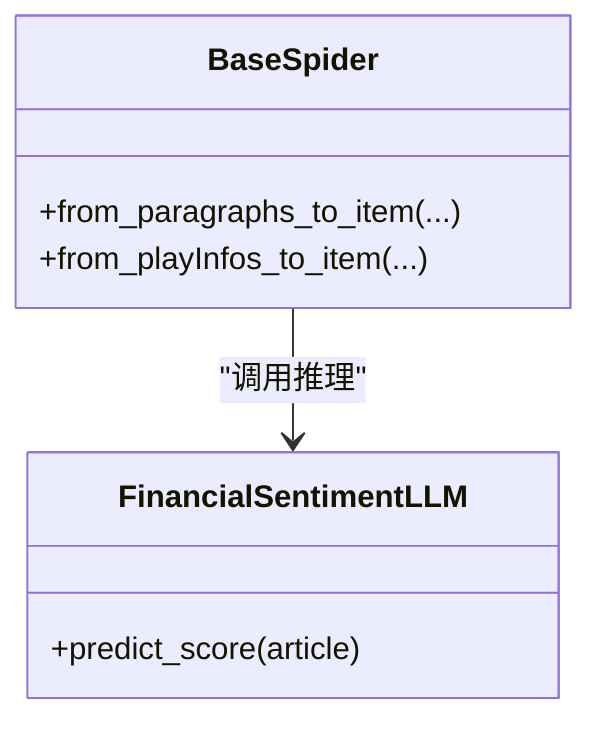
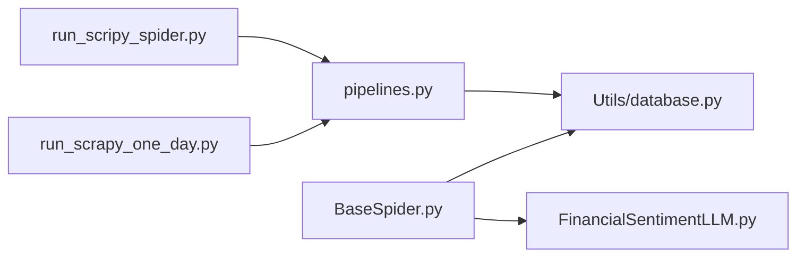

# 性能问题诊断

<cite>
**本文引用的文件**   
- [README.md](file://README.md)
- [ProblemSolve.md](file://ProblemSolve.md)
- [src/Utils/config.py](file://src/Utils/config.py)
- [src/Utils/database.py](file://src/Utils/database.py)
- [src/pipelines.py](file://src/pipelines.py)
- [src/run_scripy_spider.py](file://src/run_scripy_spider.py)
- [src/run_scrapy_one_day.py](file://src/run_scrapy_one_day.py)
- [src/MongoDbComTools/BuildStockNewsDb.py](file://src/MongoDbComTools/BuildStockNewsDb.py)
- [src/NlpModel/FinancialSentimentLLM.py](file://src/NlpModel/FinancialSentimentLLM.py)
- [src/NlpModel/nlp_main.py](file://src/NlpModel/nlp_main.py)
- [src/NlpModel/load_and_predict.py](file://src/NlpModel/load_and_predict.py)
- [src/MarketNewsSpiderWithScrapy/BaseSpider.py](file://src/MarketNewsSpiderWithScrapy/BaseSpider.py)
- [src/MarketNewsSpiderWithScrapy/BasePlayCrawler.py](file://src/MarketNewsSpiderWithScrapy/BasePlayCrawler.py)
</cite>

## 目录
1. [简介](#简介)
2. [项目结构](#项目结构)
3. [核心组件](#核心组件)
4. [架构总览](#架构总览)
5. [详细组件分析](#详细组件分析)
6. [依赖分析](#依赖分析)
7. [性能考量](#性能考量)
8. [故障排查指南](#故障排查指南)
9. [结论](#结论)
10. [附录](#附录)

## 简介
本技术文档面向“公司新闻爬取与文本分析”项目，聚焦于系统运行缓慢、内存占用过高、CPU负载过重等性能瓶颈的识别与解决路径。内容覆盖：
- Python程序性能分析工具的使用方法
- 内存泄漏检测、垃圾回收优化、并发处理改进
- 数据库查询优化、缓存策略调整、I/O性能提升
- 深度学习模型推理加速与资源管理
- 系统监控指标设置与性能基准测试
- 性能回归测试与持续性能监控最佳实践

## 项目结构
该项目采用模块化分层组织，主要包含以下层次：
- 爬虫层：基于 Scrapy 与 Playwright 的多站点新闻采集
- 数据处理层：文本清洗、分词、情感打分、特征工程
- 数据存储层：MongoDB 数据库与管道入库
- 应用入口：批量调度与每日报告生成

图表来源
- [src/run_scripy_spider.py:117-145](file://src/run_scripy_spider.py#L117-L145)
- [src/run_scrapy_one_day.py:32-80](file://src/run_scrapy_one_day.py#L32-L80)
- [src/MarketNewsSpiderWithScrapy/BasePlayCrawler.py:38-63](file://src/MarketNewsSpiderWithScrapy/BasePlayCrawler.py#L38-L63)
- [src/Utils/database.py:36-61](file://src/Utils/database.py#L36-L61)
- [src/pipelines.py:8-56](file://src/pipelines.py#L8-L56)
- [src/MarketNewsSpiderWithScrapy/BaseSpider.py:13-149](file://src/MarketNewsSpiderWithScrapy/BaseSpider.py#L13-L149)
- [src/NlpModel/FinancialSentimentLLM.py:19-106](file://src/NlpModel/FinancialSentimentLLM.py#L19-L106)

章节来源
- [README.md:1-33](file://README.md#L1-L33)
- [src/run_scripy_spider.py:117-145](file://src/run_scripy_spider.py#L117-L145)
- [src/run_scrapy_one_day.py:32-80](file://src/run_scrapy_one_day.py#L32-L80)

## 核心组件
- 数据库连接与重连机制：通过装饰器与连接池参数控制网络抖动下的稳定性与吞吐
- MongoDB 管道入库：统一入库接口，避免重复写入
- 多站点爬虫：Scrapy 与 Playwright 并行，按站点配置批量启动
- 文本处理与情感打分：结合传统 ML 与 LLM 的融合评分
- LLM 推理封装：GPU/CPU/Ollama 三种后端，按设备类型自动切换

章节来源
- [src/Utils/database.py:15-34](file://src/Utils/database.py#L15-L34)
- [src/Utils/database.py:44-61](file://src/Utils/database.py#L44-L61)
- [src/pipelines.py:8-56](file://src/pipelines.py#L8-L56)
- [src/run_scripy_spider.py:17-115](file://src/run_scripy_spider.py#L17-L115)
- [src/run_scrapy_one_day.py:43-79](file://src/run_scrapy_one_day.py#L43-L79)
- [src/MarketNewsSpiderWithScrapy/BaseSpider.py:66-83](file://src/MarketNewsSpiderWithScrapy/BaseSpider.py#L66-L83)
- [src/NlpModel/FinancialSentimentLLM.py:19-106](file://src/NlpModel/FinancialSentimentLLM.py#L19-L106)

## 架构总览
系统以“爬取-处理-入库-分析”的流水线为核心，数据流如下：

图表来源
- [src/run_scripy_spider.py:117-145](file://src/run_scripy_spider.py#L117-L145)
- [src/run_scrapy_one_day.py:43-80](file://src/run_scrapy_one_day.py#L43-L80)
- [src/pipelines.py:25-56](file://src/pipelines.py#L25-L56)
- [src/Utils/database.py:78-88](file://src/Utils/database.py#L78-L88)
- [src/MarketNewsSpiderWithScrapy/BaseSpider.py:66-83](file://src/MarketNewsSpiderWithScrapy/BaseSpider.py#L66-L83)
- [src/NlpModel/FinancialSentimentLLM.py:108-167](file://src/NlpModel/FinancialSentimentLLM.py#L108-L167)

## 详细组件分析

### 组件A：数据库连接与重连（graceful_auto_reconnect）
- 设计要点
  - 使用指数退避重试，降低瞬时网络抖动对吞吐的影响
  - 连接池上限与超时参数合理配置，避免阻塞与资源耗尽
  - 查询/插入/更新接口统一走装饰器保护，减少异常传播
- 性能影响
  - 合理的退避策略可显著降低重连成本与失败率
  - 连接池过大可能导致句柄不足，需结合系统 ulimit 调整
- 优化建议
  - 对高频查询增加索引
  - 分批读取大数据集，避免一次性拉取导致内存峰值
  - 结合慢查询日志定位热点集合与字段

图表来源
- [src/Utils/database.py:15-34](file://src/Utils/database.py#L15-L34)
- [src/Utils/database.py:94-172](file://src/Utils/database.py#L94-L172)

章节来源
- [src/Utils/database.py:15-34](file://src/Utils/database.py#L15-L34)
- [src/Utils/database.py:44-61](file://src/Utils/database.py#L44-L61)
- [src/Utils/database.py:94-172](file://src/Utils/database.py#L94-L172)

### 组件B：MongoDB 管道入库（去重与批量写入）
- 设计要点
  - 通过唯一键（如 MD5）避免重复写入
  - 按站点命名空间分库分表，降低锁竞争
- 性能影响
  - 去重查询会带来额外开销，建议在写入前先查缓存或使用幂等写
  - 大批量写入建议使用批量接口（若扩展）
- 优化建议
  - 为 _id、时间、关键词建立复合索引
  - 控制单次写入批次大小，避免内存峰值

图表来源
- [src/pipelines.py:25-56](file://src/pipelines.py#L25-L56)

章节来源
- [src/pipelines.py:8-56](file://src/pipelines.py#L8-L56)

### 组件C：多站点爬虫（Scrapy 与 Playwright 并行）
- 设计要点
  - 入口脚本按配置批量注册与启动爬虫
  - Playwright 支持异步并发，适合动态渲染页面
- 性能影响
  - 并发过多可能触发目标站点限流或自身资源耗尽
  - 动态页面渲染对 CPU 与内存消耗更高
- 优化建议
  - 限制并发数与请求速率，遵守 robots 与服务端限流
  - 引入代理池与随机延时，降低封禁风险
  - 对静态页面优先使用 Scrapy，动态页面使用 Playwright

图表来源
- [src/run_scripy_spider.py:117-145](file://src/run_scripy_spider.py#L117-L145)
- [src/run_scrapy_one_day.py:43-79](file://src/run_scrapy_one_day.py#L43-L79)
- [src/MarketNewsSpiderWithScrapy/BasePlayCrawler.py:38-63](file://src/MarketNewsSpiderWithScrapy/BasePlayCrawler.py#L38-L63)

章节来源
- [src/run_scripy_spider.py:17-115](file://src/run_scripy_spider.py#L17-L115)
- [src/run_scrapy_one_day.py:43-79](file://src/run_scrapy_one_day.py#L43-L79)
- [src/MarketNewsSpiderWithScrapy/BasePlayCrawler.py:38-63](file://src/MarketNewsSpiderWithScrapy/BasePlayCrawler.py#L38-L63)

### 组件D：文本处理与情感打分（ML 与 LLM 融合）
- 设计要点
  - 传统 ML 模型用于快速打分
  - LLM 提供更细粒度的语义理解，支持 GPU/CPU/Ollama 后端
- 性能影响
  - LLM 推理成本高，需按设备类型选择合适后端
  - 文本预处理与特征工程是 CPU 密集型
- 优化建议
  - 对长文本截断，避免超出上下文长度
  - 批量化推理，减少前后处理开销
  - 缓存已推理结果，避免重复计算

图表来源
- [src/MarketNewsSpiderWithScrapy/BaseSpider.py:66-83](file://src/MarketNewsSpiderWithScrapy/BaseSpider.py#L66-L83)
- [src/NlpModel/FinancialSentimentLLM.py:108-167](file://src/NlpModel/FinancialSentimentLLM.py#L108-L167)

章节来源
- [src/MarketNewsSpiderWithScrapy/BaseSpider.py:66-83](file://src/MarketNewsSpiderWithScrapy/BaseSpider.py#L66-L83)
- [src/NlpModel/FinancialSentimentLLM.py:19-106](file://src/NlpModel/FinancialSentimentLLM.py#L19-L106)

### 组件E：每日报告生成（报表与聚合）
- 设计要点
  - 聚合各站点新闻，按股票维度归档
  - 生成 Excel 报表，包含热度统计与明细
- 性能影响
  - 大数据量导出可能造成内存峰值
  - 多工作表写入对 I/O 压力较大
- 优化建议
  - 分批写入与流式导出
  - 使用更高效的导出库或压缩格式

章节来源
- [src/run_scrapy_one_day.py:81-195](file://src/run_scrapy_one_day.py#L81-L195)

## 依赖分析
- 组件耦合
  - 爬虫与管道强耦合，需保证入库一致性
  - 文本处理依赖数据库与模型，存在链式性能瓶颈
- 外部依赖
  - MongoDB：连接池、索引、副本/分片规划
  - LLM：显存/内存/后端选择
  - 爬虫目标站点：反爬策略与限流

图表来源
- [src/run_scripy_spider.py:117-145](file://src/run_scripy_spider.py#L117-L145)
- [src/run_scrapy_one_day.py:43-80](file://src/run_scrapy_one_day.py#L43-L80)
- [src/pipelines.py:8-56](file://src/pipelines.py#L8-L56)
- [src/Utils/database.py:36-61](file://src/Utils/database.py#L36-L61)
- [src/MarketNewsSpiderWithScrapy/BaseSpider.py:66-83](file://src/MarketNewsSpiderWithScrapy/BaseSpider.py#L66-L83)
- [src/NlpModel/FinancialSentimentLLM.py:19-106](file://src/NlpModel/FinancialSentimentLLM.py#L19-L106)

章节来源
- [src/run_scripy_spider.py:117-145](file://src/run_scripy_spider.py#L117-L145)
- [src/run_scrapy_one_day.py:43-80](file://src/run_scrapy_one_day.py#L43-L80)
- [src/pipelines.py:8-56](file://src/pipelines.py#L8-L56)
- [src/Utils/database.py:36-61](file://src/Utils/database.py#L36-L61)
- [src/MarketNewsSpiderWithScrapy/BaseSpider.py:66-83](file://src/MarketNewsSpiderWithScrapy/BaseSpider.py#L66-L83)
- [src/NlpModel/FinancialSentimentLLM.py:19-106](file://src/NlpModel/FinancialSentimentLLM.py#L19-L106)

## 性能考量
- Python 程序性能分析工具
  - cProfile/line_profiler：定位热点函数与行级耗时
  - memory_profiler/tracemalloc：追踪内存分配与泄漏
  - psutil/监控脚本：采集 CPU、内存、磁盘、网络
  - gprofiler（可选）：采样式火焰图
- 内存泄漏检测与垃圾回收优化
  - 使用 tracemalloc/objgraph 定位未释放对象
  - 减少闭包与全局对象持有周期，及时 del 或置 None
  - 避免循环引用，必要时使用 weakref
  - 合理设置 gc.set_threshold，平衡碎片与停顿
- 并发处理改进
  - 爬虫并发与目标限流平衡，避免被封
  - 使用 asyncio/asyncio.gather 控制最大并发
  - I/O 密集场景优先协程，CPU 密集场景考虑进程池
- 数据库查询优化
  - 为高频查询字段建立索引，避免全表扫描
  - 分页/投影查询，减少传输与序列化开销
  - 连接池大小与超时参数调优，避免连接饥饿
- 缓存策略调整
  - 对重复文本与模型结果进行缓存（注意键设计与失效）
  - 利用 Redis/Memory 缓存热点数据
- I/O 性能提升
  - 批量写入/读取，减少系统调用次数
  - 使用更快的序列化格式（如 msgpack）与压缩
- 深度学习模型推理加速与资源管理
  - GPU 后端：vLLM/DeepSpeed/量化；合理设置 tensor_parallel_size
  - CPU 后端：torch.compile、bf16、启用 cache
  - Ollama：本地推理，注意端口与并发限制
  - 文本截断与批量化，避免超长上下文
- 监控指标与基准测试
  - 指标：QPS、P95/P99 延迟、内存 RSS、GC 次数与时间、连接池利用率
  - 基准：固定数据规模与并发，定期回归对比
- 性能回归测试与持续监控
  - CI 集成基准测试与阈值报警
  - Prometheus/Grafana 可视化关键指标

## 故障排查指南
- “文件句柄过多/Too many open files”
  - 现象：MongoDB/爬虫/文件读写报错
  - 排查：检查系统 ulimit，确认资源正确关闭
  - 参考：[ProblemSolve.md:38-41](file://ProblemSolve.md#L38-L41)
- 爬虫被限流/封禁
  - 现象：响应码异常、内容为空
  - 排查：降低并发、增加延时、更换代理
  - 参考：[src/run_scrapy_one_day.py:43-79](file://src/run_scrapy_one_day.py#L43-L79)
- LLM 推理失败/超时
  - 现象：推理异常或返回空
  - 排查：检查后端可用性、上下文长度、并发限制
  - 参考：[src/NlpModel/FinancialSentimentLLM.py:127-167](file://src/NlpModel/FinancialSentimentLLM.py#L127-L167)
- 数据库连接不稳定
  - 现象：频繁重连、超时
  - 排查：检查网络、连接池参数、索引缺失
  - 参考：[src/Utils/database.py:15-34](file://src/Utils/database.py#L15-L34), [src/Utils/database.py:44-61](file://src/Utils/database.py#L44-L61)

章节来源
- [ProblemSolve.md:38-41](file://ProblemSolve.md#L38-L41)
- [src/run_scrapy_one_day.py:43-79](file://src/run_scrapy_one_day.py#L43-L79)
- [src/NlpModel/FinancialSentimentLLM.py:127-167](file://src/NlpModel/FinancialSentimentLLM.py#L127-L167)
- [src/Utils/database.py:15-34](file://src/Utils/database.py#L15-L34)
- [src/Utils/database.py:44-61](file://src/Utils/database.py#L44-L61)

## 结论
本项目在数据采集、文本处理与入库方面具备清晰的模块边界，性能瓶颈主要集中在：
- 爬虫并发与目标限流的平衡
- 数据库连接池与索引设计
- LLM 推理的资源与后端选择
- 大数据量报表导出的 I/O 与内存压力

建议从“工具化分析—定位瓶颈—针对性优化—持续监控”的闭环入手，逐步提升整体吞吐与稳定性。

## 附录
- 关键配置参考
  - 数据库连接池与主机地址：[src/Utils/config.py:13-19](file://src/Utils/config.py#L13-L19), [src/Utils/config.py:44-59](file://src/Utils/config.py#L44-L59)
  - 爬虫站点配置与批量启动：[src/Utils/config.py:56-450](file://src/Utils/config.py#L56-L450), [src/run_scripy_spider.py:17-115](file://src/run_scripy_spider.py#L17-L115)
  - LLM 推理路径与设备类型：[src/Utils/config.py:453-455](file://src/Utils/config.py#L453-L455), [src/NlpModel/FinancialSentimentLLM.py:30-59](file://src/NlpModel/FinancialSentimentLLM.py#L30-L59)