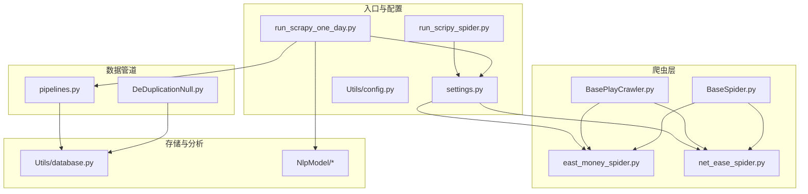
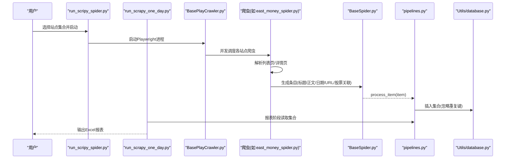
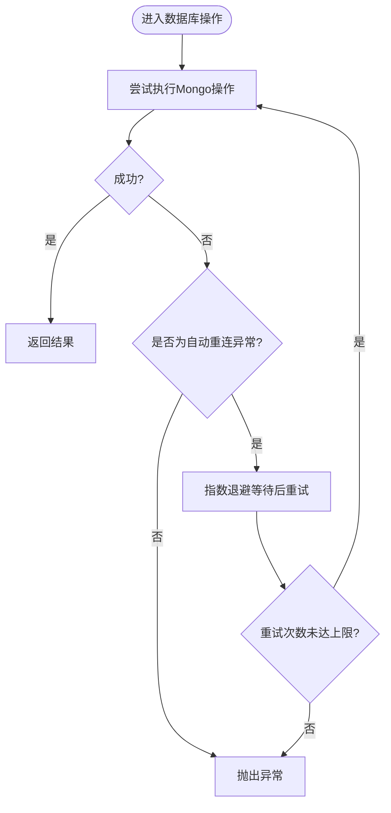
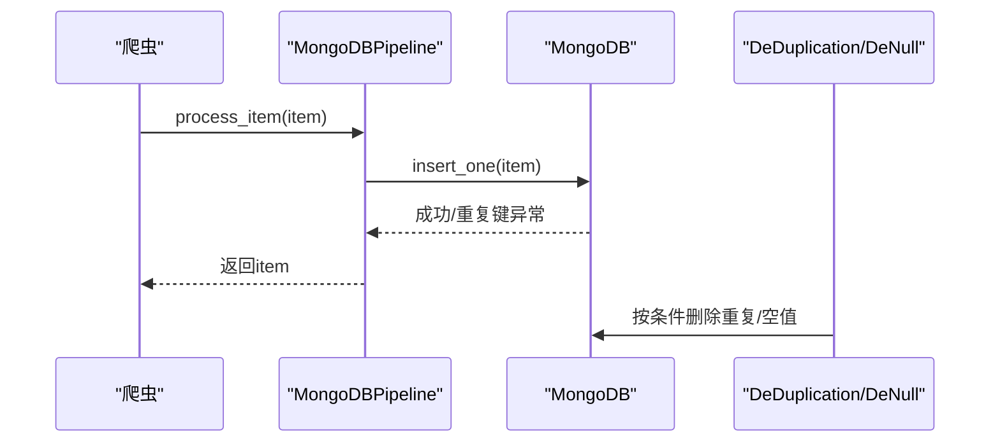
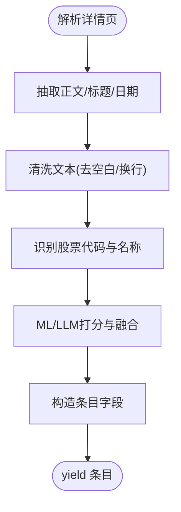
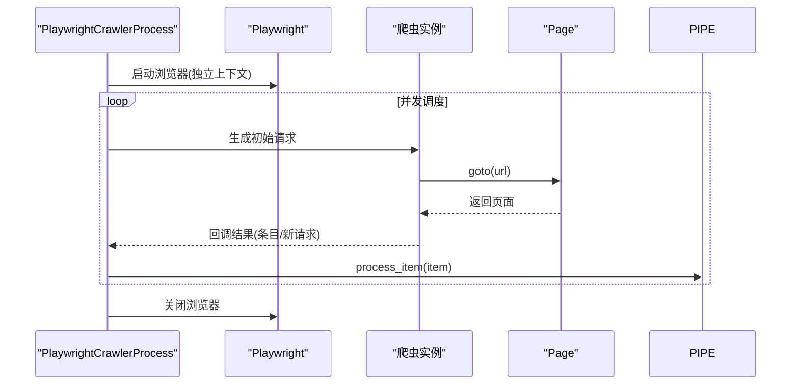
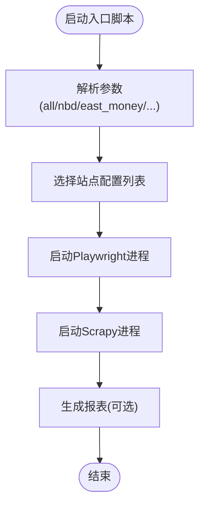
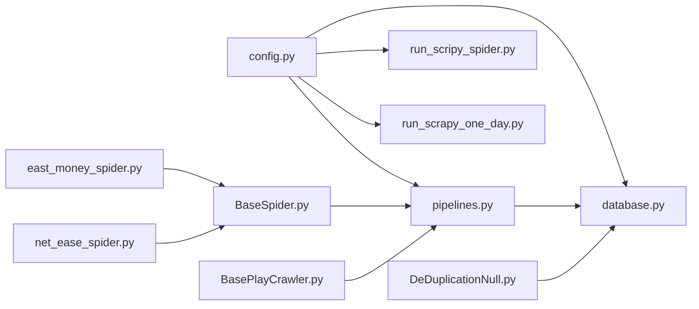

# 故障排除

<cite>
**本文引用的文件**
- [ProblemSolve.md](file://ProblemSolve.md)
- [README.md](file://README.md)
- [src/Utils/config.py](file://src/Utils/config.py)
- [src/Utils/database.py](file://src/Utils/database.py)
- [src/pipelines.py](file://src/pipelines.py)
- [src/run_scripy_spider.py](file://src/run_scripy_spider.py)
- [src/run_scrapy_one_day.py](file://src/run_scrapy_one_day.py)
- [src/settings.py](file://src/settings.py)
- [src/Utils/utils.py](file://src/Utils/utils.py)
- [src/MarketNewsSpiderWithScrapy/BaseSpider.py](file://src/MarketNewsSpiderWithScrapy/BaseSpider.py)
- [src/MarketNewsSpiderWithScrapy/BasePlayCrawler.py](file://src/MarketNewsSpiderWithScrapy/BasePlayCrawler.py)
- [src/MarketNewsSpiderWithScrapy/east_money_spider.py](file://src/MarketNewsSpiderWithScrapy/east_money_spider.py)
- [src/MarketNewsSpiderWithScrapy/net_ease_spider.py](file://src/MarketNewsSpiderWithScrapy/net_ease_spider.py)
- [src/MongoDbComTools/DeDuplicationNull.py](file://src/MongoDbComTools/DeDuplicationNull.py)
</cite>

## 目录
1. [简介](#简介)
2. [项目结构](#项目结构)
3. [核心组件](#核心组件)
4. [架构总览](#架构总览)
5. [详细组件分析](#详细组件分析)
6. [依赖分析](#依赖分析)
7. [性能考虑](#性能考虑)
8. [故障排除指南](#故障排除指南)
9. [结论](#结论)
10. [附录](#附录)

## 简介
本技术文档面向开发者与运维人员，聚焦于“公司新闻爬取与文本情感分析”系统的故障排除。内容涵盖常见问题的诊断方法与解决方案、错误代码与异常含义、日志分析与问题定位技巧、系统崩溃与异常恢复流程、网络与数据库连接问题排查、性能瓶颈与资源限制诊断、爬虫异常与数据处理错误处理策略，以及紧急情况下的应急响应与恢复程序。目标是帮助团队快速定位并解决问题，降低系统停机时间与业务影响。

## 项目结构
该项目采用模块化组织方式，围绕“新闻爬取（Scrapy/Playwright）—数据清洗与去重—存储（MongoDB）—文本分析（NLP）—报表生成”的流水线展开。关键目录与职责如下：
- src/Utils：通用配置、数据库连接、工具函数与日志
- src/MarketNewsSpiderWithScrapy：基于Scrapy与Playwright的爬虫实现
- src/pipelines.py：Scrapy管道，负责将条目写入MongoDB
- src/MongoDbComTools：数据库去重与空值清理工具
- src/NlpModel：文本情感分析与预测模型
- src/run_scripy_spider.py 与 src/run_scrapy_one_day.py：入口脚本，统一调度各站点爬虫与报表生成
- src/settings.py：Scrapy全局配置
- ProblemSolve.md 与 README.md：环境与问题解决要点说明

图表来源
- [src/run_scripy_spider.py:117-145](file://src/run_scripy_spider.py#L117-L145)
- [src/run_scrapy_one_day.py:32-80](file://src/run_scrapy_one_day.py#L32-L80)
- [src/settings.py:1-49](file://src/settings.py#L1-L49)
- [src/MarketNewsSpiderWithScrapy/BaseSpider.py:13-34](file://src/MarketNewsSpiderWithScrapy/BaseSpider.py#L13-L34)
- [src/MarketNewsSpiderWithScrapy/BasePlayCrawler.py:21-62](file://src/MarketNewsSpiderWithScrapy/BasePlayCrawler.py#L21-L62)
- [src/MarketNewsSpiderWithScrapy/east_money_spider.py:5-20](file://src/MarketNewsSpiderWithScrapy/east_money_spider.py#L5-L20)
- [src/MarketNewsSpiderWithScrapy/net_ease_spider.py:9-29](file://src/MarketNewsSpiderWithScrapy/net_ease_spider.py#L9-L29)
- [src/pipelines.py:8-22](file://src/pipelines.py#L8-L22)
- [src/MongoDbComTools/DeDuplicationNull.py:15-62](file://src/MongoDbComTools/DeDuplicationNull.py#L15-L62)
- [src/Utils/database.py:36-61](file://src/Utils/database.py#L36-L61)

章节来源
- [README.md:1-33](file://README.md#L1-L33)
- [src/settings.py:1-49](file://src/settings.py#L1-L49)
- [src/Utils/config.py:1-455](file://src/Utils/config.py#L1-L455)

## 核心组件
- 配置中心（Utils/config.py）：集中管理数据库地址、端口、爬虫站点配置、模型路径与设备类型、ChromeDriver路径等。对不同平台（如Darwin）进行差异化配置。
- 数据库连接（Utils/database.py）：封装MongoDB客户端初始化、集合访问、查询与写入、自动重连装饰器与指数退避策略。
- 爬虫调度（run_scripy_spider.py / run_scrapy_one_day.py）：统一入口，按参数选择站点集合，分别启动Playwright与Scrapy进程。
- 爬虫基类（BaseSpider.py）：定义通用字段抽取、URL去重、股票代码与名称识别、ML/LLM融合打分、生成条目。
- Playwright爬虫进程（BasePlayCrawler.py）：异步并发启动浏览器，为多个爬虫提供独立上下文，统一调度请求与回调。
- 管道（pipelines.py）：将条目写入对应数据库与集合，忽略重复键冲突。
- 工具（Utils/utils.py）：邮件发送、日期计算、中文停用词加载、稀疏矩阵转换等。
- 去重与空值清理（MongoDbComTools/DeDuplicationNull.py）：按日期维度去重、删除空值字段的记录。

章节来源
- [src/Utils/config.py:13-54](file://src/Utils/config.py#L13-L54)
- [src/Utils/database.py:36-176](file://src/Utils/database.py#L36-L176)
- [src/run_scripy_spider.py:117-145](file://src/run_scripy_spider.py#L117-L145)
- [src/run_scrapy_one_day.py:32-80](file://src/run_scrapy_one_day.py#L32-L80)
- [src/MarketNewsSpiderWithScrapy/BaseSpider.py:13-149](file://src/MarketNewsSpiderWithScrapy/BaseSpider.py#L13-L149)
- [src/MarketNewsSpiderWithScrapy/BasePlayCrawler.py:21-120](file://src/MarketNewsSpiderWithScrapy/BasePlayCrawler.py#L21-L120)
- [src/pipelines.py:8-56](file://src/pipelines.py#L8-L56)
- [src/Utils/utils.py:30-58](file://src/Utils/utils.py#L30-L58)
- [src/MongoDbComTools/DeDuplicationNull.py:15-97](file://src/MongoDbComTools/DeDuplicationNull.py#L15-L97)

## 架构总览
系统整体采用“爬取—清洗—存储—分析—报表”的流水线架构。入口脚本根据参数选择站点集合，分别通过Playwright或Scrapy发起请求，解析详情页正文与元信息，调用NLP模块进行情感打分与股票关联，最终通过管道写入MongoDB。报表阶段从各站点集合汇总生成Excel报告。

图表来源
- [src/run_scripy_spider.py:117-145](file://src/run_scripy_spider.py#L117-L145)
- [src/run_scrapy_one_day.py:32-80](file://src/run_scrapy_one_day.py#L32-L80)
- [src/MarketNewsSpiderWithScrapy/BasePlayCrawler.py:41-62](file://src/MarketNewsSpiderWithScrapy/BasePlayCrawler.py#L41-L62)
- [src/MarketNewsSpiderWithScrapy/east_money_spider.py:21-78](file://src/MarketNewsSpiderWithScrapy/east_money_spider.py#L21-L78)
- [src/MarketNewsSpiderWithScrapy/BaseSpider.py:41-98](file://src/MarketNewsSpiderWithScrapy/BaseSpider.py#L41-L98)
- [src/pipelines.py:25-56](file://src/pipelines.py#L25-L56)
- [src/Utils/database.py:78-88](file://src/Utils/database.py#L78-L88)

## 详细组件分析

### 组件A：数据库连接与自动重连（Utils/database.py）
- 自动重连装饰器：在连接断开时按指数退避重试，最多尝试固定次数，避免瞬时抖动导致任务失败。
- 客户端初始化：设置连接池上限、服务器选择超时、认证参数（当前注释），确保稳定连接。
- 查询与写入：提供通用查询、插入、更新、模糊查询接口，支持按键过滤与排序导出DataFrame。

图表来源
- [src/Utils/database.py:15-33](file://src/Utils/database.py#L15-L33)
- [src/Utils/database.py:94-172](file://src/Utils/database.py#L94-L172)

章节来源
- [src/Utils/database.py:15-33](file://src/Utils/database.py#L15-L33)
- [src/Utils/database.py:36-61](file://src/Utils/database.py#L36-L61)
- [src/Utils/database.py:78-172](file://src/Utils/database.py#L78-L172)

### 组件B：Scrapy管道与去重（pipelines.py 与 DeDuplicationNull.py）
- 管道：根据爬虫名称映射至对应数据库与集合，统一插入条目；捕获重复键异常并静默忽略。
- 去重与空值清理：按日期维度去重，删除空值字段的记录，保证数据质量。

图表来源
- [src/pipelines.py:25-56](file://src/pipelines.py#L25-L56)
- [src/MongoDbComTools/DeDuplicationNull.py:15-62](file://src/MongoDbComTools/DeDuplicationNull.py#L15-L62)

章节来源
- [src/pipelines.py:8-56](file://src/pipelines.py#L8-L56)
- [src/MongoDbComTools/DeDuplicationNull.py:15-97](file://src/MongoDbComTools/DeDuplicationNull.py#L15-L97)

### 组件C：爬虫基类与条目生成（BaseSpider.py）
- 条目生成：从段落文本抽取正文，去除多余空白与换行，识别股票代码与名称，调用ML/LLM模型进行情感打分与融合，生成包含URL、日期、标题、正文、相关股票、类别、标签、分数等字段的条目。
- 股票映射：根据站点类型选择不同名称-代码映射表，确保跨市场（A/H/US）正确识别。

图表来源
- [src/MarketNewsSpiderWithScrapy/BaseSpider.py:41-98](file://src/MarketNewsSpiderWithScrapy/BaseSpider.py#L41-L98)
- [src/MarketNewsSpiderWithScrapy/BaseSpider.py:100-146](file://src/MarketNewsSpiderWithScrapy/BaseSpider.py#L100-L146)

章节来源
- [src/MarketNewsSpiderWithScrapy/BaseSpider.py:13-149](file://src/MarketNewsSpiderWithScrapy/BaseSpider.py#L13-L149)

### 组件D：Playwright爬虫进程（BasePlayCrawler.py）
- 异步并发：启动浏览器，为每个爬虫创建独立上下文，避免Cookie与状态互相干扰，提升稳定性与资源利用率。
- 统一调度：维护请求队列，支持Request/Response模拟，回调生成器处理，异常捕获与计数统计。

图表来源
- [src/MarketNewsSpiderWithScrapy/BasePlayCrawler.py:41-62](file://src/MarketNewsSpiderWithScrapy/BasePlayCrawler.py#L41-L62)
- [src/MarketNewsSpiderWithScrapy/BasePlayCrawler.py:64-118](file://src/MarketNewsSpiderWithScrapy/BasePlayCrawler.py#L64-L118)

章节来源
- [src/MarketNewsSpiderWithScrapy/BasePlayCrawler.py:21-120](file://src/MarketNewsSpiderWithScrapy/BasePlayCrawler.py#L21-L120)

### 组件E：入口脚本与站点调度（run_scripy_spider.py / run_scrapy_one_day.py）
- run_scripy_spider.py：按参数选择站点集合，分别添加Playwright与Scrapy爬虫，统一启动。
- run_scrapy_one_day.py：先运行Playwright爬虫，再运行Scrapy爬虫，随后生成报表并输出Excel。

图表来源
- [src/run_scripy_spider.py:117-145](file://src/run_scripy_spider.py#L117-L145)
- [src/run_scrapy_one_day.py:32-80](file://src/run_scrapy_one_day.py#L32-L80)

章节来源
- [src/run_scripy_spider.py:117-145](file://src/run_scripy_spider.py#L117-L145)
- [src/run_scrapy_one_day.py:32-80](file://src/run_scrapy_one_day.py#L32-L80)

## 依赖分析
- 组件耦合
  - 爬虫依赖BaseSpider与配置中心，条目生成依赖NLP模块与股票映射。
  - 管道依赖数据库连接与配置中心，去重工具依赖数据库连接。
  - 入口脚本依赖站点配置列表与爬虫实现。
- 外部依赖
  - MongoDB：作为主存储，需关注连接池、索引与文件句柄限制。
  - Playwright/Chromium：用于动态渲染站点，需关注浏览器资源与超时。
  - Scrapy：静态站点解析，需关注并发与下载超时。
- 潜在环路
  - 当前模块间为单向依赖，未见明显环路。

图表来源
- [src/Utils/config.py:13-54](file://src/Utils/config.py#L13-L54)
- [src/Utils/database.py:36-61](file://src/Utils/database.py#L36-L61)
- [src/pipelines.py:8-22](file://src/pipelines.py#L8-L22)
- [src/run_scripy_spider.py:117-145](file://src/run_scripy_spider.py#L117-L145)
- [src/run_scrapy_one_day.py:32-80](file://src/run_scrapy_one_day.py#L32-L80)
- [src/MarketNewsSpiderWithScrapy/BaseSpider.py:13-34](file://src/MarketNewsSpiderWithScrapy/BaseSpider.py#L13-L34)
- [src/MarketNewsSpiderWithScrapy/BasePlayCrawler.py:21-33](file://src/MarketNewsSpiderWithScrapy/BasePlayCrawler.py#L21-L33)
- [src/MarketNewsSpiderWithScrapy/east_money_spider.py:5-10](file://src/MarketNewsSpiderWithScrapy/east_money_spider.py#L5-L10)
- [src/MarketNewsSpiderWithScrapy/net_ease_spider.py:9-13](file://src/MarketNewsSpiderWithScrapy/net_ease_spider.py#L9-L13)
- [src/MongoDbComTools/DeDuplicationNull.py:15-20](file://src/MongoDbComTools/DeDuplicationNull.py#L15-L20)

章节来源
- [src/Utils/config.py:440-450](file://src/Utils/config.py#L440-L450)
- [src/Utils/database.py:36-61](file://src/Utils/database.py#L36-L61)
- [src/pipelines.py:8-22](file://src/pipelines.py#L8-L22)
- [src/MongoDbComTools/DeDuplicationNull.py:15-20](file://src/MongoDbComTools/DeDuplicationNull.py#L15-L20)

## 性能考虑
- 并发与限流
  - Scrapy并发请求与下载延迟在settings中配置，建议根据目标站点反爬策略与自身带宽调整。
  - Playwright并发运行多个爬虫实例，注意浏览器上下文隔离与内存占用。
- 数据库连接池
  - 数据库连接池上限与服务器选择超时需结合业务峰值与MongoDB资源设定。
- 文本处理与模型推理
  - ML/LLM融合打分会带来额外开销，建议在批量处理时合并请求与缓存中间结果。
- 文件句柄与系统限制
  - macOS上MongoDB默认文件句柄限制较低，可通过系统命令提升限制，避免“打开文件过多”类错误。

章节来源
- [src/settings.py:18-24](file://src/settings.py#L18-L24)
- [src/Utils/database.py:56-58](file://src/Utils/database.py#L56-L58)
- [ProblemSolve.md:18-41](file://ProblemSolve.md#L18-L41)

## 故障排除指南

### 一、常见问题与诊断方法
- 爬虫无法启动或超时
  - 检查入口脚本参数与站点配置是否正确。
  - Playwright爬虫对动态渲染要求较高，确认浏览器可正常启动与页面元素选择器有效。
  - Scrapy爬虫检查下载超时与并发设置。
- 页面解析失败
  - 确认目标站点结构变化，更新选择器与解析逻辑。
  - 对于动态内容，优先使用Playwright；静态HTML使用Scrapy。
- 数据写入失败
  - 检查MongoDB连接与权限配置，确认集合存在与索引建立。
  - 若出现重复键异常，确认去重策略与唯一键约束。

章节来源
- [src/run_scripy_spider.py:117-145](file://src/run_scripy_spider.py#L117-L145)
- [src/run_scrapy_one_day.py:32-80](file://src/run_scrapy_one_day.py#L32-L80)
- [src/MarketNewsSpiderWithScrapy/BasePlayCrawler.py:86-118](file://src/MarketNewsSpiderWithScrapy/BasePlayCrawler.py#L86-L118)
- [src/MarketNewsSpiderWithScrapy/net_ease_spider.py:31-68](file://src/MarketNewsSpiderWithScrapy/net_ease_spider.py#L31-L68)
- [src/pipelines.py:48-56](file://src/pipelines.py#L48-L56)

### 二、错误代码与含义
- PyMongo AutoReconnect
  - 含义：MongoDB连接短暂中断，触发自动重连。
  - 处理：启用装饰器与指数退避，必要时检查网络与MongoDB状态。
- DuplicateKeyError
  - 含义：插入重复键，通常由唯一索引或MD5主键冲突引起。
  - 处理：管道中已忽略重复键；若仍出现，检查去重策略与集合索引。
- “打开文件过多”（Too many open files）
  - 含义：系统文件句柄上限过低，尤其在大量并发爬取与数据库连接时。
  - 处理：提升系统文件句柄限制，优化连接池与并发策略。

章节来源
- [src/Utils/database.py:24-31](file://src/Utils/database.py#L24-L31)
- [src/pipelines.py:53-56](file://src/pipelines.py#L53-L56)
- [ProblemSolve.md:38-41](file://ProblemSolve.md#L38-L41)

### 三、日志分析与问题定位
- 日志级别与格式
  - 使用标准日志模块，输出时间、文件名、行号、级别与消息，便于定位。
- 关键日志点
  - 爬虫：请求URL、解析结果、异常堆栈。
  - 数据库：连接初始化、查询/插入结果、警告信息。
  - 管道：条目写入状态、重复键忽略记录。
- 分析技巧
  - 结合时间戳与URL定位具体请求，核对页面结构变化与反爬策略。
  - 观察数据库写入频率与错误分布，判断是否存在热点键或索引缺失。

章节来源
- [src/Utils/utils.py:18-22](file://src/Utils/utils.py#L18-L22)
- [src/Utils/database.py:26-30](file://src/Utils/database.py#L26-L30)
- [src/pipelines.py:48-56](file://src/pipelines.py#L48-L56)

### 四、系统崩溃与异常恢复
- 自动重连与退避
  - 数据库连接断开时自动重试，避免单次异常导致任务失败。
- 爬虫异常处理
  - Playwright爬虫对单请求异常进行捕获与记录，不影响其他并发任务。
- 恢复步骤
  - 重启入口脚本；检查MongoDB与浏览器状态；核对配置与站点结构。
  - 对于重复键异常，执行去重与空值清理工具，重建索引。

章节来源
- [src/Utils/database.py:15-33](file://src/Utils/database.py#L15-L33)
- [src/MarketNewsSpiderWithScrapy/BasePlayCrawler.py:113-118](file://src/MarketNewsSpiderWithScrapy/BasePlayCrawler.py#L113-L118)
- [src/MongoDbComTools/DeDuplicationNull.py:15-97](file://src/MongoDbComTools/DeDuplicationNull.py#L15-L97)

### 五、网络连接与数据库连接问题排查
- 网络问题
  - 下载超时与代理设置：调整settings中的下载超时与代理中间件。
  - 动态渲染：确认Playwright浏览器可用与页面加载选择器有效。
- 数据库问题
  - 连接池与超时：根据业务峰值调整最大连接数与服务器选择超时。
  - 文件句柄：提升系统文件句柄上限，避免“打开文件过多”。

章节来源
- [src/settings.py:21-30](file://src/settings.py#L21-L30)
- [src/Utils/database.py:56-58](file://src/Utils/database.py#L56-L58)
- [ProblemSolve.md:18-41](file://ProblemSolve.md#L18-L41)

### 六、性能问题与资源瓶颈诊断
- 并发过高导致超时或被封禁
  - 降低并发、增加延时、轮换User-Agent与IP代理。
- 数据库写入瓶颈
  - 使用批量插入、合理索引、拆分集合与分片。
- 文本处理与模型推理
  - 合并请求、缓存中间结果、使用GPU加速（如可用）。
- 系统资源
  - 监控CPU、内存、文件句柄与网络带宽，及时扩容或限流。

章节来源
- [src/settings.py:18-24](file://src/settings.py#L18-L24)
- [src/Utils/database.py:56-58](file://src/Utils/database.py#L56-L58)
- [src/Utils/config.py:452-455](file://src/Utils/config.py#L452-L455)

### 七、爬虫异常与数据处理错误处理策略
- 页面结构变化
  - 更新选择器与解析逻辑；对异常页面记录日志并跳过。
- 编码与字符集
  - 统一编码设置，避免乱码；对特殊字符进行清洗。
- 条目完整性
  - 缺失字段填充默认值或标记为空；对空值进行清理。
- 去重与一致性
  - 基于MD5主键与唯一索引去重；定期执行去重与空值清理工具。

章节来源
- [src/MarketNewsSpiderWithScrapy/east_money_spider.py:27-30](file://src/MarketNewsSpiderWithScrapy/east_money_spider.py#L27-L30)
- [src/MarketNewsSpiderWithScrapy/BaseSpider.py:53-57](file://src/MarketNewsSpiderWithScrapy/BaseSpider.py#L53-L57)
- [src/pipelines.py:48-56](file://src/pipelines.py#L48-L56)
- [src/MongoDbComTools/DeDuplicationNull.py:72-88](file://src/MongoDbComTools/DeDuplicationNull.py#L72-L88)

### 八、紧急响应与恢复程序
- 快速恢复
  - 重启入口脚本与数据库；检查浏览器与网络连通性。
  - 对异常站点临时降级或跳过，优先保障主干流程。
- 数据修复
  - 执行去重与空值清理；重建缺失索引；验证数据完整性。
- 监控与告警
  - 增加关键指标监控（成功率、延迟、错误率）与自动化告警。

章节来源
- [src/run_scripy_spider.py:117-145](file://src/run_scripy_spider.py#L117-L145)
- [src/MongoDbComTools/DeDuplicationNull.py:15-97](file://src/MongoDbComTools/DeDuplicationNull.py#L15-L97)

## 结论
本系统通过模块化设计与完善的异常处理机制，能够在复杂网络环境下稳定运行。故障排除的关键在于：明确日志定位、合理配置并发与连接池、及时处理重复键与文件句柄问题、对动态与静态站点采用合适的爬取策略，并在紧急情况下快速恢复与修复数据。建议持续完善监控与告警体系，以进一步降低风险与停机时间。

## 附录
- 环境与依赖
  - macOS：安装与卸载Homebrew、MongoDB、Redis、ChromeDriver等。
  - Python包：根据仓库内说明安装必要依赖。
- 常用命令
  - brew安装/卸载/更新/清理；MongoDB服务启停；ChromeDriver权限修正；Matplotlib字体问题处理。

章节来源
- [ProblemSolve.md:1-68](file://ProblemSolve.md#L1-L68)