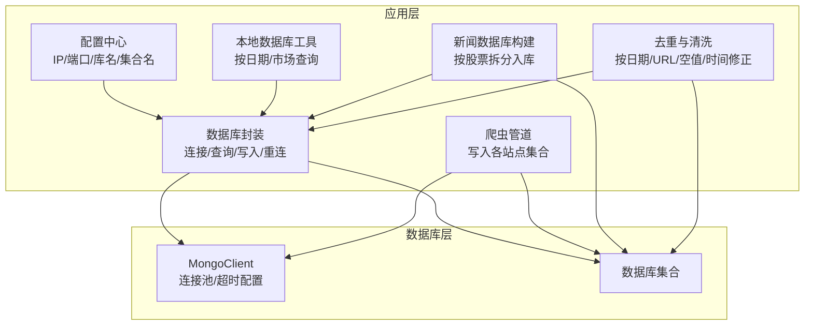
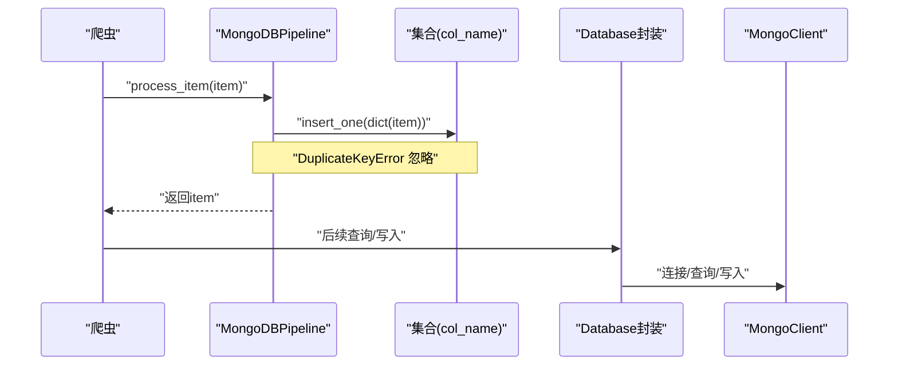
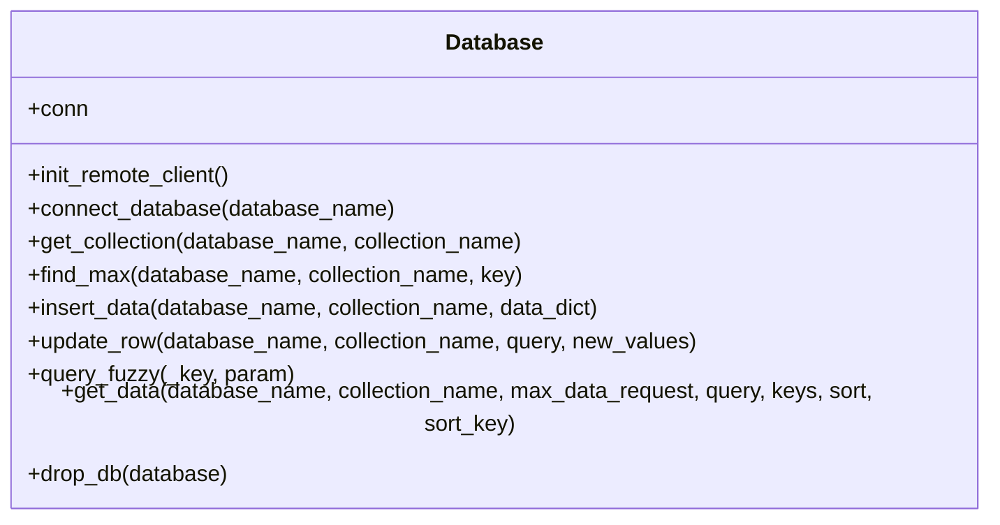
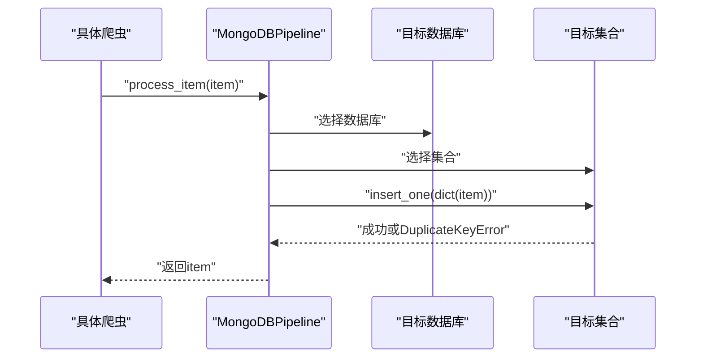
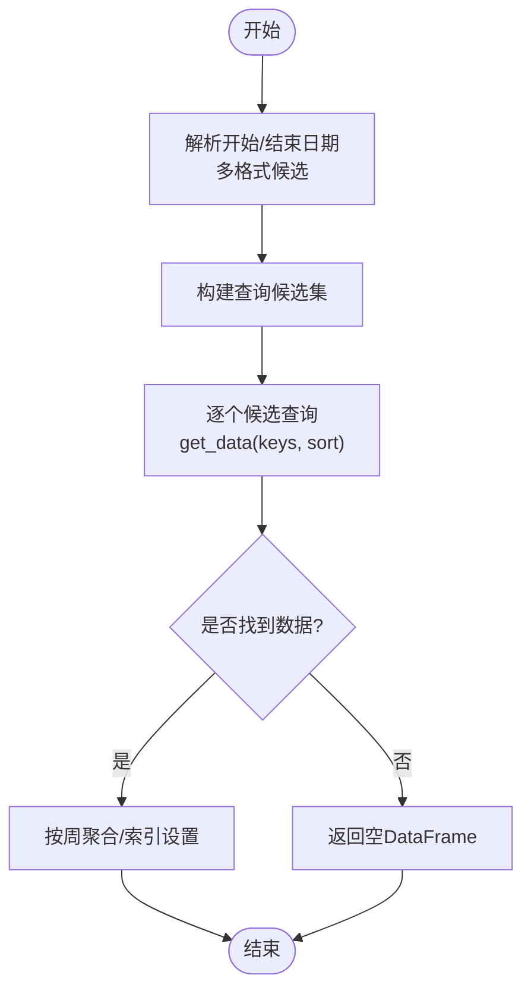
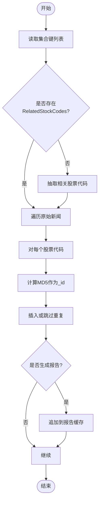
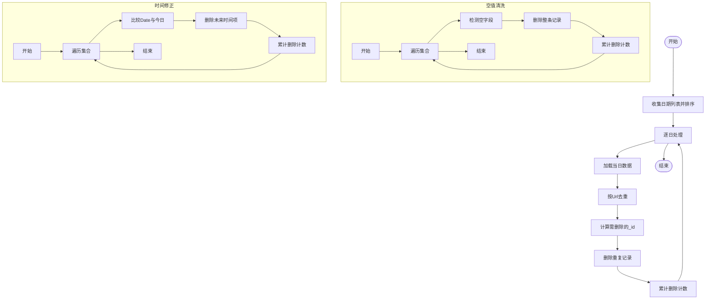
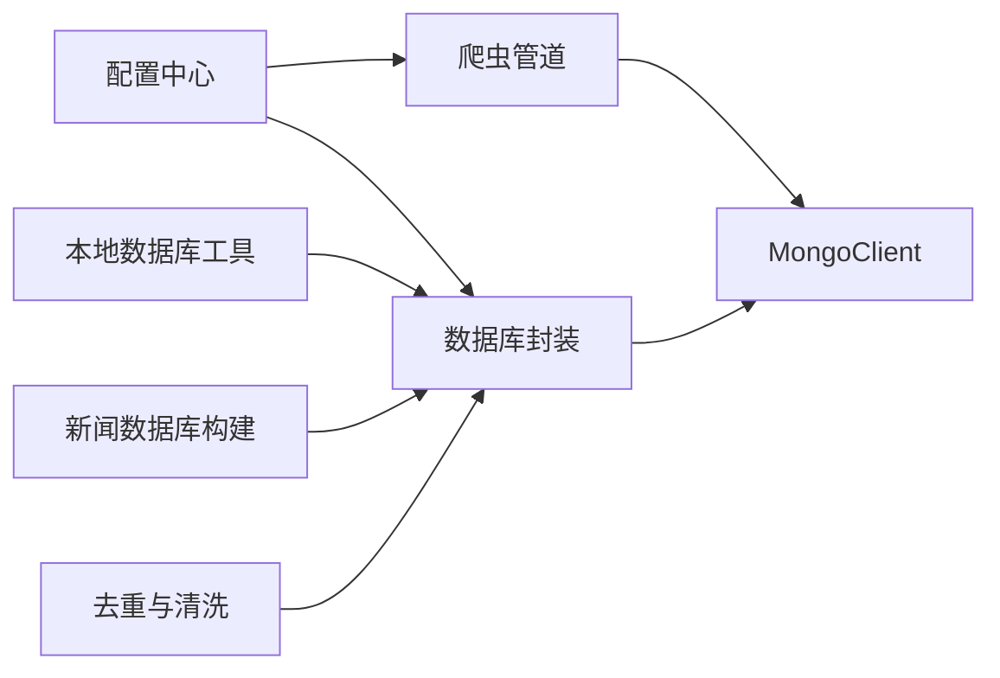

# 数据库问题排查

<cite>
**本文引用的文件**   
- [src/Utils/database.py](file://src/Utils/database.py)
- [src/Utils/config.py](file://src/Utils/config.py)
- [src/pipelines.py](file://src/pipelines.py)
- [src/MongoDbComTools/LocalDbTool.py](file://src/MongoDbComTools/LocalDbTool.py)
- [src/MongoDbComTools/BuildStockNewsDb.py](file://src/MongoDbComTools/BuildStockNewsDb.py)
- [src/MongoDbComTools/DeDuplicationNull.py](file://src/MongoDbComTools/DeDuplicationNull.py)
- [ProblemSolve.md](file://ProblemSolve.md)
- [README.md](file://README.md)
</cite>

## 目录
1. [简介](#简介)
2. [项目结构](#项目结构)
3. [核心组件](#核心组件)
4. [架构总览](#架构总览)
5. [详细组件分析](#详细组件分析)
6. [依赖分析](#依赖分析)
7. [性能考量](#性能考量)
8. [故障排查指南](#故障排查指南)
9. [结论](#结论)
10. [附录](#附录)

## 简介
本文件面向数据库问题排查与运维场景，聚焦于MongoDB连接失败、索引创建错误、数据导入异常、性能瓶颈、连接池与超时配置、并发控制、备份恢复、数据一致性检查与修复、监控与告警、数据迁移与版本升级、以及故障预防与最佳实践。结合仓库中的数据库访问封装、爬虫数据写入管道、本地数据库工具与去重清洗工具，给出可操作的诊断步骤、优化策略与排障流程。

## 项目结构
该项目围绕“新闻爬取—文本分析—数据库存储—数据分析”的主线展开，数据库相关的关键模块如下：
- 数据库访问封装：统一初始化Mongo客户端、集合访问、查询与写入、自动重连策略
- 配置中心：数据库地址、端口、库名与集合名常量
- 爬虫管道：将各站点爬取结果写入对应数据库/集合
- 本地数据库工具：按市场类型与日期范围查询股票行情与基础信息
- 新闻数据库构建：抽取新闻中涉及的股票，生成按股票维度的新闻库
- 去重与清洗：按日期与URL去重、删除空字段、修正异常时间

图表来源
- [src/Utils/database.py:36-176](file://src/Utils/database.py#L36-L176)
- [src/Utils/config.py:13-50](file://src/Utils/config.py#L13-L50)
- [src/pipelines.py:8-56](file://src/pipelines.py#L8-L56)
- [src/MongoDbComTools/LocalDbTool.py:10-277](file://src/MongoDbComTools/LocalDbTool.py#L10-L277)
- [src/MongoDbComTools/BuildStockNewsDb.py:19-241](file://src/MongoDbComTools/BuildStockNewsDb.py#L19-L241)
- [src/MongoDbComTools/DeDuplicationNull.py:15-122](file://src/MongoDbComTools/DeDuplicationNull.py#L15-L122)

章节来源
- [src/Utils/database.py:36-176](file://src/Utils/database.py#L36-L176)
- [src/Utils/config.py:13-50](file://src/Utils/config.py#L13-L50)
- [src/pipelines.py:8-56](file://src/pipelines.py#L8-L56)
- [src/MongoDbComTools/LocalDbTool.py:10-277](file://src/MongoDbComTools/LocalDbTool.py#L10-L277)
- [src/MongoDbComTools/BuildStockNewsDb.py:19-241](file://src/MongoDbComTools/BuildStockNewsDb.py#L19-L241)
- [src/MongoDbComTools/DeDuplicationNull.py:15-122](file://src/MongoDbComTools/DeDuplicationNull.py#L15-L122)

## 核心组件
- 数据库封装类：负责Mongo客户端初始化、数据库与集合获取、查询与写入、自动重连装饰器
- 爬虫管道：按站点名称映射到目标数据库/集合，插入单条记录，忽略重复键冲突
- 本地数据库工具：支持按市场类型与日期范围查询股票行情，构造周线数据，支持多格式日期候选解析
- 新闻数据库构建：从原始新闻集合提取相关股票代码，按股票符号拆分入库，避免重复
- 去重与清洗：按日期批量扫描，基于URL去重；删除空字段；删除未来时间项

章节来源
- [src/Utils/database.py:36-176](file://src/Utils/database.py#L36-L176)
- [src/pipelines.py:8-56](file://src/pipelines.py#L8-L56)
- [src/MongoDbComTools/LocalDbTool.py:10-277](file://src/MongoDbComTools/LocalDbTool.py#L10-L277)
- [src/MongoDbComTools/BuildStockNewsDb.py:19-241](file://src/MongoDbComTools/BuildStockNewsDb.py#L19-L241)
- [src/MongoDbComTools/DeDuplicationNull.py:15-122](file://src/MongoDbComTools/DeDuplicationNull.py#L15-L122)

## 架构总览
下图展示从爬虫到数据库的写入链路，以及本地查询与数据加工路径：

图表来源
- [src/pipelines.py:25-56](file://src/pipelines.py#L25-L56)
- [src/Utils/database.py:78-88](file://src/Utils/database.py#L78-L88)

## 详细组件分析

### 组件A：数据库封装与自动重连
- 关键点
  - 初始化Mongo客户端时设置serverSelectionTimeoutMS与maxPoolSize
  - 提供连接数据库、获取集合、插入、更新、模糊查询、最大值查询、删除库等方法
  - 使用装饰器对读取操作进行指数退避自动重连，限制最大重试次数
  - 查询接口支持条件过滤、字段选择、数量上限、排序等

图表来源
- [src/Utils/database.py:36-176](file://src/Utils/database.py#L36-L176)

章节来源
- [src/Utils/database.py:36-176](file://src/Utils/database.py#L36-L176)

### 组件B：爬虫管道与写入策略
- 关键点
  - 根据爬虫名称映射到目标数据库与集合
  - 插入单条记录，捕获重复键错误并忽略
  - 通过配置中心常量管理数据库与集合命名

图表来源
- [src/pipelines.py:25-56](file://src/pipelines.py#L25-L56)

章节来源
- [src/pipelines.py:8-56](file://src/pipelines.py#L8-L56)
- [src/Utils/config.py:55-450](file://src/Utils/config.py#L55-L450)

### 组件C：本地数据库工具与日期查询
- 关键点
  - 支持按市场类型（cn/hk/us）与日期范围查询股票行情
  - 对输入日期提供多种格式候选解析，去重后生成查询条件
  - 支持按日期排序与周线聚合

图表来源
- [src/MongoDbComTools/LocalDbTool.py:127-277](file://src/MongoDbComTools/LocalDbTool.py#L127-L277)

章节来源
- [src/MongoDbComTools/LocalDbTool.py:10-277](file://src/MongoDbComTools/LocalDbTool.py#L10-L277)

### 组件D：新闻数据库构建与按股票拆分
- 关键点
  - 从原始新闻集合读取，若未提取相关股票代码则先进行分词抽取
  - 以MD5(URL+日期)作为去重主键，避免重复入库
  - 将每条新闻按涉及的股票拆分写入对应集合

图表来源
- [src/MongoDbComTools/BuildStockNewsDb.py:157-241](file://src/MongoDbComTools/BuildStockNewsDb.py#L157-L241)

章节来源
- [src/MongoDbComTools/BuildStockNewsDb.py:19-241](file://src/MongoDbComTools/BuildStockNewsDb.py#L19-L241)

### 组件E：去重与清洗
- 关键点
  - 按日期粒度扫描，基于URL去重，删除多余重复项
  - 删除空字符串字段（除特定键外），减少脏数据
  - 删除未来时间项，保证数据时间有效性

图表来源
- [src/MongoDbComTools/DeDuplicationNull.py:22-122](file://src/MongoDbComTools/DeDuplicationNull.py#L22-L122)

章节来源
- [src/MongoDbComTools/DeDuplicationNull.py:15-122](file://src/MongoDbComTools/DeDuplicationNull.py#L15-L122)

## 依赖分析
- 组件耦合
  - 管道依赖配置中心常量确定数据库/集合
  - 本地工具与新闻构建工具均依赖数据库封装
  - 去重清洗工具直接操作集合，依赖数据库封装
- 外部依赖
  - pymongo用于MongoDB连接与操作
  - pandas用于数据转换与聚合
  - cryptography用于配置中敏感信息的解密

图表来源
- [src/Utils/config.py:13-50](file://src/Utils/config.py#L13-L50)
- [src/pipelines.py:8-22](file://src/pipelines.py#L8-L22)
- [src/Utils/database.py:36-60](file://src/Utils/database.py#L36-L60)
- [src/MongoDbComTools/LocalDbTool.py:10-44](file://src/MongoDbComTools/LocalDbTool.py#L10-L44)
- [src/MongoDbComTools/BuildStockNewsDb.py:19-53](file://src/MongoDbComTools/BuildStockNewsDb.py#L19-L53)
- [src/MongoDbComTools/DeDuplicationNull.py:15-21](file://src/MongoDbComTools/DeDuplicationNull.py#L15-L21)

章节来源
- [src/Utils/config.py:13-50](file://src/Utils/config.py#L13-L50)
- [src/pipelines.py:8-56](file://src/pipelines.py#L8-L56)
- [src/Utils/database.py:36-176](file://src/Utils/database.py#L36-L176)
- [src/MongoDbComTools/LocalDbTool.py:10-277](file://src/MongoDbComTools/LocalDbTool.py#L10-L277)
- [src/MongoDbComTools/BuildStockNewsDb.py:19-241](file://src/MongoDbComTools/BuildStockNewsDb.py#L19-L241)
- [src/MongoDbComTools/DeDuplicationNull.py:15-122](file://src/MongoDbComTools/DeDuplicationNull.py#L15-L122)

## 性能考量
- 连接池与超时
  - serverSelectionTimeoutMS：控制服务器选择超时，建议在高延迟网络或副本集场景下调优
  - maxPoolSize：连接池大小，应结合并发写入与查询峰值评估，避免过大导致资源占用过高
- 并发控制
  - 写入侧：管道使用单条insert_one，重复键忽略；如需批量写入，建议使用批量插入并合理设置batch大小
  - 读取侧：get_data支持keys与max_data_request，避免一次性拉取海量数据
- 索引与查询
  - 建议在高频查询字段（如Date、Url、Symbol等）建立合适索引，减少全表扫描
  - 日期范围查询建议使用复合索引，提升范围扫描效率
- 自动重连
  - 读取操作具备指数退避自动重连，避免瞬断导致任务失败；建议同时监控重连次数与耗时

章节来源
- [src/Utils/database.py:50-60](file://src/Utils/database.py#L50-L60)
- [src/Utils/database.py:94-172](file://src/Utils/database.py#L94-L172)
- [src/pipelines.py:48-56](file://src/pipelines.py#L48-L56)

## 故障排查指南

### 1. 连接失败
- 症状
  - 启动时报Mongo连接超时或无法选择服务器
- 排查步骤
  - 检查MONGODB_IP与MONGODB_PORT是否正确
  - 检查防火墙与网络连通性
  - 调整serverSelectionTimeoutMS，增大超时时间
  - 若为副本集，确认主节点可达
- 参考
  - [src/Utils/config.py:13-16](file://src/Utils/config.py#L13-L16)
  - [src/Utils/database.py:50-60](file://src/Utils/database.py#L50-L60)

章节来源
- [src/Utils/config.py:13-16](file://src/Utils/config.py#L13-L16)
- [src/Utils/database.py:50-60](file://src/Utils/database.py#L50-L60)

### 2. 索引创建错误
- 症状
  - 创建索引报错（如字段不存在、权限不足、重复索引）
- 排查步骤
  - 确认目标字段存在且类型正确
  - 检查用户权限（如dbAdmin等）
  - 使用唯一索引前，确保数据唯一性
  - 参考系统文档与ulimit限制（参考仓库中的Mongo ulimit说明）
- 参考
  - [ProblemSolve.md:18-41](file://ProblemSolve.md#L18-L41)

章节来源
- [ProblemSolve.md:18-41](file://ProblemSolve.md#L18-L41)

### 3. 数据导入异常
- 症状
  - 导入大量数据时出现超时、内存飙升、重复键冲突
- 排查步骤
  - 写入侧：使用批量插入（建议配合事务与错误处理），避免单条插入过多
  - 读取侧：使用keys与max_data_request限制数据规模
  - 重复键：管道已忽略DuplicateKeyError，如需幂等更新，改为upsert策略
- 参考
  - [src/pipelines.py:48-56](file://src/pipelines.py#L48-L56)
  - [src/Utils/database.py:94-172](file://src/Utils/database.py#L94-L172)

章节来源
- [src/pipelines.py:48-56](file://src/pipelines.py#L48-L56)
- [src/Utils/database.py:94-172](file://src/Utils/database.py#L94-L172)

### 4. 数据一致性与重复
- 症状
  - URL重复、空字段、未来时间数据
- 排查步骤
  - 按日期扫描，基于URL去重
  - 删除空字段记录
  - 删除未来时间项
- 参考
  - [src/MongoDbComTools/DeDuplicationNull.py:22-122](file://src/MongoDbComTools/DeDuplicationNull.py#L22-L122)

章节来源
- [src/MongoDbComTools/DeDuplicationNull.py:22-122](file://src/MongoDbComTools/DeDuplicationNull.py#L22-L122)

### 5. 查询性能与索引优化
- 症状
  - 日期范围查询慢、模糊匹配慢
- 排查步骤
  - 为Date、Url、Symbol等字段建立合适索引
  - 使用复合索引优化范围查询
  - 读取侧尽量缩小字段集与数据量
- 参考
  - [src/MongoDbComTools/LocalDbTool.py:127-277](file://src/MongoDbComTools/LocalDbTool.py#L127-L277)
  - [src/Utils/database.py:94-172](file://src/Utils/database.py#L94-L172)

章节来源
- [src/MongoDbComTools/LocalDbTool.py:127-277](file://src/MongoDbComTools/LocalDbTool.py#L127-L277)
- [src/Utils/database.py:94-172](file://src/Utils/database.py#L94-L172)

### 6. 自动重连与稳定性
- 症状
  - 瞬间断开导致读取失败
- 排查步骤
  - 使用装饰器包装读取函数，启用指数退避重连
  - 监控重连次数与耗时，必要时降低并发或增加池大小
- 参考
  - [src/Utils/database.py:15-33](file://src/Utils/database.py#L15-L33)
  - [src/Utils/database.py:94-172](file://src/Utils/database.py#L94-L172)

章节来源
- [src/Utils/database.py:15-33](file://src/Utils/database.py#L15-L33)
- [src/Utils/database.py:94-172](file://src/Utils/database.py#L94-L172)

### 7. 备份与恢复
- 建议
  - 使用mongodump/mongorestore进行逻辑备份与恢复
  - 对重要集合定期快照，验证恢复流程
- 参考
  - [ProblemSolve.md:18-36](file://ProblemSolve.md#L18-L36)

章节来源
- [ProblemSolve.md:18-36](file://ProblemSolve.md#L18-L36)

### 8. 监控与告警
- 建议
  - 监控连接池使用率、查询耗时、索引命中率、重连次数
  - 设置阈值告警（如连接池耗尽、查询超时、重复键异常增多）
- 参考
  - [src/Utils/database.py:50-60](file://src/Utils/database.py#L50-L60)

章节来源
- [src/Utils/database.py:50-60](file://src/Utils/database.py#L50-L60)

### 9. 数据迁移与版本升级
- 建议
  - 迁移前冻结写入或采用只读窗口
  - 使用导出/导入工具进行结构变更后的数据迁移
  - 对新旧字段进行兼容处理与默认值填充
- 参考
  - [ProblemSolve.md:18-36](file://ProblemSolve.md#L18-L36)

章节来源
- [ProblemSolve.md:18-36](file://ProblemSolve.md#L18-L36)

### 10. 故障预防与最佳实践
- 连接与池
  - 合理设置maxPoolSize与serverSelectionTimeoutMS
  - 使用装饰器增强读取稳定性
- 写入与幂等
  - 批量写入时使用upsert并处理DuplicateKeyError
  - 以MD5(URL+日期)作为去重主键
- 查询与索引
  - 为高频查询字段建立索引，避免全表扫描
  - 控制单次查询数据量，使用keys与max_data_request
- 数据质量
  - 定期去重（按URL）、清洗空值、修正未来时间
- 文档与流程
  - 记录索引与集合结构变更，形成变更清单
  - 建立备份与演练流程

章节来源
- [src/Utils/database.py:50-60](file://src/Utils/database.py#L50-L60)
- [src/pipelines.py:48-56](file://src/pipelines.py#L48-L56)
- [src/MongoDbComTools/DeDuplicationNull.py:22-122](file://src/MongoDbComTools/DeDuplicationNull.py#L22-L122)

## 结论
本项目通过统一的数据库封装、清晰的配置中心、完善的爬虫写入管道与本地查询工具，形成了较为稳健的数据采集与存储体系。针对常见问题，建议优先从连接池与超时、索引与查询优化、去重与清洗、自动重连与监控等方面入手，结合定期备份与演练，持续提升系统的稳定性与可维护性。

## 附录
- 相关说明与背景
  - 项目整体说明与功能定位
  - MongoDB安装与服务管理参考
- 参考
  - [README.md:1-33](file://README.md#L1-L33)
  - [ProblemSolve.md:18-36](file://ProblemSolve.md#L18-L36)

章节来源
- [README.md:1-33](file://README.md#L1-L33)
- [ProblemSolve.md:18-36](file://ProblemSolve.md#L18-L36)