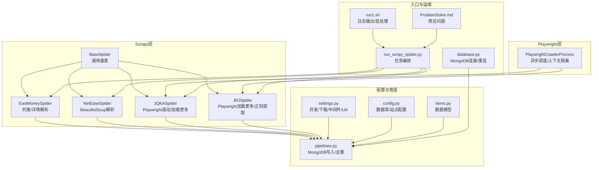
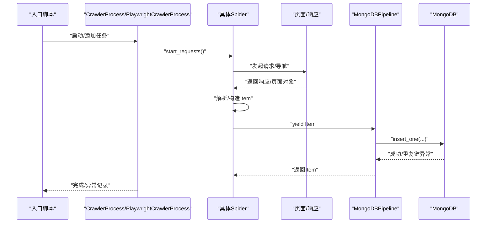
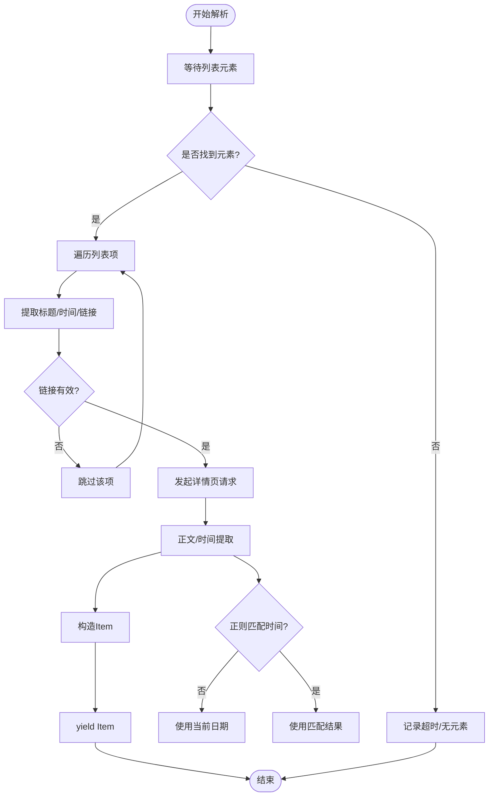
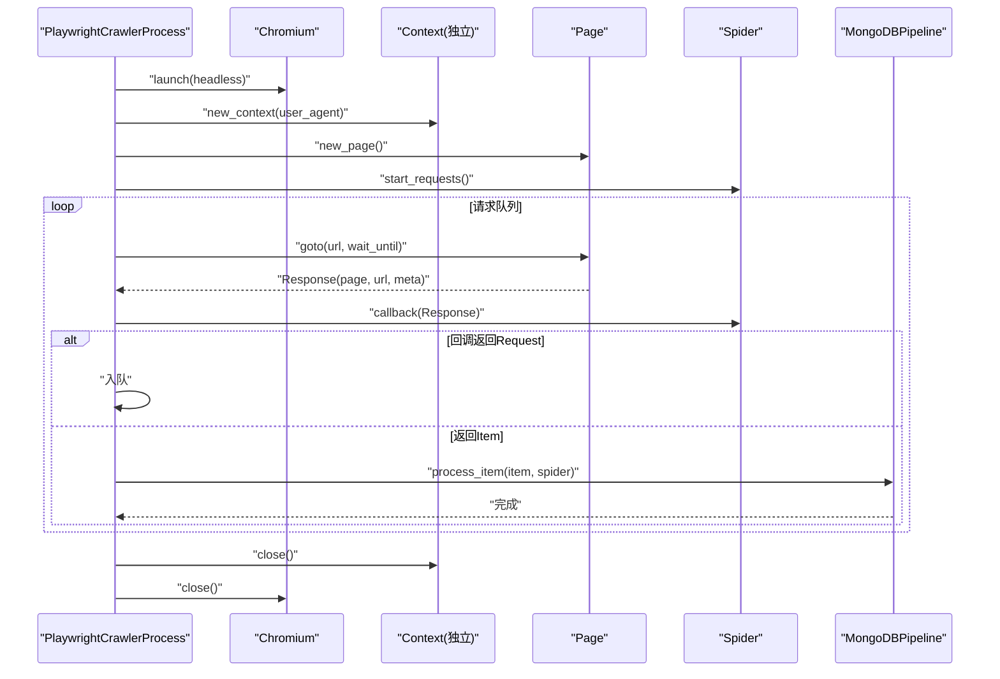
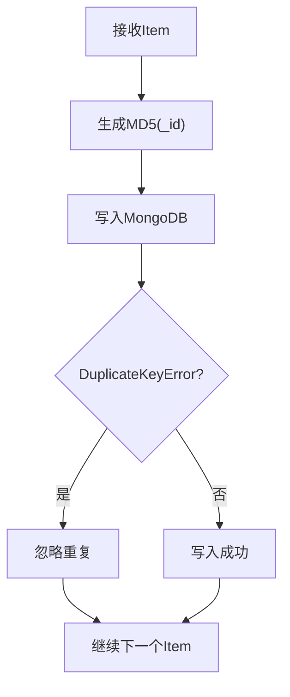
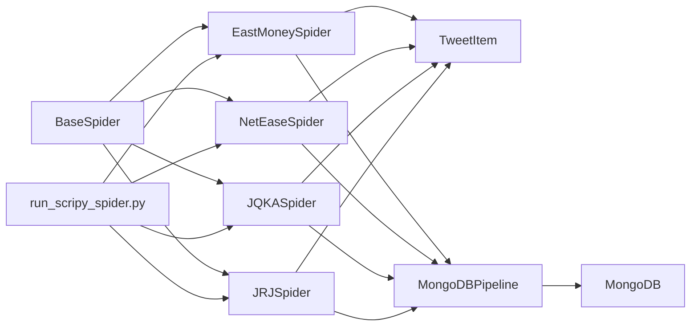

# 爬虫异常处理

<cite>
**本文引用的文件**
- [BaseSpider.py](file://src/MarketNewsSpiderWithScrapy/BaseSpider.py)
- [BasePlayCrawler.py](file://src/MarketNewsSpiderWithScrapy/BasePlayCrawler.py)
- [settings.py](file://src/settings.py)
- [pipelines.py](file://src/pipelines.py)
- [config.py](file://src/Utils/config.py)
- [east_money_spider.py](file://src/MarketNewsSpiderWithScrapy/east_money_spider.py)
- [jqka_spider.py](file://src/MarketNewsSpiderWithScrapy/jqka_spider.py)
- [jrj_spider.py](file://src/MarketNewsSpiderWithScrapy/jrj_spider.py)
- [net_ease_spider.py](file://src/MarketNewsSpiderWithScrapy/net_ease_spider.py)
- [items.py](file://src/Utils/items.py)
- [run_scripy_spider.py](file://src/run_scripy_spider.py)
- [database.py](file://src/Utils/database.py)
- [run1.sh](file://src/run1.sh)
- [ProblemSolve.md](file://ProblemSolve.md)
</cite>

## 目录
1. [引言](#引言)
2. [项目结构](#项目结构)
3. [核心组件](#核心组件)
4. [架构总览](#架构总览)
5. [详细组件分析](#详细组件分析)
6. [依赖分析](#依赖分析)
7. [性能考虑](#性能考虑)
8. [故障排查指南](#故障排查指南)
9. [结论](#结论)
10. [附录](#附录)

## 引言
本文件围绕该仓库中的新闻爬虫体系，系统梳理Scrapy与Playwright混合模式下的异常处理策略，覆盖网络请求失败、页面解析错误、反爬虫应对、配置优化、代理与UA轮换、监控与健康检查、数据完整性与去重、性能调优与资源限制、日志分析与调试、以及被封禁后的恢复与替代方案。目标是帮助读者在生产环境中稳定、高效地运行多站点、多类型的新闻采集任务。

## 项目结构
该项目采用Scrapy与Playwright结合的方式，既有基于Scrapy的Spider，也有自研的Playwright异步调度器，统一通过管道写入MongoDB。配置集中于settings与Utils/config，数据模型定义在items中，入口脚本负责拼装多个Spider任务。

图表来源
- [BaseSpider.py:13-39](file://src/MarketNewsSpiderWithScrapy/BaseSpider.py#L13-L39)
- [east_money_spider.py:5-78](file://src/MarketNewsSpiderWithScrapy/east_money_spider.py#L5-L78)
- [net_ease_spider.py:9-68](file://src/MarketNewsSpiderWithScrapy/net_ease_spider.py#L9-L68)
- [jqka_spider.py:8-80](file://src/MarketNewsSpiderWithScrapy/jqka_spider.py#L8-L80)
- [jrj_spider.py:7-94](file://src/MarketNewsSpiderWithScrapy/jrj_spider.py#L7-L94)
- [BasePlayCrawler.py:21-120](file://src/MarketNewsSpiderWithScrapy/BasePlayCrawler.py#L21-L120)
- [settings.py:18-47](file://src/settings.py#L18-L47)
- [pipelines.py:8-56](file://src/pipelines.py#L8-L56)
- [config.py:55-450](file://src/Utils/config.py#L55-L450)
- [items.py:5-18](file://src/Utils/items.py#L5-L18)
- [run_scripy_spider.py:117-145](file://src/run_scripy_spider.py#L117-L145)
- [database.py:36-176](file://src/Utils/database.py#L36-L176)
- [run1.sh:1-49](file://src/run1.sh#L1-L49)
- [ProblemSolve.md:18-68](file://ProblemSolve.md#L18-L68)

章节来源
- [BaseSpider.py:13-149](file://src/MarketNewsSpiderWithScrapy/BaseSpider.py#L13-L149)
- [BasePlayCrawler.py:21-120](file://src/MarketNewsSpiderWithScrapy/BasePlayCrawler.py#L21-L120)
- [settings.py:18-47](file://src/settings.py#L18-L47)
- [pipelines.py:8-56](file://src/pipelines.py#L8-L56)
- [config.py:55-450](file://src/Utils/config.py#L55-L450)
- [items.py:5-18](file://src/Utils/items.py#L5-L18)
- [run_scripy_spider.py:117-145](file://src/run_scripy_spider.py#L117-L145)
- [database.py:36-176](file://src/Utils/database.py#L36-L176)
- [run1.sh:1-49](file://src/run1.sh#L1-L49)
- [ProblemSolve.md:18-68](file://ProblemSolve.md#L18-L68)

## 核心组件
- 通用基类与数据模型
  - BaseSpider：封装通用字段、日志、文章清洗、股票代码抽取与情感打分融合、生成MongoDB主键等。
  - TweetItem：统一的新闻数据结构，包含URL、标题、日期、正文、相关股票、分词、分类、标签与分数。
- Scrapy Spider族
  - EastMoneySpider：列表页等待、提取、详情页抓取与正文提取。
  - NetEaseSpider：BeautifulSoup解析列表页与详情页正文。
  - JQKASpider：Playwright滚动与“加载更多”，构造空正文项。
  - JRJSpider：Playwright加载更多，正则提取时间。
- Playwright调度器
  - PlaywrightCrawlerProcess：统一启动浏览器、上下文隔离、并发调度、异常捕获与记录。
- 配置与管道
  - settings：并发、下载超时、延迟、UA池、代理中间件、Cookies禁用。
  - pipelines：按Spider名称映射到不同数据库集合，插入去重处理。
  - config：各站点数据库名、集合名、起始URL、分类关键词、UA池等。
  - database：MongoDB连接、指数退避重连装饰器、查询与更新。

章节来源
- [BaseSpider.py:13-149](file://src/MarketNewsSpiderWithScrapy/BaseSpider.py#L13-L149)
- [items.py:5-18](file://src/Utils/items.py#L5-L18)
- [east_money_spider.py:5-78](file://src/MarketNewsSpiderWithScrapy/east_money_spider.py#L5-L78)
- [net_ease_spider.py:9-68](file://src/MarketNewsSpiderWithScrapy/net_ease_spider.py#L9-L68)
- [jqka_spider.py:8-80](file://src/MarketNewsSpiderWithScrapy/jqka_spider.py#L8-L80)
- [jrj_spider.py:7-94](file://src/MarketNewsSpiderWithScrapy/jrj_spider.py#L7-L94)
- [BasePlayCrawler.py:21-120](file://src/MarketNewsSpiderWithScrapy/BasePlayCrawler.py#L21-L120)
- [settings.py:18-47](file://src/settings.py#L18-L47)
- [pipelines.py:8-56](file://src/pipelines.py#L8-L56)
- [config.py:55-450](file://src/Utils/config.py#L55-L450)
- [database.py:15-34](file://src/Utils/database.py#L15-L34)

## 架构总览
整体由“入口编排 → Spider/Playwright → 管道 → 数据库”构成，异常主要发生在请求阶段（超时/网络错误）、解析阶段（选择器失效/正则失败）、以及写库阶段（重复键）。

图表来源
- [run_scripy_spider.py:117-145](file://src/run_scripy_spider.py#L117-L145)
- [BasePlayCrawler.py:34-120](file://src/MarketNewsSpiderWithScrapy/BasePlayCrawler.py#L34-L120)
- [pipelines.py:25-56](file://src/pipelines.py#L25-L56)
- [database.py:94-176](file://src/Utils/database.py#L94-L176)

## 详细组件分析

### 组件一：异常类型与处理策略总览
- 网络请求失败
  - 超时与连接中断：降低并发、增加下载延迟、启用指数退避重连。
  - 代理/封禁：启用HttpProxy中间件、UA轮换、随机延时。
- 页面解析错误
  - 选择器失效/元素缺失：提供备用选择器、超时等待、降级策略。
  - 正则匹配失败：提供默认值、容错清洗。
- 反爬虫机制
  - 行为特征检测：滚动/加载更多、UA轮换、请求头伪装。
  - 封禁后恢复：切换IP/代理、降低频率、间歇性重试。

章节来源
- [settings.py:18-47](file://src/settings.py#L18-L47)
- [BasePlayCrawler.py:85-118](file://src/MarketNewsSpiderWithScrapy/BasePlayCrawler.py#L85-L118)
- [jrj_spider.py:56-94](file://src/MarketNewsSpiderWithScrapy/jrj_spider.py#L56-L94)
- [net_ease_spider.py:31-68](file://src/MarketNewsSpiderWithScrapy/net_ease_spider.py#L31-L68)

### 组件二：Scrapy Spider异常处理要点
- 列表页等待与超时
  - 使用显式等待与超时阈值，避免因网络波动导致的解析失败。
- 详情页正文提取
  - 多选择器备选，失败时记录URL与状态，保证流程继续。
- 解析失败降级
  - 时间字段使用正则提取，失败时回退到当前日期；正文为空时记录URL以便后续补采。

图表来源
- [jrj_spider.py:17-94](file://src/MarketNewsSpiderWithScrapy/jrj_spider.py#L17-L94)
- [net_ease_spider.py:31-68](file://src/MarketNewsSpiderWithScrapy/net_ease_spider.py#L31-L68)

章节来源
- [jrj_spider.py:17-94](file://src/MarketNewsSpiderWithScrapy/jrj_spider.py#L17-L94)
- [net_ease_spider.py:31-68](file://src/MarketNewsSpiderWithScrapy/net_ease_spider.py#L31-L68)

### 组件三：Playwright爬虫异常处理要点
- 浏览器上下文隔离
  - 每个Spider独立Context，避免Cookie互相影响，减少会话冲突。
- 请求与导航异常
  - 捕获异常并打印URL，便于定位问题页面；对特殊站点（如上交所/同花顺）走不同回调分支。
- 并发与资源
  - 通过gather并发执行多个Spider，合理设置UA池与headless模式。

图表来源
- [BasePlayCrawler.py:41-120](file://src/MarketNewsSpiderWithScrapy/BasePlayCrawler.py#L41-L120)

章节来源
- [BasePlayCrawler.py:41-120](file://src/MarketNewsSpiderWithScrapy/BasePlayCrawler.py#L41-L120)

### 组件四：数据完整性与去重策略
- 主键生成与去重
  - 使用URL的MD5作为主键，写入时捕获DuplicateKeyError并忽略，避免重复入库。
- 文章清洗与标准化
  - 去除多余空白、换行、全角字符，统一分隔符，提升后续NLP质量。
- 分类与情感融合
  - ML与LLM双模型打分融合，输出利好/利空与置信度，便于后续筛选与分析。

图表来源
- [BaseSpider.py:84-98](file://src/MarketNewsSpiderWithScrapy/BaseSpider.py#L84-L98)
- [pipelines.py:48-56](file://src/pipelines.py#L48-L56)

章节来源
- [BaseSpider.py:41-146](file://src/MarketNewsSpiderWithScrapy/BaseSpider.py#L41-L146)
- [pipelines.py:25-56](file://src/pipelines.py#L25-L56)

### 组件五：配置优化与代理/UA轮换
- 并发与延迟
  - CONCURRENT_REQUESTS、DOWNLOAD_DELAY用于平衡吞吐与稳定性。
- 下载超时
  - DOWNLOAD_TIMEOUT过短易误伤，建议按站点特性调整。
- UA轮换
  - USER_AGENTS池与随机选择，降低指纹相似度。
- 代理中间件
  - 启用HttpProxyMiddleware，结合代理池使用。
- Cookies禁用
  - COOKIES_ENABLED=False，避免复杂会话干扰。

章节来源
- [settings.py:18-47](file://src/settings.py#L18-L47)

### 组件六：监控与健康检查
- 日志输出
  - run1.sh将标准输出与错误输出重定向到日志文件，便于离线分析。
- 管道与数据库连接
  - graceful_auto_reconnect装饰器对MongoDB断连进行指数退避重试。
- 进度与异常计数
  - PlaywrightCrawlerProcess统计抓取数量并在异常时打印URL，辅助定位。

章节来源
- [run1.sh:6-8](file://src/run1.sh#L6-L8)
- [database.py:15-34](file://src/Utils/database.py#L15-L34)
- [BasePlayCrawler.py:85-118](file://src/MarketNewsSpiderWithScrapy/BasePlayCrawler.py#L85-L118)

### 组件七：被封禁后的恢复与替代方案
- 代理与UA轮换
  - 使用代理池与UA池，降低单一IP/UA被拉黑概率。
- 降低频率与间歇重试
  - 增大DOWNLOAD_DELAY，对失败URL做重试队列与指数退避。
- 替代站点与降级策略
  - 当某站点不可用时，优先使用其他站点或采用BeautifulSoup降级解析。
- 数据库层面的幂等
  - 基于MD5主键的去重，确保重试不会产生重复数据。

章节来源
- [settings.py:25-30](file://src/settings.py#L25-L30)
- [settings.py:36-47](file://src/settings.py#L36-L47)
- [BasePlayCrawler.py:85-118](file://src/MarketNewsSpiderWithScrapy/BasePlayCrawler.py#L85-L118)
- [pipelines.py:48-56](file://src/pipelines.py#L48-L56)

## 依赖分析
- 组件耦合
  - Spider依赖BaseSpider与TweetItem；解析逻辑依赖BeautifulSoup或Playwright选择器。
  - 管道依赖MongoDB连接与配置；入口脚本负责任务编排。
- 外部依赖
  - Scrapy、Playwright、BeautifulSoup、pymongo、Fernet加密。
- 循环依赖
  - 未发现明显循环导入；模块职责清晰。

图表来源
- [BaseSpider.py:13-149](file://src/MarketNewsSpiderWithScrapy/BaseSpider.py#L13-L149)
- [east_money_spider.py:5-78](file://src/MarketNewsSpiderWithScrapy/east_money_spider.py#L5-L78)
- [net_ease_spider.py:9-68](file://src/MarketNewsSpiderWithScrapy/net_ease_spider.py#L9-L68)
- [jqka_spider.py:8-80](file://src/MarketNewsSpiderWithScrapy/jqka_spider.py#L8-L80)
- [jrj_spider.py:7-94](file://src/MarketNewsSpiderWithScrapy/jrj_spider.py#L7-L94)
- [items.py:5-18](file://src/Utils/items.py#L5-L18)
- [pipelines.py:25-56](file://src/pipelines.py#L25-L56)
- [run_scripy_spider.py:117-145](file://src/run_scripy_spider.py#L117-L145)

章节来源
- [BaseSpider.py:13-149](file://src/MarketNewsSpiderWithScrapy/BaseSpider.py#L13-L149)
- [pipelines.py:25-56](file://src/pipelines.py#L25-L56)
- [run_scripy_spider.py:117-145](file://src/run_scripy_spider.py#L117-L145)

## 性能考虑
- 并发与延迟
  - 合理设置CONCURRENT_REQUESTS与DOWNLOAD_DELAY，避免触发目标站点限流。
- 选择器与等待
  - 使用wait_for_selector与timeout，减少无效重试。
- 数据库写入
  - graceful_auto_reconnect与指数退避，提升写入稳定性。
- 资源限制
  - 通过进程/容器限制CPU/内存，避免系统抖动。

章节来源
- [settings.py:18-24](file://src/settings.py#L18-L24)
- [BasePlayCrawler.py:26-48](file://src/MarketNewsSpiderWithScrapy/BasePlayCrawler.py#L26-L48)
- [database.py:15-34](file://src/Utils/database.py#L15-L34)
- [ProblemSolve.md:38-41](file://ProblemSolve.md#L38-L41)

## 故障排查指南
- 网络与超时
  - 适当增大DOWNLOAD_TIMEOUT，观察run1.sh日志定位超时站点。
- 选择器失效
  - 在parse中增加备用选择器与降级逻辑，记录失败URL。
- 代理与封禁
  - 启用代理中间件并轮换UA，必要时降低并发与延迟。
- 数据库写入异常
  - 检查DuplicateKeyError与连接参数，确认主键唯一性与索引存在。
- 常见问题参考
  - MongoDB文件句柄上限、ChromeDriver权限、字体与第三方包安装问题。

章节来源
- [settings.py:21-30](file://src/settings.py#L21-L30)
- [BasePlayCrawler.py:85-118](file://src/MarketNewsSpiderWithScrapy/BasePlayCrawler.py#L85-L118)
- [pipelines.py:48-56](file://src/pipelines.py#L48-L56)
- [ProblemSolve.md:18-68](file://ProblemSolve.md#L18-L68)

## 结论
本项目在Scrapy与Playwright混合架构下，通过合理的并发与延迟配置、UA与代理轮换、选择器降级与异常捕获、以及MongoDB去重与指数退避重连，构建了较为稳健的异常处理体系。建议在生产中持续监控日志、定期评估站点反爬策略变化，并根据站点特性微调参数与解析策略。

## 附录
- 入口脚本与任务编排
  - run_scripy_spider.py支持按类别启动多个Spider，便于分治与扩展。
- 配置中心
  - config.py集中管理各站点数据库名、集合名、起始URL与关键词，便于维护。

章节来源
- [run_scripy_spider.py:117-145](file://src/run_scripy_spider.py#L117-L145)
- [config.py:55-450](file://src/Utils/config.py#L55-L450)