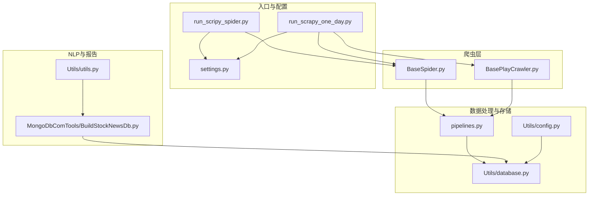
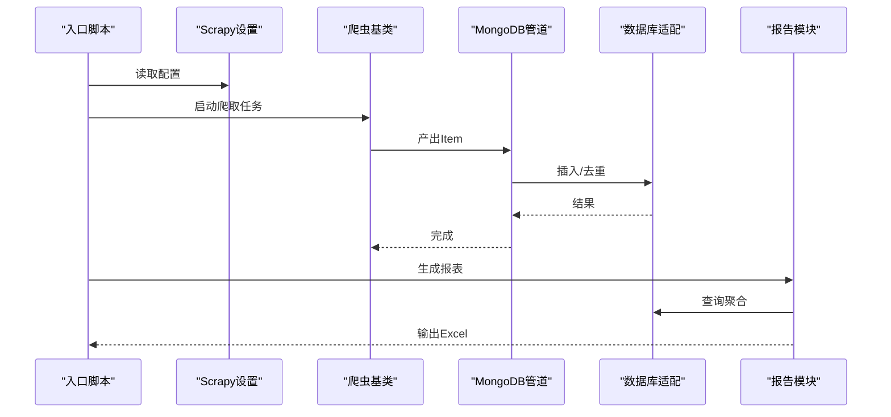
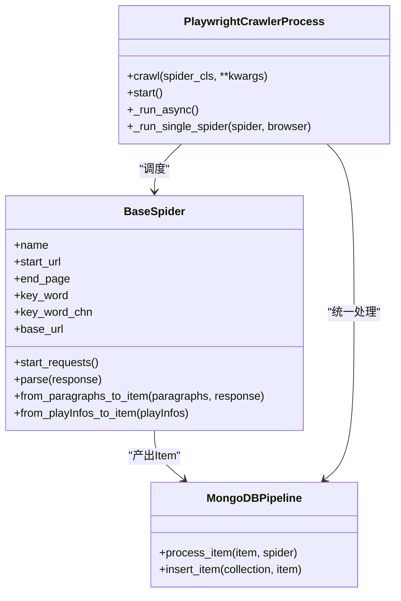
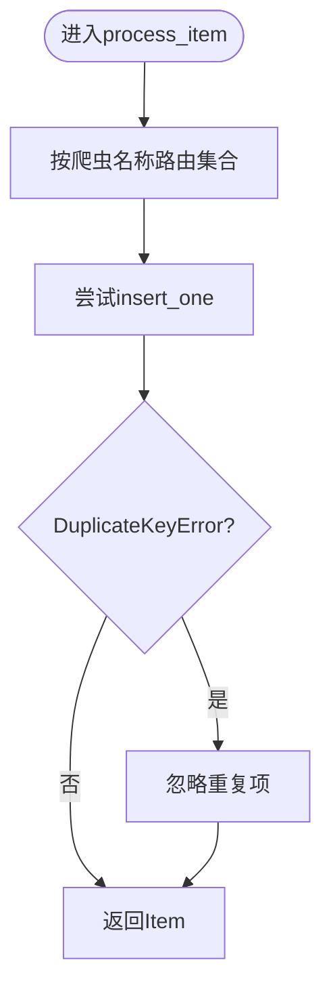
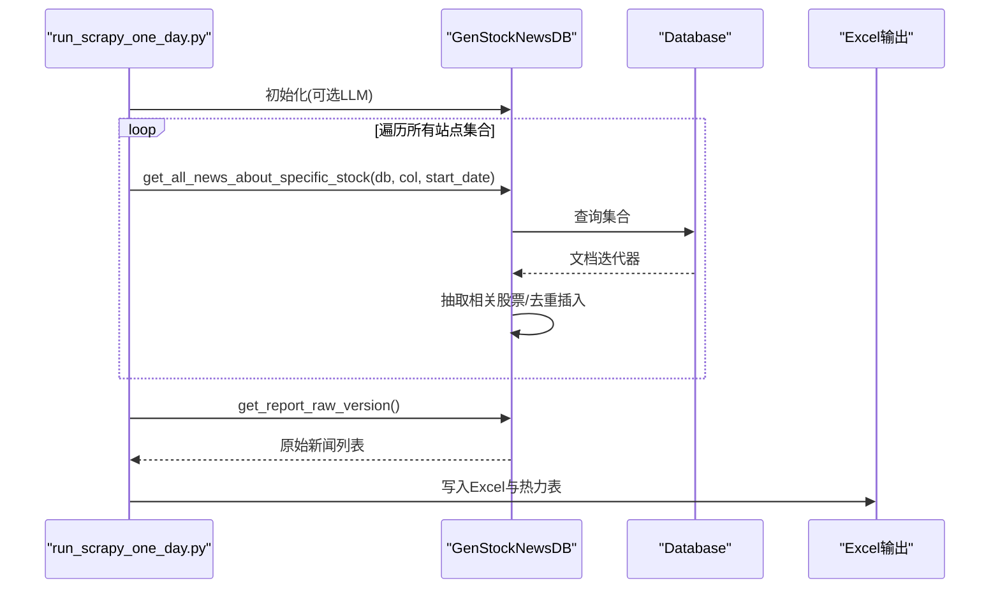
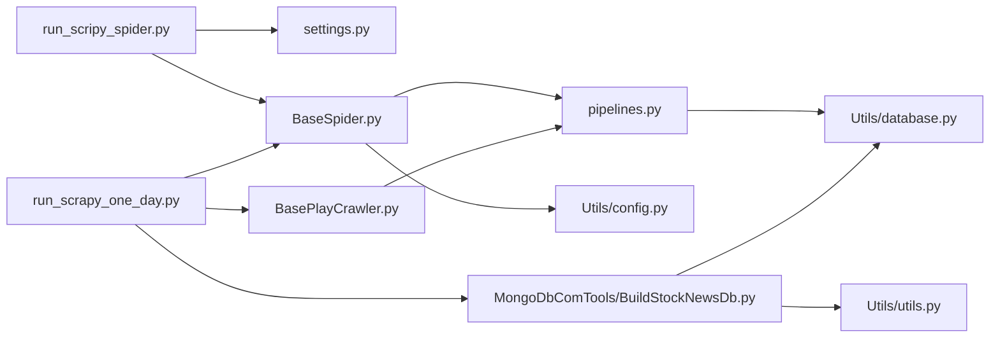

# 调试技巧指南

<cite>
**本文引用的文件**
- [README.md](file://README.md)
- [ProblemSolve.md](file://ProblemSolve.md)
- [src/settings.py](file://src/settings.py)
- [src/Utils/config.py](file://src/Utils/config.py)
- [src/Utils/utils.py](file://src/Utils/utils.py)
- [src/Utils/database.py](file://src/Utils/database.py)
- [src/pipelines.py](file://src/pipelines.py)
- [src/run_scripy_spider.py](file://src/run_scripy_spider.py)
- [src/run_scrapy_one_day.py](file://src/run_scrapy_one_day.py)
- [src/MarketNewsSpiderWithScrapy/BaseSpider.py](file://src/MarketNewsSpiderWithScrapy/BaseSpider.py)
- [src/MarketNewsSpiderWithScrapy/BasePlayCrawler.py](file://src/MarketNewsSpiderWithScrapy/BasePlayCrawler.py)
- [src/MongoDbComTools/BuildStockNewsDb.py](file://src/MongoDbComTools/BuildStockNewsDb.py)
- [src/QuantAnalyze/TestUtil.py](file://src/QuantAnalyze/TestUtil.py)
</cite>

## 目录
1. [引言](#引言)
2. [项目结构](#项目结构)
3. [核心组件](#核心组件)
4. [架构总览](#架构总览)
5. [详细组件分析](#详细组件分析)
6. [依赖分析](#依赖分析)
7. [性能考虑](#性能考虑)
8. [故障排查指南](#故障排查指南)
9. [结论](#结论)
10. [附录](#附录)

## 引言
本指南面向系统开发与维护工程师，聚焦于本项目在股票新闻采集、文本情感分析与存储流水线中的调试实践。内容覆盖：
- Python调试器与日志分析
- 断点调试与异常处理
- 单元测试与集成测试建议
- 远程调试、生产环境调试与分布式系统调试要点
- 内存分析、性能分析与并发问题调试
- 调试工具链配置与自动化调试流程
- 常见调试陷阱与规避方法

## 项目结构
该项目采用模块化组织，围绕“Scrapy爬虫 + Playwright异步调度 + MongoDB存储 + NLP情感分析”的数据流展开。关键目录与职责概览：
- src/Utils：通用配置、日志、数据库连接与工具函数
- src/MarketNewsSpiderWithScrapy：Scrapy爬虫基类与各站点爬虫
- src/MongoDbComTools：新闻聚合与报告生成
- src/NlpModel：文本预处理、情感建模与LLM打分
- src/run_scripy_spider.py 与 src/run_scrapy_one_day.py：入口脚本，统一调度爬虫与生成报告
- src/settings.py：Scrapy全局配置
- src/pipelines.py：MongoDB入库管道

**图示来源**
- [src/run_scripy_spider.py:117-142](file://src/run_scripy_spider.py#L117-L142)
- [src/run_scrapy_one_day.py:32-79](file://src/run_scrapy_one_day.py#L32-L79)
- [src/MarketNewsSpiderWithScrapy/BaseSpider.py:13-34](file://src/MarketNewsSpiderWithScrapy/BaseSpider.py#L13-L34)
- [src/MarketNewsSpiderWithScrapy/BasePlayCrawler.py:21-62](file://src/MarketNewsSpiderWithScrapy/BasePlayCrawler.py#L21-L62)
- [src/pipelines.py:8-46](file://src/pipelines.py#L8-L46)
- [src/Utils/database.py:36-60](file://src/Utils/database.py#L36-L60)
- [src/Utils/config.py:13-50](file://src/Utils/config.py#L13-L50)
- [src/MongoDbComTools/BuildStockNewsDb.py:19-53](file://src/MongoDbComTools/BuildStockNewsDb.py#L19-L53)
- [src/Utils/utils.py:18-27](file://src/Utils/utils.py#L18-L27)

**章节来源**
- [README.md:1-33](file://README.md#L1-L33)
- [src/settings.py:1-49](file://src/settings.py#L1-L49)
- [src/Utils/config.py:13-50](file://src/Utils/config.py#L13-L50)

## 核心组件
- 配置中心：集中管理数据库地址、端口、爬虫站点清单与模型路径等
- 爬虫基类：封装通用解析、股票代码抽取、情感打分与Item构造
- 异步调度器：基于Playwright的并发爬取与独立上下文隔离
- 数据管道：按站点路由入库，去重处理
- 数据库适配：带自动重连装饰器的MongoDB客户端
- 报告与聚合：按股票维度汇总新闻、生成报表

**章节来源**
- [src/Utils/config.py:13-50](file://src/Utils/config.py#L13-L50)
- [src/MarketNewsSpiderWithScrapy/BaseSpider.py:13-34](file://src/MarketNewsSpiderWithScrapy/BaseSpider.py#L13-L34)
- [src/MarketNewsSpiderWithScrapy/BasePlayCrawler.py:21-62](file://src/MarketNewsSpiderWithScrapy/BasePlayCrawler.py#L21-L62)
- [src/pipelines.py:8-46](file://src/pipelines.py#L8-L46)
- [src/Utils/database.py:15-34](file://src/Utils/database.py#L15-L34)
- [src/MongoDbComTools/BuildStockNewsDb.py:19-53](file://src/MongoDbComTools/BuildStockNewsDb.py#L19-L53)

## 架构总览
整体数据流从入口脚本触发，Scrapy或Playwright爬取站点，解析为标准化Item，经管道写入MongoDB，随后由报告模块聚合输出。

**图示来源**
- [src/run_scripy_spider.py:117-142](file://src/run_scripy_spider.py#L117-L142)
- [src/run_scrapy_one_day.py:32-79](file://src/run_scrapy_one_day.py#L32-L79)
- [src/MarketNewsSpiderWithScrapy/BaseSpider.py:41-98](file://src/MarketNewsSpiderWithScrapy/BaseSpider.py#L41-L98)
- [src/pipelines.py:25-46](file://src/pipelines.py#L25-L46)
- [src/Utils/database.py:78-88](file://src/Utils/database.py#L78-L88)
- [src/MongoDbComTools/BuildStockNewsDb.py:157-238](file://src/MongoDbComTools/BuildStockNewsDb.py#L157-L238)

## 详细组件分析

### 组件A：爬虫基类与异步调度器
- BaseSpider：负责解析段落、抽取股票代码、调用情感模型打分、构造Item并注入字段
- BasePlayCrawler：模拟Scrapy Request/Response，支持异步并发、独立Context、统一Pipeline处理

**图示来源**
- [src/MarketNewsSpiderWithScrapy/BaseSpider.py:13-149](file://src/MarketNewsSpiderWithScrapy/BaseSpider.py#L13-L149)
- [src/MarketNewsSpiderWithScrapy/BasePlayCrawler.py:21-120](file://src/MarketNewsSpiderWithScrapy/BasePlayCrawler.py#L21-L120)
- [src/pipelines.py:8-56](file://src/pipelines.py#L8-L56)

**章节来源**
- [src/MarketNewsSpiderWithScrapy/BaseSpider.py:41-98](file://src/MarketNewsSpiderWithScrapy/BaseSpider.py#L41-L98)
- [src/MarketNewsSpiderWithScrapy/BasePlayCrawler.py:41-118](file://src/MarketNewsSpiderWithScrapy/BasePlayCrawler.py#L41-L118)

### 组件B：数据管道与数据库适配
- pipelines.MongoDBPipeline：按爬虫名称映射到对应数据库集合，执行去重插入
- Utils.database.Database：提供自动重连装饰器、连接池、查询与更新接口

**图示来源**
- [src/pipelines.py:25-56](file://src/pipelines.py#L25-L56)

**章节来源**
- [src/pipelines.py:8-56](file://src/pipelines.py#L8-L56)
- [src/Utils/database.py:15-34](file://src/Utils/database.py#L15-L34)
- [src/Utils/database.py:94-172](file://src/Utils/database.py#L94-L172)

### 组件C：报告与聚合
- MongoDbComTools.BuildStockNewsDb：从各站点集合抽取新闻，识别相关股票，写入“全量新闻”集合，支持生成报表与TopN导出

**图示来源**
- [src/run_scrapy_one_day.py:81-194](file://src/run_scrapy_one_day.py#L81-L194)
- [src/MongoDbComTools/BuildStockNewsDb.py:157-238](file://src/MongoDbComTools/BuildStockNewsDb.py#L157-L238)
- [src/Utils/database.py:94-172](file://src/Utils/database.py#L94-L172)

**章节来源**
- [src/MongoDbComTools/BuildStockNewsDb.py:19-53](file://src/MongoDbComTools/BuildStockNewsDb.py#L19-L53)
- [src/run_scrapy_one_day.py:81-194](file://src/run_scrapy_one_day.py#L81-L194)

## 依赖分析
- 入口脚本依赖Scrapy设置与各站点爬虫定义
- 爬虫依赖配置中心与数据库适配
- 管道依赖数据库适配与配置
- 报告模块依赖数据库适配与NLP工具

**图示来源**
- [src/run_scripy_spider.py:117-142](file://src/run_scripy_spider.py#L117-L142)
- [src/run_scrapy_one_day.py:32-79](file://src/run_scrapy_one_day.py#L32-L79)
- [src/MarketNewsSpiderWithScrapy/BaseSpider.py:13-34](file://src/MarketNewsSpiderWithScrapy/BaseSpider.py#L13-L34)
- [src/MarketNewsSpiderWithScrapy/BasePlayCrawler.py:21-62](file://src/MarketNewsSpiderWithScrapy/BasePlayCrawler.py#L21-L62)
- [src/pipelines.py:8-46](file://src/pipelines.py#L8-L46)
- [src/Utils/database.py:36-60](file://src/Utils/database.py#L36-L60)
- [src/Utils/config.py:13-50](file://src/Utils/config.py#L13-L50)
- [src/MongoDbComTools/BuildStockNewsDb.py:19-53](file://src/MongoDbComTools/BuildStockNewsDb.py#L19-L53)
- [src/Utils/utils.py:18-27](file://src/Utils/utils.py#L18-L27)

**章节来源**
- [src/settings.py:1-49](file://src/settings.py#L1-L49)
- [src/Utils/config.py:439-450](file://src/Utils/config.py#L439-L450)

## 性能考虑
- 并发与限速
  - Scrapy设置中高并发与下载延迟需平衡，避免目标站点封禁与自身资源耗尽
  - Playwright并发通过独立Context隔离，减少Cookie干扰，但需关注内存占用
- 数据库连接与重连
  - 使用自动重连装饰器降低网络抖动影响
  - 合理设置连接池大小与超时时间
- I/O与序列化
  - 大批量写入建议使用批量接口（当前使用单条插入，可评估批量写入）
  - 文本处理与情感打分可能成为瓶颈，建议缓存中间结果或异步化

**章节来源**
- [src/settings.py:18-30](file://src/settings.py#L18-L30)
- [src/MarketNewsSpiderWithScrapy/BasePlayCrawler.py:47-58](file://src/MarketNewsSpiderWithScrapy/BasePlayCrawler.py#L47-L58)
- [src/Utils/database.py:15-34](file://src/Utils/database.py#L15-L34)
- [src/pipelines.py:48-56](file://src/pipelines.py#L48-L56)

## 故障排查指南

### 日志与断点调试
- 全局日志
  - 已在工具模块中配置基础日志格式，便于定位异常与性能瓶颈
- 断点调试建议
  - 在爬虫解析与情感打分处设置断点，检查抽取的股票代码、文章清洗与打分结果
  - 在管道插入前打印关键字段，确认去重键与路由逻辑

**章节来源**
- [src/Utils/utils.py:18-27](file://src/Utils/utils.py#L18-L27)
- [src/MarketNewsSpiderWithScrapy/BaseSpider.py:66-98](file://src/MarketNewsSpiderWithScrapy/BaseSpider.py#L66-L98)
- [src/pipelines.py:25-46](file://src/pipelines.py#L25-L46)

### 数据库与连接问题
- 自动重连与退避
  - 使用装饰器进行指数退避重连，降低瞬时故障影响
- 去重与重复数据
  - 插入前依据MD5去重，若仍出现重复，检查URL与时间戳组合键是否唯一

**章节来源**
- [src/Utils/database.py:15-34](file://src/Utils/database.py#L15-L34)
- [src/pipelines.py:48-56](file://src/pipelines.py#L48-L56)

### 爬虫与反爬对策
- 下载超时与代理
  - 设置合理超时与代理中间件，避免被站点识别为爬虫
- User-Agent轮换
  - 在设置中配置多个UA，降低被封概率

**章节来源**
- [src/settings.py:21-47](file://src/settings.py#L21-L47)

### 分布式与并发问题
- 并发爬取
  - Playwright并发任务共享Browser但独立Context，注意上下文切换与状态隔离
- 任务调度
  - 入口脚本按模块化函数添加不同站点任务，确保任务边界清晰

**章节来源**
- [src/MarketNewsSpiderWithScrapy/BasePlayCrawler.py:41-118](file://src/MarketNewsSpiderWithScrapy/BasePlayCrawler.py#L41-L118)
- [src/run_scripy_spider.py:17-114](file://src/run_scripy_spider.py#L17-L114)

### 生产环境调试
- 远程数据库
  - 配置中心支持本地/远程切换，生产环境优先使用远程数据库
- 安全与密钥
  - 使用加密存储的凭证，避免明文泄露

**章节来源**
- [src/Utils/config.py:13-19](file://src/Utils/config.py#L13-L19)
- [src/Utils/database.py:44-60](file://src/Utils/database.py#L44-L60)

### 常见陷阱与规避
- 忽略异常分支
  - 在报告聚合与数据库查询中增加异常捕获与日志记录
- 缺少去重键
  - 确保插入前计算稳定MD5键，避免重复写入
- 资源泄漏
  - 确保浏览器Context与数据库连接在finally中释放

**章节来源**
- [src/MongoDbComTools/BuildStockNewsDb.py:232-238](file://src/MongoDbComTools/BuildStockNewsDb.py#L232-L238)
- [src/pipelines.py:48-56](file://src/pipelines.py#L48-L56)
- [src/MarketNewsSpiderWithScrapy/BasePlayCrawler.py:116-118](file://src/MarketNewsSpiderWithScrapy/BasePlayCrawler.py#L116-L118)

## 结论
本指南总结了项目在爬虫、存储与报告环节的调试方法与最佳实践。通过合理的日志、断点、异常处理与并发控制，可显著提升问题定位与修复效率。建议持续完善单元测试与集成测试，结合自动化脚本与监控告警，形成闭环的调试与运维体系。

## 附录

### 单元测试与集成测试建议
- 单元测试
  - 对解析与情感打分函数进行输入/输出断言，覆盖边界条件
  - 对数据库查询与更新函数进行Mock测试，验证路由与去重逻辑
- 集成测试
  - 搭建最小化MongoDB与必要依赖，执行完整数据流，验证端到端正确性
  - 使用快照测试对比Excel输出一致性

**章节来源**
- [src/MarketNewsSpiderWithScrapy/BaseSpider.py:66-98](file://src/MarketNewsSpiderWithScrapy/BaseSpider.py#L66-L98)
- [src/Utils/database.py:94-172](file://src/Utils/database.py#L94-L172)
- [src/run_scrapy_one_day.py:106-185](file://src/run_scrapy_one_day.py#L106-L185)

### 调试工具链与自动化
- 工具链
  - Python调试器：pdb或IDE断点
  - 日志：统一格式化输出，分级记录
  - 性能分析：cProfile/line_profiler定位热点
  - 并发分析：asyncio调试与上下文监控
- 自动化
  - 将入口脚本参数化，支持定时任务与邮件通知
  - 在CI中执行轻量测试与静态检查

**章节来源**
- [src/Utils/utils.py:30-58](file://src/Utils/utils.py#L30-L58)
- [src/run_scrapy_one_day.py:187-192](file://src/run_scrapy_one_day.py#L187-L192)